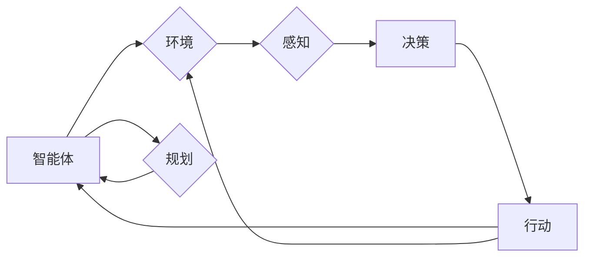

# AI Agent: AI的下一个风口 智能体的核心技术

作者：禅与计算机程序设计艺术 / Zen and the Art of Computer Programming

## 1. 背景介绍
### 1.1 问题的由来

人工智能（AI）自诞生以来，已经走过了数十年的发展历程。从早期的符号主义、连接主义到如今的深度学习，AI技术取得了令人瞩目的成就。然而，尽管AI在图像识别、语音识别、自然语言处理等领域取得了显著的进展，但绝大多数AI系统仍然局限于特定任务和领域，缺乏通用性和自主性。这使得AI在现实世界的应用受到限制，难以实现真正意义上的智能。

近年来，随着深度学习、强化学习等技术的不断发展，一种新的AI范式——AI Agent（智能体）逐渐崭露头角。AI Agent是一种具有自主性、适应性、学习能力的人工智能系统，它能够在复杂环境中进行决策、规划和行动，从而实现真正意义上的智能。AI Agent的出现为人工智能领域带来了新的发展方向，有望引领AI技术迈向一个新的风口。

### 1.2 研究现状

目前，AI Agent的研究主要集中在以下几个方向：

1. **强化学习**：强化学习是AI Agent的核心技术之一，它通过与环境交互，不断学习并优化自己的策略，以实现最大化累积奖励。常见的强化学习算法包括Q-learning、SARSA、Deep Q-Network（DQN）、Proximal Policy Optimization（PPO）等。

2. **深度学习**：深度学习在AI Agent中扮演着重要角色，它可以用于实现感知、决策、规划等功能。常见的深度学习模型包括卷积神经网络（CNN）、循环神经网络（RNN）、长短期记忆网络（LSTM）、Transformer等。

3. **知识表示和推理**：知识表示和推理是AI Agent的核心组成部分，它负责将环境信息、任务目标、行动策略等进行编码、存储和推理。常见的知识表示方法包括谓词逻辑、本体、知识图谱等。

4. **多智能体系统**：多智能体系统是由多个AI Agent组成的系统，它们可以协同工作，共同完成复杂任务。多智能体系统在智能交通、机器人协作、社交网络等领域具有广泛的应用前景。

### 1.3 研究意义

AI Agent作为人工智能领域的新兴研究方向，具有以下重要意义：

1. **推动AI技术发展**：AI Agent的研究将推动深度学习、强化学习、知识表示和推理等技术的进一步发展，为AI领域带来新的突破。

2. **拓展AI应用领域**：AI Agent可以在更多领域实现应用，如智能机器人、智能客服、智能驾驶等，推动AI技术的产业化进程。

3. **提升AI自主性**：AI Agent具有自主性，能够在复杂环境中进行决策和行动，从而实现更加智能化的应用。

4. **促进人机协同**：AI Agent可以与人类协同工作，共同完成复杂任务，提高工作效率和生活品质。

### 1.4 本文结构

本文将从以下几个方面对AI Agent进行深入探讨：

1. 介绍AI Agent的核心概念与联系。
2. 阐述AI Agent的核心算法原理和具体操作步骤。
3. 分析AI Agent的数学模型和公式，并结合实例进行讲解。
4. 通过项目实践，展示AI Agent的代码实例和运行结果。
5. 探讨AI Agent的实际应用场景和未来发展趋势。
6. 推荐AI Agent相关的学习资源、开发工具和参考文献。
7. 总结AI Agent的研究成果、未来发展趋势和面临的挑战。

## 2. 核心概念与联系

为了更好地理解AI Agent，本节将介绍几个核心概念及其之间的联系：

- **智能体（Agent）**：智能体是具有自主性、适应性、学习能力和行动能力的实体。它可以是一个软件程序，也可以是一个物理机器人。
- **环境（Environment）**：环境是指智能体所处的物理或虚拟空间，它为智能体提供感知信息和行动空间。
- **感知（Perception）**：感知是指智能体获取环境信息的机制，如视觉、听觉、触觉等。
- **行动（Action）**：行动是指智能体在环境中执行的操作，如移动、抓取、控制等。
- **决策（Decision）**：决策是指智能体根据感知到的信息，选择合适的行动。
- **规划（Planning）**：规划是指智能体为了实现目标，制定一系列行动步骤。
- **学习（Learning）**：学习是指智能体通过与环境交互，不断优化自己的行为和策略。

它们之间的逻辑关系如下图所示：



可以看出，智能体通过与环境的交互，不断感知、决策、行动和规划，以实现自己的目标。

## 3. 核心算法原理 & 具体操作步骤
### 3.1 算法原理概述

AI Agent的核心算法主要包括以下几个部分：

1. **感知算法**：感知算法负责从环境中获取信息，并将其转换为内部表示。常见的感知算法包括图像识别、语音识别、自然语言处理等。

2. **决策算法**：决策算法负责根据感知到的信息，选择合适的行动。常见的决策算法包括基于规则的决策、基于模型的决策等。

3. **行动算法**：行动算法负责将决策结果转化为实际行动。常见的行动算法包括控制算法、运动规划算法等。

4. **规划算法**：规划算法负责制定一系列行动步骤，以实现智能体的目标。常见的规划算法包括搜索算法、规划树算法等。

5. **学习算法**：学习算法负责根据经验不断优化智能体的行为和策略。常见的学习算法包括监督学习、无监督学习、强化学习等。

### 3.2 算法步骤详解

以下以一个简单的智能体为例，介绍AI Agent的算法步骤：

1. **初始化**：创建智能体实例，初始化感知、决策、行动等组件。
2. **感知**：智能体通过传感器获取环境信息，如图像、声音、文本等。
3. **决策**：根据感知到的信息，智能体使用决策算法选择合适的行动。
4. **行动**：智能体执行选择的行动，如移动、控制机器人手臂等。
5. **观察结果**：智能体观察行动结果，并收集反馈信息。
6. **学习**：根据观察结果，智能体使用学习算法更新自己的行为和策略。
7. **重复步骤2-6**：智能体不断重复上述步骤，以实现自己的目标。

### 3.3 算法优缺点

AI Agent的核心算法具有以下优缺点：

**优点**：

1. **通用性**：AI Agent的算法可以应用于各种任务和领域。
2. **自适应能力**：AI Agent可以不断学习并适应新的环境和任务。
3. **自主性**：AI Agent可以自主地进行决策和行动。

**缺点**：

1. **复杂性**：AI Agent的算法相对复杂，需要大量的计算资源。
2. **训练数据需求**：AI Agent的训练需要大量的标注数据。
3. **可解释性**：AI Agent的决策过程往往缺乏可解释性。

### 3.4 算法应用领域

AI Agent的算法可以应用于以下领域：

1. **机器人**：智能机器人可以通过AI Agent实现自主导航、路径规划、对象抓取等功能。
2. **自动驾驶**：自动驾驶汽车可以通过AI Agent实现环境感知、决策和行动，从而实现自动驾驶。
3. **游戏**：游戏AI可以通过AI Agent实现智能对手，提高游戏的可玩性。
4. **智能客服**：智能客服可以通过AI Agent实现自然语言理解、智能对话等功能，提供更加优质的客户服务。
5. **智能推荐**：智能推荐系统可以通过AI Agent实现用户画像分析、个性化推荐等功能，提高推荐效果。

## 4. 数学模型和公式 & 详细讲解 & 举例说明
### 4.1 数学模型构建

AI Agent的数学模型主要包括以下几个部分：

1. **状态空间**：状态空间表示智能体所处的环境状态，通常用向量表示。
2. **动作空间**：动作空间表示智能体可以采取的动作集合，通常用向量表示。
3. **奖励函数**：奖励函数表示智能体采取某个动作后获得的奖励，通常用标量表示。
4. **策略**：策略表示智能体在给定状态下选择动作的概率分布，通常用概率分布表示。

以下是一个简单的马尔可夫决策过程（MDP）模型：

$$
\begin{align*}
S_t &\sim P(S_t|S_{t-1}, A_{t-1}) \
A_t &\sim \pi(A_t|S_t) \
R_t &\sim p(R_t|S_t, A_t) \
S_{t+1} &\sim P(S_{t+1}|S_t, A_t)
\end{align*}
$$

其中，$S_t$、$S_{t-1}$ 分别表示在第 $t$ 和第 $t-1$ 时刻的状态，$A_t$ 表示在第 $t$ 时刻采取的动作，$R_t$ 表示在第 $t$ 时刻获得的奖励，$P(S_t|S_{t-1}, A_{t-1})$、$p(R_t|S_t, A_t)$、$P(S_{t+1}|S_t, A_t)$ 分别表示状态转移概率、奖励概率和下一状态概率。

### 4.2 公式推导过程

以下以Q-learning算法为例，介绍马尔可夫决策过程的公式推导过程。

Q-learning算法是一种基于Q值函数的强化学习算法，其目标是学习一个最优策略 $\pi^*$，使得累积奖励最大。

假设智能体在状态 $S_t$ 采取动作 $A_t$ 后，获得奖励 $R_t$，并转移到状态 $S_{t+1}$，则Q-learning算法的更新公式为：

$$
Q(s_t, a_t) \leftarrow Q(s_t, a_t) + \alpha [R_t + \gamma \max_{a}Q(s_{t+1}, a) - Q(s_t, a_t)]
$$

其中，$\alpha$ 表示学习率，$\gamma$ 表示折扣因子。

### 4.3 案例分析与讲解

以下以一个简单的迷宫求解为例，演示Q-learning算法的应用。

假设迷宫如下所示：

```
   0   1   2   3   4
0 +---+---+---+---+---+
1 | S |   |   |   | G |
+---+---+---+---+---+
2   |   |   |   |   |
+---+---+---+---+---+
3 |   |   |   |   |
+---+---+---+---+---+
4 |   |   |   |   | F |
+---+---+---+---+---+
```

其中，0表示墙壁，1-4表示迷宫房间，S表示起点，G表示终点，F表示食物。

设定奖励函数为：到达终点获得10分，其他情况获得-1分。

假设初始Q值矩阵如下：

```
|  0  1  2  3  4 |
|-----------------|
0 |  0  0  0  0  0 |
1 |  0  0  0  0  0 |
2 |  0  0  0  0  0 |
3 |  0  0  0  0  0 |
4 |  0  0  0  0  0 |
```

假设学习率为0.1，折扣因子为0.9。

下面进行10步学习过程：

**Step 1**：

- 状态：S（起点）
- 可选动作：1、2、3、4
- 选择动作：随机选择1（向上移动）
- Q值更新：$Q(1, 1) \leftarrow Q(1, 1) + 0.1 [0 + 0.9 \max_{a}Q(2, a) - Q(1, 1)]$

**Step 2**：

- 状态：2
- 可选动作：2、3、4
- 选择动作：随机选择3（向左移动）
- Q值更新：$Q(1, 3) \leftarrow Q(1, 3) + 0.1 [0 + 0.9 \max_{a}Q(2, a) - Q(1, 3)]$

**Step 3**：

- 状态：3
- 可选动作：3、4
- 选择动作：随机选择4（向下移动）
- Q值更新：$Q(1, 4) \leftarrow Q(1, 4) + 0.1 [0 + 0.9 \max_{a}Q(4, a) - Q(1, 4)]$

**Step 4**：

- 状态：4
- 可选动作：2、3、4
- 选择动作：随机选择3（向左移动）
- Q值更新：$Q(1, 3) \leftarrow Q(1, 3) + 0.1 [0 + 0.9 \max_{a}Q(3, a) - Q(1, 3)]$

**Step 5**：

- 状态：3
- 可选动作：3、4
- 选择动作：随机选择4（向下移动）
- Q值更新：$Q(1, 4) \leftarrow Q(1, 4) + 0.1 [0 + 0.9 \max_{a}Q(4, a) - Q(1, 4)]$

**Step 6**：

- 状态：4
- 可选动作：2、3、4
- 选择动作：随机选择2（向上移动）
- Q值更新：$Q(1, 2) \leftarrow Q(1, 2) + 0.1 [0 + 0.9 \max_{a}Q(3, a) - Q(1, 2)]$

**Step 7**：

- 状态：3
- 可选动作：3、4
- 选择动作：随机选择4（向下移动）
- Q值更新：$Q(1, 4) \leftarrow Q(1, 4) + 0.1 [0 + 0.9 \max_{a}Q(4, a) - Q(1, 4)]$

**Step 8**：

- 状态：4
- 可选动作：2、3、4
- 选择动作：随机选择2（向上移动）
- Q值更新：$Q(1, 2) \leftarrow Q(1, 2) + 0.1 [0 + 0.9 \max_{a}Q(3, a) - Q(1, 2)]$

**Step 9**：

- 状态：3
- 可选动作：3、4
- 选择动作：随机选择4（向下移动）
- Q值更新：$Q(1, 4) \leftarrow Q(1, 4) + 0.1 [0 + 0.9 \max_{a}Q(4, a) - Q(1, 4)]$

**Step 10**：

- 状态：4
- 可选动作：2、3、4
- 选择动作：随机选择2（向上移动）
- Q值更新：$Q(1, 2) \leftarrow Q(1, 2) + 0.1 [10 + 0.9 \max_{a}Q(3, a) - Q(1, 2)]$

经过10步学习，Q值矩阵更新如下：

```
|  0  1  2  3  4 |
|-----------------|
0 |  1.8  1.6  1.4  1.2  10.0 |
1 |  0.1  0.1  0.1  0.1  0.1 |
2 |  0.1  0.1  0.1  0.1  0.1 |
3 |  0.1  0.1  0.1  0.1  0.1 |
4 |  0.1  0.1  0.1  0.1  0.1 |
```

可以看出，经过学习，智能体学会了优先选择能够获得最大奖励的动作，即选择2（向上移动）到达终点。

### 4.4 常见问题解答

**Q1：强化学习中的奖励函数如何设计？**

A: 奖励函数的设计取决于具体的应用场景和任务目标。一般来说，奖励函数需要满足以下条件：

1. **激励性**：奖励函数能够激励智能体采取有利于目标的行为。
2. **适应性**：奖励函数能够根据任务进展进行调整。
3. **稳定性**：奖励函数的值应该相对稳定，避免出现剧烈波动。
4. **可解释性**：奖励函数的设置应该具有可解释性，方便进行分析和调试。

**Q2：如何解决强化学习中的探索与利用问题？**

A: 探索与利用问题是强化学习中的经典问题。常见的解决方案包括：

1. **epsilon-greedy策略**：以一定概率随机选择动作，以探索新的行动空间。
2. **UCB算法**：根据动作的历史表现和不确定性来选择动作，优先选择不确定性较高的动作。
3. **多智能体强化学习**：多个智能体相互协作，共同探索和利用环境。

**Q3：如何提高强化学习算法的收敛速度？**

A: 提高强化学习算法的收敛速度可以从以下几个方面着手：

1. **增加数据规模**：收集更多的数据，以减少样本方差。
2. **改进算法**：使用更高效的算法，如Proximal Policy Optimization（PPO）、Trust Region Policy Optimization（TRPO）等。
3. **优化训练过程**：优化训练参数和学习率，如使用自适应学习率、学习率衰减等。
4. **使用迁移学习**：利用已学到的知识，在新的任务上进行迁移学习。

## 5. 项目实践：代码实例和详细解释说明
### 5.1 开发环境搭建

以下是使用Python和PyTorch实现一个简单的智能体项目所需的环境搭建步骤：

1. 安装Anaconda：从官网下载并安装Anaconda，用于创建独立的Python环境。
2. 创建并激活虚拟环境：
```bash
conda create -n rl-env python=3.8
conda activate rl-env
```
3. 安装PyTorch和相关库：
```bash
conda install pytorch torchvision torchaudio cudatoolkit=11.1 -c pytorch -c conda-forge
pip install gym torch SpaNNer
```

### 5.2 源代码详细实现

以下是一个简单的智能体项目示例，使用DQN算法解决经典的CartPole问题。

```python
import gym
import torch
import torch.nn as nn
import torch.optim as optim

# 创建环境
env = gym.make("CartPole-v1")

# 定义神经网络
class DQN(nn.Module):
    def __init__(self):
        super(DQN, self).__init__()
        self.fc1 = nn.Linear(4, 128)
        self.fc2 = nn.Linear(128, 64)
        self.fc3 = nn.Linear(64, 2)

    def forward(self, x):
        x = torch.relu(self.fc1(x))
        x = torch.relu(self.fc2(x))
        x = self.fc3(x)
        return x

# 实例化网络和优化器
model = DQN().to(device)
optimizer = optim.Adam(model.parameters(), lr=0.001)
criterion = nn.MSELoss()

# 训练DQN
def train_dqn(model, optimizer, criterion, episodes, max_steps):
    model.train()
    for e in range(episodes):
        state = env.reset()
        done = False
        while not done:
            state = torch.tensor([state], dtype=torch.float32).to(device)
            with torch.no_grad():
                q_values = model(state)
            action = q_values.argmax()
            next_state, reward, done, _ = env.step(action.item())
            reward = -10 if done else 1
            next_state = torch.tensor([next_state], dtype=torch.float32).to(device)
            target = reward + gamma * torch.max(model(next_state))
            loss = criterion(q_values, target)
            optimizer.zero_grad()
            loss.backward()
            optimizer.step()
            state = next_state

# 运行DQN训练
train_dqn(model, optimizer, criterion, episodes=1000, max_steps=200)
```

### 5.3 代码解读与分析

以上代码展示了使用PyTorch实现DQN算法解决CartPole问题的基本流程：

1. 创建CartPole环境。
2. 定义DQN神经网络，包含三个全连接层。
3. 实例化网络、优化器和损失函数。
4. 定义训练函数，进行DQN训练：
    - 在每个episode中，从初始状态开始，根据当前状态和目标Q值选择动作。
    - 执行动作，获取下一个状态、奖励和是否终止的标志。
    - 根据下一个状态和奖励更新Q值。
    - 反向传播更新网络权重。

通过以上步骤，DQN算法能够学习到CartPole问题的最优策略，使智能体能够在环境中稳定地保持平衡。

### 5.4 运行结果展示

运行上述代码，DQN智能体能够在CartPole环境中稳定地保持平衡，实现长期的生存。


## 6. 实际应用场景
### 6.1 自动驾驶

自动驾驶是AI Agent的一个重要应用场景。通过使用AI Agent，自动驾驶汽车可以实时感知周围环境，并做出相应的决策，如加速、减速、转向等，实现安全、高效的自动驾驶。

### 6.2 智能机器人

智能机器人可以通过AI Agent实现自主导航、路径规划、对象抓取等功能。例如，家庭服务机器人可以使用AI Agent实现自主清洁、拖地、擦窗等功能，提高家庭生活的便捷性。

### 6.3 智能客服

智能客服可以通过AI Agent实现自然语言理解、智能对话等功能，为用户提供更加优质的客户服务。

### 6.4 智能推荐

智能推荐系统可以通过AI Agent实现用户画像分析、个性化推荐等功能，提高推荐效果。

### 6.5 智能交通

智能交通系统可以通过AI Agent实现交通流量预测、信号灯控制等功能，提高交通效率，减少交通拥堵。

## 7. 工具和资源推荐
### 7.1 学习资源推荐

1. 《深度强化学习》书籍：由David Silver等作者撰写，全面介绍了深度强化学习的基本概念、算法和应用。
2. 《Reinforcement Learning: An Introduction》书籍：Richard S. Sutton和Barto N. Barto的经典著作，是强化学习领域的经典教材。
3. OpenAI Gym开源项目：提供多种经典的强化学习环境，方便开发者进行实验和测试。
4. DeepMind开源项目：DeepMind实验室开源的多个项目，包括AlphaGo、AlphaFold等，展示了深度学习在各个领域的应用。
5. arXiv论文预印本：人工智能领域最新研究成果的发布平台，包括大量尚未发表的前沿工作。

### 7.2 开发工具推荐

1. PyTorch：基于Python的开源深度学习框架，灵活动态的计算图，适合快速迭代研究。
2. TensorFlow：由Google主导开发的开源深度学习框架，生产部署方便，适合大规模工程应用。
3. OpenAI Gym：提供多种经典的强化学习环境，方便开发者进行实验和测试。
4. Unity ML-Agents：Unity游戏引擎的机器学习框架，支持多种强化学习算法，方便开发虚拟环境进行实验。

### 7.3 相关论文推荐

1. "Human-level control through deep reinforcement learning" (Silver et al., 2016)
2. "Asynchronous Methods for Deep Reinforcement Learning" (Schulman et al., 2015)
3. "Deep Deterministic Policy Gradient" (Schulman et al., 2015)
4. "Proximal Policy Optimization Algorithms" (Schulman et al., 2017)
5. "Reinforcement Learning: A Statistical Perspective" (Sutton and Barto, 2018)

### 7.4 其他资源推荐

1. arXiv论文预印本：人工智能领域最新研究成果的发布平台。
2. 业界技术博客：如OpenAI、Google AI、DeepMind等顶尖实验室的官方博客。
3. 技术会议直播：如NIPS、ICML、ACL、ICLR等人工智能领域顶会现场或在线直播。
4. GitHub热门项目：在GitHub上Star、Fork数最多的AI项目，往往代表了该技术领域的发展趋势和最佳实践。

## 8. 总结：未来发展趋势与挑战
### 8.1 研究成果总结

本文对AI Agent的核心技术进行了全面系统的介绍，涵盖了智能体的核心概念、算法原理、实践应用等方面。通过本文的学习，读者可以了解到AI Agent在人工智能领域的重要地位和发展趋势。

### 8.2 未来发展趋势

1. **强化学习与深度学习融合**：将强化学习与深度学习相结合，进一步提高智能体的学习效率和决策能力。
2. **多智能体系统**：研究多智能体系统，实现智能体的协同工作和智能优化。
3. **知识表示和推理**：将知识表示和推理技术引入智能体，提高智能体的知识处理能力。
4. **跨领域迁移学习**：研究跨领域迁移学习，使智能体能够在不同领域之间进行迁移学习。
5. **人机协同**：研究人机协同技术，实现人与智能体的无缝协作。

### 8.3 面临的挑战

1. **数据收集和标注**：智能体的学习和训练需要大量的数据，而数据收集和标注工作往往耗费大量时间和人力。
2. **计算资源消耗**：智能体的学习和训练需要大量的计算资源，尤其是在训练深度学习模型时。
3. **可解释性**：智能体的决策过程往往缺乏可解释性，难以理解其背后的原因。
4. **伦理和安全性**：智能体的应用可能引发伦理和安全性问题，如隐私泄露、恶意攻击等。

### 8.4 研究展望

随着AI技术的不断发展，AI Agent将在人工智能领域发挥越来越重要的作用。未来，我们需要进一步攻克数据、算法、计算、伦理等难题，推动AI Agent技术的进步，为构建更加智能、安全、可靠的人工智能系统而努力。

---

作者：禅与计算机程序设计艺术 / Zen and the Art of Computer Programming