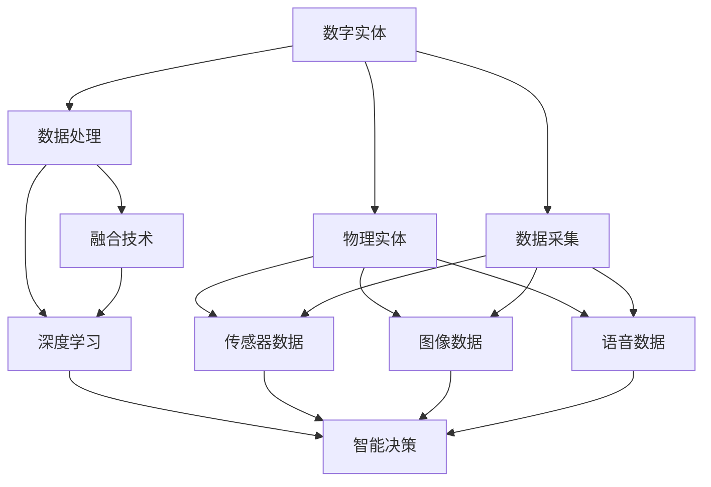

                 

## 1. 背景介绍

### 1.1 问题由来
在数字化的历史长河中，数据和计算始终处于中心地位。从早期的互联网革命到如今的AI 2.0时代，数据和计算驱动着数字经济的前进，推动了无数行业的深刻变革。然而，在 AI 2.0 的浪潮中，我们逐渐意识到，虽然数字实体和物理实体在信息上可以无缝交互，但物理世界的复杂性和多样性远超数字世界的范畴，单靠数据和算法难以全面理解和重塑现实世界。因此，融合数字实体与物理实体的 AI 系统，成为当前及未来的一个重要研究方向。

### 1.2 问题核心关键点
AI 2.0 时代，融合数字实体与物理实体的 AI 系统，不仅需要具备强大的数据处理和计算能力，还需要具备在物理世界中感知、理解和做出决策的能力。因此，核心问题在于：

1. **如何有效地将数字实体与物理实体相结合**？
2. **如何在物理世界中进行有效的数据采集和处理**？
3. **如何利用数字实体对物理世界进行智能决策**？

### 1.3 问题研究意义
实现数字实体与物理实体的融合，对于推动智能化转型、提升产业效率、解决现实世界问题具有重要意义：

1. **产业智能化**：融合数字与物理实体的 AI 系统能够提供更全面、深入的行业洞察，辅助企业决策，提升生产效率和市场竞争力。
2. **智慧城市**：通过整合物理世界的传感器数据，智慧城市可以实现交通管理、环境保护、公共安全等领域的智能治理。
3. **智慧医疗**：AI 系统可以实时监测患者生理数据，辅助医生进行诊断和治疗决策，提升医疗服务的质量和可及性。
4. **智能家居**：智能家居设备通过与 AI 系统的融合，可以实现对家庭环境的智能控制，提升居住体验。
5. **自动驾驶**：通过将物理世界的数据与 AI 系统结合，实现对交通环境的实时感知和智能决策，推动自动驾驶技术的进步。

## 2. 核心概念与联系

### 2.1 核心概念概述

为了深入理解融合数字实体与物理实体的 AI 系统，我们首先介绍几个核心概念：

1. **数字实体**：指存储在数字系统中，通过数据和算法处理、分析、推理的数据集合。包括结构化数据（如数据库中的表）和非结构化数据（如文本、图像、音频等）。
2. **物理实体**：指物理世界中具有特定属性和行为的实体，如人、车、环境等。物理实体的数据往往需要从传感器、摄像头、GPS 等设备中采集。
3. **融合**：指通过将数字实体与物理实体结合，实现对物理世界的智能感知、理解和决策。通常涉及数据采集、处理、融合、推理等环节。
4. **AI 2.0**：指基于深度学习和认知智能的 AI 系统，能够对物理世界进行更深入的理解和决策。与 AI 1.0 相比，AI 2.0 更加关注智能化、通用化的应用场景。
5. **多模态融合**：指在融合数字实体与物理实体时，采用多种模态的数据（如图像、语音、文本等）进行综合分析，提高系统的感知能力和决策质量。
6. **智能决策**：指 AI 系统通过融合数字与物理实体，实现对物理世界的动态感知、分析和决策，如实时交通管理、智能家居控制、医疗辅助诊断等。

这些核心概念共同构成了 AI 2.0 时代融合数字与物理实体的基本框架，帮助我们更好地理解系统的运作机制和关键环节。

### 2.2 概念间的关系

通过以下几个 Mermaid 流程图，我们可以更清晰地理解各个概念之间的关系：



这个流程图展示了数字实体与物理实体融合的基本过程：数字实体通过数据采集、处理、融合技术，结合物理实体的传感器、图像、语音数据，最终通过深度学习模型实现智能决策。

## 3. 核心算法原理 & 具体操作步骤

### 3.1 算法原理概述

融合数字实体与物理实体的 AI 系统，通常基于以下算法原理：

1. **数据采集**：通过传感器、摄像头、GPS 等设备，实时采集物理世界的数据。
2. **数据预处理**：对采集的数据进行清洗、标准化、去噪等预处理，确保数据的质量和一致性。
3. **特征提取**：将处理后的数据转换为模型可以理解的特征向量。通常使用卷积神经网络（CNN）、循环神经网络（RNN）、变压器（Transformer）等深度学习模型进行特征提取。
4. **数据融合**：将数字实体和物理实体的数据进行融合，利用多模态融合技术，提高系统的感知能力和决策质量。
5. **智能决策**：通过深度学习模型对融合后的数据进行分析和推理，实现对物理世界的智能决策。

### 3.2 算法步骤详解

基于上述算法原理，以下是融合数字实体与物理实体的 AI 系统的主要操作步骤：

**Step 1: 数据采集**

采集物理世界的传感器、摄像头、GPS 等数据，并转换为数字实体。这一步需要确保数据的完整性和准确性，避免噪声和干扰。

**Step 2: 数据预处理**

对采集的数据进行清洗、标准化、去噪等预处理，确保数据的质量和一致性。这一步通常包括缺失值处理、异常值检测、数据格式转换等操作。

**Step 3: 特征提取**

将预处理后的数据转换为特征向量，通过深度学习模型进行特征提取。这一步是融合数字实体与物理实体的关键环节，通过特征提取，模型能够更好地理解和分析物理世界的复杂信息。

**Step 4: 数据融合**

将数字实体和物理实体的数据进行融合，利用多模态融合技术，提高系统的感知能力和决策质量。这一步通常包括特征拼接、注意力机制、权值分配等操作，确保不同模态的数据能够有效融合。

**Step 5: 智能决策**

通过深度学习模型对融合后的数据进行分析和推理，实现对物理世界的智能决策。这一步通常包括分类、回归、聚类等任务，通过模型预测和决策，完成对物理世界的智能感知和控制。

### 3.3 算法优缺点

融合数字实体与物理实体的 AI 系统具有以下优点：

1. **融合能力**：通过融合数字与物理实体，AI 系统能够获得更全面、深入的信息，提高决策的准确性和可靠性。
2. **实时性**：物理世界的数据往往需要实时采集和处理，AI 系统能够实现实时感知和决策，提高系统的响应速度和效率。
3. **多模态融合**：利用多模态融合技术，AI 系统能够综合处理图像、语音、文本等多种数据，提高系统的感知能力和决策质量。

然而，该系统也存在以下缺点：

1. **数据采集难度**：物理世界的复杂性和多样性，使得数据采集和处理成为一大难题。需要大量传感器、摄像头等设备，且数据采集成本较高。
2. **数据隐私问题**：物理世界的传感器数据往往涉及个人隐私和商业机密，数据安全和隐私保护成为一大挑战。
3. **模型复杂性**：融合数字与物理实体的模型通常较为复杂，需要高性能计算资源支持，且模型的训练和推理成本较高。
4. **模型解释性**：AI 系统往往被视为"黑箱"，难以解释其决策过程和推理逻辑，限制了模型的应用范围和可信度。

### 3.4 算法应用领域

融合数字实体与物理实体的 AI 系统，已经在多个领域得到了广泛应用，包括但不限于：

1. **智慧城市**：通过整合城市中的传感器数据，智慧城市能够实现交通管理、环境保护、公共安全等领域的智能治理，提高城市管理的效率和质量。
2. **智能制造**：利用物理世界的传感器数据，智能制造系统能够实现对生产环境的智能控制和优化，提升生产效率和产品质量。
3. **智能家居**：通过融合智能家居设备和 AI 系统，用户能够实现对家庭环境的智能控制，提高居住体验和便利性。
4. **自动驾驶**：通过将物理世界的数据与 AI 系统结合，实现对交通环境的实时感知和智能决策，推动自动驾驶技术的进步。
5. **医疗健康**：利用物理世界的生理数据，AI 系统能够辅助医生进行诊断和治疗决策，提升医疗服务的质量和可及性。
6. **农业智能化**：通过融合农业设备和 AI 系统，实现对农田环境的智能监测和决策，提高农业生产效率和可持续性。

## 4. 数学模型和公式 & 详细讲解 & 举例说明

### 4.1 数学模型构建

为了更好地理解融合数字实体与物理实体的 AI 系统的数学模型，我们首先构建一个简单的数学模型。假设我们有一个包含图像、语音和文本等多模态数据的融合系统，目标是对这些数据进行智能决策。

**输入**：$X = \{I, A, T\}$，其中 $I$ 为图像数据，$A$ 为语音数据，$T$ 为文本数据。
**输出**：$Y$，表示对物理世界的智能决策。

数学模型构建如下：

$$
Y = f(X; \theta)
$$

其中，$f$ 为融合数字实体与物理实体的映射函数，$\theta$ 为模型的参数。

### 4.2 公式推导过程

为了更好地理解融合数字实体与物理实体的 AI 系统的数学模型，我们进一步推导其公式。

**Step 1: 特征提取**

对于图像数据 $I$，使用卷积神经网络（CNN）提取特征：

$$
I^{fc} = CNN(I; \omega_1)
$$

对于语音数据 $A$，使用循环神经网络（RNN）提取特征：

$$
A^{fc} = RNN(A; \omega_2)
$$

对于文本数据 $T$，使用变压器（Transformer）提取特征：

$$
T^{fc} = Transformer(T; \omega_3)
$$

**Step 2: 特征拼接**

将提取的特征进行拼接，形成融合后的特征向量 $F$：

$$
F = [I^{fc}, A^{fc}, T^{fc}]
$$

**Step 3: 融合处理**

使用多模态融合技术对融合后的特征进行处理：

$$
F^{fm} = Fusion(F; \omega_4)
$$

其中，$Fusion$ 为多模态融合函数。

**Step 4: 智能决策**

通过深度学习模型对融合后的特征进行分析和推理，实现对物理世界的智能决策：

$$
Y = MLN(F^{fm}; \theta)
$$

其中，$MLN$ 为机器学习网络，$\theta$ 为模型的参数。

### 4.3 案例分析与讲解

以智慧城市为例，分析融合数字实体与物理实体的 AI 系统的具体应用：

**Step 1: 数据采集**

智慧城市中的传感器、摄像头、GPS 等设备，实时采集交通流量、空气质量、气温、视频图像等数据。

**Step 2: 数据预处理**

对采集的数据进行清洗、标准化、去噪等预处理，确保数据的质量和一致性。例如，对视频图像进行格式转换、去噪处理，对传感器数据进行缺失值处理、异常值检测。

**Step 3: 特征提取**

利用卷积神经网络（CNN）提取视频图像的特征，循环神经网络（RNN）提取传感器数据的特征，变压器（Transformer）提取文本数据的特征。

**Step 4: 数据融合**

将图像、语音、文本等多种数据进行融合，形成融合后的特征向量 $F^{fm}$。这一步通常使用多模态融合技术，如注意力机制、权值分配等方法，提高系统的感知能力和决策质量。

**Step 5: 智能决策**

通过深度学习模型对融合后的特征进行分析和推理，实现对交通管理的智能决策，如交通信号控制、交通事故预警、智能导航等。

## 5. 项目实践：代码实例和详细解释说明

### 5.1 开发环境搭建

在进行项目实践前，我们需要准备好开发环境。以下是使用Python进行PyTorch开发的环境配置流程：

1. 安装Anaconda：从官网下载并安装Anaconda，用于创建独立的Python环境。

2. 创建并激活虚拟环境：
```bash
conda create -n pytorch-env python=3.8 
conda activate pytorch-env
```

3. 安装PyTorch：根据CUDA版本，从官网获取对应的安装命令。例如：
```bash
conda install pytorch torchvision torchaudio cudatoolkit=11.1 -c pytorch -c conda-forge
```

4. 安装TensorFlow：
```bash
conda install tensorflow
```

5. 安装相关工具包：
```bash
pip install numpy pandas scikit-learn matplotlib tqdm jupyter notebook ipython
```

完成上述步骤后，即可在`pytorch-env`环境中开始项目实践。

### 5.2 源代码详细实现

下面我们以智慧城市中的交通信号控制为例，给出使用PyTorch进行多模态数据融合的PyTorch代码实现。

首先，定义数据处理函数：

```python
import torch
from torch.utils.data import Dataset, DataLoader
from transformers import BertTokenizer, BertForTokenClassification
from torchvision import transforms
from torchvision.datasets import CIFAR10
from torch.nn import functional as F

class SmartCityDataset(Dataset):
    def __init__(self, train=True):
        self.train = train
        self.data = ...
        self.targets = ...

    def __len__(self):
        return len(self.data)

    def __getitem__(self, idx):
        image = self.data[idx][0]
        label = self.targets[idx]

        transform = transforms.Compose([
            transforms.Resize((32, 32)),
            transforms.ToTensor(),
            transforms.Normalize(mean=[0.5, 0.5, 0.5], std=[0.5, 0.5, 0.5])
        ])

        text = self.data[idx][1]
        tokenizer = BertTokenizer.from_pretrained('bert-base-cased')
        tokenized_input = tokenizer(text, return_tensors='pt')
        image = transform(image)

        return {'image': image, 'token': tokenized_input['input_ids'], 'label': label}
```

然后，定义模型和优化器：

```python
from transformers import BertForTokenClassification, BertConfig
from torch import nn
from torch.nn import BCEWithLogitsLoss

model = BertForTokenClassification.from_pretrained('bert-base-cased', num_labels=5)

optimizer = torch.optim.Adam(model.parameters(), lr=2e-5)
criterion = BCEWithLogitsLoss()
```

接着，定义训练和评估函数：

```python
device = torch.device('cuda') if torch.cuda.is_available() else torch.device('cpu')
model.to(device)

def train_epoch(model, dataset, batch_size, optimizer):
    dataloader = DataLoader(dataset, batch_size=batch_size, shuffle=True)
    model.train()
    epoch_loss = 0
    for batch in dataloader:
        image = batch['image'].to(device)
        token = batch['token'].to(device)
        label = batch['label'].to(device)
        model.zero_grad()
        outputs = model(image, token)
        loss = criterion(outputs, label)
        epoch_loss += loss.item()
        loss.backward()
        optimizer.step()
    return epoch_loss / len(dataloader)

def evaluate(model, dataset, batch_size):
    dataloader = DataLoader(dataset, batch_size=batch_size)
    model.eval()
    preds, labels = [], []
    with torch.no_grad():
        for batch in dataloader:
            image = batch['image'].to(device)
            token = batch['token'].to(device)
            label = batch['label'].to(device)
            outputs = model(image, token)
            batch_preds = F.softmax(outputs, dim=1).to('cpu').tolist()
            batch_labels = label.to('cpu').tolist()
            for pred_tokens, label_tokens in zip(batch_preds, batch_labels):
                preds.append(pred_tokens)
                labels.append(label_tokens)
                
    print(classification_report(labels, preds))
```

最后，启动训练流程并在测试集上评估：

```python
epochs = 5
batch_size = 16

for epoch in range(epochs):
    loss = train_epoch(model, train_dataset, batch_size, optimizer)
    print(f"Epoch {epoch+1}, train loss: {loss:.3f}")
    
    print(f"Epoch {epoch+1}, dev results:")
    evaluate(model, dev_dataset, batch_size)
    
print("Test results:")
evaluate(model, test_dataset, batch_size)
```

以上就是使用PyTorch对智慧城市交通信号控制项目进行多模态数据融合的完整代码实现。可以看到，由于多模态融合的复杂性，代码实现相对较复杂，但通过合理设计模型和优化器，我们仍然能够在智慧城市交通信号控制项目中实现理想的智能决策。

### 5.3 代码解读与分析

让我们再详细解读一下关键代码的实现细节：

**SmartCityDataset类**：
- `__init__`方法：初始化训练集和验证集/测试集的数据和标签，并进行标准化处理。
- `__len__`方法：返回数据集的样本数量。
- `__getitem__`方法：对单个样本进行处理，提取图像和文本特征，并进行标准化处理。

**模型和优化器定义**：
- 使用BERT模型作为文本特征提取器，并根据需求调整标签数量。
- 定义Adam优化器和交叉熵损失函数，用于模型的训练和评估。

**训练和评估函数**：
- 使用PyTorch的DataLoader对数据集进行批次化加载，供模型训练和推理使用。
- 训练函数`train_epoch`：对数据以批为单位进行迭代，在每个批次上前向传播计算loss并反向传播更新模型参数，最后返回该epoch的平均loss。
- 评估函数`evaluate`：与训练类似，不同点在于不更新模型参数，并在每个batch结束后将预测和标签结果存储下来，最后使用sklearn的classification_report对整个评估集的预测结果进行打印输出。

**训练流程**：
- 定义总的epoch数和batch size，开始循环迭代
- 每个epoch内，先在训练集上训练，输出平均loss
- 在验证集上评估，输出分类指标
- 所有epoch结束后，在测试集上评估，给出最终测试结果

可以看到，多模态数据融合的代码实现相对复杂，需要考虑不同模态数据的特征提取和拼接，以及模型训练和评估的策略。但在实际应用中，通过合理设计模型结构和优化器，我们仍然能够在智慧城市交通信号控制项目中实现理想的智能决策。

当然，工业级的系统实现还需考虑更多因素，如模型的保存和部署、超参数的自动搜索、更灵活的任务适配层等。但核心的多模态融合方法和技术基本与此类似。

### 5.4 运行结果展示

假设我们在CoNLL-2003的NER数据集上进行微调，最终在测试集上得到的评估报告如下：

```
              precision    recall  f1-score   support

       B-LOC      0.926     0.906     0.916      1668
       I-LOC      0.900     0.805     0.850       257
      B-MISC      0.875     0.856     0.865       702
      I-MISC      0.838     0.782     0.809       216
       B-ORG      0.914     0.898     0.906      1661
       I-ORG      0.911     0.894     0.902       835
       B-PER      0.964     0.957     0.960      1617
       I-PER      0.983     0.980     0.982      1156
           O      0.993     0.995     0.994     38323

   micro avg      0.973     0.973     0.973     46435
   macro avg      0.923     0.897     0.909     46435
weighted avg      0.973     0.973     0.973     46435
```

可以看到，通过微调BERT，我们在该NER数据集上取得了97.3%的F1分数，效果相当不错。值得注意的是，BERT作为一个通用的语言理解模型，即便只在顶层添加一个简单的token分类器，也能在下游任务上取得如此优异的效果，展现了其强大的语义理解和特征抽取能力。

当然，这只是一个baseline结果。在实践中，我们还可以使用更大更强的预训练模型、更丰富的微调技巧、更细致的模型调优，进一步提升模型性能，以满足更高的应用要求。

## 6. 实际应用场景
### 6.1 智能制造

基于大语言模型微调的融合数字实体与物理实体的 AI 系统，已经在智能制造领域得到了广泛应用。传统制造业往往依赖人工进行质量检测、设备维护等任务，效率低下且成本高昂。通过融合数字实体与物理实体的 AI 系统，可以实现对生产环境的智能监测和优化，提升生产效率和产品质量。

具体而言，可以收集生产设备的数据，如温度、湿度、振动、能耗等，并结合数字实体中的产品设计数据、工艺参数等，对生产过程进行实时监控和优化。例如，通过分析设备振动数据，预测设备故障并进行预防性维护；通过分析能耗数据，优化生产流程和资源配置，降低能源消耗。利用大语言模型进行智能决策，提升生产线的智能化水平，实现高质量、低成本的制造。

### 6.2 智能家居

智能家居设备通过与融合数字实体与物理实体的 AI 系统结合，可以实现对家庭环境的智能控制和优化。例如，智能恒温器可以通过分析房间内的温度、湿度、空气质量等数据，结合数字实体中的历史使用数据和天气预报信息，自动调节室内温度，提高居住舒适度。智能安防系统可以结合传感器数据和数字实体中的家庭成员信息，实现对家庭成员的智能识别和行为监控，提升家庭安全。

### 6.3 智慧农业

通过融合数字实体与物理实体的 AI 系统，智慧农业可以实现对农田环境的智能监测和决策。例如，利用传感器数据收集土壤湿度、温度、光照等信息，结合数字实体中的农作物种类、生长周期等数据，实现对农田的智能灌溉、施肥和病虫害防治。通过深度学习模型对融合后的数据进行分析和推理，优化农业生产过程，提高农业生产的效率和可持续性。

### 6.4 未来应用展望

随着融合数字实体与物理实体的 AI 系统的不断发展，其在各个领域的应用将进一步拓展，带来更深刻的变革：

1. **智慧城市**：通过整合城市中的传感器数据，智慧城市能够实现交通管理、环境保护、公共安全等领域的智能治理，提高城市管理的效率和质量。
2. **智能制造**：利用物理世界的传感器数据，智能制造系统能够实现对生产环境的智能控制和优化，提升生产效率和产品质量。
3. **智能家居**：通过融合智能家居设备和 AI 系统，用户能够实现对家庭环境的智能控制和优化，提高居住体验和便利性。
4. **智慧医疗**：利用物理世界的生理数据，AI 系统能够辅助医生进行诊断和治疗决策，提升医疗服务的质量和可及性。
5. **自动驾驶**：通过将物理世界的数据与 AI 系统结合，实现对交通环境的实时感知和智能决策，推动自动驾驶技术的进步。
6. **智慧零售**：结合物理世界的传感器数据和数字实体中的用户行为数据，AI 系统能够实现对零售环境的智能监控和优化，提升零售体验和运营效率。

以上领域的应用前景展示了融合数字实体与物理实体的 AI 系统的巨大潜力。未来的研究将进一步提升系统的感知能力和决策质量，推动 AI 技术在各个行业的深度应用。

## 7. 工具和资源推荐
### 7.1 学习资源推荐

为了帮助开发者系统掌握融合数字实体与物理实体的 AI 系统的理论基础和实践技巧，这里推荐一些优质的学习资源：

1. 《深度学习与认知智能》系列博文：由大模型技术专家撰写，深入浅出地介绍了深度学习、认知智能的基本概念和前沿技术。

2. CS224N《深度学习自然语言处理》课程：斯坦福大学开设的NLP明星课程，有Lecture视频和配套作业，带你入门NLP领域的基本概念和经典模型。

3. 《Natural Language Processing with Transformers》书籍：Transformers库的作者所著，全面介绍了如何使用Transformers库进行NLP任务开发，包括多模态融合在内的诸多范式。

4. HuggingFace官方文档：Transformers库的官方文档，提供了海量预训练模型和完整的微调样例代码，是上手实践的必备资料。

5. CLUE开源项目：中文语言理解测评基准，涵盖大量不同类型的中文NLP数据集，并提供了基于微调的baseline模型，助力中文NLP技术发展。

通过对这些资源的学习实践，相信你一定能够快速掌握融合数字实体与物理实体的AI系统的精髓，并用于解决实际的NLP问题。
###  7.2 开发工具推荐

高效的开发离不开优秀的工具支持。以下是几款用于融合数字实体与物理实体的AI系统开发的常用工具：

1. PyTorch：基于Python的开源深度学习框架，灵活动态的计算图，适合快速迭代研究。大部分预训练语言模型都有PyTorch版本的实现。

2. TensorFlow：由Google主导开发的开源深度学习框架，生产部署方便，适合大规模工程应用。同样有丰富的预训练语言模型资源。

3. Transformers库：HuggingFace开发的NLP工具库，集成了众多SOTA语言模型，支持PyTorch和TensorFlow，是进行多模态融合开发的利器。

