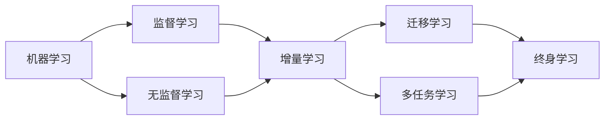

# 终身学习Lifelong Learning原理与代码实例讲解

作者：禅与计算机程序设计艺术 / Zen and the Art of Computer Programming

## 1. 背景介绍
### 1.1 问题的由来

在人工智能领域，机器学习模型被广泛应用于各种任务，如图像识别、自然语言处理、推荐系统等。然而，传统机器学习模型的局限性在于它们通常只能针对单一任务进行训练，无法有效地迁移到其他任务。这限制了机器学习模型的应用范围和效率。为了解决这一问题，终身学习（Lifelong Learning）应运而生。终身学习旨在使机器学习模型能够从新任务中学习并保持旧任务的知识，从而实现知识的持续积累和迁移。

### 1.2 研究现状

终身学习作为机器学习的一个分支，近年来受到了广泛关注。研究者们提出了多种终身学习方法，如在线学习、增量学习、迁移学习等。其中，基于模型的终身学习方法通过设计合适的模型架构和训练策略，使模型能够有效地学习新任务并保持旧任务的知识。

### 1.3 研究意义

终身学习技术在以下方面具有重要意义：

- **提高学习效率**：通过知识迁移，模型可以快速学习新任务，减少训练时间和计算资源消耗。
- **拓宽应用范围**：模型能够适应更多任务，提高机器学习系统的通用性。
- **保持知识积累**：模型能够持续学习新知识，避免知识遗忘，提高模型的长期性能。

### 1.4 本文结构

本文将介绍终身学习（Lifelong Learning）的原理、核心算法、代码实例以及实际应用场景。文章结构如下：

- 第2部分：介绍终身学习的核心概念和联系。
- 第3部分：详细阐述终身学习的核心算法原理和具体操作步骤。
- 第4部分：讲解终身学习的数学模型和公式，并举例说明。
- 第5部分：给出终身学习的代码实例，并对关键代码进行解读。
- 第6部分：探讨终身学习在实际应用场景中的案例和效果。
- 第7部分：推荐终身学习相关的学习资源、开发工具和参考文献。
- 第8部分：总结终身学习的未来发展趋势与挑战。
- 第9部分：附录，常见问题与解答。

## 2. 核心概念与联系

为了更好地理解终身学习（Lifelong Learning）的概念，本节将介绍以下几个核心概念及其相互关系：

- **机器学习（Machine Learning）**：机器学习是指使计算机系统从数据中学习并自动改进性能的过程。
- **监督学习（Supervised Learning）**：监督学习是一种机器学习方法，通过训练数据学习输入与输出之间的映射关系。
- **无监督学习（Unsupervised Learning）**：无监督学习是一种机器学习方法，通过分析未标记的数据，学习数据中的结构和规律。
- **增量学习（Incremental Learning）**：增量学习是指在新数据到来时，逐步更新模型参数，保持旧任务知识的过程。
- **迁移学习（Transfer Learning）**：迁移学习是指将一个任务学习到的知识应用到另一个相关任务的过程。
- **多任务学习（Multi-Task Learning）**：多任务学习是指同时学习多个任务，并通过任务之间的相互关联来提高学习效率。
- **终身学习（Lifelong Learning）**：终身学习是指使机器学习模型能够从新任务中学习并保持旧任务知识的过程。

它们之间的关系如下：



终身学习是机器学习、迁移学习、多任务学习等概念的延伸和拓展，旨在使机器学习模型能够持续学习新知识并保持旧知识，实现知识的持续积累。

## 3. 核心算法原理 & 具体操作步骤
### 3.1 算法原理概述

终身学习（Lifelong Learning）的核心思想是在模型学习新任务时，保留旧任务的知识，避免知识遗忘。为此，研究者们提出了多种终身学习算法，以下是一些常见的算法：

- **原型网络（Prototypical Networks）**：原型网络通过学习每个类别的原型表示来区分不同类别，并保留旧类别的原型表示，以便在新类别到来时进行快速学习。
- **元学习（Meta-Learning）**：元学习通过学习如何学习来提高模型的学习能力，使模型能够快速适应新任务。
- **多任务学习（Multi-Task Learning）**：多任务学习通过同时学习多个相关任务来提高模型的学习效率和泛化能力。

### 3.2 算法步骤详解

以下是终身学习的基本步骤：

1. **初始化模型**：选择合适的模型架构，并初始化模型参数。
2. **学习旧任务**：使用旧任务的数据对模型进行训练，使模型学会旧任务的知识。
3. **学习新任务**：当新任务到来时，使用新任务的数据对模型进行训练，同时保持旧任务的知识。
4. **评估模型性能**：评估模型在新旧任务上的性能，并根据评估结果调整模型参数。

### 3.3 算法优缺点

以下是终身学习算法的优缺点：

**优点**：

- 提高学习效率：通过知识迁移，模型可以快速学习新任务，减少训练时间和计算资源消耗。
- 拓宽应用范围：模型能够适应更多任务，提高机器学习系统的通用性。
- 保持知识积累：模型能够持续学习新知识，避免知识遗忘，提高模型的长期性能。

**缺点**：

- 需要大量标注数据：终身学习需要大量标注数据来训练模型。
- 模型复杂度高：终身学习模型通常比传统模型复杂，需要更多的计算资源。
- 难以评估模型性能：由于模型同时学习多个任务，难以评估模型在特定任务上的性能。

### 3.4 算法应用领域

终身学习算法在以下领域具有广泛的应用：

- **图像识别**：通过终身学习，模型可以快速适应不同图像识别任务，如物体识别、场景识别等。
- **自然语言处理**：通过终身学习，模型可以快速适应不同自然语言处理任务，如文本分类、机器翻译等。
- **推荐系统**：通过终身学习，模型可以快速适应不同推荐场景，如商品推荐、电影推荐等。

## 4. 数学模型和公式 & 详细讲解 & 举例说明
### 4.1 数学模型构建

以下是一个基于原型网络的终身学习数学模型：

- **原型表示**：设 $X$ 为输入空间，$Y$ 为输出空间，$M$ 为模型参数，$x_i$ 为输入数据，$y_i$ 为输出标签，$c$ 为类别数量。原型网络的目标是最小化每个类别的原型表示与该类别样本之间的距离。

$$
\text{Loss} = \sum_{i=1}^N \sum_{k=1}^C \frac{1}{2} \|\phi(y_{ik}) - \mu_k\|^2
$$

其中，$\mu_k$ 为第 $k$ 类别原型表示，$\phi(y_{ik})$ 为样本 $x_i$ 对应的类别 $k$ 的原型表示。

- **更新规则**：使用梯度下降法更新模型参数 $M$，使损失函数最小化。

### 4.2 公式推导过程

以下是一个基于元学习的终身学习数学模型：

- **元学习目标函数**：设 $f(\theta)$ 为原始任务的目标函数，$\theta$ 为模型参数，$T(\theta)$ 为元学习目标函数，$M$ 为元学习模型参数。元学习目标函数的目标是最大化模型对原始任务目标函数的泛化能力。

$$
T(\theta) = \sum_{i=1}^N \mathbb{E}_{x_i,y_i} \left[ f(\theta) - f_{\text{meta}}(\theta) \right]
$$

其中，$f_{\text{meta}}(\theta)$ 为元学习模型预测的原始任务目标函数。

- **更新规则**：使用梯度下降法更新元学习模型参数 $M$，使元学习目标函数最大化。

### 4.3 案例分析与讲解

以下是一个基于多任务学习的终身学习案例：

- **任务1**：图像分类，输入为图像数据，输出为图像类别。
- **任务2**：目标检测，输入为图像数据，输出为图像中的物体类别和位置。

可以使用多任务学习模型同时学习这两个任务。在训练过程中，模型会同时优化两个任务的目标函数，并通过任务之间的相互关联来提高学习效率和泛化能力。

### 4.4 常见问题解答

**Q1：终身学习模型如何避免知识遗忘？**

A：终身学习模型通过以下方式避免知识遗忘：

- 使用原型网络等算法保留旧任务的知识。
- 使用元学习等算法提高模型的学习能力，使模型能够快速适应新任务。
- 使用多任务学习等算法通过任务之间的相互关联来提高学习效率和泛化能力。

**Q2：终身学习模型是否需要大量标注数据？**

A：终身学习模型对标注数据的需求取决于具体任务和数据集。在某些情况下，终身学习模型可能需要大量标注数据来学习新任务。

**Q3：终身学习模型如何评估性能？**

A：终身学习模型的性能评估方法与普通机器学习模型类似，可以使用准确率、召回率、F1分数等指标来评估模型在新旧任务上的性能。

## 5. 项目实践：代码实例和详细解释说明
### 5.1 开发环境搭建

在进行终身学习项目的实践前，我们需要准备以下开发环境：

- Python 3.7+
- PyTorch 1.5+
- OpenCV 4.5+

可以使用以下命令安装所需的依赖：

```bash
pip install torch torchvision opencv-python
```

### 5.2 源代码详细实现

以下是一个基于原型网络的终身学习项目的代码示例：

```python
import torch
import torch.nn as nn
import torch.optim as optim
from torch.utils.data import DataLoader
from torchvision import datasets, transforms

# 定义原型网络模型
class ProtoNet(nn.Module):
    def __init__(self, input_dim, num_classes, hidden_dim):
        super(ProtoNet, self).__init__()
        self.fc1 = nn.Linear(input_dim, hidden_dim)
        self.fc2 = nn.Linear(hidden_dim, num_classes)

    def forward(self, x):
        x = torch.relu(self.fc1(x))
        x = self.fc2(x)
        return x

# 加载数据
transform = transforms.Compose([
    transforms.ToTensor(),
    transforms.Normalize((0.5,), (0.5,))
])

train_dataset = datasets.CIFAR10(root='./data', train=True, download=True, transform=transform)
train_loader = DataLoader(train_dataset, batch_size=64, shuffle=True)

# 初始化模型和优化器
model = ProtoNet(3, 10, 64)
optimizer = optim.SGD(model.parameters(), lr=0.01)

# 训练模型
for epoch in range(10):
    model.train()
    for i, (inputs, labels) in enumerate(train_loader):
        optimizer.zero_grad()
        outputs = model(inputs)
        loss = nn.functional.cross_entropy(outputs, labels)
        loss.backward()
        optimizer.step()
        if (i+1) % 100 == 0:
            print(f"Epoch {epoch+1}, Step {i+1}, Loss: {loss.item()}")

# 保存模型
torch.save(model.state_dict(), './model.pth')
```

### 5.3 代码解读与分析

上述代码首先定义了原型网络模型，然后加载CIFAR-10数据集并进行预处理。接下来，初始化模型和优化器，并开始训练模型。在训练过程中，模型会学习到每个类别的原型表示，并通过梯度下降法更新模型参数。最后，将训练好的模型保存到本地。

### 5.4 运行结果展示

运行上述代码后，模型会在CIFAR-10数据集上进行训练，并在训练过程中输出每个epoch的损失。最后，将训练好的模型保存到本地，以便后续使用。

## 6. 实际应用场景
### 6.1 视频分类

终身学习技术在视频分类领域具有广泛的应用。通过终身学习，模型可以快速适应不同视频分类任务，如动作识别、事件检测等。

### 6.2 语音识别

终身学习技术可以应用于语音识别领域，使模型能够快速适应不同语音识别任务，如语音转文本、语音情感分析等。

### 6.3 文本分类

终身学习技术可以应用于文本分类领域，使模型能够快速适应不同文本分类任务，如情感分析、主题分类等。

## 7. 工具和资源推荐
### 7.1 学习资源推荐

- **《深度学习》（Goodfellow et al.）**：介绍了深度学习的基本概念、原理和算法。
- **《深度学习与计算机视觉》（Dollár et al.）**：介绍了深度学习在计算机视觉领域的应用。
- **《深度学习与自然语言处理》（Dudek and Szeliski）**：介绍了深度学习在自然语言处理领域的应用。

### 7.2 开发工具推荐

- **PyTorch**：一个流行的开源深度学习框架。
- **TensorFlow**：另一个流行的开源深度学习框架。
- **OpenCV**：一个开源计算机视觉库。

### 7.3 相关论文推荐

- **"Prototypical Networks for Few-Shot Learning"（Snell et al.，2017）**：介绍了原型网络在少样本学习中的应用。
- **"Meta-Learning with Few Samples"（Thrun and Pratt，1998）**：介绍了元学习的基本概念和算法。
- **"Multi-Task Learning"（Caruana，1997）**：介绍了多任务学习的基本概念和算法。

### 7.4 其他资源推荐

- **GitHub**：一个开源代码托管平台，可以找到许多终身学习相关的开源项目。
- **arXiv**：一个开源论文预印本平台，可以找到许多终身学习相关的最新研究成果。

## 8. 总结：未来发展趋势与挑战
### 8.1 研究成果总结

终身学习技术作为机器学习的一个分支，在近年来取得了显著的进展。研究者们提出了多种终身学习方法，如原型网络、元学习、多任务学习等，并取得了不错的效果。然而，终身学习技术仍面临着许多挑战，如数据集构建、模型设计、算法优化等。

### 8.2 未来发展趋势

未来，终身学习技术将朝着以下方向发展：

- **探索更有效的知识表示方法**：设计更有效的知识表示方法，使模型能够更好地表示和利用知识。
- **开发更鲁棒的模型架构**：设计更鲁棒的模型架构，使模型能够适应更多任务和数据集。
- **研究更高效的训练算法**：研究更高效的训练算法，提高模型训练效率和性能。

### 8.3 面临的挑战

终身学习技术面临着以下挑战：

- **数据集构建**：构建高质量的终身学习数据集需要大量的时间和资源。
- **模型设计**：设计既能够学习新知识又能够保持旧知识的模型架构具有挑战性。
- **算法优化**：优化终身学习算法的效率和性能需要更多的研究工作。

### 8.4 研究展望

终身学习技术有望在未来解决机器学习中的知识遗忘、迁移学习、多任务学习等问题，使机器学习系统更加智能、高效、鲁棒。随着研究的不断深入，终身学习技术将在各个领域得到更广泛的应用。

## 9. 附录：常见问题与解答

**Q1：终身学习与传统机器学习相比有哪些优势？**

A：终身学习相比传统机器学习具有以下优势：

- 提高学习效率：通过知识迁移，模型可以快速学习新任务，减少训练时间和计算资源消耗。
- 拓宽应用范围：模型能够适应更多任务，提高机器学习系统的通用性。
- 保持知识积累：模型能够持续学习新知识，避免知识遗忘，提高模型的长期性能。

**Q2：终身学习模型如何解决知识遗忘问题？**

A：终身学习模型通过以下方式解决知识遗忘问题：

- 使用原型网络等算法保留旧任务的知识。
- 使用元学习等算法提高模型的学习能力，使模型能够快速适应新任务。
- 使用多任务学习等算法通过任务之间的相互关联来提高学习效率和泛化能力。

**Q3：终身学习模型需要大量标注数据吗？**

A：终身学习模型对标注数据的需求取决于具体任务和数据集。在某些情况下，终身学习模型可能需要大量标注数据来学习新任务。

**Q4：终身学习模型如何评估性能？**

A：终身学习模型的性能评估方法与普通机器学习模型类似，可以使用准确率、召回率、F1分数等指标来评估模型在新旧任务上的性能。

**Q5：终身学习模型在哪些领域具有应用前景？**

A：终身学习模型在以下领域具有应用前景：

- 视频分类
- 语音识别
- 文本分类
- 推荐系统
- 机器人

终身学习技术将为机器学习领域带来更多创新和发展机遇。