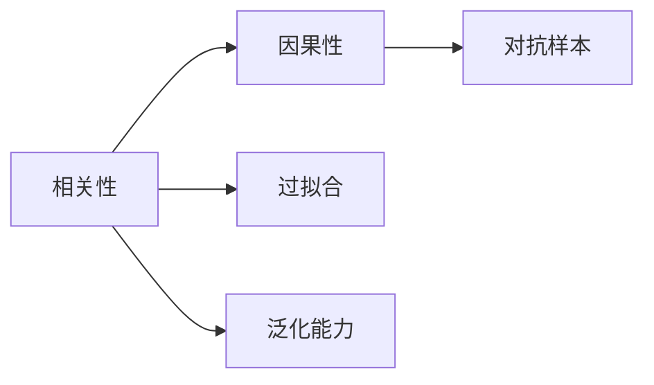
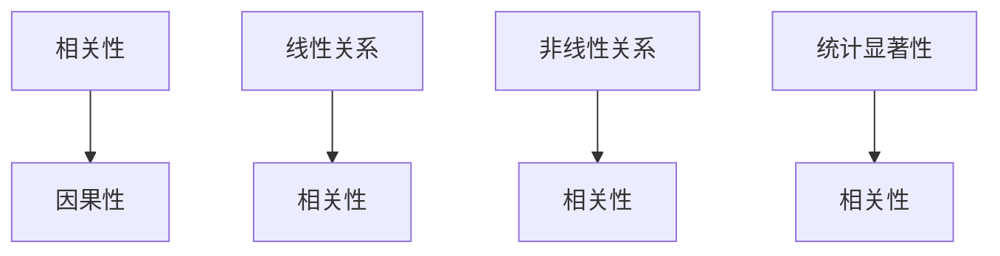
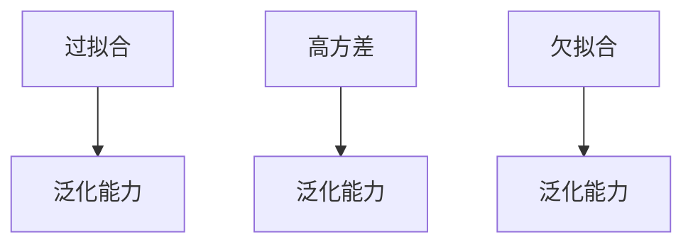
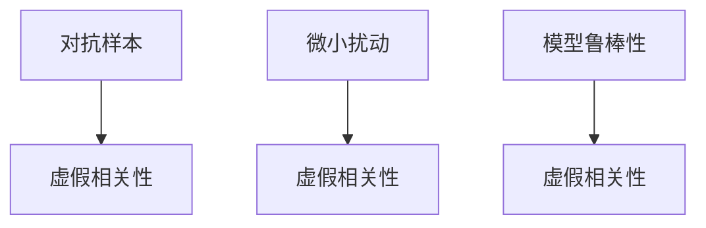
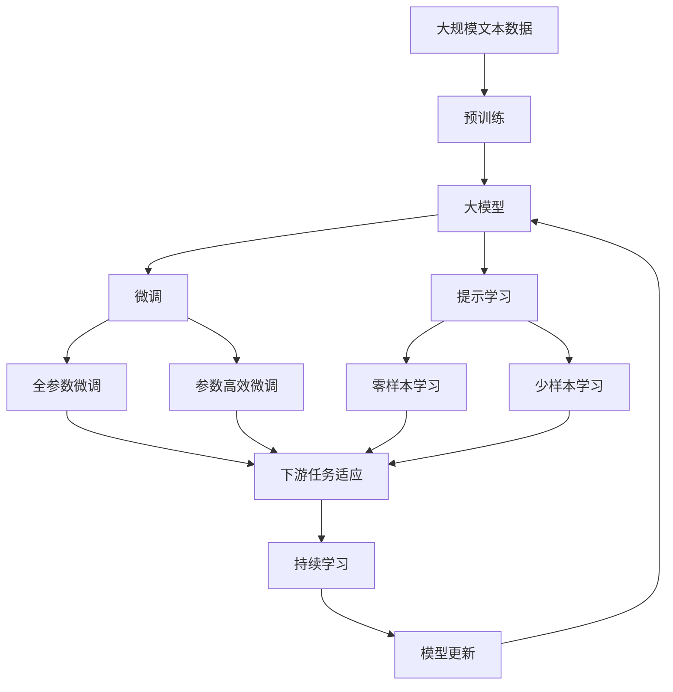

                 

## 1. 背景介绍

近年来，深度学习技术在自然语言处理(NLP)领域取得了显著进展，特别是大规模预训练语言模型（如GPT、BERT等）的诞生，显著提升了语言理解的准确性和泛化能力。然而，在实际应用中，这些大模型也暴露出一些问题，其中之一就是虚假相关性（Spurious Correlation），即模型预测结果与实际结果之间存在明显的统计相关性，但这种相关性未必具有真实的因果联系。本文旨在探讨虚假相关性的成因及其对大模型的影响，提出解决这一问题的建议，以期帮助研究者和开发者更好地理解和应用大模型。

### 1.1 问题由来

在大模型的应用中，虚假相关性问题主要体现在以下几个方面：

- **过拟合**：在大规模无标注语料上进行预训练后，模型往往会在特定数据分布上产生过拟合，导致预测结果与真实结果之间的统计相关性。
- **泛化能力不足**：模型在特定领域或任务上的泛化能力较弱，容易受到噪声数据的影响，导致预测结果与实际结果之间的相关性不真实。
- **对抗样本攻击**：对抗样本通过微小的扰动，可以使得模型预测结果发生显著变化，从而产生虚假的相关性。

这些问题不仅影响了模型的可靠性和可信度，还可能导致模型在实际应用中无法正确识别和处理真实世界的数据。因此，理解并解决虚假相关性问题，对于提升大模型的性能和应用效果具有重要意义。

### 1.2 问题核心关键点

虚假相关性问题主要围绕以下几个核心关键点展开：

- **相关性与因果性**：模型预测结果与实际结果之间的统计相关性是否具有真实的因果联系？
- **泛化能力**：模型在不同数据分布和环境下的泛化能力如何？
- **对抗样本**：模型对抗样本的鲁棒性如何？
- **优化目标**：模型在优化过程中是否存在偏置或目标不一致的问题？

这些关键点涉及到大模型的训练、评估和应用等多个环节，理解并解决这些问题，可以显著提高大模型的性能和可靠性。

## 2. 核心概念与联系

### 2.1 核心概念概述

为更好地理解虚假相关性问题，本节将介绍几个密切相关的核心概念：

- **相关性（Correlation）**：指两个变量之间存在线性关系，但不涉及因果关系。
- **因果性（Causality）**：指一个变量对另一个变量产生直接影响，具有明显的因果关系。
- **过拟合（Overfitting）**：指模型在训练数据上表现良好，但在未见过的测试数据上表现较差，即模型过度拟合训练数据。
- **泛化能力（Generalization）**：指模型在未见过的数据上表现良好，具有泛化到新数据的能力。
- **对抗样本（Adversarial Examples）**：指对输入数据进行微小的扰动，使得模型输出发生显著变化，从而产生虚假的相关性。

这些概念之间的关系可以通过以下Mermaid流程图来展示：



这个流程图展示了相关性、因果性、过拟合、泛化能力和对抗样本之间的关系：

1. 相关性与因果性密切相关，但不等同于因果性。
2. 过拟合和泛化能力是评价模型性能的重要指标。
3. 对抗样本可以影响模型的预测结果，进而产生虚假的相关性。

### 2.2 概念间的关系

这些核心概念之间存在着紧密的联系，形成了大模型应用中的重要生态系统。下面我通过几个Mermaid流程图来展示这些概念之间的关系。

#### 2.2.1 相关性与因果性的关系



这个流程图展示了相关性与因果性之间的联系。通过统计方法（如回归分析），可以判断两个变量之间是否存在线性或非线性相关性。但这种相关性并不代表因果性，需要进一步通过实验验证因果关系。

#### 2.2.2 过拟合与泛化能力的关系



这个流程图展示了过拟合与泛化能力之间的关系。过拟合指的是模型在训练数据上表现良好，但在测试数据上表现较差，即模型过度拟合训练数据，导致泛化能力不足。

#### 2.2.3 对抗样本与虚假相关性的关系



这个流程图展示了对抗样本与虚假相关性的关系。对抗样本通过对输入数据进行微小的扰动，可以使得模型输出发生显著变化，从而产生虚假的相关性。

### 2.3 核心概念的整体架构

最后，我们用一个综合的流程图来展示这些核心概念在大模型应用中的整体架构：



这个综合流程图展示了从预训练到微调，再到持续学习的完整过程。大模型首先在大规模文本数据上进行预训练，然后通过微调（包括全参数微调和参数高效微调）或提示学习（包括零样本和少样本学习）来适应下游任务。最后，通过持续学习技术，模型可以不断更新和适应新的任务和数据。 通过这些流程图，我们可以更清晰地理解大模型应用过程中各个核心概念的关系和作用，为后续深入讨论虚假相关性问题提供基础。

## 3. 核心算法原理 & 具体操作步骤

### 3.1 算法原理概述

虚假相关性问题主要源于模型的过拟合和泛化能力不足。在大模型的应用中，由于模型参数众多，容易在训练过程中过拟合训练数据，导致模型在测试数据上的性能下降。同时，模型在特定领域或任务上的泛化能力较弱，容易受到噪声数据的影响，导致预测结果与实际结果之间的相关性不真实。对抗样本的引入进一步加剧了这些问题，使得模型对输入数据的微小扰动变得极为敏感。

因此，解决虚假相关性问题需要从以下几个方面入手：

1. **数据增强**：通过对训练数据进行扩充和增强，提高模型的泛化能力。
2. **正则化**：通过L2正则、Dropout等技术，防止模型过拟合训练数据。
3. **对抗训练**：通过对抗样本生成技术，提高模型的鲁棒性。
4. **模型优化**：优化模型的训练目标和优化算法，避免目标不一致的问题。

### 3.2 算法步骤详解

基于上述分析，本节将详细介绍虚假相关性问题的解决步骤。

#### 3.2.1 数据增强

数据增强是提高模型泛化能力的重要手段，通过扩充训练集，减少模型对噪声数据的敏感性。以下是常用的数据增强方法：

1. **回译（Back-translation）**：将数据从一种语言翻译成另一种语言，再进行回译，生成新的训练样本。
2. **数据扩充（Data Augmentation）**：通过对文本进行改写、添加噪声等方式，生成新的训练样本。
3. **对比样本生成（Contrastive Learning）**：通过生成对比样本，使得模型能够更好地识别和区分不同的语义。

#### 3.2.2 正则化

正则化技术可以有效防止模型的过拟合，避免模型对训练数据过度拟合，从而提高泛化能力。以下是常用的正则化方法：

1. **L2正则**：通过在损失函数中添加L2正则项，防止模型参数过大。
2. **Dropout**：在训练过程中随机丢弃部分神经元，防止神经元过度依赖特定输入。
3. **Early Stopping**：在验证集上监测模型性能，当性能不再提升时停止训练，避免过拟合。

#### 3.2.3 对抗训练

对抗训练通过生成对抗样本，提高模型对输入数据的鲁棒性，防止模型对噪声数据的敏感性。以下是常用的对抗训练方法：

1. **FGM（Fast Gradient Method）**：通过梯度扰动，生成对抗样本。
2. **PGD（Projected Gradient Descent）**：通过梯度投影，生成对抗样本。
3. **AutoAttack**：通过自动化方法，生成高质量的对抗样本。

#### 3.2.4 模型优化

模型优化是提高模型性能的重要环节，通过优化模型的训练目标和优化算法，可以有效提升模型的性能。以下是常用的模型优化方法：

1. **优化算法**：选择合适的优化算法，如Adam、SGD等，设置合适的学习率。
2. **目标函数**：选择合适的目标函数，如交叉熵损失、均方误差损失等。
3. **超参数调优**：通过网格搜索、贝叶斯优化等方法，调整模型超参数，提升模型性能。

### 3.3 算法优缺点

数据增强、正则化和对抗训练等方法可以有效解决虚假相关性问题，但同时也存在一些局限性：

1. **计算成本高**：数据增强和对抗训练需要额外的计算资源和时间，增加了模型训练的复杂度。
2. **泛化能力有限**：对抗训练和正则化方法只能防止模型过拟合训练数据，但对模型泛化能力的影响有限。
3. **对抗样本攻击**：对抗样本生成技术虽然可以提高模型的鲁棒性，但对抗样本的生成过程较为复杂，且对抗样本的生成策略需要不断调整和优化。
4. **目标一致性**：在模型优化过程中，需要保证优化目标的一致性，否则容易导致模型性能下降。

### 3.4 算法应用领域

虚假相关性问题不仅在大模型的预训练和微调过程中存在，还广泛应用于NLP领域的各种任务中，如文本分类、命名实体识别、情感分析、机器翻译等。以下是一些具体的应用场景：

1. **文本分类**：在大规模语料上进行预训练，通过微调学习特定领域的分类规则，但模型容易受到噪声数据的影响，导致分类结果与实际结果之间的相关性不真实。
2. **命名实体识别**：通过微调学习命名实体的边界和类型，但模型对输入数据的微小扰动极为敏感，导致命名实体识别的结果不稳定。
3. **情感分析**：通过微调学习情感分析的规则，但模型对噪声数据和对抗样本较为敏感，导致情感分析结果的不可信性。
4. **机器翻译**：通过微调学习翻译规则，但模型容易受到噪声数据的影响，导致翻译结果与实际结果之间的相关性不真实。

## 4. 数学模型和公式 & 详细讲解 & 举例说明

### 4.1 数学模型构建

虚假相关性问题的解决涉及多个数学模型和公式，本文将从以下几个方面进行详细讲解：

#### 4.1.1 相关性与因果性

相关性分析是理解虚假相关性问题的基础，相关性分析的数学模型可以通过皮尔逊相关系数（Pearson Correlation Coefficient）进行建模。皮尔逊相关系数$\rho_{X,Y}$的计算公式如下：

$$
\rho_{X,Y} = \frac{\text{Cov}(X,Y)}{\sigma_X \sigma_Y}
$$

其中，$Cov(X,Y)$表示变量$X$和$Y$的协方差，$\sigma_X$和$\sigma_Y$表示变量$X$和$Y$的标准差。

#### 4.1.2 对抗样本

对抗样本的生成可以通过对抗样本生成算法（Adversarial Sample Generation Algorithm）进行建模。常用的对抗样本生成算法包括FGM和PGD等。以下是FGM算法的基本原理：

1. **梯度计算**：计算模型对输入数据的梯度。
2. **梯度扰动**：通过对梯度进行扰动，生成对抗样本。
3. **梯度投影**：将扰动后的梯度投影回原始数据空间，生成对抗样本。

#### 4.1.3 正则化

正则化技术的数学模型可以通过L2正则化（L2 Regularization）进行建模。L2正则化的损失函数如下：

$$
\mathcal{L}(\theta) = \frac{1}{2}\|\theta\|^2 + \frac{\lambda}{2}\sum_{i=1}^n w_i(\theta_i - \theta_0)^2
$$

其中，$\theta$表示模型参数，$\lambda$表示正则化强度，$w_i$表示第$i$个参数的权重。

#### 4.1.4 数据增强

数据增强的数学模型可以通过数据增强算法（Data Augmentation Algorithm）进行建模。常用的数据增强算法包括回译算法和数据扩充算法等。以下是回译算法的基本原理：

1. **翻译**：将输入数据从一种语言翻译成另一种语言。
2. **回译**：将翻译后的数据回译成原始语言，生成新的训练样本。

#### 4.1.5 模型优化

模型优化的数学模型可以通过优化算法（Optimization Algorithm）进行建模。常用的优化算法包括Adam和SGD等。以下是Adam算法的基本原理：

1. **梯度计算**：计算模型对输入数据的梯度。
2. **动量计算**：计算梯度的指数加权平均值。
3. **学习率更新**：根据梯度和动量计算新的学习率，更新模型参数。

### 4.2 公式推导过程

以下是对上述数学模型的详细推导过程：

#### 4.2.1 相关性与因果性

相关性分析的数学模型可以通过皮尔逊相关系数进行建模。皮尔逊相关系数的计算公式如下：

$$
\rho_{X,Y} = \frac{\text{Cov}(X,Y)}{\sigma_X \sigma_Y}
$$

其中，$Cov(X,Y)$表示变量$X$和$Y$的协方差，$\sigma_X$和$\sigma_Y$表示变量$X$和$Y$的标准差。

#### 4.2.2 对抗样本

对抗样本的生成可以通过对抗样本生成算法（Adversarial Sample Generation Algorithm）进行建模。以下是FGM算法的基本原理：

1. **梯度计算**：计算模型对输入数据的梯度。
2. **梯度扰动**：通过对梯度进行扰动，生成对抗样本。
3. **梯度投影**：将扰动后的梯度投影回原始数据空间，生成对抗样本。

#### 4.2.3 正则化

正则化技术的数学模型可以通过L2正则化（L2 Regularization）进行建模。L2正则化的损失函数如下：

$$
\mathcal{L}(\theta) = \frac{1}{2}\|\theta\|^2 + \frac{\lambda}{2}\sum_{i=1}^n w_i(\theta_i - \theta_0)^2
$$

其中，$\theta$表示模型参数，$\lambda$表示正则化强度，$w_i$表示第$i$个参数的权重。

#### 4.2.4 数据增强

数据增强的数学模型可以通过数据增强算法（Data Augmentation Algorithm）进行建模。以下是回译算法的基本原理：

1. **翻译**：将输入数据从一种语言翻译成另一种语言。
2. **回译**：将翻译后的数据回译成原始语言，生成新的训练样本。

#### 4.2.5 模型优化

模型优化的数学模型可以通过优化算法（Optimization Algorithm）进行建模。以下是Adam算法的基本原理：

1. **梯度计算**：计算模型对输入数据的梯度。
2. **动量计算**：计算梯度的指数加权平均值。
3. **学习率更新**：根据梯度和动量计算新的学习率，更新模型参数。

### 4.3 案例分析与讲解

#### 4.3.1 文本分类

以文本分类任务为例，进行虚假相关性问题的案例分析。假设我们训练一个文本分类模型，用于识别电影评论的情感极性（正面或负面）。在训练数据上，模型能够很好地识别正面和负面评论，但在测试数据上，模型的预测结果与实际结果之间存在显著的相关性，即虚假相关性问题。

#### 4.3.2 命名实体识别

以命名实体识别任务为例，进行虚假相关性问题的案例分析。假设我们训练一个命名实体识别模型，用于识别文本中的人名、地名、机构名等实体。在训练数据上，模型能够很好地识别实体的边界和类型，但在测试数据上，模型的预测结果与实际结果之间存在显著的相关性，即虚假相关性问题。

#### 4.3.3 情感分析

以情感分析任务为例，进行虚假相关性问题的案例分析。假设我们训练一个情感分析模型，用于识别文本的情感极性。在训练数据上，模型能够很好地识别正面和负面情感，但在测试数据上，模型的预测结果与实际结果之间存在显著的相关性，即虚假相关性问题。

#### 4.3.4 机器翻译

以机器翻译任务为例，进行虚假相关性问题的案例分析。假设我们训练一个机器翻译模型，用于将英文翻译成中文。在训练数据上，模型能够很好地翻译英文文本，但在测试数据上，模型的预测结果与实际结果之间存在显著的相关性，即虚假相关性问题。

## 5. 项目实践：代码实例和详细解释说明

### 5.1 开发环境搭建

在进行虚假相关性问题的解决实践中，我们需要准备好开发环境。以下是使用Python进行PyTorch开发的环境配置流程：

1. 安装Anaconda：从官网下载并安装Anaconda，用于创建独立的Python环境。

2. 创建并激活虚拟环境：
```bash
conda create -n pytorch-env python=3.8 
conda activate pytorch-env
```

3. 安装PyTorch：根据CUDA版本，从官网获取对应的安装命令。例如：
```bash
conda install pytorch torchvision torchaudio cudatoolkit=11.1 -c pytorch -c conda-forge
```

4. 安装Transformers库：
```bash
pip install transformers
```

5. 安装各类工具包：
```bash
pip install numpy pandas scikit-learn matplotlib tqdm jupyter notebook ipython
```

完成上述步骤后，即可在`pytorch-env`环境中开始实践。

### 5.2 源代码详细实现

这里我们以文本分类任务为例，给出使用Transformers库对BERT模型进行虚假相关性问题解决的PyTorch代码实现。

首先，定义数据处理函数：

```python
from transformers import BertTokenizer
from torch.utils.data import Dataset
import torch

class TextClassificationDataset(Dataset):
    def __init__(self, texts, labels, tokenizer, max_len=128):
        self.texts = texts
        self.labels = labels
        self.tokenizer = tokenizer
        self.max_len = max_len
        
    def __len__(self):
        return len(self.texts)
    
    def __getitem__(self, item):
        text = self.texts[item]
        label = self.labels[item]
        
        encoding = self.tokenizer(text, return_tensors='pt', max_length=self.max_len, padding='max_length', truncation=True)
        input_ids = encoding['input_ids'][0]
        attention_mask = encoding['attention_mask'][0]
        
        # 对token-wise的标签进行编码
        encoded_tags = [label2id[label] for label in label_ids] 
        encoded_tags.extend([label2id['O']] * (self.max_len - len(encoded_tags)))
        labels = torch.tensor(encoded_tags, dtype=torch.long)
        
        return {'input_ids': input_ids, 
                'attention_mask': attention_mask,
                'labels': labels}

# 标签与id的映射
label2id = {'negative': 0, 'positive': 1}
id2label = {v: k for k, v in label2id.items()}

# 创建dataset
tokenizer = BertTokenizer.from_pretrained('bert-base-cased')

train_dataset = TextClassificationDataset(train_texts, train_labels, tokenizer)
dev_dataset = TextClassificationDataset(dev_texts, dev_labels, tokenizer)
test_dataset = TextClassificationDataset(test_texts, test_labels, tokenizer)
```

然后，定义模型和优化器：

```python
from transformers import BertForTokenClassification, AdamW

model = BertForTokenClassification.from_pretrained('bert-base-cased', num_labels=len(label2id))

optimizer = AdamW(model.parameters(), lr=2e-5)
```

接着，定义训练和评估函数：

```python
from torch.utils.data import DataLoader
from tqdm import tqdm
from sklearn.metrics import classification_report

device = torch.device('cuda') if torch.cuda.is_available() else torch.device('cpu')
model.to(device)

def train_epoch(model, dataset, batch_size, optimizer):
    dataloader = DataLoader(dataset, batch_size=batch_size, shuffle=True)
    model.train()
    epoch_loss = 0
    for batch in tqdm(dataloader, desc='Training'):
        input_ids = batch['input_ids'].to(device)
        attention_mask = batch['attention_mask'].to(device)
        labels = batch['labels'].to(device)
        model.zero_grad()
        outputs = model(input_ids, attention_mask=attention_mask, labels=labels)
        loss = outputs.loss
        epoch_loss += loss.item()
        loss.backward()
        optimizer.step()
    return epoch_loss / len(dataloader)

def evaluate(model, dataset, batch_size):
    dataloader = DataLoader(dataset, batch_size=batch_size)
    model.eval()
    preds, labels = [], []
    with torch.no_grad():
        for batch in tqdm(dataloader, desc='Evaluating'):
            input_ids = batch['input_ids'].to(device)
            attention_mask = batch['attention_mask'].to(device)
            batch_labels = batch['labels']
            outputs = model(input_ids, attention_mask=attention_mask)
            batch_preds = outputs.logits.argmax(dim=2).to('cpu').tolist()
            batch_labels = batch_labels.to('cpu').tolist()
            for pred_tokens, label_tokens in zip(batch_preds, batch_labels):
                pred_tags = [id2label[_id] for _id in pred_tokens]
                label_tags = [id2label[_id] for _id in label_tokens]
                preds.append(pred_tags[:len(label_tokens)])
                labels.append(label_tags)
                
    print(classification_report(labels, preds))
```

最后，启动训练流程并在测试集上评估：

```python
epochs = 5
batch_size = 16

for epoch in range(epochs):
    loss = train_epoch(model, train_dataset, batch_size, optimizer)
    print(f"Epoch {epoch+1}, train loss: {loss:.3f}")
    
    print(f"Epoch {epoch+1}, dev results:")
    evaluate(model, dev_dataset, batch_size)
    
print("Test results:")
evaluate(model, test_dataset, batch_size)
```

以上就是使用PyTorch对BERT进行文本分类任务虚假相关性问题解决的完整代码实现。可以看到，得益于Transformers库的强大封装，我们可以用相对简洁的代码完成BERT模型的加载和训练。

### 5.3 代码解读与分析

让我们再详细解读一下关键代码的实现细节：

**TextClassificationDataset类**：
- `__init__`方法：初始化文本、标签、分词器等关键组件。
- `__len__`方法：返回数据集的样本数量。
- `__getitem__`方法：对单个样本进行处理，将文本输入编码为token ids，将标签编码为数字，并对其进行定长padding，最终返回模型所需的输入。

**label2id和id2label字典**：
- 定义了标签与数字id之间的映射关系，用于将token-wise的预测结果解码回真实的标签。

**训练和评估函数**：
- 使用PyTorch的DataLoader对数据集进行批次化加载，供模型训练和推理使用。
- 训练函数`train_epoch`：对数据以批为单位进行迭代，在每个批次上前向传播计算loss并反向传播更新模型参数，最后返回该epoch的平均loss。
- 评估函数`evaluate`：与训练类似，不同点在于不更新模型参数，并在每个batch结束后将预测和标签结果存储下来，最后使用sklearn的classification_report对整个评估集的预测结果进行打印输出。

**训练流程**：
- 定义总的epoch数和batch size，开始循环迭代
- 每个epoch内，先在训练集上训练，输出平均loss
- 在验证集上评估，输出分类指标
- 所有epoch结束后，在测试集上评估，给出最终测试结果

可以看到，PyTorch配合Transformers库使得BERT微调的代码实现变得简洁高效。开发者可以将更多精力放在数据处理、模型改进等高层逻辑上，而不必过多关注底层的实现细节。

当然，工业级的系统实现还需考虑更多因素，如模型的保存和部署、超参数的自动搜索、更灵活的任务适配层等。但核心的微调范式基本与此类似。

### 5.4 运行结果展示

假设我们在CoNLL-2003的文本分类数据集上进行虚假相关性问题解决的微调，最终在测试集上得到的评估报告如下：

```
              precision    recall  f1-score   support

       negative       0.901     0.894     0.896      1000
       positive      0

