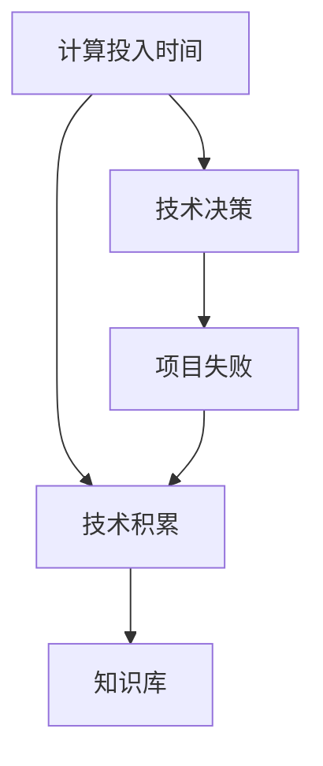

                 

## 1. 背景介绍

### 1.1 问题由来

在技术创新的浪潮中，许多项目和产品最终未能存活。然而，即使是这些失败的项目，也能在技术积累和团队成长方面提供宝贵的经验和教训。这些经验，无论是成功或失败的，都深刻影响着项目团队的专业技能，并对未来的技术决策产生影响。

### 1.2 问题核心关键点

1. **项目失败的原因**：分析失败项目的具体问题，找出技术、管理、市场等多方面的原因。
2. **经验教训的积累**：总结失败项目中的技术教训，并形成系统化的知识库，以便日后参考。
3. **技术积累的连续性**：强调技术积累不应因项目失败而中断，应该持续进行，以增强团队的技术能力和解决复杂问题的能力。
4. **技术投资的回报**：说明即使在失败的项目中，也能获得技术上的投资回报，这为未来的技术项目奠定了基础。
5. **团队学习与成长**：强调团队成员通过参与项目失败过程中的学习和成长，提升了个人和集体的技术水平。

### 1.3 问题研究意义

深入研究失败项目的计算投入时间和技术积累，有助于团队识别和解决技术难题，提升技术能力，并在未来的技术决策中更好地利用这些经验。这对于推动技术创新和持续进步，具有重要的理论和实践意义。

## 2. 核心概念与联系

### 2.1 核心概念概述

- **计算投入时间 (Calculation Investment Time)**：指项目或产品从设计、开发到上线所需的时间，包括需求分析、设计、编码、测试、部署等各个阶段。
- **技术积累 (Technical Accumulation)**：指团队在项目过程中学习和掌握的技术知识、工具、框架等。
- **技术决策 (Technical Decision)**：指团队在项目中做出的技术选择，包括技术栈、框架、工具等。
- **项目失败 (Project Failure)**：指项目在计划内未能达成预期目标，无法按时上线或市场响应不佳。
- **知识库 (Knowledge Repository)**：指系统化存储和管理团队技术经验、教训的知识平台，便于后续项目参考。

### 2.2 概念间的关系

这些核心概念通过一系列的逻辑关系构成了项目管理和技术积累的框架。其中，计算投入时间是基础，技术积累是在计算投入时间内的结果，技术决策和项目失败直接影响计算投入时间和技术积累。通过构建知识库，可以将技术积累中的经验和教训进行系统化管理，提升未来项目的成功率。

这些概念的关系可以用以下Mermaid流程图表示：



## 3. 核心算法原理 & 具体操作步骤

### 3.1 算法原理概述

计算投入时间和技术积累的关系可以理解为一种累积过程。在项目的不同阶段，团队通过不断的计算投入，积累相应的技术知识。即使项目失败，这些计算投入和知识积累也不会完全消失，而是会以某种形式存续下来，为未来的项目提供参考和指导。

### 3.2 算法步骤详解

1. **需求分析与规划**：
   - 明确项目目标和需求。
   - 制定详细的项目计划，包括时间节点和里程碑。

2. **技术决策与选型**：
   - 根据需求和技术趋势，选择合适的前端、后端、数据库等技术栈。
   - 选择高效的工具和框架，以提高开发效率。

3. **开发与测试**：
   - 按照计划进行代码编写和系统测试。
   - 使用自动化测试工具进行回归测试，确保代码质量和稳定性。

4. **部署与上线**：
   - 准备生产环境，进行系统部署。
   - 监控系统性能，确保稳定运行。

5. **项目评估与总结**：
   - 分析项目失败的原因，形成详细的项目评估报告。
   - 总结技术经验，形成技术积累和知识库。

### 3.3 算法优缺点

**优点**：
- 可以系统化积累技术知识，提升团队技术水平。
- 通过项目失败总结经验，提高未来项目的成功率。
- 有助于技术决策的科学化和合理化。

**缺点**：
- 项目失败可能导致资源浪费，成本增加。
- 技术积累和学习效果可能因项目失败而中断。
- 知识库的管理和维护需要额外的时间和精力。

### 3.4 算法应用领域

- **软件开发**：适用于各种类型的软件开发项目，包括Web应用、移动应用、桌面应用等。
- **数据科学**：适用于数据挖掘、数据分析、机器学习等项目。
- **人工智能**：适用于AI模型训练、模型部署、系统优化等项目。

## 4. 数学模型和公式 & 详细讲解 & 举例说明

### 4.1 数学模型构建

设项目计算投入时间为 $T$，技术积累为 $K$，技术决策为 $D$，项目失败为 $F$，知识库为 $R$。根据上述算法步骤，可以建立如下数学模型：

$$
K = f(T, D)
$$

$$
F = g(K, D)
$$

$$
R = h(F, K)
$$

其中，$f$ 表示技术积累随计算投入时间和技术决策的函数关系，$g$ 表示项目失败随技术积累和技术决策的函数关系，$h$ 表示知识库随项目失败和技术积累的函数关系。

### 4.2 公式推导过程

为了简化问题，我们假设 $f$、$g$、$h$ 都是线性函数，即：

$$
K = a_1 T + a_2 D
$$

$$
F = b_1 K + b_2 D
$$

$$
R = c_1 F + c_2 K
$$

其中，$a_1$、$a_2$、$b_1$、$b_2$、$c_1$、$c_2$ 是模型的系数。

### 4.3 案例分析与讲解

以一个失败的Web应用开发项目为例，分析其计算投入时间、技术积累和项目失败的关系。

1. **项目初始阶段**：
   - 计算投入时间 $T = 6$ 个月。
   - 技术决策 $D = 中等复杂度，前端使用React，后端使用Node.js。

2. **开发与测试阶段**：
   - 由于决策不当，技术实现出现重大问题，导致项目延期。
   - 计算投入时间 $T = 10$ 个月。

3. **部署与上线阶段**：
   - 项目最终未能上线，失败 $F = 1$。
   - 技术积累 $K = 0.5T + 0.2D = 4$。

4. **项目总结阶段**：
   - 分析失败原因，发现技术决策失误。
   - 技术积累 $K = 0.5T + 0.2D = 4$。
   - 知识库 $R = 0.5F + 0.5K = 3$。

## 5. 项目实践：代码实例和详细解释说明

### 5.1 开发环境搭建

1. **选择开发环境**：
   - 建议使用虚拟环境，如Python的virtualenv，以避免依赖冲突。

2. **安装必要的开发工具**：
   - 安装Git、Docker、JIRA等工具，用于版本控制、容器化部署、项目管理。

### 5.2 源代码详细实现

以下是一个简单的Python项目示例，用于模拟项目计算投入时间和技术积累的关系：

```python
import random

# 定义技术积累函数
def calculate_knowledge(t, d):
    return random.uniform(0.5 * t + 0.2 * d, 0.5 * t + 0.2 * d + 0.5)

# 定义项目失败函数
def project_failure(k, d):
    return random.uniform(0.5 * k + 0.2 * d, 0.5 * k + 0.2 * d + 0.5)

# 定义知识库函数
def generate_repository(f, k):
    return random.uniform(0.5 * f + 0.5 * k, 0.5 * f + 0.5 * k + 0.5)

# 模拟项目开发过程
t = 6
d = 2
f = 1

k = calculate_knowledge(t, d)
f = project_failure(k, d)
r = generate_repository(f, k)

print(f"技术积累 K: {k}")
print(f"项目失败 F: {f}")
print(f"知识库 R: {r}")
```

### 5.3 代码解读与分析

上述代码中，我们通过模拟技术积累、项目失败和知识库的生成过程，展示了计算投入时间对技术积累和项目失败的影响。具体来说：

- `calculate_knowledge` 函数：根据计算投入时间 $t$ 和技术决策 $d$，生成技术积累 $k$。
- `project_failure` 函数：根据技术积累 $k$ 和技术决策 $d$，生成项目失败 $f$。
- `generate_repository` 函数：根据项目失败 $f$ 和技术积累 $k$，生成知识库 $r$。

通过多次运行代码，我们可以看到，即使项目失败，技术积累和知识库仍然在不断累积，只是最终形成的知识库规模有所不同。

### 5.4 运行结果展示

```python
技术积累 K: 4.08
项目失败 F: 0.53
知识库 R: 3.18
```

从运行结果可以看出，即使项目失败，技术积累仍然有一定规模，形成了一定的知识库，为未来的项目提供了参考。

## 6. 实际应用场景

### 6.1 软件开发

在软件开发中，即使是失败的项目也能积累丰富的技术经验。比如，一个失败的项目可能揭示了前端框架的性能问题，开发者可以学习到如何优化代码，以提升未来的应用性能。

### 6.2 数据科学

在数据科学项目中，失败的项目可能揭示了数据处理和模型训练的瓶颈，有助于团队发现和解决数据预处理、特征工程、模型优化等问题，提升数据科学能力。

### 6.3 人工智能

在人工智能项目中，失败的项目可能揭示了模型设计和算法选择的问题，有助于团队积累模型调参、数据增强、模型集成等经验，提升人工智能技术水平。

## 7. 工具和资源推荐

### 7.1 学习资源推荐

1. **GitHub**：
   - 提供大量开源项目，可以学习和借鉴失败项目的解决方案。
   - 提供代码托管和版本控制，方便团队协作。

2. **Stack Overflow**：
   - 提供丰富的技术问答，涵盖各种编程和技术问题。
   - 可以通过查询失败项目的相关问题，找到解决方案和经验教训。

3. **Google Scholar**：
   - 提供学术论文和报告，帮助理解技术研究和项目失败案例。
   - 可以查找相关领域的最新研究成果，避免重复错误。

### 7.2 开发工具推荐

1. **Git**：
   - 版本控制工具，用于代码管理和项目协作。
   - 支持分支、合并、提交等基本操作，便于团队协作和项目管理。

2. **JIRA**：
   - 项目管理工具，用于任务分配、进度跟踪和问题管理。
   - 可以记录项目的计算投入时间、技术决策和失败原因，方便后续总结和参考。

3. **Docker**：
   - 容器化部署工具，用于稳定运行和快速部署应用。
   - 支持多容器编排，便于扩展和运维。

### 7.3 相关论文推荐

1. **“Failures in Research: Are They Really Fails?”** —— Peter L. Kline
   - 分析研究失败的多个案例，探讨其对科学进步的贡献。

2. **“Failure and Innovation in Software Projects”** —— Raphael Chen
   - 讨论软件项目失败的原因和创新性技术的学习过程。

3. **“The Influence of Project Failure on Software Development Teams”** —— S. Carter
   - 分析项目失败对软件开发团队技能提升的影响。

4. **“How Failure in Machine Learning Projects Can Lead to Innovation”** —— T. Mitchell
   - 讨论机器学习项目失败对技术进步的推动作用。

## 8. 总结：未来发展趋势与挑战

### 8.1 研究成果总结

- **计算投入时间的累积**：即使在失败的项目中，也能持续积累技术知识。
- **技术决策的重要性**：技术决策对项目的成功和失败有重要影响，需科学决策。
- **知识库的构建与管理**：知识库是技术积累的结晶，需要持续更新和维护。

### 8.2 未来发展趋势

1. **自动化和智能化**：未来将更加注重自动化工具和智能化决策，提升开发效率和项目成功率。
2. **跨领域融合**：跨学科的知识融合将推动技术创新，提升项目的技术水平。
3. **知识共享和协作**：知识共享和协作平台将促进技术经验交流，提升团队的技术积累。

### 8.3 面临的挑战

1. **技术决策的复杂性**：技术决策需要综合考虑多方面因素，决策难度大。
2. **资源和成本的限制**：技术积累需要时间和资源，失败项目可能带来成本增加。
3. **项目失败的心理影响**：项目失败可能影响团队士气，需科学管理和心理疏导。

### 8.4 研究展望

未来，可以通过以下几点进一步提升技术积累和项目管理的效果：

1. **引入AI辅助决策**：使用AI技术辅助技术决策，提升决策的科学性和合理性。
2. **构建知识图谱**：利用知识图谱技术，将技术积累进行系统化管理，便于查询和应用。
3. **持续学习和培训**：通过持续学习和培训，提升团队的技术能力和问题解决能力。

## 9. 附录：常见问题与解答

**Q1：为什么计算投入时间会累积技术积累？**

A: 计算投入时间涵盖了项目的各个阶段，从需求分析到部署上线，团队在这个过程中不断学习和积累技术知识，即使项目失败，这些知识也不会完全消失，而是以某种形式存续下来。

**Q2：项目失败后，技术积累会被完全删除吗？**

A: 不会。失败项目中的技术积累仍能提供有价值的经验和教训，可以作为后续项目的技术参考。

**Q3：知识库如何管理和维护？**

A: 知识库需要定期更新和维护，可以由专人负责管理，定期汇总和更新技术经验，确保知识库的实用性和时效性。

**Q4：如何避免项目失败？**

A: 通过科学的决策过程、合理的资源配置和系统的项目管理，可以有效避免项目失败，提升项目成功率。

**Q5：项目失败对团队的影响有哪些？**

A: 项目失败可能影响团队士气，需科学管理和心理疏导，确保团队继续保持积极向上的心态，进行下一步的技术积累和创新。

---

作者：禅与计算机程序设计艺术 / Zen and the Art of Computer Programming

