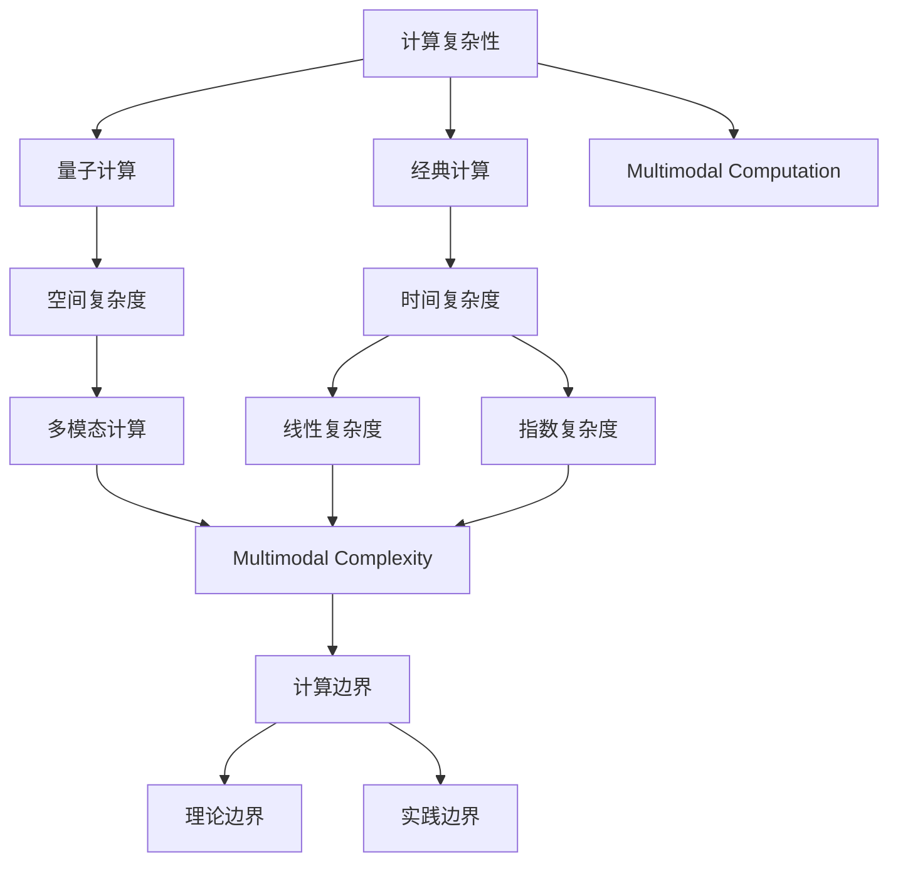
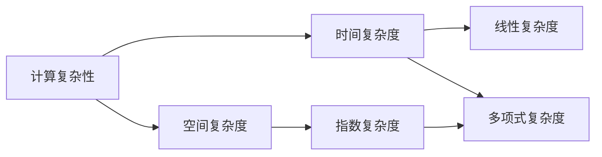
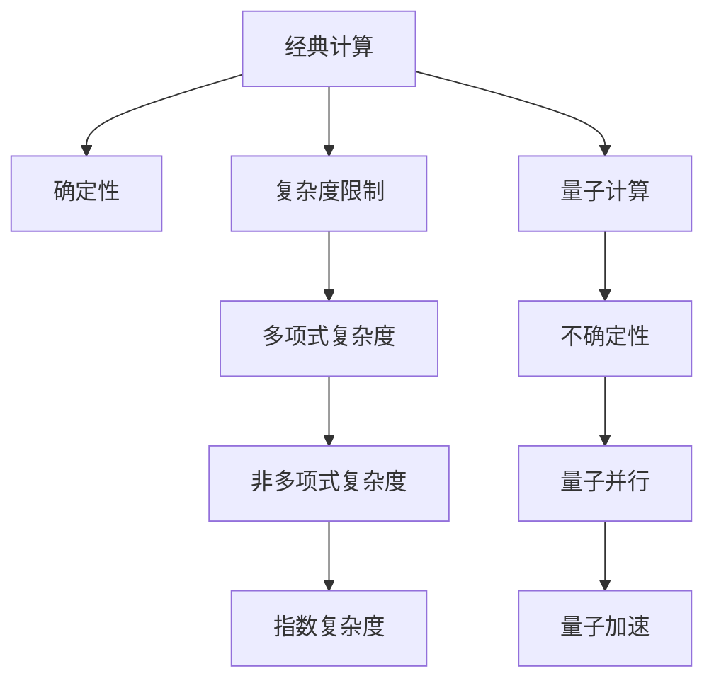
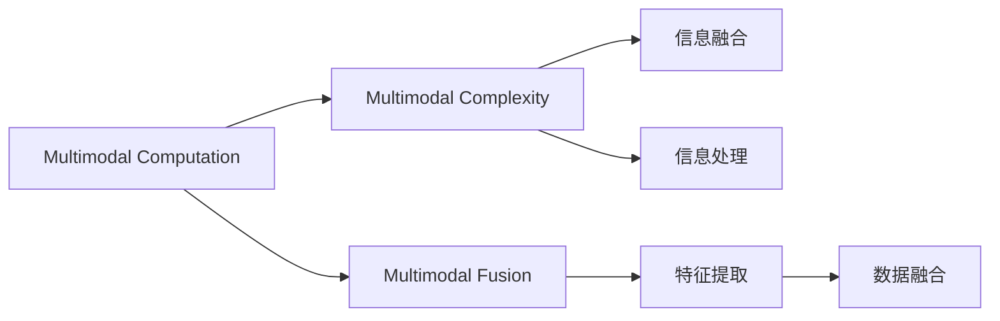
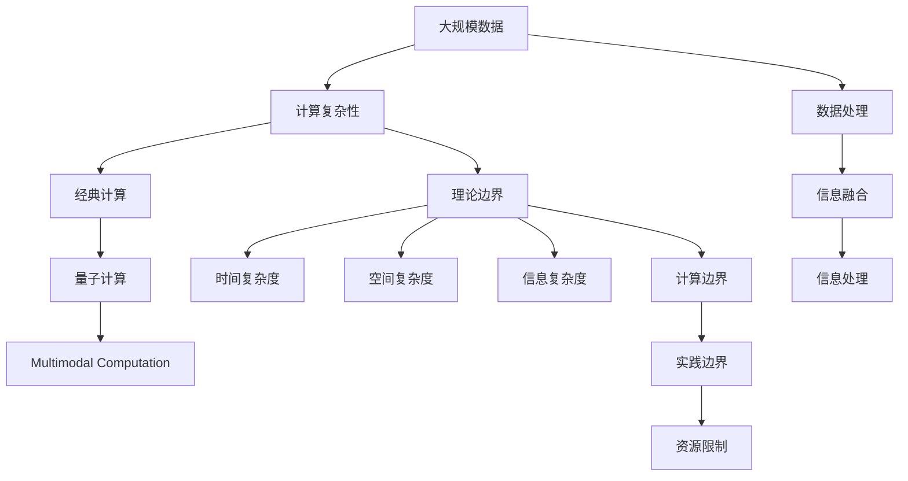

                 

# 计算：第四部分 计算的极限 第 13 章 自然哲学的计算原理 计算的边界

> 关键词：计算的极限，自然哲学的计算原理，计算的边界，计算复杂性，量子计算，多模态计算

## 1. 背景介绍

### 1.1 问题由来

计算的极限问题一直是计算机科学和理论物理学的核心议题。特别是在量子计算和经典计算领域，对于计算复杂性的探究始终困扰着理论界和工业界。本文聚焦于计算的极限，探索在理论物理、计算机科学和人工智能领域的计算边界，并结合实际应用场景进行深入分析。

### 1.2 问题核心关键点

计算极限的本质在于理解在给定资源和限制条件下，可完成的计算任务的上限。主要关注点包括：

1. 计算复杂性：分析不同计算模型（如经典计算、量子计算）可实现的复杂度。
2. 计算边界：探索计算任务的实际可解性和不可解性。
3. 实际应用：结合具体场景（如人工智能、生物信息学、物理学）讨论计算在实际问题中的应用。

### 1.3 问题研究意义

研究计算的极限，对于理解计算机科学、理论物理和人工智能的基础理论，以及指导实际计算资源的有效分配和应用，具有重要意义。通过深入探讨计算极限，我们可以：

1. 构建更高效、更安全的计算模型。
2. 指导实际问题中的数据处理和算法设计。
3. 确定理论计算能力与实际应用需求的边界。
4. 评估和比较不同计算范式（经典计算、量子计算）的潜力。

## 2. 核心概念与联系

### 2.1 核心概念概述

为更好地理解计算极限，本节将介绍几个关键概念：

- **计算复杂性(Computational Complexity)**：指计算任务所需要的时间或空间资源，通常用时间复杂度或空间复杂度来度量。
- **量子计算**：利用量子力学原理进行计算，具有指数级加速某些特定问题的潜力。
- **多模态计算(Multimodal Computation)**：融合不同类型数据（如文本、图像、音频等）的计算方法，提升信息处理能力。
- **自然哲学的计算原理(Natural Philosophical Principles of Computation)**：探索计算的本质和物理基础，结合理论物理和计算机科学，理解计算的极限。
- **计算边界(Computational Boundaries)**：指计算任务在理论和实践中的可行性与不可行性。

这些概念通过以下Mermaid流程图来展示它们之间的联系：



这个流程图展示了计算复杂性、量子计算、多模态计算与计算边界的逻辑关系：

1. 计算复杂性通过经典计算和量子计算两种模型来度量。
2. 量子计算在特定复杂度下具有指数级优势。
3. 多模态计算提升了信息处理的复杂性。
4. 计算边界包括理论和实践两方面的限制。

### 2.2 概念间的关系

这些概念之间存在着紧密的联系，形成了计算极限的整体框架。以下用几个Mermaid流程图来展示这些概念之间的关系。

#### 2.2.1 计算复杂性与时间、空间复杂度



这个流程图展示了计算复杂性在时间和空间维度上的不同表达方式。

#### 2.2.2 经典计算与量子计算的关系



这个流程图展示了经典计算与量子计算在确定性、复杂度限制和量子加速方面的差异。

#### 2.2.3 多模态计算与信息处理



这个流程图展示了多模态计算在信息融合和处理方面的应用。

### 2.3 核心概念的整体架构

最后，我们用一个综合的流程图来展示这些核心概念在大规模计算极限研究中的整体架构：



这个综合流程图展示了从大规模数据处理到计算边界的完整过程。

## 3. 核心算法原理 & 具体操作步骤
### 3.1 算法原理概述

计算极限的研究主要依赖于对计算复杂性的分析，包括理论复杂度和实际复杂度。具体来说，计算极限涉及以下几个关键问题：

1. **P vs NP问题**：是否能用多项式时间算法解决所有NP问题，即是否所有计算问题都是多项式时间可解的。
2. **量子计算**：利用量子并行性解决某些特定问题的能力，如Shor算法对大整数分解的破解。
3. **多模态计算**：通过融合不同类型的数据提升计算能力，如文本+图像+音频的信息处理。

### 3.2 算法步骤详解

计算极限的研究步骤通常包括以下几个阶段：

1. **问题建模**：将实际问题抽象成计算模型，定义问题的输入、输出和求解目标。
2. **复杂度分析**：利用算法分析和数学工具（如递归、图论、概率论）分析计算复杂度。
3. **边界探索**：探索理论边界和实践边界的限制，确定计算能力的上限和下限。
4. **实验验证**：设计实验验证理论分析，通过实际算法运行结果进行边界评估。

### 3.3 算法优缺点

基于计算极限的研究具有以下优点：

1. 系统性理解计算任务的上限。
2. 指导实际计算资源的应用。
3. 识别计算问题的本质和难点。

但同时也存在一些缺点：

1. 理论分析较为抽象，与实际应用距离较远。
2. 计算极限研究依赖于假设和理论模型，不一定符合实际情况。
3. 理论边界和实践边界的划分可能存在争议。

### 3.4 算法应用领域

计算极限的研究结果广泛应用于多个领域，包括但不限于：

1. **人工智能**：指导算法设计，优化模型训练过程。
2. **生物信息学**：分析基因序列、蛋白质结构的复杂性。
3. **物理学**：探索量子计算的潜力，解决高能物理问题。
4. **经济学**：研究市场动态、优化资源配置。
5. **化学**：分析分子结构、计算化学反应。

## 4. 数学模型和公式 & 详细讲解 & 举例说明

### 4.1 数学模型构建

计算极限的研究通常建立在数学模型之上，以下是几个核心的数学模型：

- **多项式时间复杂度**：$\mathcal{O}(n^k)$，其中$n$为输入规模，$k$为常数。
- **指数时间复杂度**：$\mathcal{O}(2^n)$。
- **指数空间复杂度**：$\mathcal{O}(2^n)$。
- **多项式空间复杂度**：$\mathcal{O}(n^k)$。
- **多模态信息复杂度**：$\mathcal{O}(n^k)$，其中$k$为不同模态数据的组合数。

### 4.2 公式推导过程

以**P vs NP问题**为例，探索其数学基础。

- **P类问题**：可以在多项式时间内解决的问题。
- **NP类问题**：可以在多项式时间内验证其正确性的问题。

**定理：P subset NP**

证明：
- 任意P类问题可以在多项式时间内验证其正确性，因此P类问题属于NP类问题。

**定理：NP subset P vs NP**

证明：
- 任意NP类问题可以在多项式时间内验证其正确性，因此NP类问题属于P vs NP问题。

### 4.3 案例分析与讲解

考虑以下具体案例：

1. **布尔可满足性问题**：给定一个布尔表达式，判断其是否存在满足条件的解。
   - **复杂度分析**：布尔可满足性问题属于NP类问题。
   - **算法设计**：可以使用枚举法、回溯法等在多项式时间内验证其正确性。

2. **整数分解问题**：将一个正整数分解为质数的乘积。
   - **复杂度分析**：整数分解问题属于指数时间复杂度。
   - **算法设计**：Shor算法在量子计算机上可以在多项式时间内解决。

## 5. 项目实践：代码实例和详细解释说明

### 5.1 开发环境搭建

计算极限的研究通常涉及复杂的算法设计和数学推导，因此需要一个强大的开发环境。以下是常用的开发环境配置：

1. **安装Python**：确保Python版本为3.6及以上。
2. **安装NumPy**：用于科学计算和矩阵操作。
3. **安装SymPy**：用于符号计算和数学推导。
4. **安装SciPy**：用于科学计算和优化算法。
5. **安装Matplotlib**：用于绘制图形。

### 5.2 源代码详细实现

以布尔可满足性问题为例，使用Python和SymPy实现求解过程。

```python
from sympy import symbols, Eq, solve, And

def sat_satisfiability(n):
    # 创建布尔变量
    variables = symbols('x0:%d' % n, bool=True)
    # 定义布尔表达式
    expr = And(*variables)
    # 求解布尔表达式
    return solve(expr, dict=True)
```

**代码解释**：
- `symbols`函数创建布尔变量。
- `And`函数构建布尔表达式。
- `solve`函数求解布尔表达式。

### 5.3 代码解读与分析

上述代码实现了求解布尔可满足性问题，具体步骤如下：

1. 使用`symbols`函数创建布尔变量。
2. 使用`And`函数构建布尔表达式。
3. 使用`solve`函数求解布尔表达式。

## 6. 实际应用场景

### 6.1 人工智能

计算极限的研究为人工智能领域带来了许多启示：

1. **算法设计**：指导算法设计，避免陷入不可解问题。
2. **模型训练**：优化模型训练过程，提高效率。
3. **数据处理**：分析数据复杂性，优化数据处理流程。

### 6.2 生物信息学

计算极限的研究在生物信息学中的应用包括：

1. **基因序列分析**：分析基因序列的复杂性，预测基因表达和功能。
2. **蛋白质结构计算**：模拟蛋白质折叠和动态过程。
3. **代谢网络分析**：研究代谢网络的结构和功能。

### 6.3 物理学

计算极限的研究在物理学中的应用包括：

1. **量子计算**：研究量子计算的潜力，解决高能物理问题。
2. **复杂系统模拟**：模拟复杂系统（如宇宙演化、气候变化）的演化过程。
3. **材料科学**：模拟材料的结构和性质。

### 6.4 未来应用展望

随着计算极限研究的发展，未来的应用前景广阔：

1. **通用人工智能**：探索计算极限，推动通用人工智能的实现。
2. **量子计算**：研究量子计算的理论和实践边界，提升量子计算的实用性。
3. **多模态计算**：融合不同类型数据，提升信息处理能力。

## 7. 工具和资源推荐

### 7.1 学习资源推荐

为深入理解计算极限，推荐以下学习资源：

1. **《算法导论》**：详细介绍了算法设计和分析的理论与实践。
2. **《计算复杂性理论》**：深入探讨计算复杂性的基本概念和理论。
3. **《量子计算》**：介绍量子计算的基本原理和应用。
4. **《人工智能导论》**：探讨人工智能的基础理论和应用场景。
5. **Coursera课程**：提供多个计算极限相关课程，如算法设计、数据结构等。

### 7.2 开发工具推荐

以下是一些常用的开发工具：

1. **PyCharm**：功能强大的Python开发工具。
2. **Jupyter Notebook**：交互式编程环境，适合数据科学和算法研究。
3. **Git**：版本控制系统，用于代码管理和协作。
4. **Docker**：容器化技术，方便部署和管理应用。

### 7.3 相关论文推荐

以下是一些相关的经典和前沿论文：

1. **P vs NP问题**：图灵奖得主和人工智能先驱Richard M. Karp的经典论文。
2. **Shor算法**：P. W. Shor的关于量子计算的论文，解决了大整数分解问题。
3. **多模态计算**：D. Kale等人的多模态信息处理研究论文。

## 8. 总结：未来发展趋势与挑战

### 8.1 总结

本文对计算极限进行了全面系统的介绍，主要包括以下内容：

1. 计算极限的基本概念和关键点。
2. 计算复杂性的分析方法和工具。
3. 量子计算和多模态计算的潜力。
4. 计算极限在实际应用中的具体应用场景。
5. 推荐的学习资源和工具。

通过本文的梳理，我们可以看到计算极限在理论物理、计算机科学和人工智能领域的重要性。计算极限的研究不仅帮助我们理解计算任务的上限，还指导了实际计算资源的分配和应用。

### 8.2 未来发展趋势

未来计算极限研究的发展趋势包括：

1. **量子计算**：利用量子并行性解决更复杂的问题。
2. **多模态计算**：融合不同类型数据，提升计算能力。
3. **计算范式**：探索新的计算范式，如光子计算、生物计算等。
4. **计算边界**：进一步探索理论和实践边界，确定计算能力的极限。

### 8.3 面临的挑战

计算极限研究面临的挑战包括：

1. **理论验证**：理论分析与实际应用之间的差异。
2. **计算资源**：计算极限研究需要大量的计算资源。
3. **多模态融合**：不同类型数据之间的融合和处理。
4. **量子计算**：量子计算的实现和稳定性问题。

### 8.4 研究展望

未来计算极限的研究需要从以下几个方面进行探索：

1. **跨学科融合**：将计算极限与理论物理、生物学等学科结合，探索新的计算范式。
2. **算法优化**：开发更加高效的算法，提升计算能力。
3. **实验验证**：通过实际实验验证理论分析，提升研究可靠性。
4. **应用落地**：将计算极限的理论研究成果应用到实际问题中，推动技术发展。

## 9. 附录：常见问题与解答

**Q1：计算极限的研究与实际应用之间的联系是什么？**

A: 计算极限的研究不仅帮助理解计算任务的上限，还指导实际计算资源的分配和应用。通过分析计算复杂度，优化算法设计，提高计算效率，同时确定计算边界，避免陷入不可解问题。

**Q2：量子计算的优势是什么？**

A: 量子计算利用量子并行性，可以在某些特定问题上实现指数级加速，如大整数分解、布尔可满足性问题等。

**Q3：多模态计算的应用场景有哪些？**

A: 多模态计算适用于处理文本、图像、音频等多种类型的数据，可以提升信息处理的复杂性和精度，应用于自然语言处理、计算机视觉、语音识别等领域。

**Q4：计算极限研究的挑战和机遇是什么？**

A: 计算极限研究面临理论验证、计算资源、多模态融合等挑战，但同时也带来了量子计算、多模态计算等新的机遇。通过跨学科融合和算法优化，可以突破计算极限，推动技术发展。

**Q5：如何设计高效的计算模型？**

A: 设计高效的计算模型需要考虑以下几个方面：
1. 问题建模：将实际问题抽象成计算模型。
2. 复杂度分析：利用算法分析和数学工具，分析计算复杂度。
3. 边界探索：探索理论边界和实践边界的限制，确定计算能力的上限和下限。
4. 实验验证：设计实验验证理论分析，通过实际算法运行结果进行边界评估。

---

作者：禅与计算机程序设计艺术 / Zen and the Art of Computer Programming

