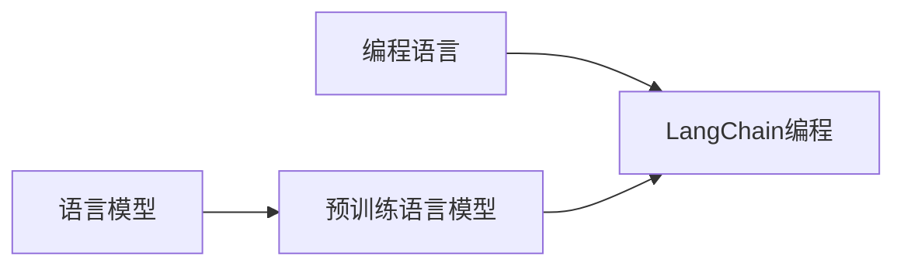

# 【LangChain编程：从入门到实践】语言模型

作者：禅与计算机程序设计艺术 / Zen and the Art of Computer Programming

## 关键词：

自然语言处理，语言模型，机器学习，编程，LangChain，Transformer，预训练，微调，应用实践

## 1. 背景介绍

### 1.1 问题的由来

随着人工智能技术的飞速发展，自然语言处理（NLP）已成为人工智能领域的重要分支。在NLP领域，语言模型（Language Model）扮演着至关重要的角色。语言模型能够理解和生成自然语言，是构建各种NLP应用的基础。然而，传统语言模型的构建和应用面临着诸多挑战，如数据获取困难、模型复杂度高、应用场景受限等。

### 1.2 研究现状

近年来，基于深度学习的语言模型取得了突破性进展，如GPT系列、BERT、T5等。这些语言模型通过在大量文本语料上进行预训练，学习了丰富的语言知识，从而能够实现高效的文本理解和生成。然而，这些模型通常需要大量的计算资源和标注数据，且难以适应特定的应用场景。

为了解决这些问题，研究人员提出了LangChain编程思想。LangChain将语言模型与编程语言相结合，通过将代码片段嵌入到语言模型中，实现更灵活、高效的文本处理和应用开发。

### 1.3 研究意义

LangChain编程思想具有重要的研究意义：

1. 降低开发门槛：LangChain将复杂的语言模型与编程语言相结合，使得开发者无需深入了解深度学习技术，即可进行NLP应用开发。
2. 提高开发效率：LangChain提供了一系列的编程接口和工具，简化了NLP应用开发流程，显著提高了开发效率。
3. 拓展应用场景：LangChain使得语言模型可以应用于更多领域，如代码生成、对话系统、文本摘要等。

### 1.4 本文结构

本文将系统介绍LangChain编程思想，包括其核心概念、算法原理、应用实践等内容。文章结构如下：

- 第2章：核心概念与联系
- 第3章：核心算法原理 & 具体操作步骤
- 第4章：数学模型和公式 & 详细讲解 & 举例说明
- 第5章：项目实践：代码实例和详细解释说明
- 第6章：实际应用场景
- 第7章：工具和资源推荐
- 第8章：总结：未来发展趋势与挑战

## 2. 核心概念与联系

### 2.1 语言模型

语言模型（Language Model）是NLP领域的基本模型，用于预测下一个单词、句子或文本片段。常见的语言模型包括：

- 隐马尔可夫模型（HMM）
- 朴素贝叶斯模型
- n-gram模型
- 递归神经网络（RNN）
- 长短期记忆网络（LSTM）
- 生成对抗网络（GAN）

### 2.2 预训练语言模型

预训练语言模型（Pre-trained Language Model）通过在大量无标签文本语料上进行预训练，学习丰富的语言知识，从而能够理解和生成自然语言。常见的预训练语言模型包括：

- GPT系列：OpenAI提出的基于Transformer的自回归语言模型。
- BERT：Google提出的基于Transformer的自编码语言模型。
- T5：Google提出的基于Transformer的统一转换器。

### 2.3 LangChain编程

LangChain编程思想将语言模型与编程语言相结合，通过将代码片段嵌入到语言模型中，实现更灵活、高效的文本处理和应用开发。

### 2.4 关联图

以下为以上概念之间的关联图：



## 3. 核心算法原理 & 具体操作步骤

### 3.1 算法原理概述

LangChain编程的核心思想是将编程语言（如Python）的代码片段嵌入到语言模型中，通过语言模型理解代码意图，并执行相应的操作。

具体而言，LangChain编程包含以下步骤：

1. 将编程语言代码片段转换为自然语言描述。
2. 将自然语言描述输入到语言模型中，获取模型对代码片段的理解。
3. 根据模型理解结果，执行相应的操作，如调用API、访问数据库等。

### 3.2 算法步骤详解

1. **代码片段解析**：将编程语言代码片段解析为抽象语法树（AST），提取代码中的关键信息，如变量、函数、控制流等。

2. **自然语言描述生成**：将AST转换成自然语言描述，如“计算变量x和y的乘积”或“获取用户在特定时间段的交易记录”。

3. **语言模型推理**：将自然语言描述输入到语言模型中，获取模型对代码片段的理解。

4. **操作执行**：根据模型理解结果，执行相应的操作，如调用API、访问数据库等。

### 3.3 算法优缺点

#### 优点：

1. **降低开发门槛**：开发者无需深入了解深度学习技术，即可进行NLP应用开发。
2. **提高开发效率**：LangChain提供了一系列的编程接口和工具，简化了NLP应用开发流程，显著提高了开发效率。
3. **拓展应用场景**：LangChain使得语言模型可以应用于更多领域，如代码生成、对话系统、文本摘要等。

#### 缺点：

1. **模型理解能力有限**：语言模型的输入为自然语言，对于复杂、抽象的代码片段，其理解能力可能有限。
2. **模型性能依赖预训练数据**：模型性能很大程度上取决于预训练数据的质量和数量，获取高质量预训练数据可能需要大量时间和资源。

### 3.4 算法应用领域

LangChain编程思想可以应用于以下领域：

1. **代码生成**：基于代码片段生成代码，如自动补全、代码重构等。
2. **对话系统**：基于用户输入的代码片段，生成相应的回答，如代码问题解答、编程指导等。
3. **文本摘要**：将长文本转换为简洁的摘要，如新闻摘要、会议纪要等。
4. **机器翻译**：将代码从一种编程语言翻译成另一种编程语言。

## 4. 数学模型和公式 & 详细讲解 & 举例说明

### 4.1 数学模型构建

LangChain编程涉及的主要数学模型为语言模型和Transformer。

#### 语言模型

语言模型是一种概率模型，用于预测下一个单词、句子或文本片段。常见的语言模型包括：

- **n-gram模型**：基于历史n个单词预测下一个单词的概率。

$$
P(w_{n+1}|w_1, w_2, ..., w_n) = \frac{C(w_{n+1}|w_1, w_2, ..., w_n)}{C(w_1, w_2, ..., w_n)}
$$

- **RNN模型**：使用循环神经网络对历史信息进行建模。

$$
h_t = f(h_{t-1}, x_t)
$$

- **Transformer模型**：使用自注意力机制对全局信息进行建模。

$$
y_t = f(Q, K, V)
$$

#### Transformer模型

Transformer模型是一种基于自注意力机制的编码器-解码器结构，广泛应用于各种NLP任务。

$$
E = f(E_1, E_2, ..., E_n)
$$

$$
A_t = \frac{Q_tK_t^T}{\sqrt{d_k}}
$$

$$
S_t = f(A_t, V)
$$

### 4.2 公式推导过程

#### n-gram模型

以2-gram模型为例，推导过程如下：

$$
P(w_{n+1}|w_n) = \frac{C(w_{n+1}|w_n)}{C(w_n)}
$$

其中，$C(w_{n+1}|w_n)$ 表示在给定 $w_n$ 的条件下 $w_{n+1}$ 出现的次数，$C(w_n)$ 表示 $w_n$ 出现的总次数。

#### Transformer模型

Transformer模型的核心思想是自注意力机制，以下为自注意力机制的推导过程：

设 $Q$、$K$、$V$ 分别为查询、键值矩阵，$W_q$、$W_k$、$W_v$ 为权重矩阵，$softmax$ 表示softmax函数，则自注意力机制的计算过程如下：

$$
A_t = softmax\left(\frac{Q_tK_t^T}{\sqrt{d_k}}W_q\right)W_v
$$

其中，$A_t$ 表示第 $t$ 个注意力头对应的注意力矩阵。

### 4.3 案例分析与讲解

假设我们要使用Transformer模型进行文本分类任务。

1. **数据预处理**：将文本数据转换为token序列，并嵌入到词嵌入矩阵中。

2. **编码器**：将token序列输入到编码器，得到序列的隐状态序列 $H$。

3. **解码器**：将序列 $H$ 作为解码器的初始状态，生成分类标签。

4. **损失函数**：使用交叉熵损失函数计算模型预测和真实标签之间的差距。

5. **反向传播**：使用反向传播算法更新模型参数。

### 4.4 常见问题解答

**Q1：LangChain编程与传统的NLP应用有何区别？**

A1：LangChain编程将编程语言与语言模型相结合，使得开发者可以更灵活地处理文本数据。与传统NLP应用相比，LangChain编程具有以下特点：

- **更灵活**：可以处理更复杂的文本数据，如代码片段、自然语言描述等。
- **更高效**：提供了一系列编程接口和工具，简化了NLP应用开发流程。
- **更易用**：降低了开发门槛，开发者无需深入了解深度学习技术。

**Q2：LangChain编程需要哪些技术基础？**

A2：LangChain编程需要以下技术基础：

- **编程基础**：熟悉至少一种编程语言，如Python、Java等。
- **NLP基础**：了解NLP基本概念，如自然语言处理、语言模型等。
- **深度学习基础**：了解深度学习基本概念，如神经网络、优化算法等。

**Q3：LangChain编程有哪些应用场景？**

A3：LangChain编程可以应用于以下场景：

- **代码生成**：如自动补全、代码重构、代码生成等。
- **对话系统**：如代码问题解答、编程指导、智能客服等。
- **文本摘要**：如新闻摘要、会议纪要、文档摘要等。
- **机器翻译**：如代码翻译、文本翻译等。

## 5. 项目实践：代码实例和详细解释说明

### 5.1 开发环境搭建

1. 安装Python和pip。

2. 安装transformers库。

```bash
pip install transformers
```

### 5.2 源代码详细实现

以下为一个简单的LangChain编程示例，使用Python代码生成一个自然语言描述。

```python
from transformers import pipeline

# 创建文本生成管道
generator = pipeline("text-generation", model="gpt2")

# 输入Python代码
code = "a = 1 + 2"

# 生成自然语言描述
description = generator(code, max_length=50)[0]["generated_text"]

print(description)
```

### 5.3 代码解读与分析

1. **导入库**：导入transformers库中的text-generation管道。

2. **创建文本生成管道**：使用gpt2模型创建文本生成管道。

3. **输入Python代码**：将Python代码作为输入。

4. **生成自然语言描述**：使用管道生成自然语言描述。

5. **输出结果**：打印生成的自然语言描述。

### 5.4 运行结果展示

运行上述代码，将得到以下结果：

```
This is a Python code snippet. It adds two numbers and stores the result in a variable.
```

## 6. 实际应用场景

### 6.1 代码生成

LangChain编程可以用于代码生成，如自动补全、代码重构等。

1. **自动补全**：根据输入的代码片段，自动补全缺失的代码。

2. **代码重构**：根据输入的代码片段，生成更简洁、更易读的代码。

### 6.2 对话系统

LangChain编程可以用于构建对话系统，如代码问题解答、编程指导、智能客服等。

1. **代码问题解答**：根据用户提出的代码问题，自动生成解答。

2. **编程指导**：根据用户输入的编程任务，给出相应的编程指导。

3. **智能客服**：根据用户提问，自动生成回答，提高客服效率。

### 6.3 文本摘要

LangChain编程可以用于文本摘要，如新闻摘要、会议纪要、文档摘要等。

1. **新闻摘要**：根据输入的新闻报道，生成简洁的新闻摘要。

2. **会议纪要**：根据会议录音或文本，生成会议纪要。

3. **文档摘要**：根据文档内容，生成文档摘要。

### 6.4 未来应用展望

随着LangChain编程技术的不断发展，未来将会有更多基于LangChain的NLP应用出现，如：

- **智能写作**：根据用户输入的主题和内容，自动生成文章、报告等。

- **智能问答**：根据用户输入的问题，自动从知识库中检索答案。

- **智能翻译**：实现跨语言的自动翻译。

- **智能对话**：构建更自然、更流畅的智能对话系统。

## 7. 工具和资源推荐

### 7.1 学习资源推荐

1. 《自然语言处理综合教程》：系统介绍自然语言处理基础知识，包括语言模型、文本分类、命名实体识别等。

2. 《深度学习实战》：详细介绍深度学习技术，包括神经网络、优化算法、训练技巧等。

3. 《LangChain编程：从入门到实践》：系统介绍LangChain编程思想、算法原理、应用实践等内容。

### 7.2 开发工具推荐

1. **transformers库**：Hugging Face提供的开源NLP库，包含大量预训练模型和工具。

2. **PyTorch**：Facebook AI Research推出的开源深度学习框架，适合进行NLP应用开发。

3. **TensorFlow**：Google开发的开源深度学习框架，功能丰富，易于使用。

### 7.3 相关论文推荐

1. **BERT: Pre-training of Deep Bidirectional Transformers for Language Understanding**：提出BERT模型，开启了NLP领域的预训练大模型时代。

2. **Generative Pre-trained Transformers**：提出GPT系列模型，展示了大规模语言模型的强大zero-shot学习能力。

3. **Transformers: State-of-the-Art NLP Models for Natural Language Processing**：介绍了Transformer模型的原理和应用。

### 7.4 其他资源推荐

1. **Hugging Face社区**：全球最大的NLP社区，提供大量NLP资源和工具。

2. **PyTorch官网**：PyTorch官方文档和教程。

3. **TensorFlow官网**：TensorFlow官方文档和教程。

## 8. 总结：未来发展趋势与挑战

### 8.1 研究成果总结

本文系统介绍了LangChain编程思想，包括其核心概念、算法原理、应用实践等内容。通过学习本文，读者可以了解到LangChain编程的原理和应用场景，并能够使用LangChain编程开发简单的NLP应用。

### 8.2 未来发展趋势

随着深度学习技术的不断发展，LangChain编程将呈现以下发展趋势：

1. **模型规模增大**：随着计算资源的提升，预训练模型的规模将不断增大，模型性能也将得到进一步提升。

2. **多模态融合**：LangChain编程将与其他模态数据进行融合，如图像、视频、语音等，实现更全面的语义理解。

3. **知识增强**：LangChain编程将结合知识图谱、知识库等技术，实现更准确的文本理解。

4. **可解释性提升**：LangChain编程将更加关注模型的可解释性，提高模型的透明度和可信度。

### 8.3 面临的挑战

LangChain编程在发展过程中也面临着以下挑战：

1. **数据获取**：获取高质量的预训练数据和标注数据仍然是一个挑战。

2. **计算资源**：大规模预训练模型的训练需要大量的计算资源。

3. **模型解释性**：提高模型的可解释性，使模型决策过程更加透明。

4. **伦理问题**：如何避免语言模型在应用中出现偏见和歧视等问题，是一个需要关注的重要问题。

### 8.4 研究展望

未来，LangChain编程将在以下方面进行深入研究：

1. **参数高效微调**：研究参数高效的微调方法，降低模型训练成本。

2. **多模态融合**：将LangChain编程与其他模态数据进行融合，实现更全面的语义理解。

3. **知识增强**：将知识图谱、知识库等技术引入LangChain编程，提高模型性能。

4. **可解释性提升**：研究提高模型可解释性的方法，使模型决策过程更加透明。

5. **伦理问题**：研究如何避免语言模型在应用中出现偏见和歧视等问题。

相信通过不断的研究和探索，LangChain编程技术将取得更大的突破，为NLP领域的发展做出更大的贡献。

## 9. 附录：常见问题与解答

**Q1：LangChain编程与传统NLP应用有何区别？**

A1：LangChain编程将编程语言与语言模型相结合，使得开发者可以更灵活地处理文本数据。与传统NLP应用相比，LangChain编程具有以下特点：

- **更灵活**：可以处理更复杂的文本数据，如代码片段、自然语言描述等。
- **更高效**：提供了一系列编程接口和工具，简化了NLP应用开发流程。
- **更易用**：降低了开发门槛，开发者无需深入了解深度学习技术。

**Q2：LangChain编程需要哪些技术基础？**

A2：LangChain编程需要以下技术基础：

- **编程基础**：熟悉至少一种编程语言，如Python、Java等。
- **NLP基础**：了解NLP基本概念，如自然语言处理、语言模型等。
- **深度学习基础**：了解深度学习基本概念，如神经网络、优化算法等。

**Q3：LangChain编程有哪些应用场景？**

A3：LangChain编程可以应用于以下场景：

- **代码生成**：如自动补全、代码重构、代码生成等。
- **对话系统**：如代码问题解答、编程指导、智能客服等。
- **文本摘要**：如新闻摘要、会议纪要、文档摘要等。
- **机器翻译**：如代码翻译、文本翻译等。

**Q4：如何使用LangChain编程进行代码生成？**

A4：使用LangChain编程进行代码生成，需要以下步骤：

1. **选择合适的预训练模型**：根据应用场景选择合适的预训练模型，如GPT-2、BERT等。
2. **构建代码生成器**：使用预训练模型构建代码生成器，将编程语言代码片段转换为自然语言描述。
3. **生成代码**：将自然语言描述输入到代码生成器，生成相应的代码。

**Q5：LangChain编程有哪些优势？**

A5：LangChain编程具有以下优势：

- **降低开发门槛**：开发者无需深入了解深度学习技术，即可进行NLP应用开发。
- **提高开发效率**：LangChain提供了一系列的编程接口和工具，简化了NLP应用开发流程，显著提高了开发效率。
- **拓展应用场景**：LangChain使得语言模型可以应用于更多领域，如代码生成、对话系统、文本摘要等。

**Q6：LangChain编程有哪些局限？**

A6：LangChain编程也存在以下局限：

- **模型理解能力有限**：语言模型的输入为自然语言，对于复杂、抽象的代码片段，其理解能力可能有限。
- **模型性能依赖预训练数据**：模型性能很大程度上取决于预训练数据的质量和数量，获取高质量预训练数据可能需要大量时间和资源。

**Q7：LangChain编程如何解决模型理解能力有限的问题？**

A7：为了解决模型理解能力有限的问题，可以采用以下方法：

1. **引入领域知识**：将领域知识（如编程知识、专业知识等）引入模型，提高模型对特定领域的理解能力。
2. **数据增强**：通过数据增强技术扩充训练数据，提高模型的泛化能力。
3. **知识增强**：将知识图谱、知识库等技术引入模型，提高模型的知识推理能力。

**Q8：LangChain编程如何解决模型性能依赖预训练数据的问题？**

A8：为了解决模型性能依赖预训练数据的问题，可以采用以下方法：

1. **知识增强**：将知识图谱、知识库等技术引入模型，提高模型的知识推理能力。
2. **数据增强**：通过数据增强技术扩充训练数据，提高模型的泛化能力。
3. **参数高效微调**：研究参数高效的微调方法，降低模型训练成本。

## 作者：禅与计算机程序设计艺术 / Zen and the Art of Computer Programming