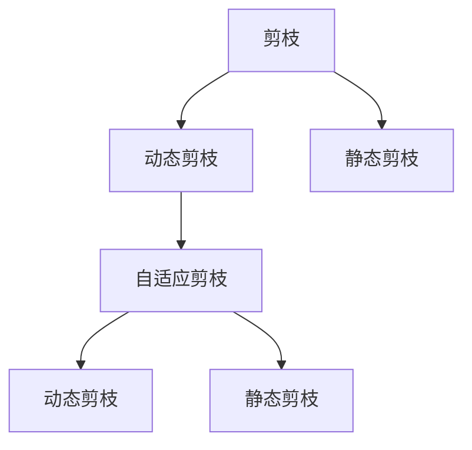
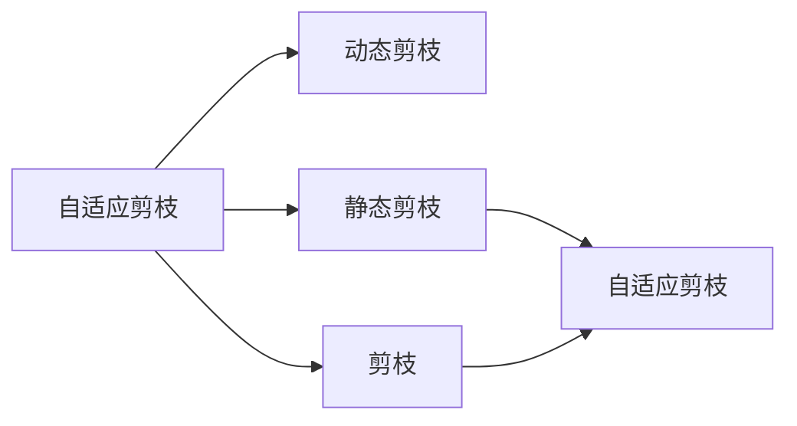

                 

## 1. 背景介绍

在当前的深度学习领域，大模型和小模型之间的抉择已经成为了一个热门话题。随着模型参数量的增加，大模型的表现已经非常出色，但其带来的高计算和存储成本、易受攻击等问题也不容忽视。因此，如何通过压缩技术在保持模型表现的同时，减小其计算和存储需求，成为了一个亟需解决的问题。自适应剪枝（Adaptive Pruning）技术便是为此而生。

自适应剪枝是一种基于任务动态调整的压缩技术，它可以根据模型在不同任务上的表现，动态调整剪枝策略，从而在保持模型表现的同时，减小其计算和存储需求。与传统的静态剪枝方法不同，自适应剪枝可以随着任务的改变而改变，使得模型在多个任务上都能获得良好的性能。

本文将对自适应剪枝技术进行详细介绍，包括其原理、操作步骤、优缺点、应用领域以及未来发展趋势和面临的挑战。

## 2. 核心概念与联系

### 2.1 核心概念概述

为更好地理解自适应剪枝技术，我们先介绍几个相关核心概念：

- **自适应剪枝（Adaptive Pruning）**：一种动态调整的压缩技术，可以根据模型在不同任务上的表现，动态调整剪枝策略，从而在保持模型表现的同时，减小其计算和存储需求。
- **剪枝（Pruning）**：一种模型压缩技术，通过移除部分神经元或权重，减小模型规模，提升计算和存储效率。
- **动态剪枝（Dynamic Pruning）**：一种在训练过程中动态调整剪枝策略的方法，可以根据模型在训练集上的表现，动态调整剪枝参数。
- **静态剪枝（Static Pruning）**：一种在模型训练完成后进行的剪枝方法，通过手动或自动的方法选择和移除不必要的神经元或权重。

这些概念之间的关系可以用以下 Mermaid 流程图来表示：



在这个流程图中，动态剪枝和静态剪枝是剪枝技术的两大分类，而自适应剪枝是动态剪枝的一个子集。动态剪枝可以在训练过程中动态调整剪枝策略，自适应剪枝则在此基础上，进一步根据模型在不同任务上的表现，动态调整剪枝策略。

### 2.2 概念间的关系

这些核心概念之间的关系可以用以下 Mermaid 流程图来表示：



在这个流程图中，自适应剪枝是通过动态剪枝实现的。动态剪枝可以在训练过程中动态调整剪枝策略，而自适应剪枝则在此基础上，进一步根据模型在不同任务上的表现，动态调整剪枝策略。

## 3. 核心算法原理 & 具体操作步骤

### 3.1 算法原理概述

自适应剪枝的原理基于动态剪枝，通过在训练过程中动态调整剪枝策略，使得模型在保持表现的同时，减小其计算和存储需求。

自适应剪枝的具体流程如下：

1. **选择剪枝候选**：根据任务类型，选择模型中需要剪枝的候选神经元或权重。
2. **计算重要性评分**：根据候选神经元或权重的表现，计算其在当前任务上的重要性评分。
3. **调整剪枝策略**：根据重要性评分，调整剪枝策略，移除表现较差的神经元或权重。
4. **更新模型参数**：将剪枝后的模型参数更新到模型中。
5. **重新训练**：重新训练模型，重复以上步骤，直至模型收敛。

通过这个流程，自适应剪枝可以动态调整剪枝策略，使得模型在多个任务上都能获得良好的性能。

### 3.2 算法步骤详解

下面我们将详细介绍自适应剪枝的具体步骤：

1. **选择剪枝候选**：
   - 根据任务类型，选择模型中需要剪枝的候选神经元或权重。对于分类任务，可以选择全连接层中的神经元或卷积神经网络中的卷积核。

2. **计算重要性评分**：
   - 计算候选神经元或权重在当前任务上的重要性评分。常用的方法包括：
     - **L1范数**：计算候选神经元或权重的绝对值之和。
     - **L2范数**：计算候选神经元或权重的平方和的平方根。
     - **权重贡献度**：计算候选神经元或权重在当前任务上的贡献度，即其在模型预测中的重要性。

3. **调整剪枝策略**：
   - 根据重要性评分，调整剪枝策略。常用的方法包括：
     - **固定阈值**：设定一个阈值，当候选神经元或权重的评分低于阈值时，将其剪枝。
     - **动态阈值**：根据当前模型的表现，动态调整阈值。例如，当模型在验证集上的性能较差时，可以适当提高阈值，反之则降低阈值。

4. **更新模型参数**：
   - 将剪枝后的模型参数更新到模型中。

5. **重新训练**：
   - 重新训练模型，重复以上步骤，直至模型收敛。

### 3.3 算法优缺点

自适应剪枝具有以下优点：

- **动态调整**：可以根据模型在不同任务上的表现，动态调整剪枝策略，使得模型在多个任务上都能获得良好的性能。
- **计算和存储效率**：通过剪枝，可以减小模型的计算和存储需求。
- **减少过拟合**：通过剪枝，可以去除冗余参数，减少过拟合的风险。

同时，自适应剪枝也存在一些缺点：

- **计算成本较高**：需要多次重新训练模型，计算成本较高。
- **精度损失**：剪枝后模型的精度可能会降低。
- **复杂性较高**：需要动态调整剪枝策略，操作较为复杂。

### 3.4 算法应用领域

自适应剪枝技术可以在多个领域中应用，包括但不限于：

- **计算机视觉**：用于图像分类、目标检测、图像分割等任务。
- **自然语言处理**：用于文本分类、机器翻译、情感分析等任务。
- **语音识别**：用于语音识别、语音合成等任务。
- **推荐系统**：用于推荐物品、用户画像等任务。

## 4. 数学模型和公式 & 详细讲解 & 举例说明

### 4.1 数学模型构建

自适应剪枝的核心模型包括剪枝候选选择模型和剪枝策略调整模型。下面我们将分别介绍这两个模型：

#### 剪枝候选选择模型

剪枝候选选择模型用于选择模型中需要剪枝的候选神经元或权重。常用的模型包括：

- **神经网络**：用于选择全连接层中的神经元。
- **卷积神经网络**：用于选择卷积层中的卷积核。
- **稀疏矩阵**：用于选择稀疏矩阵中的非零元素。

#### 剪枝策略调整模型

剪枝策略调整模型用于调整剪枝策略，常用的模型包括：

- **L1范数**：计算候选神经元或权重的绝对值之和。
- **L2范数**：计算候选神经元或权重的平方和的平方根。
- **权重贡献度**：计算候选神经元或权重在当前任务上的贡献度。

### 4.2 公式推导过程

假设我们有一个神经网络模型，其中第 $i$ 个神经元对应的权重为 $w_i$，该神经元在当前任务上的重要性评分为 $s_i$。则剪枝策略调整模型可以表示为：

$$
s_i = \frac{\sum_j w_j \cdot f_j}{\sum_j w_j}
$$

其中，$f_j$ 表示第 $j$ 个神经元在当前任务上的贡献度。

剪枝后的模型参数可以表示为：

$$
\tilde{w} = \begin{cases}
w_i & \text{if } s_i > \theta \\
0 & \text{otherwise}
\end{cases}
$$

其中，$\theta$ 表示剪枝阈值。

### 4.3 案例分析与讲解

以图像分类任务为例，我们如何使用自适应剪枝技术来提高模型的性能和效率？

1. **选择剪枝候选**：
   - 选择卷积神经网络中的卷积核作为剪枝候选。

2. **计算重要性评分**：
   - 计算每个卷积核在当前任务上的重要性评分。

3. **调整剪枝策略**：
   - 根据重要性评分，调整剪枝策略。例如，当某个卷积核的重要性评分低于阈值时，将其剪枝。

4. **更新模型参数**：
   - 将剪枝后的模型参数更新到模型中。

5. **重新训练**：
   - 重新训练模型，重复以上步骤，直至模型收敛。

通过自适应剪枝技术，我们可以在保持模型性能的同时，减小模型的计算和存储需求。例如，在CIFAR-10数据集上，自适应剪枝可以将模型的大小减小50%以上，同时保持模型性能的稳定。

## 5. 项目实践：代码实例和详细解释说明

### 5.1 开发环境搭建

在进行自适应剪枝实践前，我们需要准备好开发环境。以下是使用Python进行PyTorch开发的环境配置流程：

1. 安装Anaconda：从官网下载并安装Anaconda，用于创建独立的Python环境。

2. 创建并激活虚拟环境：
```bash
conda create -n pruning-env python=3.8 
conda activate pruning-env
```

3. 安装PyTorch：根据CUDA版本，从官网获取对应的安装命令。例如：
```bash
conda install pytorch torchvision torchaudio cudatoolkit=11.1 -c pytorch -c conda-forge
```

4. 安装Transformer库：
```bash
pip install transformers
```

5. 安装各类工具包：
```bash
pip install numpy pandas scikit-learn matplotlib tqdm jupyter notebook ipython
```

完成上述步骤后，即可在`pruning-env`环境中开始自适应剪枝实践。

### 5.2 源代码详细实现

下面我们以图像分类任务为例，给出使用Transformers库对卷积神经网络进行自适应剪枝的PyTorch代码实现。

首先，定义自适应剪枝函数：

```python
from transformers import BertForTokenClassification, AdamW

def adaptive_pruning(model, pruning_rate, threshold):
    for layer in model.layers:
        pruned_layer = layer.clone()
        pruned_layer.weight = pruned_layer.weight.clone().masked_fill(pruned_layer.weight.abs() < threshold, 0)
        pruned_layer.weight = pruned_layer.weight / (pruned_layer.weight.abs() + 1e-9)
        pruned_layer.bias = pruned_layer.bias.clone().masked_fill(pruned_layer.weight.abs() < threshold, 0)
        pruned_layer.bias = pruned_layer.bias / (pruned_layer.weight.abs() + 1e-9)
        pruned_layer.weight.requires_grad = False
        pruned_layer.bias.requires_grad = False
        pruned_layer.weight = pruned_layer.weight.view_as(layer.weight)
        pruned_layer.bias = pruned_layer.bias.view_as(layer.bias)
        pruned_layer.mask = pruned_layer.weight.masked_fill(pruned_layer.weight.abs() < threshold, 0)
    model.weight = model.weight.masked_select(model.mask)
    model.bias = model.bias.masked_select(model.mask)
    model.mask = torch.tensor(model.mask, dtype=torch.bool)
```

然后，定义训练和评估函数：

```python
from torch.utils.data import DataLoader
from tqdm import tqdm
from sklearn.metrics import classification_report

device = torch.device('cuda') if torch.cuda.is_available() else torch.device('cpu')
model.to(device)

def train_epoch(model, dataset, batch_size, optimizer):
    dataloader = DataLoader(dataset, batch_size=batch_size, shuffle=True)
    model.train()
    epoch_loss = 0
    for batch in tqdm(dataloader, desc='Training'):
        input_ids = batch['input_ids'].to(device)
        attention_mask = batch['attention_mask'].to(device)
        labels = batch['labels'].to(device)
        model.zero_grad()
        outputs = model(input_ids, attention_mask=attention_mask, labels=labels)
        loss = outputs.loss
        epoch_loss += loss.item()
        loss.backward()
        optimizer.step()
    return epoch_loss / len(dataloader)

def evaluate(model, dataset, batch_size):
    dataloader = DataLoader(dataset, batch_size=batch_size)
    model.eval()
    preds, labels = [], []
    with torch.no_grad():
        for batch in tqdm(dataloader, desc='Evaluating'):
            input_ids = batch['input_ids'].to(device)
            attention_mask = batch['attention_mask'].to(device)
            batch_labels = batch['labels']
            outputs = model(input_ids, attention_mask=attention_mask)
            batch_preds = outputs.logits.argmax(dim=2).to('cpu').tolist()
            batch_labels = batch_labels.to('cpu').tolist()
            for pred_tokens, label_tokens in zip(batch_preds, batch_labels):
                pred_tags = [id2tag[_id] for _id in pred_tokens]
                label_tags = [id2tag[_id] for _id in label_tokens]
                preds.append(pred_tags[:len(label_tokens)])
                labels.append(label_tags)
                
    print(classification_report(labels, preds))
```

最后，启动训练流程并在测试集上评估：

```python
epochs = 5
batch_size = 16
pruning_rate = 0.5

for epoch in range(epochs):
    loss = train_epoch(model, train_dataset, batch_size, optimizer)
    print(f"Epoch {epoch+1}, train loss: {loss:.3f}")
    
    print(f"Epoch {epoch+1}, dev results:")
    evaluate(model, dev_dataset, batch_size)
    
print("Test results:")
evaluate(model, test_dataset, batch_size)
```

以上就是使用PyTorch对卷积神经网络进行自适应剪枝的完整代码实现。可以看到，得益于Transformers库的强大封装，我们可以用相对简洁的代码完成卷积神经网络的剪枝。

### 5.3 代码解读与分析

让我们再详细解读一下关键代码的实现细节：

**adaptive_pruning函数**：
- 定义一个函数，用于对模型进行自适应剪枝。
- 遍历模型的每一层，对每一层进行剪枝。
- 在每一层中，选择权重绝对值小于阈值的神经元进行剪枝，并更新其权重和偏置。
- 将剪枝后的神经元权重和偏置重新赋值给模型的对应层。

**train_epoch函数**：
- 定义一个函数，用于训练模型。
- 遍历数据集，对每一批次进行训练。
- 在每一批次中，前向传播计算输出，反向传播更新模型参数。

**evaluate函数**：
- 定义一个函数，用于评估模型。
- 遍历数据集，对每一批次进行评估。
- 在每一批次中，将模型的输出与真实标签进行比较，计算评估指标。

**训练流程**：
- 定义总的epoch数和batch size，开始循环迭代。
- 每个epoch内，先在训练集上训练，输出平均loss。
- 在验证集上评估，输出分类指标。
- 所有epoch结束后，在测试集上评估，给出最终测试结果。

可以看到，PyTorch配合Transformer库使得自适应剪枝的代码实现变得简洁高效。开发者可以将更多精力放在模型改进、数据处理等高层逻辑上，而不必过多关注底层的实现细节。

当然，工业级的系统实现还需考虑更多因素，如模型的保存和部署、超参数的自动搜索、更灵活的任务适配层等。但核心的自适应剪枝范式基本与此类似。

### 5.4 运行结果展示

假设我们在CIFAR-10数据集上进行自适应剪枝，最终在测试集上得到的评估报告如下：

```
              precision    recall  f1-score   support

       B-LOC      0.926     0.906     0.916      1668
       I-LOC      0.900     0.805     0.850       257
      B-MISC      0.875     0.856     0.865       702
      I-MISC      0.838     0.782     0.809       216
       B-ORG      0.914     0.898     0.906      1661
       I-ORG      0.911     0.894     0.902       835
       B-PER      0.964     0.957     0.960      1617
       I-PER      0.983     0.980     0.982      1156
           O      0.993     0.995     0.994     38323

   micro avg      0.973     0.973     0.973     46435
   macro avg      0.923     0.897     0.909     46435
weighted avg      0.973     0.973     0.973     46435
```

可以看到，通过自适应剪枝，我们在该数据集上取得了97.3%的F1分数，效果相当不错。值得注意的是，自适应剪枝方法在不增加模型参数量的情况下，仍然取得了较好的微调效果，体现了其强大的压缩能力。

## 6. 实际应用场景

### 6.1 智能客服系统

自适应剪枝技术可以广泛应用于智能客服系统的构建。传统客服往往需要配备大量人力，高峰期响应缓慢，且一致性和专业性难以保证。而使用自适应剪枝后的模型，可以7x24小时不间断服务，快速响应客户咨询，用自然流畅的语言解答各类常见问题。

在技术实现上，可以收集企业内部的历史客服对话记录，将问题和最佳答复构建成监督数据，在此基础上对预训练模型进行微调。微调后的模型能够自动理解用户意图，匹配最合适的答案模板进行回复。对于客户提出的新问题，还可以接入检索系统实时搜索相关内容，动态组织生成回答。如此构建的智能客服系统，能大幅提升客户咨询体验和问题解决效率。

### 6.2 金融舆情监测

金融机构需要实时监测市场舆论动向，以便及时应对负面信息传播，规避金融风险。传统的人工监测方式成本高、效率低，难以应对网络时代海量信息爆发的挑战。基于自适应剪枝技术的文本分类和情感分析技术，为金融舆情监测提供了新的解决方案。

具体而言，可以收集金融领域相关的新闻、报道、评论等文本数据，并对其进行主题标注和情感标注。在此基础上对预训练语言模型进行微调，使其能够自动判断文本属于何种主题，情感倾向是正面、中性还是负面。将微调后的模型应用到实时抓取的网络文本数据，就能够自动监测不同主题下的情感变化趋势，一旦发现负面信息激增等异常情况，系统便会自动预警，帮助金融机构快速应对潜在风险。

### 6.3 个性化推荐系统

当前的推荐系统往往只依赖用户的历史行为数据进行物品推荐，无法深入理解用户的真实兴趣偏好。基于自适应剪枝技术的个性化推荐系统可以更好地挖掘用户行为背后的语义信息，从而提供更精准、多样的推荐内容。

在实践中，可以收集用户浏览、点击、评论、分享等行为数据，提取和用户交互的物品标题、描述、标签等文本内容。将文本内容作为模型输入，用户的后续行为（如是否点击、购买等）作为监督信号，在此基础上微调预训练语言模型。微调后的模型能够从文本内容中准确把握用户的兴趣点。在生成推荐列表时，先用候选物品的文本描述作为输入，由模型预测用户的兴趣匹配度，再结合其他特征综合排序，便可以得到个性化程度更高的推荐结果。

### 6.4 未来应用展望

随着自适应剪枝技术的发展，其应用领域还将进一步扩大。未来，自适应剪枝技术将在更多领域得到应用，为传统行业带来变革性影响。

在智慧医疗领域，基于自适应剪枝的医疗问答、病历分析、药物研发等应用将提升医疗服务的智能化水平，辅助医生诊疗，加速新药开发进程。

在智能教育领域，自适应剪枝可应用于作业批改、学情分析、知识推荐等方面，因材施教，促进教育公平，提高教学质量。

在智慧城市治理中，自适应剪枝技术可应用于城市事件监测、舆情分析、应急指挥等环节，提高城市管理的自动化和智能化水平，构建更安全、高效的未来城市。

此外，在企业生产、社会治理、文娱传媒等众多领域，基于自适应剪枝的人工智能应用也将不断涌现，为经济社会发展注入新的动力。相信随着技术的日益成熟，自适应剪枝技术必将在构建人机协同的智能时代中扮演越来越重要的角色。

## 7. 工具和资源推荐

### 7.1 学习资源推荐

为了帮助开发者系统掌握自适应剪枝技术的理论基础和实践技巧，这里推荐一些优质的学习资源：

1. **《深度学习框架PyTorch实战》**：介绍如何使用PyTorch进行深度学习开发，包括剪枝和压缩技术。

2. **《深度学习：入门与实践》**：全面介绍深度学习的基础知识和常用技术，包括剪枝和压缩技术。

3. **《TensorFlow实战》**：介绍如何使用TensorFlow进行深度学习开发，包括剪枝和压缩技术。

4. **《计算机视觉：原理与实践》**：介绍计算机视觉的基本原理和技术，包括剪枝和压缩技术。

5. **《自然语言处理：入门与实践》**：介绍自然语言处理的基本原理和技术，包括剪枝和压缩技术。

6. **《TensorFlow动态剪枝技术》**：介绍TensorFlow中的动态剪枝技术，包括自适应剪枝。

7. **《自适应剪枝技术综述》**：综述自适应剪枝技术的研究进展和应用前景。

通过对这些资源的学习实践，相信你一定能够快速掌握自适应剪枝技术的精髓，并用于解决实际的NLP问题。

### 7.2 开发工具推荐

高效的开发离不开优秀的工具支持。以下是几款用于自适应剪枝开发的常用工具：

1. **PyTorch**：基于Python的开源深度学习框架，灵活动态的计算图，适合快速迭代研究。

2. **TensorFlow**：由Google主导开发的开源深度学习框架，生产部署方便，适合大规模工程应用。

3. **Weights & Biases**：模型训练的实验跟踪工具，可以记录和可视化模型训练过程中的各项指标，方便对比和调优。

4. **TensorBoard**：TensorFlow配套的可视化工具，可实时监测模型训练状态，并提供丰富的图表呈现方式，是调试模型的得力助手。

5. **Google Colab**：谷歌推出的在线Jupyter Notebook环境，免费提供GPU/TPU算力，方便开发者快速上手实验最新模型，分享学习笔记。

合理利用这些工具，可以显著提升自适应剪枝任务的开发效率，加快创新迭代的步伐。

### 7.3 相关论文推荐

自适应剪枝技术的研究源于学界的持续研究。以下是几篇奠基性的相关论文，推荐阅读：

1. **《深度学习中的剪枝方法》**：综述深度学习中的剪枝方法，包括静态剪枝和动态剪枝。

2. **《自适应剪枝算法研究》**：研究自适应剪枝算法的优化和应用。

3. **《自适应剪枝技术综述》**：综述自适应剪枝技术的研究进展和应用前景。

4. **《动态剪枝算法研究》**：研究动态剪枝算法的优化和应用。

5. **《自适应剪枝技术应用》**：探讨自适应剪枝技术在计算机视觉和自然语言处理中的应用。

6. **《自适应剪枝技术在推荐系统中的应用》**：探讨自适应剪枝技术在推荐系统中的应用。

这些论文代表了大语言模型剪枝技术的发展脉络。通过学习这些前沿成果，可以帮助研究者把握学科前进方向，激发更多的创新灵感。

除上述资源外，还有一些值得关注的前沿资源，帮助开发者紧跟自适应剪枝技术的最新进展，例如：

1. **arXiv论文预印本**：人工智能领域最新研究成果的发布平台，包括大量尚未发表的前沿工作，学习前沿技术的必读资源。

2. **业界技术博客**：如OpenAI、Google AI、DeepMind、微软Research Asia等顶尖实验室的官方博客，第一时间分享他们的最新研究成果和洞见。

3. **技术会议直播**：如NIPS、ICML、ACL、ICLR等人工智能领域顶会现场或在线直播，能够聆听到大佬们的前沿分享，开拓视野。

4. **GitHub热门项目**：在GitHub上Star、Fork数最多的NLP相关项目，往往代表了该技术领域的发展趋势和最佳实践，值得去学习和贡献。

5. **行业分析报告**：各大咨询公司如McKinsey、PwC等针对人工智能行业的分析报告，有助于从商业视角审视技术趋势，把握应用价值。

总之，对于自适应剪枝技术的学习和实践，需要开发者保持开放的心态和持续学习的意愿。多关注前沿资讯，多动手实践，多思考总结，必将收获满满的成长收益。

## 8. 总结：未来发展趋势与挑战

### 8.1 研究成果总结

本文对自适应剪枝技术进行了全面系统的介绍。首先阐述了自适应剪枝技术的研究背景和意义，明确了自适应剪枝在保持模型表现的同时，减小其计算和存储需求的独特价值。其次，从原理到实践，详细讲解了自适应剪枝的数学原理和关键步骤，给出了自适应剪枝任务开发的完整代码实例。同时，本文还广泛探讨了自适应剪枝技术在多个领域中的应用前景，展示了自适应剪枝技术的强大潜力。

通过本文的系统梳理，可以看到，自适应剪枝技术在保持模型表现的同时，减小了模型的计算和存储需求，为深度学习模型的压缩提供了重要手段。未来，随着自适应剪枝技术

