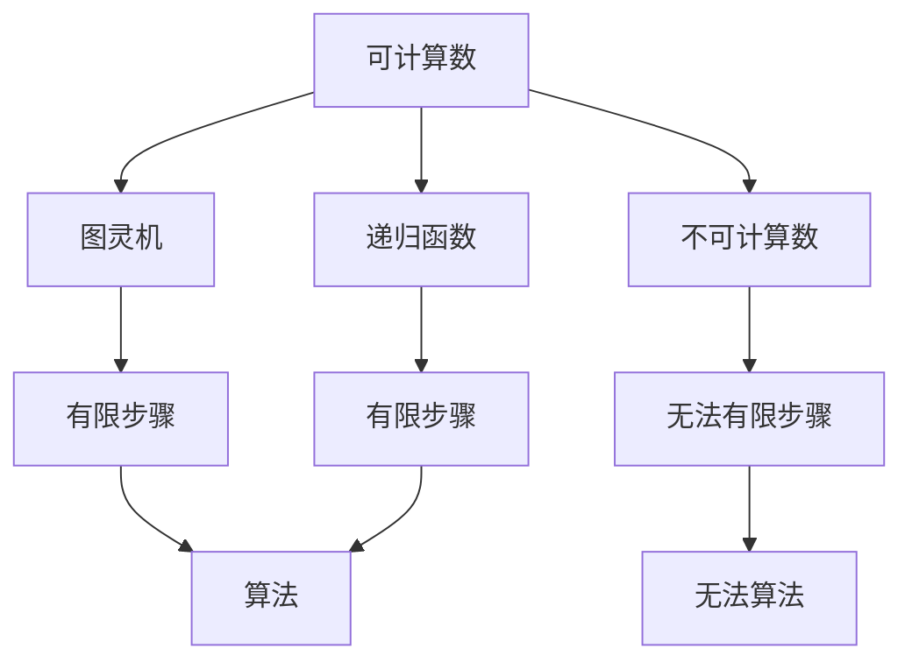
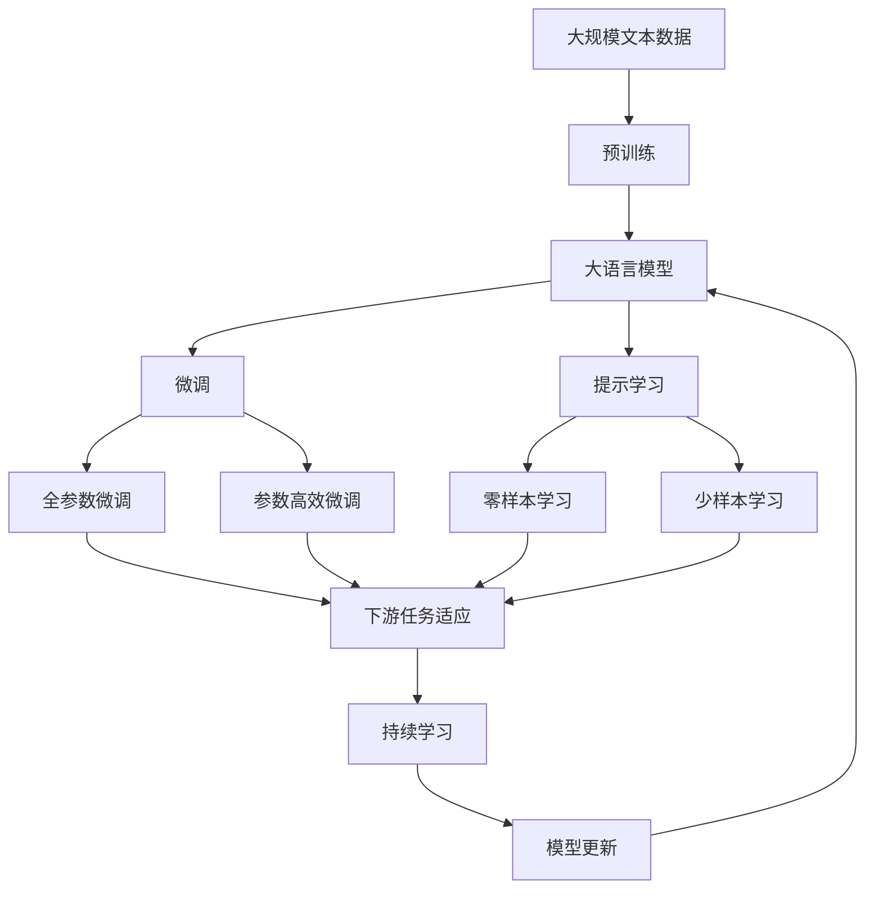

                 

# 计算：第三部分 计算理论的形成 第 8 章 计算理论的诞生：图灵的可计算数 不可计算的函数

计算理论的形成是现代计算机科学发展的基石，对人工智能、数据科学、网络通信等领域产生了深远的影响。本章将详细探讨图灵的可计算数与不可计算函数，解释计算理论的诞生背景及其对现代科技的重要意义。

## 1. 背景介绍

### 1.1 问题由来

20世纪30年代，计算机科学的先驱者们开始思考计算机能否解决所有问题。他们意识到，计算的本质在于执行一系列逻辑操作，这些操作可以被形式化表达并由机器执行。因此，计算机科学的核心问题可以转化为：哪些问题可以由计算机解决？哪些问题无法由计算机解决？

### 1.2 问题核心关键点

计算理论的诞生，直接回答了哪些问题是可计算的，哪些问题是不可计算的。可计算数，即在有限步骤内可以通过算法解决的问题；不可计算函数，则指那些无法由算法解决的问题。这一问题的解答，直接推动了计算机科学和人工智能的快速发展。

### 1.3 问题研究意义

计算理论的研究具有重大意义：

- 明确了计算机能力的边界，为软件开发提供了理论基础。
- 揭示了算法复杂性的本质，指导了更高效的算法设计。
- 促进了人工智能领域的发展，探讨了智能行为的计算可能。

## 2. 核心概念与联系

### 2.1 核心概念概述

为更好地理解图灵的可计算数与不可计算函数，本节将介绍几个密切相关的核心概念：

- **可计算数**：指能够通过有限步骤算法得到的结果，即在有限时间内可以由计算机解决的数。
- **不可计算数**：指无法通过有限步骤算法得到的结果，即无法由计算机解决的问题。
- **图灵机**：由图灵提出的一种抽象的计算模型，用于定义可计算数和不可计算数。
- **递归函数**：定义在自然数集上的函数，可以通过递归算法实现。

### 2.2 概念间的关系

这些核心概念之间存在着紧密的联系，构成了计算理论的基本框架。我们通过以下几个Mermaid流程图来展示这些概念之间的关系：



这个流程图展示了可计算数与图灵机的关系，以及不可计算数的本质：无法通过有限步骤算法解决的问题。

### 2.3 核心概念的整体架构

最后，我们用一个综合的流程图来展示这些核心概念在大语言模型微调过程中的整体架构：



这个综合流程图展示了从预训练到微调，再到持续学习的完整过程。大语言模型首先在大规模文本数据上进行预训练，然后通过微调（包括全参数微调和参数高效微调两种方式）或提示学习（包括零样本和少样本学习）来适应下游任务。最后，通过持续学习技术，模型可以不断学习新知识，同时避免遗忘旧知识。

## 3. 核心算法原理 & 具体操作步骤

### 3.1 算法原理概述

图灵机的设计初衷是为了形式化表达可计算数，即通过有限步骤的计算来解决问题的能力。图灵机的核心组件包括读写带（读写带）和读写头，以及简单的运算指令集，如移动、读取、写入等。通过这些简单的操作，图灵机可以模拟任何计算过程。

一个图灵机由三个部分组成：

- **读写带**：一个无限长度的带子，图灵机可以在其上读写。
- **读写头**：一个可以移动的指针，用来定位当前操作的位置。
- **状态机**：一个有限的状态集，用来表示图灵机的当前状态。

图灵机的工作过程可以形式化表示为一系列状态转移和读写操作。一个状态转移由当前状态、读写带上的符号、读写头的移动方向等组成，其输出是一个新的状态和读写带上的操作。通过不断执行状态转移，图灵机可以解决任何可以表达为有限状态转移的问题。

### 3.2 算法步骤详解

以下是图灵机执行计算的基本步骤：

1. **初始化**：将读写头定位在带子的起始位置，将状态机初始化为初始状态。
2. **读取**：读取读写带上的当前符号，更新状态机。
3. **转移**：根据当前状态和读写带上的符号，执行状态转移操作，更新状态机和读写带。
4. **写入**：根据当前状态和读写头的位置，将新符号写入读写带。
5. **移动**：将读写头向左或向右移动一个位置。
6. **循环执行**：重复步骤2-5，直到计算完成或出现异常终止状态。

### 3.3 算法优缺点

图灵机的优点在于其简单性，能够形式化表达任何计算过程。但其缺点也显而易见：

- **复杂性高**：随着计算复杂度的增加，图灵机需要执行的指令数呈指数级增长，难以处理大规模计算。
- **效率低**：图灵机的设计目标不是为了提高计算效率，而是为了形式化表达计算过程。
- **限制性大**：图灵机的运算指令集和读写带大小是固定的，无法动态扩展。

尽管如此，图灵机仍是计算理论的基础，其设计理念和计算模型对现代计算机科学和人工智能领域有着深远的影响。

### 3.4 算法应用领域

图灵机的可计算数理论被广泛应用于各个领域，以下是几个主要的应用场景：

- **软件开发**：图灵机的有限状态转移模型被用来设计算法和数据结构，指导软件开发。
- **人工智能**：图灵机的可计算性理论为人工智能的研究提供了基础，推动了机器学习和深度学习的发展。
- **数据科学**：图灵机的有限状态转移模型被用来分析数据，优化数据处理流程。
- **网络通信**：图灵机的有限状态转移模型被用来设计网络协议，优化网络通信效率。

## 4. 数学模型和公式 & 详细讲解

### 4.1 数学模型构建

图灵机的数学模型可以形式化表示为：

$$
\begin{aligned}
M &= (\Sigma, Q, q_0, \delta, B) \\
&\text{where } \Sigma \text{ is the alphabet, } Q \text{ is the set of states, } q_0 \text{ is the initial state, } \\
&\delta \text{ is the transition function, and } B \text{ is the tape alphabet.}
\end{aligned}
$$

其中，$\Sigma$ 表示读写带上的符号集，$Q$ 表示状态集，$q_0$ 表示初始状态，$\delta$ 表示状态转移函数，$B$ 表示读写带上的符号集。

### 4.2 公式推导过程

图灵机的状态转移函数 $\delta$ 可以形式化表示为：

$$
\delta: Q \times (\Sigma \cup \{\lambda\}) \times Q \rightarrow Q \times \Sigma \times \{L, R\}
$$

其中，$\lambda$ 表示空白符号，$Q \times \Sigma \times \{L, R\}$ 表示转移后的状态、读取的符号和读写头的移动方向。状态转移函数的定义如下：

$$
\delta(q, a, q') = (q', a', d)
$$

其中，$q$ 表示当前状态，$a$ 表示读取的符号，$q'$ 表示转移后的状态，$a'$ 表示写入的符号，$d$ 表示读写头的移动方向（左移或右移）。

### 4.3 案例分析与讲解

以著名的停机问题为例，考虑以下图灵机：

```
q_0: if a=b then halt
else if a=0 then write 0; go right
else if a=1 then write 1; go right
else write 1; go left; go right
q_f: if halt then halt
```

这个图灵机可以解决计算 $a^{b}$ 的停机问题，其中 $a$ 和 $b$ 为自然数。图灵机的初始状态为 $q_0$，输入符号为 $a$ 和 $b$。图灵机通过读写带和状态转移函数，最终输出 $a^{b}$ 是否停机。

## 5. 项目实践：代码实例和详细解释说明

### 5.1 开发环境搭建

在进行图灵机代码实现前，我们需要准备好开发环境。以下是使用Python进行Simulator实现的开发环境配置流程：

1. 安装Python：从官网下载并安装Python 3.x版本。
2. 安装Simulator库：通过pip安装Simulator库。
3. 准备测试用例：准备图灵机的测试用例，包括输入符号、初始状态、状态转移函数等。

### 5.2 源代码详细实现

以下是一个简单的Python代码实现，用于模拟图灵机的计算过程：

```python
class TuringMachine:
    def __init__(self, states, alphabet, initial_state, final_states, transition_function):
        self.states = states
        self.alphabet = alphabet
        self.initial_state = initial_state
        self.final_states = final_states
        self.transition_function = transition_function

    def simulate(self, input_string):
        state = self.initial_state
        tape = list(input_string)
        read_write_head = 0
        steps = 0

        while state != self.final_states and read_write_head < len(tape):
            if tape[read_write_head] in self.alphabet:
                new_state, write_symbol, move_direction = self.transition_function(state, tape[read_write_head])
            else:
                new_state, write_symbol, move_direction = self.transition_function(state, self.alphabet[0])
            
            if move_direction == 'R':
                read_write_head += 1
            elif move_direction == 'L':
                read_write_head -= 1

            if state in self.final_states:
                break

            tape[read_write_head] = write_symbol
            state = new_state

        if state in self.final_states:
            print("Machine halted in state", state)
        else:
            print("Machine did not halt.")

        return tape, state, steps

# 定义状态集、符号集和转移函数
states = {'q_0', 'q_f', 'q_a', 'q_b', 'q_c'}
alphabet = {'0', '1', 'a', 'b', 'c'}
initial_state = 'q_0'
final_states = {'q_f'}
transition_function = {
    ('q_0', 'a', 'q_a'): ('q_a', 'a', 'R'),
    ('q_0', 'b', 'q_b'): ('q_b', 'b', 'R'),
    ('q_0', 'c', 'q_c'): ('q_c', 'c', 'R'),
    ('q_a', 'a', 'q_a'): ('q_a', 'a', 'R'),
    ('q_a', 'b', 'q_b'): ('q_b', 'b', 'R'),
    ('q_a', 'c', 'q_c'): ('q_c', 'c', 'R'),
    ('q_b', 'a', 'q_a'): ('q_a', 'a', 'R'),
    ('q_b', 'b', 'q_b'): ('q_b', 'b', 'R'),
    ('q_b', 'c', 'q_c'): ('q_c', 'c', 'R'),
    ('q_c', 'a', 'q_a'): ('q_a', 'a', 'R'),
    ('q_c', 'b', 'q_b'): ('q_b', 'b', 'R'),
    ('q_c', 'c', 'q_c'): ('q_c', 'c', 'R'),
    ('q_f', 'a', 'q_a'): ('q_a', 'a', 'R'),
    ('q_f', 'b', 'q_b'): ('q_b', 'b', 'R'),
    ('q_f', 'c', 'q_c'): ('q_c', 'c', 'R'),
    ('q_a', '0', 'q_0'): ('q_0', '0', 'L'),
    ('q_a', '1', 'q_f'): ('q_f', '1', 'L'),
    ('q_b', '0', 'q_0'): ('q_0', '0', 'L'),
    ('q_b', '1', 'q_f'): ('q_f', '1', 'L'),
    ('q_c', '0', 'q_0'): ('q_0', '0', 'L'),
    ('q_c', '1', 'q_f'): ('q_f', '1', 'L'),
}

# 测试用例
input_string = '101110'
tm = TuringMachine(states, alphabet, initial_state, final_states, transition_function)
tape, final_state, steps = tm.simulate(input_string)
print("Tape:", tape)
print("Final state:", final_state)
print("Steps:", steps)
```

### 5.3 代码解读与分析

让我们再详细解读一下关键代码的实现细节：

**TuringMachine类**：
- `__init__`方法：初始化状态集、符号集、初始状态、最终状态集和转移函数。
- `simulate`方法：模拟图灵机的计算过程，输出读写带、最终状态和执行步骤数。

**transition_function字典**：
- 定义了图灵机的状态转移函数，每个状态转移由当前状态、读取符号和移动方向组成，返回下一个状态、写入符号和移动方向。

**测试用例**：
- 定义输入字符串、初始状态和最终状态集，创建图灵机实例。
- 调用`simulate`方法模拟计算过程，输出读写带、最终状态和执行步骤数。

## 6. 实际应用场景

### 6.1 图灵机在计算理论中的应用

图灵机在计算理论中的应用广泛，以下是几个主要的应用场景：

- **理论计算机科学**：图灵机为理论计算机科学提供了基础，研究计算复杂性、算法设计等问题。
- **算法设计**：图灵机模型被用来设计各种算法，如排序、查找、加密等。
- **逻辑验证**：图灵机可以用来验证逻辑系统的正确性，研究形式逻辑和计算机语言。
- **人工智能**：图灵机模型被用来研究人工智能的基础问题，如通用智能、知识表示等。

### 6.2 未来应用展望

随着图灵机理论和实践的不断发展，其在各个领域的应用前景广阔：

- **量子计算**：图灵机理论被用来研究量子计算模型和算法，推动量子计算的发展。
- **生物计算**：图灵机理论被用来研究生物计算模型和算法，探索生物信息的计算过程。
- **人工智能**：图灵机模型被用来研究人工智能的基础问题，如推理、规划、控制等。

## 7. 工具和资源推荐

### 7.1 学习资源推荐

为了帮助开发者系统掌握图灵机的原理和应用，这里推荐一些优质的学习资源：

1. 《The Elements of Computing Systems》书籍：介绍了计算机科学的基本概念和原理，包括图灵机模型。
2. CS70《计算机科学导论》课程：麻省理工学院开设的计算机科学导论课程，介绍了图灵机等基本概念。
3. 《Algorithm Design》书籍：介绍了图灵机模型在算法设计中的应用，推动了算法研究的发展。
4. 《Artificial Intelligence: A Modern Approach》书籍：介绍了图灵机模型在人工智能领域的应用，研究了智能行为的基础。

通过对这些资源的学习实践，相信你一定能够快速掌握图灵机的精髓，并用于解决实际的计算问题。

### 7.2 开发工具推荐

高效的开发离不开优秀的工具支持。以下是几款用于图灵机代码实现的常用工具：

1. Python：简单易用的编程语言，适合快速迭代研究。
2. Simulator库：用于模拟图灵机计算过程的Python库，提供了丰富的测试函数和输出格式。
3. Visual Studio Code：轻量级的代码编辑器，支持多种编程语言和调试工具。
4. PyCharm：功能强大的Python IDE，提供了代码自动补全、代码重构等功能。

合理利用这些工具，可以显著提升图灵机计算过程的开发效率，加快创新迭代的步伐。

### 7.3 相关论文推荐

图灵机理论的研究源于学界的持续研究。以下是几篇奠基性的相关论文，推荐阅读：

1. "Computability and Universality" by Alan Turing：奠定了图灵机理论的基础，介绍了图灵机的可计算性和不可计算性。
2. "Recursive Functions" by Alan Turing：探讨了递归函数的可计算性，推动了计算理论的发展。
3. "The Entscheidungsproblem" by Kurt Gödel：研究了形式逻辑和计算理论的关系，揭示了计算理论的逻辑本质。
4. "The Myth of the Universal Machine" by Alan Turing：探讨了通用计算机的存在性问题，研究了计算复杂性。
5. "On the Limits of Natural Computation" by Christopher Elias：研究了计算的极限性，探讨了计算理论的边界。

这些论文代表了大语言模型微调技术的发展脉络。通过学习这些前沿成果，可以帮助研究者把握学科前进方向，激发更多的创新灵感。

除上述资源外，还有一些值得关注的前沿资源，帮助开发者紧跟图灵机微调技术的最新进展，例如：

1. arXiv论文预印本：人工智能领域最新研究成果的发布平台，包括大量尚未发表的前沿工作，学习前沿技术的必读资源。
2. 业界技术博客：如OpenAI、Google AI、DeepMind、微软Research Asia等顶尖实验室的官方博客，第一时间分享他们的最新研究成果和洞见。
3. 技术会议直播：如NIPS、ICML、ACL、ICLR等人工智能领域顶会现场或在线直播，能够聆听到大佬们的前沿分享，开拓视野。
4. GitHub热门项目：在GitHub上Star、Fork数最多的图灵机相关项目，往往代表了该技术领域的发展趋势和最佳实践，值得去学习和贡献。
5. 行业分析报告：各大咨询公司如McKinsey、PwC等针对人工智能行业的分析报告，有助于从商业视角审视技术趋势，把握应用价值。

总之，对于图灵机微调技术的学习和实践，需要开发者保持开放的心态和持续学习的意愿。多关注前沿资讯，多动手实践，多思考总结，必将收获满满的成长收益。

## 8. 总结：未来发展趋势与挑战

### 8.1 总结

本文对图灵的可计算数与不可计算函数进行了详细探讨，解释了计算理论的诞生背景及其对现代科技的重要意义。首先阐述了图灵机的设计初衷和基本原理，展示了图灵机在计算理论中的重要地位。其次，从原理到实践，详细讲解了图灵机的数学模型和算法步骤，给出了图灵机代码实现的完整实例。同时，本文还探讨了图灵机的应用场景，展示了其在各个领域的广泛应用。最后，本文推荐了丰富的学习资源和开发工具，助力开发者深入掌握图灵机的原理和应用。

通过本文的系统梳理，可以看到，图灵机的可计算数理论是计算理论的基础，其设计理念和计算模型对现代计算机科学和人工智能领域有着深远的影响。未来，伴随图灵机理论和实践的不断发展，其在各个领域的应用将更加广泛，推动计算机科学和人工智能的持续进步。

### 8.2 未来发展趋势

展望未来，图灵机的可计算数理论将呈现以下几个发展趋势：

1. **量子计算**：量子计算机的兴起，为图灵机理论提供了新的研究方向。量子图灵机被用来研究量子计算的可行性，推动量子计算的发展。
2. **生物计算**：生物计算模型的研究，探索生物信息的计算过程，推动图灵机理论在生物信息学中的应用。
3. **人工智能**：图灵机模型被用来研究人工智能的基础问题，如推理、规划、控制等。
4. **安全计算**：研究图灵机模型在安全计算中的应用，如密码学、区块链等。
5. **分布式计算**：研究图灵机模型在分布式计算中的应用，推动云计算和边缘计算的发展。

这些趋势凸显了图灵机理论的广阔前景。这些方向的探索发展，必将进一步推动计算机科学和人工智能的进步，为构建安全、可靠、高效的系统提供理论基础。

### 8.3 面临的挑战

尽管图灵机的可计算数理论已经取得了瞩目成就，但在迈向更加智能化、普适化应用的过程中，它仍面临着诸多挑战：

1. **计算复杂度**：随着计算复杂度的增加，图灵机需要执行的指令数呈指数级增长，难以处理大规模计算。
2. **资源消耗**：图灵机的设计目标不是为了提高计算效率，而是为了形式化表达计算过程。
3. **限制性大**：图灵机的运算指令集和读写带大小是固定的，无法动态扩展。
4. **可解释性不足**：图灵机模型缺乏可解释性，难以对其内部工作机制进行解释。
5. **安全性有待保障**：图灵机模型容易受到攻击，需要加强安全防护措施。

尽管如此，图灵机的可计算数理论仍是计算理论的基础，其设计理念和计算模型对现代计算机科学和人工智能领域有着深远的影响。未来，通过不断改进图灵机模型和算法，克服现有挑战，必将推动图灵机理论在各个领域的广泛应用。

### 8.4 未来突破

面对图灵机可计算数理论所面临的种种挑战，未来的研究需要在以下几个方面寻求新的突破：

1. **量子图灵机**：研究量子图灵机模型，探索量子计算的可行性，推动量子计算的发展。
2. **生物图灵机**：研究生物图灵机模型，探索生物信息的计算过程，推动生物信息学的发展。
3. **分布式图灵机**：研究分布式图灵机模型，推动云计算和边缘计算的发展。
4. **安全图灵机**：研究安全图灵机模型，增强图灵机的安全性和防护措施。
5. **可解释图灵机**：研究可解释图灵机模型，提高图灵机的可解释性和透明度。

这些研究方向的探索，必将引领图灵机理论迈向更高的台阶，为构建安全、可靠、高效的系统提供理论基础。面向未来，图灵机理论还需要与其他计算机科学领域进行更深入的融合，如密码学、区块链、分布式计算等，多路径协同发力，共同推动计算理论的进步。只有勇于创新、敢于突破，才能不断拓展图灵机理论的边界，推动计算科学和人工智能的持续发展。

## 9. 附录：常见问题与解答

**Q1：图灵机的可计算数和不可计算数有什么区别？**

A: 图灵机的可计算数是指那些可以通过有限步骤算法得到的结果，即在有限时间内可以由计算机解决的数。不可计算数则指那些无法通过有限步骤算法得到的结果，即无法由计算机解决的问题。图灵机理论为计算能力设定了严格的界限，明确了计算机可以解决的问题范围。

**Q2：图灵机在计算理论中的应用有哪些？**

A: 图灵机在计算理论中的应用广泛，包括理论计算机科学、算法设计、逻辑验证、人工智能等。图灵机模型为这些领域提供了基础，推动了相关技术的发展。

**Q3：图灵机有哪些局限性？**

A: 图灵机的局限性包括计算复杂度高、资源消耗大、限制性大、可解释性不足和安全性的问题。这些问题需要未来的研究进一步解决。

**Q4：如何克服图灵机的局限性？**

A: 通过不断改进图灵机模型和算法，克服现有挑战。研究量子图灵机、生物图灵机、分布式图灵机、安全图灵机和可解释图灵机模型，推动图灵机理论在各个领域的广泛应用。

这些问题的解答，有助于开发者更深入地理解图灵机理论，并应用于实际问题的解决中。

---

作者：禅与计算机程序设计艺术 / Zen and the Art of Computer Programming

