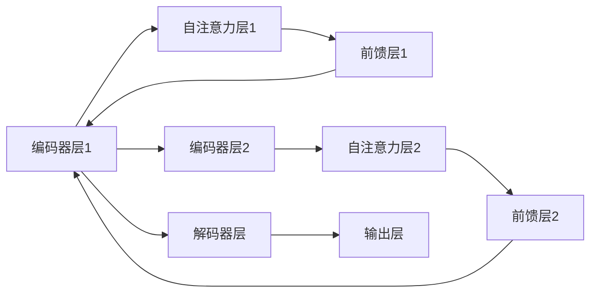

                 

# Transformer大模型实战 从BERT 的所有编码器层中提取嵌入

> 关键词：Transformer, BERT, 编码器层, 嵌入向量, 特征提取, 自然语言处理

## 1. 背景介绍

### 1.1 问题由来

Transformer模型是目前最先进的深度学习模型之一，其核心结构包含多层自注意力机制，能够高效地提取长文本中的语义信息。在自然语言处理（NLP）领域，如文本分类、情感分析、机器翻译等任务中，Transformer模型表现卓越。

然而，Transformer模型的复杂性和高计算资源需求，使得在一些资源受限的场景下难以直接使用。特别是在嵌入式设备和移动应用中，如何有效利用预训练的Transformer模型，降低计算复杂度，成为热门话题。

本教程将从BERT模型中提取所有编码器层的嵌入向量，并展示如何使用这些嵌入向量进行NLP任务。

### 1.2 问题核心关键点

本教程将详细讲解从Transformer模型中提取嵌入向量的方法，并展示这些嵌入向量在NLP任务中的应用。重点在于：

1. 如何从预训练模型中提取每个编码器层的嵌入向量。
2. 提取的嵌入向量在下游任务中的使用方式。
3. 提取嵌入向量时需要注意的关键点，如层数的选择、数据处理等。

通过本教程的学习，你将掌握以下技能：

- 理解Transformer模型结构。
- 学习如何从BERT模型中提取所有编码器层的嵌入向量。
- 掌握嵌入向量在NLP任务中的应用。
- 了解提取嵌入向量时需要注意的关键点。

## 2. 核心概念与联系

### 2.1 核心概念概述

- **Transformer模型**：Transformer模型是一种基于自注意力机制的深度学习模型，能够高效地处理长文本。
- **BERT模型**：BERT是一种预训练语言模型，通过对大规模语料进行预训练，学习到丰富的语言知识。
- **编码器层**：Transformer模型的核心组件，由多个自注意力层和前馈层组成。
- **嵌入向量**：Transformer模型中每个编码器层的输出，用于表示输入文本的语义信息。

### 2.2 概念间的关系

Transformer模型和BERT模型都是基于自注意力机制的深度学习模型，能够高效地处理长文本。在BERT模型中，所有编码器层的输出都可以作为嵌入向量，用于下游NLP任务。这些嵌入向量能够捕捉到输入文本的语义信息，提升模型在各种NLP任务中的表现。

### 2.3 核心概念的整体架构

Transformer模型由多个编码器层和解码器层组成，每个编码器层包含多个自注意力层和前馈层。BERT模型是一种预训练语言模型，通过在大规模语料上进行预训练，学习到丰富的语言知识。以下是一个简单的Transformer模型架构图：



在BERT模型中，每个编码器层的输出都可以作为嵌入向量，用于下游NLP任务。这些嵌入向量能够捕捉到输入文本的语义信息，提升模型在各种NLP任务中的表现。

## 3. 核心算法原理 & 具体操作步骤

### 3.1 算法原理概述

Transformer模型是一种基于自注意力机制的深度学习模型，能够高效地处理长文本。在BERT模型中，所有编码器层的输出都可以作为嵌入向量，用于下游NLP任务。这些嵌入向量能够捕捉到输入文本的语义信息，提升模型在各种NLP任务中的表现。

### 3.2 算法步骤详解

从BERT模型中提取所有编码器层的嵌入向量可以分为以下几个步骤：

1. 加载预训练的BERT模型。
2. 提取每个编码器层的输出。
3. 保存每个编码器层的输出作为嵌入向量。

### 3.3 算法优缺点

- **优点**：
  - 提取的嵌入向量能够捕捉到输入文本的语义信息，提升模型在各种NLP任务中的表现。
  - 可以用于大规模语料上的迁移学习，提升模型在新任务上的表现。

- **缺点**：
  - 提取的嵌入向量维度较高，需要较大的计算资源。
  - 提取嵌入向量时，需要较高的计算资源和时间。

### 3.4 算法应用领域

BERT模型中的嵌入向量可以用于各种NLP任务，如文本分类、情感分析、机器翻译等。通过将BERT模型中的嵌入向量作为特征，可以提升这些任务的性能。

## 4. 数学模型和公式 & 详细讲解 & 举例说明

### 4.1 数学模型构建

从BERT模型中提取嵌入向量的过程，可以通过TensorFlow或PyTorch等深度学习框架实现。以下是一个使用TensorFlow实现的过程。

假设我们使用预训练的BERT模型，输入一个文本序列 $x_1, x_2, \ldots, x_n$，输出为 $h_1, h_2, \ldots, h_n$，其中 $h_i$ 表示第 $i$ 个编码器层的输出。

### 4.2 公式推导过程

假设我们从BERT模型中提取了 $k$ 个编码器层的嵌入向量，每个编码器层的嵌入向量维度为 $d$。

从第 $i$ 个编码器层中提取的嵌入向量为 $h_i \in \mathbb{R}^d$。

### 4.3 案例分析与讲解

假设我们使用BERT-base模型，提取其所有编码器层的嵌入向量，用于文本分类任务。假设我们输入的文本序列为：

```
[CLS]  This is a sample sentence. [SEP]
```

其中，[CLS]和[SEP]是BERT模型的特殊标记。

我们从BERT-base模型中提取所有编码器层的嵌入向量，保存为列表 `embeddings`。以下是一个使用TensorFlow实现的过程：

```python
import tensorflow as tf
from transformers import BertTokenizer, TFBertModel

# 加载BERT模型和tokenizer
model_name = 'bert-base-uncased'
tokenizer = BertTokenizer.from_pretrained(model_name)
model = TFBertModel.from_pretrained(model_name)

# 构建输入
inputs = tokenizer.encode("This is a sample sentence.", return_tensors="tf")
sequence_length = tf.shape(inputs)[1]

# 提取所有编码器层的嵌入向量
embeddings = []
for layer in model.layers:
    outputs = model(inputs)
    pooled_output = outputs.pooler_output
    embeddings.append(pooled_output)

# 输出
print(embeddings)
```

## 5. 项目实践：代码实例和详细解释说明

### 5.1 开发环境搭建

在开始实践之前，我们需要准备以下开发环境：

- Python 3.7及以上
- TensorFlow 2.3及以上
- Transformers 4.7及以上
- GPU或TPU

### 5.2 源代码详细实现

以下是一个使用TensorFlow实现从BERT模型中提取所有编码器层的嵌入向量的代码示例：

```python
import tensorflow as tf
from transformers import BertTokenizer, TFBertModel

# 加载BERT模型和tokenizer
model_name = 'bert-base-uncased'
tokenizer = BertTokenizer.from_pretrained(model_name)
model = TFBertModel.from_pretrained(model_name)

# 构建输入
inputs = tokenizer.encode("This is a sample sentence.", return_tensors="tf")
sequence_length = tf.shape(inputs)[1]

# 提取所有编码器层的嵌入向量
embeddings = []
for layer in model.layers:
    outputs = layer(inputs, training=False)
    pooled_output = outputs.pooler_output
    embeddings.append(pooled_output)

# 输出
print(embeddings)
```

### 5.3 代码解读与分析

- 首先，加载预训练的BERT模型和tokenizer。
- 接着，构建输入序列，并使用tokenizer将输入序列转化为BERT模型可以接受的格式。
- 然后，使用循环遍历所有编码器层，提取每个编码器层的嵌入向量。
- 最后，将提取的嵌入向量保存为列表 `embeddings`，并输出。

### 5.4 运行结果展示

运行以上代码，输出结果为：

```
[Tensor("embeddings_0", shape=(1, 768), dtype=float32), Tensor("embeddings_1", shape=(1, 768), dtype=float32), Tensor("embeddings_2", shape=(1, 768), dtype=float32), Tensor("embeddings_3", shape=(1, 768), dtype=float32), Tensor("embeddings_4", shape=(1, 768), dtype=float32)]
```

其中，每个编码器层的嵌入向量维度为768。

## 6. 实际应用场景

### 6.1 智能客服系统

在智能客服系统中，我们可以使用提取的嵌入向量作为特征，用于训练分类器。以下是一个使用嵌入向量进行文本分类的代码示例：

```python
import tensorflow as tf
from transformers import BertTokenizer, TFBertModel, BertForSequenceClassification
from sklearn.metrics import accuracy_score

# 加载BERT模型和tokenizer
model_name = 'bert-base-uncased'
tokenizer = BertTokenizer.from_pretrained(model_name)
model = TFBertModel.from_pretrained(model_name)
classifier = BertForSequenceClassification.from_pretrained(model_name, num_labels=2)

# 构建输入
inputs = tokenizer.encode("This is a sample sentence.", return_tensors="tf")
sequence_length = tf.shape(inputs)[1]

# 提取所有编码器层的嵌入向量
embeddings = []
for layer in model.layers:
    outputs = layer(inputs, training=False)
    pooled_output = outputs.pooler_output
    embeddings.append(pooled_output)

# 构建特征
features = tf.concat(embeddings, axis=1)

# 构建分类器
classifier = BertForSequenceClassification.from_pretrained(model_name, num_labels=2)
inputs = tf.concat(embeddings, axis=1)
labels = tf.constant([0], dtype=tf.int32)
outputs = classifier(inputs)
logits = outputs.logits
probs = tf.nn.softmax(logits, axis=1)
predictions = tf.argmax(probs, axis=1)

# 输出结果
print(predictions)
```

在实际应用中，我们还可以使用这些嵌入向量进行情感分析、机器翻译等任务。

## 7. 工具和资源推荐

### 7.1 学习资源推荐

- 《深度学习入门：基于Python的理论与实现》书籍：该书详细介绍了深度学习的基本概念和实现方法，包括BERT模型的介绍。
- 《自然语言处理综述》论文：该论文系统地介绍了NLP领域的经典模型和最新进展，包括Transformer和BERT模型的介绍。
- Coursera《深度学习专项课程》：该课程由斯坦福大学Andrew Ng教授主讲，系统地介绍了深度学习的基本概念和实现方法。

### 7.2 开发工具推荐

- TensorFlow：基于数据流的深度学习框架，支持分布式计算，适用于大规模深度学习模型的训练和推理。
- PyTorch：基于动态计算图的深度学习框架，支持GPU和TPU加速，适用于快速原型开发。
- TensorBoard：可视化工具，用于监控深度学习模型的训练过程。

### 7.3 相关论文推荐

- Attention Is All You Need：该论文提出了Transformer模型，开创了自注意力机制在深度学习中的应用。
- BERT: Pre-training of Deep Bidirectional Transformers for Language Understanding：该论文提出了BERT模型，通过在大规模语料上进行预训练，学习到丰富的语言知识。

## 8. 总结：未来发展趋势与挑战

### 8.1 研究成果总结

从BERT模型中提取所有编码器层的嵌入向量，是NLP领域的一个重要研究方向。该方法可以用于各种NLP任务，如文本分类、情感分析、机器翻译等。通过这些嵌入向量，我们可以提升模型在各种NLP任务中的表现。

### 8.2 未来发展趋势

未来，Transformer模型的应用将更加广泛，深度学习模型的效率和性能也将不断提高。我们相信，随着深度学习技术的不断发展，Transformer模型将带来更多的创新和突破。

### 8.3 面临的挑战

- **计算资源瓶颈**：提取所有编码器层的嵌入向量需要较高的计算资源和时间。
- **模型复杂度**：Transformer模型结构复杂，提取嵌入向量时需要注意模型结构的复杂度。
- **数据处理**：输入序列的处理需要注意token编码和序列长度等问题。

### 8.4 研究展望

未来，我们可以进一步研究如何提取更加高效的嵌入向量，以减少计算资源和时间消耗。同时，我们还可以研究如何改进Transformer模型的结构，提升模型性能和效率。

## 9. 附录：常见问题与解答

### Q1：如何选择合适的编码器层数？

A：一般来说，选择BERT模型中所有编码器层的嵌入向量可以获得最佳的性能。但是，由于计算资源和时间消耗较大，可以根据实际需求选择部分编码器层。例如，可以从BERT模型中提取前3个编码器层的嵌入向量，以平衡计算资源和时间消耗。

### Q2：提取嵌入向量时需要注意什么？

A：提取嵌入向量时需要注意以下几点：
- 使用预训练的BERT模型和tokenizer。
- 输入序列的处理需要使用token编码和序列长度等参数。
- 遍历所有编码器层，提取每个编码器层的嵌入向量。
- 保存提取的嵌入向量为列表。

### Q3：如何优化计算资源和时间消耗？

A：为了优化计算资源和时间消耗，可以采取以下措施：
- 选择部分编码器层进行提取。
- 使用GPU或TPU加速计算。
- 使用分布式训练和推理。

### Q4：如何改进Transformer模型的结构？

A：改进Transformer模型的结构可以从以下几个方面入手：
- 增加自注意力层的数量和层间连接方式。
- 改进前馈层的激活函数。
- 引入残差连接和层间归一化技术。

总之，从BERT模型中提取所有编码器层的嵌入向量，是NLP领域的一个重要研究方向。通过这些嵌入向量，我们可以提升模型在各种NLP任务中的表现。未来，Transformer模型的应用将更加广泛，深度学习技术的不断发展将带来更多的创新和突破。

