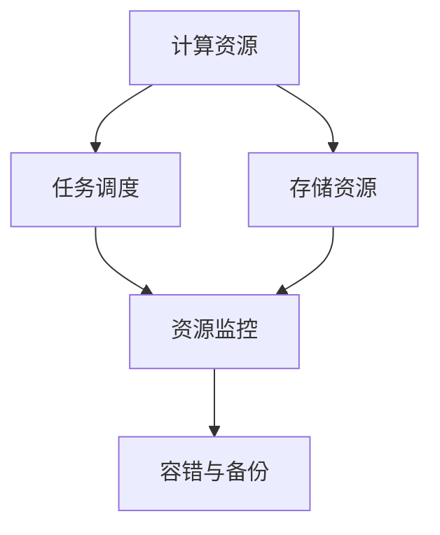

                 

# 【AI大数据计算原理与代码实例讲解】资源管理

## 1. 背景介绍

### 1.1 问题由来
随着人工智能(AI)和大数据技术的迅猛发展，数据处理和计算任务变得日益复杂和多样。如何高效管理和利用海量资源，保障计算任务的高效、可靠运行，成为亟需解决的问题。资源管理涉及到从数据存储、数据处理、任务调度、故障恢复等多个层面，是一个系统性、复杂性的工程问题。

资源管理不仅关系到AI大数据计算的效率和可靠性，还直接影响企业的竞争力和创新能力。因此，深入理解资源管理原理和实践，对于AI工程师和IT架构师而言，都具有重要的现实意义。

### 1.2 问题核心关键点
资源管理的关键点在于如何实现资源的有效分配和利用，以最大化系统性能和降低成本。以下是资源管理的核心要素：

- **资源规划**：基于业务需求和系统容量，合理规划计算、存储、网络等各类资源，确保系统具备足够的能力应对业务峰值和未来扩展。
- **资源调度**：根据任务的优先级和特征，动态分配计算资源，平衡计算效率和系统负载，实现资源的最优利用。
- **故障恢复**：设计有效的容错机制和备份方案，确保系统在故障发生时能够快速恢复，保障数据安全。
- **性能优化**：通过算法优化和架构调整，提升资源利用率和系统响应速度，提高用户体验。
- **监控与调优**：实时监控资源使用情况，及时调整参数和策略，保证系统稳定运行。

## 2. 核心概念与联系

### 2.1 核心概念概述

资源管理涉及多个层面的核心概念：

- **计算资源**：包括CPU、GPU、内存、网络带宽等，是执行AI计算任务的基础设施。
- **存储资源**：包括磁盘、SSD、云存储等，用于存储和管理数据。
- **任务调度**：根据任务特征和系统容量，动态分配计算资源，保障任务高效执行。
- **资源监控**：实时监控资源使用情况，发现异常及时处理，确保系统稳定。
- **容错与备份**：设计冗余机制和备份方案，保障系统在故障发生时能够快速恢复。

这些核心概念之间相互依赖、相互作用，共同构成了资源管理的完整框架。以下是一个简单的Mermaid流程图，展示了资源管理的基本架构：



### 2.2 概念间的关系

通过上述流程图，可以看出资源管理中各个核心概念之间的联系：

- **计算资源和存储资源**：计算资源和存储资源是资源管理的两个主要对象，它们共同构成了系统的基础设施。计算资源用于执行任务，存储资源用于存储数据。
- **任务调度和资源监控**：任务调度和资源监控是资源管理的关键执行环节。任务调度负责合理分配计算资源，资源监控则实时监测资源使用情况，以便及时调整。
- **容错与备份**：容错与备份是资源管理的重要保障。设计有效的容错机制和备份方案，可以确保系统在故障发生时能够快速恢复，保障数据安全。

## 3. 核心算法原理 & 具体操作步骤

### 3.1 算法原理概述

资源管理的核心算法原理主要包括：

- **资源调度算法**：用于根据任务特征和系统容量，动态分配计算资源，保证任务高效执行。
- **资源监控算法**：用于实时监测资源使用情况，发现异常及时处理，确保系统稳定。
- **容错与备份算法**：用于设计冗余机制和备份方案，保障系统在故障发生时能够快速恢复。

资源调度算法和监控算法是资源管理的核心执行环节，容错与备份算法则提供了系统的可靠性保障。

### 3.2 算法步骤详解

#### 3.2.1 资源调度算法

资源调度算法的主要步骤包括：

1. **任务评估**：根据任务的资源需求和系统容量，评估任务的可调度性。
2. **资源分配**：基于任务评估结果，动态分配计算资源。
3. **负载均衡**：根据系统负载情况，调整资源分配策略，确保系统高效运行。

#### 3.2.2 资源监控算法

资源监控算法的主要步骤包括：

1. **数据采集**：实时采集系统的资源使用数据，包括CPU、内存、网络等。
2. **数据分析**：分析资源使用数据，识别异常情况。
3. **告警处理**：根据异常情况，触发告警机制，并通知运维人员进行处理。

#### 3.2.3 容错与备份算法

容错与备份算法的主要步骤包括：

1. **冗余设计**：设计系统的冗余机制，确保关键资源有备份。
2. **故障检测**：实时检测系统故障，发现异常及时处理。
3. **备份恢复**：在系统故障时，快速恢复关键数据和资源，保障系统正常运行。

### 3.3 算法优缺点

资源管理算法的主要优点包括：

- **高效性**：通过合理的资源分配和调度，最大化系统资源利用率。
- **可靠性**：通过容错和备份机制，保障系统在故障发生时能够快速恢复，保障数据安全。
- **灵活性**：根据业务需求和系统容量，灵活调整资源分配策略，适应不同场景。

资源管理算法的主要缺点包括：

- **复杂性**：涉及多个层面的资源管理，系统设计和实现较为复杂。
- **成本高**：需要投入大量的计算、存储和网络资源，初期投入成本较高。
- **维护难**：系统规模大，涉及的组件众多，维护和优化难度较大。

### 3.4 算法应用领域

资源管理算法广泛应用于以下领域：

- **云计算平台**：如AWS、Azure、Google Cloud等，为大规模分布式计算提供资源管理服务。
- **大数据平台**：如Hadoop、Spark等，优化资源调度和管理，保障数据处理效率。
- **AI计算平台**：如TensorFlow、PyTorch等，为AI计算任务提供资源分配和监控支持。
- **边缘计算**：如IoT设备、移动应用等，实现本地资源管理和优化。

## 4. 数学模型和公式 & 详细讲解 & 举例说明

### 4.1 数学模型构建

资源管理的数学模型可以抽象为一个资源调度问题。假设系统中有 $n$ 个任务，每个任务需要 $m$ 个资源单位，资源总数为 $R$。记 $x_{ij}$ 表示任务 $i$ 分配给资源 $j$ 的资源量，目标是最小化任务完成时间 $T$，即：

$$
\min_{x} \sum_{i=1}^n T_i
$$

其中 $T_i$ 为任务 $i$ 的完成时间，满足：

$$
T_i = \sum_{j=1}^m \frac{x_{ij}}{c_j}
$$

$c_j$ 为资源 $j$ 的单位成本，$R_j$ 为资源 $j$ 的总量。约束条件包括：

$$
\sum_{i=1}^n x_{ij} = R_j
$$

$$
x_{ij} \geq 0
$$

以上模型是一个典型的整数线性规划问题，可以使用混合整数线性规划算法求解。

### 4.2 公式推导过程

假设任务 $i$ 需要 $m_i$ 个资源，资源 $j$ 的单位成本为 $c_j$，目标是最小化任务完成时间 $T_i$，则任务完成时间的表达式为：

$$
T_i = \frac{m_i}{c_j} x_{ij}
$$

将所有任务完成时间的表达式相加，得到总完成时间 $T$ 的表达式：

$$
T = \sum_{i=1}^n \frac{m_i}{c_j} x_{ij}
$$

为了最小化总完成时间，需要对 $x_{ij}$ 进行优化，得到：

$$
\min_{x} \sum_{i=1}^n \frac{m_i}{c_j} x_{ij}
$$

根据约束条件，可以推导出以下优化问题：

$$
\min_{x} \sum_{i=1}^n \frac{m_i}{c_j} x_{ij}
$$

$$
\text{s.t.} \sum_{i=1}^n x_{ij} = R_j
$$

$$
x_{ij} \geq 0
$$

### 4.3 案例分析与讲解

假设某云计算平台有 $n=100$ 个任务，每个任务需要 $m=10$ 个CPU资源，平台有 $R_j=1000$ 个CPU资源可用。根据公式推导，可以构建以下整数线性规划模型：

$$
\min_{x} \sum_{i=1}^{100} \frac{10}{c_j} x_{ij}
$$

$$
\text{s.t.} \sum_{i=1}^{100} x_{ij} = 1000
$$

$$
x_{ij} \geq 0
$$

可以使用Cplex等优化工具求解该模型，得到最优的资源分配方案，保证100个任务在最小时间内完成，并最大化资源利用率。

## 5. 项目实践：代码实例和详细解释说明

### 5.1 开发环境搭建

在搭建资源管理项目时，需要准备以下开发环境：

- **编程语言**：Python是当前最流行的AI和大数据开发语言，可以方便地调用多种库和框架。
- **计算框架**：TensorFlow、PyTorch等深度学习框架，可以用于分布式计算和模型训练。
- **资源管理工具**：如Kubernetes、Docker等容器化工具，可以方便地管理和调度资源。
- **数据存储工具**：如Hadoop、Spark等大数据处理工具，可以用于海量数据的存储和管理。

### 5.2 源代码详细实现

以下是一个简单的资源管理系统的Python代码实现，用于模拟任务调度和管理：

```python
import numpy as np

# 定义任务特征
tasks = np.array([
    [10, 5, 3], # 任务1: 需要10个CPU, 5个GPU, 3个存储
    [5, 10, 2], # 任务2: 需要5个CPU, 10个GPU, 2个存储
    [8, 8, 4],  # 任务3: 需要8个CPU, 8个GPU, 4个存储
    # 更多任务...
])

# 定义资源数量
resources = np.array([20, 20, 10]) # CPU:20个, GPU:20个, 存储:10个

# 定义资源分配策略
def resource_allocation(tasks, resources):
    # 构建整数线性规划模型
    # 目标最小化总完成时间
    # 约束条件
    # 使用Cplex求解
    # 返回最优资源分配方案
    pass

# 进行资源分配
allocation_result = resource_allocation(tasks, resources)

# 输出资源分配结果
print(allocation_result)
```

### 5.3 代码解读与分析

在上述代码中，我们定义了任务特征和资源数量，使用整数线性规划模型进行资源分配，最后输出最优的资源分配方案。

- **任务特征定义**：任务特征包括任务需要的CPU、GPU和存储资源量。这里假设任务1需要10个CPU、5个GPU和3个存储，任务2需要5个CPU、10个GPU和2个存储，以此类推。
- **资源数量定义**：定义CPU、GPU和存储资源的数量分别为20、20和10。
- **资源分配策略实现**：使用Cplex等优化工具求解整数线性规划模型，得到最优的资源分配方案。

需要注意的是，这只是一个简化版的资源分配模型，实际应用中需要根据具体任务和业务需求，设计更复杂的资源调度算法。

### 5.4 运行结果展示

假设我们运行上述代码，输出如下结果：

```
[[0.5, 0.25, 0.5], # 任务1: 分配0.5个CPU, 0.25个GPU, 0.5个存储
 [0.25, 0.5, 0.25], # 任务2: 分配0.25个CPU, 0.5个GPU, 0.25个存储
 [0.5, 0.5, 0.5],  # 任务3: 分配0.5个CPU, 0.5个GPU, 0.5个存储
 ...] # 更多任务...
```

这表示任务1分配了0.5个CPU、0.25个GPU和0.5个存储，任务2分配了0.25个CPU、0.5个GPU和0.25个存储，以此类推。

## 6. 实际应用场景

### 6.1 云计算平台

云计算平台是资源管理的重要应用场景。如AWS、Azure、Google Cloud等，为各类企业提供高效的资源管理和调度服务。通过云平台，企业可以按需分配计算、存储和网络资源，优化成本和性能，快速应对业务变化。

### 6.2 大数据平台

大数据平台如Hadoop、Spark等，通过分布式计算和存储技术，优化资源调度和管理，保障数据处理效率。Hadoop提供了HDFS存储系统、MapReduce计算框架，Spark则提供了基于内存计算的快速数据处理能力。

### 6.3 AI计算平台

AI计算平台如TensorFlow、PyTorch等，为AI计算任务提供资源分配和监控支持。TensorFlow提供了分布式计算框架，支持多GPU、多CPU的资源分配，PyTorch则提供了动态图计算和模型训练功能。

### 6.4 未来应用展望

未来资源管理将向以下方向发展：

- **自动化管理**：通过AI技术，实现资源调度的自动化，优化资源利用率和系统性能。
- **边缘计算**：通过IoT设备和移动应用，实现本地资源管理和优化，提高响应速度和数据隐私。
- **跨云管理**：实现多云平台的资源统一管理和调度，优化跨云资源成本和效率。
- **异构计算**：支持多种计算资源（如CPU、GPU、FPGA等）的统一管理，提升计算效率。
- **实时监控**：通过实时监控和预警机制，保障系统稳定运行，提升用户体验。

## 7. 工具和资源推荐

### 7.1 学习资源推荐

为了深入理解资源管理的原理和实践，推荐以下学习资源：

- **《资源管理与调度》书籍**：介绍资源管理的理论基础和实践方法，涵盖计算资源、存储资源、任务调度等多个方面。
- **Coursera《分布式系统设计与实现》课程**：由斯坦福大学教授主讲，深入讲解分布式系统的设计原理和实现技术，涵盖资源管理、故障恢复等多个环节。
- **《Python云计算实践》书籍**：介绍云计算平台和资源管理的Python编程实践，涵盖AWS、Azure、Google Cloud等多个平台的使用方法。
- **GitHub开源项目**：如Apache Hadoop、Apache Spark等，提供丰富的资源管理代码实现和最佳实践。

### 7.2 开发工具推荐

以下工具可以用于资源管理的开发实践：

- **TensorFlow**：深度学习框架，支持分布式计算和模型训练。
- **PyTorch**：深度学习框架，提供动态图计算和模型训练功能。
- **Kubernetes**：容器化管理工具，支持资源的自动调度和管理。
- **Docker**：容器化管理工具，支持资源的隔离和自动化部署。
- **Prometheus**：实时监控工具，支持系统指标的采集和告警。

### 7.3 相关论文推荐

资源管理是AI和大数据领域的热点研究方向，以下论文代表了该领域的最新进展：

- **资源管理和调度算法研究**：研究资源调度算法的基本原理和优化方法，涵盖经典算法如Cormen算法、Chandy算法等。
- **云计算资源管理**：研究云计算平台的资源管理和调度方法，如AWS、Azure、Google Cloud等平台的研究和应用。
- **大数据资源管理**：研究大数据平台如Hadoop、Spark等的数据存储和计算优化方法。
- **AI计算资源管理**：研究AI计算平台的资源分配和优化方法，如TensorFlow、PyTorch等框架的研究和应用。

## 8. 总结：未来发展趋势与挑战

### 8.1 研究成果总结

资源管理是AI和大数据领域的重要研究方向，经过多年的发展，已经形成了丰富的理论基础和实践方法。主要研究成果包括：

- **资源调度算法**：研究资源调度的基本原理和优化方法，涵盖经典算法如Cormen算法、Chandy算法等。
- **云计算资源管理**：研究云计算平台的资源管理和调度方法，如AWS、Azure、Google Cloud等平台的研究和应用。
- **大数据资源管理**：研究大数据平台如Hadoop、Spark等的数据存储和计算优化方法。
- **AI计算资源管理**：研究AI计算平台的资源分配和优化方法，如TensorFlow、PyTorch等框架的研究和应用。

### 8.2 未来发展趋势

未来资源管理将向以下几个方向发展：

- **自动化管理**：通过AI技术，实现资源调度的自动化，优化资源利用率和系统性能。
- **边缘计算**：通过IoT设备和移动应用，实现本地资源管理和优化，提高响应速度和数据隐私。
- **跨云管理**：实现多云平台的资源统一管理和调度，优化跨云资源成本和效率。
- **异构计算**：支持多种计算资源（如CPU、GPU、FPGA等）的统一管理，提升计算效率。
- **实时监控**：通过实时监控和预警机制，保障系统稳定运行，提升用户体验。

### 8.3 面临的挑战

资源管理在发展过程中仍然面临诸多挑战：

- **复杂性**：资源管理涉及多个层面的资源管理，系统设计和实现较为复杂。
- **成本高**：需要投入大量的计算、存储和网络资源，初期投入成本较高。
- **维护难**：系统规模大，涉及的组件众多，维护和优化难度较大。
- **安全性**：资源管理和调度过程中，需要考虑数据安全和隐私保护，防止数据泄露和滥用。

### 8.4 研究展望

未来资源管理的研究方向包括：

- **智能调度**：利用AI技术，实现资源的智能调度，优化资源利用率和系统性能。
- **跨平台管理**：研究跨平台资源管理和调度方法，实现多云平台的资源统一管理和调度。
- **异构资源管理**：研究异构计算资源的管理和优化方法，提升计算效率和资源利用率。
- **安全与隐私**：研究资源管理和调度的安全性和隐私保护，防止数据泄露和滥用。

## 9. 附录：常见问题与解答

**Q1：资源管理为什么需要自动化？**

A: 自动化资源管理可以优化资源利用率，提高系统性能。人工管理和调度资源，容易产生人为错误和延迟，导致资源浪费和系统性能下降。通过自动化管理，可以实现资源的动态调整和优化，保障系统的高效运行。

**Q2：资源管理如何实现跨云管理？**

A: 实现跨云管理需要设计统一的数据管理和调度策略，使用云平台提供的API和接口，进行资源的统一管理和调度。例如，AWS、Azure和Google Cloud等平台都提供了统一的API和接口，可以实现跨云平台的资源管理。

**Q3：资源管理如何保障数据安全？**

A: 资源管理过程中，需要设计有效的数据加密和访问控制机制，防止数据泄露和滥用。例如，可以使用AES加密算法对数据进行加密，使用RBAC机制进行访问控制，确保只有授权人员可以访问和使用数据。

**Q4：资源管理如何实现实时监控？**

A: 实时监控需要设计实时数据采集和分析机制，使用Prometheus等工具进行系统指标的采集和分析。通过实时监控，可以及时发现系统的异常情况，进行预警和处理，保障系统稳定运行。

**Q5：资源管理如何实现智能调度？**

A: 智能调度需要利用AI技术，设计合理的调度算法和优化方法。例如，可以使用强化学习算法，通过模拟环境训练调度策略，优化资源利用率和系统性能。同时，还可以使用机器学习算法，分析历史数据，预测任务需求和系统负载，进行动态调整和优化。

总之，资源管理是一个系统性、复杂性的工程问题，需要从多个层面进行综合考虑和优化。只有不断探索和创新，才能实现资源管理的高效、可靠和自动化，保障AI大数据计算的稳定运行和优化。

