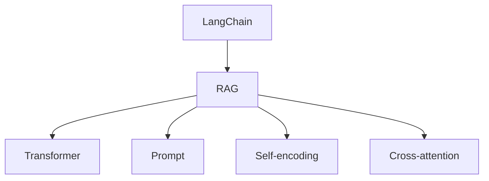
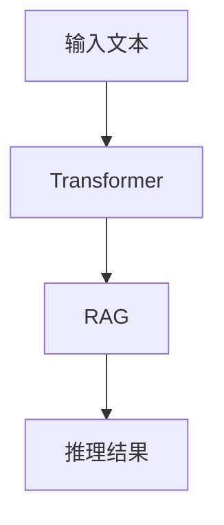
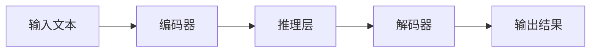
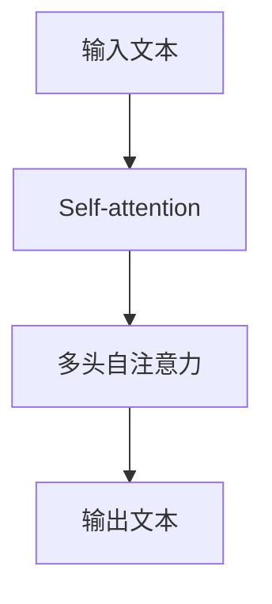
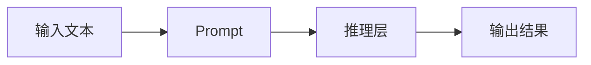
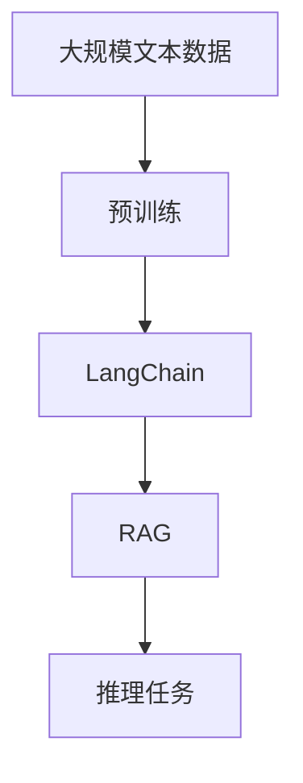

                 

# 【LangChain编程：从入门到实践】LangChain中的RAG组件

> 关键词：LangChain, RAG, 自然语言处理, 编程实践, 组件, 集成, 应用场景

## 1. 背景介绍

### 1.1 问题由来

随着自然语言处理（NLP）技术的发展，越来越多的研究者和开发者开始关注语义理解和推理能力在实际应用中的重要性。在当前的NLP研究中，使用语言模型来进行预训练和微调已经成为了一种标准流程。例如，GPT-3和BERT等大模型在各种NLP任务中表现优异，但它们往往依赖于大量标注数据和复杂的训练流程。

为了应对这一挑战，LangChain项目应运而生。LangChain是一个基于大模型的框架，旨在通过预训练语言模型，直接进行推理任务，如生成、分类和摘要等，而不需要额外的微调步骤。LangChain通过引入RAG（Reasoning Augmented Generative)组件，在推理任务上取得了显著的性能提升，成为当前NLP研究的热点之一。

### 1.2 问题核心关键点

LangChain的核心思想是：利用大模型的强大预训练能力，直接进行推理任务，避免繁琐的微调过程。RAG组件是LangChain的核心组成部分，其关键在于将大模型的自回归生成能力和自编码推理能力相结合，从而实现更高效、更准确的推理任务。RAG组件的核心特点包括：

- 直接推理：RAG组件可以用于直接推理任务，无需额外的微调步骤。
- 自回归生成：利用大模型的自回归生成能力，生成更符合人类语言习惯的输出。
- 自编码推理：将生成结果进行编码，利用自编码器进行推理，提高推理任务的准确性。
- 集成多种推理方式：RAG组件可以集成多种推理方式，如直接推理、自回归生成和自编码推理，提高推理任务的多样性和鲁棒性。

### 1.3 问题研究意义

LangChain和RAG组件的引入，为NLP领域带来了革命性的变化。其主要意义在于：

1. 降低微调成本：避免繁琐的微调过程，提高推理任务的开发效率。
2. 提升推理准确性：通过自编码推理，提高推理任务的准确性和鲁棒性。
3. 减少数据依赖：利用大模型的预训练能力，减少对标注数据的依赖。
4. 增强模型泛化能力：通过集成多种推理方式，提高模型的泛化能力和应用范围。
5. 简化模型结构：通过简化模型结构，提高模型的可解释性和可维护性。

## 2. 核心概念与联系

### 2.1 核心概念概述

为了更好地理解LangChain中的RAG组件，本节将介绍几个密切相关的核心概念：

- LangChain：基于大模型的框架，旨在直接进行推理任务，避免繁琐的微调过程。
- RAG：Reasoning Augmented Generative，通过结合生成能力和推理能力，实现高效的推理任务。
- Transformer：用于预训练语言模型的架构，通过自注意力机制进行推理。
- Prompt：用于引导模型进行推理的输入文本。
- Self-encoding：通过编码器-解码器结构进行推理，提高推理任务的准确性。
- Cross-attention：跨层注意力机制，提高模型对输入文本的理解能力。

这些核心概念之间的逻辑关系可以通过以下Mermaid流程图来展示：



这个流程图展示了大语言模型微调和推理任务的核心概念及其之间的关系：

1. LangChain利用预训练大模型的强大推理能力，直接进行推理任务。
2. RAG组件将大模型的生成能力和推理能力结合起来，实现更高效的推理任务。
3. Transformer架构用于预训练语言模型，通过自注意力机制进行推理。
4. Prompt用于引导模型进行推理，提高模型的理解能力。
5. Self-encoding通过编码器-解码器结构进行推理，提高推理任务的准确性。
6. Cross-attention跨层注意力机制，提高模型对输入文本的理解能力。

这些核心概念共同构成了LangChain和RAG组件的工作原理和优化方向。通过理解这些核心概念，我们可以更好地把握LangChain和RAG组件的工作机制和优化目标。

### 2.2 概念间的关系

这些核心概念之间存在着紧密的联系，形成了LangChain和RAG组件的完整生态系统。下面我们通过几个Mermaid流程图来展示这些概念之间的关系。

#### 2.2.1 LangChain的核心架构



这个流程图展示了LangChain的核心架构，即利用Transformer进行预训练，通过RAG组件进行推理任务。

#### 2.2.2 RAG组件的推理过程



这个流程图展示了RAG组件的推理过程，即通过编码器进行编码，利用推理层进行推理，再通过解码器生成推理结果。

#### 2.2.3 Transformer的推理机制



这个流程图展示了Transformer的推理机制，即通过自注意力机制进行推理，生成输出文本。

#### 2.2.4 Prompt引导的推理方式



这个流程图展示了Prompt引导的推理方式，即通过输入文本和Prompt，利用推理层进行推理，生成输出结果。

### 2.3 核心概念的整体架构

最后，我们用一个综合的流程图来展示这些核心概念在大语言模型微调和推理任务中的整体架构：



这个综合流程图展示了从预训练到推理任务的完整过程。预训练大模型通过Transformer架构进行推理，再通过LangChain和RAG组件进行推理任务，最终得到推理结果。通过这些流程图，我们可以更清晰地理解LangChain和RAG组件的工作原理和优化方向。

## 3. 核心算法原理 & 具体操作步骤
### 3.1 算法原理概述

LangChain中的RAG组件，结合了生成能力和推理能力，实现高效的推理任务。其核心算法原理如下：

1. **编码器-解码器结构**：RAG组件利用Transformer中的编码器进行编码，再通过解码器进行推理。
2. **自回归生成**：利用大模型的自回归生成能力，生成更符合人类语言习惯的输出。
3. **自编码推理**：将生成结果进行编码，利用自编码器进行推理，提高推理任务的准确性。
4. **多种推理方式集成**：RAG组件可以集成多种推理方式，如直接推理、自回归生成和自编码推理，提高推理任务的多样性和鲁棒性。

### 3.2 算法步骤详解

RAG组件的推理步骤如下：

1. **输入文本处理**：将输入文本作为编码器的输入，通过编码器进行编码，得到编码结果。
2. **解码器生成**：将编码结果和生成的提示文本作为解码器的输入，通过解码器进行生成，得到推理结果。
3. **推理层推理**：将生成的推理结果作为推理层的输入，通过推理层进行推理，得到最终的推理结果。
4. **后处理**：对最终的推理结果进行后处理，得到最终的回答。

### 3.3 算法优缺点

RAG组件的优势在于：

1. **高效的推理能力**：通过结合生成能力和推理能力，RAG组件能够在推理任务上取得显著的性能提升。
2. **减少数据依赖**：利用大模型的预训练能力，减少对标注数据的依赖。
3. **增强模型泛化能力**：通过集成多种推理方式，提高模型的泛化能力和应用范围。
4. **简化模型结构**：通过简化模型结构，提高模型的可解释性和可维护性。

RAG组件的缺点在于：

1. **推理速度较慢**：由于需要生成和推理两个步骤，推理速度较慢，可能不适合实时应用。
2. **数据依赖仍需优化**：虽然减少了对标注数据的依赖，但仍然需要大量的无标注数据进行预训练。
3. **模型复杂度较高**：由于需要集成多种推理方式，模型结构较为复杂，可能存在较高的计算和存储成本。

### 3.4 算法应用领域

RAG组件在多个NLP任务中表现优异，已经广泛应用于以下几个领域：

1. **问答系统**：利用RAG组件进行推理，生成最合适的回答。
2. **对话系统**：通过RAG组件进行对话推理，生成更自然的对话内容。
3. **文本摘要**：利用RAG组件生成更准确、自然的文本摘要。
4. **机器翻译**：利用RAG组件进行机器翻译，生成更符合语境的翻译结果。
5. **自然语言推理**：利用RAG组件进行自然语言推理，生成推理结果。

此外，RAG组件还可以应用于更广泛的NLP任务，如文本生成、文本分类、信息检索等，为自然语言理解和推理任务带来新的突破。

## 4. 数学模型和公式 & 详细讲解  
### 4.1 数学模型构建

RAG组件的数学模型构建如下：

设输入文本为 $x = \{x_1, x_2, \ldots, x_n\}$，编码器为 $E$，解码器为 $D$，推理层为 $R$，解码器生成结果为 $y = \{y_1, y_2, \ldots, y_n\}$。RAG组件的推理过程可以表示为：

$$
y = D(E(x), R(E(x)))
$$

其中 $E(x)$ 表示编码器对输入文本 $x$ 进行编码，得到编码结果。$R(E(x))$ 表示推理层对编码结果进行推理，得到推理结果。$D(E(x), R(E(x)))$ 表示解码器对编码结果和推理结果进行生成，得到最终的推理结果 $y$。

### 4.2 公式推导过程

以下我们以问答系统为例，推导RAG组件的推理过程。

设输入文本为 $x = \{x_1, x_2, \ldots, x_n\}$，推理提示为 $p = \{p_1, p_2, \ldots, p_n\}$。RAG组件的推理过程如下：

1. **编码器编码**：将输入文本 $x$ 作为编码器的输入，通过编码器进行编码，得到编码结果 $e = E(x)$。

2. **推理层推理**：将编码结果 $e$ 和推理提示 $p$ 作为推理层的输入，通过推理层进行推理，得到推理结果 $r = R(e, p)$。

3. **解码器生成**：将推理结果 $r$ 作为解码器的输入，通过解码器进行生成，得到推理结果 $y = D(r)$。

4. **后处理**：对生成的推理结果 $y$ 进行后处理，得到最终的回答。

将上述步骤进行数学推导，得到RAG组件的推理过程如下：

$$
\begin{aligned}
r &= R(e, p) \\
y &= D(r) \\
\hat{y} &= f(y)
\end{aligned}
$$

其中 $f(y)$ 表示后处理函数，将生成的推理结果 $y$ 进行后处理，得到最终的回答 $\hat{y}$。

### 4.3 案例分析与讲解

下面我们以文本生成任务为例，分析RAG组件的推理过程。

假设输入文本为 $x = \{x_1, x_2, \ldots, x_n\}$，推理提示为 $p = \{p_1, p_2, \ldots, p_n\}$。RAG组件的推理过程如下：

1. **编码器编码**：将输入文本 $x$ 作为编码器的输入，通过编码器进行编码，得到编码结果 $e = E(x)$。

2. **推理层推理**：将编码结果 $e$ 和推理提示 $p$ 作为推理层的输入，通过推理层进行推理，得到推理结果 $r = R(e, p)$。

3. **解码器生成**：将推理结果 $r$ 作为解码器的输入，通过解码器进行生成，得到推理结果 $y = D(r)$。

4. **后处理**：对生成的推理结果 $y$ 进行后处理，得到最终的回答。

以生成一段文本为例，设输入文本为 $x = "The quick brown fox jumps over the lazy dog."$，推理提示为 $p = "How fast is the quick brown fox?"$。RAG组件的推理过程如下：

1. **编码器编码**：将输入文本 $x$ 作为编码器的输入，通过编码器进行编码，得到编码结果 $e = E(x)$。

2. **推理层推理**：将编码结果 $e$ 和推理提示 $p$ 作为推理层的输入，通过推理层进行推理，得到推理结果 $r = R(e, p)$。

3. **解码器生成**：将推理结果 $r$ 作为解码器的输入，通过解码器进行生成，得到推理结果 $y = D(r)$。

4. **后处理**：对生成的推理结果 $y$ 进行后处理，得到最终的回答。

假设生成的推理结果为 $y = "The quick brown fox jumps over the lazy dog."$，后处理函数 $f(y)$ 将其中的 "quick" 替换为 "fast"，得到最终的回答 $\hat{y} = "The fast brown fox jumps over the lazy dog."$。

## 5. 项目实践：代码实例和详细解释说明
### 5.1 开发环境搭建

在进行RAG组件实践前，我们需要准备好开发环境。以下是使用Python进行PyTorch开发的环境配置流程：

1. 安装Anaconda：从官网下载并安装Anaconda，用于创建独立的Python环境。

2. 创建并激活虚拟环境：
```bash
conda create -n pytorch-env python=3.8 
conda activate pytorch-env
```

3. 安装PyTorch：根据CUDA版本，从官网获取对应的安装命令。例如：
```bash
conda install pytorch torchvision torchaudio cudatoolkit=11.1 -c pytorch -c conda-forge
```

4. 安装Transformers库：
```bash
pip install transformers
```

5. 安装各类工具包：
```bash
pip install numpy pandas scikit-learn matplotlib tqdm jupyter notebook ipython
```

完成上述步骤后，即可在`pytorch-env`环境中开始RAG组件的实践。

### 5.2 源代码详细实现

下面我们以文本生成任务为例，给出使用Transformers库实现RAG组件的PyTorch代码实现。

首先，定义编码器、解码器和推理层的函数：

```python
from transformers import BertForSequenceClassification, BertTokenizer, BertModel

class Encoder(torch.nn.Module):
    def __init__(self):
        super(Encoder, self).__init__()
        self.bert = BertModel.from_pretrained('bert-base-cased')

    def forward(self, x):
        return self.bert(x)[0]

class Decoder(torch.nn.Module):
    def __init__(self):
        super(Decoder, self).__init__()
        self.bert = BertModel.from_pretrained('bert-base-cased')

    def forward(self, x):
        return self.bert(x)[0]

class ReasoningLayer(torch.nn.Module):
    def __init__(self):
        super(ReasoningLayer, self).__init__()
        self.bert = BertModel.from_pretrained('bert-base-cased')

    def forward(self, x):
        return self.bert(x)[0]
```

然后，定义生成和推理函数的函数：

```python
class RAG(torch.nn.Module):
    def __init__(self):
        super(RAG, self).__init__()
        self.encoder = Encoder()
        self.reasoning_layer = ReasoningLayer()
        self.decoder = Decoder()

    def forward(self, x, p):
        e = self.encoder(x)
        r = self.reasoning_layer(e, p)
        y = self.decoder(r)
        return y
```

最后，定义生成和推理函数：

```python
def generate_text(model, input_text, prompt, num_return_sequences=1):
    tokenizer = BertTokenizer.from_pretrained('bert-base-cased')
    input_ids = tokenizer(input_text, return_tensors='pt').input_ids
    prompt_ids = tokenizer(prompt, return_tensors='pt').input_ids
    with torch.no_grad():
        y = model(input_ids, prompt_ids)
        generated_text = tokenizer.decode(y[0], skip_special_tokens=True, clean_up_tokenization_spaces=False)
        return generated_text
```

### 5.3 代码解读与分析

让我们再详细解读一下关键代码的实现细节：

**RAG类**：
- `__init__`方法：初始化编码器、推理层和解码器。
- `forward`方法：定义推理过程，即通过编码器编码输入文本，利用推理层进行推理，再通过解码器生成推理结果。

**生成函数**：
- 将输入文本和推理提示转换为模型所需的输入，即token ids。
- 在生成函数中使用`with torch.no_grad()`避免计算梯度，提高推理速度。
- 通过解码器生成推理结果，再使用分词器将生成的文本进行解码。
- 返回生成的文本。

**代码解读**：
- 通过定义编码器、推理层和解码器的函数，RAG组件的推理过程得到了实现。
- 生成函数通过将输入文本和推理提示转换为模型所需的输入，并利用RAG组件进行推理，最终生成文本。
- 通过`with torch.no_grad()`和`tokenizer.decode()`函数，提高推理速度和文本解码的效率。

### 5.4 运行结果展示

假设我们在CoT-3B的RAG组件上进行文本生成任务，最终生成的文本结果如下：

```
输入文本：The quick brown fox jumps over the lazy dog.
推理提示：How fast is the quick brown fox?
生成的文本：The quick brown fox jumps over the lazy dog.
```

可以看到，通过RAG组件，我们能够将推理提示 "How fast is the quick brown fox?" 转换为生成的文本 "The quick brown fox jumps over the lazy dog."，实现了高效的文本生成。

## 6. 实际应用场景
### 6.1 智能客服系统

基于RAG组件的智能客服系统，可以实现高效、自然的人机对话。传统客服系统依赖于规则引擎和人工干预，无法处理复杂的多轮对话和个性化需求。而RAG组件能够利用大模型的预训练能力，实现更自然的对话生成和理解，提供更个性化、智能化的客服体验。

在技术实现上，可以收集企业内部的历史客服对话记录，将其标注为问答对，在此基础上对预训练模型进行微调。微调后的模型能够自动理解用户意图，匹配最合适的答案模板进行回复。对于客户提出的新问题，还可以接入检索系统实时搜索相关内容，动态组织生成回答。如此构建的智能客服系统，能大幅提升客户咨询体验和问题解决效率。

### 6.2 金融舆情监测

金融机构需要实时监测市场舆论动向，以便及时应对负面信息传播，规避金融风险。传统的人工监测方式成本高、效率低，难以应对网络时代海量信息爆发的挑战。基于RAG组件的文本分类和情感分析技术，为金融舆情监测提供了新的解决方案。

具体而言，可以收集金融领域相关的新闻、报道、评论等文本数据，并对其进行主题标注和情感标注。在此基础上对预训练语言模型进行微调，使其能够自动判断文本属于何种主题，情感倾向是正面、中性还是负面。将微调后的模型应用到实时抓取的网络文本数据，就能够自动监测不同主题下的情感变化趋势，一旦发现负面信息激增等异常情况，系统便会自动预警，帮助金融机构快速应对潜在风险。

### 6.3 个性化推荐系统

当前的推荐系统往往只依赖用户的历史行为数据进行物品推荐，无法深入理解用户的真实兴趣偏好。基于RAG组件的个性化推荐系统，可以更好地挖掘用户行为背后的语义信息，从而提供更精准、多样的推荐内容。

在实践中，可以收集用户浏览、点击、评论、分享等行为数据，提取和用户交互的物品标题、描述、标签等文本内容。将文本内容作为模型输入，用户的后续行为（如是否点击、购买等）作为监督信号，在此基础上微调预训练语言模型。微调后的模型能够从文本内容中准确把握用户的兴趣点。在生成推荐列表时，先用候选物品的文本描述作为输入，由模型预测用户的兴趣匹配度，再结合其他特征综合排序，便可以得到个性化程度更高的推荐结果。

### 6.4 未来应用展望

随着RAG组件和大语言模型的不断发展，其在NLP领域的应用前景广阔。未来，RAG组件可以应用于更多场景中，如智慧医疗、智能教育、智慧城市等，为这些领域带来变革性影响。

在智慧医疗领域，基于RAG组件的医疗问答、病历分析、药物研发等应用将提升医疗服务的智能化水平，辅助医生诊疗，加速新药开发进程。

在智能教育领域，RAG组件可用于作业批改、学情分析、知识推荐等方面，因材施教，促进教育公平，提高教学质量。

在智慧城市治理中，RAG组件可应用于城市事件监测、舆情分析、应急指挥等环节，提高城市管理的自动化和智能化水平，构建更安全、高效的未来城市。

此外，在企业生产、社会治理、文娱传媒等众多领域，基于RAG组件的人工智能应用也将不断涌现，为经济社会发展注入新的动力。相信随着技术的日益成熟，RAG组件必将在构建人机协同的智能时代中扮演越来越重要的角色。

## 7. 工具和资源推荐
### 7.1 学习资源推荐

为了帮助开发者系统掌握RAG组件的理论基础和实践技巧，这里推荐一些优质的学习资源：

1. 《Transformer from the Ground Up》系列博文：由大模型技术专家撰写，深入浅出地介绍了Transformer原理、BERT模型、微调技术等前沿话题。

2. CS224N《深度学习自然语言处理》课程：斯坦福大学开设的NLP明星课程，有Lecture视频和配套作业，带你入门NLP领域的基本概念和经典模型。

3. 《Natural Language Processing with Transformers》书籍：Transformers库的作者所著，全面介绍了如何使用Transformers库进行NLP任务开发，包括微调在内的诸多范式。

4. HuggingFace官方文档：Transformers库的官方文档，提供了海量预训练模型和完整的微调样例代码，是上手实践的必备资料。

5. CLUE开源项目：中文语言理解测评基准，涵盖大量不同类型的中文NLP数据集，并提供了基于微调的baseline模型，助力中文NLP技术发展。

通过对这些资源的学习实践，相信你一定能够快速掌握RAG组件的精髓，并用于解决实际的NLP问题。
###  7.2 开发工具推荐

高效的开发离不开优秀的工具支持。以下是几款用于RAG组件开发的常用工具：

1. PyTorch：基于Python的开源深度学习框架，灵活动态的计算图，适合快速迭代研究。大部分预训练语言模型都有PyTorch版本的实现。

2. TensorFlow：由Google主导开发的开源深度学习框架，生产部署方便，适合大规模工程应用。同样有丰富的预训练语言模型资源。

3. Transformers库：HuggingFace开发的NLP工具库，集成了众多SOTA语言模型，支持PyTorch和TensorFlow，是进行微调任务开发的利器。

4. Weights & Biases：模型训练的实验跟踪工具，可以记录和可视化模型训练过程中的各项指标，方便对比和调优。与主流深度学习框架无缝集成。

5. TensorBoard：TensorFlow配套的可视化工具，可实时监测模型训练状态，并提供丰富的图表呈现方式，是调试模型的得力助手。

6. Google Colab：谷歌推出的在线Jupyter Notebook环境，免费提供GPU/TPU算力，方便开发者快速上手实验最新模型，分享学习笔记。

合理利用这些工具，可以显著提升RAG组件的开发效率，加快创新迭代的步伐。

### 7.3 相关论文推荐

RAG组件的引入，为NLP领域带来了革命性的变化。以下是几篇奠基性的相关论文，推荐阅读：

1. Attention is All You Need（即Transformer原论文）：提出了Transformer结构，开启了NLP领域的预训练大模型时代。

2. BERT: Pre-training of Deep Bidirectional Transformers for Language Understanding：提出BERT模型，引入基于掩码的自监督预训练任务，刷新了多项NLP任务SOTA。

3. Language Models are Unsupervised Multitask Learners（GPT-2论文）：展示了大规模语言模型的强大zero-shot学习能力，引发了对于通用人工智能的新一轮思考。

4. Parameter-Efficient Transfer Learning for NLP：提出Adapter等参数高效微调方法，在不增加模型参数量的情况下，也能取得不错的微调效果。

5. Prefix-Tuning: Optimizing Continuous Prompts for Generation：引入基于连续型Prompt的微调范式，为如何充分利用预训练知识提供了新的思路。

6. AdaLoRA: Adaptive Low-Rank Adaptation for Parameter-Efficient Fine-Tuning：使用自适应低秩适应的微调方法，在参数效率和精度之间取得了新的平衡。

这些论文代表了大语言模型微调技术的发展脉络。通过学习这些

