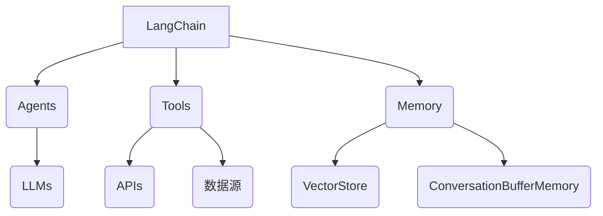
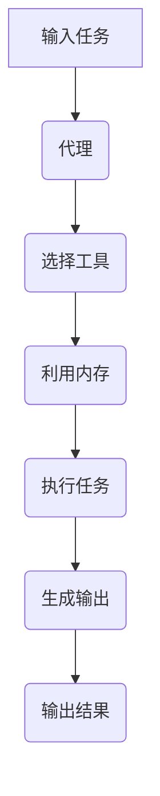

# 【LangChain编程：从入门到实践】应用部署

## 1. 背景介绍

### 1.1 问题的由来

在当今数据驱动的世界中，机器学习和人工智能的应用越来越广泛。然而，将这些复杂的技术应用于实际场景并非易事。开发人员需要处理大量的数据预处理、模型训练、部署和维护等繁琐工作。这就催生了一种新的编程范式 —— LangChain。

LangChain是一个用于构建应用程序的框架和库,旨在简化与语言模型(LLM)的交互。它提供了一种声明式的方法来组合LLM、数据源和其他组件,从而构建可扩展的应用程序。无论是问答系统、智能助手还是自动化任务,LangChain都为开发人员提供了强大的工具箱。

### 1.2 研究现状

虽然LangChain仍处于相对初级阶段,但它已经在多个领域得到了广泛应用。一些知名公司如微软、亚马逊和谷歌都在积极探索LangChain的潜力。同时,开源社区也在不断贡献新的代理、工具和集成。

然而,LangChain的发展也面临着一些挑战。例如,如何确保生成的输出的质量和一致性?如何处理大规模数据?如何与传统系统集成?这些问题都需要进一步的研究和探索。

### 1.3 研究意义

LangChain的出现为构建人工智能应用程序提供了一种全新的范式。它有望极大地提高开发效率,降低进入门槛,从而推动人工智能技术在更多领域的应用。同时,LangChain也为人工智能的可解释性、可控性和安全性等方面提供了新的思路。

通过深入研究LangChain的原理、架构和最佳实践,我们可以更好地利用这一强大的工具,推动人工智能技术的发展和应用。

### 1.4 本文结构

本文将全面介绍LangChain的核心概念、算法原理、数学模型、实际应用以及未来发展趋势。文章包含以下几个主要部分:

1. 核心概念与联系
2. 核心算法原理与具体操作步骤
3. 数学模型和公式详细讲解与案例分析
4. 项目实践:代码实例和详细解释
5. 实际应用场景
6. 工具和资源推荐
7. 总结:未来发展趋势与挑战
8. 附录:常见问题与解答

## 2. 核心概念与联系

LangChain的核心概念包括代理(Agents)、工具(Tools)、内存(Memory)和LangChain等。下面我们将逐一介绍这些概念及其相互关系。

### 2.1 代理(Agents)

代理是LangChain中的核心组件,它负责协调和管理各种资源(如LLM、工具和内存)来完成特定任务。代理可以是基于规则的、基于计划的或基于学习的。

代理与LLM(语言模型)紧密合作,利用LLM的自然语言理解和生成能力来分析输入、制定计划并生成输出。同时,代理也可以利用各种工具和内存来增强其功能。

### 2.2 工具(Tools)

工具是LangChain中的另一个重要组件,它们提供了各种功能,如访问API、查询数据库、调用Python函数等。代理可以根据需要调用不同的工具来完成特定任务。

工具可以是现成的(如Wikipedia API),也可以是自定义的。LangChain提供了一种简单的方式来封装和集成各种工具。

### 2.3 内存(Memory)

内存用于存储代理在执行过程中的中间状态和上下文信息。这些信息可以被代理用于推理和决策。

LangChain支持多种内存实现,如基于向量的存储(VectorStore)和对话缓冲区内存(ConversationBufferMemory)等。开发人员可以根据需求选择合适的内存类型。

### 2.4 LangChain

LangChain是一个用于构建应用程序的框架和库,它将上述概念(代理、工具和内存)统一在一个声明式的接口中。开发人员可以使用LangChain快速构建和部署各种应用程序,而无需过多关注底层细节。

LangChain还提供了许多预构建的组件和模板,使开发过程变得更加高效。同时,它也支持自定义扩展,以满足特定需求。

## 3. 核心算法原理与具体操作步骤

### 3.1 算法原理概述

LangChain的核心算法原理是基于代理-工具-内存的交互模式。代理根据输入任务,选择合适的工具并利用内存中的上下文信息来执行任务并生成输出。这个过程可以是单步的,也可以是多步的,直到任务完成。

不同类型的代理采用不同的算法来选择工具和利用内存。例如,基于规则的代理使用预定义的规则,而基于计划的代理则采用搜索和规划算法。

### 3.2 算法步骤详解

以基于计划的代理为例,其算法步骤如下:

1. **任务分析**: 代理使用LLM分析输入任务,识别任务类型和所需的子任务。
2. **工具选择**: 代理根据子任务的需求,从可用工具集合中选择合适的工具。
3. **计划生成**: 代理使用搜索算法(如A*算法)生成一个执行计划,即一系列有序的工具调用。
4. **计划执行**: 代理按照生成的计划依次调用工具,并利用内存存储中间结果。
5. **输出生成**: 代理使用LLM根据执行结果生成最终输出。
6. **反馈学习**: 代理可以基于输出的质量和人类反馈,调整其决策策略。

在整个过程中,代理会不断地与LLM、工具和内存交互,以完成复杂的任务。

### 3.3 算法优缺点

LangChain算法的主要优点包括:

- **模块化和可扩展性**: 代理、工具和内存都是可插拔的,可以根据需求进行组合和扩展。
- **声明式编程**: 开发人员只需声明任务目标,而无需关注底层实现细节。
- **利用LLM的能力**: 算法充分利用了LLM在自然语言理解和生成方面的强大能力。
- **增强的可解释性**: 代理的决策过程和中间状态都可以被记录和分析,提高了系统的可解释性。

但同时,LangChain算法也存在一些缺点和挑战:

- **质量和一致性**: 生成的输出质量和一致性仍然难以保证,需要进一步的优化和控制。
- **计算开销**: 对于复杂任务,搜索和规划过程可能会导致较大的计算开销。
- **数据隐私和安全**: 如何确保敏感数据的隐私和安全是一个需要解决的问题。
- **人机协作**: 如何更好地融合人工智能和人类专家的能力,实现有效的人机协作,仍有待探索。

### 3.4 算法应用领域

LangChain算法可以应用于多个领域,包括但不限于:

- **问答系统**: 利用LLM和知识库构建智能问答系统。
- **任务自动化**: 将复杂任务分解为多个子任务,并自动执行。
- **决策支持系统**: 根据多种数据源和规则,为决策过程提供支持。
- **数据分析和可视化**: 结合LLM和数据处理工具,实现自动化数据分析和可视化。
- **创意辅助**: 利用LLM的创造力,为创意工作提供辅助和灵感。

无论是在企业内部还是面向最终用户,LangChain都为构建智能应用程序提供了强大的工具。

## 4. 数学模型和公式详细讲解与举例说明

### 4.1 数学模型构建

在LangChain中,数学模型主要用于表示代理的决策过程和工具的执行逻辑。下面我们将介绍一种基于马尔可夫决策过程(MDP)的数学模型。

一个MDP可以用一个元组 $(S, A, P, R, \gamma)$ 来表示,其中:

- $S$ 是状态集合
- $A$ 是动作集合
- $P(s'|s,a)$ 是状态转移概率,表示在状态 $s$ 下执行动作 $a$ 后转移到状态 $s'$ 的概率
- $R(s,a)$ 是回报函数,表示在状态 $s$ 下执行动作 $a$ 获得的即时回报
- $\gamma \in [0,1)$ 是折现因子,用于权衡即时回报和长期回报

代理的目标是找到一个策略 $\pi: S \rightarrow A$,使得期望的累积折现回报最大化:

$$
\max_\pi \mathbb{E}\left[\sum_{t=0}^\infty \gamma^t R(s_t, \pi(s_t))\right]
$$

其中 $s_t$ 是第 $t$ 个时间步的状态。

### 4.2 公式推导过程

为了求解最优策略,我们可以使用动态规划算法,如值迭代(Value Iteration)或策略迭代(Policy Iteration)。这些算法基于贝尔曼方程(Bellman Equations)进行迭代更新,直到收敛到最优值函数或最优策略。

贝尔曼方程包括两个部分:

1. **贝尔曼期望方程**:

$$
V^*(s) = \max_a \mathbb{E}_{s' \sim P(\cdot|s,a)}\left[R(s,a) + \gamma V^*(s')\right]
$$

2. **贝尔曼最优方程**:

$$
Q^*(s,a) = \mathbb{E}_{s' \sim P(\cdot|s,a)}\left[R(s,a) + \gamma \max_{a'} Q^*(s',a')\right]
$$

其中 $V^*(s)$ 是最优状态值函数,表示在状态 $s$ 下遵循最优策略可获得的期望累积回报。$Q^*(s,a)$ 是最优动作值函数,表示在状态 $s$ 下执行动作 $a$,然后遵循最优策略可获得的期望累积回报。

通过迭代更新这些方程,我们可以逐步逼近最优值函数和最优策略。

### 4.3 案例分析与讲解

为了更好地理解上述数学模型,我们将通过一个简单的案例进行分析和讲解。

假设我们有一个智能助手代理,其任务是根据用户的查询从不同的数据源(如Wikipedia、新闻网站等)检索相关信息并生成回答。代理可以执行以下动作:

- 查询Wikipedia
- 查询新闻网站
- 合并结果并生成回答

我们将这个问题建模为一个MDP:

- 状态 $S$ 包括用户查询和代理已获取的部分信息
- 动作 $A$ 包括上述三种动作
- 状态转移概率 $P(s'|s,a)$ 取决于执行动作 $a$ 后获取的新信息
- 回报函数 $R(s,a)$ 可以基于回答的质量和完整性来定义

代理的目标是找到一个策略 $\pi$,使得期望的累积回报最大化,即生成高质量的回答。

在这个案例中,代理需要权衡不同动作的成本和收益。例如,查询Wikipedia的成本较低但信息可能不完整,而查询多个新闻网站的成本较高但信息更全面。代理需要根据当前状态和已获取的信息,选择合适的动作序列来优化长期回报。

通过构建这种数学模型,我们可以更好地理解和分析代理的决策过程,并探索优化算法来提高其性能。

### 4.4 常见问题解答

1. **如何确定合适的状态和动作表示?**

状态和动作的表示对于