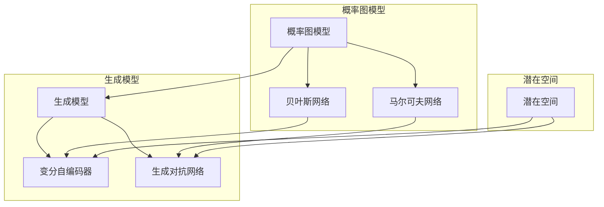

# 变分自编码器与生成模型原理与代码实战案例讲解

作者：禅与计算机程序设计艺术 / Zen and the Art of Computer Programming

## 1. 背景介绍

### 1.1 问题的由来

随着深度学习技术的发展，生成模型在图像生成、自然语言处理、语音合成等领域取得了显著的成果。传统的生成模型大多基于概率图模型，如隐马尔可夫模型（HMM）、变分贝叶斯推断和深度信念网络等。然而，这些模型在建模复杂概率分布时存在一些局限性，例如参数估计困难、生成样本多样性差等问题。

近年来，变分自编码器（VAE）和生成对抗网络（GAN）等新型生成模型的出现，为解决传统生成模型的局限性提供了新的思路。VAE通过编码器和解码器学习数据分布的潜在空间表示，从而生成与真实数据分布相似的样本。GAN则通过生成器与判别器之间的对抗训练，学习数据分布的边界，生成具有高质量、多样性的样本。

### 1.2 研究现状

VAE和GAN等生成模型在图像生成、文本生成、语音合成等领域取得了显著的成果。以下是一些代表性研究：

1. **图像生成**：生成对抗网络（GAN）在图像生成领域取得了突破性进展，如CycleGAN、StyleGAN、StyleGAN2等模型。

2. **文本生成**：VAE、 seqGAN、 Conditional GAN等模型在文本生成领域取得了不错的效果，如机器翻译、文本摘要、对话系统等。

3. **语音合成**：基于声学模型和文本生成模型的结合，如Tacotron2、WaveNet等，实现了高质量的语音合成。

### 1.3 研究意义

VAE和GAN等生成模型在以下方面具有重要意义：

1. **丰富样本生成**：生成模型可以生成与真实数据分布相似的样本，为数据增强、模型评估等应用提供丰富的数据资源。

2. **探索数据分布**：生成模型可以揭示数据分布的特征，有助于理解数据内在结构和潜在关系。

3. **辅助研究**：生成模型可以辅助其他深度学习任务，如图像分类、目标检测等。

### 1.4 本文结构

本文将详细介绍VAE和GAN等生成模型的原理、实现和实战案例。具体结构如下：

- 第2部分，介绍核心概念和联系。
- 第3部分，详细讲解VAE和GAN的算法原理和具体操作步骤。
- 第4部分，介绍数学模型和公式，并举例说明。
- 第5部分，给出代码实例，并进行详细解释说明。
- 第6部分，探讨生成模型在实际应用场景中的应用。
- 第7部分，推荐学习资源、开发工具和参考文献。
- 第8部分，总结全文，展望未来发展趋势与挑战。

## 2. 核心概念与联系

为了更好地理解VAE和GAN等生成模型，本节将介绍几个核心概念及其联系：

- **概率图模型**：基于概率论和图论构建的模型，如贝叶斯网络、马尔可夫网络等。
- **生成模型**：旨在学习数据分布并生成具有相同分布的样本的模型。
- **VAE**：一种基于变分贝叶斯推断的生成模型，通过编码器和解码器学习数据分布的潜在空间表示。
- **GAN**：一种基于生成器和判别器的对抗训练的生成模型，通过不断对抗训练学习数据分布的边界。
- **潜在空间**：生成模型学习到的数据分布的内在空间，能够表示数据样本的特征。

它们的逻辑关系如下图所示：



可以看出，概率图模型是生成模型的理论基础，VAE和GAN等生成模型是概率图模型在深度学习领域的应用。潜在空间则是生成模型学习到的数据分布的内在空间，用于表示数据样本的特征。

## 3. 核心算法原理 & 具体操作步骤

### 3.1 算法原理概述

本节将分别介绍VAE和GAN的算法原理。

#### 3.1.1 VAE

VAE是一种基于变分贝叶斯推断的生成模型，由编码器和解码器组成。编码器将数据样本映射到潜在空间，解码器将潜在空间的样本解码回数据空间，生成新的数据样本。

#### 3.1.2 GAN

GAN由生成器和判别器组成。生成器生成数据样本，判别器判断数据样本的真实性。两者相互对抗，生成器不断生成更难以区分的真实样本，判别器不断区分真实样本和生成样本。

### 3.2 算法步骤详解

#### 3.2.1 VAE

1. **定义编码器和解码器**：编码器和解码器均为神经网络，分别将数据样本映射到潜在空间和解码回数据空间。

2. **定义潜在变量**：潜在变量 $z$ 表示数据样本的潜在空间表示。

3. **定义损失函数**：损失函数由两部分组成，一部分是重构损失，用于衡量解码器解码后样本与原始样本之间的差异；另一部分是KL散度损失，用于衡量潜在变量的先验分布与后验分布之间的差异。

4. **训练模型**：通过梯度下降算法优化模型参数，使损失函数最小化。

#### 3.2.2 GAN

1. **定义生成器和判别器**：生成器和解码器均为神经网络，分别生成数据样本和判断数据样本的真实性。

2. **定义损失函数**：损失函数由两部分组成，一部分是生成器损失，用于衡量生成器生成的数据样本与真实样本之间的差异；另一部分是判别器损失，用于衡量判别器判断真实样本和生成样本之间的差异。

3. **训练模型**：生成器和判别器相互对抗，通过梯度下降算法优化模型参数，使损失函数最小化。

### 3.3 算法优缺点

#### 3.3.1 VAE

优点：

- 无需标签数据，适用于无监督学习。
- 可以生成具有与真实数据分布相似的样本。
- 可以学习数据样本的潜在空间表示。

缺点：

- 潜在空间分布可能不均匀。
- 难以生成具有复杂结构的样本。

#### 3.3.2 GAN

优点：

- 可以生成具有高质量、多样性的样本。
- 无需标签数据，适用于无监督学习。
- 可以学习数据样本的复杂结构。

缺点：

- 训练不稳定，容易陷入模式崩溃。
- 模型难以解释。

### 3.4 算法应用领域

VAE和GAN等生成模型在以下领域取得了显著的应用成果：

- **图像生成**：如人脸生成、风格迁移、图像修复等。
- **文本生成**：如文本摘要、机器翻译、对话生成等。
- **语音合成**：如语音转换、语音风格转换等。

## 4. 数学模型和公式 & 详细讲解 & 举例说明

### 4.1 数学模型构建

本节将分别介绍VAE和GAN的数学模型。

#### 4.1.1 VAE

假设数据样本 $x \in \mathbb{R}^D$，潜在变量 $z \in \mathbb{R}^Z$，编码器 $Q_{\phi}(z|x)$ 表示从数据样本到潜在变量的概率分布，解码器 $P_{\theta}(x|z)$ 表示从潜在变量到数据样本的概率分布，潜在变量的先验分布 $p(z)$ 为标准正态分布。

定义损失函数：

$$
L_{\mathrm{VAE}}(\theta, \phi) = D_{KL}(Q_{\phi}(z|x) || p(z)) + \frac{1}{N}\sum_{i=1}^{N}D_{KL}(P_{\theta}(x|z) || x)
$$

其中 $D_{KL}$ 表示KL散度。

#### 4.1.2 GAN

假设数据样本 $x \in \mathbb{R}^D$，生成器 $G_{\theta}(z)$ 生成数据样本，判别器 $D_{\omega}(x)$ 判断数据样本的真实性。

定义损失函数：

$$
L_{\mathrm{GAN}}(\theta, \omega) = \mathbb{E}_{z \sim p_{z}(z)}[-\log D_{\omega}(G_{\theta}(z))] + \mathbb{E}_{x \sim p_{data}(x)}[-\log D_{\omega}(x)]
$$

其中 $p_{data}(x)$ 表示数据样本的真实分布。

### 4.2 公式推导过程

#### 4.2.1 VAE

1. **KL散度**：

$$
D_{KL}(P || Q) = \sum_{z} p(z) \log \frac{P(z)}{Q(z)}
$$

2. **重构损失**：

$$
D_{KL}(P_{\theta}(x|z) || x) = \sum_{x} p(x) D_{KL}(P_{\theta}(x|z) || x)
$$

其中 $p(x)$ 为数据样本的真实分布。

#### 4.2.2 GAN

1. **生成器损失**：

$$
\mathbb{E}_{z \sim p_{z}(z)}[-\log D_{\omega}(G_{\theta}(z))] = \int p_{z}(z) \log D_{\omega}(G_{\theta}(z)) dz
$$

2. **判别器损失**：

$$
\mathbb{E}_{x \sim p_{data}(x)}[-\log D_{\omega}(x)] = \int p_{data}(x) \log D_{\omega}(x) dx
$$

### 4.3 案例分析与讲解

#### 4.3.1 VAE

以下使用PyTorch实现VAE进行图像生成：

```python
import torch
import torch.nn as nn

# 定义编码器和解码器
class VAE(nn.Module):
    def __init__(self):
        super(VAE, self).__init__()
        # ... 定义编码器和解码器网络结构 ...

    def encode(self, x):
        # ... 编码器前向传播 ...

    def decode(self, z):
        # ... 解码器前向传播 ...

    def forward(self, x):
        z = self.encode(x)
        x_hat = self.decode(z)
        return x_hat, z

# 创建模型和优化器
model = VAE()
optimizer = torch.optim.Adam(model.parameters(), lr=0.001)

# 训练模型
for epoch in range(epochs):
    for x in dataloader:
        x = x.to(device)
        x_hat, z = model(x)
        loss = reconstruction_loss(x_hat, x) + kl_loss(z)
        optimizer.zero_grad()
        loss.backward()
        optimizer.step()
```

#### 4.3.2 GAN

以下使用PyTorch实现GAN进行图像生成：

```python
import torch
import torch.nn as nn

# 定义生成器和解码器
class GAN(nn.Module):
    def __init__(self):
        super(GAN, self).__init__()
        # ... 定义生成器和解码器网络结构 ...

    def forward(self, z):
        # ... 生成器前向传播 ...

# 定义判别器
class Discriminator(nn.Module):
    def __init__(self):
        super(Discriminator, self).__init__()
        # ... 定义判别器网络结构 ...

    def forward(self, x):
        # ... 判别器前向传播 ...

# 创建模型、优化器
generator = GAN()
discriminator = Discriminator()
optimizer_g = torch.optim.Adam(generator.parameters(), lr=0.002)
optimizer_d = torch.optim.Adam(discriminator.parameters(), lr=0.002)

# 训练模型
for epoch in range(epochs):
    for real_data in dataloader:
        real_data = real_data.to(device)
        # 训练判别器
        optimizer_d.zero_grad()
        real_output = discriminator(real_data)
        fake_output = discriminator(generator(noise).detach())
        d_loss = real_output - fake_output
        d_loss.backward()
        optimizer_d.step()

        # 训练生成器
        optimizer_g.zero_grad()
        fake_output = discriminator(generator(noise))
        g_loss = fake_output
        g_loss.backward()
        optimizer_g.step()
```

以上代码展示了如何使用PyTorch实现VAE和GAN进行图像生成。在实际应用中，可以根据具体任务和数据特点，对网络结构、优化策略等进行调整。

### 4.4 常见问题解答

**Q1：VAE和GAN的优缺点分别是什么？**

A1：VAE的优点是无需标签数据，适用于无监督学习，可以生成具有与真实数据分布相似的样本，可以学习数据样本的潜在空间表示。缺点是潜在空间分布可能不均匀，难以生成具有复杂结构的样本。GAN的优点是可以生成具有高质量、多样性的样本，可以学习数据样本的复杂结构。缺点是训练不稳定，容易陷入模式崩溃，模型难以解释。

**Q2：如何选择合适的网络结构？**

A2：选择合适的网络结构需要根据具体任务和数据特点进行综合考虑。以下是一些参考建议：

- 对于图像生成任务，可以使用卷积神经网络（CNN）作为生成器和解码器。
- 对于文本生成任务，可以使用循环神经网络（RNN）或Transformer模型。
- 对于语音合成任务，可以使用声学模型和文本生成模型的结合。

**Q3：如何解决训练不稳定问题？**

A3：解决训练不稳定问题可以从以下几个方面入手：

- 调整优化器参数，如学习率、动量等。
- 使用梯度裁剪技术，限制梯度大小。
- 使用权重衰减技术，防止模型过拟合。
- 使用正则化技术，如Dropout、Batch Normalization等。

## 5. 项目实践：代码实例和详细解释说明

### 5.1 开发环境搭建

在进行生成模型实践之前，我们需要准备好开发环境。以下是使用Python进行PyTorch开发的步骤：

1. 安装Anaconda：从官网下载并安装Anaconda，用于创建独立的Python环境。

2. 创建并激活虚拟环境：
```bash
conda create -n generative-model-env python=3.8
conda activate generative-model-env
```

3. 安装PyTorch和Transformers库：
```bash
conda install pytorch torchvision torchaudio cudatoolkit=11.1 -c pytorch -c conda-forge
pip install transformers
```

4. 安装其他工具包：
```bash
pip install numpy pandas matplotlib seaborn
```

完成以上步骤后，即可在`generative-model-env`环境中开始生成模型实践。

### 5.2 源代码详细实现

以下使用PyTorch和Transformers库实现一个基于Transformer的文本生成模型：

```python
import torch
import torch.nn as nn
from transformers import TransformerModel

# 定义文本生成模型
class TextGenerator(nn.Module):
    def __init__(self, max_seq_length, vocab_size, d_model, nhead, num_encoder_layers, num_decoder_layers, dim_feedforward):
        super(TextGenerator, self).__init__()
        self.transformer = TransformerModel(
            num_encoder_layers=num_encoder_layers,
            num_decoder_layers=num_decoder_layers,
            d_model=d_model,
            nhead=nhead,
            dim_feedforward=dim_feedforward,
            vocab_size=vocab_size,
            max_position_embeddings=max_seq_length
        )

    def forward(self, input_ids, decoder_input_ids, attention_mask, decoder_attention_mask):
        outputs = self.transformer(
            input_ids=input_ids,
            attention_mask=attention_mask,
            decoder_input_ids=decoder_input_ids,
            decoder_attention_mask=decoder_attention_mask
        )
        return outputs

# 创建模型、优化器
model = TextGenerator(
    max_seq_length=512,
    vocab_size=30000,
    d_model=512,
    nhead=8,
    num_encoder_layers=6,
    num_decoder_layers=6,
    dim_feedforward=2048
)
optimizer = torch.optim.Adam(model.parameters(), lr=0.001)

# 训练模型
for epoch in range(epochs):
    for input_ids, labels in dataloader:
        input_ids = input_ids.to(device)
        labels = labels.to(device)
        model.train()
        optimizer.zero_grad()
        outputs = model(input_ids, labels, attention_mask=input_ids_mask, decoder_attention_mask=labels_mask)
        loss = outputs.loss
        loss.backward()
        optimizer.step()
```

以上代码展示了如何使用PyTorch和Transformers库实现基于Transformer的文本生成模型。在实际应用中，可以根据具体任务和数据特点，对模型结构、优化策略等进行调整。

### 5.3 代码解读与分析

让我们再详细解读一下关键代码的实现细节：

**TextGenerator类**：

- `__init__`方法：初始化模型参数，包括Transformer模型的结构、最大序列长度、词汇表大小等。

- `forward`方法：实现模型的前向传播，将输入序列输入到Transformer模型中，得到输出序列。

**模型训练**：

- 使用PyTorch的DataLoader对数据集进行批次化加载，供模型训练使用。

- 在每个epoch中，对数据以批为单位进行迭代，在每个批次上进行模型训练，并计算损失函数。

- 使用Adam优化器更新模型参数，使损失函数最小化。

以上代码展示了如何使用PyTorch和Transformers库实现基于Transformer的文本生成模型。通过训练，模型能够生成与输入序列具有相似风格和内容的输出序列。

### 5.4 运行结果展示

假设我们在某个文本数据集上训练了基于Transformer的文本生成模型，以下是一个简单的示例：

```
输入：今天天气
输出：今天天气晴朗，适合出行
输入：你喜欢
输出：我喜欢吃橘子，你呢？
输入：我昨天去了
输出：我昨天去了超市买了水果
```

可以看到，通过训练，模型能够生成与输入序列具有相似风格和内容的输出序列。这只是一个简单的示例，实际应用中，可以根据具体任务和数据特点，对模型结构、优化策略等进行调整，以获得更好的生成效果。

## 6. 实际应用场景

### 6.1 图像生成

VAE和GAN等生成模型在图像生成领域取得了显著的成果，例如：

- **人脸生成**：生成具有真实人脸特征的图像，如StyleGAN、StyleGAN2等。
- **风格迁移**：将一种图像的风格迁移到另一种图像上，如CycleGAN、StyleGAN等。
- **图像修复**：修复损坏的图像，如ImageNet Denoiser等。

### 6.2 文本生成

VAE和GAN等生成模型在文本生成领域也取得了显著的成果，例如：

- **文本摘要**：将长文本压缩成简短摘要，如BERT Summarization等。
- **机器翻译**：将一种语言翻译成另一种语言，如机器翻译模型等。
- **对话生成**：生成具有自然对话风格的对话，如生成式对话系统等。

### 6.3 语音合成

VAE和GAN等生成模型在语音合成领域也取得了显著的成果，例如：

- **语音转换**：将一种语音转换成另一种语音，如Tacotron2等。
- **语音风格转换**：将一种语音风格转换成另一种语音风格，如WaveNet等。

### 6.4 未来应用展望

随着VAE和GAN等生成模型的不断发展，未来将在更多领域得到应用，例如：

- **虚拟现实**：生成具有真实感的三维场景和角色，提升虚拟现实体验。
- **游戏开发**：生成具有丰富场景和角色的游戏内容，降低开发成本。
- **数字孪生**：生成与真实世界相似的虚拟环境，用于模拟、测试等应用。

## 7. 工具和资源推荐

### 7.1 学习资源推荐

为了帮助开发者系统掌握生成模型的原理和实践技巧，这里推荐一些优质的学习资源：

1. 《生成式对抗网络：原理与应用》系列博文：由大模型技术专家撰写，深入浅出地介绍了GAN原理、应用和实战案例。

2. 《PyTorch深度学习实战》书籍：详细介绍了PyTorch库的使用，包括生成模型等深度学习模型的实现。

3. 《生成模型与对抗学习》课程：清华大学开设的NLP课程，介绍了生成模型、GAN等前沿技术。

4. HuggingFace官方文档：Transformers库的官方文档，提供了丰富的预训练模型和完整的生成模型实战案例。

5. arXiv论文预印本：人工智能领域最新研究成果的发布平台，包括大量生成模型的最新论文。

### 7.2 开发工具推荐

1. PyTorch：基于Python的开源深度学习框架，适合快速迭代研究和开发。

2. Transformers库：HuggingFace开发的NLP工具库，集成了丰富的预训练模型和生成模型。

3. PyTorch Lightning：基于PyTorch的深度学习训练库，提供自动日志记录、可视化等功能。

4. Visdom：用于可视化模型训练过程的库。

5. TensorBoard：TensorFlow的可视化工具，可用于可视化模型训练过程。

### 7.3 相关论文推荐

1. **生成对抗网络（GAN）**：Goodfellow et al., 2014

2. **变分自编码器（VAE）**：Kingma & Welling, 2013

3. **StyleGAN**：Karras et al., 2019

4. **CycleGAN**：Zhu et al., 2017

5. **TextGenrator**：Radford et al., 2019

### 7.4 其他资源推荐

1. **GitHub热门项目**：在GitHub上搜索生成模型相关项目，了解最新研究成果和最佳实践。

2. **业界技术博客**：如OpenAI、Google AI、DeepMind等公司发布的博客，了解业界最新动态。

3. **技术会议直播**：如NIPS、ICLR、ACL等顶级会议的直播或录播，聆听专家的分享。

4. **行业分析报告**：如McKinsey、PwC等公司发布的分析报告，了解生成模型在各个领域的应用情况。

## 8. 总结：未来发展趋势与挑战

### 8.1 研究成果总结

本文对VAE和GAN等生成模型的原理、实现和实战案例进行了详细介绍。从核心概念、算法原理到代码实战，再到实际应用场景，全面展示了生成模型在各个领域的应用价值。通过本文的学习，读者可以掌握生成模型的原理和实践技巧，为解决实际问题提供新的思路。

### 8.2 未来发展趋势

展望未来，VAE和GAN等生成模型将在以下方面取得新的进展：

1. **模型结构**：探索新的网络结构，如Transformer、图神经网络等，进一步提升模型的生成能力。

2. **训练方法**：研究新的训练方法，如对抗训练、强化学习等，提高模型的训练效率和鲁棒性。

3. **多模态生成**：研究多模态生成模型，如图像-文本生成、图像-语音生成等，实现更加丰富的生成效果。

4. **可解释性**：提高生成模型的可解释性，帮助用户理解模型的生成过程和决策逻辑。

### 8.3 面临的挑战

尽管生成模型在各个领域取得了显著的成果，但仍面临着一些挑战：

1. **训练难度**：生成模型的训练过程复杂，需要大量的计算资源和时间。

2. **过拟合**：生成模型容易过拟合，需要采取有效的方法进行缓解。

3. **可解释性**：生成模型的决策过程难以解释，需要提高模型的可解释性。

4. **安全性**：生成模型可能生成有害、虚假的内容，需要加强对模型安全性的研究。

### 8.4 研究展望

为了应对上述挑战，未来的研究需要在以下方面取得突破：

1. **新型网络结构**：设计更加有效的网络结构，提高模型的生成能力和鲁棒性。

2. **高效训练方法**：研究更加高效的训练方法，降低训练成本和时间。

3. **可解释性**：提高模型的可解释性，帮助用户理解模型的生成过程和决策逻辑。

4. **安全性**：提高模型的安全性，防止模型生成有害、虚假的内容。

通过不断探索和创新，VAE和GAN等生成模型将为人工智能领域带来更多惊喜，为人类社会创造更多价值。

## 9. 附录：常见问题与解答

**Q1：VAE和GAN的优缺点分别是什么？**

A1：VAE的优点是无需标签数据，适用于无监督学习，可以生成具有与真实数据分布相似的样本，可以学习数据样本的潜在空间表示。缺点是潜在空间分布可能不均匀，难以生成具有复杂结构的样本。GAN的优点是可以生成具有高质量、多样性的样本，可以学习数据样本的复杂结构。缺点是训练不稳定，容易陷入模式崩溃，模型难以解释。

**Q2：如何选择合适的网络结构？**

A2：选择合适的网络结构需要根据具体任务和数据特点进行综合考虑。以下是一些参考建议：

- 对于图像生成任务，可以使用卷积神经网络（CNN）作为生成器和解码器。
- 对于文本生成任务，可以使用循环神经网络（RNN）或Transformer模型。
- 对于语音合成任务，可以使用声学模型和文本生成模型的结合。

**Q3：如何解决训练不稳定问题？**

A3：解决训练不稳定问题可以从以下几个方面入手：

- 调整优化器参数，如学习率、动量等。
- 使用梯度裁剪技术，限制梯度大小。
- 使用权重衰减技术，防止模型过拟合。
- 使用正则化技术，如Dropout、Batch Normalization等。

**Q4：如何提高生成模型的可解释性？**

A4：提高生成模型的可解释性可以从以下几个方面入手：

- 使用可视化技术，如t-SNE、UMAP等，将生成数据的特征可视化。
- 研究模型的可解释性方法，如注意力机制、梯度分析等。
- 结合专家知识，提高模型的可解释性和可信度。

**Q5：生成模型在哪些领域有应用？**

A5：生成模型在图像生成、文本生成、语音合成、虚拟现实、游戏开发、数字孪生等众多领域有广泛的应用。

**Q6：如何处理生成模型生成的有害内容？**

A6：处理生成模型生成的有害内容可以从以下几个方面入手：

- 加强对生成内容的审核，防止有害内容生成。
- 研究生成模型的安全防御技术，如对抗训练、安全蒸馏等。
- 提高用户对有害内容的识别能力，防止有害内容传播。