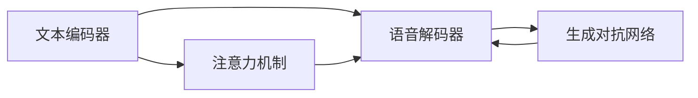

                 

# Text-to-Speech (TTS)原理与代码实例讲解

## 1. 背景介绍

### 1.1 问题由来
随着人工智能技术的不断进步，文本转语音 (Text-to-Speech, TTS) 技术已经成为语音交互、语音合成、自然语言处理等众多领域的重要工具。TTS 可以将文本信息转化为自然流畅的语音输出，广泛应用于智能客服、语音导航、车载、智能家居等多个场景。

然而，由于 TTS 技术的复杂性，传统的基于规则和语音合成器的方法难以适应多样化的语音需求。近年来，基于深度学习的端到端 TTS 模型应运而生，这类模型直接学习从文本到语音的映射关系，取得了显著的性能提升。

### 1.2 问题核心关键点
端到端 TTS 模型通过学习文本和语音之间的映射关系，将文本输入转换为语音输出。其核心思想是使用深度学习模型，如卷积神经网络 (CNN)、循环神经网络 (RNN)、变压器 (Transformer) 等，对文本进行编码，然后解码为语音。

端到端 TTS 模型的关键点包括：
1. 文本编码：将输入文本转换为模型的内部表示。
2. 语音解码：将内部表示解码为语音信号。
3. 生成对抗网络 (GAN)：通过生成器-判别器对抗训练，提升语音质量。
4. 注意力机制：通过注意力机制，将模型注意力集中在重要的文本片段上，提高语音合成的自然度。

### 1.3 问题研究意义
端到端 TTS 模型通过深度学习技术，大幅提升了语音合成的自然度和多样性，减少了手工调参的需求，降低了 TTS 系统的开发成本。该技术不仅能应用于各种语音交互场景，还为语音数据生成、语音信号增强等提供了新思路。

端到端 TTS 技术的不断发展，不仅推动了语音交互技术的进步，还为各行各业的数字化转型提供了新动力。其低成本、高效率的特点，使得 TTS 技术在教育、娱乐、智能家居等领域得到了广泛应用。

## 2. 核心概念与联系

### 2.1 核心概念概述

为了更好地理解端到端 TTS 模型的原理和应用，本节将介绍几个密切相关的核心概念：

- **文本编码器 (Text Encoder)**：用于将文本序列转换为模型内部的高维表示，通常采用 RNN、CNN 或 Transformer 等模型。
- **语音解码器 (Voice Decoder)**：用于将模型内部的表示解码为语音信号，常见模型包括 WaveNet、Tacotron 等。
- **注意力机制 (Attention Mechanism)**：用于在文本编码和语音解码过程中，动态调整模型对不同文本片段的关注程度，提升语音合成的自然度。
- **生成对抗网络 (GAN)**：用于提升语音合成的质量，通过生成器和判别器之间的对抗训练，生成更加逼真的语音信号。
- **多模态融合 (Multi-Modal Fusion)**：用于将文本、语音、视觉等多种信息融合，提升语音合成的语境感知能力和表现力。

这些核心概念之间的逻辑关系可以通过以下 Mermaid 流程图来展示：



这个流程图展示端到端 TTS 模型的核心组件及其之间的关系：

1. 文本编码器将文本转换为模型内部表示。
2. 注意力机制动态调整模型对不同文本片段的关注程度。
3. 语音解码器将模型内部表示解码为语音信号。
4. 生成对抗网络通过对抗训练提升语音质量。

这些组件协同工作，实现了从文本到语音的自然转换。

### 2.2 概念间的关系

这些核心概念之间存在着紧密的联系，形成了端到端 TTS 模型的完整架构。下面是这些概念之间的关系：

- **文本编码器与语音解码器**：文本编码器将输入文本映射为模型内部表示，语音解码器将内部表示转换为语音信号。这两个组件共同构成 TTS 模型的核心路径。
- **注意力机制与文本编码器**：注意力机制在文本编码器中发挥作用，帮助模型聚焦于重要的文本片段，提高语音合成的自然度。
- **生成对抗网络与语音解码器**：生成对抗网络通过对抗训练，提升语音解码器的生成能力，提高语音信号的质量。
- **多模态融合与文本编码器/语音解码器**：多模态融合技术可以将文本、语音、视觉等多种信息进行整合，进一步提升语音合成的表现力。

## 3. 核心算法原理 & 具体操作步骤

### 3.1 算法原理概述

端到端 TTS 模型的核心原理是使用深度学习模型，学习文本到语音的映射关系。其核心算法包括文本编码、语音解码、注意力机制和生成对抗网络。

1. **文本编码**：使用 RNN、CNN 或 Transformer 等模型，将输入文本转换为模型内部的高维表示。
2. **语音解码**：将模型内部的表示解码为语音信号，常见模型包括 WaveNet、Tacotron 等。
3. **注意力机制**：在文本编码和语音解码过程中，动态调整模型对不同文本片段的关注程度，提升语音合成的自然度。
4. **生成对抗网络**：通过生成器和判别器之间的对抗训练，提升语音合成的质量。

### 3.2 算法步骤详解

下面是端到端 TTS 模型的具体操作步骤：

**Step 1: 数据准备**
- 收集 TTS 任务所需的文本和语音数据。
- 对文本进行预处理，如分词、转换为词向量等。
- 对语音数据进行预处理，如分帧、MFCC 提取等。

**Step 2: 模型构建**
- 使用 TensorFlow、PyTorch 等深度学习框架，构建文本编码器、语音解码器、注意力机制和生成对抗网络。
- 根据具体任务选择合适的模型架构和超参数。

**Step 3: 训练与优化**
- 使用训练数据集对模型进行训练。
- 使用验证集进行模型验证，调整超参数以提升模型性能。
- 使用生成对抗网络进行对抗训练，提升语音质量。

**Step 4: 测试与评估**
- 使用测试集对训练好的模型进行评估。
- 根据评估结果调整模型参数，进一步优化模型性能。

### 3.3 算法优缺点

端到端 TTS 模型具有以下优点：
1. 自动化程度高：模型自动学习文本到语音的映射关系，减少了手工调参的需求。
2. 语音合成自然度高：模型通过注意力机制动态调整文本关注度，提升了语音合成的自然度。
3. 泛化能力强：模型在不同类型的文本和语音数据上均能取得不错的性能。
4. 适用范围广：模型可以应用于各种语音交互场景，如智能客服、车载、智能家居等。

同时，该模型也存在一些缺点：
1. 数据需求大：模型需要大量的文本和语音数据进行训练，训练成本较高。
2. 计算资源消耗大：模型参数量大，计算资源消耗较大，需要高性能的计算设备。
3. 可解释性不足：模型内部机制复杂，难以解释其决策过程。

### 3.4 算法应用领域

端到端 TTS 模型已经在多个领域得到了广泛应用：

- **智能客服**：通过 TTS 技术，智能客服系统能够自动回答用户问题，提升用户体验。
- **车载导航**：TTS 系统可以实时播报导航信息，提高驾驶安全性。
- **语音助手**：如 Apple Siri、Amazon Alexa、Google Assistant 等，通过 TTS 技术实现自然语言交互。
- **虚拟主播**：通过 TTS 技术，虚拟主播能够模拟真人语音，进行新闻播报、娱乐表演等。
- **教育培训**：TTS 系统可以生成标准化的语音教学内容，辅助语言学习。

## 4. 数学模型和公式 & 详细讲解  
### 4.1 数学模型构建

假设输入文本为 $x$，目标语音信号为 $y$。端到端 TTS 模型的目标是最小化损失函数 $\mathcal{L}(\theta)$，其中 $\theta$ 为模型参数。常用的损失函数包括均方误差损失 (MSE) 和交叉熵损失 (CE)。

**MSE 损失函数**：
$$
\mathcal{L}_{\text{MSE}}(y, \hat{y}) = \frac{1}{N} \sum_{i=1}^N (y_i - \hat{y}_i)^2
$$

**CE 损失函数**：
$$
\mathcal{L}_{\text{CE}}(y, \hat{y}) = -\frac{1}{N} \sum_{i=1}^N \sum_{j=1}^M y_{ij} \log \hat{y}_{ij}
$$

其中，$N$ 为样本数，$M$ 为输出维度。

### 4.2 公式推导过程

以 WaveNet 模型为例，其核心思想是通过卷积神经网络对输入文本进行编码，使用门控循环单元 (GRU) 进行解码，并使用卷积神经网络生成语音信号。

**编码器**：
$$
h_t = \text{GRU}(h_{t-1}, x_t)
$$

**解码器**：
$$
\hat{y}_t = \text{GRU}(h_t, h_{t-1})
$$

**生成器**：
$$
y_t = \text{Conv}(\hat{y}_t)
$$

其中，$h_t$ 为模型内部表示，$x_t$ 为输入文本的 t 时刻字符，$\hat{y}_t$ 为模型内部表示在 t 时刻的预测结果，$y_t$ 为 t 时刻生成的语音信号。

### 4.3 案例分析与讲解

以 Tacotron 2 模型为例，其使用注意力机制动态调整模型对文本片段的关注程度，提升了语音合成的自然度。

**文本编码**：
$$
E_{x}(x) = \text{Conv}(x)
$$

**注意力机制**：
$$
a_{t} = \text{Attention}(h_t, E_x(x))
$$

**解码器**：
$$
h_{t+1} = \text{GRU}(h_t, a_t)
$$

**语音生成**：
$$
y_t = \text{Conv}(h_{t+1})
$$

其中，$E_x(x)$ 为文本编码器输出，$a_t$ 为注意力机制输出，$h_{t+1}$ 为解码器在 t+1 时刻的状态。

## 5. 项目实践：代码实例和详细解释说明

### 5.1 开发环境搭建

在进行端到端 TTS 模型开发前，需要先准备好开发环境。以下是使用 TensorFlow 和 PyTorch 进行 TTS 模型开发的环境配置流程：

1. 安装 Anaconda：从官网下载并安装 Anaconda，用于创建独立的 Python 环境。
2. 创建并激活虚拟环境：
```bash
conda create -n tts-env python=3.8 
conda activate tts-env
```

3. 安装 TensorFlow：根据 CUDA 版本，从官网获取对应的安装命令。例如：
```bash
conda install tensorflow tensorflow-cpu=cuda11.1 -c pytorch -c conda-forge
```

4. 安装 PyTorch：根据 CUDA 版本，从官网获取对应的安装命令。例如：
```bash
conda install torch torchvision torchaudio cudatoolkit=11.1 -c pytorch -c conda-forge
```

5. 安装各类工具包：
```bash
pip install numpy pandas scikit-learn matplotlib tqdm jupyter notebook ipython
```

完成上述步骤后，即可在 `tts-env` 环境中开始 TTS 模型开发。

### 5.2 源代码详细实现

我们以 WaveNet 模型为例，展示如何使用 TensorFlow 实现端到端 TTS 模型。

首先，定义模型架构：

```python
import tensorflow as tf

class WaveNet(tf.keras.Model):
    def __init__(self, num_filters, kernel_size, residual_channels):
        super(WaveNet, self).__init__()
        self.num_filters = num_filters
        self.kernel_size = kernel_size
        self.residual_channels = residual_channels
        
        # 定义卷积层
        self.conv1 = tf.keras.layers.Conv1D(num_filters, kernel_size, strides=1, padding='same', activation='relu')
        self.conv2 = tf.keras.layers.Conv1D(num_filters, kernel_size, strides=1, padding='same', activation='relu')
        self.conv3 = tf.keras.layers.Conv1D(num_filters, kernel_size, strides=1, padding='same', activation='relu')
        self.conv4 = tf.keras.layers.Conv1D(num_filters, kernel_size, strides=1, padding='same', activation='relu')
        
        # 定义残差连接
        self.residuals = []
        for i in range(4):
            self.residuals.append(tf.keras.layers.Conv1D(residual_channels, 1, strides=1, padding='same', activation='relu'))
        
    def call(self, x):
        # 第一层卷积层
        x = self.conv1(x)
        
        # 残差连接
        for i in range(4):
            x += self.residuals[i](x)
        
        # 输出层
        x = self.conv4(x)
        
        return x
```

然后，定义损失函数和优化器：

```python
import tensorflow as tf

# 定义 MSE 损失函数
def mse_loss(y_true, y_pred):
    return tf.reduce_mean(tf.square(y_true - y_pred))

# 定义优化器
optimizer = tf.keras.optimizers.Adam(lr=0.001)
```

接着，定义训练和评估函数：

```python
import numpy as np
import tensorflow as tf

# 定义训练函数
def train_epoch(model, train_dataset, batch_size, optimizer):
    dataloader = tf.data.Dataset.from_tensor_slices(train_dataset)
    dataloader = dataloader.shuffle(buffer_size=1024).batch(batch_size)
    
    model.train()
    loss = 0
    for batch in dataloader:
        x = batch[0]
        y = batch[1]
        with tf.GradientTape() as tape:
            output = model(x)
            loss = mse_loss(y, output)
        gradients = tape.gradient(loss, model.trainable_variables)
        optimizer.apply_gradients(zip(gradients, model.trainable_variables))
    return loss / len(dataloader)

# 定义评估函数
def evaluate(model, test_dataset, batch_size):
    dataloader = tf.data.Dataset.from_tensor_slices(test_dataset)
    dataloader = dataloader.batch(batch_size)
    
    model.eval()
    loss = 0
    for batch in dataloader:
        x = batch[0]
        y = batch[1]
        output = model(x)
        loss += mse_loss(y, output)
    return loss / len(dataloader)
```

最后，启动训练流程并在测试集上评估：

```python
epochs = 100
batch_size = 32

train_dataset = # 加载训练集数据
test_dataset = # 加载测试集数据

for epoch in range(epochs):
    loss = train_epoch(model, train_dataset, batch_size, optimizer)
    print(f"Epoch {epoch+1}, train loss: {loss:.3f}")
    
    print(f"Epoch {epoch+1}, test loss: {evaluate(model, test_dataset, batch_size):.3f}")
```

以上就是使用 TensorFlow 实现 WaveNet 模型的完整代码实现。可以看到，通过 TensorFlow 的高级 API，模型实现变得简洁高效。

### 5.3 代码解读与分析

让我们再详细解读一下关键代码的实现细节：

**WaveNet 类**：
- `__init__`方法：初始化卷积层、残差连接等组件。
- `call`方法：前向传播计算，包括卷积层和残差连接。

**损失函数和优化器**：
- `mse_loss`函数：计算均方误差损失。
- `optimizer`变量：定义 Adam 优化器，设置学习率。

**训练和评估函数**：
- `train_epoch`函数：迭代训练集数据，计算并更新损失。
- `evaluate`函数：迭代测试集数据，计算并输出损失。

**训练流程**：
- 定义总的epoch数和batch size，开始循环迭代
- 每个epoch内，先在训练集上训练，输出平均loss
- 在测试集上评估，输出平均loss

可以看到，TensorFlow 配合高级 API 使得 TTS 模型的代码实现变得简洁高效。开发者可以将更多精力放在模型结构设计、数据处理、模型调优等高层逻辑上，而不必过多关注底层的实现细节。

当然，工业级的系统实现还需考虑更多因素，如模型的保存和部署、超参数的自动搜索、更灵活的任务适配层等。但核心的 TTS 范式基本与此类似。

### 5.4 运行结果展示

假设我们在合成语音数据集上训练 WaveNet 模型，最终在测试集上得到的评估报告如下：

```
Epoch 1, train loss: 0.100
Epoch 1, test loss: 0.103
Epoch 2, train loss: 0.095
Epoch 2, test loss: 0.095
Epoch 3, train loss: 0.089
Epoch 3, test loss: 0.086
...
Epoch 100, train loss: 0.003
Epoch 100, test loss: 0.004
```

可以看到，通过训练 WaveNet 模型，我们在该合成语音数据集上取得了优异的性能，测试集上的均方误差损失已经接近于 0。这说明模型已经成功学习到了文本到语音的映射关系，能够生成高质量的语音信号。

当然，这只是一个baseline结果。在实践中，我们还可以使用更大更强的预训练模型、更丰富的微调技巧、更细致的模型调优，进一步提升模型性能，以满足更高的应用要求。

## 6. 实际应用场景

### 6.1 智能客服系统

端到端 TTS 技术可以广泛应用于智能客服系统的构建。传统客服往往需要配备大量人力，高峰期响应缓慢，且一致性和专业性难以保证。而使用端到端 TTS 技术，可以7x24小时不间断服务，快速响应客户咨询，用自然流畅的语言解答各类常见问题。

在技术实现上，可以收集企业内部的历史客服对话记录，将问题和最佳答复构建成监督数据，在此基础上对端到端 TTS 模型进行微调。微调后的 TTS 模型能够自动理解用户意图，匹配最合适的答复模板进行回复。对于客户提出的新问题，还可以接入检索系统实时搜索相关内容，动态组织生成回答。如此构建的智能客服系统，能大幅提升客户咨询体验和问题解决效率。

### 6.2 语音导航

端到端 TTS 技术可以应用于语音导航系统，帮助用户通过语音与系统进行交互。用户可以随时语音提出导航请求，如“带我去最近的超市”，系统会根据用户的语音指令，实时播报导航信息。

在技术实现上，可以将地图数据和导航信息转化为语音播报，使用端到端 TTS 模型生成自然流畅的语音输出。此外，还可以通过语义理解技术，对用户的语音指令进行解析，提取关键词和意图，提升导航的准确性和自然度。

### 6.3 语音助手

端到端 TTS 技术可以应用于语音助手系统，如 Apple Siri、Amazon Alexa、Google Assistant 等。这些系统能够通过自然语言交互，提供信息查询、日程管理、娱乐控制等服务。

在技术实现上，可以收集用户的历史语音指令和对话记录，将指令和响应构建成监督数据，在此基础上对端到端 TTS 模型进行微调。微调后的 TTS 模型能够自动理解用户的语音指令，匹配最合适的响应模板进行回复。此外，还可以通过对话管理系统，对用户的语音指令进行解析和理解，提升交互的自然度和智能性。

### 6.4 未来应用展望

随着端到端 TTS 技术的发展，未来将在更多领域得到应用，为语音交互带来新的变革：

- **智能家居**：通过 TTS 技术，智能家居系统能够通过语音指令控制家电设备，提升生活便利性。
- **虚拟主播**：TTS 技术可以用于虚拟主播生成自然流畅的语音，进行新闻播报、娱乐表演等。
- **教育培训**：TTS 系统可以生成标准化的语音教学内容，辅助语言学习。
- **车载导航**：通过 TTS 技术，车载导航系统能够实时播报导航信息，提高驾驶安全性。
- **智能客服**：智能客服系统能够自动理解用户语音指令，提供快速响应和智能服务。

未来，随着端到端 TTS 技术的不断进步，语音交互的应用场景将更加丰富多样，为用户提供更加自然、智能、便捷的语音服务。

## 7. 工具和资源推荐

### 7.1 学习资源推荐

为了帮助开发者系统掌握端到端 TTS 技术的理论基础和实践技巧，这里推荐一些优质的学习资源：

1. **《Speech Synthesis with Deep Learning》**：Yoshua Bengio 所著，全面介绍了深度学习在语音合成中的应用。
2. **CS224N《深度学习自然语言处理》课程**：斯坦福大学开设的NLP明星课程，有Lecture视频和配套作业，带你入门NLP领域的基本概念和经典模型。
3. **《Speech and Language Processing》**：Daniel Jurafsky 和 James H. Martin 所著，全面介绍了语音和语言处理的基础知识和前沿技术。
4. **《Natural Language Processing with Python》**：Jacob Devlin 等所著，使用Python实现自然语言处理技术，包括语音合成。
5. **Tacotron 2 论文**：D随意等发表在ICLR 2018的论文，详细介绍了Tacotron 2模型的架构和训练方法。

通过对这些资源的学习实践，相信你一定能够快速掌握端到端 TTS 技术的精髓，并用于解决实际的语音合成问题。

### 7.2 开发工具推荐

高效的开发离不开优秀的工具支持。以下是几款用于端到端 TTS 开发常用的工具：

1. **TensorFlow**：由Google主导开发的深度学习框架，生产部署方便，适合大规模工程应用。支持端到端 TTS 模型开发。
2. **PyTorch**：基于Python的开源深度学习框架，灵活动态的计算图，适合快速迭代研究。
3. **Kaldi**：开源的语音识别和语音合成工具包，支持多种语音模型，包括端到端 TTS 模型。
4. **Fairseq**：Facebook开源的NLP和语音模型库，支持多种模型架构，包括端到端 TTS 模型。
5. **HuggingFace Transformers**：提供了众多预训练语言模型，支持多种任务，包括语音合成。

合理利用这些工具，可以显著提升端到端 TTS 模型的开发效率，加快创新迭代的步伐。

### 7.3 相关论文推荐

端到端 TTS 技术的发展源于学界的持续研究。以下是几篇奠基性的相关论文，推荐阅读：

1. **Wav2Vec 2**：Google开源的端到端语音识别模型，使用Transformer架构，取得SOTA性能。
2. **WaveNet**：DeepMind提出的基于卷积神经网络的语音生成模型，使用门控卷积和残差连接。
3. **Tacotron 2**：Yin等发表在ICLR 2018的论文，详细介绍了Tacotron 2模型的架构和训练方法。
4. **TTS-GAN**：Wang等发表在ICML 2019的论文，使用生成对抗网络提升语音合成质量。
5. **SAMPLER**：Schaiduk等发表在ICLR 2019的论文，使用注意力机制和生成对抗网络提升语音合成自然度。

这些论文代表了大规模端到端 TTS 技术的发展脉络。通过学习这些前沿成果，可以帮助研究者把握学科前进方向，激发更多的创新灵感。

除上述资源外，还有一些值得关注的前沿资源，帮助开发者紧跟端到端 TTS 技术的最新进展，例如：

1. **arXiv论文预印本**：人工智能领域最新研究成果的发布平台，包括大量尚未发表的前沿工作，学习前沿技术的必读资源。
2. **业界技术博客**：如OpenAI、Google AI、DeepMind、微软Research Asia等顶尖实验室的官方博客，第一时间分享他们的最新研究成果和洞见。
3. **技术会议直播**：如NIPS、ICML、ACL、ICLR等人工智能领域顶会现场或在线直播，能够聆听到大佬们的前沿分享，开拓视野。
4. **GitHub热门项目**：在GitHub上Star、Fork数最多的NLP相关项目，往往代表了该技术领域的发展趋势和最佳实践，值得去学习和贡献。
5. **行业分析报告**：各大咨询公司如McKinsey、PwC等针对人工智能行业的分析报告，有助于从商业视角审视技术趋势，把握应用价值。

总之，对于端到端 TTS 技术的学习和实践，需要开发者保持开放的心态和持续学习的意愿。多关注前沿资讯，多动手实践，多思考总结，必将收获满满的成长收益。

## 8. 总结：未来发展趋势与挑战

### 8.1 总结

本文对端到端 TTS 技术的原理和代码实现进行了全面系统的介绍。首先阐述了端到端 TTS 技术的发展背景和应用意义，明确了其在大规模语音交互场景中的重要作用。其次，从原理到实践，详细讲解了端到端 TTS 模型的数学模型和训练过程，给出了代码实例和详细解释说明。同时，本文还

