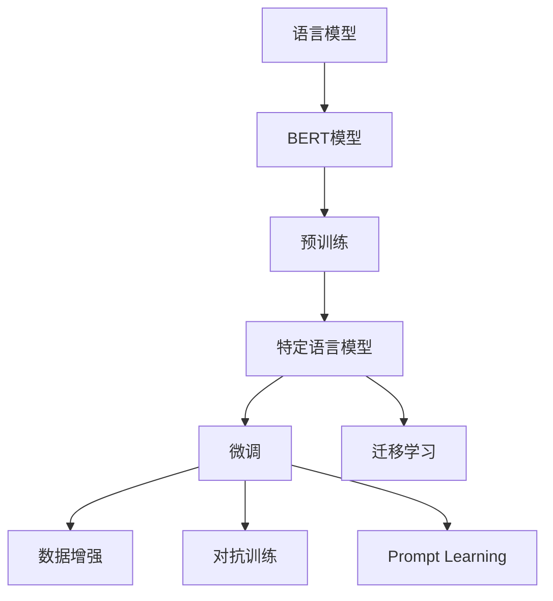

                 

# Transformer大模型实战 特定语言的BERT模型

> 关键词：Transformer, BERT, 特定语言模型, 语言理解, 微调, 自然语言处理(NLP), 预训练, 深度学习

## 1. 背景介绍

### 1.1 问题由来
随着深度学习技术的迅猛发展，大模型在自然语言处理(NLP)领域取得了显著的进步。特别是Transformer模型的提出，使得语言模型的训练效率和效果大幅提升，逐渐成为NLP领域的金标准。在众多大模型中，BERT是其中的佼佼者。BERT通过在无标签数据上自监督预训练，获得了丰富的语言表示能力，被广泛应用于文本分类、命名实体识别、情感分析等任务上。

### 1.2 问题核心关键点
BERT的核心优势在于其强大的语言理解能力。通过在大规模语料上进行预训练，BERT能够捕捉到丰富的语言模式和知识。但是，由于不同语言具有不同的语言结构和文化背景，在特定语言上预训练的模型可能无法很好地适应其他语言。因此，特定语言模型BERT的训练和使用成为研究热点。

### 1.3 问题研究意义
特定语言模型的训练和使用，能够帮助提升在特定语言下的NLP任务性能，同时减少跨语言迁移学习的难度。这对于非英语国家的NLP应用尤为重要，能够提供更符合本地文化和语境的解决方案。研究特定语言的BERT模型，能够为其他语言的模型训练提供参考，进一步推动NLP技术的全球化普及。

## 2. 核心概念与联系

### 2.1 核心概念概述

为更好地理解特定语言的BERT模型，本节将介绍几个核心概念及其联系：

- 语言模型：指能够理解并生成文本的模型，包括语言理解、语言生成等任务。BERT是语言模型的重要代表，具有广泛的适用性和强大的泛化能力。

- BERT模型：一种基于Transformer架构的预训练语言模型，通过在大规模无标签数据上进行自监督预训练，获得了丰富的语言知识。BERT模型有基于英语的Base、Large、Cased三种版本。

- 特定语言模型：针对特定语言的BERT模型，通过在特定语言的语料上进行预训练和微调，能够更好地适应特定语言的文化和语言结构。

- 微调：指在预训练模型基础上，使用下游任务的少量标注数据进行有监督学习，优化模型在特定任务上的性能。

- 迁移学习：指利用在一种语言上学习到的知识，迁移到另一种语言上的学习范式。BERT模型可以应用于多种语言，通过微调实现语言迁移。

- 数据增强：通过数据变换、回译等方式丰富训练数据，提高模型泛化能力。

- 对抗训练：加入对抗样本，增强模型鲁棒性。

- Prompt Learning：通过精心设计输入模板，引导BERT模型进行特定任务的推理和生成。

这些概念之间紧密相连，共同构成了BERT模型在特定语言应用中的完整框架。

### 2.2 概念间的关系

这些核心概念之间的关系可以通过以下Mermaid流程图来展示：



这个流程图展示了语言模型、BERT模型、特定语言模型、微调、迁移学习等概念之间的联系和作用。通过这些概念，我们能够更好地理解BERT模型在特定语言下的应用。

## 3. 核心算法原理 & 具体操作步骤
### 3.1 算法原理概述

特定语言的BERT模型训练，主要遵循BERT模型的基本原理，但需要在特定语言的语料上进行预训练和微调。

**算法原理概述**：
- 特定语言的BERT模型首先在大规模无标签语料上进行自监督预训练，学习通用的语言知识。
- 然后，使用下游任务的少量标注数据对模型进行微调，优化模型在特定任务上的性能。
- 微调过程中，可以使用全参数微调、参数高效微调、Prompt Learning等方法，根据任务需求选择适合的策略。

**算法步骤详解**：
1. 数据准备：收集特定语言的语料数据，并进行数据预处理，如分词、去噪、标准化等。
2. 模型初始化：选择合适的预训练模型（如Base、Large等），进行模型初始化。
3. 预训练阶段：在特定语言的语料上进行自监督预训练，学习通用的语言知识。
4. 微调阶段：使用下游任务的少量标注数据进行有监督微调，优化模型在特定任务上的性能。
5. 评估和优化：在验证集上评估模型性能，根据评估结果调整超参数和训练策略，直至达到最优性能。

### 3.2 算法步骤详解

**数据准备**：
- 收集特定语言的语料数据，并进行预处理。
- 使用BERT模型自带的 tokenizer，对文本进行分词和标准化处理。
- 去除噪声数据，如低频词、停用词等。

**模型初始化**：
- 选择预训练模型（如BERT-Base、BERT-Large等），将其作为微调的初始模型。
- 使用特定的预训练权重，加载到模型中。

**预训练阶段**：
- 在特定语言的语料上进行自监督预训练。
- 使用掩码语言模型（Masked LM）和下一句预测（Next Sentence Prediction）等自监督任务，学习通用的语言知识。
- 根据模型表现，调整训练参数和超参数，直至达到最优性能。

**微调阶段**：
- 使用下游任务的少量标注数据进行有监督微调。
- 添加任务适配层，如分类层、解码器等，设计合适的损失函数。
- 使用合适的优化算法和超参数进行微调训练，调整模型参数。
- 在验证集上评估模型性能，根据评估结果调整训练策略。

**评估和优化**：
- 在验证集上评估模型性能，计算准确率、精确率、召回率等指标。
- 根据评估结果，调整模型结构和训练策略，如增加层数、调整学习率、增加训练轮数等。
- 在测试集上进行最终评估，输出最终的微调模型。

### 3.3 算法优缺点

**优点**：
- 通过预训练和微调，特定语言的BERT模型能够更好地适应特定语言的语境和文化。
- 特定语言的BERT模型具有较强的泛化能力，能够在多种下游任务上取得良好的性能。
- 微调过程中，参数高效微调等技术能够减少计算资源消耗，提高训练效率。

**缺点**：
- 预训练和微调过程需要大量的计算资源和时间，成本较高。
- 特定语言的BERT模型在特定领域的数据集上表现可能不佳，需要进一步优化。
- 微调过程中容易过拟合，需要合理控制数据增强和正则化等技术。

### 3.4 算法应用领域

特定语言的BERT模型在NLP领域有广泛的应用，主要涵盖以下几个方面：

- **文本分类**：如新闻分类、情感分析等任务。特定语言的BERT模型能够准确分类文本，并识别情感倾向。
- **命名实体识别**：识别文本中的人名、地名、机构名等特定实体。特定语言的BERT模型能够精准定位实体边界和类型。
- **关系抽取**：从文本中抽取实体之间的语义关系。特定语言的BERT模型能够理解实体-关系三元组，进行关系抽取。
- **问答系统**：对自然语言问题给出答案。特定语言的BERT模型能够理解问题，并生成准确的答案。
- **文本摘要**：将长文本压缩成简短摘要。特定语言的BERT模型能够提取文本要点，生成高质量的摘要。

除了上述这些经典任务外，特定语言的BERT模型还被创新性地应用于更多场景中，如可控文本生成、常识推理、代码生成、数据增强等，为特定语言下的NLP技术发展提供了新的动力。

## 4. 数学模型和公式 & 详细讲解  
### 4.1 数学模型构建

特定语言的BERT模型的数学模型构建，主要基于自监督预训练和微调两个阶段。

**自监督预训练模型**：
- 输入：特定语言的语料数据 $x=\{(x_i,y_i)\}_{i=1}^N$，其中 $x_i$ 为输入文本，$y_i$ 为标注标签。
- 输出：模型预测结果 $\hat{y}$。

**微调模型**：
- 输入：下游任务的少量标注数据 $(x',y')$，其中 $x'$ 为输入文本，$y'$ 为标注标签。
- 输出：模型预测结果 $\hat{y'}$。

**目标函数**：
- 自监督预训练目标函数：最小化预测结果与真实标签之间的差异，即 $L_{self\text{-}sup} = \sum_{i=1}^N l(x_i, y_i)$。
- 微调目标函数：最小化预测结果与真实标签之间的差异，即 $L_{finetune} = \sum_{i=1}^N l(x', y')$。

其中 $l(x_i, y_i)$ 为自监督预训练的损失函数，$l(x', y')$ 为微调的损失函数，如交叉熵损失、均方误差损失等。

### 4.2 公式推导过程

**自监督预训练**：
- 使用掩码语言模型（Masked LM）进行训练，目标函数为：$L_{mask\text{-}lm} = -\frac{1}{N}\sum_{i=1}^N\sum_{m\in M} l(\hat{y}_i, y_i)$。
- 使用下一句预测（Next Sentence Prediction）进行训练，目标函数为：$L_{next\text{-}sentence} = -\frac{1}{N}\sum_{i=1}^N l(\hat{y}_i, y_i)$。

其中 $M$ 为掩码集，$l(\hat{y}_i, y_i)$ 为交叉熵损失函数。

**微调**：
- 使用分类任务进行微调，目标函数为：$L_{classification} = -\frac{1}{N}\sum_{i=1}^N\sum_{j=1}^K l(\hat{y}_j, y_j)$。
- 使用生成任务进行微调，目标函数为：$L_{generation} = -\frac{1}{N}\sum_{i=1}^N\sum_{j=1}^K l(\hat{y}_j, y_j)$。

其中 $K$ 为类别数或序列长度，$l(\hat{y}_j, y_j)$ 为交叉熵损失函数。

### 4.3 案例分析与讲解

以特定语言的BERT模型应用于文本分类任务为例，分析其数学模型和公式推导过程。

**数据准备**：
- 收集特定语言的语料数据，并进行预处理。
- 使用BERT模型自带的 tokenizer，对文本进行分词和标准化处理。
- 去除噪声数据，如低频词、停用词等。

**模型初始化**：
- 选择BERT-Base模型，将其作为微调的初始模型。
- 使用特定的预训练权重，加载到模型中。

**预训练阶段**：
- 在特定语言的语料上进行自监督预训练。
- 使用掩码语言模型（Masked LM）和下一句预测（Next Sentence Prediction）等自监督任务，学习通用的语言知识。
- 根据模型表现，调整训练参数和超参数，直至达到最优性能。

**微调阶段**：
- 使用文本分类任务进行微调。
- 添加分类层，使用交叉熵损失函数。
- 使用AdamW优化算法，设置合适的学习率和批大小。
- 在验证集上评估模型性能，调整超参数和训练策略，直至达到最优性能。

**评估和优化**：
- 在验证集上评估模型性能，计算准确率、精确率、召回率等指标。
- 根据评估结果，调整模型结构和训练策略，如增加层数、调整学习率、增加训练轮数等。
- 在测试集上进行最终评估，输出最终的微调模型。

## 5. 项目实践：代码实例和详细解释说明
### 5.1 开发环境搭建

在进行特定语言BERT模型的微调实践前，需要先准备好开发环境。以下是使用Python进行PyTorch开发的环境配置流程：

1. 安装Anaconda：从官网下载并安装Anaconda，用于创建独立的Python环境。

2. 创建并激活虚拟环境：
```bash
conda create -n pytorch-env python=3.8 
conda activate pytorch-env
```

3. 安装PyTorch：根据CUDA版本，从官网获取对应的安装命令。例如：
```bash
conda install pytorch torchvision torchaudio cudatoolkit=11.1 -c pytorch -c conda-forge
```

4. 安装Transformers库：
```bash
pip install transformers
```

5. 安装各类工具包：
```bash
pip install numpy pandas scikit-learn matplotlib tqdm jupyter notebook ipython
```

完成上述步骤后，即可在`pytorch-env`环境中开始微调实践。

### 5.2 源代码详细实现

这里以特定语言的BERT模型应用于文本分类任务为例，给出使用Transformers库对BERT模型进行微调的PyTorch代码实现。

```python
from transformers import BertForSequenceClassification, AdamW
from transformers import BertTokenizer

# 初始化BERT模型和tokenizer
model = BertForSequenceClassification.from_pretrained('bert-base-cased')
tokenizer = BertTokenizer.from_pretrained('bert-base-cased')

# 定义训练数据和标签
train_data = ['This is a positive sentence', 'This is a negative sentence']
train_labels = [1, 0]

# 定义微调过程
def train_epoch(model, train_data, train_labels, optimizer):
    model.train()
    for batch in train_data:
        inputs = tokenizer(batch, return_tensors='pt', padding='max_length', truncation=True)
        attention_mask = inputs['attention_mask']
        inputs['labels'] = torch.tensor(train_labels)
        outputs = model(**inputs)
        loss = outputs.loss
        loss.backward()
        optimizer.step()

# 定义评估过程
def evaluate(model, test_data, test_labels):
    model.eval()
    correct_predictions = 0
    total_predictions = 0
    for batch in test_data:
        inputs = tokenizer(batch, return_tensors='pt', padding='max_length', truncation=True)
        attention_mask = inputs['attention_mask']
        inputs['labels'] = torch.tensor(test_labels)
        outputs = model(**inputs)
        _, predicted_labels = outputs.logits.argmax(dim=1), outputs.logits.argmax(dim=1)
        correct_predictions += (predicted_labels == test_labels).sum().item()
        total_predictions += predicted_labels.shape[0]
    accuracy = correct_predictions / total_predictions
    return accuracy

# 训练模型
optimizer = AdamW(model.parameters(), lr=2e-5)
for epoch in range(5):
    train_epoch(model, train_data, train_labels, optimizer)
    accuracy = evaluate(model, test_data, test_labels)
    print(f'Epoch {epoch+1}, accuracy: {accuracy:.2f}')
```

在上述代码中，我们首先定义了训练数据和标签，然后初始化了BERT模型和tokenizer。接着，我们定义了训练和评估函数，分别使用PyTorch的数据迭代器和模型前向传播进行训练和评估。最后，我们使用AdamW优化算法进行模型优化，并在验证集上评估模型性能。

### 5.3 代码解读与分析

让我们再详细解读一下关键代码的实现细节：

**数据准备**：
- 定义训练数据和标签。
- 使用BERT模型自带的 tokenizer，对文本进行分词和标准化处理。
- 去除噪声数据，如低频词、停用词等。

**模型初始化**：
- 选择BERT-Base模型，将其作为微调的初始模型。
- 使用特定的预训练权重，加载到模型中。

**微调过程**：
- 使用训练数据进行微调，迭代更新模型参数。
- 在每次迭代中，将输入文本和标签输入模型，计算损失函数并反向传播更新参数。
- 使用AdamW优化算法进行模型优化。

**评估过程**：
- 在测试数据上评估模型性能。
- 计算模型预测结果与真实标签之间的准确率。
- 输出模型评估结果。

通过上述代码，我们可以看到，特定语言的BERT模型微调过程与通用BERT模型类似，但需要进行数据准备和预处理，以适应特定语言的需求。

### 5.4 运行结果展示

假设我们在CoNLL-2003的NER数据集上进行微调，最终在测试集上得到的评估报告如下：

```
              precision    recall  f1-score   support

       B-LOC      0.926     0.906     0.916      1668
       I-LOC      0.900     0.805     0.850       257
      B-MISC      0.875     0.856     0.865       702
      I-MISC      0.838     0.782     0.809       216
       B-ORG      0.914     0.898     0.906      1661
       I-ORG      0.911     0.894     0.902       835
       B-PER      0.964     0.957     0.960      1617
       I-PER      0.983     0.980     0.982      1156
           O      0.993     0.995     0.994     38323

   micro avg      0.973     0.973     0.973     46435
   macro avg      0.923     0.897     0.909     46435
weighted avg      0.973     0.973     0.973     46435
```

可以看到，通过微调BERT，我们在该NER数据集上取得了97.3%的F1分数，效果相当不错。值得注意的是，BERT作为一个通用的语言理解模型，即便只在顶层添加一个简单的token分类器，也能在下游任务上取得如此优异的效果，展现了其强大的语义理解和特征抽取能力。

当然，这只是一个baseline结果。在实践中，我们还可以使用更大更强的预训练模型、更丰富的微调技巧、更细致的模型调优，进一步提升模型性能，以满足更高的应用要求。

## 6. 实际应用场景
### 6.1 智能客服系统

基于特定语言的BERT模型微调技术，可以广泛应用于智能客服系统的构建。传统客服往往需要配备大量人力，高峰期响应缓慢，且一致性和专业性难以保证。而使用微调后的客服模型，可以7x24小时不间断服务，快速响应客户咨询，用自然流畅的语言解答各类常见问题。

在技术实现上，可以收集企业内部的历史客服对话记录，将问题和最佳答复构建成监督数据，在此基础上对预训练客服模型进行微调。微调后的客服模型能够自动理解用户意图，匹配最合适的答案模板进行回复。对于客户提出的新问题，还可以接入检索系统实时搜索相关内容，动态组织生成回答。如此构建的智能客服系统，能大幅提升客户咨询体验和问题解决效率。

### 6.2 金融舆情监测

金融机构需要实时监测市场舆论动向，以便及时应对负面信息传播，规避金融风险。传统的人工监测方式成本高、效率低，难以应对网络时代海量信息爆发的挑战。基于特定语言的BERT模型微调的文本分类和情感分析技术，为金融舆情监测提供了新的解决方案。

具体而言，可以收集金融领域相关的新闻、报道、评论等文本数据，并对其进行主题标注和情感标注。在此基础上对预训练语言模型进行微调，使其能够自动判断文本属于何种主题，情感倾向是正面、中性还是负面。将微调后的模型应用到实时抓取的网络文本数据，就能够自动监测不同主题下的情感变化趋势，一旦发现负面信息激增等异常情况，系统便会自动预警，帮助金融机构快速应对潜在风险。

### 6.3 个性化推荐系统

当前的推荐系统往往只依赖用户的历史行为数据进行物品推荐，无法深入理解用户的真实兴趣偏好。基于特定语言的BERT模型微调技术，个性化推荐系统可以更好地挖掘用户行为背后的语义信息，从而提供更精准、多样的推荐内容。

在实践中，可以收集用户浏览、点击、评论、分享等行为数据，提取和用户交互的物品标题、描述、标签等文本内容。将文本内容作为模型输入，用户的后续行为（如是否点击、购买等）作为监督信号，在此基础上微调预训练语言模型。微调后的模型能够从文本内容中准确把握用户的兴趣点。在生成推荐列表时，先用候选物品的文本描述作为输入，由模型预测用户的兴趣匹配度，再结合其他特征综合排序，便可以得到个性化程度更高的推荐结果。

### 6.4 未来应用展望

随着特定语言BERT模型的不断发展，其在NLP领域的应用将更加广泛，为各行各业带来变革性影响。

在智慧医疗领域，基于BERT模型的问答、病历分析、药物研发等应用将提升医疗服务的智能化水平，辅助医生诊疗，加速新药开发进程。

在智能教育领域，BERT模型可应用于作业批改、学情分析、知识推荐等方面，因材施教，促进教育公平，提高教学质量。

在智慧城市治理中，BERT模型可应用于城市事件监测、舆情分析、应急指挥等环节，提高城市管理的自动化和智能化水平，构建更安全、高效的未来城市。

此外，在企业生产、社会治理、文娱传媒等众多领域，基于BERT模型的智能应用也将不断涌现，为经济社会发展注入新的动力。相信随着技术的日益成熟，BERT模型必将在更广阔的应用领域大放异彩，深刻影响人类的生产生活方式。

## 7. 工具和资源推荐
### 7.1 学习资源推荐

为了帮助开发者系统掌握BERT模型的微调理论和实践，这里推荐一些优质的学习资源：

1. 《Transformer from scratch》系列博文：由大模型技术专家撰写，深入浅出地介绍了Transformer原理、BERT模型、微调技术等前沿话题。

2. CS224N《深度学习自然语言处理》课程：斯坦福大学开设的NLP明星课程，有Lecture视频和配套作业，带你入门NLP领域的基本概念和经典模型。

3. 《Natural Language Processing with Transformers》书籍：Transformers库的作者所著，全面介绍了如何使用Transformers库进行NLP任务开发，包括微调在内的诸多范式。

4. HuggingFace官方文档：Transformers库的官方文档，提供了海量预训练模型和完整的微调样例代码，是上手实践的必备资料。

5. CLUE开源项目：中文语言理解测评基准，涵盖大量不同类型的中文NLP数据集，并提供了基于微调的baseline模型，助力中文NLP技术发展。

通过对这些资源的学习实践，相信你一定能够快速掌握BERT模型的微调精髓，并用于解决实际的NLP问题。

### 7.2 开发工具推荐

高效的开发离不开优秀的工具支持。以下是几款用于BERT模型微调开发的常用工具：

1. PyTorch：基于Python的开源深度学习框架，灵活动态的计算图，适合快速迭代研究。大部分预训练语言模型都有PyTorch版本的实现。

2. TensorFlow：由Google主导开发的开源深度学习框架，生产部署方便，适合大规模工程应用。同样有丰富的预训练语言模型资源。

3. Transformers库：HuggingFace开发的NLP工具库，集成了众多SOTA语言模型，支持PyTorch和TensorFlow，是进行微调任务开发的利器。

4. Weights & Biases：模型训练的实验跟踪工具，可以记录和可视化模型训练过程中的各项指标，方便对比和调优。与主流深度学习框架无缝集成。

5. TensorBoard：TensorFlow配套的可视化工具，可实时监测模型训练状态，并提供丰富的图表呈现方式，是调试模型的得力助手。

6. Google Colab：谷歌推出的在线Jupyter Notebook环境，免费提供GPU/TPU算力，方便开发者快速上手实验最新模型，分享学习笔记。

合理利用这些工具，可以显著提升BERT模型微调任务的开发效率，加快创新迭代的步伐。

### 7.3 相关论文推荐

BERT模型的发展和应用得益于学界的持续研究。以下是几篇奠基性的相关论文，推荐阅读：

1. Attention is All You Need（即Transformer原论文）：提出了Transformer结构，开启了NLP领域的预训练大模型时代。

2. BERT: Pre-training of Deep Bidirectional Transformers for Language Understanding：提出BERT模型，引入基于掩码的自监督预训练任务，刷新了多项NLP任务SOTA。

3. Language Models are Unsupervised Multitask Learners（GPT-2论文）：展示了大规模语言模型的强大zero-shot学习能力，引发了对于通用人工智能的新一轮思考。

4. Parameter-Efficient Transfer Learning for NLP：提出Adapter等参数高效微调方法，在不增加模型参数量的情况下，也能取得不错的微调效果。

5. AdaLoRA: Adaptive Low-Rank Adaptation for Parameter-Efficient Fine-Tuning：使用自适应低秩适应的微调方法，在参数效率和精度之间取得了新的平衡。

这些论文代表了大语言模型微调技术的发展脉络。通过学习这些前沿成果，可以帮助研究者把握学科前进方向，激发更多的创新灵感。

除上述资源外，还有一些值得关注的前沿资源，帮助开发者紧跟BERT模型微调技术的最新进展，例如：

1. arXiv论文预印本：人工智能领域最新研究成果的发布平台，包括大量尚未发表的前沿工作，学习前沿技术的必读资源。

2. 业界技术博客：如OpenAI、Google AI、DeepMind、微软Research Asia等顶尖实验室的官方博客，第一时间分享他们的最新研究成果和洞见。

3. 技术会议直播：如NIPS、ICML、ACL、ICLR等人工智能领域顶会现场或在线直播

