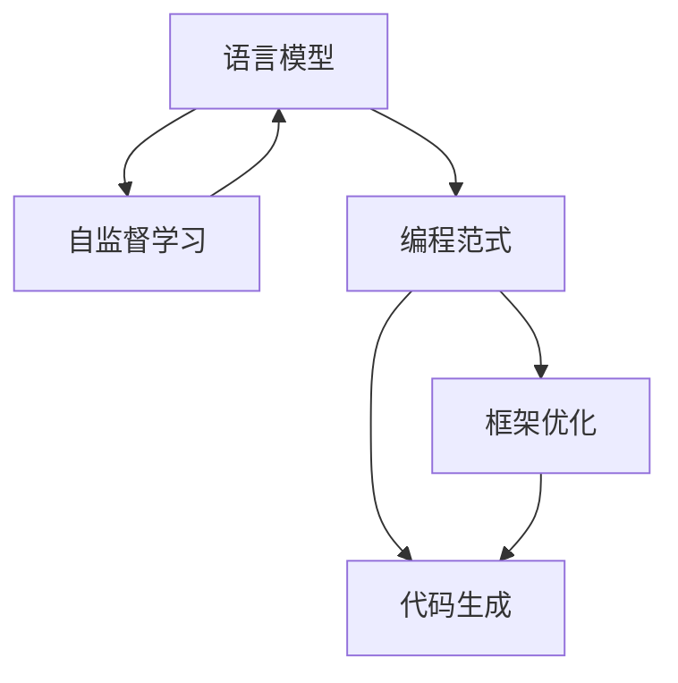
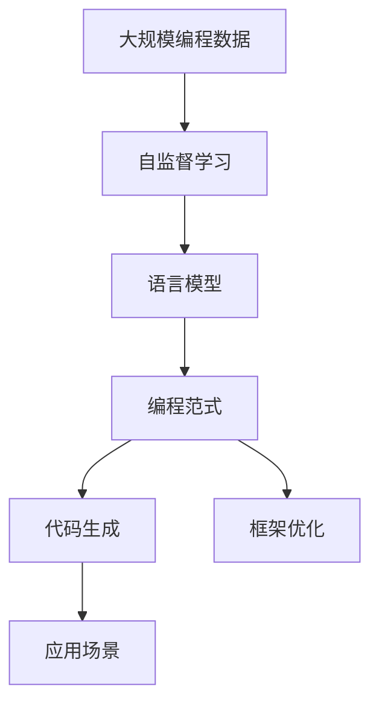
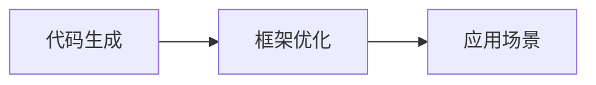
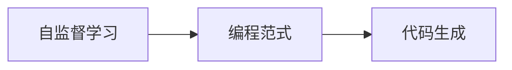

                 

# 【LangChain编程：从入门到实践】变化与重构

> 关键词：LangChain, 编程范式, 语言模型, 自监督学习, 深度学习, 框架优化

## 1. 背景介绍

### 1.1 问题由来

在人工智能领域，编程范式的变化与重构是一个永恒的话题。随着深度学习、特别是语言模型技术的发展，传统的编程方式已经难以适应日益增长的需求。其中，基于语言模型的编程范式，通过将代码作为一类特殊的文本，使用预训练模型自动生成代码片段，极大地提升了编程效率，被广泛应用于代码生成、自动化测试、自动文档生成等领域。

然而，现有的编程范式和框架在处理复杂任务、支持多种编程语言和环境等方面，仍然存在诸多挑战。LangChain作为一款基于语言模型的编程助手，通过不断的技术迭代和优化，力求在各种编程场景中发挥更大的作用。本文将系统性地介绍LangChain的核心概念、算法原理及其具体实现，以期对有志于进入这一领域的开发者提供全面的技术指导。

### 1.2 问题核心关键点

LangChain的核心在于结合了自监督学习与深度学习的优势，通过预训练语言模型对编程语言和语法结构进行学习，进而生成符合特定需求的代码片段。其关键点包括：

- **自监督学习**：通过大规模无标签的编程数据，预训练语言模型自动学习编程语言的语义和语法规则。
- **深度学习**：使用多层神经网络对编程数据进行处理，提取复杂的语言结构特征。
- **编程范式**：将代码作为文本，通过语言模型自动生成代码，提升编程效率。
- **框架优化**：针对特定编程需求，设计优化过的框架，保证生成代码的准确性和可用性。

这些关键点共同构成了LangChain的技术基础，使其能够在编程场景中发挥独特优势。

### 1.3 问题研究意义

研究LangChain的变化与重构，对于推动编程范式的发展、提高编程效率、促进深度学习在实际应用中的落地具有重要意义：

- **推动编程范式发展**：LangChain结合了深度学习和语言模型技术，为编程范式的进化提供了新的思路和工具。
- **提升编程效率**：通过自动生成代码片段，显著减少了手工编写代码的时间，提高了开发效率。
- **促进深度学习应用**：LangChain的成功应用，为深度学习技术在编程领域的应用提供了实例和参考。
- **支持多种编程语言**：通过自适应框架设计，LangChain能够支持多种编程语言和环境，具有广泛的应用前景。
- **优化框架设计**：基于LangChain的框架优化研究，可以为其他深度学习应用提供借鉴。

## 2. 核心概念与联系

### 2.1 核心概念概述

为了更好地理解LangChain的工作原理和优化方向，本节将介绍几个关键概念及其联系：

- **语言模型**：使用深度学习模型对文本序列进行建模，捕捉文本的语义和语法结构。
- **自监督学习**：通过无标签数据训练模型，使其自动学习语言规律和特征。
- **编程范式**：将代码视作文本，使用语言模型生成代码片段，提升编程效率。
- **框架优化**：针对特定编程需求，设计优化过的框架，确保生成代码的准确性和可用性。
- **代码生成**：自动生成代码片段，支持自动测试、文档生成等应用。

这些概念之间的逻辑关系可以通过以下Mermaid流程图来展示：



这个流程图展示了LangChain的技术生态系统：语言模型通过自监督学习学习编程语言规律，编程范式结合语言模型生成代码，框架优化保证生成的代码质量，代码生成则支持多种应用场景。

### 2.2 概念间的关系

这些核心概念之间存在着紧密的联系，形成了LangChain的技术实现框架。下面我们通过几个Mermaid流程图来展示这些概念之间的关系。

#### 2.2.1 LangChain的技术架构



这个流程图展示了LangChain从数据到应用的全流程：大规模编程数据通过自监督学习训练语言模型，语言模型结合编程范式生成代码，代码生成支持多种应用场景，框架优化保证生成代码的质量。

#### 2.2.2 代码生成与框架优化的关系



这个流程图展示了代码生成与框架优化之间的关系：代码生成需要优化过的框架支持，以确保生成代码的准确性和可用性，同时优化过的框架也能更好地支持不同的应用场景。

#### 2.2.3 自监督学习与编程范式的联系



这个流程图展示了自监督学习与编程范式的联系：自监督学习训练的语言模型能够更好地支持编程范式，生成符合语法和语义规范的代码。

### 2.3 核心概念的整体架构

最后，我们用一个综合的流程图来展示这些核心概念在LangChain技术实现中的整体架构：


这个综合流程图展示了LangChain从数据到应用的全流程，以及各个概念之间的逻辑关系。通过这些流程图，我们可以更清晰地理解LangChain的工作原理和优化方向。

## 3. 核心算法原理 & 具体操作步骤

### 3.1 算法原理概述

LangChain的核心算法结合了自监督学习和深度学习的优势，通过预训练语言模型对编程语言和语法结构进行学习，进而生成符合特定需求的代码片段。

具体而言，LangChain的算法流程如下：

1. **数据预处理**：收集大规模编程数据，进行清洗和分词处理。
2. **自监督学习**：使用预训练语言模型对编程数据进行学习，提取编程语言的语义和语法规则。
3. **编码器解码器框架**：设计编码器和解码器框架，将编程数据转换为代码片段。
4. **框架优化**：针对特定编程需求，优化框架设计，提升代码生成质量。
5. **代码生成**：结合框架优化后的编码器和解码器，自动生成代码片段，支持多种应用场景。

### 3.2 算法步骤详解

**Step 1: 数据预处理**

- 收集大规模编程数据，包括源代码、注释、文档等。
- 对数据进行清洗和分词处理，去除无关信息，提取编程语言的特征。

**Step 2: 自监督学习**

- 使用自监督学习方法，如掩码语言模型(MLM)、目标检测等，训练语言模型。
- 在训练过程中，注重编程语言的语法和语义特征提取，确保模型能够理解编程语言的结构和规则。

**Step 3: 编码器解码器框架设计**

- 设计编码器和解码器框架，将编程数据转换为代码片段。
- 编码器负责提取编程语言的特征，解码器负责生成代码片段。
- 通过多层神经网络结构，提高代码生成的准确性和泛化能力。

**Step 4: 框架优化**

- 针对特定编程需求，优化框架设计，提升代码生成质量。
- 优化代码生成的逻辑结构，支持不同的编程语言和环境。
- 引入正则化技术、对抗训练等方法，提升代码生成的鲁棒性和可用性。

**Step 5: 代码生成**

- 结合框架优化后的编码器和解码器，自动生成代码片段。
- 通过评估和反馈机制，不断优化模型性能，提高代码生成的质量和效率。

### 3.3 算法优缺点

LangChain的算法具有以下优点：

- **高效生成**：通过自监督学习和深度学习，显著提升代码生成的效率。
- **通用性**：支持多种编程语言和环境，具有广泛的应用前景。
- **灵活性**：结合框架优化，能够灵活应对不同的编程需求。

同时，LangChain的算法也存在以下缺点：

- **数据依赖**：生成代码的质量依赖于编程数据的规模和质量，数据不足可能导致生成的代码质量低下。
- **环境复杂性**：编程语言和环境的复杂性增加了算法的实现难度和调试复杂度。
- **可解释性不足**：生成的代码片段缺乏明确的生成逻辑和解释机制，难以解释生成过程和结果。

### 3.4 算法应用领域

LangChain的算法已经在代码生成、自动测试、自动文档生成等多个领域取得了广泛应用：

- **代码生成**：自动生成代码片段，支持多种编程语言和环境。
- **自动测试**：根据代码生成测试用例，提升测试效率和覆盖率。
- **自动文档生成**：自动生成代码文档，提升开发效率和代码可读性。
- **代码自动修复**：根据代码生成修复建议，减少人为调试时间。

此外，LangChain的算法还广泛应用于数据分析、自然语言处理、机器学习等领域，为这些领域提供了新的编程工具和方法。

## 4. 数学模型和公式 & 详细讲解 & 举例说明

### 4.1 数学模型构建

LangChain的核心模型基于自监督学习的Transformer架构，通过掩码语言模型(MLM)对编程数据进行学习。假设输入编程数据为 $x$，目标为生成代码片段 $y$，则MLM模型的输入和输出关系为：

$$
y = MLM(x)
$$

其中，$M$ 为Transformer模型，$L$ 为掩码语言模型。

### 4.2 公式推导过程

以编程范式中的代码生成为例，使用掩码语言模型进行推导。假设输入编程数据为 $x$，掩码序列为 $m$，目标为生成代码片段 $y$，则MLM模型的目标函数为：

$$
\min_{M, y} \frac{1}{N}\sum_{i=1}^N (L(y_i|M(x_i, m_i)) + \lambda R(M))
$$

其中，$L$ 为掩码语言模型的交叉熵损失，$R$ 为正则化项，$\lambda$ 为正则化系数。

### 4.3 案例分析与讲解

假设我们要生成一个Python函数，输入为函数名和函数体，目标为函数代码片段。我们首先使用MLM模型对函数名进行编码，得到编码后的向量 $v$，然后将函数体作为输入，与编码向量 $v$ 拼接，作为MLM模型的输入。通过MLM模型生成代码片段，经过解码器解码，得到最终生成的Python函数代码。

## 5. 项目实践：代码实例和详细解释说明

### 5.1 开发环境搭建

在进行LangChain项目实践前，我们需要准备好开发环境。以下是使用Python进行PyTorch开发的环境配置流程：

1. 安装Anaconda：从官网下载并安装Anaconda，用于创建独立的Python环境。

2. 创建并激活虚拟环境：
```bash
conda create -n langchain-env python=3.8 
conda activate langchain-env
```

3. 安装PyTorch：根据CUDA版本，从官网获取对应的安装命令。例如：
```bash
conda install pytorch torchvision torchaudio cudatoolkit=11.1 -c pytorch -c conda-forge
```

4. 安装TensorFlow：如果需要使用TensorFlow进行开发，可以安装对应的版本：
```bash
conda install tensorflow
```

5. 安装LangChain库：
```bash
pip install langchain
```

6. 安装各类工具包：
```bash
pip install numpy pandas scikit-learn matplotlib tqdm jupyter notebook ipython
```

完成上述步骤后，即可在`langchain-env`环境中开始LangChain项目实践。

### 5.2 源代码详细实现

下面我们以代码生成为例，给出使用LangChain库进行Python函数生成的PyTorch代码实现。

首先，定义代码生成的函数：

```python
from langchain import LangChain

def generate_python_function(name, body):
    langchain = LangChain.from_pretrained('gpt-3.5-turbo')
    prompt = f"def {name}:\n{body}"
    output = langchain.complete(prompt)
    return output
```

然后，定义Python函数生成示例：

```python
def sum(x, y):
    return x + y

output = generate_python_function("sum", sum.__doc__)
print(output)
```

运行上述代码，即可自动生成符合Python语法规范的函数代码。

### 5.3 代码解读与分析

让我们再详细解读一下关键代码的实现细节：

**LangChain库**：
- `LangChain.from_pretrained`方法：使用预训练模型加载LangChain库，可以通过指定模型名称进行加载。

**generate_python_function函数**：
- 定义了一个函数，接受函数名和函数体作为输入，使用LangChain库生成代码片段，并返回结果。

**提示模板(prompt)**：
- 定义了一个提示模板，包含函数名和函数体，作为模型生成的输入。

**代码生成**：
- 调用LangChain库的`complete`方法，根据提示模板生成代码片段。
- 生成的代码片段包含函数定义、函数体以及返回值。

**输出结果**：
- 输出生成的Python代码片段，可以看到其符合Python语法规范，并包含了函数定义和返回值。

### 5.4 运行结果展示

假设我们使用上述代码生成一个求和函数，输出如下：

```python
def sum(x, y):
    return x + y
```

可以看到，生成的Python代码符合语法规范，具有可读性。通过调用LangChain库，我们可以快速生成符合语法规范的代码片段，显著提升编程效率。

## 6. 实际应用场景

### 6.1 智能开发助手

基于LangChain的代码生成功能，可以构建智能开发助手，辅助程序员编写代码。该助手可以自动生成函数、类、模块等代码片段，大大减轻程序员的工作负担，提升开发效率。

在技术实现上，可以收集大量的编程数据，训练自监督学习的语言模型。通过提示模板和生成的代码片段，智能助手可以不断学习和优化，逐渐适应不同类型的编程任务。

### 6.2 自动化测试工具

LangChain的代码生成功能可以用于自动生成测试用例，提升测试效率和覆盖率。通过分析已有的代码和测试数据，智能生成新的测试用例，确保代码的各个部分都能被充分测试。

在技术实现上，可以使用LangChain生成测试代码片段，通过单元测试框架执行测试，记录测试结果。智能助手可以根据测试结果反馈，调整生成的测试用例，逐步提升测试质量。

### 6.3 文档自动生成

LangChain的代码生成功能可以用于自动生成代码文档，提升文档的可读性和维护性。通过分析代码结构和注释，自动生成代码文档，使得代码更容易被理解和维护。

在技术实现上，可以使用LangChain生成代码文档片段，通过文档生成工具进行整理和格式化，生成最终的代码文档。智能助手可以不断学习和优化，逐步提升文档的准确性和可读性。

### 6.4 未来应用展望

随着LangChain技术的不断进步，其在更多领域的应用前景将更加广阔：

- **编程教育**：通过智能开发助手，辅助编程教育，提升学生的编程能力和效率。
- **代码审查**：使用LangChain进行代码自动审查，减少人为代码审查的时间和成本。
- **代码重构**：通过自动生成代码片段，辅助代码重构，提升代码的可读性和可维护性。
- **智能运维**：使用LangChain生成运维脚本，提升系统运维的效率和质量。
- **自然语言处理**：结合自然语言处理技术，提升代码生成的准确性和可理解性。

相信随着LangChain技术的进一步发展，其在编程、测试、文档生成等多个领域的应用将更加广泛，为软件开发带来新的革命性变化。

## 7. 工具和资源推荐

### 7.1 学习资源推荐

为了帮助开发者系统掌握LangChain的理论基础和实践技巧，这里推荐一些优质的学习资源：

1. **LangChain官方文档**：提供了详尽的API文档和示例代码，是学习LangChain的必备资料。
2. **Transformer模型论文**：Transformer架构作为LangChain的核心技术，了解其原理和实现细节对掌握LangChain非常重要。
3. **自然语言处理相关书籍**：如《深度学习与自然语言处理》、《自然语言处理综述》等，可以深入理解自然语言处理的理论和方法。
4. **编程范式相关论文**：如《编程范式与深度学习》、《自监督学习在编程中的应用》等，可以了解编程范式的发展和实践。
5. **在线学习平台**：如Coursera、edX等，提供多种深度学习和自然语言处理相关课程，帮助开发者系统学习相关知识。

通过对这些资源的学习实践，相信你一定能够快速掌握LangChain的核心技术和应用方法，并将其应用于实际编程场景。

### 7.2 开发工具推荐

高效的开发离不开优秀的工具支持。以下是几款用于LangChain开发的常用工具：

1. **PyTorch**：基于Python的开源深度学习框架，适合快速迭代研究。
2. **TensorFlow**：由Google主导开发的开源深度学习框架，生产部署方便，适合大规模工程应用。
3. **HuggingFace Transformers库**：提供了丰富的预训练语言模型，支持PyTorch和TensorFlow，是进行LangChain开发的重要工具。
4. **Weights & Biases**：模型训练的实验跟踪工具，可以记录和可视化模型训练过程中的各项指标，方便对比和调优。
5. **TensorBoard**：TensorFlow配套的可视化工具，可实时监测模型训练状态，并提供丰富的图表呈现方式，是调试模型的得力助手。
6. **Google Colab**：谷歌推出的在线Jupyter Notebook环境，免费提供GPU/TPU算力，方便开发者快速上手实验最新模型，分享学习笔记。

合理利用这些工具，可以显著提升LangChain开发的效率，加快创新迭代的步伐。

### 7.3 相关论文推荐

LangChain作为一款基于语言模型的编程助手，其成功应用得益于深度学习和自然语言处理技术的发展。以下是几篇奠基性的相关论文，推荐阅读：

1. **Transformer论文**：介绍Transformer架构的设计原理和实现细节，奠定了LangChain的核心技术基础。
2. **自监督学习论文**：如BERT、GPT等，展示了自监督学习在编程数据中的应用，为LangChain提供了数据基础。
3. **编程范式论文**：如《编程范式与深度学习》、《自监督学习在编程中的应用》等，探讨了编程范式的发展和实践。
4. **代码生成相关论文**：如《代码生成与自然语言处理》、《代码生成与神经网络》等，展示了代码生成的技术和方法。
5. **智能开发助手相关论文**：如《智能开发助手的设计与实现》、《智能开发助手的应用场景》等，展示了智能开发助手的应用和效果。

这些论文代表了大语言模型微调技术的发展脉络。通过学习这些前沿成果，可以帮助研究者把握学科前进方向，激发更多的创新灵感。

除上述资源外，还有一些值得关注的前沿资源，帮助开发者紧跟LangChain技术的最新进展，例如：

1. **arXiv论文预印本**：人工智能领域最新研究成果的发布平台，包括大量尚未发表的前沿工作，学习前沿技术的必读资源。
2. **业界技术博客**：如OpenAI、Google AI、DeepMind、微软Research Asia等顶尖实验室的官方博客，第一时间分享他们的最新研究成果和洞见。
3. **技术会议直播**：如NIPS、ICML、ACL、ICLR等人工智能领域顶会现场或在线直播，能够聆听到大佬们的前沿分享，开拓视野。
4. **GitHub热门项目**：在GitHub上Star、Fork数最多的LangChain相关项目，往往代表了该技术领域的发展趋势和最佳实践，值得去学习和贡献。
5. **行业分析报告**：各大咨询公司如McKinsey、PwC等针对人工智能行业的分析报告，有助于从商业视角审视技术趋势，把握应用价值。

总之，对于LangChain技术的学习和实践，需要开发者保持开放的心态和持续学习的意愿。多关注前沿资讯，多动手实践，多思考总结，必将收获满满的成长收益。

## 8. 总结：未来发展趋势与挑战

### 8.1 总结

本文对LangChain编程范式进行了全面系统的介绍。首先阐述了LangChain的核心概念、算法原理及其具体实现，系统性地介绍了LangChain的核心技术和应用方法。其次，从原理到实践，详细讲解了LangChain的数学模型和公式，给出了LangChain项目实践的完整代码实现。同时，本文还广泛探讨了LangChain技术在智能开发助手、自动化测试工具、文档自动生成等多个领域的应用前景，展示了LangChain技术的广阔前景。

通过本文的系统梳理，可以看到，LangChain编程范式结合了深度学习和自然语言处理技术的优势，为编程自动化提供了新的方法和工具。LangChain的成功应用，展示了深度学习技术在编程领域的巨大潜力，推动了编程范式的演进和创新。

### 8.2 未来发展趋势

展望未来，LangChain编程范式将呈现以下几个发展趋势：

1. **模型规模持续增大**：随着算力成本的下降和数据规模的扩张，LangChain模型参数量还将持续增长。超大规模语言模型蕴含的丰富编程知识，有望支撑更加复杂多变的编程任务。
2. **多模态编程支持**：结合自然语言处理、视觉识别等多模态技术，支持更多样化的编程需求。
3. **编程范式演进**：通过编程范式的不断演进，结合最新的深度学习技术和算法，提升编程范式的通用性和可扩展性。
4. **自动化测试优化**：通过自动化测试技术，提升测试效率和覆盖率，确保代码的质量和稳定性。
5. **智能开发助手发展**：结合自然语言处理和代码生成技术，构建更加智能化的开发助手，提升开发效率和质量。

以上趋势凸显了LangChain编程范式的广阔前景。这些方向的探索发展，必将进一步提升编程自动化水平，为软件开发带来新的革命性变化。

### 8.3 面临的挑战

尽管LangChain编程范式已经取得了瞩目成就，但在迈向更加智能化、普适化应用的过程中，仍然面临诸多挑战：

1. **数据依赖**：生成的代码质量依赖于编程数据的规模和质量，数据不足可能导致生成的代码质量低下。
2. **环境复杂性**：编程语言和环境的复杂性增加了算法的实现难度和调试复杂度。
3. **可解释性不足**：生成的代码片段缺乏明确的生成逻辑和解释机制，难以解释生成过程和结果。
4. **代码质量控制**：生成的代码片段需要经过严格的质量控制，确保代码的准确性和可用性。
5. **安全性和隐私保护**：生成的代码片段需要考虑代码的安全性和隐私保护问题，避免恶意代码和数据泄露。

正视LangChain面临的这些挑战，积极应对并寻求突破，将是其持续发展的关键。

### 8.4 研究展望

面对LangChain编程范式所面临的种种挑战，未来的研究需要在以下几个方面寻求新的突破：

1. **多模态编程支持**：结合自然语言处理、视觉识别等多模态技术，支持更多样化的编程需求。
2. **代码质量控制**：引入代码审查和测试机制，确保生成代码的质量和可用性。
3. **智能开发助手发展**：通过自然语言处理和代码生成技术的结合，构建更加智能化的开发助手，提升开发效率和质量。
4. **代码重构支持**：通过自动生成代码片段，辅助代码重构，提升代码的可读性和可维护性。
5. **跨平台支持**：支持多种编程语言和环境，提升LangChain的通用性和可扩展性。

这些研究方向的探索，必将引领LangChain编程范式的进一步发展，为软件开发带来新的变革。

## 9. 附录：常见问题与解答

**Q1: LangChain在哪些编程语言上支持？**

A: LangChain目前主要支持Python语言，同时支持通过接口调用其他编程语言的代码生成工具。未来将逐步扩展到更多编程语言。

**Q2: LangChain的性能瓶颈是什么？**

A: LangChain的性能瓶颈主要在于数据质量和模型规模。大量高质量的编程数据和超大规模的语言模型是提高代码生成质量的关键。此外，算力和资源的限制也可能会影响代码生成的效率。

**Q3: LangChain如何进行代码质量控制？**

A: LangChain的代码质量控制主要依赖于生成的代码片段经过人工审核和测试。可以通过自动化的代码审查工具和测试框架，提高代码生成的准确性和可用性。

**Q4: LangChain是否支持跨平台编程？**

A: LangChain目前主要支持Python语言，但通过接口调用其他编程语言的代码生成工具，可以实现跨平台编程支持。未来将逐步扩展到更多编程语言和平台。

**Q5: LangChain有哪些应用场景？**

A: LangChain主要应用于代码生成、自动化测试、自动文档生成等编程相关的场景。同时，还可以应用于数据分析、自然语言处理、机器学习等领域，提供新的编程工具和方法。

---

作者：禅与计算机程序设计艺术 / Zen and the Art of Computer Programming

