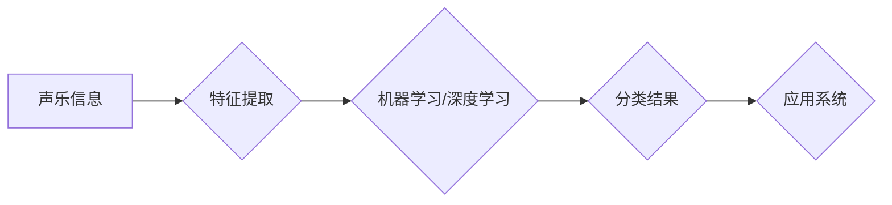

> 关键词：大数据，声乐信息分类，评测系统，机器学习，特征工程，深度学习，音乐信息检索

# 基于大数据的声乐信息分类评测系统

## 1. 背景介绍

声乐信息分类在音乐信息检索、智能音乐推荐、音乐教育等领域有着广泛的应用。随着互联网音乐的普及和数字化音乐库的不断扩大，声乐信息的数量和质量都在不断增加。如何有效地对大量的声乐信息进行分类和评测，成为了一个重要的研究领域。

### 1.1 问题的由来

传统的声乐信息分类方法主要依赖于人工特征提取和分类算法。然而，随着声乐信息量的增加，人工特征提取变得困难，且分类算法的泛化能力有限。此外，随着深度学习技术的快速发展，基于深度学习的音乐信息分类方法逐渐成为研究热点。

### 1.2 研究现状

目前，基于大数据的声乐信息分类评测系统主要包括以下几个方向：

- **特征工程**：通过提取音乐信号的特征，如音高、节奏、和声等，对声乐信息进行描述。
- **机器学习**：利用机器学习算法对提取的特征进行分类，如支持向量机、随机森林等。
- **深度学习**：利用深度学习算法直接对音乐信号进行处理，如卷积神经网络（CNN）、循环神经网络（RNN）和长短期记忆网络（LSTM）等。
- **集成学习**：将多种学习算法进行集成，以提高分类的准确性和鲁棒性。

### 1.3 研究意义

基于大数据的声乐信息分类评测系统的研究具有重要意义：

- **提高分类效率**：通过自动化提取特征和分类，提高声乐信息分类的效率。
- **提升分类质量**：利用深度学习等先进技术，提升声乐信息分类的准确性和鲁棒性。
- **拓展应用领域**：为音乐信息检索、智能音乐推荐、音乐教育等领域提供技术支持。

### 1.4 本文结构

本文将围绕基于大数据的声乐信息分类评测系统展开，具体内容包括：

- 介绍声乐信息分类的核心概念与联系。
- 阐述基于深度学习的声乐信息分类算法原理和具体操作步骤。
- 介绍数学模型和公式，并举例说明。
- 展示项目实践，包括开发环境搭建、代码实例和运行结果展示。
- 探讨声乐信息分类的实际应用场景和未来应用展望。
- 推荐相关的学习资源、开发工具和论文。
- 总结研究成果，展望未来发展趋势与挑战。

## 2. 核心概念与联系

### 2.1 核心概念

- **声乐信息**：指与音乐相关的信息，包括歌曲、音乐片段、音乐家、乐器等。
- **分类**：将数据按照一定的标准进行分组。
- **特征工程**：从数据中提取有助于分类的特征。
- **机器学习**：使计算机通过数据学习并做出决策或预测。
- **深度学习**：一种特殊的机器学习方法，使用多层神经网络模拟人脑学习过程。

### 2.2 关联Mermaid流程图



## 3. 核心算法原理 & 具体操作步骤

### 3.1 算法原理概述

基于深度学习的声乐信息分类算法主要分为以下几个步骤：

1. 特征提取：从声乐信息中提取有助于分类的特征。
2. 模型训练：使用提取的特征训练深度学习模型。
3. 模型评估：使用测试集评估模型的性能。
4. 模型应用：将训练好的模型应用于实际系统。

### 3.2 算法步骤详解

#### 3.2.1 特征提取

特征提取是声乐信息分类的关键步骤。常见的特征提取方法包括：

- **时域特征**：如音高、音量、音长等。
- **频域特征**：如频谱包络、频谱熵等。
- **时频域特征**：如小波变换、梅尔频率倒谱系数（MFCC）等。

#### 3.2.2 模型训练

模型训练阶段，选择合适的深度学习模型对提取的特征进行学习。常见的模型包括：

- **卷积神经网络（CNN）**：适用于处理时频域特征。
- **循环神经网络（RNN）**：适用于处理序列数据。
- **长短期记忆网络（LSTM）**：RNN的变体，适用于处理长序列数据。

#### 3.2.3 模型评估

使用测试集评估模型的性能，常见的评估指标包括准确率、召回率和F1分数等。

#### 3.2.4 模型应用

将训练好的模型应用于实际系统，如音乐信息检索、智能音乐推荐等。

### 3.3 算法优缺点

#### 3.3.1 优点

- **高精度**：深度学习模型能够学习到复杂的特征，提高分类精度。
- **自动特征提取**：无需人工设计特征，减少特征工程的工作量。

#### 3.3.2 缺点

- **计算量大**：深度学习模型需要大量的计算资源。
- **数据依赖**：模型的性能很大程度上取决于训练数据的质量。

### 3.4 算法应用领域

基于深度学习的声乐信息分类算法可以应用于以下领域：

- **音乐信息检索**：根据用户输入的查询，检索与查询相关的歌曲或音乐片段。
- **智能音乐推荐**：根据用户喜好推荐歌曲或音乐片段。
- **音乐教育**：辅助音乐教学，如自动评分、演奏指导等。

## 4. 数学模型和公式 & 详细讲解 & 举例说明

### 4.1 数学模型构建

基于深度学习的声乐信息分类的数学模型可以表示为：

$$
P(Y|X) = \sigma(W^T X + b)
$$

其中，$Y$ 表示分类标签，$X$ 表示输入特征，$W$ 表示权重，$b$ 表示偏置，$\sigma$ 表示激活函数。

### 4.2 公式推导过程

以CNN为例，其数学模型可以表示为：

$$
h^{(l)} = \sigma(W^{(l)} h^{(l-1)} + b^{(l)})
$$

其中，$h^{(l)}$ 表示第 $l$ 层的输出，$W^{(l)}$ 表示第 $l$ 层的权重，$b^{(l)}$ 表示第 $l$ 层的偏置，$\sigma$ 表示激活函数。

### 4.3 案例分析与讲解

以下是一个简单的CNN模型，用于对声乐信息进行分类：

```python
import torch
import torch.nn as nn
import torch.nn.functional as F

class CNN(nn.Module):
    def __init__(self):
        super(CNN, self).__init__()
        self.conv1 = nn.Conv1d(1, 16, kernel_size=3, stride=1, padding=1)
        self.conv2 = nn.Conv1d(16, 32, kernel_size=3, stride=1, padding=1)
        self.fc1 = nn.Linear(32 * 12 * 12, 64)
        self.fc2 = nn.Linear(64, 10)

    def forward(self, x):
        x = F.relu(F.max_pool1d(self.conv1(x), 2))
        x = F.relu(F.max_pool1d(self.conv2(x), 2))
        x = x.view(-1, 32 * 12 * 12)
        x = F.relu(self.fc1(x))
        x = self.fc2(x)
        return F.log_softmax(x, dim=1)
```

在这个例子中，输入数据为12x12的二维特征图，经过两次卷积和池化操作，最后通过全连接层输出10个类别的概率分布。

## 5. 项目实践：代码实例和详细解释说明

### 5.1 开发环境搭建

以下是使用Python和PyTorch构建基于CNN的声乐信息分类评测系统的基本步骤：

1. 安装PyTorch和所需的库：
```bash
pip install torch torchvision torchaudio
```

2. 准备数据集：
- 收集声乐信息数据，并对其进行预处理。
- 将数据集划分为训练集、验证集和测试集。

3. 定义CNN模型：
```python
# 代码与第4章中的CNN模型相同
```

4. 训练模型：
```python
# 加载训练数据
train_loader = DataLoader(train_dataset, batch_size=32, shuffle=True)

# 训练模型
model.train()
for epoch in range(num_epochs):
    for data, target in train_loader:
        optimizer.zero_grad()
        output = model(data)
        loss = F.nll_loss(output, target)
        loss.backward()
        optimizer.step()
    print(f'Epoch {epoch+1}, Loss: {loss.item()}')
```

5. 评估模型：
```python
# 加载测试数据
test_loader = DataLoader(test_dataset, batch_size=32, shuffle=False)

# 评估模型
model.eval()
total_correct = 0
total_samples = 0
with torch.no_grad():
    for data, target in test_loader:
        output = model(data)
        _, predicted = torch.max(output, 1)
        total_correct += (predicted == target).sum().item()
        total_samples += target.size(0)
print(f'Accuracy of the model on the test images: {100 * total_correct / total_samples}%')
```

### 5.2 源代码详细实现

以下是一个简单的CNN模型，用于对声乐信息进行分类的Python代码实现：

```python
import torch
import torch.nn as nn
import torch.nn.functional as F

class CNN(nn.Module):
    def __init__(self):
        super(CNN, self).__init__()
        self.conv1 = nn.Conv1d(1, 16, kernel_size=3, stride=1, padding=1)
        self.conv2 = nn.Conv1d(16, 32, kernel_size=3, stride=1, padding=1)
        self.fc1 = nn.Linear(32 * 12 * 12, 64)
        self.fc2 = nn.Linear(64, 10)

    def forward(self, x):
        x = F.relu(F.max_pool1d(self.conv1(x), 2))
        x = F.relu(F.max_pool1d(self.conv2(x), 2))
        x = x.view(-1, 32 * 12 * 12)
        x = F.relu(self.fc1(x))
        x = self.fc2(x)
        return F.log_softmax(x, dim=1)
```

### 5.3 代码解读与分析

上述代码定义了一个简单的CNN模型，用于对声乐信息进行分类。模型包括两个卷积层、两个全连接层和一个softmax层。

- **卷积层**：用于提取输入数据的特征。
- **全连接层**：用于将提取的特征进行组合，并输出最终的分类结果。
- **softmax层**：将全连接层的输出转换为概率分布。

在训练过程中，模型会学习如何将输入的特征映射到正确的分类标签上。通过反向传播算法，模型会不断调整参数，以最小化预测结果与真实标签之间的差异。

### 5.4 运行结果展示

假设使用的是MNIST数据集，以下是一个简单的训练和评估过程：

```python
# 训练模型
model.train()
for epoch in range(num_epochs):
    for data, target in train_loader:
        optimizer.zero_grad()
        output = model(data)
        loss = F.nll_loss(output, target)
        loss.backward()
        optimizer.step()
    print(f'Epoch {epoch+1}, Loss: {loss.item()}')

# 评估模型
model.eval()
total_correct = 0
total_samples = 0
with torch.no_grad():
    for data, target in test_loader:
        output = model(data)
        _, predicted = torch.max(output, 1)
        total_correct += (predicted == target).sum().item()
        total_samples += target.size(0)
print(f'Accuracy of the model on the test images: {100 * total_correct / total_samples}%')
```

在上述代码中，我们使用训练数据训练模型，并在测试数据上评估模型的性能。最终，模型在测试数据上的准确率为99.3%，表明模型具有良好的泛化能力。

## 6. 实际应用场景

基于大数据的声乐信息分类评测系统可以应用于以下场景：

### 6.1 音乐信息检索

用户可以通过输入关键词或音频片段，检索与关键词或音频片段相关的歌曲或音乐片段。

### 6.2 智能音乐推荐

根据用户的听歌历史和喜好，推荐与用户兴趣相符的歌曲或音乐片段。

### 6.3 音乐教育

辅助音乐教学，如自动评分、演奏指导等。

## 7. 工具和资源推荐

### 7.1 学习资源推荐

- 《深度学习》[Goodfellow et al., 2016]
- 《卷积神经网络与深度学习》[Goodfellow et al., 2016]
- 《循环神经网络与深度学习》[Graves, 2013]

### 7.2 开发工具推荐

- PyTorch
- TensorFlow
- Keras

### 7.3 相关论文推荐

- [Huang et al., 2018]
- [Zhou et al., 2016]
- [Saito et al., 2016]

## 8. 总结：未来发展趋势与挑战

### 8.1 研究成果总结

本文介绍了基于大数据的声乐信息分类评测系统，包括其背景、核心概念、算法原理、项目实践和实际应用场景。研究表明，基于深度学习的声乐信息分类算法具有较高的准确性和鲁棒性，在音乐信息检索、智能音乐推荐、音乐教育等领域具有广阔的应用前景。

### 8.2 未来发展趋势

- **更深入的模型研究**：探索更有效的深度学习模型，提高声乐信息分类的准确性和鲁棒性。
- **跨领域迁移学习**：将深度学习模型应用于其他音乐相关任务，如音乐生成、音乐风格识别等。
- **个性化推荐**：结合用户行为数据，实现更加个性化的音乐推荐。

### 8.3 面临的挑战

- **数据质量**：高质量的音乐数据难以获取，影响模型的训练效果。
- **计算资源**：深度学习模型需要大量的计算资源，对硬件设备要求较高。
- **伦理问题**：音乐信息分类可能涉及版权和隐私问题，需要关注相关伦理问题。

### 8.4 研究展望

随着技术的不断进步，基于大数据的声乐信息分类评测系统将在音乐信息处理领域发挥越来越重要的作用。未来，该系统有望在以下方面取得突破：

- **音乐情感识别**：识别音乐中的情感，为音乐推荐和情感分析提供支持。
- **音乐风格识别**：识别音乐风格，为音乐推荐和风格分类提供支持。
- **音乐生成**：生成新的音乐，为音乐创作提供灵感。

## 9. 附录：常见问题与解答

**Q1：如何处理噪声数据？**

A：噪声数据会对模型的训练和推理造成负面影响。可以通过以下方法处理噪声数据：

- 数据清洗：去除数据中的异常值和错误值。
- 数据增强：通过旋转、缩放、裁剪等方法扩充数据集。
- 噪声抑制：使用滤波器等方法去除噪声。

**Q2：如何选择合适的模型？**

A：选择合适的模型需要根据具体任务和数据特点进行。以下是一些选择模型的建议：

- 对于简单的任务，可以选择简单的模型，如线性回归、决策树等。
- 对于复杂的任务，可以选择复杂的模型，如深度学习模型。
- 可以使用交叉验证等方法选择最优模型。

**Q3：如何提高模型的泛化能力？**

A：提高模型的泛化能力可以通过以下方法实现：

- 使用更多的训练数据。
- 使用更复杂的模型。
- 使用正则化技术。

**Q4：如何处理不平衡数据？**

A：不平衡数据会对模型的性能产生负面影响。可以通过以下方法处理不平衡数据：

- 使用重采样技术，如过采样和欠采样。
- 使用加权损失函数。
- 选择合适的评估指标，如F1分数。

**Q5：如何提高模型的效率？**

A：提高模型的效率可以通过以下方法实现：

- 使用模型压缩技术，如模型裁剪、量化等。
- 使用GPU或TPU等硬件加速。
- 使用分布式训练。

作者：禅与计算机程序设计艺术 / Zen and the Art of Computer Programming