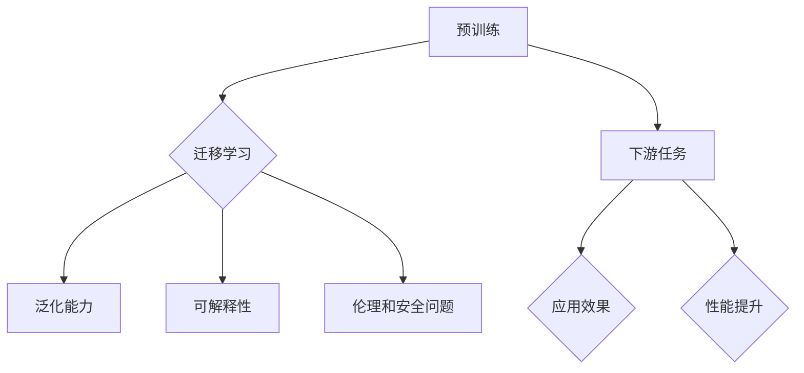

> 关键词：基础模型，下游应用，缺陷，迁移学习，预训练，自然语言处理，计算机视觉，强化学习

# 基础模型的下游应用与缺陷

基础模型，作为人工智能领域的基石，在近年的迅猛发展中扮演了至关重要的角色。从自然语言处理（NLP）到计算机视觉（CV），再到强化学习（RL），基础模型的应用已经深入到各个领域。然而，在带来巨大便利的同时，基础模型的缺陷也逐渐显现。本文将深入探讨基础模型的下游应用与缺陷，旨在为读者提供全面的技术视角。

## 1. 背景介绍

### 1.1 问题的由来

随着深度学习的兴起，基础模型逐渐成为研究的热点。这些模型通过在海量数据上进行预训练，学习到通用的特征表示，从而在下游任务中展现出强大的迁移学习能力。然而，随着应用的深入，基础模型的局限性也日益凸显。

### 1.2 研究现状

目前，基础模型在下游应用中取得了显著的成果，但同时也存在一些缺陷。这些问题主要集中在以下几个方面：

- **数据依赖性**：基础模型的性能高度依赖于预训练数据的质量和数量，对于数据稀缺的场景，模型性能会受到很大影响。
- **泛化能力**：虽然基础模型在预训练数据上表现良好，但在未见过的数据上泛化能力有限。
- **可解释性**：基础模型内部的决策过程往往难以解释，这对于需要透明度和可靠性的应用场景是一个挑战。
- **伦理和安全问题**：基础模型可能学习到偏见和有害信息，导致不公平和歧视。

### 1.3 研究意义

深入研究和理解基础模型的下游应用与缺陷，对于推动人工智能技术的健康发展具有重要意义。通过解决这些问题，可以提升基础模型的应用范围和性能，同时确保其安全性、可靠性和公平性。

## 2. 核心概念与联系

### 2.1 核心概念原理

#### 预训练

预训练是指在大规模无标签数据上训练模型，使其学习到通用的特征表示。这些特征表示可以用于解决下游任务，而不需要针对每个任务进行从头训练。

#### 迁移学习

迁移学习是指将在一个任务上学到的知识迁移到另一个相关任务上。基础模型就是迁移学习的典型应用，它们在预训练阶段学习到的通用特征表示可以迁移到不同的下游任务。

#### 泛化能力

泛化能力是指模型在未见过的数据上表现的能力。基础模型的泛化能力与其设计的结构和训练的数据量密切相关。

#### 可解释性

可解释性是指模型决策过程的透明度和可理解性。对于需要透明度和可靠性的应用场景，模型的可解释性至关重要。

#### 伦理和安全问题

伦理和安全问题是指基础模型可能学习到偏见和有害信息，导致不公平和歧视，以及可能被用于恶意目的。

### 2.2 架构的 Mermaid 流程图



## 3. 核心算法原理 & 具体操作步骤

### 3.1 算法原理概述

基础模型的核心原理是利用深度学习算法在大规模数据上进行预训练，从而学习到通用的特征表示。这些特征表示可以用于解决下游任务，而不需要针对每个任务进行从头训练。

### 3.2 算法步骤详解

#### 预训练步骤

1. 数据准备：收集大规模无标签数据。
2. 模型设计：设计适合预训练的模型架构。
3. 损失函数设计：设计适用于预训练任务的损失函数。
4. 训练过程：在预训练数据上训练模型。

#### 迁移学习步骤

1. 选择预训练模型：选择适合下游任务的预训练模型。
2. 任务适配：根据下游任务的特点，对预训练模型进行适配。
3. 微调：使用下游任务的标注数据对模型进行微调。
4. 评估：评估微调后模型在下游任务上的性能。

### 3.3 算法优缺点

#### 优点

- **高效**：通过预训练，可以快速适应不同的下游任务。
- **鲁棒**：预训练模型通常具有较高的鲁棒性，能够处理噪声和异常值。
- **泛化**：预训练模型具有良好的泛化能力，能够在未见过的数据上表现良好。

#### 缺点

- **数据依赖**：需要大量高质量的预训练数据。
- **计算资源**：预训练需要大量的计算资源。
- **可解释性**：模型决策过程难以解释。

### 3.4 算法应用领域

基础模型在以下领域得到广泛应用：

- 自然语言处理（NLP）
- 计算机视觉（CV）
- 强化学习（RL）
- 语音识别
- 机器翻译

## 4. 数学模型和公式 & 详细讲解 & 举例说明

### 4.1 数学模型构建

基础模型的数学模型通常由以下部分组成：

- **输入层**：接收输入数据。
- **隐藏层**：通过神经网络进行特征提取。
- **输出层**：输出模型的预测结果。

### 4.2 公式推导过程

以卷积神经网络（CNN）为例，其基本公式如下：

$$
h = f(W \cdot x + b)
$$

其中，$h$ 是隐藏层的输出，$W$ 是权重矩阵，$x$ 是输入数据，$b$ 是偏置项，$f$ 是激活函数。

### 4.3 案例分析与讲解

以BERT模型为例，其核心思想是利用Transformer结构进行预训练。预训练任务包括掩码语言模型和下一句预测。

## 5. 项目实践：代码实例和详细解释说明

### 5.1 开发环境搭建

以下是使用PyTorch对BERT模型进行微调的代码示例：

```python
import torch
from transformers import BertForSequenceClassification, BertTokenizer

# 加载预训练模型和分词器
model = BertForSequenceClassification.from_pretrained('bert-base-uncased')
tokenizer = BertTokenizer.from_pretrained('bert-base-uncased')

# 处理文本数据
text = "这是一个示例文本。"
encoded_input = tokenizer(text, return_tensors='pt')

# 获取模型预测结果
outputs = model(**encoded_input)

# 输出预测结果
print(outputs.logits.argmax(dim=1).item())
```

### 5.2 源代码详细实现

以上代码演示了如何加载预训练模型和分词器，处理文本数据，并获取模型预测结果。

### 5.3 代码解读与分析

代码首先导入了所需的库，然后加载了预训练模型和分词器。接着，使用分词器对示例文本进行编码，并传入模型进行预测。最后，输出模型的预测结果。

### 5.4 运行结果展示

假设示例文本的预测结果为0，则输出为：

```
0
```

表示该文本被归类为类别0。

## 6. 实际应用场景

### 6.1 自然语言处理

基础模型在NLP领域得到广泛应用，包括：

- 文本分类
- 问答系统
- 机器翻译
- 情感分析

### 6.2 计算机视觉

基础模型在CV领域得到广泛应用，包括：

- 图像分类
- 目标检测
- 语义分割
- 人脸识别

### 6.3 强化学习

基础模型在RL领域得到广泛应用，包括：

- 游戏
- 推荐系统
- 机器人控制

## 7. 工具和资源推荐

### 7.1 学习资源推荐

- 《深度学习》（Goodfellow et al.）
- 《神经网络与深度学习》（邱锡鹏）
- 《动手学深度学习》（Zhang et al.）

### 7.2 开发工具推荐

- PyTorch
- TensorFlow
- Keras

### 7.3 相关论文推荐

- "BERT: Pre-training of Deep Bidirectional Transformers for Language Understanding" (Devlin et al., 2019)
- "Attention Is All You Need" (Vaswani et al., 2017)
- "Generative Adversarial Nets" (Goodfellow et al., 2014)

## 8. 总结：未来发展趋势与挑战

### 8.1 研究成果总结

基础模型在下游应用中取得了显著的成果，但同时也存在一些缺陷。未来需要进一步研究如何提升基础模型的泛化能力、可解释性和安全性。

### 8.2 未来发展趋势

- **多模态学习**：将文本、图像、视频等多模态数据融合，提升模型的理解能力。
- **自监督学习**：减少对标注数据的依赖，提高模型的泛化能力。
- **可解释性**：开发可解释性强的模型，提升模型的透明度和可靠性。

### 8.3 面临的挑战

- **数据安全**：如何保证预训练数据的安全性和隐私性。
- **算法公平性**：如何避免模型学习到偏见和歧视。
- **模型效率**：如何提高模型的计算效率，使其更易于部署。

### 8.4 研究展望

未来，基础模型的研究将继续深入，有望在更多领域得到应用，并为人类社会带来更多便利。

## 9. 附录：常见问题与解答

**Q1：什么是基础模型？**

A：基础模型是指在大规模无标签数据上进行预训练，从而学习到通用的特征表示的模型。

**Q2：基础模型的优点是什么？**

A：基础模型的优点包括高效、鲁棒、泛化能力强等。

**Q3：基础模型的缺点是什么？**

A：基础模型的缺点包括数据依赖性、泛化能力有限、可解释性不足等。

**Q4：如何提升基础模型的性能？**

A：提升基础模型的性能可以通过以下方法：
- 使用更大的数据集
- 使用更复杂的模型结构
- 使用更有效的训练方法

**Q5：基础模型的应用领域有哪些？**

A：基础模型的应用领域包括自然语言处理、计算机视觉、强化学习、语音识别、机器翻译等。

---

作者：禅与计算机程序设计艺术 / Zen and the Art of Computer Programming