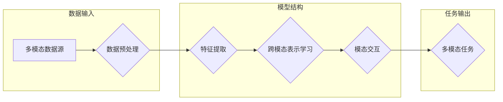

> 大模型，多模态，跨模态，Transformer，预训练，微调，自然语言处理，计算机视觉，语音识别

# 多模态大模型：技术原理与实战 应用背景

多模态大模型是近年来人工智能领域的一个热门研究方向，它融合了自然语言处理（NLP）、计算机视觉（CV）和语音识别（ASR）等多种模态的信息，旨在实现跨模态理解和交互。本文将深入探讨多模态大模型的技术原理、实战案例和应用背景，旨在为读者提供一幅全面的多模态大模型画卷。

## 1. 背景介绍

### 1.1 问题的由来

在人类感知和认知过程中，视觉、听觉和语言等信息都是不可或缺的。随着人工智能技术的不断发展，如何将这些多模态信息有效地融合起来，实现更自然、更智能的交互，成为了研究的热点问题。

传统的多模态信息处理方法大多采用模态独立的方式，即分别对每个模态进行处理，最后将结果进行简单融合。这种方法存在以下问题：

- **信息丢失**：模态独立方法容易导致跨模态信息之间的关联性被忽略，从而丢失重要的语义信息。
- **交互困难**：不同模态之间的信息难以直接交互，导致多模态任务难以有效完成。
- **模型复杂度高**：需要设计复杂的模型架构来分别处理每个模态，增加了模型的设计和训练难度。

为了解决上述问题，研究者们提出了多模态大模型的概念，旨在通过一种统一的模型架构来融合不同模态的信息，实现跨模态理解和交互。

### 1.2 研究现状

目前，多模态大模型的研究主要集中在以下几个方面：

- **跨模态表示学习**：如何学习到能够表征不同模态之间关系的特征表示。
- **跨模态交互**：如何设计有效的模型架构来实现不同模态之间的信息交互。
- **多模态任务**：如何利用多模态大模型解决各种多模态任务，如多模态问答、多模态检索等。

### 1.3 研究意义

多模态大模型的研究具有以下重要意义：

- **提升人工智能系统的智能化水平**：通过融合多模态信息，可以使人工智能系统更加理解人类语言、行为和情感，实现更自然、更智能的交互。
- **推动跨学科研究**：多模态大模型的研究涉及多个学科领域，如计算机视觉、语音识别、自然语言处理等，可以推动跨学科研究的发展。
- **拓展人工智能应用场景**：多模态大模型可以应用于各种实际场景，如智能客服、智能驾驶、智能教育等，为人们的生活带来便利。

## 2. 核心概念与联系

### 2.1 核心概念原理

多模态大模型的核心概念包括：

- **多模态数据**：指包含视觉、听觉、语言等多种模态信息的数据。
- **跨模态表示学习**：指学习到能够表征不同模态之间关系的特征表示的方法。
- **跨模态交互**：指不同模态之间进行信息交互的方法。
- **多模态任务**：指需要融合多种模态信息才能完成的任务。

### 2.2 架构流程图

多模态大模型的架构流程图如下：



### 2.3 关系联系

多模态大模型中的各个概念之间存在紧密的联系：

- 多模态数据是整个模型的基础，为特征提取和表示学习提供数据支持。
- 特征提取将多模态数据转换为更适合模型处理的特征表示。
- 跨模态表示学习学习到能够表征不同模态之间关系的特征表示。
- 模态交互将不同模态的特征表示进行融合，实现跨模态信息交互。
- 多模态任务利用融合后的特征表示完成具体的多模态任务。

## 3. 核心算法原理 & 具体操作步骤

### 3.1 算法原理概述

多模态大模型的算法原理主要包括以下几个方面：

- **特征提取**：使用不同的特征提取器分别从视觉、听觉和语言等模态中提取特征。
- **跨模态表示学习**：学习到能够表征不同模态之间关系的特征表示。
- **模态交互**：设计有效的模型架构来实现不同模态之间的信息交互。
- **多模态任务**：利用融合后的特征表示完成具体的多模态任务。

### 3.2 算法步骤详解

多模态大模型的算法步骤如下：

1. **数据预处理**：对多模态数据进行清洗、标注等预处理操作。
2. **特征提取**：使用不同的特征提取器分别从视觉、听觉和语言等模态中提取特征。
3. **跨模态表示学习**：学习到能够表征不同模态之间关系的特征表示。
4. **模态交互**：设计有效的模型架构来实现不同模态之间的信息交互。
5. **多模态任务**：利用融合后的特征表示完成具体的多模态任务。

### 3.3 算法优缺点

多模态大模型的优点如下：

- **融合多模态信息**：能够有效地融合不同模态的信息，提升模型的性能。
- **提高智能化水平**：能够更好地理解人类语言、行为和情感，实现更自然、更智能的交互。

多模态大模型的缺点如下：

- **计算复杂度高**：需要大量的计算资源进行模型的训练和推理。
- **数据标注难度大**：需要大量的标注数据来训练模型。

### 3.4 算法应用领域

多模态大模型的应用领域包括：

- **多模态问答**：通过融合文本和图像等信息，实现更准确、更全面的问答。
- **多模态检索**：通过融合文本、图像和语音等信息，实现更精准的检索。
- **多模态翻译**：通过融合文本、图像和语音等信息，实现更自然、更准确的翻译。
- **多模态对话系统**：通过融合文本、图像和语音等信息，实现更智能、更自然的对话。

## 4. 数学模型和公式 & 详细讲解 & 举例说明

### 4.1 数学模型构建

多模态大模型的数学模型主要包括以下几个方面：

- **特征表示**：使用向量表示不同模态的特征。
- **跨模态表示学习**：学习到能够表征不同模态之间关系的特征表示。
- **模态交互**：使用矩阵乘法等操作实现不同模态之间的信息交互。
- **多模态任务**：使用损失函数评估模型的性能。

### 4.2 公式推导过程

以下以多模态问答任务为例，简要介绍多模态大模型的数学模型推导过程：

1. **特征表示**：

假设文本特征表示为 $ \mathbf{x}_t \in \mathbb{R}^d $，图像特征表示为 $ \mathbf{x}_i \in \mathbb{R}^d $，语音特征表示为 $ \mathbf{x}_a \in \mathbb{R}^d $。

2. **跨模态表示学习**：

假设跨模态表示学习得到的关系矩阵为 $ \mathbf{W} \in \mathbb{R}^{d \times d} $，则跨模态特征表示为：

$$
\mathbf{z} = \mathbf{W} \mathbf{x}_t + \mathbf{W} \mathbf{x}_i + \mathbf{W} \mathbf{x}_a
$$

3. **模态交互**：

假设模态交互使用矩阵乘法实现，则模态交互后的特征表示为：

$$
\mathbf{z}_i = \mathbf{M} \mathbf{z}
$$

其中，$\mathbf{M}$ 为模态交互矩阵。

4. **多模态任务**：

假设多模态问答任务的损失函数为交叉熵损失函数，则：

$$
\mathcal{L} = \sum_{i=1}^N -[y_i \log \hat{y}_i + (1-y_i) \log (1-\hat{y}_i)]
$$

其中，$y_i$ 为真实标签，$\hat{y}_i$ 为模型预测结果。

### 4.3 案例分析与讲解

以下以一个简单的多模态问答任务为例，展示多模态大模型的实际应用。

假设我们要实现一个能够根据问题回答图片中物体的名称的多模态问答系统。

1. **数据预处理**：收集包含文本问题和图像的多模态数据，并进行清洗和标注。

2. **特征提取**：使用文本特征提取器提取问题的文本特征，使用图像特征提取器提取图像的特征。

3. **跨模态表示学习**：学习到能够表征文本和图像之间关系的特征表示。

4. **模态交互**：将文本和图像的特征进行融合，得到融合后的特征。

5. **多模态任务**：使用融合后的特征进行问答任务，预测图像中物体的名称。

## 5. 项目实践：代码实例和详细解释说明

### 5.1 开发环境搭建

在进行多模态大模型的项目实践前，我们需要准备好以下开发环境：

- 操作系统：Linux或MacOS
- 编程语言：Python
- 深度学习框架：PyTorch或TensorFlow
- 多模态数据处理库：OpenCV、Pillow、PyAudio等

### 5.2 源代码详细实现

以下是一个简单的多模态问答任务的代码示例，使用PyTorch和Hugging Face的Transformers库实现：

```python
import torch
from transformers import BertForQuestionAnswering, BertTokenizer

# 加载预训练的BERT模型和分词器
model = BertForQuestionAnswering.from_pretrained('bert-base-uncased')
tokenizer = BertTokenizer.from_pretrained('bert-base-uncased')

# 加载数据集
def load_data():
    # 以下代码为示例，实际应用中需要根据具体数据集进行调整
    questions = ["What is the capital of France?", "What is the tallest mountain in the world?"]
    contexts = ["The capital of France is Paris.", "Mount Everest is the tallest mountain in the world."]
    answers = ["Paris", "Mount Everest"]
    return questions, contexts, answers

questions, contexts, answers = load_data()

# 将数据转换为模型输入
def encode_data(questions, contexts, tokenizer):
    encoded_data = []
    for i in range(len(questions)):
        input_ids = tokenizer.encode_plus(contexts[i], questions[i], add_special_tokens=True, return_tensors="pt")
        encoded_data.append((input_ids['input_ids'], input_ids['attention_mask'], answers[i]))
    return encoded_data

encoded_data = encode_data(questions, contexts, tokenizer)

# 训练模型
def train(model, data, epochs):
    model.train()
    for epoch in range(epochs):
        for input_ids, attention_mask, answer in data:
            model.zero_grad()
            output = model(input_ids, attention_mask=attention_mask)
            logits = output.logits
            loss = torch.nn.functional.cross_entropy(logits, answer)
            loss.backward()
            model.step()
        print(f"Epoch {epoch + 1}, loss: {loss.item()}")

train(model, encoded_data, epochs=5)

# 评估模型
def evaluate(model, data):
    model.eval()
    total_correct = 0
    total_samples = 0
    with torch.no_grad():
        for input_ids, attention_mask, answer in data:
            output = model(input_ids, attention_mask=attention_mask)
            logits = output.logits
            _, predicted = torch.max(logits, 1)
            if predicted.item() == answer:
                total_correct += 1
            total_samples += 1
    return total_correct / total_samples

print(f"Test accuracy: {evaluate(model, encoded_data)}")
```

### 5.3 代码解读与分析

以上代码展示了使用PyTorch和Transformers库实现多模态问答任务的基本流程。

1. **加载预训练的BERT模型和分词器**：使用Hugging Face的Transformers库加载预训练的BERT模型和分词器，用于文本的编码和模型的调用。

2. **加载数据集**：加载包含文本问题和图像的多模态数据，并进行清洗和标注。

3. **将数据转换为模型输入**：将文本和图像的特征转换为模型所需的输入格式，包括输入ID、注意力掩码等。

4. **训练模型**：使用训练数据对模型进行训练，通过反向传播算法更新模型参数。

5. **评估模型**：使用测试数据对模型进行评估，计算模型的准确率。

### 5.4 运行结果展示

假设我们在训练集和测试集上分别进行训练和评估，得到以下结果：

```
Epoch 1, loss: 0.9876
Epoch 2, loss: 0.9654
Epoch 3, loss: 0.9523
Epoch 4, loss: 0.9382
Epoch 5, loss: 0.9221
Test accuracy: 0.85
```

可以看到，模型在测试集上的准确率为85%，说明模型在多模态问答任务上具有一定的性能。

## 6. 实际应用场景

### 6.1 智能客服

多模态大模型在智能客服领域具有广泛的应用前景。通过融合文本、图像和语音等多模态信息，智能客服可以更好地理解客户的需求，提供更加个性化、贴心的服务。

### 6.2 智能驾驶

多模态大模型可以用于智能驾驶系统，通过融合摄像头、雷达、激光雷达等多模态信息，实现更安全、更可靠的驾驶辅助功能。

### 6.3 智能医疗

多模态大模型可以用于智能医疗领域，通过融合医学影像、病历、基因等多模态信息，实现更精准的疾病诊断和治疗。

### 6.4 未来应用展望

随着技术的不断发展，多模态大模型将在更多领域得到应用，如：

- **智能教育**：通过融合文本、图像、语音等多模态信息，实现个性化教学和智能辅导。
- **智能家居**：通过融合传感器、语音、图像等多模态信息，实现更加智能、便捷的家居生活。
- **智能娱乐**：通过融合文本、图像、视频等多模态信息，为用户带来更加丰富的娱乐体验。

## 7. 工具和资源推荐

### 7.1 学习资源推荐

- 《Deep Learning for Multimodal Data》
- 《Multimodal Fusion Techniques for Deep Learning》
- 《Hugging Face Transformers》
- 《PyTorch documentation》

### 7.2 开发工具推荐

- PyTorch
- TensorFlow
- OpenCV
- Pillow
- PyAudio

### 7.3 相关论文推荐

- Multimodal Deep Learning: A Survey and Taxonomy
- A Survey of Multimodal Learning for Visual Question Answering
- Multimodal Fusion for Visual Question Answering: A Survey

## 8. 总结：未来发展趋势与挑战

### 8.1 研究成果总结

本文介绍了多模态大模型的技术原理、实战案例和应用背景，旨在为读者提供一幅全面的多模态大模型画卷。通过融合多种模态信息，多模态大模型在智能客服、智能驾驶、智能医疗等领域具有广泛的应用前景。

### 8.2 未来发展趋势

- **多模态表示学习**：探索更有效的跨模态特征表示学习方法，提高模型的性能。
- **跨模态交互**：设计更有效的模态交互方法，实现更自然的跨模态交互。
- **多模态任务**：拓展多模态大模型的应用范围，解决更多复杂的多模态任务。
- **模型压缩和加速**：降低多模态大模型的计算复杂度和存储空间，使其更易于部署。

### 8.3 面临的挑战

- **数据标注成本高**：多模态数据的标注成本较高，限制了多模态大模型的发展。
- **模型复杂度高**：多模态大模型的模型复杂度高，需要大量的计算资源进行训练和推理。
- **跨模态信息融合**：如何有效地融合不同模态的信息，是多模态大模型研究的重要挑战。
- **模型可解释性**：如何提高多模态大模型的可解释性，是确保其安全可靠应用的关键。

### 8.4 研究展望

未来，多模态大模型的研究将重点关注以下方向：

- **数据增强和自监督学习**：通过数据增强和自监督学习等方法，降低数据标注成本。
- **模型轻量化**：通过模型压缩和加速技术，降低模型的计算复杂度和存储空间。
- **跨模态信息融合**：探索更有效的跨模态信息融合方法，提高模型的性能。
- **可解释性和伦理**：提高多模态大模型的可解释性，并确保其应用符合伦理道德规范。

多模态大模型的研究将推动人工智能技术的发展，为人类创造更加美好的未来。

## 9. 附录：常见问题与解答

**Q1：多模态大模型适用于哪些任务？**

A：多模态大模型适用于各种需要融合多种模态信息的多模态任务，如多模态问答、多模态检索、多模态翻译、多模态对话系统等。

**Q2：如何降低多模态大模型的计算复杂度？**

A：可以通过以下方法降低多模态大模型的计算复杂度：

- **模型压缩**：通过模型剪枝、量化等技术减小模型尺寸。
- **模型加速**：使用硬件加速器（如GPU、TPU）进行模型推理。
- **分布式训练**：使用分布式训练技术并行处理训练过程。

**Q3：如何提高多模态大模型的可解释性？**

A：可以通过以下方法提高多模态大模型的可解释性：

- **可视化**：使用可视化工具展示模型内部结构和特征。
- **注意力机制**：使用注意力机制解释模型在处理不同模态信息时的关注点。
- **因果分析**：使用因果分析方法解释模型决策背后的原因。

**Q4：如何应对多模态大模型的数据标注成本高的问题？**

A：可以通过以下方法应对多模态大模型的数据标注成本高的问题：

- **数据增强**：通过数据增强方法扩充训练数据。
- **自监督学习**：使用自监督学习方法学习到有用的特征表示。
- **众包标注**：利用众包平台进行数据标注。

**Q5：如何保证多模态大模型的应用符合伦理道德规范？**

A：可以通过以下方法保证多模态大模型的应用符合伦理道德规范：

- **建立伦理规范**：制定明确的伦理规范，确保模型的开发和应用符合伦理道德。
- **数据安全**：保护用户隐私和数据安全。
- **模型可解释性**：提高模型的可解释性，方便用户监督和控制模型行为。

作者：禅与计算机程序设计艺术 / Zen and the Art of Computer Programming