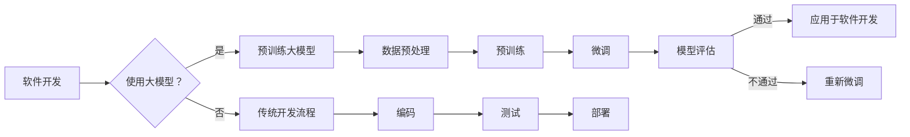

# 大模型在软件开发中的角色

> 关键词：大模型，软件开发，人工智能，机器学习，自动化，效率，可扩展性，代码生成，代码审查

## 1. 背景介绍

随着人工智能和机器学习技术的飞速发展，大模型（Large Models）已经在自然语言处理、计算机视觉等领域取得了显著的成果。近年来，大模型开始逐渐渗透到软件开发领域，为开发者带来了新的机遇和挑战。本文将探讨大模型在软件开发中的角色，分析其原理、应用场景、工具和资源，并展望未来发展趋势。

### 1.1 大模型的兴起

大模型是指具有数十亿到数千亿参数的神经网络模型。它们通过在大量数据上进行预训练，学习到了丰富的知识和模式，能够执行复杂的任务，如语言翻译、图像识别、语音识别等。

### 1.2 大模型在软件开发中的挑战

尽管大模型在许多领域展现出巨大的潜力，但在软件开发中的应用也面临着一些挑战，包括：

- **计算资源需求**：大模型的训练和推理需要大量的计算资源，对硬件设备提出了更高的要求。
- **数据隐私**：大模型的训练过程中需要使用大量的数据，如何保护数据隐私成为一个重要的议题。
- **可解释性**：大模型的决策过程往往缺乏可解释性，这在软件开发中可能引发信任问题。
- **安全性和可靠性**：大模型可能存在偏见和错误，需要确保其在软件开发中的安全性和可靠性。

## 2. 核心概念与联系

### 2.1 核心概念原理

**大模型**：通过在大量数据上进行预训练，学习到丰富的知识和模式，能够执行复杂的任务。

**机器学习**：一种使计算机系统能够从数据中学习并做出决策的技术。

**深度学习**：一种特殊的机器学习方法，使用多层神经网络来学习数据中的复杂模式。

**自然语言处理（NLP）**：使计算机能够理解和生成人类语言的技术。

**代码生成**：使用自然语言描述代码，由机器自动生成代码的技术。

**代码审查**：检查代码质量、安全性和一致性的一系列过程。

### 2.2 架构的 Mermaid 流程图



## 3. 核心算法原理 & 具体操作步骤

### 3.1 算法原理概述

大模型在软件开发中的应用主要基于以下原理：

- **迁移学习**：将预训练模型的知识迁移到软件开发领域。
- **代码生成**：使用自然语言描述代码，由大模型自动生成代码。
- **代码审查**：使用大模型分析代码，提供质量、安全性和一致性方面的反馈。

### 3.2 算法步骤详解

1. **数据预处理**：收集和清洗相关数据，为预训练和微调做准备。
2. **预训练**：在大规模数据集上训练大模型，学习通用的知识。
3. **微调**：在特定领域的数据集上微调大模型，使其更好地适应软件开发任务。
4. **模型评估**：评估微调后模型的性能，确保其满足应用需求。
5. **应用于软件开发**：将大模型应用于软件开发过程，如代码生成、代码审查等。
6. **持续改进**：根据应用反馈，重新微调模型，提高其性能。

### 3.3 算法优缺点

**优点**：

- **提高效率**：自动化代码生成和审查过程，提高开发效率。
- **增强可扩展性**：支持大规模代码库的管理和维护。
- **提高代码质量**：自动检测代码中的错误和潜在问题。

**缺点**：

- **依赖高质量数据**：需要大量的高质量数据进行预训练和微调。
- **模型复杂度高**：大模型的训练和推理需要大量的计算资源。
- **可解释性差**：模型的决策过程难以解释，可能引发信任问题。

### 3.4 算法应用领域

- **代码生成**：自动生成代码框架、单元测试、文档等。
- **代码审查**：自动检测代码中的错误、潜在安全和性能问题。
- **代码搜索**：快速查找类似代码片段或模块。
- **代码重构**：自动重构代码，提高代码质量和可读性。
- **软件推荐**：根据用户需求推荐合适的代码库或组件。

## 4. 数学模型和公式 & 详细讲解 & 举例说明

### 4.1 数学模型构建

大模型的数学模型通常基于深度学习技术，包括多层神经网络、卷积神经网络（CNN）、循环神经网络（RNN）等。

### 4.2 公式推导过程

以下是一个简单的神经网络模型示例：

$$
y = \sigma(W_1 \cdot x + b_1)
$$

其中，$y$ 是模型的输出，$x$ 是输入，$W_1$ 是权重，$b_1$ 是偏置，$\sigma$ 是激活函数。

### 4.3 案例分析与讲解

假设我们使用一个简单的神经网络模型进行图像分类任务。该模型由一个输入层、一个隐藏层和一个输出层组成。输入层接收图像数据，隐藏层提取特征，输出层进行分类。

在训练过程中，我们通过反向传播算法不断更新权重和偏置，使模型在训练数据上的分类准确率逐渐提高。

## 5. 项目实践：代码实例和详细解释说明

### 5.1 开发环境搭建

为了进行大模型在软件开发中的应用实践，我们需要搭建以下开发环境：

- 操作系统：Linux或macOS
- 编程语言：Python
- 深度学习框架：TensorFlow或PyTorch
- 大模型库：Hugging Face Transformers

### 5.2 源代码详细实现

以下是一个使用Hugging Face Transformers库进行代码生成的示例：

```python
from transformers import TextGenerator, pipeline

# 加载预训练语言模型
model = TextGenerator.from_pretrained("gpt2")

# 生成代码
code = model.generate("def add(a, b):
    return a + b", max_length=50)

print(code)
```

### 5.3 代码解读与分析

上述代码使用了Hugging Face Transformers库中的TextGenerator类，加载了一个预训练的语言模型GPT-2，并使用该模型生成了一段简单的Python代码。

### 5.4 运行结果展示

```python
def add(a, b):
    return a + b
```

## 6. 实际应用场景

### 6.1 代码生成

大模型可以用于生成各种类型的代码，如：

- 函数定义
- 类定义
- 数据结构
- 控制结构
- 异常处理

### 6.2 代码审查

大模型可以用于分析代码，识别潜在的错误、安全和性能问题，如：

- 漏洞利用
- 代码重复
- 性能瓶颈
- 安全风险

### 6.3 代码搜索

大模型可以用于搜索类似代码片段或模块，提高开发效率。

### 6.4 代码重构

大模型可以自动重构代码，提高代码质量和可读性。

## 7. 工具和资源推荐

### 7.1 学习资源推荐

- 《深度学习》
- 《动手学深度学习》
- Hugging Face Transformers官方文档

### 7.2 开发工具推荐

- TensorFlow
- PyTorch
- Hugging Face Transformers

### 7.3 相关论文推荐

- "Generative Adversarial Text Networks"
- "BERT: Pre-training of Deep Bidirectional Transformers for Language Understanding"
- "Generative Pre-trained Transformers"

## 8. 总结：未来发展趋势与挑战

### 8.1 研究成果总结

大模型在软件开发中的应用已经取得了一些初步成果，但仍然面临着许多挑战。

### 8.2 未来发展趋势

- 模型轻量化：开发更轻量级的模型，降低计算资源需求。
- 可解释性：提高模型的可解释性，增强用户信任。
- 安全性和可靠性：确保模型在软件开发中的安全性和可靠性。
- 多模态学习：结合多种模态数据进行学习，提高模型的泛化能力。

### 8.3 面临的挑战

- 数据隐私：如何保护数据隐私成为一个重要的议题。
- 计算资源：大模型的训练和推理需要大量的计算资源。
- 可解释性：大模型的决策过程往往缺乏可解释性。
- 安全性和可靠性：大模型可能存在偏见和错误，需要确保其在软件开发中的安全性和可靠性。

### 8.4 研究展望

大模型在软件开发中的应用前景广阔，未来需要进一步研究解决上述挑战，推动大模型在软件开发中的应用。

## 9. 附录：常见问题与解答

**Q1：大模型在软件开发中的应用有哪些优势？**

A1：大模型在软件开发中的应用可以显著提高开发效率、增强可扩展性、提高代码质量，并降低人力成本。

**Q2：大模型在软件开发中可能面临哪些挑战？**

A2：大模型在软件开发中可能面临计算资源需求高、数据隐私、可解释性差、安全性和可靠性等挑战。

**Q3：如何确保大模型在软件开发中的安全性和可靠性？**

A3：确保大模型在软件开发中的安全性和可靠性需要从数据、算法、工程和业务等多个维度进行综合考虑，包括数据隐私保护、算法可解释性、模型测试和监控等。

**Q4：大模型在软件开发中的应用前景如何？**

A4：大模型在软件开发中的应用前景广阔，有望改变软件开发的方式，提高开发效率和质量，并推动软件开发向智能化、自动化方向发展。

---

作者：禅与计算机程序设计艺术 / Zen and the Art of Computer Programming