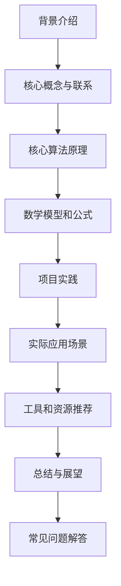

以下是根据您的要求撰写的技术博客文章《AI机器学习计算艺术之道》的正文内容:

# AI 机器学习计算艺术之道

## 1. 背景介绍

### 1.1 问题的由来

在当今数据时代,海量的数据被无时无刻地生成和积累。如何从这些原始数据中发现隐藏的模式、提取有价值的信息并将其转化为可操作的知识,成为了各行业面临的一个重大挑战。传统的人工编码方法已经无法满足处理这些庞大、复杂和多样化数据的需求。因此,人工智能(AI)和机器学习(ML)应运而生,为解决这一难题提供了全新的范式。

### 1.2 研究现状

机器学习是人工智能的一个重要分支,它赋予了计算机在没有明确编程的情况下,通过学习数据并建立数学模型来预测和决策的能力。近年来,随着算力的飞速提升、大数据的不断涌现以及深度学习等新型算法的兴起,机器学习得到了前所未有的发展,在计算机视觉、自然语言处理、推荐系统等诸多领域取得了突破性进展。

### 1.3 研究意义

机器学习的发展不仅推动了人工智能技术的飞跃,也深刻影响着各行各业的运作方式。它为企业带来了提高效率、优化决策、发现新机遇的巨大潜力。同时,机器学习也面临着算法偏差、数据隐私、可解释性等诸多挑战,需要持续的研究和创新来加以解决。因此,深入理解机器学习的本质、原理和实践,对于把握当今科技发展的脉搏,释放数据价值,推动产业变革都具有重要意义。

### 1.4 本文结构

本文将全面深入地探讨机器学习的核心概念、算法原理、数学基础、实践应用等多个层面。旨在为读者提供一个系统性的机器学习知识框架,帮助读者牢固掌握这一领域的理论根基,并能够熟练地将其应用于实际问题中。文章结构安排如下:

## 2. 核心概念与联系

机器学习是一门研究如何构建能够自动学习的算法和系统的科学。它是人工智能的一个重要分支,同时也与其他学科如统计学、优化理论等存在着密切的联系。下面我们来梳理机器学习的一些核心概念:

**监督学习(Supervised Learning)**

监督学习是机器学习中最常见和最成熟的一种范式。它的目标是基于一组标记好的训练数据,学习出一个模型,使之能够对新的未知数据做出准确的预测或判断。常见的监督学习任务包括:

- 分类(Classification): 将输入数据划分到有限的类别中,如垃圾邮件分类、图像识别等。
- 回归(Regression): 基于输入数据预测出一个连续的数值输出,如房价预测、销量预测等。

**无监督学习(Unsupervised Learning)**

与监督学习不同,无监督学习的训练数据是未标记的。算法需要自主发现数据中潜在的模式和结构。常见的无监督学习任务包括:

- 聚类(Clustering): 将相似的数据对象划分到同一个簇,如客户细分、基因聚类等。
- 降维(Dimensionality Reduction): 将高维数据映射到低维空间,以提取主要特征,如可视化、压缩等。

**强化学习(Reinforcement Learning)**

强化学习是一种基于环境交互的学习方式。智能体通过不断尝试,获得环境反馈(奖励或惩罚),并据此调整策略,最终达到最优目标。常见应用如游戏AI、机器人控制等。

**深度学习(Deep Learning)**

深度学习是机器学习的一个新兴热点领域,它基于人工神经网络,通过构建深层次的网络结构对数据进行表征学习和自动特征提取。在计算机视觉、自然语言处理等领域表现出极其出色的性能。

这些核心概念相互关联、相辅相成,共同构成了机器学习的理论体系和技术范畴。掌握它们有助于我们全面认识机器学习,并为后续算法原理和实践应用奠定基础。

## 3. 核心算法原理 & 具体操作步骤

机器学习算法是整个学科的核心和基石。不同的算法原理赋予了机器以不同的学习能力,适用于不同的问题场景。我们将重点介绍几种主流的监督学习和无监督学习算法。

### 3.1 算法原理概述

**线性回归(Linear Regression)**

线性回归是最基础和常用的一种监督学习算法,其目标是找到最佳拟合的线性方程来描述自变量和因变量之间的关系。常用最小二乘法来求解回归系数。

**逻辑回归(Logistic Regression)**

逻辑回归是一种广义线性模型,常用于二分类问题。它通过对数几率(logit)函数将输入映射到(0,1)之间,从而得到事件发生的概率估计值。

**支持向量机(Support Vector Machine)**

支持向量机是一种基于核技巧的有监督学习模型,可用于分类和回归问题。它的基本思想是在高维空间中构建一个超平面,将不同类别的数据分隔得尽可能远,以达到最大边缘的目的。

**决策树(Decision Tree)**

决策树是一种树形结构的监督学习模型,通过顺序地对特征进行判断,将数据划分到不同的叶节点(类别)中。它易于解释,但也容易过拟合。

**K-Means聚类**

K-Means是一种常用的无监督聚类算法。它通过迭代优化的方式将数据划分到K个簇中,使得簇内数据相似度最大化,簇间相似度最小化。

**主成分分析(Principal Component Analysis)**

PCA是一种常用的无监督降维技术。它通过正交变换将原始特征映射到一组相互正交的主成分上,从而达到提取主要信息、降低数据维度的目的。

### 3.2 算法步骤详解

以线性回归为例,我们来看看一个典型的机器学习算法的具体操作步骤:

1. **数据预处理**
   - 缺失值处理
   - 异常值处理
   - 特征缩放(如标准化)

2. **数据集切分**
   - 将数据集分为训练集和测试集(或验证集)

3. **模型训练**
   - 使用训练集数据,通过最小二乘法估计回归系数
   - 构建线性回归方程: $y = \theta_0 + \theta_1x_1 + ... + \theta_nx_n$

4. **模型评估**
   - 在测试集上计算模型的均方根误差等指标
   - 检查模型的过拟合或欠拟合情况

5. **模型调优**
   - 特征选择或构造
   - 正则化(如L1/L2正则)
   - 超参数优化(如梯度下降的学习率)

6. **模型部署**
   - 将训练好的模型应用于实际预测任务

这只是一个简单示例,实际应用中可能会更加复杂,需要根据具体问题和数据特点进行调整和改进。但整体上,大多数机器学习算法都会遵循类似的操作流程。

### 3.3 算法优缺点

每种算法都有其适用场景和局限性,没有放之四海而皆准的"万能算法"。我们来简要分析几种常见算法的优缺点:

- 线性回归
  - 优点:简单,易于理解和实现,可解释性强
  - 缺点:只能学习线性模式,对非线性问题表现欠佳

- 逻辑回归
  - 优点:可直接给出概率输出,常用于分类任务
  - 缺点:对于非线性决策边界,效果不佳

- 支持向量机
  - 优点:有坚实的理论基础,在高维空间中表现良好
  - 缺点:对缺失数据和异常值敏感,可解释性差

- 决策树
  - 优点:可解释性强,无需特征缩放,可处理数值和类别特征
  - 缺点:容易过拟合,对数据扰动敏感

- K-Means聚类
  - 优点:原理简单,计算高效
  - 缺点:需要预先指定聚类数量,对噪声和异常值敏感

- 主成分分析
  - 优点:可有效降低维度,提高计算效率
  - 缺点:可解释性差,丢失了部分原始数据信息

因此,在实际应用中需要根据具体问题特点和数据特征,选择合适的算法或算法组合。同时也要注意算法的优缺点,采取相应的措施来规避其局限性。

### 3.4 算法应用领域

机器学习算法在当今世界得到了广泛的应用,几乎无所不在。下面列举一些典型的应用领域:

- **计算机视觉**: 图像分类、目标检测、人脸识别等
- **自然语言处理**: 机器翻译、文本分类、情感分析等
- **推荐系统**: 个性化推荐、协同过滤等
- **金融**: 信用评分、欺诈检测、风险管理等
- **医疗健康**: 疾病诊断、药物发现、医疗影像分析等
- **制造业**: 预测性维护、质量控制、工艺优化等
- **交通运输**: 自动驾驶、路径规划、交通流量预测等
- **科学计算**: 基因分析、蛋白质结构预测、天体运动模拟等
- **信息安全**: 入侵检测、垃圾邮件过滤、恶意软件检测等

机器学习为各行各业带来了革命性的变革,提高了生产效率、优化了决策过程、创造了新的商业模式和应用场景。未来,随着技术的不断发展,机器学习的应用范围还将进一步扩大。

## 4. 数学模型和公式 & 详细讲解 & 举例说明

机器学习算法的本质是基于数据构建数学模型,从而对现实世界进行有效的描述和预测。因此,理解算法背后的数学基础是非常重要的。我们将以线性回归和逻辑回归为例,深入探讨其数学模型及公式推导过程。

### 4.1 数学模型构建

**线性回归模型**

线性回归试图学习出一个线性方程,使其能够最佳拟合给定的数据点。具体来说,我们有:

$$y = \theta_0 + \theta_1x_1 + ... + \theta_nx_n + \epsilon$$

其中:
- $y$是因变量(标量)
- $x_1, x_2, ..., x_n$是自变量(特征向量)
- $\theta_0, \theta_1, ..., \theta_n$是待求的回归系数(参数)
- $\epsilon$是随机误差项,服从均值为0的正态分布

我们的目标是找到最优参数$\theta$,使得预测值$\hat{y}$与真实值$y$之间的差异最小化。通常采用最小二乘法,将均方误差作为损失函数:

$$J(\theta) = \frac{1}{2m}\sum_{i=1}^m(h_\theta(x^{(i)}) - y^{(i)})^2$$

其中:
- $m$是训练样本数量
- $h_\theta(x) = \theta_0 + \theta_1x_1 + ... + \theta_nx_n$是模型的假设函数

通过优化算法(如梯度下降)来最小化损失函数$J(\theta)$,即可得到最优参数值。

**逻辑回归模型**

逻辑回归用于二分类问题,它的目标是估计给定输入$x$发生某个事件(如患病)的概率$P(y=1|x)$。

我们首先定义一个假设函数:

$$h_\theta(x) = g(\theta^Tx) = \frac{1}{1 + e^{-\theta^