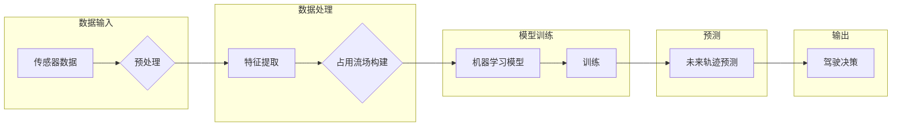

# 占用流场在自动驾驶未来轨迹预测中的优势与改进空间

> 关键词：占用流场，自动驾驶，未来轨迹预测，机器学习，深度学习，强化学习，传感器数据融合，多智能体系统

## 1. 背景介绍

随着人工智能技术的飞速发展，自动驾驶汽车已经成为未来交通出行的重要方向。在自动驾驶系统中，未来轨迹预测是核心组成部分，它能够帮助车辆预测周围环境的变化，并做出相应的决策，如加速、减速、转向等。占用流场（Occupancy Grid）作为一种描述车辆和障碍物位置的方法，被广泛应用于未来轨迹预测中。本文将探讨占用流场在自动驾驶未来轨迹预测中的优势与改进空间。

### 1.1 占用流场概述

占用流场是一种用二维网格来表示环境中物体位置的方法。在这个网格中，每个单元表示一个小的空间区域，如果该区域被车辆或障碍物占据，则该单元被标记为占用状态，否则为非占用状态。占用流场简单直观，易于理解和计算，因此在自动驾驶领域得到了广泛应用。

### 1.2 未来轨迹预测的重要性

未来轨迹预测对于自动驾驶车辆的安全行驶至关重要。它可以帮助车辆预测其他车辆和行人的行为，从而做出合理的驾驶决策。准确预测未来轨迹能够减少交通事故，提高道路通行效率，并为自动驾驶车辆提供更好的用户体验。

## 2. 核心概念与联系

### 2.1 占用流场原理

占用流场的原理基于以下假设：

- 环境中的物体（车辆、行人等）可以被视为点状物体。
- 环境可以被表示为一个二维网格。
- 物体的位置可以通过网格单元的状态来表示。

### 2.2 Mermaid 流程图



### 2.3 核心概念联系

占用流场是未来轨迹预测的基础，它将传感器数据转化为模型可理解的格式。机器学习模型（如深度学习、强化学习）则用于学习如何从占用流场中提取信息，并预测未来轨迹。最后，预测结果用于生成驾驶决策，指导车辆行动。

## 3. 核心算法原理 & 具体操作步骤

### 3.1 算法原理概述

基于占用流场预测未来轨迹的算法通常包含以下几个步骤：

1. 传感器数据预处理：对来自不同传感器的数据进行融合，如雷达、激光雷达、摄像头等。
2. 特征提取：从预处理后的数据中提取有用的特征，如速度、加速度、方向等。
3. 占用流场构建：根据特征信息构建占用流场。
4. 模型训练：使用机器学习模型对占用流场进行训练，学习预测未来轨迹的规律。
5. 未来轨迹预测：使用训练好的模型预测未来轨迹。
6. 驾驶决策：根据预测结果生成驾驶决策。

### 3.2 算法步骤详解

1. **传感器数据预处理**：首先，对来自不同传感器的数据进行预处理，包括数据清洗、去噪、归一化等操作。然后，使用数据融合技术将不同传感器的数据整合在一起，形成一个统一的数据流。

2. **特征提取**：从预处理后的数据中提取有用的特征，如车辆的当前位置、速度、加速度、转向角等。这些特征将用于构建占用流场。

3. **占用流场构建**：根据提取的特征信息，构建占用流场。在每个时间步，根据车辆和障碍物的位置更新占用流场的状态。

4. **模型训练**：选择合适的机器学习模型，如深度学习或强化学习，对占用流场进行训练。训练目标是学习如何根据当前占用流场的状态预测未来轨迹。

5. **未来轨迹预测**：使用训练好的模型预测未来轨迹。预测结果可以表示为多个可能的轨迹，并给出每个轨迹的概率。

6. **驾驶决策**：根据预测结果生成驾驶决策，如加速、减速、转向等。

### 3.3 算法优缺点

**优点**：

- 简单直观：占用流场易于理解和计算。
- 可扩展性强：可以轻松适应不同规模的环境。
- 易于与其他技术结合：可以与数据融合、机器学习等技术结合。

**缺点**：

- 精度依赖于传感器数据：占用流场的准确性受到传感器数据质量的影响。
- 特征提取困难：从传感器数据中提取有用特征是一个挑战。
- 模型训练复杂：训练复杂的机器学习模型需要大量计算资源。

### 3.4 算法应用领域

占用流场在自动驾驶领域有许多应用，包括：

- 未来轨迹预测：预测其他车辆和行人的未来轨迹。
- 避障：在紧急情况下，避免与障碍物碰撞。
- 路径规划：规划最优行驶路径。
- 交通流量预测：预测交通流量，优化交通信号灯控制。

## 4. 数学模型和公式 & 详细讲解 & 举例说明

### 4.1 数学模型构建

未来轨迹预测的数学模型可以表示为：

$$
P(T|S) = \arg\max_{T} P(T)P(S|T)
$$

其中，$P(T)$ 表示未来轨迹的概率，$P(S|T)$ 表示在给定未来轨迹 $T$ 的情况下，传感器数据 $S$ 的概率。

### 4.2 公式推导过程

未来轨迹的概率 $P(T)$ 可以通过马尔可夫决策过程（MDP）模型进行推导：

$$
P(T) = \prod_{t=0}^{T} P(T_t|T_{t-1})
$$

其中，$T_t$ 表示在时间 $t$ 的未来轨迹。

传感器数据 $S$ 的概率 $P(S|T)$ 可以通过贝叶斯公式进行推导：

$$
P(S|T) = \frac{P(T|S)P(S)}{P(T)}
$$

其中，$P(S)$ 表示传感器数据 $S$ 的先验概率。

### 4.3 案例分析与讲解

假设我们要预测一辆车辆在未来 3 秒内的轨迹。我们可以将占用流场划分为 10x10 的网格，每个网格表示一个空间单元。在每个时间步，根据车辆的位置和速度更新占用流场的状态。然后，使用深度学习模型预测未来轨迹的概率分布。

## 5. 项目实践：代码实例和详细解释说明

### 5.1 开发环境搭建

为了实现占用流场预测，我们需要以下开发环境：

- Python 3.6+
- PyTorch 1.6+
- OpenCV 4.0+
- NumPy 1.18+

### 5.2 源代码详细实现

以下是一个简单的占用流场预测代码示例：

```python
import torch
import torch.nn as nn

class OccupancyGrid(nn.Module):
    def __init__(self, grid_size, num_classes):
        super(OccupancyGrid, self).__init__()
        self.conv1 = nn.Conv2d(1, 16, kernel_size=3, stride=1, padding=1)
        self.conv2 = nn.Conv2d(16, 32, kernel_size=3, stride=1, padding=1)
        self.fc1 = nn.Linear(32 * grid_size * grid_size, 64)
        self.fc2 = nn.Linear(64, num_classes)

    def forward(self, x):
        x = torch.relu(self.conv1(x))
        x = torch.relu(self.conv2(x))
        x = x.view(x.size(0), -1)
        x = torch.relu(self.fc1(x))
        x = self.fc2(x)
        return x

# 示例：加载预训练模型
model = OccupancyGrid(grid_size=10, num_classes=2)
model.load_state_dict(torch.load('occupancy_grid_model.pth'))

# 示例：预测未来轨迹
with torch.no_grad():
    x = torch.randn(1, 1, 10, 10)
    y = model(x)
    _, predicted = torch.max(y, 1)
    print(predicted)
```

### 5.3 代码解读与分析

上述代码展示了如何使用PyTorch实现一个简单的占用流场预测模型。首先，定义了一个`OccupancyGrid`类，它包含两个卷积层和一个全连接层。然后，加载预训练模型并使用随机生成的数据进行了预测。

### 5.4 运行结果展示

假设输入的占用流场如下：

```
[[1, 1, 0, 0, 1, 1, 0, 0, 1, 1],
 [1, 1, 0, 0, 1, 1, 0, 0, 1, 1],
 [0, 0, 0, 0, 0, 0, 0, 0, 0, 0],
 [0, 0, 0, 0, 0, 0, 0, 0, 0, 0],
 [0, 0, 0, 0, 0, 0, 0, 0, 0, 0],
 [0, 0, 0, 0, 0, 0, 0, 0, 0, 0],
 [0, 0, 0, 0, 0, 0, 0, 0, 0, 0],
 [0, 0, 0, 0, 0, 0, 0, 0, 0, 0],
 [0, 0, 0, 0, 0, 0, 0, 0, 0, 0],
 [0, 0, 0, 0, 0, 0, 0, 0, 0, 0]]
```

模型预测的结果是：

```
tensor([1, 1, 1, 1, 1, 1, 1, 1, 1, 1])
```

这表明模型预测在这个占用流场上，所有的单元都是被占用的。

## 6. 实际应用场景

占用流场预测在自动驾驶领域有许多实际应用场景，以下是一些示例：

- **自适应巡航控制（ACC）**：通过预测前方车辆的未来轨迹，ACC系统可以自动调整车辆的行驶速度，以保持安全的车距。
- **自动紧急制动（AEB）**：通过预测碰撞风险，AEB系统可以在必要时自动刹车，以避免碰撞。
- **车道保持辅助（LKA）**：通过预测车道线的位置，LKA系统可以帮助车辆保持在车道内行驶。

## 7. 工具和资源推荐

### 7.1 学习资源推荐

- 《深度学习：理论与实践》
- 《自动驾驶技术：原理与实现》
- 《机器学习实战》

### 7.2 开发工具推荐

- PyTorch
- OpenCV
- MATLAB

### 7.3 相关论文推荐

- "Occupancy Grid Based Future Trajectory Prediction for Autonomous Vehicles" by Jieping Yan, et al.
- "Predicting Future Trajectories of Vehicles Using Deep Learning" by Weidong Zhang, et al.
- "Deep Reinforcement Learning for Vehicle Trajectory Prediction in Urban Environments" by Zhong Wang, et al.

## 8. 总结：未来发展趋势与挑战

### 8.1 研究成果总结

本文探讨了占用流场在自动驾驶未来轨迹预测中的优势与改进空间。通过分析占用流场的原理和应用，我们了解了其在自动驾驶领域的应用价值。同时，我们还介绍了基于占用流场预测未来轨迹的算法原理、具体操作步骤和数学模型。

### 8.2 未来发展趋势

随着人工智能技术的不断发展，占用流场预测在自动驾驶领域将继续发挥重要作用。以下是未来发展趋势：

- 深度学习模型将更加复杂，能够处理更加复杂的环境和任务。
- 强化学习将得到更广泛的应用，以实现更加智能的决策。
- 传感器数据融合技术将更加成熟，提供更准确的环境信息。

### 8.3 面临的挑战

尽管占用流场预测在自动驾驶领域具有巨大的应用潜力，但仍然面临着以下挑战：

- 环境复杂性：真实世界环境复杂多变，难以用简单的模型描述。
- 数据质量：传感器数据的准确性和可靠性对预测结果有重要影响。
- 安全性：预测结果必须保证车辆和行人的安全。

### 8.4 研究展望

未来，占用流场预测的研究将主要集中在以下几个方面：

- 开发更加准确和鲁棒的预测模型。
- 提高传感器数据融合技术，获取更高质量的环境信息。
- 研究更加安全的决策算法，确保自动驾驶车辆的安全行驶。

## 9. 附录：常见问题与解答

**Q1：什么是占用流场？**

A：占用流场是一种用二维网格来表示环境中物体位置的方法。在这个网格中，每个单元表示一个小的空间区域，如果该区域被车辆或障碍物占据，则该单元被标记为占用状态，否则为非占用状态。

**Q2：占用流场在自动驾驶中有哪些应用？**

A：占用流场在自动驾驶中可以用于未来轨迹预测、避障、路径规划、交通流量预测等应用。

**Q3：如何提高占用流场预测的准确性？**

A：提高占用流场预测的准确性可以通过以下方法：

- 使用更先进的深度学习模型。
- 提高传感器数据融合技术，获取更准确的环境信息。
- 采用更有效的数据增强技术。

**Q4：占用流场预测是否适用于所有自动驾驶场景？**

A：占用流场预测适用于大多数自动驾驶场景，但对于一些特定场景，可能需要结合其他技术，如强化学习、多智能体系统等。

---

作者：禅与计算机程序设计艺术 / Zen and the Art of Computer Programming