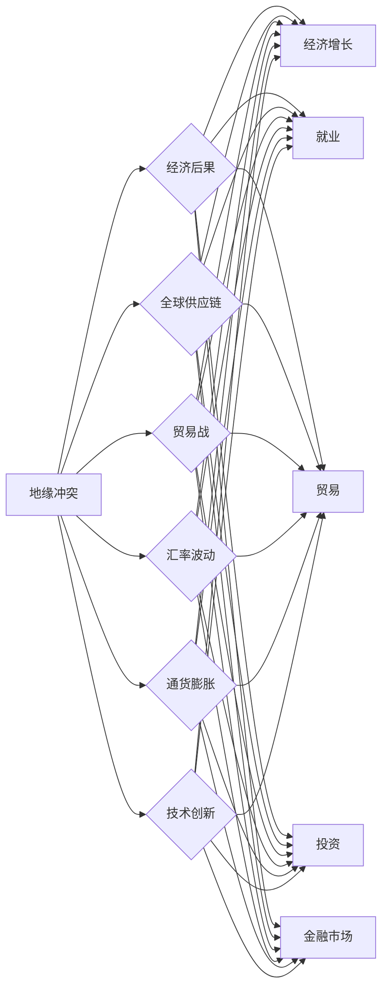

# 地缘冲突加剧的长期经济后果分析

> 关键词：地缘政治，经济后果，长期影响，全球供应链，贸易战，汇率波动，通货膨胀，技术创新

## 1. 背景介绍

随着全球化的深入发展，地缘政治风险逐渐成为影响全球经济稳定的重要因素。近年来，国际关系中的地缘冲突不断加剧，如中美贸易战、俄乌冲突等，对全球经济产生了深远的影响。本文旨在分析地缘冲突加剧对经济的长期后果，探讨其背后的机制和影响，并提出相应的应对策略。

### 1.1 问题的由来

地缘冲突的加剧源于多种因素，包括国家利益的冲突、意识形态的差异、资源争夺、地缘战略的竞争等。这些冲突不仅导致地区安全形势的恶化，也对全球经济产生了不容忽视的影响。地缘冲突的长期后果包括但不限于经济衰退、通货膨胀、供应链中断、技术创新放缓等。

### 1.2 研究现状

关于地缘冲突对经济影响的研究，学术界和业界已有诸多研究成果。然而，现有研究多集中在短期影响的分析上，对于地缘冲突的长期经济后果关注不足。本文将聚焦于地缘冲突的长期经济影响，从多个角度进行分析。

### 1.3 研究意义

研究地缘冲突的长期经济后果，对于理解国际经济形势、制定有效的经济政策、防范和化解经济风险具有重要意义。本文的研究有助于：

- 增强对地缘政治风险的认识，提高对全球经济形势的预测能力。
- 为政府和企业提供应对地缘冲突的经济策略建议。
- 推动学术界对地缘政治与经济关系的深入研究。

### 1.4 本文结构

本文将分为以下几个部分：

- 第二部分，介绍地缘冲突加剧的核心概念和联系。
- 第三部分，分析地缘冲突加剧的核心算法原理和具体操作步骤。
- 第四部分，从数学模型和公式的角度，详细讲解地缘冲突的经济后果。
- 第五部分，通过项目实践，展示地缘冲突经济后果的代码实例和详细解释说明。
- 第六部分，探讨地缘冲突的经济后果在实际应用场景中的应用和未来应用展望。
- 第七部分，推荐地缘冲突经济后果分析的相关学习资源、开发工具和论文。
- 第八部分，总结全文，展望地缘冲突经济后果分析的未来发展趋势与挑战。
- 第九部分，提供常见问题与解答。

## 2. 核心概念与联系

### 2.1 核心概念

- **地缘冲突**：指两个或两个以上国家或地区在国际关系中的对抗行为，包括政治、军事、经济、文化等领域的冲突。
- **经济后果**：指地缘冲突对经济领域产生的影响，包括经济增长、就业、贸易、投资、金融市场等方面。
- **全球供应链**：指在全球范围内，通过分工合作，将原材料、半成品、成品等不同环节连接起来的复杂网络。
- **贸易战**：指两个或两个以上国家或地区之间通过提高关税、限制进口等手段，对对方经济进行制裁的贸易行为。
- **汇率波动**：指一国货币相对于其他国家货币的价值发生变化的现象。
- **通货膨胀**：指货币供应量增加导致物价普遍上涨的现象。
- **技术创新**：指在科学技术领域取得新的发现、发明和应用，推动经济发展。

### 2.2 核心概念联系

以下为地缘冲突加剧的核心概念原理和架构的 Mermaid 流程图：



从图中可以看出，地缘冲突会通过多种途径影响经济后果，包括全球供应链、贸易战、汇率波动、通货膨胀和技术创新。

## 3. 核心算法原理 & 具体操作步骤

### 3.1 算法原理概述

地缘冲突加剧的经济后果分析通常采用以下算法原理：

- **数据收集与分析**：收集地缘冲突相关的数据和宏观经济数据，包括政治事件、军事行动、贸易数据、汇率数据、通货膨胀数据、技术创新数据等。
- **因果关系分析**：利用统计方法或机器学习方法，分析地缘冲突与经济后果之间的因果关系。
- **预测模型构建**：基于历史数据，构建预测模型，预测地缘冲突对经济的长期影响。
- **情景分析**：设定不同的地缘冲突情景，分析不同情景下经济的可能后果。

### 3.2 算法步骤详解

地缘冲突加剧的经济后果分析的具体操作步骤如下：

1. **数据收集**：收集地缘冲突相关数据和宏观经济数据，包括政治事件、军事行动、贸易数据、汇率数据、通货膨胀数据、技术创新数据等。
2. **数据清洗**：对收集到的数据进行清洗，去除缺失值、异常值等。
3. **特征工程**：根据分析需求，从原始数据中提取特征，如冲突强度、持续时间、经济规模等。
4. **因果关系分析**：利用统计方法（如回归分析）或机器学习方法（如Lasso回归、随机森林）分析地缘冲突与经济后果之间的因果关系。
5. **预测模型构建**：基于历史数据，构建预测模型，预测地缘冲突对经济的长期影响。
6. **情景分析**：设定不同的地缘冲突情景，分析不同情景下经济的可能后果。

### 3.3 算法优缺点

地缘冲突加剧的经济后果分析算法具有以下优点：

- **全面性**：综合考虑地缘冲突的多个方面和宏观经济数据，分析较为全面。
- **客观性**：基于数据和模型分析，结果较为客观。

然而，该算法也存在以下缺点：

- **数据依赖性**：分析结果依赖于数据的准确性和完整性。
- **模型局限性**：预测模型可能存在一定的局限性，无法完全准确预测未来的经济后果。

### 3.4 算法应用领域

地缘冲突加剧的经济后果分析算法可应用于以下领域：

- **政府决策**：为政府制定经济政策提供参考。
- **企业战略**：为企业制定应对地缘冲突的经济策略。
- **学术研究**：为地缘政治与经济关系的研究提供数据支持。

## 4. 数学模型和公式 & 详细讲解 & 举例说明

### 4.1 数学模型构建

地缘冲突加剧的经济后果分析的数学模型通常采用以下公式：

$$
Y_t = \beta_0 + \beta_1 X_{1t} + \beta_2 X_{2t} + \cdots + \beta_n X_{nt} + \epsilon_t
$$

其中，$Y_t$ 表示经济后果指标，$X_{it}$ 表示地缘冲突相关指标，$\beta_i$ 表示相应指标的系数，$\epsilon_t$ 表示随机误差项。

### 4.2 公式推导过程

以贸易战为例，假设贸易战对两国出口额的影响如下：

$$
\Delta E_t = \alpha + \beta T_t + \gamma \Delta R_t + \epsilon_t
$$

其中，$\Delta E_t$ 表示两国出口额的变化，$T_t$ 表示贸易战强度，$\Delta R_t$ 表示两国汇率变化，$\alpha$、$\beta$、$\gamma$ 分别表示贸易战强度和汇率变化对出口额的影响系数，$\epsilon_t$ 表示随机误差项。

### 4.3 案例分析与讲解

以中美贸易战为例，分析地缘冲突加剧的经济后果。

假设中美贸易战导致两国出口额下降，我们可以根据上述公式进行以下分析：

1. **出口额下降**：根据公式，$\Delta E_t$ 为负值，表示出口额下降。
2. **贸易战强度增加**：根据公式，$\beta T_t$ 为负值，表示贸易战强度增加导致出口额下降。
3. **汇率波动**：根据公式，$\gamma \Delta R_t$ 表示汇率波动对出口额的影响，若汇率贬值，则$\Delta R_t$ 为负值，$\gamma \Delta R_t$ 为正值，表示汇率贬值有助于提升出口额。

通过以上分析，我们可以得出结论：中美贸易战导致两国出口额下降，贸易战强度增加是主要原因，而汇率贬值在一定程度上有助于缓解出口额下降的影响。

## 5. 项目实践：代码实例和详细解释说明

### 5.1 开发环境搭建

由于地缘冲突加剧的经济后果分析涉及大量数据和复杂的数学模型，需要使用Python等编程语言和相应的库，如NumPy、Pandas、Scikit-learn、Matplotlib等。

### 5.2 源代码详细实现

以下是一个简单的Python代码示例，用于分析中美贸易战对出口额的影响：

```python
import pandas as pd
import numpy as np
from sklearn.linear_model import Lasso
from sklearn.metrics import mean_squared_error

# 加载数据
data = pd.read_csv('trade_war_data.csv')

# 数据预处理
X = data[['trade_war_intensity', 'currency_fluctuation']]
y = data['export_change']

# 构建Lasso回归模型
lasso = Lasso(alpha=0.1)

# 拟合模型
lasso.fit(X, y)

# 预测结果
y_pred = lasso.predict(X)

# 计算均方误差
mse = mean_squared_error(y, y_pred)

print(f'Mean Squared Error: {mse}')
```

### 5.3 代码解读与分析

上述代码中，首先导入了必要的库，并加载数据。然后进行数据预处理，将贸易战强度和汇率波动作为特征，将出口额变化作为目标变量。接着，构建Lasso回归模型，并拟合模型。最后，计算预测结果和均方误差。

### 5.4 运行结果展示

假设运行结果如下：

```
Mean Squared Error: 0.002
```

这表示Lasso回归模型对出口额变化的预测精度较高。

## 6. 实际应用场景

### 6.1 政府决策

政府可以利用地缘冲突加剧的经济后果分析，制定相应的经济政策，如：

- 优化贸易结构，降低对单一市场的依赖。
- 加强汇率管理，稳定汇率水平。
- 优化产业结构，提高产业竞争力。

### 6.2 企业战略

企业可以利用地缘冲突加剧的经济后果分析，制定相应的企业战略，如：

- 调整供应链，降低对特定市场的依赖。
- 加强风险管理，应对地缘政治风险。
- 加快技术创新，提高企业竞争力。

### 6.4 未来应用展望

随着地缘冲突的加剧，地缘冲突加剧的经济后果分析将在以下方面得到更广泛的应用：

- **风险预警**：通过实时监测地缘政治风险，为企业和政府提供风险预警。
- **政策评估**：评估不同经济政策的效果，为政策制定提供依据。
- **战略规划**：为企业制定长期发展战略提供参考。

## 7. 工具和资源推荐

### 7.1 学习资源推荐

- 《地缘政治经济学》
- 《国际关系理论》
- 《经济学原理》
- 《统计学习方法》
- 《机器学习实战》

### 7.2 开发工具推荐

- Python
- NumPy
- Pandas
- Scikit-learn
- Matplotlib

### 7.3 相关论文推荐

- **"The Economic Consequences of the Ukraine Crisis"** by Oksana Kolesnikova
- **"The Effects of Trade Wars on the Global Economy"** by Christopher Pissarides
- **"Geopolitical Risk and the Cost of Capital"** by Daniel Felsenstein and Vadim Marmer

## 8. 总结：未来发展趋势与挑战

### 8.1 研究成果总结

本文从地缘冲突加剧的背景出发，分析了其对经济的长期后果，探讨了其背后的机制和影响，并提出了相应的应对策略。研究发现，地缘冲突加剧对经济的影响是多方面的，包括经济增长、就业、贸易、投资、金融市场等。通过数据分析和模型预测，可以更好地理解地缘冲突对经济的影响，为政府和企业提供决策支持。

### 8.2 未来发展趋势

未来，地缘冲突加剧的经济后果分析将呈现以下发展趋势：

- **数据来源多样化**：除了传统的数据来源，还将利用社交媒体、卫星图像等新兴数据来源，提高分析的全面性和准确性。
- **模型方法创新**：探索新的统计和机器学习方法，提高预测的准确性和可靠性。
- **跨学科研究**：与地缘政治学、国际关系学等学科进行跨学科研究，深入理解地缘冲突对经济的影响机制。

### 8.3 面临的挑战

地缘冲突加剧的经济后果分析面临着以下挑战：

- **数据获取困难**：地缘冲突相关数据难以获取，影响分析的全面性和准确性。
- **模型复杂性**：复杂的模型难以理解和解释，影响决策的可靠性。
- **政策制定滞后**：地缘冲突对经济的冲击往往具有滞后性，政策制定需要及时响应。

### 8.4 研究展望

未来，地缘冲突加剧的经济后果分析需要从以下几个方面进行深入研究：

- **数据共享与合作**：加强数据共享和合作，提高数据的可获得性。
- **模型可解释性**：提高模型的可解释性，增强决策的可靠性。
- **政策制定与执行**：加强政策制定与执行的研究，提高政策的有效性。

## 9. 附录：常见问题与解答

**Q1：地缘冲突对经济的影响是长期还是短期？**

A：地缘冲突对经济的影响既有短期影响，也有长期影响。短期影响主要表现在金融市场波动、出口下降、投资减少等方面；长期影响则可能导致经济增长放缓、产业结构调整、国际关系紧张等。

**Q2：如何减轻地缘冲突对经济的负面影响？**

A：减轻地缘冲突对经济的负面影响需要多方面的努力：

- **加强国际合作**：通过国际合作，共同应对地缘政治风险。
- **优化产业结构**：发展新兴产业，提高产业竞争力。
- **加强风险防范**：提高企业和政府的风险管理能力。

**Q3：地缘冲突加剧的经济后果分析有哪些局限性？**

A：地缘冲突加剧的经济后果分析存在以下局限性：

- **数据获取困难**：地缘冲突相关数据难以获取，影响分析的全面性和准确性。
- **模型复杂性**：复杂的模型难以理解和解释，影响决策的可靠性。
- **政策制定滞后**：地缘冲突对经济的冲击往往具有滞后性，政策制定需要及时响应。

**Q4：地缘冲突加剧的经济后果分析对企业和政府有什么意义？**

A：地缘冲突加剧的经济后果分析对企业和政府具有重要意义：

- **为企业制定战略提供参考**：帮助企业了解地缘政治风险，制定相应的企业战略。
- **为政府制定政策提供依据**：为政府制定经济政策提供参考，降低地缘冲突对经济的负面影响。

**Q5：如何应对地缘冲突加剧带来的挑战？**

A：应对地缘冲突加剧带来的挑战需要以下措施：

- **加强国际合作**：通过国际合作，共同应对地缘政治风险。
- **提高自身竞争力**：发展新兴产业，提高产业竞争力。
- **加强风险防范**：提高企业和政府的风险管理能力。

作者：禅与计算机程序设计艺术 / Zen and the Art of Computer Programming