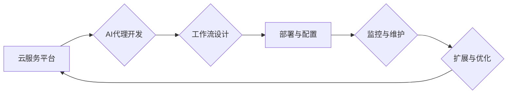

# 基于云服务的AI代理工作流部署策略

> 关键词：云服务，AI代理，工作流，部署策略，可扩展性，弹性，安全性，自动化

## 1. 背景介绍

随着人工智能技术的飞速发展，AI代理（Artificial Intelligence Agent）作为一种能够自主执行任务、与环境交互的软件实体，开始在各个行业中发挥重要作用。AI代理工作流则是一种将AI代理与其他系统和服务集成起来，实现复杂业务流程的解决方案。而云服务作为现代IT基础设施的重要组成部分，为AI代理工作流的部署提供了强大的支撑。本文将探讨基于云服务的AI代理工作流部署策略，分析其核心概念、原理、操作步骤以及实际应用场景。

## 2. 核心概念与联系

### 2.1 AI代理

AI代理是一种具有自主决策能力的软件实体，它能够接收输入、处理信息、生成输出并执行相应的动作。AI代理的核心特征包括：

- **自主性**：AI代理能够独立执行任务，无需人类干预。
- **反应性**：AI代理能够实时响应用户或环境的变化。
- **适应性**：AI代理能够根据环境和任务需求调整其行为。

### 2.2 工作流

工作流是一种定义明确的业务流程，它将多个任务和活动按照一定的顺序和依赖关系组织起来。工作流的关键组成部分包括：

- **任务**：工作流中的单个操作或活动。
- **流程**：任务的执行顺序和依赖关系。
- **参与者**：执行工作流的实体，如AI代理、人类用户等。

### 2.3 云服务

云服务是指通过互联网提供的一系列IT服务，包括基础设施即服务（IaaS）、平台即服务（PaaS）和软件即服务（SaaS）。云服务为AI代理工作流的部署提供了以下优势：

- **可扩展性**：云服务可以轻松扩展以满足不同的计算需求。
- **弹性**：云服务能够根据需求自动调整资源分配。
- **灵活性**：云服务支持多种编程语言和开发工具。

### 2.4 Mermaid 流程图

以下是基于云服务的AI代理工作流部署策略的Mermaid流程图：



## 3. 核心算法原理 & 具体操作步骤

### 3.1 算法原理概述

基于云服务的AI代理工作流部署策略主要包括以下几个步骤：

1. **AI代理开发**：根据业务需求开发AI代理，使其能够完成特定的任务。
2. **工作流设计**：设计工作流，定义任务的执行顺序和依赖关系。
3. **部署与配置**：将AI代理和工作流部署到云服务平台，配置相关资源。
4. **监控与维护**：监控AI代理和工作流的运行状态，进行必要的维护和优化。
5. **扩展与优化**：根据实际运行情况，对AI代理和工作流进行扩展和优化。

### 3.2 算法步骤详解

#### 3.2.1 AI代理开发

- 选择合适的AI代理开发框架，如RPA（Robotic Process Automation）、Chatbot等。
- 根据业务需求，开发AI代理的功能和接口。
- 进行单元测试和集成测试，确保AI代理的质量。

#### 3.2.2 工作流设计

- 使用工作流设计工具，如Microsoft Visio、Yworks yEd Graph Editor等。
- 定义工作流的起点和终点，以及中间的任务节点。
- 设置任务的执行顺序和依赖关系。
- 设计异常处理流程和监控机制。

#### 3.2.3 部署与配置

- 选择合适的云服务平台，如AWS、Azure、Google Cloud等。
- 在云服务平台上创建虚拟机或容器，部署AI代理。
- 配置网络、存储等资源，确保AI代理能够正常工作。
- 将工作流部署到云服务平台，并配置相应的执行环境。

#### 3.2.4 监控与维护

- 使用云服务平台的监控工具，如AWS CloudWatch、Azure Monitor等。
- 监控AI代理和工作流的运行状态，包括CPU、内存、网络等指标。
- 根据监控数据，进行故障排除和性能优化。
- 定期更新AI代理和工作流，修复已知问题和添加新功能。

#### 3.2.5 扩展与优化

- 根据业务需求，对AI代理和工作流进行扩展。
- 使用云服务平台的自动化工具，如AWS Lambda、Azure Functions等。
- 优化AI代理和工作流，提高其性能和可靠性。

### 3.3 算法优缺点

#### 3.3.1 优点

- **可扩展性**：云服务可以轻松扩展以满足不同的计算需求。
- **弹性**：云服务能够根据需求自动调整资源分配。
- **灵活性**：云服务支持多种编程语言和开发工具。
- **安全性**：云服务提供了一系列安全措施，如防火墙、加密等。

#### 3.3.2 缺点

- **依赖云服务提供商**：AI代理和工作流的运行依赖于云服务提供商，可能受到其政策和服务中断的影响。
- **成本**：云服务可能产生较高的成本，特别是对于大规模部署。

## 4. 数学模型和公式 & 详细讲解 & 举例说明

### 4.1 数学模型构建

在本节中，我们将使用数学模型来分析基于云服务的AI代理工作流的性能。假设AI代理工作流包含 $N$ 个任务，每个任务的执行时间服从指数分布，参数为 $\lambda$。则整个工作流的平均执行时间 $T$ 可以表示为：

$$
T = \sum_{i=1}^N \frac{1}{\lambda_i}
$$

其中 $\lambda_i$ 表示第 $i$ 个任务的平均执行时间。

### 4.2 公式推导过程

假设第 $i$ 个任务的执行时间 $T_i$ 服从指数分布，即 $T_i \sim \text{Exp}(\lambda_i)$。则第 $i$ 个任务的概率密度函数为：

$$
f_{T_i}(t) = \lambda_i e^{-\lambda_i t}, \quad t \geq 0
$$

则第 $i$ 个任务的期望值为：

$$
E(T_i) = \int_0^\infty t f_{T_i}(t) dt = \frac{1}{\lambda_i}
$$

因此，整个工作流的平均执行时间为：

$$
T = \sum_{i=1}^N \frac{1}{\lambda_i}
$$

### 4.3 案例分析与讲解

假设一个AI代理工作流包含3个任务，每个任务的平均执行时间分别为 $1s$、$2s$ 和 $3s$。则该工作流的平均执行时间为：

$$
T = \frac{1}{1} + \frac{1}{2} + \frac{1}{3} = 2.333s
$$

这表明，该工作流的平均执行时间大约为2.333秒。

## 5. 项目实践：代码实例和详细解释说明

### 5.1 开发环境搭建

以下是在Python环境中使用AWS Lambda和Amazon API Gateway搭建AI代理工作流的示例：

1. 安装AWS CLI工具：
```bash
pip install awscli
```

2. 登录AWS账号：
```bash
aws configure
```

3. 创建AWS Lambda函数：
```bash
aws lambda create-function --function-name my_lambda_function --zip-file fileb://function.zip --handler lambda_function.lambda_handler --runtime python3.8 --role arn:aws:iam::123456789012:role/lambda_execution_role
```

4. 创建Amazon API Gateway：
```bash
aws apigateway create-rest-api --name MyAPI
```

5. 添加Lambda函数到API Gateway：
```bash
aws apigateway create-deployment --rest-api-id <API_ID> --stage-name prod --cli-binary-name python3.8 --body 'file://template.json'
```

### 5.2 源代码详细实现

以下是一个简单的AWS Lambda函数，用于处理HTTP请求：

```python
import json
import logging

def lambda_handler(event, context):
    logging.info('Received event: %s', event)
    response = {
        'statusCode': 200,
        'body': json.dumps({'message': 'Hello, world!'})
    }
    return response
```

### 5.3 代码解读与分析

该Lambda函数是一个简单的HTTP处理函数，它接收HTTP请求并返回一个包含问候信息的JSON响应。

### 5.4 运行结果展示

在API Gateway中创建一个API后，可以使用以下URL访问Lambda函数：

```
https://<API_ID>.execute-api.<region>.amazonaws.com/prod/
```

在浏览器或Postman中发送GET请求，即可得到以下响应：

```json
{
    "message": "Hello, world!"
}
```

## 6. 实际应用场景

基于云服务的AI代理工作流在以下场景中具有广泛的应用：

- **客户服务**：通过Chatbot自动回答客户问题，提高客户服务效率。
- **供应链管理**：自动化处理订单、库存、物流等流程，降低运营成本。
- **金融服务**：自动化处理贷款申请、风险管理等流程，提高金融服务效率。
- **医疗保健**：自动化处理患者数据、预约挂号等流程，提高医疗资源利用率。

## 7. 工具和资源推荐

### 7.1 学习资源推荐

- 《云计算：概念、技术和实践》
- 《深度学习与人工智能》
- AWS官方文档
- Azure官方文档
- Google Cloud官方文档

### 7.2 开发工具推荐

- AWS CLI
- Azure CLI
- Google Cloud CLI
- Python
- Java
- Node.js

### 7.3 相关论文推荐

- "Cloud Computing: The Next Generation of IT" by David Chappell
- "Deep Learning: A Comprehensive Introduction" by Ian Goodfellow, Yoshua Bengio, and Aaron Courville
- "The Art of Multiprocessor Programming" by Maurice Herlihy and Nir Shavit

## 8. 总结：未来发展趋势与挑战

### 8.1 研究成果总结

本文介绍了基于云服务的AI代理工作流部署策略，分析了其核心概念、原理、操作步骤以及实际应用场景。通过数学模型和公式，我们分析了AI代理工作流的性能，并给出了一个简单的代码示例。

### 8.2 未来发展趋势

未来，基于云服务的AI代理工作流将朝着以下几个方向发展：

- **自动化程度更高**：AI代理工作流将更加自动化，减少人工干预，提高工作效率。
- **智能化程度更高**：AI代理将具备更强的学习和推理能力，能够处理更复杂的任务。
- **集成度更高**：AI代理工作流将与更多系统和平台集成，实现跨领域的协同工作。

### 8.3 面临的挑战

基于云服务的AI代理工作流在发展过程中也面临着以下挑战：

- **数据安全和隐私**：如何确保AI代理工作流处理的数据安全和隐私是一个重要挑战。
- **模型可解释性**：如何提高AI代理工作流的模型可解释性，使其决策过程更加透明。
- **技术成熟度**：AI代理工作流的技术成熟度还有待提高，需要不断优化和完善。

### 8.4 研究展望

未来，基于云服务的AI代理工作流将在以下方面进行深入研究：

- **安全性和隐私保护**：研究更安全的AI代理工作流设计方法，确保数据安全和隐私。
- **模型可解释性**：研究提高AI代理工作流模型可解释性的方法，使其决策过程更加透明。
- **跨领域应用**：研究AI代理工作流在更多领域的应用，推动人工智能技术的普及和应用。

## 9. 附录：常见问题与解答

**Q1：什么是AI代理？**

A1：AI代理是一种具有自主决策能力的软件实体，它能够接收输入、处理信息、生成输出并执行相应的动作。

**Q2：什么是工作流？**

A2：工作流是一种定义明确的业务流程，它将多个任务和活动按照一定的顺序和依赖关系组织起来。

**Q3：什么是云服务？**

A3：云服务是指通过互联网提供的一系列IT服务，包括基础设施即服务（IaaS）、平台即服务（PaaS）和软件即服务（SaaS）。

**Q4：基于云服务的AI代理工作流有哪些优势？**

A4：基于云服务的AI代理工作流具有可扩展性、弹性、灵活性、安全性等优势。

**Q5：如何部署基于云服务的AI代理工作流？**

A5：部署基于云服务的AI代理工作流主要包括以下步骤：AI代理开发、工作流设计、部署与配置、监控与维护、扩展与优化。

**Q6：基于云服务的AI代理工作流有哪些挑战？**

A6：基于云服务的AI代理工作流面临的挑战包括数据安全和隐私、模型可解释性、技术成熟度等。

**Q7：基于云服务的AI代理工作流有哪些应用场景？**

A7：基于云服务的AI代理工作流在客户服务、供应链管理、金融服务、医疗保健等领域具有广泛的应用。

---

作者：禅与计算机程序设计艺术 / Zen and the Art of Computer Programming