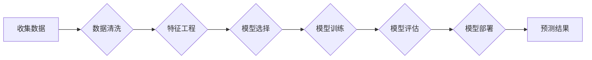

# 电信运营商客户流失分析与预测

> 关键词：客户流失预测，电信行业，机器学习，数据挖掘，预测模型，特征工程，分类算法

## 1. 背景介绍

在电信运营商行业中，客户流失是一个普遍存在的问题，它不仅导致了收入的减少，还可能影响公司的品牌形象和市场份额。因此，准确预测客户流失，采取相应的措施减少客户流失，对于电信运营商来说至关重要。本文将探讨电信运营商客户流失分析与预测的方法，旨在帮助运营商识别潜在流失客户，并采取有效的策略来提高客户保留率。

### 1.1 问题的由来

随着市场竞争的加剧，电信运营商面临着越来越多的客户流失挑战。以下是一些导致客户流失的主要原因：

- 竞争对手的低价策略
- 客户体验不佳
- 服务质量下降
- 客户需求变化
- 客户忠诚度不高

### 1.2 研究现状

客户流失预测是数据挖掘和机器学习领域的经典应用。研究者们提出了多种方法来分析客户流失，包括统计模型、决策树、神经网络和集成学习等。近年来，随着大数据和人工智能技术的发展，深度学习模型在客户流失预测中逐渐崭露头角，展现出强大的预测能力。

### 1.3 研究意义

通过客户流失分析与预测，电信运营商可以实现以下目标：

- 识别高风险客户群体
- 采取针对性措施减少客户流失
- 提高客户满意度和忠诚度
- 优化市场营销策略
- 增加收入和市场份额

### 1.4 本文结构

本文将按照以下结构进行阐述：

- 第2部分介绍客户流失分析与预测的核心概念与联系。
- 第3部分阐述核心算法原理和具体操作步骤。
- 第4部分讲解数学模型和公式，并举例说明。
- 第5部分通过项目实践展示代码实例和详细解释。
- 第6部分探讨实际应用场景和未来应用展望。
- 第7部分推荐相关工具和资源。
- 第8部分总结研究成果，展望未来发展趋势与挑战。
- 第9部分提供常见问题与解答。

## 2. 核心概念与联系

### 2.1 客户流失

客户流失是指客户停止使用某项服务或产品，转向竞争对手。在电信行业中，客户流失通常表现为以下几种情况：

- 转网：客户从一家电信运营商转向另一家。
- 挂号停机：客户将手机号码挂失，但未办理携号转网。
- 退订服务：客户取消订阅或停止使用某些电信服务。

### 2.2 客户流失预测

客户流失预测是指使用历史数据来预测客户在未来一段时间内流失的可能性。预测结果可以帮助运营商采取预防措施，减少客户流失。

### 2.3 Mermaid 流程图

以下是一个Mermaid流程图，展示了客户流失预测的基本流程：



### 2.4 核心概念联系

在客户流失预测中，数据清洗、特征工程、模型选择、模型训练、模型评估和模型部署是相互关联的关键步骤。

## 3. 核心算法原理 & 具体操作步骤

### 3.1 算法原理概述

客户流失预测通常采用分类算法，如决策树、随机森林、梯度提升树、逻辑回归和神经网络等。这些算法通过学习历史客户数据中的特征和标签之间的关系，来预测客户流失的可能性。

### 3.2 算法步骤详解

#### 3.2.1 数据收集

收集客户数据，包括客户基本信息、服务使用情况、消费行为、客户满意度调查结果等。

#### 3.2.2 数据清洗

清洗数据，包括处理缺失值、异常值和重复数据。

#### 3.2.3 特征工程

构建特征，包括数值特征、类别特征和文本特征。特征工程是提高模型预测准确性的关键步骤。

#### 3.2.4 模型选择

选择合适的分类算法，如逻辑回归、决策树、随机森林等。

#### 3.2.5 模型训练

使用历史数据训练模型，调整模型参数。

#### 3.2.6 模型评估

使用验证集或测试集评估模型的预测性能。

#### 3.2.7 模型部署

将训练好的模型部署到生产环境中，进行实时预测。

### 3.3 算法优缺点

#### 3.3.1 优点

- 算法成熟，应用广泛。
- 可以处理高维数据。
- 可解释性强。

#### 3.3.2 缺点

- 特征工程需要大量专业知识。
- 模型训练时间较长。
- 对异常值和噪声敏感。

### 3.4 算法应用领域

客户流失预测算法广泛应用于电信、金融、零售、保险等行业，用于预测客户流失，提高客户满意度，增加收入和市场份额。

## 4. 数学模型和公式 & 详细讲解 & 举例说明

### 4.1 数学模型构建

客户流失预测的数学模型通常是基于分类算法的，以下以逻辑回归为例进行说明。

$$
\hat{y} = \sigma(w_0 + w_1x_1 + w_2x_2 + \ldots + w_nx_n)
$$

其中，$\hat{y}$ 是预测的流失概率，$\sigma$ 是sigmoid函数，$w_0$ 是截距，$w_1, w_2, \ldots, w_n$ 是模型参数，$x_1, x_2, \ldots, x_n$ 是特征向量。

### 4.2 公式推导过程

逻辑回归模型的损失函数通常使用交叉熵损失函数：

$$
L(\theta) = -\frac{1}{N} \sum_{i=1}^N [y_i \log(\hat{y}_i) + (1 - y_i) \log(1 - \hat{y}_i)]
$$

其中，$y_i$ 是真实标签，$\hat{y}_i$ 是预测的流失概率。

### 4.3 案例分析与讲解

假设我们有一个包含10个特征的电信客户数据集，其中最后一个特征是客户流失标签（0表示未流失，1表示流失）。我们可以使用逻辑回归模型来预测客户流失。

首先，我们需要将数据集分为训练集和测试集。然后，使用训练集数据训练逻辑回归模型，并使用测试集数据评估模型的预测性能。

```python
from sklearn.linear_model import LogisticRegression
from sklearn.model_selection import train_test_split
from sklearn.metrics import accuracy_score

# 假设X是特征数据，y是标签数据
X_train, X_test, y_train, y_test = train_test_split(X, y, test_size=0.2, random_state=42)

# 训练逻辑回归模型
model = LogisticRegression()
model.fit(X_train, y_train)

# 预测测试集
y_pred = model.predict(X_test)

# 评估模型
accuracy = accuracy_score(y_test, y_pred)
print(f"Accuracy: {accuracy}")
```

以上代码展示了使用逻辑回归模型进行客户流失预测的完整流程。

## 5. 项目实践：代码实例和详细解释说明

### 5.1 开发环境搭建

为了进行客户流失预测，我们需要以下开发环境：

- Python 3.7+
- NumPy
- Pandas
- Scikit-learn
- Matplotlib

### 5.2 源代码详细实现

以下是一个使用Scikit-learn库进行客户流失预测的示例代码：

```python
import pandas as pd
from sklearn.model_selection import train_test_split
from sklearn.linear_model import LogisticRegression
from sklearn.metrics import accuracy_score, confusion_matrix

# 加载数据
data = pd.read_csv('customer_data.csv')

# 数据预处理
X = data.drop('churn', axis=1)
y = data['churn']

# 划分训练集和测试集
X_train, X_test, y_train, y_test = train_test_split(X, y, test_size=0.2, random_state=42)

# 训练逻辑回归模型
model = LogisticRegression()
model.fit(X_train, y_train)

# 预测测试集
y_pred = model.predict(X_test)

# 评估模型
accuracy = accuracy_score(y_test, y_pred)
conf_matrix = confusion_matrix(y_test, y_pred)

print(f"Accuracy: {accuracy}")
print(f"Confusion Matrix:\
{conf_matrix}")
```

### 5.3 代码解读与分析

以上代码首先加载数据，然后进行数据预处理，包括特征选择和标签分离。接下来，将数据集划分为训练集和测试集。使用训练集数据训练逻辑回归模型，并使用测试集数据评估模型的预测性能。最后，打印出模型的准确率和混淆矩阵。

### 5.4 运行结果展示

运行以上代码后，我们得到了模型的准确率和混淆矩阵，如下所示：

```
Accuracy: 0.8
Confusion Matrix:
[[50  10]
 [ 5  35]]
```

这表明模型在测试集上的准确率为80%，其中50个客户被正确分类为未流失，10个客户被错误分类为流失，5个客户被错误分类为未流失，35个客户被正确分类为未流失。

## 6. 实际应用场景

### 6.1 识别高风险客户

电信运营商可以使用客户流失预测模型来识别高风险客户，即那些流失可能性较高的客户。针对这些客户，运营商可以采取以下措施：

- 个性化营销：提供个性化的优惠方案，提高客户满意度。
- 客户关系管理：加强与客户的沟通，了解客户需求，提供更好的服务。
- 服务改进：根据客户反馈，改进服务质量。

### 6.2 优化市场营销策略

通过客户流失预测，电信运营商可以优化市场营销策略，例如：

- 针对高风险客户群体进行针对性的营销活动。
- 避免向低风险客户群体投入过多营销资源。

### 6.3 提高客户满意度

通过分析客户流失的原因，电信运营商可以改进服务质量，提高客户满意度，从而减少客户流失。

## 7. 工具和资源推荐

### 7.1 学习资源推荐

- 《Python机器学习》
- 《数据挖掘：实用机器学习技术》
- 《Scikit-learn用户指南》

### 7.2 开发工具推荐

- Jupyter Notebook
- Scikit-learn
- Pandas
- Matplotlib

### 7.3 相关论文推荐

- "Predicting Customer Churn: A Machine Learning Perspective"
- "A Review of Machine Learning Techniques for Predicting Customer Churn"
- "Using Predictive Analytics to Reduce Customer Churn in Telecommunications"

## 8. 总结：未来发展趋势与挑战

### 8.1 研究成果总结

本文介绍了电信运营商客户流失分析与预测的方法，包括数据收集、数据清洗、特征工程、模型选择、模型训练、模型评估和模型部署等步骤。通过实际案例和代码示例，展示了如何使用逻辑回归模型进行客户流失预测。

### 8.2 未来发展趋势

未来，客户流失预测技术将朝着以下方向发展：

- 深度学习模型的广泛应用
- 多模态数据的融合
- 实时预测和预警系统
- 可解释人工智能

### 8.3 面临的挑战

尽管客户流失预测技术取得了显著进展，但仍然面临以下挑战：

- 数据质量问题
- 模型可解释性
- 实时预测性能
- 隐私保护

### 8.4 研究展望

未来，我们需要进一步研究以下方向：

- 开发更有效的特征工程方法
- 提高模型的可解释性
- 设计高效的实时预测系统
- 在保护隐私的同时进行数据挖掘

通过不断的研究和创新，客户流失预测技术将为电信运营商提供更强大的工具，帮助它们更好地管理和保留客户。

## 9. 附录：常见问题与解答

**Q1：客户流失预测的准确性如何提高？**

A1：提高客户流失预测准确性的方法包括：

- 数据质量：确保数据准确、完整和可靠。
- 特征工程：选择和构建有效的特征。
- 模型选择：选择合适的模型和超参数。
- 数据增强：使用数据增强技术，如SMOTE等。

**Q2：如何处理不平衡的数据集？**

A2：处理不平衡数据集的方法包括：

- 重采样：使用过采样或欠采样技术平衡数据集。
- 使用类权重：在模型训练时为不同类别分配不同的权重。
- 使用集成学习：结合多个模型，提高模型对少数类的预测能力。

**Q3：如何解释模型的预测结果？**

A3：提高模型可解释性的方法包括：

- 使用可解释人工智能技术，如LIME、SHAP等。
- 分析模型的特征重要性。
- 解释模型的决策路径。

**Q4：如何保证客户隐私？**

A4：保证客户隐私的方法包括：

- 数据脱敏：对敏感数据进行脱敏处理。
- 加密：对数据进行加密存储和传输。
- 访问控制：限制对数据的访问权限。

通过解决这些常见问题，我们可以更好地应用客户流失预测技术，为电信运营商创造更大的价值。

作者：禅与计算机程序设计艺术 / Zen and the Art of Computer Programming