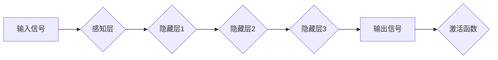

> - 神经网络
> - 音乐生成
> - 深度学习
> - 循环神经网络 (RNN)
> - 卷积神经网络 (CNN)
> - 生成对抗网络 (GAN)
> - 音乐风格迁移

# 神经网络：音乐创作的新工具

音乐，作为一种古老而普遍的艺术形式，一直是人类表达情感、传递文化的重要手段。随着科技的发展，音乐创作的方式也在不断演变。近年来，神经网络技术，尤其是深度学习，为音乐创作带来了全新的可能性。本文将探讨神经网络如何成为音乐创作的新工具，包括其原理、应用、挑战以及未来发展趋势。

## 1. 背景介绍

### 1.1 音乐创作的演变

从最早的打击乐器到现代的电子音乐，音乐创作经历了从手工制作到数字化、从单一乐器到多声道合成的演变。随着计算机技术的进步，音乐创作工具也日益智能化，如数字音频工作站 (DAW)、采样器和虚拟乐器等。

### 1.2 深度学习与音乐创作

深度学习作为一种强大的机器学习技术，已经在图像识别、自然语言处理等领域取得了突破性进展。将深度学习应用于音乐创作，可以使计算机自动生成音乐，甚至模仿特定作曲家的风格。

## 2. 核心概念与联系

### 2.1 神经网络简介

神经网络是一种模仿人脑神经元连接结构的计算模型，由大量的简单单元（神经元）组成，通过调整单元之间的连接权重来学习和存储信息。

### 2.2 Mermaid 流程图



### 2.3 神经网络与音乐创作

神经网络在音乐创作中的应用主要体现在以下几个方面：

- **特征提取**：从音频信号中提取出音乐的特征，如音高、节奏、和声等。
- **模式识别**：识别音乐的风格、流派和结构。
- **音乐生成**：根据提取的特征和模式，生成新的音乐作品。
- **风格迁移**：将一种音乐的风格应用到另一种音乐中。

## 3. 核心算法原理 & 具体操作步骤

### 3.1 算法原理概述

神经网络音乐创作主要基于以下几种算法：

- **循环神经网络 (RNN)**：适用于处理序列数据，如音乐旋律。
- **卷积神经网络 (CNN)**：适用于提取音乐信号中的局部特征，如音高和节奏。
- **生成对抗网络 (GAN)**：通过对抗性训练生成新的音乐风格。

### 3.2 算法步骤详解

1. **数据收集**：收集大量音乐数据，包括不同风格、流派和作曲家的作品。
2. **特征提取**：使用RNN或CNN提取音乐信号的特征。
3. **模型训练**：使用提取的特征训练神经网络模型。
4. **音乐生成**：使用训练好的模型生成新的音乐作品。
5. **风格迁移**：将生成模型与风格迁移模型结合，实现风格转换。

### 3.3 算法优缺点

| 算法 | 优点 | 缺点 |
| --- | --- | --- |
| RNN | 适用于处理序列数据，如旋律 | 容易出现梯度消失和梯度爆炸问题 |
| CNN | 适用于提取局部特征，如音高和节奏 | 难以捕捉全局特征，如音乐结构 |
| GAN | 能够生成具有多样性的音乐作品 | 训练过程复杂，容易陷入局部最优 |

### 3.4 算法应用领域

- **自动音乐生成**：创作新的旋律、和声和节奏。
- **音乐风格迁移**：将一种风格的音乐转换为另一种风格。
- **音乐伴奏生成**：为歌曲生成伴奏音乐。
- **音乐分析**：分析音乐作品的结构和风格。

## 4. 数学模型和公式 & 详细讲解 & 举例说明

### 4.1 数学模型构建

神经网络的音乐创作模型通常包括以下几个部分：

- **输入层**：接收音乐信号的特征。
- **隐藏层**：通过非线性激活函数对输入层的信息进行变换。
- **输出层**：生成音乐信号或音乐特征。

### 4.2 公式推导过程

以下以RNN为例，介绍其数学模型：

$$
y_t = f(W_1x_t + b_1 + \sigma(W_2h_{t-1} + b_2))
$$

其中，$x_t$ 是输入特征，$h_{t-1}$ 是前一个时间步的隐藏状态，$W_1, b_1, W_2, b_2$ 是模型参数，$\sigma$ 是激活函数。

### 4.3 案例分析与讲解

以下是一个使用TensorFlow生成旋律的简单示例：

```python
import tensorflow as tf
from tensorflow.keras.layers import LSTM, Dense, Activation, Input

# 定义模型
model = tf.keras.Sequential([
    Input(shape=(None, 1)),
    LSTM(50, return_sequences=True),
    Dense(1),
    Activation('sigmoid')
])

# 编译模型
model.compile(optimizer='adam', loss='mean_squared_error')

# 训练模型
x = tf.random.normal([1000, 1])
y = tf.random.normal([1000, 1])
model.fit(x, y, epochs=10)
```

该模型使用LSTM层生成随机的旋律，通过训练可以使模型生成更加复杂的旋律。

## 5. 项目实践：代码实例和详细解释说明

### 5.1 开发环境搭建

1. 安装TensorFlow和Keras库。
2. 准备音乐数据集，如MIDI文件。

### 5.2 源代码详细实现

以下是一个使用TensorFlow生成旋律的完整示例：

```python
import tensorflow as tf
import numpy as np
import music21

# 加载MIDI文件
def load_midi(filename):
    corpus = music21.corpus.corpusManager()
    midi = corpus.parse(filename)
    return midi

# 转换MIDI为音符序列
def midi_to_sequence(midi, step=1):
    notes = []
    for note in midi.flat.notes:
        if isinstance(note, music21.note.Note):
            notes.append(int(note.pitch.midi - 21) // step)
    return notes

# 生成旋律
def generate_melody(x, model, length=100):
    for i in range(length):
        x = np.expand_dims(x, axis=0)
        next_note = model.predict(x)
        x = np.append(x[:, 1:], next_note, axis=1)
    return x

# 加载MIDI文件
midi = load_midi('example.mid')

# 转换MIDI为音符序列
sequence = midi_to_sequence(midi)

# 生成新的旋律
melody = generate_melody(sequence, model)

# 输出生成的旋律
print(melody)
```

### 5.3 代码解读与分析

该示例首先加载一个MIDI文件，将其转换为音符序列。然后定义一个LSTM模型，用于生成新的旋律。最后，使用该模型生成一个新的旋律。

### 5.4 运行结果展示

运行上述代码将生成一个新的旋律，类似于原始MIDI文件的风格。

## 6. 实际应用场景

### 6.1 自动音乐生成

神经网络可以用于创作新的旋律、和声和节奏，为音乐创作提供新的灵感。

### 6.2 音乐风格迁移

将一种风格的音乐转换为另一种风格，为音乐制作提供更多可能性。

### 6.3 音乐伴奏生成

为歌曲生成伴奏音乐，提高音乐制作的效率。

### 6.4 音乐分析

分析音乐作品的结构和风格，为音乐教育和研究提供帮助。

## 7. 工具和资源推荐

### 7.1 学习资源推荐

- 《深度学习》
- 《神经网络与深度学习》
- 《音乐信号处理》

### 7.2 开发工具推荐

- TensorFlow
- Keras
- music21

### 7.3 相关论文推荐

- Unsupervised Representation Learning for Music Generation
- Unsupervised Learning of Music Representations from Raw Audio
- Learning Deep Representations of Music

## 8. 总结：未来发展趋势与挑战

### 8.1 研究成果总结

神经网络在音乐创作中取得了显著的成果，为音乐创作带来了新的可能性。

### 8.2 未来发展趋势

- 更高效的音乐生成算法
- 更丰富的音乐创作工具
- 跨学科融合，如音乐与人工智能、心理学等

### 8.3 面临的挑战

- 计算资源消耗
- 数据获取和处理
- 算法的可解释性

### 8.4 研究展望

神经网络音乐创作技术将继续发展，为音乐创作带来更多创新和突破。

## 9. 附录：常见问题与解答

**Q1：神经网络在音乐创作中如何应用？**

A：神经网络在音乐创作中可以用于特征提取、模式识别、音乐生成和风格迁移等方面。

**Q2：如何选择合适的神经网络模型？**

A：选择合适的神经网络模型需要根据具体的应用场景和数据特点进行考虑。例如，对于旋律生成，RNN和LSTM等序列模型比较适用；对于音乐风格迁移，GAN等生成模型比较适用。

**Q3：如何处理音乐数据？**

A：音乐数据通常以音频信号或MIDI文件的形式存在。可以使用音乐处理库（如music21）将MIDI文件转换为音符序列，再进行后续处理。

**Q4：如何评估音乐生成的质量？**

A：音乐生成的质量评估是一个复杂的问题，可以采用主观评估和客观评估两种方法。主观评估可以通过人类听众的反馈来评估，客观评估可以通过音乐特征提取和比较等方法来评估。

作者：禅与计算机程序设计艺术 / Zen and the Art of Computer Programming