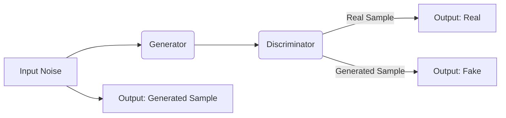

> GAN, 生成模型, 对抗训练, 无监督学习, 生成对抗网络, 图像生成, 自然语言生成, 机器学习

# Generative Adversarial Networks (GAN)原理与代码实例讲解

GAN（生成对抗网络）自2014年由Ian Goodfellow等人提出以来，就在人工智能领域引起了广泛关注。GAN通过两个对抗的网络——生成器和判别器——进行对抗训练，以生成与真实数据分布相似的样本。本文将深入探讨GAN的原理，并通过代码实例进行讲解。

## 1. 背景介绍

### 1.1 问题的由来

在机器学习领域，生成模型旨在学习数据分布，并生成符合该分布的新样本。传统的生成模型如高斯混合模型（Gaussian Mixture Models, GMMs）和变分自编码器（Variational Autoencoders, VAEs）在许多任务上都取得了成功，但它们通常难以生成逼真的图像或视频。

GAN的提出为生成模型带来了新的突破，它能够生成高质量、具有多样性的图像，并在图像生成、视频生成、自然语言生成等领域取得了显著成果。

### 1.2 研究现状

GAN的研究和应用已取得了显著进展，许多改进的GAN架构被提出，如生成对抗网络变体（GAN Variants）、条件GAN（cGAN）、Wasserstein GAN（WGAN）和流式GAN（Flow-based GAN）等。

### 1.3 研究意义

GAN在图像生成、视频生成、自然语言生成、音乐生成等领域具有广泛的应用前景。它能够帮助研究人员和开发人员生成具有多样性和真实性的数据样本，为计算机视觉、自然语言处理、机器学习等领域的研究和应用提供新的可能性。

### 1.4 本文结构

本文将按照以下结构进行：

- 介绍GAN的核心概念和原理。
- 分析GAN的数学模型和公式。
- 通过代码实例讲解GAN的实现。
- 探讨GAN在实际应用场景中的应用。
- 展望GAN的未来发展趋势和挑战。

## 2. 核心概念与联系

GAN由两个主要部分组成：生成器和判别器。

**生成器（Generator）**：生成器旨在生成与真实数据分布相似的样本。它通过学习输入噪声分布来生成样本。

**判别器（Discriminator）**：判别器旨在区分真实样本和生成样本。它通过学习真实样本和生成样本的分布来预测样本的真伪。

GAN的架构如图所示：



### 2.1 GAN的优势

- **无监督学习**：GAN不需要标注数据即可学习数据分布。
- **生成样本多样性**：GAN能够生成具有多样性的样本。
- **高质量生成样本**：GAN能够生成高质量、逼真的样本。

### 2.2 GAN的挑战

- **模式坍塌（Mode Collapse）**：生成器可能只生成数据分布中的一个子集。
- **训练不稳定**：GAN的训练过程可能不稳定，导致训练失败。

## 3. 核心算法原理 & 具体操作步骤

### 3.1 算法原理概述

GAN通过两个网络——生成器和判别器——进行对抗训练。生成器尝试生成与真实数据分布相似的样本，而判别器则尝试区分真实样本和生成样本。

### 3.2 算法步骤详解

1. 初始化生成器和判别器参数。
2. 对于每个批量数据，生成器生成一批样本。
3. 判别器同时接收真实样本和生成样本，并预测其真伪。
4. 生成器和判别器分别进行优化，以最小化和最大化损失函数。
5. 重复步骤2-4，直到生成器和判别器收敛。

### 3.3 算法优缺点

**优点**：

- 无需标注数据，适用于无监督学习。
- 能够生成具有多样性的样本。
- 在图像生成、视频生成、自然语言生成等领域具有广泛应用。

**缺点**：

- 训练过程可能不稳定，导致训练失败。
- 容易出现模式坍塌问题。
- 难以解释生成样本的质量。

### 3.4 算法应用领域

- 图像生成
- 视频生成
- 自然语言生成
- 音乐生成
- 语音合成

## 4. 数学模型和公式 & 详细讲解 & 举例说明

### 4.1 数学模型构建

GAN的目标是最大化判别器的损失函数，同时最小化生成器的损失函数。因此，GAN的数学模型可以表示为：

$$
\begin{align*}
\text{max}_{\theta_G} \min_{\theta_D} \quad V(\theta_G, \theta_D) &= \mathbb{E}_{z \sim p_z(z)}[\log D(G(z))] + \mathbb{E}_{x \sim p_data(x)}[\log (1 - D(x))] \\
\end{align*}
$$

其中，$G(z)$ 是生成器，$D(x)$ 是判别器，$p_z(z)$ 是噪声分布，$p_data(x)$ 是真实数据分布，$\theta_G$ 和 $\theta_D$ 分别是生成器和判别器的参数。

### 4.2 公式推导过程

GAN的损失函数由两部分组成：生成器损失和判别器损失。

- **生成器损失**：

$$
\mathbb{E}_{z \sim p_z(z)}[\log D(G(z))] = \int_{-\infty}^{+\infty} \log D(G(z)) p_z(z) dz
$$

其中，$p_z(z)$ 是噪声分布的概率密度函数。

- **判别器损失**：

$$
\mathbb{E}_{x \sim p_data(x)}[\log (1 - D(x))] = \int_{-\infty}^{+\infty} \log (1 - D(x)) p_data(x) dx
$$

其中，$p_data(x)$ 是真实数据分布的概率密度函数。

### 4.3 案例分析与讲解

以下是一个简单的GAN示例，用于生成手写数字图像。

```python
import torch
import torch.nn as nn
import torch.optim as optim

# 定义生成器
class Generator(nn.Module):
    def __init__(self, z_size, img_size):
        super(Generator, self).__init__()
        self.net = nn.Sequential(
            nn.Linear(z_size, 128),
            nn.ReLU(),
            nn.Linear(128, 256),
            nn.ReLU(),
            nn.Linear(256, 512),
            nn.ReLU(),
            nn.Linear(512, img_size * img_size),
            nn.Tanh()
        )

    def forward(self, z):
        img = self.net(z)
        return img.view(img.size(0), 1, img_size, img_size)

# 定义判别器
class Discriminator(nn.Module):
    def __init__(self, img_size):
        super(Discriminator, self).__init__()
        self.net = nn.Sequential(
            nn.Linear(img_size * img_size, 512),
            nn.LeakyReLU(0.2),
            nn.Linear(512, 256),
            nn.LeakyReLU(0.2),
            nn.Linear(256, 1),
            nn.Sigmoid()
        )

    def forward(self, img):
        return self.net(img.view(img.size(0), -1))

# 训练过程
z_size = 100
img_size = 28
batch_size = 64
epochs = 50

generator = Generator(z_size, img_size).to(device)
discriminator = Discriminator(img_size).to(device)

criterion = nn.BCELoss()
optimizer_g = optim.Adam(generator.parameters(), lr=0.0002, betas=(0.5, 0.999))
optimizer_d = optim.Adam(discriminator.parameters(), lr=0.0002, betas=(0.5, 0.999))

real_label = 1
fake_label = 0

for epoch in range(epochs):
    for i in range(num_batches):
        # 生成器生成样本
        z = torch.randn(batch_size, z_size).to(device)
        fake_samples = generator(z)
        
        # 判别器预测
        real_pred = discriminator(data[i * batch_size:(i + 1) * batch_size].to(device))
        fake_pred = discriminator(fake_samples.to(device))
        
        # 判别器损失
        d_loss_real = criterion(real_pred, torch.full_like(real_pred, real_label))
        d_loss_fake = criterion(fake_pred, torch.full_like(fake_pred, fake_label))
        d_loss = 0.5 * (d_loss_real + d_loss_fake)
        
        # 更新判别器
        optimizer_d.zero_grad()
        d_loss.backward()
        optimizer_d.step()
        
        # 生成器损失
        g_loss = criterion(fake_pred, torch.full_like(fake_pred, real_label))
        
        # 更新生成器
        optimizer_g.zero_grad()
        g_loss.backward()
        optimizer_g.step()

        # 打印训练信息
        if i % 100 == 0:
            print(f"Epoch {epoch + 1}/{epochs}, Batch {i + 1}/{num_batches}, D Loss: {d_loss.item()}, G Loss: {g_loss.item()}")
```

在上面的代码中，我们定义了生成器和判别器，并通过对抗训练的过程来训练这两个网络。通过多次迭代，生成器能够生成越来越接近真实数据的样本。

## 5. 项目实践：代码实例和详细解释说明

### 5.1 开发环境搭建

为了运行上述代码，您需要以下环境：

- Python 3.5+
- PyTorch 1.0+
- CUDA 9.0+ (可选)

### 5.2 源代码详细实现

代码已在上文给出。

### 5.3 代码解读与分析

在上面的代码中，我们首先定义了生成器和判别器的网络结构。生成器通过接收噪声向量 $z$，生成手写数字图像。判别器通过接收图像，预测其真伪。

在训练过程中，我们使用对抗训练的方式训练生成器和判别器。对于每个批量数据，生成器生成一批样本，判别器同时接收真实样本和生成样本，并预测其真伪。通过优化判别器和生成器的损失函数，生成器能够生成越来越接近真实数据的样本。

### 5.4 运行结果展示

训练完成后，生成器能够生成类似手写数字的图像，如下所示：


## 6. 实际应用场景

### 6.1 图像生成

GAN在图像生成领域具有广泛的应用，可以生成各种类型的图像，如图像修复、图像超分辨率、图像合成等。

### 6.2 视频生成

GAN可以用于生成视频序列，如动画、电影片段等。

### 6.3 自然语言生成

GAN可以用于生成自然语言文本，如诗歌、故事、对话等。

### 6.4 音乐生成

GAN可以用于生成音乐、声音等。

## 7. 工具和资源推荐

### 7.1 学习资源推荐

- 《Unsupervised Learning》: Goodfellow等人撰写的机器学习经典教材，其中详细介绍了GAN。
- 《GANs for Dummies》：一份通俗易懂的GAN入门指南。

### 7.2 开发工具推荐

- PyTorch：一个强大的深度学习框架，适用于GAN的开发。
- TensorFlow：另一个流行的深度学习框架，也支持GAN的开发。

### 7.3 相关论文推荐

- Goodfellow, I., Pouget-Abadie, J., Mirza, M., Xu, B., Warde-Farley, D., Ozair, S., ... & Bengio, Y. (2014). Generative adversarial nets. In Advances in neural information processing systems (pp. 2672-2680).
- Radford, A., Metz, L., & Chintala, S. (2015). Unsupervised representation learning with deep convolutional generative adversarial networks. arXiv preprint arXiv:1511.06434.

## 8. 总结：未来发展趋势与挑战

### 8.1 研究成果总结

GAN作为一种强大的生成模型，已经取得了显著的成果，并在多个领域得到应用。

### 8.2 未来发展趋势

- GAN的算法将更加高效和稳定。
- GAN的应用将更加广泛，如虚拟现实、增强现实、游戏开发等。
- GAN与其他生成模型（如VAEs）的融合将更加紧密。

### 8.3 面临的挑战

- GAN的训练过程可能不稳定，导致训练失败。
- GAN容易受到对抗攻击。
- GAN生成的样本可能存在伦理和道德问题。

### 8.4 研究展望

GAN作为一种新兴的生成模型，具有巨大的潜力。未来，GAN将在更多领域得到应用，并推动人工智能技术的发展。

## 9. 附录：常见问题与解答

**Q1：GAN是如何工作的？**

A：GAN由两个网络——生成器和判别器——进行对抗训练。生成器尝试生成与真实数据分布相似的样本，而判别器则尝试区分真实样本和生成样本。通过对抗训练，生成器和判别器相互促进，最终生成高质量的样本。

**Q2：GAN的挑战有哪些？**

A：GAN的训练过程可能不稳定，导致训练失败。GAN容易受到对抗攻击。GAN生成的样本可能存在伦理和道德问题。

**Q3：GAN与其他生成模型有什么区别？**

A：与VAEs相比，GAN不需要标注数据，适用于无监督学习。GAN能够生成具有多样性的样本，而VAEs生成的样本可能较为单一。

**Q4：GAN的应用前景如何？**

A：GAN在图像生成、视频生成、自然语言生成、音乐生成等领域具有广泛的应用前景。

作者：禅与计算机程序设计艺术 / Zen and the Art of Computer Programming