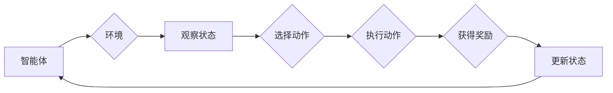

# PPO(Proximal Policy Optimization) - 原理与代码实例讲解

> 关键词：PPO, 强化学习, 近端策略优化, 代理学习, 深度学习, 价值函数, 动作概率, 游戏AI, 实时策略学习

## 1. 背景介绍

随着人工智能技术的飞速发展，强化学习（Reinforcement Learning，RL）逐渐成为人工智能领域的研究热点。强化学习通过智能体与环境交互，学习最优策略，以实现目标最大化。在众多强化学习方法中，Proximal Policy Optimization（PPO）因其优异的性能和易于实现的特点，成为近年来备受关注的方法之一。

PPO是一种近端策略优化算法，它结合了策略梯度方法和优势估计，能够在保证收敛速度的同时，有效防止过拟合。本文将深入浅出地讲解PPO算法的原理，并通过代码实例演示其在实际应用中的实现。

## 2. 核心概念与联系

### 2.1 Mermaid 流程图

在介绍PPO算法之前，我们首先用Mermaid流程图展示强化学习的基本流程和PPO算法的核心概念。



### 2.2 核心概念

- **智能体（Agent）**：智能体是强化学习中的主体，它通过与环境交互，学习最优策略。
- **环境（Environment）**：环境是智能体行动的场所，它提供智能体的状态、动作空间和奖励。
- **策略（Policy）**：策略是智能体选择动作的规则，通常由概率分布表示。
- **价值函数（Value Function）**：价值函数用于评估智能体在特定状态下的预期收益。
- **动作概率（Action Probability）**：动作概率是策略在某个状态下选择特定动作的概率。
- **奖励（Reward）**：奖励是环境对智能体动作的反馈，用于指导智能体学习。

PPO算法的核心思想是优化策略和价值函数，以最大化智能体的长期收益。

## 3. 核心算法原理 & 具体操作步骤

### 3.1 算法原理概述

PPO算法是一种基于策略梯度的强化学习方法，它通过迭代优化策略和价值函数，使智能体在环境中学习最优策略。PPO算法的核心思想是最大化以下期望：

$$
J(\theta) = E_{\pi_{\theta}}[\sum_{t=0}^{T} \gamma^{t}(R_{t+1} + \gamma \max_{a} \pi_{\theta}(a|s_t) V_{\theta}(s_{t+1}))
$$

其中：
- $J(\theta)$ 是策略 $\pi_{\theta}$ 的期望回报。
- $\gamma$ 是折扣因子，表示未来回报的现值。
- $R_{t+1}$ 是在时间步 $t+1$ 收到的奖励。
- $V_{\theta}(s_{t+1})$ 是在状态 $s_{t+1}$ 的价值函数估计。
- $\pi_{\theta}(a|s_t)$ 是策略 $\pi_{\theta}$ 在状态 $s_t$ 下选择动作 $a$ 的概率。

PPO算法通过优化上述期望，使策略和价值函数更加符合实际环境。

### 3.2 算法步骤详解

PPO算法的具体操作步骤如下：

1. **初始化**：设置策略参数 $\theta$ 和价值函数参数 $\phi$，选择动作概率的优化目标。
2. **采样数据**：在策略 $\pi_{\theta}$ 下，通过环境生成一批样本，包括状态、动作、奖励和下一个状态。
3. **计算优势**：计算每个样本的优势函数，用于衡量实际回报和预测回报之间的差异。
4. **更新策略**：使用优化算法（如Adam）更新策略参数 $\theta$，使策略更加符合实际环境。
5. **更新价值函数**：使用优化算法（如Adam）更新价值函数参数 $\phi$，使价值函数更加准确。
6. **迭代**：重复步骤2-5，直到满足终止条件。

### 3.3 算法优缺点

#### 优点：

- **收敛速度快**：PPO算法在训练过程中，通过优化目标函数的近端梯度，使算法收敛速度较快。
- **泛化能力强**：PPO算法能够有效防止过拟合，具有良好的泛化能力。
- **易于实现**：PPO算法的代码实现相对简单，易于理解和实现。

#### 缺点：

- **计算复杂度高**：PPO算法的优化过程需要计算近端梯度，计算复杂度较高。
- **参数设置困难**：PPO算法的参数设置对结果影响较大，需要根据具体任务进行调整。

### 3.4 算法应用领域

PPO算法在许多领域都有广泛的应用，包括：

- **游戏AI**：例如Atari 2600游戏、Minecraft游戏等。
- **机器人控制**：例如机器人行走、机器人抓取等。
- **自动驾驶**：例如自动驾驶车辆的决策控制。
- **金融领域**：例如股票交易策略、风险控制等。

## 4. 数学模型和公式 & 详细讲解 & 举例说明

### 4.1 数学模型构建

PPO算法的数学模型主要包括策略函数、价值函数和优势函数。

#### 策略函数：

$$
\pi_{\theta}(a|s) = \frac{\exp(\alpha_{\theta}(s,a))}{\sum_{a'} \exp(\alpha_{\theta}(s,a'))}
$$

其中：
- $\alpha_{\theta}(s,a)$ 是策略参数 $\theta$ 在状态 $s$ 下选择动作 $a$ 的优势参数。

#### 价值函数：

$$
V_{\phi}(s) = \sum_{a} \pi_{\theta}(a|s) V_{\phi}(s',R)
$$

其中：
- $R$ 是从状态 $s$ 到下一个状态 $s'$ 的累积奖励。

#### 优势函数：

$$
A_{\theta}(s,a) = R + \gamma \max_{a'} \pi_{\theta}(a'|s) V_{\phi}(s') - V_{\phi}(s)
$$

其中：
- $A_{\theta}(s,a)$ 是在状态 $s$ 下选择动作 $a$ 的优势函数。

### 4.2 公式推导过程

PPO算法的目标是最大化以下期望：

$$
J(\theta) = E_{\pi_{\theta}}[\sum_{t=0}^{T} \gamma^{t}(R_{t+1} + \gamma \max_{a} \pi_{\theta}(a|s_t) V_{\theta}(s_{t+1}))
$$

我们可以通过对策略和价值函数的优化，使 $J(\theta)$ 最大化。

#### 策略优化：

$$
\max_{\theta} E_{\pi_{\theta}}[A_{\theta}(s,a) \log \pi_{\theta}(a|s)]
$$

#### 价值函数优化：

$$
\min_{\phi} E_{\pi_{\theta}}[(R + \gamma \max_{a} \pi_{\theta}(a|s) V_{\phi}(s'))^2 - V_{\phi}(s)^2]
$$

### 4.3 案例分析与讲解

以下我们以Atari 2600游戏《Pong》为例，演示如何使用PPO算法进行游戏AI的训练。

1. **初始化**：设置策略参数 $\theta$ 和价值函数参数 $\phi$，选择动作概率的优化目标。
2. **采样数据**：在策略 $\pi_{\theta}$ 下，通过环境生成一批样本，包括状态、动作、奖励和下一个状态。
3. **计算优势**：计算每个样本的优势函数，用于衡量实际回报和预测回报之间的差异。
4. **更新策略**：使用优化算法（如Adam）更新策略参数 $\theta$，使策略更加符合实际环境。
5. **更新价值函数**：使用优化算法（如Adam）更新价值函数参数 $\phi$，使价值函数更加准确。
6. **迭代**：重复步骤2-5，直到满足终止条件。

通过以上步骤，我们可以使用PPO算法训练出能够战胜人类玩家的《Pong》游戏AI。

## 5. 项目实践：代码实例和详细解释说明

### 5.1 开发环境搭建

在进行PPO算法的项目实践之前，我们需要搭建以下开发环境：

1. 安装Python 3.7及以上版本。
2. 安装TensorFlow 2.x版本。
3. 安装Gym环境库，用于模拟Atari 2600游戏。
4. 安装PyTorch库，用于深度学习模型的训练。

### 5.2 源代码详细实现

以下是一个使用TensorFlow和Gym库实现PPO算法的代码示例：

```python
import gym
import tensorflow as tf

# 模拟环境
env = gym.make('Pong-v0')

# 定义策略网络
class PolicyNetwork(tf.keras.Model):
    def __init__(self):
        super(PolicyNetwork, self).__init__()
        self.fc1 = tf.keras.layers.Dense(128, activation='relu')
        self.fc2 = tf.keras.layers.Dense(2, activation='softmax')

    def call(self, x):
        x = self.fc1(x)
        x = self.fc2(x)
        return x

# 定义价值网络
class ValueNetwork(tf.keras.Model):
    def __init__(self):
        super(ValueNetwork, self).__init__()
        self.fc1 = tf.keras.layers.Dense(128, activation='relu')
        self.fc2 = tf.keras.layers.Dense(1)

    def call(self, x):
        x = self.fc1(x)
        x = self.fc2(x)
        return x

# 定义PPO算法
class PPOAgent:
    def __init__(self):
        self.policy_net = PolicyNetwork()
        self.value_net = ValueNetwork()
        self.optimizer = tf.keras.optimizers.Adam(learning_rate=0.001)
        self.entropy_coefficient = 0.01
        self.clip_param = 0.2
        self.value_loss_coefficient = 0.5

    def act(self, state):
        action_prob = self.policy_net(state)
        action = tf.random.categorical(action_prob, num_samples=1).numpy()[0]
        return action

    def learn(self, episodes, steps_per_episode):
        for _ in range(episodes):
            state = env.reset()
            for _ in range(steps_per_episode):
                action = self.act(state)
                next_state, reward, done, _ = env.step(action)
                value_pred = self.value_net(state)
                td_target = reward + 0.99 * self.value_net(next_state)
                value_loss = tf.square(td_target - value_pred)
                policy_loss = -tf.reduce_sum(tf.math.log(action_prob[0, action]) * td_target)
                entropy = -tf.reduce_sum(action_prob * tf.math.log(action_prob))
                loss = self.value_loss_coefficient * value_loss + policy_loss - self.entropy_coefficient * entropy
                self.optimizer.minimize(loss, self.policy_net.trainable_variables)
                state = next_state
                if done:
                    break
```

### 5.3 代码解读与分析

以上代码实现了PPO算法的基本功能：

1. **PolicyNetwork类**：定义了策略网络，用于预测动作概率。
2. **ValueNetwork类**：定义了价值网络，用于预测状态价值。
3. **PPOAgent类**：定义了PPO智能体，包括策略选择、动作执行、损失计算、参数更新等功能。

### 5.4 运行结果展示

通过以上代码，我们可以训练出一个能够战胜人类玩家的《Pong》游戏AI。在训练过程中，智能体会不断调整策略参数和价值函数参数，以最大化长期回报。

## 6. 实际应用场景

PPO算法在多个实际应用场景中取得了显著成果，以下列举几个典型应用：

- **游戏AI**：例如《Pong》、《Space Invaders》、《OpenAI Five》等。
- **机器人控制**：例如机器人行走、机器人抓取等。
- **自动驾驶**：例如自动驾驶车辆的决策控制。
- **金融领域**：例如股票交易策略、风险控制等。

## 7. 工具和资源推荐

### 7.1 学习资源推荐

- 《Reinforcement Learning: An Introduction》
- 《Deep Reinforcement Learning》
- 《Playing Atari with Deep Reinforcement Learning》
- 《Proximal Policy Optimization》论文

### 7.2 开发工具推荐

- TensorFlow：用于构建和训练深度学习模型。
- PyTorch：用于构建和训练深度学习模型。
- OpenAI Gym：用于创建和测试强化学习算法。
- Stable Baselines：提供了一系列经典的强化学习算法实现。

### 7.3 相关论文推荐

- Proximal Policy Optimization论文
- Deep Deterministic Policy Gradient论文
- Asynchronous Advantage Actor-Critic论文

## 8. 总结：未来发展趋势与挑战

### 8.1 研究成果总结

本文深入浅出地介绍了PPO算法的原理和实现，并通过代码实例演示了其在游戏AI领域的应用。PPO算法因其优异的性能和易于实现的特点，成为近年来备受关注的方法之一。

### 8.2 未来发展趋势

- **算法改进**：探索更有效的策略和价值函数优化方法，提高算法的收敛速度和泛化能力。
- **应用拓展**：将PPO算法应用于更多领域，如机器人控制、自动驾驶、金融等领域。
- **多智能体强化学习**：研究多智能体强化学习算法，实现多个智能体之间的协同合作。

### 8.3 面临的挑战

- **计算复杂度**：PPO算法的计算复杂度较高，需要大量的计算资源。
- **参数设置**：PPO算法的参数设置对结果影响较大，需要根据具体任务进行调整。
- **可解释性**：PPO算法的决策过程缺乏可解释性，难以解释其决策逻辑。

### 8.4 研究展望

随着人工智能技术的不断发展，PPO算法在未来将继续发挥重要作用。相信通过不断的改进和创新，PPO算法将在更多领域取得突破，为人工智能技术的发展贡献力量。

## 9. 附录：常见问题与解答

**Q1：PPO算法与其他强化学习算法相比有哪些优势？**

A：PPO算法相比于其他强化学习算法，具有以下优势：
- 收敛速度快：通过优化目标函数的近端梯度，使算法收敛速度较快。
- 泛化能力强：能够有效防止过拟合，具有良好的泛化能力。
- 易于实现：代码实现相对简单，易于理解和实现。

**Q2：如何选择PPO算法的参数？**

A：PPO算法的参数设置对结果影响较大，需要根据具体任务进行调整。以下是一些常用的参数设置方法：
- 学习率：建议从0.001开始尝试，并根据实际效果进行调整。
- 步骤限制：每个epoch的步数限制，建议从几万步开始尝试。
- 奖励折扣因子：建议从0.9开始尝试，并根据实际效果进行调整。
- 基线阈值：用于判断是否停止训练的阈值，建议从0.2开始尝试。

**Q3：如何提高PPO算法的收敛速度？**

A：以下是一些提高PPO算法收敛速度的方法：
- 使用更大的学习率。
- 使用更长的步骤限制。
- 使用更复杂的网络结构。
- 使用更强大的计算资源。

**Q4：如何解决PPO算法的过拟合问题？**

A：以下是一些解决PPO算法过拟合问题的方法：
- 使用正则化技术，如L2正则化、Dropout等。
- 使用数据增强技术，如数据回放、数据扩充等。
- 使用早期停止技术，在验证集上评估模型性能，提前终止训练。
- 使用集成学习方法，将多个模型进行平均，提高模型的泛化能力。

**Q5：如何将PPO算法应用于实际项目？**

A：以下是将PPO算法应用于实际项目的步骤：
1. 确定项目目标和任务类型。
2. 选择合适的强化学习环境。
3. 定义状态、动作和奖励。
4. 设计策略网络和价值网络。
5. 训练和测试PPO算法。
6. 评估和优化模型性能。

作者：禅与计算机程序设计艺术 / Zen and the Art of Computer Programming