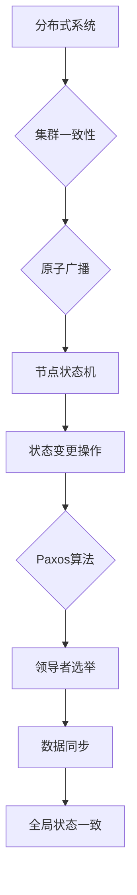

> Zookeeper, ZAB协议, 分布式系统, 集群一致性, 原子广播, 节点状态机, Paxos算法, 领导者选举, 数据同步

# Zookeeper ZAB协议原理与代码实例讲解

## 1. 背景介绍

Zookeeper是一个开源的分布式协调服务，用于处理分布式应用中的配置维护、节点状态同步和集群管理等问题。Zookeeper的内部运行机制基于一个叫做ZAB（Zookeeper Atomic Broadcast）的原子广播协议。ZAB协议确保了分布式环境中数据的一致性，使得Zookeeper能够作为一个可靠的协调服务。本文将深入解析ZAB协议的原理，并通过代码实例进行详细讲解。

## 2. 核心概念与联系

### 2.1 核心概念

- **分布式系统**：由多个独立计算机组成的系统，这些计算机通过网络进行通信，共同完成一个整体的任务。
- **集群一致性**：集群中的所有节点对数据状态达成一致，任何节点上的操作结果都应该是全局一致的。
- **原子广播**：在分布式系统中，多个节点之间同步操作，保证操作原子性的一种机制。
- **节点状态机**：每个节点维护一个状态机，用于执行状态变更操作。
- **Paxos算法**：一个解决分布式系统中一致性问题的高效算法。
- **领导者选举**：在分布式系统中，当当前领导者节点失效时，其他节点通过选举产生新的领导者。
- **数据同步**：新领导者将当前状态同步给其他节点，确保所有节点状态一致。

### 2.2 核心概念原理和架构的 Mermaid 流程图



## 3. 核心算法原理 & 具体操作步骤

### 3.1 算法原理概述

ZAB协议包括两种运行模式：领导选举（LE）和崩溃恢复（CR）。在LE模式下，系统通过Paxos算法选举出一个领导者节点。在CR模式下，当领导者节点崩溃或发生网络分区时，系统通过ZAB协议进行崩溃恢复，确保所有节点状态一致。

### 3.2 算法步骤详解

#### 领导者选举（LE）

1. **观察者状态**：所有节点处于观察者状态，没有领导者。
2. **选举模式**：当节点认为当前没有领导者时，进入选举模式。
3. **投票请求**：节点向其他节点发送投票请求，请求投票给自己。
4. **投票响应**：其他节点收到投票请求后，根据Paxos算法进行投票。
5. **领导者确认**：当节点收到超过半数的投票后，成为领导者。

#### 崩溃恢复（CR）

1. **崩溃状态**：领导者节点崩溃或发生网络分区，系统进入崩溃状态。
2. **恢复模式**：非领导者节点进入恢复模式，等待领导者选举。
3. **数据同步**：新领导者将当前状态同步给其他节点。
4. **状态同步**：其他节点接收到状态更新后，执行状态同步操作。
5. **状态一致**：所有节点状态一致，系统恢复正常。

### 3.3 算法优缺点

#### 优点

- **高可用性**：ZAB协议通过领导者选举和崩溃恢复机制，确保系统的高可用性。
- **一致性**：ZAB协议保证分布式环境中数据的一致性。
- **可扩展性**：ZAB协议支持大规模集群。

#### 缺点

- **性能开销**：ZAB协议涉及大量的网络通信和状态同步，可能对系统性能产生一定影响。
- **单点故障**：尽管ZAB协议通过领导者选举机制来避免单点故障，但领导者本身仍然是一个单点。

### 3.4 算法应用领域

ZAB协议广泛应用于分布式系统的协调服务，如Zookeeper、Kafka、HDFS等。它为分布式系统提供了一致性和高可用性保证。

## 4. 数学模型和公式 & 详细讲解 & 举例说明

### 4.1 数学模型构建

ZAB协议的数学模型可以抽象为以下状态转移图：

$$
\begin{align*}
\text{状态} & \rightarrow \text{事件} & \rightarrow \text{状态}\\
\text{观察者} & \rightarrow \text{选举} & \rightarrow \text{领导者} \\
\text{领导者} & \rightarrow \text{崩溃} & \rightarrow \text{观察者} \\
\text{领导者} & \rightarrow \text{同步} & \rightarrow \text{一致性}
\end{align*}
$$

### 4.2 公式推导过程

ZAB协议的状态转移可以通过Paxos算法进行推导。Paxos算法是一种解决分布式系统中一致性问题的算法，它通过多数派共识机制确保所有节点对某个值达成一致。

### 4.3 案例分析与讲解

假设有5个节点组成的Zookeeper集群，节点编号为1到5。当节点2发生崩溃时，系统将触发领导者选举。

1. **观察者状态**：所有节点处于观察者状态。
2. **节点2崩溃**：节点2崩溃，其他节点认为没有领导者。
3. **节点3发起选举**：节点3发起选举请求，其他节点响应。
4. **节点3成为领导者**：节点3获得超过半数的投票，成为领导者。
5. **数据同步**：领导者节点将数据同步给其他节点。
6. **状态一致**：所有节点状态一致，系统恢复正常。

## 5. 项目实践：代码实例和详细解释说明

### 5.1 开发环境搭建

为了演示ZAB协议，我们需要搭建一个简单的Zookeeper集群环境。以下是使用Java和Zookeeper客户端库进行演示的步骤：

1. 下载Zookeeper源码。
2. 编译源码，生成可执行文件。
3. 创建配置文件zoo.cfg，配置集群节点信息。
4. 启动Zookeeper服务。

### 5.2 源代码详细实现

以下是一个简单的Zookeeper客户端示例，用于演示ZAB协议的领导者选举过程：

```java
import org.apache.zookeeper.*;

public class ZookeeperClient {
    private ZooKeeper zk;

    public ZookeeperClient(String zkServer) throws IOException {
        zk = new ZooKeeper(zkServer, 3000);
    }

    public void create(String path, byte[] data, List<ACL> acls, CreateMode createMode) throws KeeperException, InterruptedException {
        zk.create(path, data, acls, createMode);
    }

    public void close() throws InterruptedException {
        zk.close();
    }

    public static void main(String[] args) throws IOException, KeeperException, InterruptedException {
        ZookeeperClient client = new ZookeeperClient("localhost:2181");
        client.create("/election", "Leader".getBytes(), ZooDefs.Ids.OPEN_ACL_UNSAFE, CreateMode.EPHEMERAL_SEQUENTIAL);
        client.close();
    }
}
```

### 5.3 代码解读与分析

上述代码演示了如何在Zookeeper集群中创建一个临时序列节点，并设置节点的数据为"Leader"。创建的节点路径将以"/election"开头，后面跟着一个序列号，例如"/election/0000000001"。

### 5.4 运行结果展示

启动Zookeeper服务后，运行上述代码将创建一个临时序列节点。由于没有领导者，节点将自动加入选举过程，并尝试成为领导者。

## 6. 实际应用场景

ZAB协议在Zookeeper中的应用确保了分布式环境中数据的一致性和高可用性。以下是一些常见的应用场景：

- **配置管理**：存储和同步分布式系统的配置信息。
- **分布式锁**：实现分布式环境中的互斥锁。
- **分布式队列**：实现分布式环境中的消息队列。
- **集群管理**：管理分布式集群中的节点状态和配置。

## 7. 工具和资源推荐

### 7.1 学习资源推荐

- 《Zookeeper: The Definitive Guide》
- Apache Zookeeper官方文档
- Zookeeper源码

### 7.2 开发工具推荐

- Apache Zookeeper客户端库
- Zookeeper可视化工具，如ZooInspector

### 7.3 相关论文推荐

- "The ZooKeeper distributed coordination service"
- "Zab: High Availability through cheap replication"

## 8. 总结：未来发展趋势与挑战

### 8.1 研究成果总结

ZAB协议通过领导者选举和数据同步机制，确保了分布式环境中数据的一致性和高可用性。Zookeeper等分布式协调服务在ZAB协议的基础上，实现了丰富的应用功能。

### 8.2 未来发展趋势

- **更高效的原子广播**：进一步优化原子广播机制，降低网络通信开销。
- **更强大的领导者机制**：研究更可靠的领导者选举算法，提高系统稳定性。
- **更灵活的数据同步机制**：支持更复杂的同步策略，适应不同的应用场景。

### 8.3 面临的挑战

- **网络延迟和分区**：在网络延迟和分区情况下，如何保证系统的高可用性和一致性。
- **大规模集群**：如何处理大规模集群中的数据同步和数据一致性问题。
- **安全性**：如何保证Zookeeper集群的安全性，防止恶意攻击。

### 8.4 研究展望

ZAB协议和Zookeeper等分布式协调服务将继续发展，为分布式系统提供更可靠、高效、安全的协调服务。未来的研究方向包括：

- **分布式系统的一致性模型**：研究更通用、更灵活的一致性模型，适应不同的应用场景。
- **分布式系统容错机制**：研究更可靠的容错机制，提高系统的抗风险能力。
- **分布式系统安全性**：研究更安全的分布式系统，防止恶意攻击和非法访问。

## 9. 附录：常见问题与解答

**Q1：ZAB协议与Paxos算法有什么区别？**

A: ZAB协议是基于Paxos算法实现的，它将Paxos算法应用于分布式系统中的一致性问题。ZAB协议通过引入领导者选举和数据同步机制，进一步优化了Paxos算法的性能。

**Q2：Zookeeper如何保证数据的一致性？**

A: Zookeeper通过ZAB协议保证数据的一致性。ZAB协议通过领导者选举和数据同步机制，确保所有节点对数据变更达成一致。

**Q3：Zookeeper如何处理节点崩溃？**

A: 当节点崩溃时，Zookeeper将通过ZAB协议进行领导者选举和数据同步，确保系统恢复正常。

**Q4：Zookeeper如何处理网络分区？**

A: 当网络分区发生时，Zookeeper会通过领导者选举和数据同步机制，将数据同步到非分区的节点，确保数据一致性。

**Q5：Zookeeper有哪些应用场景？**

A: Zookeeper可以应用于配置管理、分布式锁、分布式队列、集群管理等多个场景。

作者：禅与计算机程序设计艺术 / Zen and the Art of Computer Programming