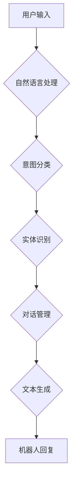

## Chatbots原理与代码实例讲解

> 关键词：Chatbots, 自然语言处理, 机器学习, 深度学习, 聊天机器人, 语义理解, 对话系统

## 1. 背景介绍

在当今数字时代，聊天机器人（Chatbots）已成为一种越来越普遍的交互方式。它们能够模拟人类对话，提供信息、完成任务和提供客户服务。从简单的问答系统到复杂的对话代理，Chatbots 在各个领域都有着广泛的应用，例如电商、金融、医疗保健和教育。

随着人工智能（AI）技术的快速发展，Chatbots 的能力也在不断提升。传统的基于规则的Chatbots 难以处理复杂和开放式的对话，而基于机器学习和深度学习的Chatbots 可以学习和理解人类语言的复杂性，从而提供更自然和人性化的交互体验。

## 2. 核心概念与联系

### 2.1 自然语言处理（NLP）

自然语言处理（NLP）是人工智能的一个分支，致力于使计算机能够理解、处理和生成人类语言。Chatbots 的核心功能依赖于 NLP 技术，包括：

* **文本分析：** 分析用户输入的文本，识别关键词、实体和情感。
* **语义理解：** 理解文本的含义，识别用户意图和需求。
* **文本生成：** 生成自然流畅的文本回复，与用户进行对话。

### 2.2 机器学习（ML）

机器学习是人工智能的一种方法，通过算法训练模型，使其能够从数据中学习并做出预测。在 Chatbots 中，机器学习用于：

* **意图分类：** 识别用户对话中的意图，例如查询信息、预订服务或投诉问题。
* **实体识别：** 从用户输入中提取关键信息，例如日期、时间、地点或产品名称。
* **对话管理：** 控制对话流程，引导用户完成特定任务。

### 2.3 深度学习（DL）

深度学习是机器学习的一个子领域，使用多层神经网络来学习复杂的数据模式。深度学习在 Chatbots 中可以实现更高级的语义理解和文本生成能力，例如：

* **上下文理解：** 理解对话历史，更好地理解用户当前意图。
* **个性化对话：** 根据用户的历史对话和偏好，提供个性化的回复。
* **多模态交互：** 处理文本、语音、图像等多种输入类型。

**Mermaid 流程图**



## 3. 核心算法原理 & 具体操作步骤

### 3.1 算法原理概述

Chatbots 的核心算法通常基于以下几种方法：

* **基于规则的系统：** 使用预定义的规则和知识库来处理用户输入，并生成相应的回复。这种方法简单易实现，但难以处理复杂和开放式的对话。
* **统计语言模型：** 使用统计方法来预测用户下一个词的可能性，从而生成回复。这种方法可以处理一些简单的对话，但缺乏语义理解能力。
* **机器学习模型：** 使用机器学习算法训练模型，使其能够学习用户意图和对话模式，从而生成更自然和准确的回复。

### 3.2 算法步骤详解

以机器学习模型为例，Chatbots 的训练过程通常包括以下步骤：

1. **数据收集和预处理：** 收集大量对话数据，并进行清洗、标注和格式化。
2. **模型选择：** 选择合适的机器学习模型，例如循环神经网络（RNN）或 Transformer。
3. **模型训练：** 使用训练数据训练模型，调整模型参数以最小化预测错误。
4. **模型评估：** 使用测试数据评估模型性能，例如准确率、召回率和 F1-score。
5. **模型部署：** 将训练好的模型部署到生产环境中，用于处理用户对话。

### 3.3 算法优缺点

**优点：**

* 可以处理复杂和开放式的对话。
* 可以学习和理解用户意图和需求。
* 可以生成更自然和人性化的回复。

**缺点：**

* 需要大量的数据进行训练。
* 训练过程可能需要很长时间。
* 模型的性能取决于训练数据的质量。

### 3.4 算法应用领域

* **客户服务：** 自动回答常见问题，提供快速响应。
* **电商：** 帮助用户查找商品、完成订单和提供售后服务。
* **金融：** 提供理财建议、查询账户余额和办理转账业务。
* **医疗保健：** 预约挂号、查询病情和提供健康咨询。
* **教育：** 提供在线辅导、解答学生疑问和个性化学习建议。

## 4. 数学模型和公式 & 详细讲解 & 举例说明

### 4.1 数学模型构建

在 Chatbots 中，常用的数学模型包括：

* **词嵌入模型：** 将单词映射到向量空间，捕捉单词之间的语义关系。例如，Word2Vec 和 GloVe。
* **循环神经网络（RNN）：** 用于处理序列数据，例如文本对话。RNN 可以学习对话的历史信息，并根据上下文生成回复。
* **Transformer：** 一种更先进的序列模型，能够更有效地处理长距离依赖关系。Transformer 的核心组件是注意力机制，可以帮助模型关注对话中重要的信息。

### 4.2 公式推导过程

由于篇幅限制，这里只介绍词嵌入模型的简单公式：

**目标函数：**

$$
J(\theta) = -\frac{1}{N} \sum_{i=1}^{N} \sum_{j=1}^{V} \log p(w_j | w_{<j})
$$

其中：

* $J(\theta)$ 是目标函数，用于衡量模型的性能。
* $N$ 是训练数据的样本数量。
* $V$ 是词汇表的大小。
* $w_j$ 是第 $j$ 个单词。
* $w_{<j}$ 是第 $j$ 个单词之前的上下文单词。
* $\theta$ 是模型的参数。

**公式解释：**

目标函数试图最大化模型预测每个单词出现的概率。

### 4.3 案例分析与讲解

**Word2Vec 模型：**

Word2Vec 是一个流行的词嵌入模型，它使用神经网络来学习单词之间的语义关系。例如，"king" 和 "queen" 应该在向量空间中比较接近，因为它们是同类概念。

**应用场景：**

* **文本相似度计算：** 使用词嵌入模型计算两个文本之间的相似度。
* **词义消歧：** 根据上下文判断词语的含义。
* **推荐系统：** 基于用户历史行为推荐相关商品或内容。

## 5. 项目实践：代码实例和详细解释说明

### 5.1 开发环境搭建

* Python 3.x
* TensorFlow 或 PyTorch
* NLTK 或 spaCy

### 5.2 源代码详细实现

```python
import tensorflow as tf

# 定义模型结构
model = tf.keras.Sequential([
    tf.keras.layers.Embedding(input_dim=vocab_size, output_dim=embedding_dim),
    tf.keras.layers.LSTM(units=128),
    tf.keras.layers.Dense(units=vocab_size, activation='softmax')
])

# 编译模型
model.compile(optimizer='adam', loss='sparse_categorical_crossentropy', metrics=['accuracy'])

# 训练模型
model.fit(x_train, y_train, epochs=10)

# 预测回复
predicted_tokens = model.predict(x_test)
```

### 5.3 代码解读与分析

* **Embedding 层：** 将单词映射到向量空间。
* **LSTM 层：** 处理序列数据，学习对话历史信息。
* **Dense 层：** 生成回复，预测下一个单词的概率。
* **编译模型：** 选择优化器、损失函数和评价指标。
* **训练模型：** 使用训练数据训练模型参数。
* **预测回复：** 使用训练好的模型预测用户输入的回复。

### 5.4 运行结果展示

训练完成后，可以使用测试数据评估模型性能，例如准确率和困惑度。

## 6. 实际应用场景

### 6.1 电商客服

Chatbots 可以自动回答客户常见问题，例如产品信息、订单状态和退换货政策。

### 6.2 金融咨询

Chatbots 可以提供理财建议、查询账户余额和办理转账业务。

### 6.3 教育辅导

Chatbots 可以提供在线辅导、解答学生疑问和个性化学习建议。

### 6.4 未来应用展望

* **更自然的人机交互：** 使用多模态交互，例如语音、图像和视频。
* **更智能的对话理解：** 理解更复杂和开放式的对话，例如幽默、讽刺和情感。
* **个性化定制：** 根据用户的偏好和需求提供个性化的服务。

## 7. 工具和资源推荐

### 7.1 学习资源推荐

* **书籍：**
    * "Speech and Language Processing" by Jurafsky and Martin
    * "Deep Learning" by Goodfellow, Bengio, and Courville
* **在线课程：**
    * Coursera: Natural Language Processing Specialization
    * Udacity: Deep Learning Nanodegree

### 7.2 开发工具推荐

* **TensorFlow:** https://www.tensorflow.org/
* **PyTorch:** https://pytorch.org/
* **NLTK:** https://www.nltk.org/
* **spaCy:** https://spacy.io/

### 7.3 相关论文推荐

* "Attention Is All You Need" by Vaswani et al.
* "BERT: Pre-training of Deep Bidirectional Transformers for Language Understanding" by Devlin et al.

## 8. 总结：未来发展趋势与挑战

### 8.1 研究成果总结

Chatbots 技术在过去几年取得了显著进展，能够处理更复杂和自然的人机对话。

### 8.2 未来发展趋势

* **更强大的语义理解：** 能够理解更复杂和微妙的语言含义。
* **更个性化的交互体验：** 根据用户的偏好和需求提供定制化的服务。
* **更广泛的应用场景：** 在更多领域应用，例如医疗保健、教育和娱乐。

### 8.3 面临的挑战

* **数据质量问题：** Chatbots 的性能取决于训练数据的质量。
* **对话管理复杂性：** 设计能够处理复杂对话流程的系统仍然是一个挑战。
* **伦理和安全问题：** 确保 Chatbots 的安全性和伦理使用需要进一步研究。

### 8.4 研究展望

未来研究方向包括：

* **开发更强大的语义理解模型。**
* **设计更智能的对话管理系统。**
* **解决 Chatbots 的伦理和安全问题。**


## 9. 附录：常见问题与解答

* **Q：Chatbots 和虚拟助手有什么区别？**

* **A：** Chatbots 和虚拟助手都是能够与用户进行对话的系统，但虚拟助手通常具有更广泛的功能，例如设置提醒、控制智能家居设备和提供个性化建议。

* **Q：如何训练一个 Chatbots？**

* **A：** 训练一个 Chatbots 需要大量的数据和合适的算法。通常需要收集对话数据，进行预处理和标注，然后使用机器学习算法训练模型。

* **Q：Chatbots 是否能够完全替代人类客服？**

* **A：** 目前 Chatbots 仍然无法完全替代人类客服，因为它们在处理复杂和情感敏感的对话方面仍然存在局限性。但 Chatbots 可以帮助人类客服提高效率，并提供更快速和便捷的服务。


作者：禅与计算机程序设计艺术 / Zen and the Art of Computer Programming 
