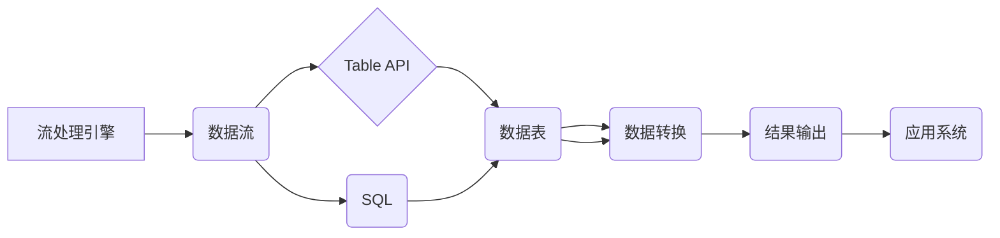

## Flink Table API和SQL原理与代码实例讲解

> 关键词：Apache Flink, Table API, SQL, Stream Processing, Data Analytics, Windowing, State Management, Data Transformation

## 1. 背景介绍

Apache Flink 作为一款开源分布式流处理引擎，以其高吞吐量、低延迟和强大的数据处理能力而闻名。随着数据处理需求的不断增长，Flink 的 Table API 和 SQL 引入了面向表的编程模型，使得数据处理更加简洁、易用和可维护。

传统的流处理引擎通常使用基于事件的编程模型，需要开发者手动管理时间窗口、状态和数据转换。而 Table API 和 SQL 提供了更抽象的编程接口，将这些复杂的操作封装起来，让开发者能够更专注于业务逻辑的实现。

## 2. 核心概念与联系

### 2.1  概念概述

* **流处理:** 处理连续不断的数据流，例如实时日志分析、股票交易监控等。
* **批处理:** 处理离散的数据集，例如数据仓库分析、机器学习模型训练等。
* **Table API:**  面向表的编程接口，提供类似 SQL 的语法，用于定义数据表、操作数据表和执行数据转换。
* **SQL:**  结构化查询语言，用于查询和操作关系型数据库。

### 2.2  架构关系



## 3. 核心算法原理 & 具体操作步骤

### 3.1  算法原理概述

Flink Table API 和 SQL 基于 **数据流的微批处理** 思想，将流数据划分为小的批次进行处理。每个批次都像一个独立的批处理任务，可以应用传统的批处理算法和优化技术。

### 3.2  算法步骤详解

1. **数据接收:** Flink 从数据源接收数据流。
2. **数据分组:** 根据指定的键，将数据流分组。
3. **窗口定义:**  定义时间窗口，用于对数据进行聚合和计算。
4. **数据转换:**  对每个窗口内的数据进行转换，例如聚合、过滤、排序等。
5. **结果输出:** 将处理后的结果输出到目标系统。

### 3.3  算法优缺点

**优点:**

* **高吞吐量:** 微批处理可以充分利用硬件资源，提高数据处理吞吐量。
* **低延迟:**  窗口机制可以控制数据处理的延迟，满足实时应用需求。
* **易用性:** Table API 和 SQL 提供了简洁易用的编程接口，降低了开发门槛。

**缺点:**

* **状态管理:**  需要管理状态信息，例如窗口状态、聚合状态等。
* **复杂性:**  对于复杂的业务逻辑，可能需要编写大量的代码。

### 3.4  算法应用领域

* **实时数据分析:**  例如用户行为分析、网络流量监控等。
* **实时推荐:**  根据用户实时行为推荐相关商品或内容。
* **实时告警:**  对异常数据进行实时告警，帮助用户快速响应。

## 4. 数学模型和公式 & 详细讲解 & 举例说明

### 4.1  数学模型构建

Flink Table API 和 SQL 的核心数学模型是 **关系代数**。关系代数是一种用于描述和操作关系型数据的数学框架。

### 4.2  公式推导过程

关系代数提供了许多操作符，例如选择、投影、连接、聚合等。这些操作符可以组合起来，实现复杂的查询和数据转换。

例如，选择操作符可以用于从关系中筛选满足特定条件的数据。

$$
\sigma_{条件}(关系)
$$

其中，$\sigma$ 表示选择操作符，$条件$ 表示筛选条件，$关系$ 表示关系式。

### 4.3  案例分析与讲解

假设有一个关系表 `users`，包含用户 ID、姓名和年龄信息。

```
users(user_id, name, age)
```

我们可以使用选择操作符筛选出年龄大于 18 的用户。

$$
\sigma_{age > 18}(users)
$$

这个公式表示从 `users` 表中选择年龄大于 18 的用户记录。

## 5. 项目实践：代码实例和详细解释说明

### 5.1  开发环境搭建

* 安装 Java JDK
* 下载 Flink 安装包
* 配置 Flink 环境变量

### 5.2  源代码详细实现

```java
import org.apache.flink.api.java.tuple.Tuple2;
import org.apache.flink.streaming.api.datastream.DataStream;
import org.apache.flink.streaming.api.environment.StreamExecutionEnvironment;
import org.apache.flink.table.api.Table;
import org.apache.flink.table.api.java.StreamTableEnvironment;

public class FlinkTableExample {

    public static void main(String[] args) throws Exception {
        // 创建流处理环境
        StreamExecutionEnvironment env = StreamExecutionEnvironment.getExecutionEnvironment();
        // 创建表处理环境
        StreamTableEnvironment tableEnv = StreamTableEnvironment.create(env);

        // 定义数据源
        DataStream<Tuple2<String, Integer>> dataStream = env.fromElements(
                Tuple2.of("Alice", 25),
                Tuple2.of("Bob", 30),
                Tuple2.of("Charlie", 20)
        );

        // 将数据流转换为表
        Table table = tableEnv.fromDataStream(dataStream, "name, age");

        // 使用 SQL 查询数据
        Table resultTable = tableEnv.sqlQuery("SELECT name, age FROM table WHERE age > 21");

        // 将结果表转换为数据流
        DataStream<Tuple2<String, Integer>> resultStream = tableEnv.toAppendStream(resultTable, Tuple2.class);

        // 打印结果
        resultStream.print();

        // 执行任务
        env.execute("Flink Table Example");
    }
}
```

### 5.3  代码解读与分析

*  代码首先创建了流处理环境和表处理环境。
*  然后定义了一个数据源，包含用户姓名和年龄信息。
*  将数据源转换为表，并使用 SQL 查询语句筛选出年龄大于 21 的用户。
*  将查询结果转换为数据流，并打印输出。

### 5.4  运行结果展示

```
(Alice,25)
(Bob,30)
```

## 6. 实际应用场景

### 6.1  实时用户行为分析

Flink Table API 和 SQL 可以用于实时分析用户行为数据，例如用户访问页面、点击广告、购买商品等。

### 6.2  实时推荐系统

Flink 可以用于构建实时推荐系统，根据用户的实时行为推荐相关商品或内容。

### 6.3  实时告警系统

Flink 可以用于构建实时告警系统，对异常数据进行实时告警，帮助用户快速响应。

### 6.4  未来应用展望

随着数据处理需求的不断增长，Flink Table API 和 SQL 将在更多领域得到应用，例如：

* **实时金融交易监控:**  实时监控交易数据，识别异常交易行为。
* **实时医疗数据分析:**  实时分析患者数据，辅助医生诊断和治疗。
* **实时工业控制:**  实时监控工业设备运行状态，及时发现故障。

## 7. 工具和资源推荐

### 7.1  学习资源推荐

* **Apache Flink 官方文档:** https://flink.apache.org/docs/stable/
* **Flink Table API 文档:** https://flink.apache.org/docs/stable/table/index.html
* **Flink SQL 文档:** https://flink.apache.org/docs/stable/table/sql.html

### 7.2  开发工具推荐

* **IntelliJ IDEA:** https://www.jetbrains.com/idea/
* **Eclipse:** https://www.eclipse.org/

### 7.3  相关论文推荐

* **Apache Flink: A Unified Engine for Batch and Stream Processing:** https://arxiv.org/abs/1803.08193

## 8. 总结：未来发展趋势与挑战

### 8.1  研究成果总结

Flink Table API 和 SQL 提供了一种简洁、高效、易用的数据处理方式，推动了流处理技术的应用和发展。

### 8.2  未来发展趋势

* **更强大的 SQL 支持:**  支持更丰富的 SQL 语法和功能，例如窗口函数、聚合函数等。
* **更完善的生态系统:**  开发更多 Flink Table API 和 SQL 的应用和工具，形成更完善的生态系统。
* **更优的性能和效率:**  通过优化算法和架构，提高 Flink Table API 和 SQL 的性能和效率。

### 8.3  面临的挑战

* **状态管理的复杂性:**  Flink Table API 和 SQL 需要管理状态信息，例如窗口状态、聚合状态等，这可能会增加开发复杂度。
* **数据一致性的保证:**  在分布式环境下，保证数据一致性是一个重要的挑战。
* **资源管理的优化:**  Flink Table API 和 SQL 需要合理分配资源，以提高系统性能和效率。

### 8.4  研究展望

未来，Flink Table API 和 SQL 将继续朝着更强大、更易用、更高效的方向发展，为数据处理领域带来更多创新和突破。

## 9. 附录：常见问题与解答

* **Q: Flink Table API 和 SQL 的区别是什么？**

A: Flink Table API 提供了面向表的编程接口，类似于 SQL，但语法更加简洁。Flink SQL 是基于 SQL 的查询语言，可以执行更复杂的查询操作。

* **Q: Flink Table API 和 SQL 如何与其他 Flink API 集成？**

A: Flink Table API 和 SQL 可以与其他 Flink API 集成，例如 DataStream API 和 DataSet API。

* **Q: Flink Table API 和 SQL 的性能如何？**

A: Flink Table API 和 SQL 的性能非常高，可以处理海量数据流。


作者：禅与计算机程序设计艺术 / Zen and the Art of Computer Programming 
