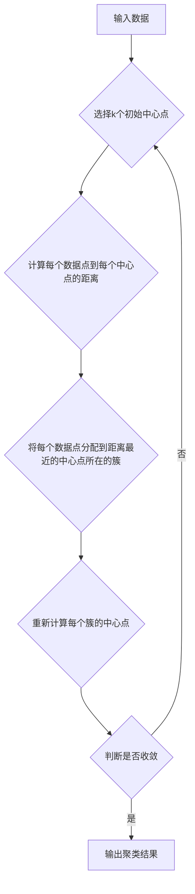

## K-Means - 原理与代码实例讲解

> 关键词：K-Means聚类、无监督学习、聚类算法、距离计算、中心点迭代、机器学习

## 1. 背景介绍

在海量数据时代，如何有效地对数据进行分类和组织成为一个至关重要的挑战。K-Means聚类算法作为一种经典的无监督学习算法，在数据挖掘、机器学习、图像处理等领域有着广泛的应用。它能够将数据点自动分组到k个簇中，并为每个簇找到一个代表性的中心点。

K-Means算法的优势在于其简单易懂、易于实现，并且能够有效地处理高维数据。然而，它也存在一些局限性，例如对初始中心点的选择敏感，难以处理非球形数据簇。

## 2. 核心概念与联系

K-Means算法的核心概念是将数据点划分为k个簇，每个簇由数据点集合和一个代表性的中心点组成。

**流程图：**



**核心概念：**

* **数据点:** 待聚类的样本数据。
* **簇:** 数据点的集合，每个簇代表一个类别或群组。
* **中心点:** 每个簇的代表点，通常是该簇内所有数据点的平均值。
* **距离:** 用于衡量数据点与中心点之间的相似程度的度量。常见的距离度量包括欧氏距离、曼哈顿距离等。
* **迭代:** K-Means算法通过不断迭代中心点的位置来优化聚类结果。

## 3. 核心算法原理 & 具体操作步骤

### 3.1  算法原理概述

K-Means算法的基本原理是通过迭代的方式，不断调整中心点的位置，使得每个数据点都尽可能地靠近其所属簇的中心点。

算法的流程可以概括为以下步骤：

1. **随机选择k个数据点作为初始中心点。**
2. **计算每个数据点到所有中心点的距离。**
3. **将每个数据点分配到距离最近的中心点所在的簇。**
4. **重新计算每个簇的中心点。**
5. **重复步骤2-4，直到中心点不再发生明显变化或达到最大迭代次数。**

### 3.2  算法步骤详解

1. **初始化中心点:** 随机选择k个数据点作为初始中心点。

2. **分配数据点:** 计算每个数据点到所有中心点的距离，并将每个数据点分配到距离最近的中心点所在的簇。

3. **更新中心点:** 重新计算每个簇的中心点，通常是该簇内所有数据点的平均值。

4. **迭代:** 重复步骤2-3，直到中心点不再发生明显变化或达到最大迭代次数。

### 3.3  算法优缺点

**优点:**

* 简单易懂，易于实现。
* 能够有效地处理高维数据。
* 运行速度较快。

**缺点:**

* 对初始中心点的选择敏感，不同的初始中心点可能导致不同的聚类结果。
* 难以处理非球形数据簇。
* 必须事先指定k值，这可能需要根据实际情况进行调整。

### 3.4  算法应用领域

K-Means算法广泛应用于以下领域：

* **数据挖掘:** 发现数据中的潜在模式和结构。
* **机器学习:** 用于分类、回归和降维等任务。
* **图像处理:** 图像分割、目标检测和图像压缩。
* **推荐系统:** 基于用户的兴趣和行为推荐相关商品或服务。

## 4. 数学模型和公式 & 详细讲解 & 举例说明

### 4.1  数学模型构建

K-Means算法的目标是找到k个簇，使得每个数据点都尽可能地靠近其所属簇的中心点。

数学模型可以表示为：

* **目标函数:** 

$$J(C) = \sum_{i=1}^{k} \sum_{x \in C_i} ||x - \mu_i||^2$$

其中：

* $J(C)$ 是目标函数，表示所有数据点到其所属簇中心点的距离平方和。
* $k$ 是簇的数量。
* $C_i$ 是第i个簇。
* $x$ 是数据点。
* $\mu_i$ 是第i个簇的中心点。
* $||x - \mu_i||^2$ 是数据点 $x$ 到中心点 $\mu_i$ 的欧氏距离平方。

* **优化目标:** 找到k个中心点 $\mu_1, \mu_2,..., \mu_k$，使得目标函数 $J(C)$ 最小。

### 4.2  公式推导过程

K-Means算法通过迭代的方式来优化目标函数。

1. **初始化中心点:** 随机选择k个数据点作为初始中心点。

2. **分配数据点:** 计算每个数据点到所有中心点的距离，并将每个数据点分配到距离最近的中心点所在的簇。

3. **更新中心点:** 重新计算每个簇的中心点，通常是该簇内所有数据点的平均值。

$$ \mu_i = \frac{1}{|C_i|} \sum_{x \in C_i} x $$

其中：

* $|C_i|$ 是第i个簇的大小。

4. **迭代:** 重复步骤2-3，直到中心点不再发生明显变化或达到最大迭代次数。

### 4.3  案例分析与讲解

假设我们有以下数据点：

```
(1, 2), (1.5, 1.8), (5, 8), (8, 8), (1, 0.6), (9, 11)
```

我们想要将这些数据点聚类成两个簇。

1. **初始化中心点:** 随机选择两个数据点作为初始中心点，例如 (1, 2) 和 (8, 8)。

2. **分配数据点:** 计算每个数据点到两个中心点的距离，并将每个数据点分配到距离最近的中心点所在的簇。

3. **更新中心点:** 重新计算每个簇的中心点。

4. **迭代:** 重复步骤2-3，直到中心点不再发生明显变化。

最终，我们可能会得到以下聚类结果：

* 簇1: (1, 2), (1.5, 1.8), (1, 0.6)
* 簇2: (5, 8), (8, 8), (9, 11)

## 5. 项目实践：代码实例和详细解释说明

### 5.1  开发环境搭建

本示例使用Python语言和scikit-learn库进行实现。

需要安装以下软件包：

* Python 3.x
* scikit-learn

可以使用以下命令安装：

```bash
pip install scikit-learn
```

### 5.2  源代码详细实现

```python
import numpy as np
from sklearn.cluster import KMeans
import matplotlib.pyplot as plt

# 生成示例数据
X = np.array([[1, 2], [1.5, 1.8], [5, 8], [8, 8], [1, 0.6], [9, 11]])

# 创建KMeans聚类模型，指定簇数量为2
kmeans = KMeans(n_clusters=2, random_state=0)

# 训练模型，对数据进行聚类
kmeans.fit(X)

# 获取聚类结果
labels = kmeans.labels_

# 获取每个簇的中心点
centroids = kmeans.cluster_centers_

# 可视化聚类结果
plt.scatter(X[:, 0], X[:, 1], c=labels, s=50, cmap='viridis')
plt.scatter(centroids[:, 0], centroids[:, 1], marker='x', s=200, c='red')
plt.title('K-Means Clustering')
plt.xlabel('Feature 1')
plt.ylabel('Feature 2')
plt.show()
```

### 5.3  代码解读与分析

1. **数据生成:** 使用NumPy生成示例数据，包含两个特征的六个数据点。

2. **模型创建:** 使用scikit-learn库中的KMeans类创建聚类模型，指定簇数量为2。

3. **模型训练:** 使用`fit()`方法训练模型，对数据进行聚类。

4. **结果获取:** 使用`labels_`属性获取每个数据点的所属簇标签，使用`cluster_centers_`属性获取每个簇的中心点。

5. **可视化结果:** 使用Matplotlib库绘制散点图，将数据点根据所属簇颜色区分，并用红色标记每个簇的中心点。

### 5.4  运行结果展示

运行代码后，将生成一个散点图，展示数据点的聚类结果。

## 6. 实际应用场景

K-Means算法在实际应用中有着广泛的应用场景，例如：

* **客户细分:** 根据用户的购买行为、浏览记录等特征，将客户划分为不同的群体，以便针对不同群体的需求进行个性化营销。
* **图像压缩:** 将图像分割成多个区域，然后对每个区域进行压缩，从而减少图像文件的大小。
* **异常检测:** 将数据点聚类成多个簇，然后识别出与其他簇相似的异常数据点。

### 6.4  未来应用展望

随着人工智能技术的不断发展，K-Means算法的应用场景将会更加广泛。例如，它可以用于：

* **推荐系统:** 基于用户的兴趣和行为，推荐更精准的商品或服务。
* **医疗诊断:** 将患者的症状和病史进行聚类，辅助医生进行诊断。
* **金融风险管理:** 将交易数据进行聚类，识别出潜在的风险交易。

## 7. 工具和资源推荐

### 7.1  学习资源推荐

* **书籍:**
    * "Introduction to Machine Learning" by Ethem Alpaydin
    * "The Elements of Statistical Learning" by Trevor Hastie, Robert Tibshirani, and Jerome Friedman
* **在线课程:**
    * Coursera: Machine Learning by Andrew Ng
    * edX: Introduction to Artificial Intelligence

### 7.2  开发工具推荐

* **Python:** 
    * scikit-learn: 机器学习库
    * NumPy: 数值计算库
    * Matplotlib: 数据可视化库
* **R:** 
    * cluster: 聚类分析包
    * ggplot2: 数据可视化包

### 7.3  相关论文推荐

* "K-Means Clustering" by Stuart Lloyd (1982)
* "A Tutorial on k-Means Clustering" by David Arthur and Sergei Vassilvitskii (2007)

## 8. 总结：未来发展趋势与挑战

### 8.1  研究成果总结

K-Means算法作为一种经典的无监督学习算法，在数据挖掘、机器学习等领域取得了显著的成果。它简单易懂、易于实现，并且能够有效地处理高维数据。

### 8.2  未来发展趋势

未来，K-Means算法的研究将朝着以下方向发展：

* **提高算法鲁棒性:** 减少对初始中心点选择的敏感性，并能够处理非球形数据簇。
* **加速算法效率:** 探索新的算法优化方法，提高算法的运行速度。
* **结合其他算法:** 将K-Means算法与其他机器学习算法结合，提高聚类效果。

### 8.3  面临的挑战

K-Means算法也面临一些挑战，例如：

* **确定最佳簇数量:** 确定最佳簇数量是一个困难的问题，需要根据实际情况进行调整。
* **处理高