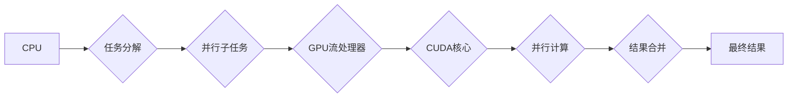

## NVIDIA与GPU的发明

> 关键词：GPU, NVIDIA,ALLEL PROCESSING,图形处理单元,计算加速,深度学习,人工智能

### 1. 背景介绍

20世纪90年代，计算机图形学领域面临着巨大的挑战。当时，处理复杂的3D图形需要大量的计算资源，传统的CPU架构难以满足需求。为了解决这个问题，NVIDIA公司诞生了GPU（图形处理单元）的概念，并将其发展成为一种全新的计算平台。

GPU最初被设计用于加速图形渲染，其核心思想是并行计算。与CPU相比，GPU拥有更丰富的并行处理单元，能够同时处理大量的数据。这种并行计算能力使得GPU在处理图像处理、视频编码、科学计算等领域展现出巨大的潜力。

### 2. 核心概念与联系

#### 2.1  CPU与GPU的架构差异

* **CPU (中央处理器)**：CPU是传统计算机的核心处理器，其架构以顺序执行指令为主，拥有较少的核心，但每个核心处理能力强。
* **GPU (图形处理单元)**：GPU是专门用于图形处理的处理器，其架构以并行计算为主，拥有大量的核心，每个核心处理能力相对较弱，但通过并行处理大量数据可以实现高速计算。

#### 2.2  GPU架构

GPU的架构通常包含以下几个主要部分：

* **流处理器 (Streaming Multiprocessor)**：GPU的核心计算单元，每个流处理器包含多个CUDA核心。
* **CUDA核心 (CUDA Core)**：GPU的最小计算单元，负责执行计算任务。
* **共享内存 (Shared Memory)**：流处理器之间共享的内存，用于存储临时数据。
* **全局内存 (Global Memory)**：GPU的总内存，用于存储程序数据和纹理数据。

#### 2.3  并行计算模型

GPU利用并行计算模型，将一个大型计算任务分解成多个小的子任务，并由多个CUDA核心同时处理。这种并行计算方式可以大幅提高计算速度。



### 3. 核心算法原理 & 具体操作步骤

#### 3.1  算法原理概述

GPU加速算法的核心原理是利用GPU的并行计算能力，将算法中的计算密集型部分分解成多个子任务，并由GPU的多个CUDA核心同时处理。

#### 3.2  算法步骤详解

1. **算法移植**: 将传统的CPU算法移植到GPU平台，并将其分解成适合GPU并行计算的子任务。
2. **数据传输**: 将数据从CPU内存传输到GPU内存。
3. **并行计算**: 利用GPU的流处理器和CUDA核心进行并行计算。
4. **结果收集**: 将计算结果从GPU内存传输回CPU内存。

#### 3.3  算法优缺点

**优点**:

* **加速计算**: 利用GPU的并行计算能力，可以大幅提高计算速度。
* **处理大数据**: GPU拥有较大的内存容量，可以处理海量数据。

**缺点**:

* **开发复杂**: GPU编程需要学习新的编程模型和工具。
* **数据传输**: 数据传输过程会消耗时间和资源。

#### 3.4  算法应用领域

* **图形渲染**: 游戏、动画、电影等领域。
* **科学计算**: 天体模拟、分子动力学、金融建模等领域。
* **机器学习**: 深度学习、图像识别、自然语言处理等领域。

### 4. 数学模型和公式 & 详细讲解 & 举例说明

#### 4.1  数学模型构建

GPU加速算法的数学模型通常基于线性代数和矩阵运算。

#### 4.2  公式推导过程

例如，矩阵乘法是一个常见的GPU加速算法。

$$
C = A \times B
$$

其中，A和B是两个矩阵，C是它们的乘积矩阵。

GPU可以利用并行计算模型，将矩阵乘法分解成多个小的子任务，并由多个CUDA核心同时处理。

#### 4.3  案例分析与讲解

在深度学习领域，卷积神经网络（CNN）的训练过程需要大量的矩阵运算。GPU可以加速CNN的训练过程，大幅缩短训练时间。

### 5. 项目实践：代码实例和详细解释说明

#### 5.1  开发环境搭建

* **操作系统**: Linux或Windows
* **CUDA Toolkit**: NVIDIA提供的GPU编程工具包
* **编程语言**: C++、CUDA C

#### 5.2  源代码详细实现

```c++
// CUDA kernel function for matrix multiplication
__global__ void matrixMul(float *A, float *B, float *C, int N) {
  int i = blockIdx.x * blockDim.x + threadIdx.x;
  int j = blockIdx.y * blockDim.y + threadIdx.y;

  float sum = 0.0f;
  for (int k = 0; k < N; k++) {
    sum += A[i * N + k] * B[k * N + j];
  }
  C[i * N + j] = sum;
}

// Host code for matrix multiplication
int main() {
  //... allocate memory for matrices A, B, and C...

  //... initialize matrices A and B...

  // Launch the CUDA kernel
  dim3 gridSize(N / 256, N / 256);
  dim3 blockSize(256, 256);
  matrixMul<<<gridSize, blockSize>>>(A, B, C, N);

  //... copy results from GPU to host...

  //... free memory...

  return 0;
}
```

#### 5.3  代码解读与分析

* **CUDA kernel function**: `matrixMul`函数是运行在GPU上的计算内核，它接受四个参数：矩阵A、矩阵B、结果矩阵C和矩阵大小N。
* **ThreadIdx**: 每个线程的ID。
* **BlockIdx**: 每个线程块的ID。
* **BlockDim**: 每个线程块的大小。
* **Host code**: 主程序负责分配内存、初始化数据、启动CUDA内核和收集结果。

#### 5.4  运行结果展示

运行代码后，可以观察到GPU加速后的矩阵乘法速度明显提升。

### 6. 实际应用场景

#### 6.1  游戏开发

GPU加速游戏渲染，可以实现更逼真的画面效果和更高的帧率。

#### 6.2  科学计算

GPU加速科学计算，可以加速模拟、建模和数据分析等任务。

#### 6.3  机器学习

GPU加速机器学习，可以大幅缩短深度学习模型的训练时间。

#### 6.4  未来应用展望

* **边缘计算**: 将GPU部署在边缘设备上，实现更快速的本地计算。
* **量子计算**: GPU可以作为量子计算平台的加速器。

### 7. 工具和资源推荐

#### 7.1  学习资源推荐

* **NVIDIA CUDA Documentation**: https://docs.nvidia.com/cuda/
* **CUDA C Programming Guide**: https://docs.nvidia.com/cuda/cuda-c-programming-guide/index.html

#### 7.2  开发工具推荐

* **CUDA Toolkit**: https://developer.nvidia.com/cuda-toolkit
* **Visual Studio**: https://visualstudio.microsoft.com/

#### 7.3  相关论文推荐

* **CUDA Programming Guide**: https://docs.nvidia.com/cuda/cuda-c-programming-guide/index.html
* **GPU Computing Gems**: https://www.amazon.com/GPU-Computing-Gems-NVIDIA-Architecture/dp/1593273847

### 8. 总结：未来发展趋势与挑战

#### 8.1  研究成果总结

GPU技术的发展推动了计算能力的飞跃，并为深度学习、人工智能等领域的发展提供了强大的计算平台。

#### 8.2  未来发展趋势

* **更高效的并行计算模型**: 探索更先进的并行计算模型，提高GPU的计算效率。
* **异构计算**: 将GPU与CPU、FPGA等其他计算单元结合，构建更强大的计算平台。
* **软件生态系统**: 完善GPU编程工具和软件生态系统，降低GPU开发门槛。

#### 8.3  面临的挑战

* **功耗**: GPU的功耗较高，需要进一步降低功耗。
* **编程复杂度**: GPU编程相对复杂，需要更高的编程技能。
* **数据传输**: 数据传输过程会消耗时间和资源，需要优化数据传输机制。

#### 8.4  研究展望

未来，GPU技术将继续发展，并应用于更多领域。例如，在医疗领域，GPU可以加速医学图像分析和诊断；在金融领域，GPU可以加速金融建模和风险管理。


### 9. 附录：常见问题与解答

#### 9.1  GPU和CPU哪个更强？

GPU和CPU各有优劣，GPU擅长并行计算，CPU擅长顺序计算。

#### 9.2  如何学习GPU编程？

可以参考NVIDIA官方文档和教程，学习CUDA编程语言。

#### 9.3  GPU有哪些应用领域？

GPU应用领域广泛，包括游戏开发、科学计算、机器学习、人工智能等。


作者：禅与计算机程序设计艺术 / Zen and the Art of Computer Programming 
