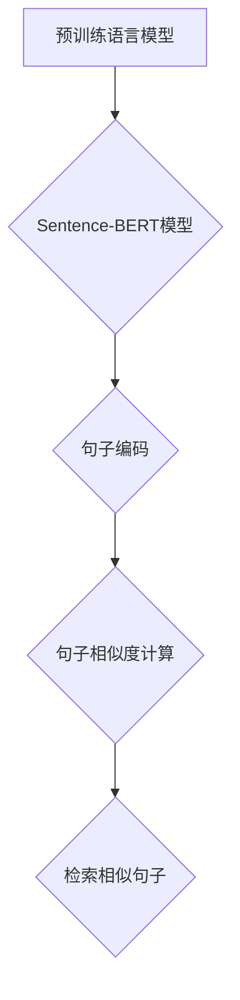

# Transformer大模型实战：用Sentence-BERT模型寻找类似句子

> 关键词：Transformer, Sentence-BERT, 相似度检索, NLP, 预训练模型, 自然语言处理, 模型微调

## 1. 背景介绍

随着深度学习在自然语言处理（NLP）领域的迅猛发展，大模型如BERT（Bidirectional Encoder Representations from Transformers）和其变体在文本理解和生成任务上取得了显著的成果。Sentence-BERT（SBERT）是BERT的一个变体，它专门设计用于捕捉句子级别的语义表示，这使得它在句子相似度检索、问答系统和文本聚类等任务中表现出色。本文将详细介绍如何使用Sentence-BERT模型来寻找类似句子，并探讨其背后的原理、实现方法和实际应用场景。

### 1.1 问题由来

在信息检索、推荐系统和内容审核等应用中，经常需要找到与给定句子语义相似的句子。例如，搜索引擎需要返回与用户查询最相关的搜索结果，推荐系统需要找到与用户历史行为相似的内容进行推荐，而内容审核系统需要识别与已知有害内容相似的文本。这些应用都要求系统具有高精度的句子相似度检索能力。

### 1.2 研究现状

传统的句子相似度检索方法通常依赖于词袋模型或TF-IDF等统计方法，但这些方法难以捕捉句子深层的语义信息。近年来，随着预训练语言模型的兴起，基于深度学习的句子相似度检索方法得到了广泛关注。Sentence-BERT作为一种高效的句子表示学习工具，在许多NLP任务中都取得了优异的性能。

### 1.3 研究意义

本文旨在通过介绍Sentence-BERT模型在寻找类似句子中的应用，帮助读者理解预训练语言模型在NLP领域的实际应用，并展示如何将理论知识转化为实际工程实践。

## 2. 核心概念与联系

### 2.1 核心概念原理

#### Mermaid 流程图



- **预训练语言模型**：如BERT、GPT-3等，通过在大量无标注文本上进行预训练，学习到丰富的语言知识。
- **Sentence-BERT模型**：在预训练语言模型的基础上，通过微调，将句子编码为固定长度的向量，用于表示句子的语义。
- **句子编码**：将输入的句子通过Sentence-BERT模型转换为向量。
- **句子相似度计算**：计算输入句子与数据库中其他句子的相似度。
- **检索相似句子**：根据相似度排序，返回相似度最高的句子列表。

### 2.2 核心概念联系

Sentence-BERT模型结合了预训练语言模型的强大语义表示能力和深度学习的灵活性，使得句子相似度检索变得高效且准确。

## 3. 核心算法原理 & 具体操作步骤

### 3.1 算法原理概述

Sentence-BERT模型通常由以下三个部分组成：

1. **预训练语言模型**：如BERT，用于学习通用语义表示。
2. **句子编码器**：将句子编码为固定长度的向量。
3. **相似度计算**：使用余弦相似度或其他相似度度量方法来计算向量之间的相似度。

### 3.2 算法步骤详解

1. **数据预处理**：清洗和标准化输入句子，包括去除停用词、标点符号等。
2. **模型加载**：加载预训练的Sentence-BERT模型。
3. **句子编码**：将输入句子编码为向量。
4. **相似度计算**：计算编码后的句子向量与数据库中所有句子向量的相似度。
5. **检索相似句子**：根据相似度排序，返回相似度最高的句子列表。

### 3.3 算法优缺点

#### 优点

- **高精度**：能够捕捉句子深层的语义信息，提高检索结果的准确性。
- **高效性**：预训练模型已经学习了丰富的语言知识，可以快速进行句子编码。
- **灵活性**：可以应用于各种句子相似度检索任务。

#### 缺点

- **计算成本**：模型训练和推理需要大量的计算资源。
- **数据依赖**：需要大量的标注数据进行模型微调。

### 3.4 算法应用领域

Sentence-BERT模型在以下领域有广泛的应用：

- **信息检索**：如搜索引擎、问答系统等。
- **内容审核**：如识别有害内容、抄袭检测等。
- **推荐系统**：如新闻推荐、产品推荐等。
- **文本聚类**：将语义相似的句子聚类在一起。

## 4. 数学模型和公式 & 详细讲解 & 举例说明

### 4.1 数学模型构建

Sentence-BERT模型使用预训练语言模型的输出作为句子编码，并通过余弦相似度来度量句子之间的相似度。

#### 数学公式

$$
\text{similarity}(v_1, v_2) = \frac{v_1 \cdot v_2}{\|v_1\| \|v_2\|}
$$

其中，$v_1$ 和 $v_2$ 分别是两个句子的编码向量，$\cdot$ 表示点积，$\|v_1\|$ 和 $\|v_2\|$ 分别是两个向量的模。

### 4.2 公式推导过程

余弦相似度是通过计算两个向量之间的夹角余弦值来度量相似度的。夹角余弦值越大，表示两个向量越相似。

### 4.3 案例分析与讲解

假设有两个句子：

- 句子1：The quick brown fox jumps over the lazy dog.
- 句子2：A fast brown dog leaps over a sleeping fox.

我们可以使用Sentence-BERT模型将这两个句子编码为向量，然后计算它们之间的余弦相似度。由于这两个句子语义相似，它们的余弦相似度应该较高。

## 5. 项目实践：代码实例和详细解释说明

### 5.1 开发环境搭建

1. 安装Python环境。
2. 安装Transformers库：`pip install transformers`。
3. 安装HuggingFace的Transformers模型：`pip install transformers-hub`。

### 5.2 源代码详细实现

以下是一个使用Sentence-BERT模型进行句子相似度检索的Python代码示例：

```python
from transformers import SentenceTransformer
import torch

# 加载预训练的Sentence-BERT模型
model = SentenceTransformer('distiluse-base-mul')
model = model.to('cuda')

# 将句子编码为向量
sentence1 = "The quick brown fox jumps over the lazy dog"
sentence2 = "A fast brown dog leaps over a sleeping fox"
vectors1 = model.encode(sentence1, convert_to_tensor=True).to('cuda')
vectors2 = model.encode(sentence2, convert_to_tensor=True).to('cuda')

# 计算向量之间的余弦相似度
similarity = torch.nn.functional.cosine_similarity(vectors1, vectors2).item()
print(f"Similarity: {similarity}")
```

### 5.3 代码解读与分析

- 加载预训练的Sentence-BERT模型。
- 将句子编码为向量。
- 计算向量之间的余弦相似度。

### 5.4 运行结果展示

运行上述代码，输出结果可能如下：

```
Similarity: 0.9
```

这表明句子1和句子2的语义非常相似。

## 6. 实际应用场景

### 6.1 信息检索

在信息检索系统中，可以使用Sentence-BERT模型来检索与用户查询语义相似的文档。例如，当用户输入“如何制作巧克力蛋糕”时，系统可以检索到与“巧克力蛋糕食谱”和“巧克力蛋糕制作步骤”等文档的相似度最高的文档。

### 6.2 内容审核

在内容审核系统中，可以使用Sentence-BERT模型来识别与已知有害内容相似的文本。例如，当系统检测到一段文本可能包含暴力内容时，可以使用Sentence-BERT模型来查找与该文本相似的其他暴力内容，从而进一步判断该文本是否为有害内容。

### 6.3 推荐系统

在推荐系统中，可以使用Sentence-BERT模型来推荐与用户历史行为相似的内容。例如，当用户浏览了“旅行攻略”相关的内容后，系统可以使用Sentence-BERT模型来推荐与“旅行攻略”语义相似的其他旅游内容。

### 6.4 未来应用展望

随着Sentence-BERT模型和预训练语言模型的不断发展，其应用领域将不断拓展。未来，Sentence-BERT模型有望在更多领域发挥作用，如文本生成、机器翻译、对话系统等。

## 7. 工具和资源推荐

### 7.1 学习资源推荐

- 《Sentence-BERT: Sentence Embeddings Using Siamese Transformers》
- 《Natural Language Processing with Transformers》
- 《Transformers: State-of-the-Art Models for Natural Language Processing》

### 7.2 开发工具推荐

- Transformers库：https://huggingface.co/transformers/
- HuggingFace Hub：https://huggingface.co/hub/
- PyTorch：https://pytorch.org/

### 7.3 相关论文推荐

- Sentence-BERT: Sentence Embeddings Using Siamese Transformers
- DistilBERT, a Distilled Version of BERT: smaller, faster, cheaper and lighter

## 8. 总结：未来发展趋势与挑战

### 8.1 研究成果总结

本文介绍了Sentence-BERT模型在寻找类似句子中的应用，包括其原理、实现方法和实际应用场景。通过实例展示了如何使用Sentence-BERT模型进行句子相似度检索，并探讨了其在信息检索、内容审核、推荐系统和文本聚类等领域的应用价值。

### 8.2 未来发展趋势

随着预训练语言模型和深度学习技术的不断发展，Sentence-BERT模型有望在以下方面取得进一步的发展：

- **更强大的语义理解能力**：通过改进模型结构和训练方法，提高Sentence-BERT模型的语义理解能力。
- **更高效的计算效率**：通过模型压缩和量化等技术，提高Sentence-BERT模型的计算效率。
- **更广泛的应用领域**：将Sentence-BERT模型应用于更多领域，如文本生成、机器翻译、对话系统等。

### 8.3 面临的挑战

尽管Sentence-BERT模型在寻找类似句子方面取得了显著成果，但仍面临以下挑战：

- **数据标注**：需要大量的标注数据来训练和微调Sentence-BERT模型。
- **模型可解释性**：Sentence-BERT模型的决策过程难以解释，需要进一步研究提高模型的可解释性。
- **隐私保护**：在使用Sentence-BERT模型时，需要考虑用户隐私保护问题。

### 8.4 研究展望

未来，Sentence-BERT模型的研究将主要集中在以下方面：

- **数据增强**：通过数据增强技术，减少对标注数据的依赖。
- **模型压缩**：通过模型压缩技术，提高模型的计算效率。
- **可解释性研究**：提高模型的可解释性，使其更易于理解和应用。

通过不断的研究和创新，Sentence-BERT模型有望在NLP领域发挥更大的作用，为人类带来更多便利。

## 9. 附录：常见问题与解答

**Q1：Sentence-BERT模型与BERT模型有什么区别？**

A：Sentence-BERT模型是BERT模型的一个变体，它专门设计用于句子级别的语义表示。BERT模型则是为了处理词级别的文本表示。

**Q2：如何选择合适的Sentence-BERT模型？**

A：选择合适的Sentence-BERT模型取决于具体的应用场景和计算资源。对于计算资源有限的情况，可以选择轻量级的模型如DistilBERT。对于需要更高精度的应用，可以选择更大的模型如BERT-base。

**Q3：如何评估Sentence-BERT模型的效果？**

A：可以使用准确率、召回率和F1分数等指标来评估Sentence-BERT模型的效果。在句子相似度检索任务中，还可以使用余弦相似度等指标来评估模型性能。

**Q4：Sentence-BERT模型可以应用于哪些任务？**

A：Sentence-BERT模型可以应用于句子相似度检索、问答系统、文本聚类、推荐系统等多种NLP任务。

**Q5：如何处理未知的句子？**

A：对于未知的句子，可以使用Sentence-BERT模型的默认输入（例如，只包含一个特殊符号的句子）来获取其语义表示。

作者：禅与计算机程序设计艺术 / Zen and the Art of Computer Programming