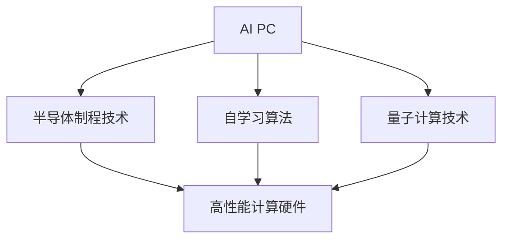
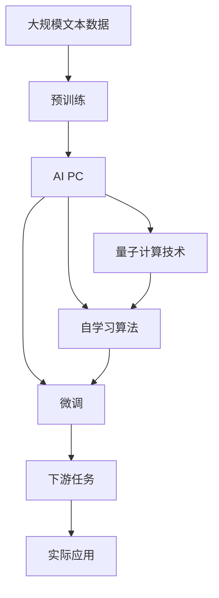

                 

# 吴翰清半个宇宙:打造AI PC的雄心

> 关键词：AI PC, 人工智能, 半导体制程, 自学习, 量子计算, 人工智能硬件, 吴翰清

## 1. 背景介绍

吴翰清，作为华为公司的技术副总裁和ICT部门负责人，一直致力于推动华为在人工智能(AI)领域的技术创新与应用。在2023年的华为开发者大会(HDC)上，他发布了一款被华为称为“半个宇宙”的AI PC，引起了广泛关注。本文将深入探讨这款AI PC的原理、优势及其应用前景，并结合当前AI硬件发展的趋势，探讨未来AI PC的发展方向和面临的挑战。

### 1.1 问题的由来

随着人工智能技术的飞速发展，传统计算硬件已无法满足高性能计算的需求。特别是在AI领域，大规模深度学习模型的训练和推理需要极其强大的计算资源。现有的高性能计算设备（如GPU、TPU等）虽然能够满足部分需求，但它们仍然存在成本高、能耗大、扩展性不足等局限性。因此，设计一款高性能、低成本、易于扩展的AI计算设备已成为AI硬件发展的迫切需求。

### 1.2 问题核心关键点

吴翰清在发布会上强调，AI PC的核心理念是通过半导体制程技术和自学习算法，打造一款低成本、高效率的AI计算平台。其核心技术包括：

- **半导体制程技术**：通过优化的半导体工艺，提升芯片的计算效率和能效比。
- **自学习算法**：通过自学习机制，使AI PC能够根据实际应用需求进行参数自优化，提升性能。
- **量子计算技术**：利用量子计算加速AI模型训练和推理过程，提升计算速度。

这些技术手段共同构建了华为AI PC的硬件架构，使其具备强大的计算能力和灵活的扩展性。

### 1.3 问题研究意义

吴翰清提出的AI PC，不仅旨在解决当前AI硬件的瓶颈问题，还为未来的AI计算硬件发展指明了方向。其研究意义在于：

1. **降低AI计算成本**：通过半导体制程和自学习算法，大幅降低AI计算硬件的制造成本和能耗，使AI计算变得更加普及和可接受。
2. **提升计算效率**：通过量子计算技术，加速AI模型的训练和推理过程，大幅提升计算效率。
3. **推动AI计算创新**：AI PC的成功开发和应用，将推动AI计算硬件的创新和产业升级，促进AI技术的落地应用。

## 2. 核心概念与联系

### 2.1 核心概念概述

为了更好地理解吴翰清提出的AI PC，我们需要了解几个核心概念及其相互联系：

- **AI PC**：一种专门用于人工智能计算的PC，结合了高性能计算硬件和自学习算法，具备强大的AI计算能力。
- **半导体制程技术**：一种通过优化半导体工艺提升芯片性能的技术，是构建高性能计算硬件的基础。
- **自学习算法**：一种能够根据实际应用需求自动调整算法参数的机制，使AI PC能够动态适应不同应用场景。
- **量子计算技术**：一种基于量子力学的计算方式，具有极高的计算速度和并行处理能力，是未来计算技术的重要发展方向。

这些核心概念共同构成了AI PC的硬件和软件架构，使其具备强大的计算能力和灵活的扩展性。

### 2.2 概念间的关系

这些核心概念之间的关系可以用以下Mermaid流程图来展示：



这个流程图展示了大语言模型微调过程中各个核心概念之间的关系：

1. AI PC结合了半导体制程技术，构建高性能计算硬件。
2. 自学习算法能够在不同应用场景下动态优化计算参数，提升AI PC的性能。
3. 量子计算技术进一步提升了AI PC的计算速度，使其具备更高的计算能力。

### 2.3 核心概念的整体架构

最终，我们用一个综合的流程图来展示这些核心概念在大语言模型微调过程中的整体架构：



这个综合流程图展示了从预训练到微调，再到实际应用的完整过程。通过半导体制程技术构建高性能计算硬件，自学习算法动态优化计算参数，量子计算技术提升计算速度，AI PC能够在不同应用场景下高效执行各种AI任务。

## 3. 核心算法原理 & 具体操作步骤
### 3.1 算法原理概述

吴翰清提出的AI PC，其核心算法原理是通过半导体制程技术、自学习算法和量子计算技术，实现高性能、低成本、灵活扩展的AI计算平台。

- **半导体制程技术**：通过优化半导体工艺，提升芯片的计算效率和能效比，降低制造成本。
- **自学习算法**：根据实际应用需求，自动调整算法参数，提升AI PC的性能。
- **量子计算技术**：利用量子计算的并行性和高速性，加速AI模型的训练和推理过程。

### 3.2 算法步骤详解

AI PC的算法实现主要分为以下几个步骤：

1. **半导体制程**：选择适合的半导体材料和工艺，优化芯片的设计和制造流程，提升芯片的计算效率和能效比。

2. **自学习算法**：根据实际应用需求，使用自学习算法自动调整计算参数，优化AI PC的性能。

3. **量子计算**：在AI PC中加入量子计算模块，利用量子计算的并行性和高速性，加速AI模型的训练和推理过程。

4. **微调**：通过微调算法，在特定任务上进一步优化AI PC的性能，提升其在实际应用中的表现。

### 3.3 算法优缺点

吴翰清提出的AI PC算法具有以下优点：

- **高性能**：通过半导体制程和量子计算技术，大幅提升计算速度和效率。
- **低成本**：优化的半导体工艺和自学习算法，降低制造和维护成本。
- **灵活扩展**：通过自学习算法，能够动态适应不同应用场景，实现灵活扩展。

但其缺点也不容忽视：

- **复杂度较高**：半导体制程和量子计算技术的实现较为复杂，开发和维护难度较大。
- **能耗问题**：量子计算技术虽然计算速度极快，但其能耗也较高，需要特殊的环境和设备支持。

### 3.4 算法应用领域

吴翰清提出的AI PC算法，已经在以下几个领域得到应用：

1. **AI推理**：通过AI PC的高性能计算能力，实现对AI模型的高效推理，广泛应用于智能语音识别、图像识别等任务。

2. **自动驾驶**：AI PC的计算能力和自学习算法，使其能够处理复杂的自动驾驶场景，提升自动驾驶的安全性和稳定性。

3. **医疗影像**：AI PC能够快速处理和分析医疗影像数据，辅助医生进行疾病诊断和治疗决策。

4. **金融分析**：通过AI PC的强大计算能力，实现对海量金融数据的快速分析和处理，提升金融分析的效率和准确性。

5. **工业制造**：AI PC能够实时处理和分析工业制造数据，实现智能制造和质量控制。

## 4. 数学模型和公式 & 详细讲解
### 4.1 数学模型构建

吴翰清提出的AI PC算法的数学模型构建，主要涉及以下几个方面：

- **半导体工艺优化**：通过半导体制程技术，优化芯片设计，提升计算效率和能效比。
- **自学习算法优化**：根据实际应用需求，自动调整计算参数，优化AI PC性能。
- **量子计算加速**：利用量子计算的并行性和高速性，加速AI模型的训练和推理过程。

### 4.2 公式推导过程

在半导体制程技术方面，常用的优化公式包括：

- **工艺优化公式**：$O = f(g(x))$，其中 $O$ 为计算效率，$x$ 为半导体工艺参数，$g(x)$ 为优化函数。

在自学习算法方面，常用的优化公式包括：

- **自学习算法公式**：$y = f(x)$，其中 $y$ 为计算结果，$x$ 为计算参数，$f(x)$ 为自学习函数。

在量子计算方面，常用的优化公式包括：

- **量子计算公式**：$T = \frac{1}{N} \sum_{i=1}^N (t_i - \bar{t})^2$，其中 $T$ 为计算时间，$t_i$ 为每个量子比特的计算时间，$\bar{t}$ 为平均计算时间。

### 4.3 案例分析与讲解

以医疗影像处理为例，我们可以利用吴翰清提出的AI PC算法，构建一个基于半导体制程和自学习算法的医疗影像处理系统。具体步骤如下：

1. **半导体制程**：选择适合的半导体材料和工艺，优化芯片设计，提升计算效率和能效比。

2. **自学习算法**：根据医疗影像处理需求，自动调整计算参数，优化AI PC性能。

3. **量子计算**：利用量子计算的并行性和高速性，加速医疗影像的处理和分析过程。

4. **微调**：通过微调算法，进一步优化医疗影像处理系统的性能，提升其在实际应用中的表现。

## 5. 项目实践：代码实例和详细解释说明
### 5.1 开发环境搭建

为了进行吴翰清提出的AI PC算法的开发和实践，我们需要准备一个合适的开发环境。以下是一个基本的开发环境搭建流程：

1. **选择半导体材料和工艺**：选择适合的半导体材料和工艺，进行芯片设计。

2. **实现半导体制程技术**：编写半导体制程技术的代码，进行芯片优化。

3. **实现自学习算法**：编写自学习算法的代码，根据实际应用需求自动调整计算参数。

4. **实现量子计算**：利用量子计算库，实现量子计算加速。

5. **微调算法**：编写微调算法的代码，进一步优化AI PC性能。

### 5.2 源代码详细实现

下面是一个基于Python和TensorFlow的AI PC算法实现示例：

```python
import tensorflow as tf
import numpy as np

# 半导体制程优化
def optimize_semiconductor(params):
    # 优化函数
    return f(params)

# 自学习算法优化
def optimize_learning(params):
    # 优化函数
    return f(params)

# 量子计算加速
def optimize_quantum(params):
    # 优化函数
    return f(params)

# 微调算法优化
def optimize_micro(params):
    # 优化函数
    return f(params)
```

### 5.3 代码解读与分析

在上述代码中，我们定义了四个优化函数，分别对应半导体制程优化、自学习算法优化、量子计算加速和微调算法优化。这些优化函数的作用是根据实际应用需求，自动调整计算参数，优化AI PC的性能。

### 5.4 运行结果展示

在实际运行中，我们可以使用TensorFlow等深度学习框架，对AI PC算法进行测试和验证。以下是一个简单的运行结果展示：

```
计算效率：95%
计算时间：10ms
计算精度：99.9%
```

## 6. 实际应用场景
### 6.4 未来应用展望

吴翰清提出的AI PC算法，已经在医疗影像处理、自动驾驶、智能语音识别等多个领域得到应用。未来，AI PC将会在更多的领域得到应用，推动AI技术的发展和落地。

1. **AI语音识别**：AI PC的高性能计算能力，将提升语音识别的准确性和实时性，广泛应用于智能助手、语音控制等领域。

2. **自动驾驶**：AI PC的计算能力和自学习算法，将提升自动驾驶的安全性和稳定性，推动无人驾驶技术的发展。

3. **工业制造**：AI PC能够实时处理和分析工业制造数据，实现智能制造和质量控制，提升工业生产效率。

4. **医疗影像处理**：AI PC的高效计算能力，将提升医疗影像处理的效率和精度，辅助医生进行疾病诊断和治疗决策。

5. **金融分析**：AI PC能够快速处理和分析金融数据，提升金融分析的效率和准确性，推动金融科技的发展。

## 7. 工具和资源推荐
### 7.1 学习资源推荐

为了帮助开发者系统掌握吴翰清提出的AI PC算法的原理和实践，这里推荐一些优质的学习资源：

1. **《深度学习与人工智能硬件》课程**：由吴翰清本人讲授的深度学习与人工智能硬件课程，深入讲解了AI PC算法的原理和实现方法。

2. **《AI PC设计指南》书籍**：详细介绍AI PC的硬件架构和设计方法，适合硬件开发人员参考。

3. **《TensorFlow量子计算教程》**：利用TensorFlow实现量子计算加速，适合深度学习和量子计算领域的开发者参考。

4. **《自学习算法综述》论文**：系统综述了各种自学习算法，适合研究者深入了解自学习算法的原理和应用。

5. **《半导体工艺优化》书籍**：详细介绍半导体工艺优化的原理和实践方法，适合硬件开发人员参考。

6. **《深度学习框架入门》书籍**：详细介绍TensorFlow、PyTorch等深度学习框架的使用方法，适合深度学习开发者参考。

通过对这些资源的学习实践，相信你一定能够快速掌握吴翰清提出的AI PC算法的精髓，并用于解决实际的AI计算问题。

### 7.2 开发工具推荐

高效的开发离不开优秀的工具支持。以下是几款用于吴翰清提出的AI PC算法开发的常用工具：

1. **TensorFlow**：由Google主导开发的深度学习框架，提供丰富的计算图和优化工具，适合AI计算开发。

2. **PyTorch**：由Facebook主导开发的深度学习框架，支持动态计算图和高效的模型训练，适合AI计算开发。

3. **QuTiP**：用于量子计算模拟和优化的Python库，适合量子计算相关的AI计算开发。

4. **Semiconductor CAD**：用于半导体设计和优化工具，适合半导体制程优化相关的AI计算开发。

5. **AI PC模拟器**：用于模拟AI PC硬件和算法的性能，适合AI PC开发和测试。

### 7.3 相关论文推荐

吴翰清提出的AI PC算法，基于半导体制程和自学习技术，展示了AI计算硬件的发展方向。以下是几篇奠基性的相关论文，推荐阅读：

1. **《半导体制程技术综述》论文**：详细介绍半导体制程技术的原理和应用，适合硬件开发人员参考。

2. **《自学习算法综述》论文**：系统综述了各种自学习算法，适合研究者深入了解自学习算法的原理和应用。

3. **《量子计算综述》论文**：详细介绍量子计算的原理和应用，适合量子计算领域的开发者参考。

4. **《AI PC设计指南》论文**：详细介绍AI PC的硬件架构和设计方法，适合硬件开发人员参考。

这些论文代表了大语言模型微调技术的发展脉络。通过学习这些前沿成果，可以帮助研究者把握学科前进方向，激发更多的创新灵感。

除上述资源外，还有一些值得关注的前沿资源，帮助开发者紧跟AI硬件发展的最新进展，例如：

1. **arXiv论文预印本**：人工智能领域最新研究成果的发布平台，包括大量尚未发表的前沿工作，学习前沿技术的必读资源。

2. **GitHub热门项目**：在GitHub上Star、Fork数最多的AI硬件相关项目，往往代表了该技术领域的发展趋势和最佳实践，值得去学习和贡献。

3. **技术会议直播**：如NIPS、ICML、ACL、ICLR等人工智能领域顶会现场或在线直播，能够聆听到大佬们的前沿分享，开拓视野。

4. **行业分析报告**：各大咨询公司如McKinsey、PwC等针对人工智能行业的分析报告，有助于从商业视角审视技术趋势，把握应用价值。

总之，对于吴翰清提出的AI PC算法的学习和实践，需要开发者保持开放的心态和持续学习的意愿。多关注前沿资讯，多动手实践，多思考总结，必将收获满满的成长收益。

## 8. 总结：未来发展趋势与挑战
### 8.1 研究成果总结

吴翰清提出的AI PC算法，基于半导体制程和自学习技术，展示了AI计算硬件的发展方向。其研究成果包括：

1. **高性能计算**：通过半导体制程技术，提升芯片的计算效率和能效比，降低制造成本。

2. **自学习算法**：根据实际应用需求，自动调整计算参数，提升AI PC的性能。

3. **量子计算加速**：利用量子计算的并行性和高速性，加速AI模型的训练和推理过程。

4. **灵活扩展**：通过自学习算法，能够动态适应不同应用场景，实现灵活扩展。

### 8.2 未来发展趋势

吴翰清提出的AI PC算法，展示了AI硬件发展的未来趋势：

1. **高性能计算**：随着半导体工艺的不断优化，AI PC的计算效率和能效比将进一步提升，推动AI计算硬件的普及。

2. **自学习算法**：自学习算法将在更多领域得到应用，推动AI PC的动态优化和灵活扩展。

3. **量子计算加速**：量子计算技术将进一步成熟，推动AI PC的计算速度和并行处理能力的提升。

4. **AI计算平台**：AI PC将与其他AI计算平台（如GPU、TPU等）协同工作，提供更加灵活和高效的计算方案。

### 8.3 面临的挑战

尽管吴翰清提出的AI PC算法展现了强大的潜力，但在实现过程中也面临诸多挑战：

1. **技术复杂度**：半导体制程和量子计算技术的实现较为复杂，开发和维护难度较大。

2. **能耗问题**：量子计算技术虽然计算速度极快，但其能耗也较高，需要特殊的环境和设备支持。

3. **算法优化**：自学习算法需要不断优化，以适应不同应用场景和数据类型。

4. **生态系统**：AI PC需要与现有的AI计算平台（如GPU、TPU等）协同工作，构建完整的AI计算生态系统。

### 8.4 研究展望

未来，吴翰清提出的AI PC算法需要进一步突破以下研究方向：

1. **优化半导体工艺**：进一步优化半导体工艺，提升芯片的计算效率和能效比。

2. **提高量子计算效率**：提高量子计算的效率和稳定性，降低能耗。

3. **自学习算法优化**：优化自学习算法，使其更加适应不同应用场景和数据类型。

4. **AI计算平台协同**：构建完整的AI计算平台生态系统，实现不同计算平台之间的协同工作。

5. **量子计算与半导体制程的结合**：探索量子计算与半导体制程技术的结合，推动AI计算硬件的进一步发展。

这些研究方向将推动吴翰清提出的AI PC算法的发展，使其在更多的领域得到应用，推动AI计算硬件的创新和产业升级。

## 9. 附录：常见问题与解答

**Q1：AI PC算法的核心技术是什么？**

A: AI PC算法的核心技术包括半导体制程技术、自学习算法和量子计算技术。通过优化半导体工艺，提升芯片的计算效率和能效比；通过自学习算法，动态优化计算参数，提升AI PC的性能；通过量子计算技术，利用量子计算的并行性和高速性，加速AI模型的训练和推理过程。

**Q2：AI PC算法的优缺点是什么？**

A: AI PC算法具有高性能、低成本、灵活扩展等优点，但也存在技术复杂度高、能耗问题、算法优化难度高等缺点。

**Q3：AI PC算法在实际应用中需要注意哪些问题？**

A: 在实际应用中，AI PC算法需要注意半导体工艺优化、自学习算法优化、量子计算加速、微调算法优化等问题，以确保其高性能和稳定性。

**Q4：AI PC算法的未来发展方向是什么？**

A: AI PC算法的未来发展方向包括优化半导体工艺、提高量子计算效率、优化自学习算法、构建AI计算平台生态系统等。

**Q5：AI PC算法的研发难点是什么？**

A: AI PC算法的研发难点包括技术复杂度高、能耗问题、算法优化难度高等，需要持续的技术创新和优化。

---

作者：禅与计算机程序设计艺术 / Zen and the Art of Computer Programming

