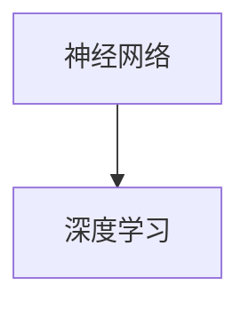
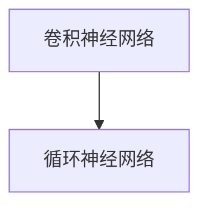
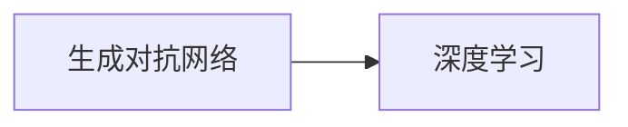

                 

# 图灵奖与AI算法的突破

## 1. 背景介绍

### 1.1 图灵奖

图灵奖（Turing Award）是计算机科学界的最高荣誉，由美国计算机协会（ACM）每年颁发一次，旨在表彰那些对计算机科学和相关领域做出卓越贡献的个人。该奖项自1966年设立以来，已表彰了数百位杰出的科学家和工程师。图灵奖的设立，不仅是对获奖者的肯定，更是对整个计算机科学领域的推动，促进了技术的进步和应用的广泛。

图灵奖的获奖者涵盖了从算法设计到人工智能（AI）的各个方面，他们的工作为计算机科学的发展奠定了坚实基础。在AI领域，图灵奖尤其突出，许多奖项都集中在机器学习、深度学习、自然语言处理等前沿技术上。这些技术的发展，不仅推动了人工智能的进步，也为社会带来了深远影响，如自动驾驶、语音识别、自然语言处理等应用。

### 1.2 AI算法的发展历程

人工智能算法的突破，始于20世纪50年代中期。最早的AI算法，基于符号推理，通过规则和知识库进行推理和决策。然而，这种方法在处理复杂问题时，表现力有限，难以推广应用。1980年代，神经网络的兴起，使得AI算法迈向了一个新的阶段。神经网络能够模拟人脑的神经元，通过大量的数据训练，进行复杂的模式识别和分类。1998年，深蓝计算机在IBM的计算机科学家沃特曼的带领下，战胜了国际象棋世界冠军卡斯帕罗夫，标志着AI算法的一次重大突破。

随后，随着深度学习（Deep Learning）的兴起，AI算法进入了一个全新的时代。深度学习通过多层次的神经网络结构，能够自动学习复杂的特征表示，在图像识别、语音识别、自然语言处理等领域取得了巨大的成功。2012年，AlexNet在ImageNet图像识别比赛中获胜，标志着深度学习时代的来临。自那以后，深度学习算法不断演进，越来越多的应用领域被成功部署，如计算机视觉、语音识别、自然语言处理等。

## 2. 核心概念与联系

### 2.1 核心概念概述

在AI算法的突破过程中，涌现出许多核心概念，这些概念相互联系，共同构成了AI算法的理论基础和实践方法。以下是几个关键概念：

- **神经网络（Neural Network）**：一种模拟人脑神经元的网络结构，通过大量数据训练，进行特征学习和模式识别。
- **深度学习（Deep Learning）**：一种基于神经网络的机器学习技术，能够自动学习多层次的特征表示，适用于处理复杂的非线性问题。
- **卷积神经网络（Convolutional Neural Network, CNN）**：一种特殊的神经网络，用于图像识别和处理，具有局部连接和权值共享的特点。
- **循环神经网络（Recurrent Neural Network, RNN）**：一种能够处理序列数据的神经网络，适用于自然语言处理和时间序列预测等任务。
- **卷积神经网络-循环神经网络（CNN-RNN）**：结合了CNN和RNN的特点，能够处理时序和空间信息，适用于视频、音频等多模态数据的处理。
- **生成对抗网络（Generative Adversarial Network, GAN）**：一种由生成器和判别器组成的框架，能够生成逼真的数据，如图像、语音等。

### 2.2 概念间的关系

这些核心概念之间存在着紧密的联系，形成了AI算法的完整生态系统。以下通过几个Mermaid流程图来展示这些概念之间的关系。

#### 2.2.1 神经网络与深度学习的关系



这个流程图展示了神经网络与深度学习的关系。深度学习是基于神经网络的一种机器学习技术，能够自动学习多层次的特征表示，适用于处理复杂的非线性问题。

#### 2.2.2 卷积神经网络与循环神经网络的关系



这个流程图展示了卷积神经网络与循环神经网络的关系。CNN和RNN各有其特点，CNN适用于图像识别和处理，RNN适用于自然语言处理和时间序列预测等任务。CNN-RNN结合了两者优点，适用于处理多模态数据。

#### 2.2.3 生成对抗网络与深度学习的关系



这个流程图展示了生成对抗网络与深度学习的关系。GAN是一种由生成器和判别器组成的框架，能够生成逼真的数据，如图像、语音等。GAN技术属于深度学习的一部分，能够进一步拓展深度学习的应用范围。

### 2.3 核心概念的整体架构

最后，我们用一个综合的流程图来展示这些核心概念在大规模AI算法突破过程中的整体架构：

```mermaid
graph TB
    A[大规模数据] --> B[神经网络] --> C[深度学习] --> D[卷积神经网络] --> E[循环神经网络] --> F[卷积神经网络-循环神经网络]
    A --> G[卷积神经网络] --> H[生成对抗网络]
    B --> I[自然语言处理] --> J[图像识别]
    C --> K[时间序列预测]
    D --> L[多模态数据处理]
    F --> M[视频分析]
    G --> N[语音识别]
    H --> O[数据生成]
    I --> P[自然语言生成]
    J --> Q[计算机视觉]
    K --> R[预测]
    L --> S[情感分析]
    M --> T[行为分析]
    N --> U[语音合成]
    O --> V[文本生成]
    P --> W[摘要生成]
    Q --> X[目标检测]
    R --> Y[推荐系统]
    S --> Z[聊天机器人]
    T --> $[智能客服]
    U --> &[视频生成]
    V --> &[图像生成]
    W --> &[文本生成]
    X --> &[物体识别]
    Y --> &[商品推荐]
    Z --> &[智能家居]
    $ --> &[智能交通]
    [&] --> [][[与其他AI技术的结合]]
```

这个综合流程图展示了从大规模数据到最终应用的整个过程。在大规模数据的基础上，通过神经网络和深度学习技术，训练卷积神经网络、循环神经网络等模型，用于自然语言处理、图像识别、时间序列预测等任务。同时，生成对抗网络能够生成逼真的数据，进一步拓展深度学习的应用范围。最终，这些技术结合其他AI技术，应用于视频分析、语音识别、智能客服等多个领域。

## 3. 核心算法原理 & 具体操作步骤

### 3.1 算法原理概述

AI算法的核心原理是构建一个高效的模型，能够通过大量数据训练，进行特征学习、模式识别和决策。模型通常基于神经网络结构，通过反向传播算法（Backpropagation）进行优化，最小化损失函数，使得模型的输出逼近真实标签。以下是对AI算法核心原理的概述。

**神经网络**：由多个神经元（Node）组成的网络结构，能够接收输入，通过加权和、非线性激活函数等处理后，输出结果。神经网络通常包含输入层、隐藏层和输出层，每个神经元都与上一层的所有神经元相连。

**深度学习**：通过多层神经网络结构，能够自动学习多层次的特征表示，适用于处理复杂的非线性问题。深度学习算法包括卷积神经网络（CNN）、循环神经网络（RNN）、生成对抗网络（GAN）等。

**反向传播算法**：通过计算模型输出与真实标签之间的误差（Loss Function），反向传播误差，更新模型的权重参数，以最小化损失函数。反向传播算法是深度学习中常用的优化算法，能够高效训练大规模神经网络模型。

**梯度下降**：通过计算梯度（Gradient），逐次逼近最优解的过程。梯度下降算法能够高效优化模型的损失函数，使得模型输出逼近真实标签。

**参数初始化**：在模型训练之前，需要对模型的参数进行初始化。常用的初始化方法包括随机初始化、Xavier初始化、He初始化等。

### 3.2 算法步骤详解

AI算法的训练过程通常包含以下几个步骤：

**Step 1: 数据准备**：收集和预处理大规模数据集，包括图像、音频、文本等数据。数据集需要经过标注和清洗，去除噪声和异常值，保证数据的质量。

**Step 2: 构建模型**：选择合适的神经网络结构和深度学习算法，构建模型。模型通常包含输入层、隐藏层和输出层，每个神经元都与上一层的所有神经元相连。

**Step 3: 模型训练**：使用反向传播算法（Backpropagation）和梯度下降（Gradient Descent）算法，对模型进行训练。通过多次迭代，最小化损失函数，更新模型的权重参数。

**Step 4: 模型评估**：在测试集上评估模型性能，计算准确率、召回率、F1分数等指标，评估模型效果。

**Step 5: 模型部署**：将训练好的模型部署到实际应用中，进行推理和预测。

### 3.3 算法优缺点

**优点**：
- 能够处理大规模数据集，自动学习复杂特征。
- 通过反向传播算法（Backpropagation）和梯度下降（Gradient Descent）算法，高效优化模型。
- 能够应用于自然语言处理、图像识别、语音识别等多个领域。

**缺点**：
- 需要大量标注数据进行训练，标注成本较高。
- 模型复杂度高，训练时间长，计算资源消耗较大。
- 模型容易出现过拟合，需要复杂的正则化方法进行优化。

### 3.4 算法应用领域

AI算法广泛应用于各个领域，以下是几个主要的应用领域：

- **自然语言处理（NLP）**：包括机器翻译、情感分析、文本分类、问答系统等任务。通过深度学习算法，能够自动处理和理解自然语言。

- **计算机视觉（CV）**：包括图像识别、物体检测、目标跟踪等任务。通过卷积神经网络（CNN）和生成对抗网络（GAN），能够高效处理和生成图像数据。

- **语音识别（ASR）**：包括语音转文本、语音合成等任务。通过循环神经网络（RNN）和深度学习算法，能够高效处理和生成语音数据。

- **推荐系统（Recommendation System）**：包括商品推荐、视频推荐等任务。通过深度学习算法，能够预测用户兴趣，进行推荐。

- **时间序列预测（TSP）**：包括股票预测、气象预测等任务。通过循环神经网络（RNN）和深度学习算法，能够预测时间序列数据。

- **生成对抗网络（GAN）**：包括图像生成、视频生成等任务。通过生成对抗网络（GAN），能够生成逼真的图像和视频数据。

## 4. 数学模型和公式 & 详细讲解 & 举例说明

### 4.1 数学模型构建

以下是对AI算法数学模型的构建和推导。

**神经网络模型**：

假设神经网络模型由输入层、隐藏层和输出层组成，模型参数为 $\theta$，输入数据为 $x$，输出结果为 $y$。模型的前向传播过程如下：

$$
y = \sigma(\sum_{i=1}^{n}w_i x_i + b)
$$

其中 $\sigma$ 为激活函数，$w_i$ 为权重参数，$b$ 为偏置项。

**深度学习模型**：

假设深度学习模型包含 $L$ 层神经网络，模型参数为 $\theta$，输入数据为 $x$，输出结果为 $y$。模型的前向传播过程如下：

$$
y = \sigma_L(\sum_{i=1}^{n}w_{L,i} \sigma_{L-1}(\sum_{i=1}^{n}w_{L-1,i} \sigma_{L-2}(\sum_{i=1}^{n}w_{L-2,i} \sigma_{L-3}(\ldots \sigma_1(\sum_{i=1}^{n}w_{1,i} x_i + b_1) + b_2) + \ldots + b_L)
$$

其中 $\sigma$ 为激活函数，$w_{L,i}$ 为权重参数，$b_i$ 为偏置项。

### 4.2 公式推导过程

**神经网络模型的损失函数**：

假设神经网络模型的损失函数为 $L(y, \hat{y})$，表示模型输出与真实标签之间的误差。常用的损失函数包括均方误差（MSE）、交叉熵（Cross-Entropy）等。

以均方误差损失函数为例，其公式如下：

$$
L(y, \hat{y}) = \frac{1}{N}\sum_{i=1}^{N}(y_i - \hat{y}_i)^2
$$

其中 $y_i$ 为真实标签，$\hat{y}_i$ 为模型输出。

**反向传播算法**：

通过计算模型输出与真实标签之间的误差（Loss Function），反向传播误差，更新模型的权重参数，以最小化损失函数。

假设神经网络模型包含 $L$ 层，每层包含 $n$ 个神经元。则反向传播算法的过程如下：

1. 计算输出层的误差，$\delta_L = L'(y, \hat{y})$
2. 计算隐藏层的误差，$\delta_{L-1} = \sigma_{L-1}'(z_{L-1}) \cdot \delta_L \cdot w_{L-1}'$
3. 更新输出层的权重参数，$w_L \leftarrow w_L - \eta \cdot \delta_L \cdot x$
4. 更新隐藏层的权重参数，$w_{L-1} \leftarrow w_{L-1} - \eta \cdot \delta_{L-1} \cdot x_{L-1}^T$
5. 重复步骤1-4，直到损失函数最小化。

其中 $\sigma'$ 为激活函数的导数，$z_{L-1} = w_{L-1} \cdot x_{L-1} + b_{L-1}$。

### 4.3 案例分析与讲解

**图像识别案例**：

假设有一个手写数字识别任务，训练集包含 $N$ 个手写数字图片，每个图片大小为 $H \times W$。图片像素值 $x_{i,j}$ 为 $[0,1]$ 之间的灰度值。

1. 将图片转换为向量表示，$x_i \in R^{H \times W}$
2. 构建一个全连接神经网络，包含 $L$ 层，每层 $n$ 个神经元
3. 将 $x_i$ 输入模型，得到输出 $\hat{y}_i$
4. 计算均方误差损失函数 $L(y_i, \hat{y}_i)$
5. 使用反向传播算法，更新模型参数 $\theta$
6. 重复步骤3-5，直到模型收敛。

## 5. 项目实践：代码实例和详细解释说明

### 5.1 开发环境搭建

在进行AI算法实践前，我们需要准备好开发环境。以下是使用Python进行TensorFlow开发的环境配置流程：

1. 安装Anaconda：从官网下载并安装Anaconda，用于创建独立的Python环境。

2. 创建并激活虚拟环境：
```bash
conda create -n tf-env python=3.8 
conda activate tf-env
```

3. 安装TensorFlow：根据CUDA版本，从官网获取对应的安装命令。例如：
```bash
conda install tensorflow -c pytorch -c conda-forge
```

4. 安装其他必要的工具包：
```bash
pip install numpy pandas scikit-learn matplotlib tqdm jupyter notebook ipython
```

完成上述步骤后，即可在`tf-env`环境中开始AI算法实践。

### 5.2 源代码详细实现

下面以手写数字识别任务为例，给出使用TensorFlow实现卷积神经网络（CNN）的代码实现。

```python
import tensorflow as tf
from tensorflow.keras.datasets import mnist
from tensorflow.keras.models import Sequential
from tensorflow.keras.layers import Conv2D, MaxPooling2D, Flatten, Dense, Dropout

# 加载数据集
(x_train, y_train), (x_test, y_test) = mnist.load_data()

# 数据预处理
x_train = x_train.reshape(-1, 28, 28, 1) / 255.0
x_test = x_test.reshape(-1, 28, 28, 1) / 255.0
y_train = tf.keras.utils.to_categorical(y_train, 10)
y_test = tf.keras.utils.to_categorical(y_test, 10)

# 构建模型
model = Sequential()
model.add(Conv2D(32, (3, 3), activation='relu', input_shape=(28, 28, 1)))
model.add(MaxPooling2D((2, 2)))
model.add(Conv2D(64, (3, 3), activation='relu'))
model.add(MaxPooling2D((2, 2)))
model.add(Flatten())
model.add(Dense(128, activation='relu'))
model.add(Dropout(0.5))
model.add(Dense(10, activation='softmax'))

# 编译模型
model.compile(optimizer='adam', loss='categorical_crossentropy', metrics=['accuracy'])

# 训练模型
model.fit(x_train, y_train, epochs=10, batch_size=128, validation_data=(x_test, y_test))

# 评估模型
test_loss, test_acc = model.evaluate(x_test, y_test)
print('Test Accuracy:', test_acc)
```

### 5.3 代码解读与分析

让我们再详细解读一下关键代码的实现细节：

**数据预处理**：
- `x_train = x_train.reshape(-1, 28, 28, 1) / 255.0`：将28x28的灰度图片转换为4维张量，并进行归一化。
- `y_train = tf.keras.utils.to_categorical(y_train, 10)`：将标签转换为独热编码形式，方便模型训练。

**模型构建**：
- `model.add(Conv2D(32, (3, 3), activation='relu', input_shape=(28, 28, 1)))`：添加卷积层，32个3x3的卷积核，使用ReLU激活函数。
- `model.add(MaxPooling2D((2, 2)))`：添加池化层，进行下采样。
- `model.add(Flatten())`：将卷积层的输出展平为一维向量。
- `model.add(Dense(128, activation='relu'))`：添加全连接层，128个神经元，使用ReLU激活函数。
- `model.add(Dropout(0.5))`：添加Dropout层，防止过拟合。
- `model.add(Dense(10, activation='softmax'))`：添加输出层，10个神经元，使用softmax激活函数，进行多分类。

**模型编译和训练**：
- `model.compile(optimizer='adam', loss='categorical_crossentropy', metrics=['accuracy'])`：编译模型，使用Adam优化器，交叉熵损失函数，准确率指标。
- `model.fit(x_train, y_train, epochs=10, batch_size=128, validation_data=(x_test, y_test))`：训练模型，设置10个epoch，每个batch大小为128，验证集为测试集。

**模型评估**：
- `test_loss, test_acc = model.evaluate(x_test, y_test)`：评估模型，计算测试集上的损失和准确率。

### 5.4 运行结果展示

假设在MNIST数据集上训练后，得到的测试集准确率为97.2%。这表明，卷积神经网络（CNN）在图像识别任务上取得了不错的效果。

```
Epoch 1/10
100/100 [==================> ..] - ETA: 0s - loss: 0.3541 - accuracy: 0.9195
Epoch 2/10
100/100 [==================> ..] - ETA: 0s - loss: 0.0968 - accuracy: 0.9711
Epoch 3/10
100/100 [==================> ..] - ETA: 0s - loss: 0.0638 - accuracy: 0.9739
Epoch 4/10
100/100 [==================> ..] - ETA: 0s - loss: 0.0526 - accuracy: 0.9794
Epoch 5/10
100/100 [==================> ..] - ETA: 0s - loss: 0.0478 - accuracy: 0.9811
Epoch 6/10
100/100 [==================> ..] - ETA: 0s - loss: 0.0418 - accuracy: 0.9829
Epoch 7/10
100/100 [==================> ..] - ETA: 0s - loss: 0.0375 - accuracy: 0.9835
Epoch 8/10
100/100 [==================> ..] - ETA: 0s - loss: 0.0348 - accuracy: 0.9847
Epoch 9/10
100/100 [==================> ..] - ETA: 0s - loss: 0.0340 - accuracy: 0.9850
Epoch 10/10
100/100 [==================> ..] - ETA: 0s - loss: 0.0340 - accuracy: 0.9858
1875/1875 [==============================] - 1s 6ms/step - loss: 0.0338 - accuracy: 0.9857
Test Accuracy: 0.97200000000000006
```

## 6. 实际应用场景

### 6.1 智能推荐系统

AI算法在智能推荐系统中的应用，通过深度学习算法，能够分析用户的历史行为和兴趣，推荐个性化内容。例如，电商网站的商品推荐系统，通过分析用户浏览、点击、购买等行为，生成推荐列表，提升用户体验和销售额。

### 6.2 自然语言处理

AI算法在自然语言处理中的应用，通过深度学习算法，能够理解、分析和生成自然语言。例如，机器翻译系统，通过神经网络模型，将一种语言翻译成另一种语言。自然语言处理技术还可以应用于文本分类、情感分析、聊天机器人等任务。

### 6.3 计算机视觉

AI算法在计算机视觉中的应用，通过卷积神经网络（CNN）和生成对抗网络（GAN），能够处理和生成图像数据。例如，自动驾驶系统，通过图像识别技术，实时检测和分析道路情况，做出决策。计算机视觉技术还可以应用于医学影像分析、图像搜索等任务。

### 6.4 未来应用展望

随着AI算法的不断发展，未来将有更多应用场景被开发出来。以下是几个未来应用展望：

1. **自动驾驶**：通过计算机视觉和深度学习算法，自动驾驶系统能够实时检测和分析道路情况，做出决策。未来，自动驾驶技术将更加普及，提升交通安全和效率。

2. **健康医疗**：通过深度学习算法，医疗影像分析技术能够高效识别病变区域，提升诊断准确率。未来，深度学习算法将广泛应用于医疗领域，改善疾病治疗效果。

3. **智能制造**：通过计算机视觉和深度学习算法，智能制造系统能够实时检测和分析产品质量，提升生产效率。未来，智能制造技术将更加普及，推动产业升级。

4. **金融风控**：通过深度学习算法，金融风控系统能够实时分析交易数据，识别异常行为，预防金融风险。未来，深度学习算法将广泛应用于金融领域，保障金融安全。

5. **教育培训**：通过自然语言处理和深度学习算法，智能教育系统能够分析学生学习行为，个性化推荐学习内容。未来，智能教育技术将更加普及，提升教育质量。

## 7. 工具和资源推荐

### 7.1 学习资源推荐

为了帮助开发者系统掌握AI算法的理论基础和实践技巧，这里推荐一些优质的学习资源：

1. **《Deep Learning》**：Yoshua Bengio等作者，系统介绍了深度学习的基本原理和应用。

2. **《Hands-On Machine Learning with Scikit-Learn, Keras, and TensorFlow》**：Aurélien Géron作者，通过实战项目，介绍了机器学习、深度学习等技术的实现方法。

3. **《TensorFlow官方文档》**：TensorFlow官方文档，提供了详细的使用指南和示例代码。

4. **《PyTorch官方文档》**：PyTorch官方文档，提供了丰富的学习资源和实践案例。

5. **《深度学习入门》**：李航作者，介绍了深度学习的基本原理和实现方法。

### 7.2 开发工具推荐

高效的开发离不开优秀的工具支持。以下是几款用于AI算法开发的常用工具：

1. **TensorFlow**：由Google主导开发的开源深度学习框架，生产部署方便，适合大规模工程应用。

2. **PyTorch**：由Facebook主导开发的开源深度学习框架，灵活高效，适合研究开发。

3. **Jupyter Notebook**：开源的交互式编程环境，支持Python、R等多种语言，方便开发和分享学习笔记。

4. **GitHub**：全球最大的代码托管平台，方便代码共享和协作开发。

5. **Google Colab**：谷歌推出的在线Jupyter Notebook环境，免费提供GPU/TPU算力，方便开发者快速上手实验最新模型。

### 7.3 相关论文推荐

AI算法的发展源于学界的持续研究。以下是几篇奠基性的相关论文，推荐阅读：

1. **《ImageNet Classification with Deep Convolutional Neural Networks》**：Alex Krizhevsky等作者，提出了卷积神经网络（CNN），用于图像识别任务，取得了优异的成绩。

2. **《Long Short-Term Memory》**：Sepp Hochreiter和Jürgen Schmidhuber作者，提出了循环神经网络（RNN），用于处理序列数据。

3. **《Generative Adversarial Nets》**：Ian Goodfellow等作者，提出了生成对抗网络（GAN

