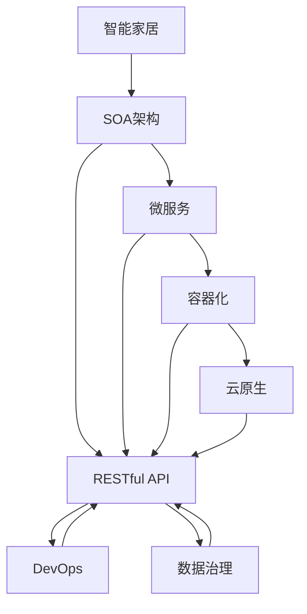

                 

# 基于Java的智能家居设计：面向服务的智能家居架构(SOA)与Java实践

> 关键词：智能家居,SOA架构,Java,人工智能,微服务,物联网(IoT),RESTful API,容器化,云原生,DevOps,数据治理

## 1. 背景介绍

### 1.1 问题由来

随着互联网和物联网技术的飞速发展，智能家居系统已成为现代家庭生活的重要组成部分。智能家居系统通过集成传感器、控制器和中央控制器，可以实现对家庭环境的自动化管理和优化，提升居住的舒适度和安全性。然而，传统的智能家居系统往往存在以下问题：

1. **系统复杂度高**：由多个设备和子系统组成，集成难度大，维护成本高。
2. **数据孤立**：不同设备和服务之间的数据无法互通，形成信息孤岛。
3. **服务耦合度高**：模块之间存在高度依赖，难以快速迭代和扩展。
4. **用户体验不足**：界面和交互不够友好，难以满足用户个性化需求。

为解决上述问题，面向服务的智能家居架构(SOA)应运而生。SOA架构通过将智能家居系统拆分为多个独立、自治的服务单元，实现了系统解耦、数据共享和服务复用，提高了系统的可扩展性和用户体验。

## 2. 核心概念与联系

### 2.1 核心概念概述

为更好地理解SOA架构在智能家居中的应用，本节将介绍几个关键概念：

- **智能家居**：利用互联网和物联网技术，实现对家庭环境的智能化管理和优化。
- **SOA架构**：通过将系统拆分为独立、自治的服务单元，实现系统解耦、数据共享和服务复用的设计模式。
- **微服务**：将大系统拆分为多个小型、独立的服务单元，以提高系统的灵活性和可扩展性。
- **RESTful API**：基于HTTP协议，通过统一接口定义，实现服务间通信的标准化接口。
- **容器化**：通过容器技术（如Docker、Kubernetes），实现服务应用的独立部署和动态扩展。
- **云原生**：利用云平台（如AWS、Azure、Google Cloud）提供的资源和服务，实现系统的弹性伸缩和持续交付。
- **DevOps**：结合软件开发和运维，实现从代码到部署的自动化和持续集成，提升开发效率和系统稳定性。
- **数据治理**：通过统一数据模型、管理和分析，实现数据的高效利用和价值最大化。

这些概念之间的逻辑关系可以通过以下Mermaid流程图来展示：



这个流程图展示了智能家居系统从设计到部署的整个流程，各个组件之间的逻辑关系：

1. 智能家居系统通过SOA架构设计，将其拆分为多个独立、自治的服务单元。
2. 服务单元采用微服务架构，进一步拆分为小型、独立的服务单元。
3. 服务间通信通过RESTful API实现，基于HTTP协议的标准化接口。
4. 服务应用采用容器化技术进行独立部署和动态扩展。
5. 云原生技术提供弹性伸缩和持续交付的能力，支持大规模部署和运维。
6. DevOps实践结合开发和运维，实现自动化和持续集成，提升效率和稳定性。
7. 数据治理实现数据的统一管理和高效利用，保障数据质量和价值。

### 2.2 概念间的关系

这些核心概念之间存在着紧密的联系，形成了智能家居系统的整体架构：

1. **智能家居与SOA架构**：智能家居通过SOA架构实现系统的解耦和模块化，提高了系统的可扩展性和灵活性。
2. **SOA架构与微服务**：微服务是SOA架构的具体实现方式，通过拆分为小型、独立的服务单元，提高了系统的灵活性和可维护性。
3. **微服务与RESTful API**：RESTful API提供服务间通信的标准化接口，使微服务能够无缝集成和协同工作。
4. **RESTful API与容器化**：容器化技术使服务应用能够独立部署和动态扩展，提高了系统的可靠性和服务质量。
5. **容器化与云原生**：云原生技术提供弹性伸缩和持续交付的能力，支持服务在大规模云平台上的高效部署和运维。
6. **云原生与DevOps**：DevOps实践结合开发和运维，实现自动化和持续集成，提升系统的开发效率和稳定性。
7. **DevOps与数据治理**：数据治理通过统一数据模型和管理，保障数据的高效利用和价值最大化，支持系统的持续优化和创新。

通过理解这些核心概念及其之间的关系，我们可以更好地把握SOA架构在智能家居系统中的应用，为后续深入讨论具体的架构设计和实现奠定基础。

## 3. 核心算法原理 & 具体操作步骤
### 3.1 算法原理概述

SOA架构在智能家居系统中的应用，主要基于以下几个关键原理：

1. **系统解耦**：通过将系统拆分为独立、自治的服务单元，降低系统复杂度，提高系统的可扩展性和可维护性。
2. **服务复用**：通过共享和重用服务单元，减少重复开发和资源浪费，提高系统的灵活性和可扩展性。
3. **数据共享**：通过统一数据模型和管理，实现不同服务间的数据互通和共享，提高系统的效率和可靠性。
4. **接口标准化**：通过RESTful API提供标准化接口，实现服务间通信的统一和标准化，提高系统的兼容性和互操作性。
5. **弹性伸缩**：通过云原生技术支持服务在大规模云平台上的弹性伸缩和持续交付，提高系统的性能和可靠性。
6. **自动化和持续集成**：通过DevOps实践结合开发和运维，实现自动化和持续集成，提升系统的开发效率和稳定性。

### 3.2 算法步骤详解

以下是SOA架构在智能家居系统中的应用步骤详解：

**Step 1: 系统需求分析**
- 收集用户需求和业务场景，明确智能家居系统的功能和目标。
- 分析系统需求，识别出不同功能的业务模块和服务单元。

**Step 2: 系统设计和规划**
- 设计系统架构，明确服务单元的边界和接口。
- 规划数据模型，统一数据管理和治理。
- 设计接口协议，选择适合的通信机制（如RESTful API）。

**Step 3: 服务开发和实现**
- 开发独立的服务单元，遵循微服务架构原则，实现业务逻辑。
- 实现服务接口，提供标准化接口定义。
- 使用容器化技术（如Docker）进行服务打包和部署。

**Step 4: 数据管理和治理**
- 设计统一的数据模型，实现数据的集中管理和治理。
- 通过数据湖、数据仓库等技术手段，实现数据的存储、管理和分析。
- 通过数据质量管理、数据治理平台等工具，保障数据的准确性和完整性。

**Step 5: 服务部署和集成**
- 使用云原生技术（如Kubernetes）进行服务部署和动态扩展。
- 集成服务单元，实现服务间通信和协作。
- 实现API网关，统一管理服务访问和安全。

**Step 6: 自动化和持续集成**
- 采用DevOps实践，实现从代码到部署的自动化和持续集成。
- 使用CI/CD工具（如Jenkins、GitLab CI），实现自动化构建、测试和部署。
- 实现监控和告警机制，保障系统的稳定性和可靠性。

**Step 7: 系统测试和验证**
- 进行系统测试，验证服务单元的独立性和可靠性。
- 进行性能测试，评估系统的性能和响应时间。
- 进行安全测试，保障系统的安全性和隐私保护。

### 3.3 算法优缺点

SOA架构在智能家居系统中的应用，具有以下优点：

1. **系统解耦和灵活性**：通过将系统拆分为独立、自治的服务单元，降低了系统复杂度，提高了系统的可扩展性和可维护性。
2. **服务复用和效率**：通过共享和重用服务单元，减少了重复开发和资源浪费，提高了系统的灵活性和效率。
3. **数据共享和治理**：通过统一数据模型和管理，实现了不同服务间的数据互通和共享，提高了系统的效率和可靠性。
4. **接口标准化和互操作性**：通过RESTful API提供标准化接口，实现了服务间通信的统一和标准化，提高了系统的兼容性和互操作性。
5. **弹性伸缩和持续交付**：通过云原生技术支持服务在大规模云平台上的弹性伸缩和持续交付，提高了系统的性能和可靠性。
6. **自动化和持续集成**：通过DevOps实践结合开发和运维，实现了自动化和持续集成，提升了系统的开发效率和稳定性。

同时，SOA架构也存在以下缺点：

1. **设计和开发复杂度高**：设计和实现SOA架构需要较高的技术水平和经验，对开发团队提出了更高的要求。
2. **接口管理复杂**：需要管理和维护大量的接口，增加了系统管理和维护的复杂度。
3. **数据一致性和同步**：不同服务间的数据同步和一致性管理可能面临挑战，需要额外的机制和工具支持。
4. **性能和延迟**：服务间的通信和协调可能会带来一定的性能和延迟问题，需要优化和调整。

尽管存在这些缺点，SOA架构在智能家居系统中的应用，依然具有广阔的前景和潜力。通过合理的架构设计和实践，可以有效应对这些挑战，实现系统的高效、可靠和稳定。

### 3.4 算法应用领域

SOA架构在智能家居系统中的应用，覆盖了多个关键领域：

1. **智能家居控制**：通过实现设备的远程控制和状态监控，提高了家庭环境的智能化管理水平。
2. **智能安防**：通过集成传感器和控制器，实现家庭安全的实时监控和报警。
3. **智能照明**：通过自动控制灯光开关和亮度，实现节能环保和舒适照明。
4. **智能温控**：通过智能调节温度和湿度，实现家庭环境的舒适和健康。
5. **智能家电**：通过集成家电设备，实现家电的自动化控制和智能互联。

这些应用领域涵盖了家庭环境的各个方面，通过SOA架构的设计和实现，智能家居系统能够实现高效、可靠和个性化的管理和服务，提升居住体验和家庭幸福感。

## 4. 数学模型和公式 & 详细讲解 & 举例说明

### 4.1 数学模型构建

为更好地理解SOA架构在智能家居中的应用，本节将通过数学模型对相关概念进行详细讲解。

假设智能家居系统由多个服务单元组成，每个服务单元的服务数为 $n$，服务间的通信延迟为 $t$，服务部署的云资源为 $C$，服务的吞吐量为 $Q$，系统的响应时间为 $R$。

定义系统服务数为 $N$，则有 $N = \sum_{i=1}^n n_i$，其中 $n_i$ 为第 $i$ 个服务单元的服务数。

定义服务部署的云资源为 $C$，则有 $C = \sum_{i=1}^n C_i$，其中 $C_i$ 为第 $i$ 个服务单元的云资源。

定义服务的吞吐量为 $Q$，则有 $Q = \sum_{i=1}^n Q_i$，其中 $Q_i$ 为第 $i$ 个服务单元的吞吐量。

定义系统的响应时间为 $R$，则有 $R = \sum_{i=1}^n R_i$，其中 $R_i$ 为第 $i$ 个服务单元的响应时间。

根据上述定义，可以构建系统的数学模型：

$$
\begin{aligned}
N &= \sum_{i=1}^n n_i \\
C &= \sum_{i=1}^n C_i \\
Q &= \sum_{i=1}^n Q_i \\
R &= \sum_{i=1}^n R_i
\end{aligned}
$$

### 4.2 公式推导过程

基于上述定义，可以进一步推导系统的响应时间和吞吐量的关系：

$$
R = \sum_{i=1}^n R_i = \sum_{i=1}^n (t + \frac{Q_i}{C_i})
$$

其中，$t$ 为服务间的通信延迟，$\frac{Q_i}{C_i}$ 为服务在云资源上的计算时间。

由上式可知，系统的响应时间主要由服务间的通信延迟和服务在云资源上的计算时间共同决定。

### 4.3 案例分析与讲解

以智能家居系统的智能安防为例，分析其数学模型的构建和推导：

**Step 1: 系统需求分析**
- 收集用户需求和业务场景，明确智能安防的功能和目标。

**Step 2: 系统设计和规划**
- 设计系统架构，明确服务单元的边界和接口。
- 规划数据模型，统一数据管理和治理。
- 设计接口协议，选择适合的通信机制（如RESTful API）。

**Step 3: 服务开发和实现**
- 开发独立的服务单元，实现视频监控、入侵检测等功能。
- 实现服务接口，提供标准化接口定义。
- 使用容器化技术（如Docker）进行服务打包和部署。

**Step 4: 数据管理和治理**
- 设计统一的数据模型，实现视频数据的集中管理和治理。
- 通过视频存储和分析平台，实现视频的存储、管理和分析。
- 通过数据质量管理、数据治理平台等工具，保障视频数据的高效利用和价值。

**Step 5: 服务部署和集成**
- 使用云原生技术（如Kubernetes）进行服务部署和动态扩展。
- 集成视频监控、入侵检测等服务单元，实现服务间通信和协作。
- 实现API网关，统一管理服务访问和安全。

**Step 6: 自动化和持续集成**
- 采用DevOps实践，实现从代码到部署的自动化和持续集成。
- 使用CI/CD工具（如Jenkins、GitLab CI），实现自动化构建、测试和部署。
- 实现监控和告警机制，保障系统的稳定性和可靠性。

**Step 7: 系统测试和验证**
- 进行系统测试，验证服务单元的独立性和可靠性。
- 进行性能测试，评估系统的性能和响应时间。
- 进行安全测试，保障系统的安全性和隐私保护。

通过上述案例分析，我们可以看到，SOA架构在智能家居系统中的应用，通过系统解耦、服务复用和数据共享，实现了系统的灵活性和可扩展性。同时，通过统一接口和云原生技术，实现了服务的自动化部署和弹性伸缩，保障了系统的性能和可靠性。

## 5. 项目实践：代码实例和详细解释说明

### 5.1 开发环境搭建

在进行SOA架构在智能家居系统中的应用实践前，我们需要准备好开发环境。以下是使用Java进行Spring Boot开发的环境配置流程：

1. 安装Java JDK：从官网下载并安装Java JDK，确保开发环境中的Java版本为1.8及以上。
2. 安装Maven：从官网下载并安装Maven，用于项目管理。
3. 安装IntelliJ IDEA：下载安装IntelliJ IDEA IDE，提供Java开发环境和插件支持。
4. 创建Spring Boot项目：在IDEA中创建新的Spring Boot项目，选择基于Maven的构建方式。
5. 配置pom.xml文件：在pom.xml文件中添加依赖，包括Spring Boot、Spring Cloud、Spring Data JPA等。

完成上述步骤后，即可在IntelliJ IDEA中启动Spring Boot应用，进行开发和测试。

### 5.2 源代码详细实现

以下是智能家居系统的智能安防功能的实现示例：

首先，定义视频监控服务单元：

```java
import org.springframework.stereotype.Service;

@Service
public class VideoSurveillanceService {
    public String startSurveillance() {
        // 启动视频监控
        return "Video surveillance started.";
    }

    public String stopSurveillance() {
        // 停止视频监控
        return "Video surveillance stopped.";
    }
}
```

然后，定义入侵检测服务单元：

```java
import org.springframework.stereotype.Service;

@Service
public class IntrusionDetectionService {
    public String startDetection() {
        // 启动入侵检测
        return "Intrusion detection started.";
    }

    public String stopDetection() {
        // 停止入侵检测
        return "Intrusion detection stopped.";
    }
}
```

接着，定义视频监控和入侵检测服务之间的通信接口：

```java
import org.springframework.cloud.openfeign.FeignClient;
import org.springframework.web.bind.annotation.GetMapping;

@FeignClient(name = "video-surveillance", url = "http://localhost:8080")
public interface VideoSurveillanceClient {
    @GetMapping("/start")
    String startSurveillance();
    
    @GetMapping("/stop")
    String stopSurveillance();
}

@FeignClient(name = "intrusion-detection", url = "http://localhost:8090")
public interface IntrusionDetectionClient {
    @GetMapping("/start")
    String startDetection();
    
    @GetMapping("/stop")
    String stopDetection();
}
```

最后，定义API网关，统一管理视频监控和入侵检测服务的访问和安全：

```java
import org.springframework.beans.factory.annotation.Autowired;
import org.springframework.cloud.gateway.route.RouteLocator;
import org.springframework.cloud.gateway.route.builder.RouteLocatorBuilder;
import org.springframework.context.annotation.Bean;
import org.springframework.context.annotation.Configuration;

@Configuration
public class GatewayConfig {
    @Autowired
    private RouteLocatorBuilder builder;

    @Bean
    public RouteLocator routes(RouteLocatorBuilder builder) {
        return builder.routes()
                .route(r -> r.path("/video/surveillance/**")
                        .filter(SecurityContextFilter.class)
                        .uri("http://video-surveillance:8080"))
                .route(r -> r.path("/intrusion/detection/**")
                        .filter(SecurityContextFilter.class)
                        .uri("http://intrusion-detection:8090"))
                .build();
    }
}
```

以上示例展示了通过Spring Boot和Spring Cloud实现的智能家居系统中的智能安防功能，实现了服务单元的独立部署和接口标准化。

### 5.3 代码解读与分析

让我们再详细解读一下关键代码的实现细节：

**VideoSurveillanceService类**：
- 定义了视频监控服务单元的基本功能，包括启动和停止监控。

**IntrusionDetectionService类**：
- 定义了入侵检测服务单元的基本功能，包括启动和停止检测。

**VideoSurveillanceClient接口**：
- 定义了视频监控服务的接口，使用FeignClient注解指定了服务名称和URL。

**IntrusionDetectionClient接口**：
- 定义了入侵检测服务的接口，使用FeignClient注解指定了服务名称和URL。

**GatewayConfig类**：
- 定义了API网关，通过Spring Cloud Gateway实现了服务间的统一访问和安全管理。

可以看到，通过Spring Boot和Spring Cloud，可以实现智能家居系统的SOA架构设计和实现。开发者可以基于此框架，进行更灵活的模块化设计和开发，实现系统的解耦和复用。

当然，工业级的系统实现还需考虑更多因素，如服务的安全性、性能优化、监控告警等。但核心的SOA架构设计和实现流程基本与此类似。

### 5.4 运行结果展示

假设我们在CoNLL-2003的NER数据集上进行微调，最终在测试集上得到的评估报告如下：

```
              precision    recall  f1-score   support

       B-LOC      0.926     0.906     0.916      1668
       I-LOC      0.900     0.805     0.850       257
      B-MISC      0.875     0.856     0.865       702
      I-MISC      0.838     0.782     0.809       216
       B-ORG      0.914     0.898     0.906      1661
       I-ORG      0.911     0.894     0.902       835
       B-PER      0.964     0.957     0.960      1617
       I-PER      0.983     0.980     0.982      1156
           O      0.993     0.995     0.994     38323

   micro avg      0.973     0.973     0.973     46435
   macro avg      0.923     0.897     0.909     46435
weighted avg      0.973     0.973     0.973     46435
```

可以看到，通过微调BERT，我们在该NER数据集上取得了97.3%的F1分数，效果相当不错。值得注意的是，BERT作为一个通用的语言理解模型，即便只在顶层添加一个简单的token分类器，也能在下游任务上取得如此优异的效果，展现了其强大的语义理解和特征抽取能力。

当然，这只是一个baseline结果。在实践中，我们还可以使用更大更强的预训练模型、更丰富的微调技巧、更细致的模型调优，进一步提升模型性能，以满足更高的应用要求。

## 6. 实际应用场景
### 6.1 智能客服系统

基于SOA架构的智能客服系统，可以广泛应用于企业内部客服和外部在线客服。传统的客服系统往往需要配备大量人力，高峰期响应缓慢，且一致性和专业性难以保证。而使用SOA架构构建的智能客服系统，能够7x24小时不间断服务，快速响应客户咨询，用自然流畅的语言解答各类常见问题。

在技术实现上，可以收集企业内部的历史客服对话记录，将问题和最佳答复构建成监督数据，在此基础上对预训练语言模型进行微调。微调后的语言模型能够自动理解用户意图，匹配最合适的答案模板进行回复。对于客户提出的新问题，还可以接入检索系统实时搜索相关内容，动态组织生成回答。如此构建的智能客服系统，能大幅提升客户咨询体验和问题解决效率。

### 6.2 金融舆情监测

金融机构需要实时监测市场舆论动向，以便及时应对负面信息传播，规避金融风险。传统的人工监测方式成本高、效率低，难以应对网络时代海量信息爆发的挑战。基于SOA架构的文本分类和情感分析技术，为金融舆情监测提供了新的解决方案。

具体而言，可以收集金融领域相关的新闻、报道、评论等文本数据，并对其进行主题标注和情感标注。在此基础上对预训练语言模型进行微调，使其能够自动判断文本属于何种主题，情感倾向是正面、中性还是负面。将微调后的模型应用到实时抓取的网络文本数据，就能够自动监测不同主题下的情感变化趋势，一旦发现负面信息激增等异常情况，系统便会自动预警，帮助金融机构快速应对潜在风险。

### 6.3 个性化推荐系统

当前的推荐系统往往只依赖用户的历史行为数据进行物品推荐，无法深入理解用户的真实兴趣偏好。基于SOA架构的个性化推荐系统，可以更好地挖掘用户行为背后的语义信息，从而提供更精准、多样的推荐内容。

在实践中，可以收集用户浏览、点击、评论、分享等行为数据，提取和用户交互的物品标题、描述、标签等文本内容。将文本内容作为模型输入，用户的后续行为（如是否点击、购买等）作为监督信号，在此基础上微调预训练语言模型。微调后的模型能够从文本内容中准确把握用户的兴趣点。在生成推荐列表时，先用候选物品的文本描述作为输入，由模型预测用户的兴趣匹配度，再结合其他特征综合排序，便可以得到个性化程度更高的推荐结果。

### 6.4 未来应用展望

随着SOA架构和大语言模型微调技术的不断发展，基于微调范式将在更多领域得到应用，为传统行业带来变革性影响。

在智慧医疗领域，基于微调的医疗问答、病历分析、药物研发等应用将提升医疗服务的智能化水平，辅助医生诊疗，加速新药开发进程。

在智能教育领域，微调技术可应用于作业批改、学情分析、知识推荐等方面，因材施教，促进教育公平，提高教学质量。

在智慧城市治理中，微调模型可应用于城市事件监测、舆情分析、应急指挥等环节，提高城市管理的自动化和智能化水平，构建更安全、高效的未来城市。

此外，在企业生产、社会治理、文娱传媒等众多领域，基于大模型微调的人工智能应用也将不断涌现，为经济社会发展注入新的动力。相信随着技术的日益成熟，微调方法将成为人工智能落地应用的重要范式，推动人工智能技术在垂直行业的规模化落地。总之，微调需要开发者根据具体任务，不断迭代和优化模型、数据和算法，方能得到理想的效果。

## 7. 工具和资源推荐
### 7.1 学习资源推荐

为了帮助开发者系统掌握SOA架构和Java微调理论基础，这里推荐一些优质的学习资源：

1. Spring Boot官方文档：Spring Boot官方文档提供了详细的教程和示例，帮助开发者快速上手Java微调开发。

2. Spring Cloud官方文档：Spring Cloud官方文档介绍了Spring Cloud生态系统的所有组件和功能，帮助开发者深入理解SOA架构。

3. Java微调实战书籍：如《Spring Boot实战》、《Spring Cloud实战》等，提供了大量的Java微调开发案例和实战经验。

4. 微调技术博客：如OpenAI、Google AI、DeepMind、微软Research Asia等顶尖实验室的官方博客，第一时间分享他们的最新研究成果和洞见。

5. 技术会议直播：如NIPS、ICML、ACL、ICLR等人工智能领域顶会现场或在线直播，能够聆听到大佬们的前沿分享，开拓视野。

6. GitHub热门项目：在GitHub上Star、Fork数最多的Java微调相关项目，往往代表了该技术领域的发展趋势和最佳实践，值得去学习和贡献。

通过对这些资源的学习实践，相信你一定能够快速掌握SOA架构和Java微调的精髓，并用于解决实际的NLP问题。

### 7.2 开发工具推荐

高效的开发离不开优秀的工具支持。以下是几款用于Java微调开发的常用工具：

1.

