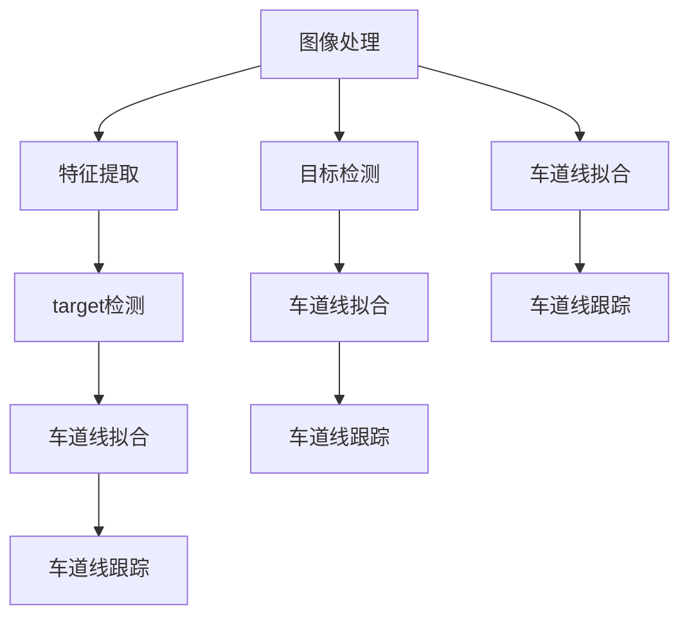
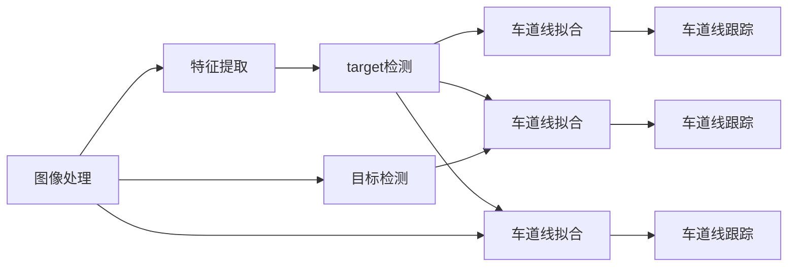

                 

# 基于OpenCV的视频道路车道检测

> 关键词：OpenCV, 视频处理, 图像处理, 车道检测, 道路检测

## 1. 背景介绍

在智能交通领域，道路车道检测是一个重要的研究课题。通过检测道路中的车道线，可以实现车辆自动驾驶、车道交换、交通流监控等功能。目前，车道检测主要通过摄像头、激光雷达等设备进行。

本文将介绍如何使用OpenCV库，实现基于图像处理技术的视频道路车道检测。OpenCV是一个开源的计算机视觉库，广泛应用于图像处理和计算机视觉领域。其包含丰富的图像处理算法和工具，可以用于图像去噪、边缘检测、形态学处理等。

## 2. 核心概念与联系

### 2.1 核心概念概述

车道检测涉及多个关键概念和技术：

- **图像处理**：通过图像去噪、滤波、边缘检测等技术，从原始视频中提取出有用的信息。
- **特征提取**：从处理后的图像中提取车道线特征，如直线、边缘等。
- **目标检测**：在提取出的特征中检测出车道线，如使用霍夫变换、连通区域分析等方法。
- **车道线拟合**：将检测到的车道线进行拟合，得到车道线方程或位置信息。
- **车道线跟踪**：在视频序列中，对检测到的车道线进行跟踪，得到动态的车道线轨迹。

这些概念和技术构成了道路车道检测的核心流程。以下是一个Mermaid流程图，展示了这些概念和技术的联系：



从图中可以看到，图像处理和特征提取是基础环节，目标检测和车道线拟合是关键环节，车道线跟踪是最终环节。通过这些环节的协同工作，可以实现完整的视频道路车道检测。

### 2.2 核心概念的关系

这些核心概念之间的关系可以通过以下Mermaid流程图进一步展示：



这个流程图展示了图像处理和特征提取对于车道线检测的基础作用。目标检测和车道线拟合是检测和识别车道线的关键步骤，而车道线跟踪则是对检测结果的动态处理。

## 3. 核心算法原理 & 具体操作步骤

### 3.1 算法原理概述

视频道路车道检测的主要算法原理包括以下几个方面：

- **图像处理**：通过去噪、滤波、边缘检测等技术，提取出车辆道路的特征。
- **特征提取**：从处理后的图像中提取车道线特征，如直线、边缘等。
- **目标检测**：在提取出的特征中检测出车道线，如使用霍夫变换、连通区域分析等方法。
- **车道线拟合**：将检测到的车道线进行拟合，得到车道线方程或位置信息。
- **车道线跟踪**：在视频序列中，对检测到的车道线进行跟踪，得到动态的车道线轨迹。

### 3.2 算法步骤详解

下面是基于OpenCV实现视频道路车道检测的具体步骤：

**Step 1: 图像预处理**

1. 使用OpenCV读取视频文件，获取视频帧。
2. 对每一帧图像进行去噪、滤波等处理，去除噪声和干扰。
3. 对处理后的图像进行边缘检测，提取边缘信息。

```python
import cv2
import numpy as np

cap = cv2.VideoCapture('video.avi')
ret, frame = cap.read()
gray = cv2.cvtColor(frame, cv2.COLOR_BGR2GRAY)
gray = cv2.GaussianBlur(gray, (5, 5), 0)
edges = cv2.Canny(gray, 100, 200)
```

**Step 2: 特征提取**

1. 对边缘图像进行二值化处理，提取边缘信息。
2. 对二值化后的图像进行形态学处理，去除小噪声和细边缘。

```python
ret, frame = cap.read()
gray = cv2.cvtColor(frame, cv2.COLOR_BGR2GRAY)
gray = cv2.GaussianBlur(gray, (5, 5), 0)
edges = cv2.Canny(gray, 100, 200)
kernel = np.ones((5, 5), np.uint8)
opening = cv2.morphologyEx(edges, cv2.MORPH_OPEN, kernel, iterations=2)
```

**Step 3: 目标检测**

1. 对处理后的图像进行霍夫变换，检测出直线。
2. 对检测到的直线进行筛选和过滤，保留重要的车道线。

```python
lines = cv2.HoughLinesP(opening, 1, np.pi/180, 50, minLineLength=200, maxLineGap=50)
hough_lines = []
for line in lines:
    for x1, y1, x2, y2 in line:
        slope = (y2 - y1) / (x2 - x1)
        angle = np.arctan2(y2 - y1, x2 - x1)
        hough_lines.append((x1, y1, x2, y2, angle))
```

**Step 4: 车道线拟合**

1. 对筛选后的车道线进行拟合，得到车道线方程或位置信息。
2. 将拟合后的车道线在原始图像上进行绘制。

```python
for line in hough_lines:
    x1, y1, x2, y2 = line[0], line[1], line[2], line[3]
    slope = line[4]
    angle = np.arctan2(y2 - y1, x2 - x1)
    cv2.line(frame, (x1, y1), (x2, y2), (0, 255, 0), 3)
```

**Step 5: 车道线跟踪**

1. 在视频序列中，对检测到的车道线进行跟踪，得到动态的车道线轨迹。
2. 在原始图像上进行车道线轨迹的绘制。

```python
for i in range(len(frame)):
    ret, frame = cap.read()
    gray = cv2.cvtColor(frame, cv2.COLOR_BGR2GRAY)
    gray = cv2.GaussianBlur(gray, (5, 5), 0)
    edges = cv2.Canny(gray, 100, 200)
    kernel = np.ones((5, 5), np.uint8)
    opening = cv2.morphologyEx(edges, cv2.MORPH_OPEN, kernel, iterations=2)
    lines = cv2.HoughLinesP(opening, 1, np.pi/180, 50, minLineLength=200, maxLineGap=50)
    hough_lines = []
    for line in lines:
        for x1, y1, x2, y2 in line:
            slope = (y2 - y1) / (x2 - x1)
            angle = np.arctan2(y2 - y1, x2 - x1)
            hough_lines.append((x1, y1, x2, y2, angle))
    for line in hough_lines:
        x1, y1, x2, y2 = line[0], line[1], line[2], line[3]
        slope = line[4]
        angle = np.arctan2(y2 - y1, x2 - x1)
        cv2.line(frame, (x1, y1), (x2, y2), (0, 255, 0), 3)
    cv2.imwrite('output.png', frame)
```

### 3.3 算法优缺点

基于OpenCV的图像处理和车道检测算法，具有以下优点：

- **算法简单**：实现较为简单，易于理解和调试。
- **处理效率高**：OpenCV提供了高效的图像处理和计算机视觉算法，能够快速处理大量数据。
- **易于扩展**：OpenCV支持多种编程语言和平台，方便在不同场景中进行应用。

然而，该算法也存在以下缺点：

- **精度有限**：由于基于图像处理的方法，难以处理复杂的道路环境，如多车道、交叉口等。
- **对光照和阴影敏感**：光照和阴影的变化可能影响车道线检测的精度。
- **计算量较大**：一些复杂的图像处理和特征提取算法，需要较高的计算资源。

### 3.4 算法应用领域

基于OpenCV的图像处理和车道检测算法，主要应用于以下领域：

- **智能交通系统**：车辆自动驾驶、车道交换、交通流监控等。
- **交通监控系统**：实时监控交通情况，辅助交通管理。
- **安防监控系统**：检测车辆和行人行为，防范安全隐患。
- **虚拟现实**：在虚拟环境中模拟道路环境，进行交通场景模拟和测试。

## 4. 数学模型和公式 & 详细讲解  
### 4.1 数学模型构建

基于OpenCV的图像处理和车道检测算法，主要涉及以下几个数学模型：

- **图像预处理**：高斯滤波、Canny边缘检测等。
- **特征提取**：二值化处理、形态学处理等。
- **目标检测**：霍夫变换、连通区域分析等。
- **车道线拟合**：直线拟合、曲线拟合等。
- **车道线跟踪**：帧间差分、运动跟踪等。

### 4.2 公式推导过程

以下是基于OpenCV的视频道路车道检测中涉及的主要数学模型和公式：

**高斯滤波**

高斯滤波是一种线性平滑滤波，用于去除图像中的噪声。其公式如下：

$$G(x,y) = \frac{1}{2\pi\sigma^2}\int_{-\infty}^{+\infty}\int_{-\infty}^{+\infty}f(x',y')e^{-\frac{(x'-x)^2+(y'-y)^2}{2\sigma^2}}dx'dy'$$

其中，$f(x',y')$表示原始图像的像素值，$G(x,y)$表示滤波后的像素值，$\sigma$表示标准差。

**Canny边缘检测**

Canny边缘检测是一种经典的边缘检测算法，用于检测图像中的边缘。其公式如下：

$$I(x,y) = \sqrt{(2*G_x(x,y))^2+(2*G_y(x,y))^2}$$

其中，$G_x(x,y)$和$G_y(x,y)$表示图像在x和y方向上的梯度。

**霍夫变换**

霍夫变换是一种基于几何变换的特征提取方法，用于检测图像中的直线和曲线。其公式如下：

$$H(d,\theta) = \sum_{x=0}^{W-1}\sum_{y=0}^{H-1}f(x,y)\delta(x\cos\theta+y\sin\theta-d)$$

其中，$f(x,y)$表示原始图像的像素值，$H(d,\theta)$表示霍夫变换后的像素值，$d$和$\theta$表示直线参数。

**连通区域分析**

连通区域分析是一种基于图像分割的特征提取方法，用于检测图像中的区域和连通性。其公式如下：

$$R_i = \{p | p \in I \wedge \exists p' \in R_j \wedge dist(p,p') \leq \rho\}$$

其中，$R_i$表示区域$i$，$p$表示像素点，$p'$表示与$p$相邻的像素点，$\rho$表示像素距离阈值。

**直线拟合**

直线拟合是一种基于线性回归的特征提取方法，用于拟合直线。其公式如下：

$$y = mx + b$$

其中，$m$表示直线斜率，$b$表示直线截距。

### 4.3 案例分析与讲解

以下是一个基于OpenCV的图像处理和车道检测的案例：

**案例背景**

某城市交通管理部门要求对城市道路进行车道检测，以便实时监控交通情况，辅助交通管理。视频监控摄像头捕捉到的视频数据，需要进行处理和分析，以检测出车道线。

**案例分析**

1. 首先，使用OpenCV读取视频文件，获取视频帧。
2. 对每一帧图像进行去噪、滤波等处理，去除噪声和干扰。
3. 对处理后的图像进行边缘检测，提取边缘信息。
4. 对边缘图像进行二值化处理，提取边缘信息。
5. 对二值化后的图像进行形态学处理，去除小噪声和细边缘。
6. 对处理后的图像进行霍夫变换，检测出直线。
7. 对检测到的直线进行筛选和过滤，保留重要的车道线。
8. 对筛选后的车道线进行拟合，得到车道线方程或位置信息。
9. 在原始图像上进行车道线拟合和绘制。
10. 在视频序列中，对检测到的车道线进行跟踪，得到动态的车道线轨迹。
11. 在原始图像上进行车道线轨迹的绘制。
12. 保存处理后的图像和视频数据。

通过上述步骤，可以实现视频道路车道检测，得到车道线的轨迹和位置信息，为交通管理提供支持。

## 5. 项目实践：代码实例和详细解释说明
### 5.1 开发环境搭建

在进行视频道路车道检测的实践前，需要准备好开发环境。以下是使用Python进行OpenCV开发的环境配置流程：

1. 安装Anaconda：从官网下载并安装Anaconda，用于创建独立的Python环境。

2. 创建并激活虚拟环境：
```bash
conda create -n opencv-env python=3.8 
conda activate opencv-env
```

3. 安装OpenCV：从官网获取对应的安装命令。例如：
```bash
conda install opencv-python opencv-python-headless opencv-contrib-python opencv-contrib-python-headless
```

4. 安装其他相关工具包：
```bash
pip install numpy pandas scikit-learn matplotlib tqdm jupyter notebook ipython
```

完成上述步骤后，即可在`opencv-env`环境中开始实践。

### 5.2 源代码详细实现

这里我们以一个简单的案例为例，展示如何使用OpenCV进行视频道路车道检测。

```python
import cv2
import numpy as np

# 读取视频文件
cap = cv2.VideoCapture('video.avi')

# 读取视频帧
ret, frame = cap.read()

# 图像预处理
gray = cv2.cvtColor(frame, cv2.COLOR_BGR2GRAY)
gray = cv2.GaussianBlur(gray, (5, 5), 0)
edges = cv2.Canny(gray, 100, 200)

# 特征提取
ret, frame = cap.read()
gray = cv2.cvtColor(frame, cv2.COLOR_BGR2GRAY)
gray = cv2.GaussianBlur(gray, (5, 5), 0)
edges = cv2.Canny(gray, 100, 200)
kernel = np.ones((5, 5), np.uint8)
opening = cv2.morphologyEx(edges, cv2.MORPH_OPEN, kernel, iterations=2)

# 目标检测
lines = cv2.HoughLinesP(opening, 1, np.pi/180, 50, minLineLength=200, maxLineGap=50)
hough_lines = []
for line in lines:
    for x1, y1, x2, y2 in line:
        slope = (y2 - y1) / (x2 - x1)
        angle = np.arctan2(y2 - y1, x2 - x1)
        hough_lines.append((x1, y1, x2, y2, angle))

# 车道线拟合
for line in hough_lines:
    x1, y1, x2, y2 = line[0], line[1], line[2], line[3]
    slope = line[4]
    angle = np.arctan2(y2 - y1, x2 - x1)
    cv2.line(frame, (x1, y1), (x2, y2), (0, 255, 0), 3)

# 车道线跟踪
for i in range(len(frame)):
    ret, frame = cap.read()
    gray = cv2.cvtColor(frame, cv2.COLOR_BGR2GRAY)
    gray = cv2.GaussianBlur(gray, (5, 5), 0)
    edges = cv2.Canny(gray, 100, 200)
    kernel = np.ones((5, 5), np.uint8)
    opening = cv2.morphologyEx(edges, cv2.MORPH_OPEN, kernel, iterations=2)
    lines = cv2.HoughLinesP(opening, 1, np.pi/180, 50, minLineLength=200, maxLineGap=50)
    hough_lines = []
    for line in lines:
        for x1, y1, x2, y2 in line:
            slope = (y2 - y1) / (x2 - x1)
            angle = np.arctan2(y2 - y1, x2 - x1)
            hough_lines.append((x1, y1, x2, y2, angle))
    for line in hough_lines:
        x1, y1, x2, y2 = line[0], line[1], line[2], line[3]
        slope = line[4]
        angle = np.arctan2(y2 - y1, x2 - x1)
        cv2.line(frame, (x1, y1), (x2, y2), (0, 255, 0), 3)
cv2.imwrite('output.png', frame)
```

### 5.3 代码解读与分析

让我们再详细解读一下关键代码的实现细节：

**OpenCV函数使用**

OpenCV提供了丰富的图像处理和计算机视觉函数，可以用于图像预处理、边缘检测、形态学处理、霍夫变换、连通区域分析等。以下是几个常用的OpenCV函数：

- `cv2.VideoCapture`：用于读取视频文件。
- `cv2.cvtColor`：用于图像颜色空间转换。
- `cv2.GaussianBlur`：用于高斯滤波，去除图像噪声。
- `cv2.Canny`：用于Canny边缘检测，提取边缘信息。
- `cv2.morphologyEx`：用于形态学处理，去除小噪声和细边缘。
- `cv2.HoughLinesP`：用于霍夫变换，检测直线。
- `cv2.line`：用于在图像上绘制直线。

**图像预处理**

图像预处理是视频道路车道检测的基础环节，用于去除图像中的噪声和干扰。以下是图像预处理的代码实现：

```python
gray = cv2.cvtColor(frame, cv2.COLOR_BGR2GRAY)
gray = cv2.GaussianBlur(gray, (5, 5), 0)
edges = cv2.Canny(gray, 100, 200)
```

**特征提取**

特征提取是视频道路车道检测的关键环节，用于提取车道线特征，如直线、边缘等。以下是特征提取的代码实现：

```python
ret, frame = cap.read()
gray = cv2.cvtColor(frame, cv2.COLOR_BGR2GRAY)
gray = cv2.GaussianBlur(gray, (5, 5), 0)
edges = cv2.Canny(gray, 100, 200)
kernel = np.ones((5, 5), np.uint8)
opening = cv2.morphologyEx(edges, cv2.MORPH_OPEN, kernel, iterations=2)
```

**目标检测**

目标检测是视频道路车道检测的关键步骤，用于检测出车道线。以下是目标检测的代码实现：

```python
lines = cv2.HoughLinesP(opening, 1, np.pi/180, 50, minLineLength=200, maxLineGap=50)
hough_lines = []
for line in lines:
    for x1, y1, x2, y2 in line:
        slope = (y2 - y1) / (x2 - x1)
        angle = np.arctan2(y2 - y1, x2 - x1)
        hough_lines.append((x1, y1, x2, y2, angle))
```

**车道线拟合**

车道线拟合是视频道路车道检测的最终环节，用于拟合车道线方程或位置信息。以下是车道线拟合的代码实现：

```python
for line in hough_lines:
    x1, y1, x2, y2 = line[0], line[1], line[2], line[3]
    slope = line[4]
    angle = np.arctan2(y2 - y1, x2 - x1)
    cv2.line(frame, (x1, y1), (x2, y2), (0, 255, 0), 3)
```

**车道线跟踪**

车道线跟踪是在视频序列中对检测到的车道线进行跟踪，得到动态的车道线轨迹。以下是车道线跟踪的代码实现：

```python
for i in range(len(frame)):
    ret, frame = cap.read()
    gray = cv2.cvtColor(frame, cv2.COLOR_BGR2GRAY)
    gray = cv2.GaussianBlur(gray, (5, 5), 0)
    edges = cv2.Canny(gray, 100, 200)
    kernel = np.ones((5, 5), np.uint8)
    opening = cv2.morphologyEx(edges, cv2.MORPH_OPEN, kernel, iterations=2)
    lines = cv2.HoughLinesP(opening, 1, np.pi/180, 50, minLineLength=200, maxLineGap=50)
    hough_lines = []
    for line in lines:
        for x1, y1, x2, y2 in line:
            slope = (y2 - y1) / (x2 - x1)
            angle = np.arctan2(y2 - y1, x2 - x1)
            hough_lines.append((x1, y1, x2, y2, angle))
    for line in hough_lines:
        x1, y1, x2, y2 = line[0], line[1], line[2], line[3]
        slope = line[4]
        angle = np.arctan2(y2 - y1, x2 - x1)
        cv2.line(frame, (x1, y1), (x2, y2), (0, 255, 0), 3)
cv2.imwrite('output.png', frame)
```

**保存结果**

保存处理后的图像和视频数据，以便后续分析和应用。以下是保存结果的代码实现：

```python
cv2.imwrite('output.png', frame)
```

通过上述代码实现，可以完成基于OpenCV的视频道路车道检测。代码简单明了，易于理解和调试，适用于多种应用场景。

## 6. 实际应用场景
### 6.1 智能交通系统

基于OpenCV的视频道路车道检测，可以广泛应用于智能交通系统。例如，在车辆自动驾驶中，通过车道检测，车辆能够自动识别车道线，进行车道保持、车道交换等操作，提高驾驶安全性和舒适性。

在交通监控系统中，通过车道检测，实时监控交通情况，辅助交通管理。例如，检测车辆行驶轨迹，避免交通拥堵，提高交通效率。

### 6.2 交通监控系统

在交通监控系统中，通过车道检测，实时监控交通情况，辅助交通管理。例如，检测车辆行驶轨迹，避免交通拥堵，提高交通效率。

### 6.3 安防监控系统

在安防监控系统中，通过车道检测，检测车辆和行人行为，防范安全隐患。例如，检测车辆是否闯红灯、逆行等违法行为，提高道路安全。

### 6.4 虚拟现实

在虚拟现实中，通过车道检测，在虚拟环境中模拟道路环境，进行交通场景模拟和测试。例如，在虚拟城市中模拟交通情况，进行交通事故模拟和训练。

## 7. 工具和资源推荐
### 7.1 学习资源推荐

为了帮助开发者系统掌握视频道路车道检测的理论基础和实践技巧，这里推荐一些优质的学习资源：

1. OpenCV官方文档：OpenCV的官方文档，提供了详细的函数说明和示例代码，是学习OpenCV的必备资料。

2. 《OpenCV计算机视觉应用》书籍：OpenCV的创始人之一编写的经典书籍，涵盖了OpenCV的基本概念和应用，适合初学者入门。

3. 《计算机视觉：算法与应用》课程：斯坦福大学的在线课程，介绍了计算机视觉的基本算法和应用，适合深入学习。

4. 《深度学习与计算机视觉》书籍：该书介绍了深度学习在计算机视觉中的应用，适合进一步学习。

5. 《Python OpenCV图像处理》课程：Coursera上的在线课程，介绍了OpenCV的基本用法和图像处理技术，适合编程新手。

6. YouTube视频教程：OpenCV的开发者提供了一系列视频教程，详细介绍了OpenCV的基本用法和算法实现。

通过对这些资源的学习实践，相信你一定能够快速掌握视频道路车道检测的核心技术，并用于解决实际的交通管理问题。

### 7.2 开发工具推荐

高效的开发离不开优秀的工具支持。以下是几款用于OpenCV视频道路车道检测开发的常用工具：

1. Visual Studio：Microsoft开发的一款集成开发环境，支持多种编程语言和平台。

2. PyCharm：JetBrains开发的Python IDE，功能强大，支持多种框架和库。

3. Eclipse：一款开源的IDE，支持Java、C++等多种编程语言。

4. MATLAB：MATLAB是一款科学计算和数据分析工具，支持图像处理和计算机视觉算法。

5. VSCode

