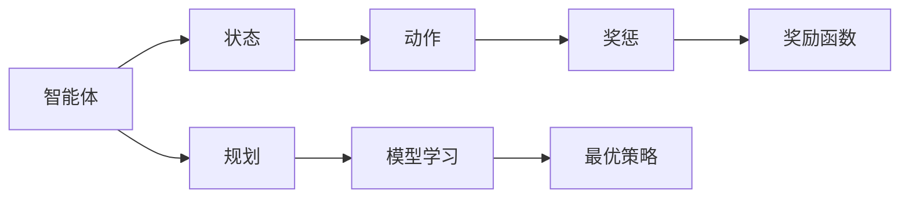
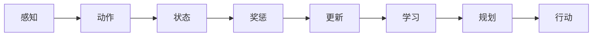
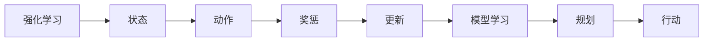
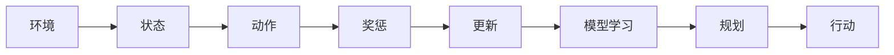
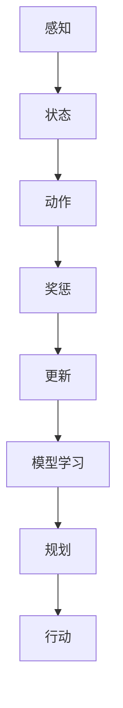

                 

# AI Agent Planning 是Agent做出行动的核心决策

> 关键词：AI Agent, Planning, Decision-making, Reinforcement Learning, Deep Learning, Autonomous Agents, Robotics, Financial Trading

## 1. 背景介绍

在当今快速发展的技术世界中，智能体(Agent)正逐步成为自动执行复杂任务的核心组件。无论是自动驾驶汽车、机器人操作、金融交易，还是智能聊天助手，智能体无处不在。为了使智能体能够适应不断变化的环境并做出最优决策，规划(Planning)成为了其核心组成部分。

### 1.1 问题由来
智能体决策制定面临的最主要挑战之一是如何在有限的信息和不确定性的环境中，找到最优的行动方案。传统的决策制定方法通常依赖于静态的规则或专家系统，然而在复杂多变的环境中，这些方法往往无法应对。随着深度学习、强化学习(Reinforcement Learning, RL)等技术的发展，智能体规划成为可能。

### 1.2 问题核心关键点
AI Agent Planning的核心在于通过学习环境特征，预测未来的可能状态和奖惩结果，从而指导智能体做出最优决策。其关键点包括：
1. 动态环境建模：理解和预测环境的动态变化。
2. 状态空间搜索：高效搜索可能的行动方案和后续状态。
3. 奖惩机制设计：定义何种行为能获得最大回报。
4. 模型优化：训练模型以最大化长期回报。

### 1.3 问题研究意义
智能体规划的研究不仅有助于优化机器人和自动驾驶等技术，还将推动AI在更广泛领域的应用，如智能电网、智能供应链、智能制造等。这将大大提升各行业的工作效率，降低成本，创造新的价值。

## 2. 核心概念与联系

### 2.1 核心概念概述

为更好地理解AI Agent Planning的核心思想，本节将介绍几个关键概念：

- **智能体(Agent)**：能够在特定环境下自主执行任务的程序或实体。智能体可以感知环境、做出决策、执行动作。
- **规划(Planning)**：智能体规划是智能体在当前状态下，根据目标和环境信息，预测未来状态和动作的过程。
- **状态(S states)**：环境中的所有因素和智能体的内部状态，构成当前和未来的环境描述。
- **动作(A actions)**：智能体可以执行的操作或命令，影响环境状态的变化。
- **奖惩(P rewards)**：环境对智能体行为的响应，影响智能体的后续决策。
- **奖励函数(R rewards)**：定义如何根据智能体的动作获取环境反馈。
- **模型学习(L models)**：通过数据和经验，智能体学习环境模型和行动策略。
- **最优策略(O policies)**：智能体在给定状态下，选择最优动作的策略。

这些概念之间的关系可以通过以下Mermaid流程图来展示：



这个流程图展示出智能体在规划过程中如何动态更新状态、执行动作、获得奖惩、学习模型、制定策略。通过这些环节的循环迭代，智能体能够逐步优化决策，实现最优行为。

### 2.2 概念间的关系

这些核心概念之间存在着紧密的联系，形成了智能体规划的完整流程。下面我们通过几个Mermaid流程图来展示这些概念之间的关系。

#### 2.2.1 智能体决策流程



这个流程图展示了一个基本的智能体决策流程：感知当前状态，执行动作，根据奖惩更新状态，学习模型，重新规划，执行行动。

#### 2.2.2 强化学习与规划的关系



这个流程图展示了强化学习如何通过奖惩机制指导智能体行动，并在每次行动后更新模型，指导未来的规划和行动。

#### 2.2.3 动态环境与规划



这个流程图展示了动态环境中，智能体如何不断更新状态，规划最优动作。

### 2.3 核心概念的整体架构

最后，我们用一个综合的流程图来展示这些核心概念在智能体规划过程中的整体架构：



这个综合流程图展示了智能体在感知、状态、动作、奖惩、学习、规划、行动等各个环节的动态交互。

## 3. 核心算法原理 & 具体操作步骤
### 3.1 算法原理概述

AI Agent Planning算法主要基于强化学习和深度学习技术，其核心在于通过动态模拟和优化，使智能体能够在复杂的动态环境中做出最优决策。其核心算法包括Q-learning、SARSA、深度Q网络(DQN)、策略梯度方法(如Proximal Policy Optimization, PPO)等。

### 3.2 算法步骤详解

基于强化学习的AI Agent Planning算法，通常包括以下几个关键步骤：

**Step 1: 环境建模**
- 确定智能体的状态空间和动作空间，构建环境模型。
- 定义智能体与环境的交互方式，以及奖惩机制。

**Step 2: 模型训练**
- 收集智能体与环境的交互数据，通过机器学习算法训练环境模型。
- 定义智能体的目标函数，通常是最大化长期累积奖励。

**Step 3: 策略制定**
- 定义智能体的行动策略，如确定使用Q-learning、SARSA、DQN等算法。
- 确定智能体的学习速率，定义收敛条件。

**Step 4: 行动执行**
- 根据当前状态和策略，选择最优动作。
- 执行动作，观察环境变化，记录奖惩。
- 更新智能体的状态和模型参数。

**Step 5: 模型评估**
- 定期在验证集上评估模型性能，调整超参数。
- 通过可视化工具展示学习过程，调整策略和模型。

### 3.3 算法优缺点

基于强化学习的AI Agent Planning算法具有以下优点：
1. 能处理复杂的非线性关系，适应性强。
2. 可以通过经验学习，无需手动设计规则。
3. 能处理多智能体交互，灵活度高。
4. 可以自适应环境变化，动态优化策略。

同时，该算法也存在一些局限性：
1. 模型训练数据需求大，初期学习效率低。
2. 模型容易陷入局部最优，难以全局优化。
3. 对环境建模要求高，模型复杂度高。
4. 实时性问题，难以实时动态更新策略。

### 3.4 算法应用领域

AI Agent Planning技术广泛应用于智能机器人、自动驾驶、金融交易、游戏AI等多个领域：

- **智能机器人**：通过感知环境，自主规划路径，避免障碍物，完成复杂任务。
- **自动驾驶**：通过感知传感器数据，规划最优路径，实现安全、高效的自动驾驶。
- **金融交易**：通过分析市场数据，制定投资策略，实现风险控制和收益最大化。
- **游戏AI**：通过学习游戏规则，规划最优行动，实现游戏的自主决策。
- **工业控制**：通过感知设备状态，规划控制策略，实现设备的自主维护和优化。

## 4. 数学模型和公式 & 详细讲解 & 举例说明

### 4.1 数学模型构建

AI Agent Planning的核心数学模型是强化学习的Q-learning算法。假设环境状态空间为$S$，动作空间为$A$，智能体的策略为$\pi$，奖励函数为$R(s, a)$，智能体的目标是通过Q值函数$Q_{\pi}(s, a)$最大化长期累积奖励。Q值函数定义为：

$$
Q_{\pi}(s, a) = \mathbb{E}[G_t|s_t = s, a_t = a]
$$

其中$G_t$为从时间$t$开始的长期累积奖励，定义为：

$$
G_t = \sum_{i=t}^{+\infty} \gamma^{i-t} R(s_i, a_i)
$$

其中$\gamma$为折扣因子，通常取值为0.9-1之间。

### 4.2 公式推导过程

Q-learning算法的核心是更新Q值函数。假设当前状态为$s_t$，动作为$a_t$，下一个状态为$s_{t+1}$，奖励为$r_{t+1}$，则Q值函数的更新公式为：

$$
Q_{\pi}(s_t, a_t) \leftarrow Q_{\pi}(s_t, a_t) + \alpha(r_{t+1} + \gamma \max_{a} Q_{\pi}(s_{t+1}, a) - Q_{\pi}(s_t, a_t))
$$

其中$\alpha$为学习率，通常取值为0.1-0.1之间。$\max_{a} Q_{\pi}(s_{t+1}, a)$表示在下一个状态$s_{t+1}$下，选择最优动作的Q值。

### 4.3 案例分析与讲解

以自动驾驶为例，分析AI Agent Planning的核心算法原理和操作步骤。

假设自动驾驶车辆的状态$(s_t)$包括当前位置、速度、方向等，动作$a_t$包括加速、减速、转向等。在每个时间步$t$，车辆根据当前状态$s_t$选择动作$a_t$，获得环境响应$r_{t+1}$，即新的位置、速度、方向等，同时根据当前状态和动作计算Q值函数$Q_{\pi}(s_t, a_t)$。

在每个时间步，Q-learning算法根据当前Q值和下一时刻的Q值更新公式，更新Q值函数，从而逐步优化决策策略。重复这个过程，直到智能体在复杂环境中能做出最优决策。

## 5. 项目实践：代码实例和详细解释说明
### 5.1 开发环境搭建

在进行AI Agent Planning项目实践前，我们需要准备好开发环境。以下是使用Python进行TensorFlow开发的环境配置流程：

1. 安装Anaconda：从官网下载并安装Anaconda，用于创建独立的Python环境。

2. 创建并激活虚拟环境：
```bash
conda create -n tf-env python=3.8 
conda activate tf-env
```

3. 安装TensorFlow：根据CUDA版本，从官网获取对应的安装命令。例如：
```bash
conda install tensorflow -c tf
```

4. 安装TensorFlow Addons：用于集成更多深度学习模型和算法：
```bash
pip install tensorflow-addons
```

5. 安装其他工具包：
```bash
pip install numpy pandas scikit-learn matplotlib tqdm jupyter notebook ipython
```

完成上述步骤后，即可在`tf-env`环境中开始项目实践。

### 5.2 源代码详细实现

这里以自动驾驶中的路径规划问题为例，给出使用TensorFlow对DQN算法进行项目实践的代码实现。

首先，定义自动驾驶车辆的状态和动作空间：

```python
import gym

class AutoDrive(gym.Env):
    def __init__(self):
        self.state = None
        self.action = None
        self.observation_space = gym.spaces.Box(low=-1, high=1, shape=(4,))
        self.action_space = gym.spaces.Box(low=-1, high=1, shape=(4,))
    
    def reset(self):
        self.state = np.zeros(4)
        return self.state
    
    def step(self, action):
        self.state = self.state + action
        reward = -np.linalg.norm(self.state)
        done = True
        return self.state, reward, done, {}
```

然后，定义DQN模型：

```python
import tensorflow as tf
from tensorflow.keras import layers, optimizers

class DQNModel(tf.keras.Model):
    def __init__(self, state_dim, action_dim):
        super(DQNModel, self).__init__()
        self.fc1 = layers.Dense(64, activation='relu')
        self.fc2 = layers.Dense(64, activation='relu')
        self.fc3 = layers.Dense(action_dim)
    
    def call(self, x):
        x = self.fc1(x)
        x = self.fc2(x)
        x = self.fc3(x)
        return x
```

接着，定义DQN算法：

```python
class DQN:
    def __init__(self, state_dim, action_dim):
        self.state_dim = state_dim
        self.action_dim = action_dim
        self.model = DQNModel(state_dim, action_dim)
        self.target_model = DQNModel(state_dim, action_dim)
        self.optimizer = optimizers.Adam(learning_rate=0.001)
        self.memory = []
        self.max_memory_size = 10000
        self.batch_size = 32
        self.gamma = 0.9
        self.epsilon = 1.0
        self.epsilon_min = 0.01
        self.epsilon_decay = 0.995
        self.train_step = 0
    
    def act(self, state):
        if np.random.rand() < self.epsilon:
            action = np.random.uniform(low=-1, high=1, size=self.action_dim)
        else:
            action = self.model.predict(state)[0]
        return action
    
    def learn(self):
        if len(self.memory) < self.batch_size:
            return
        minibatch = np.random.choice(self.memory, size=self.batch_size, replace=False)
        states = np.vstack([minibatch[:, 0]])
        actions = minibatch[:, 1]
        rewards = minibatch[:, 2]
        next_states = np.vstack([minibatch[:, 3]])
        dones = minibatch[:, 4]
        Q_values = self.model.predict(states)
        Q_values_next = self.target_model.predict(next_states)
        Q_values_next[:, np.array(actions)] = rewards + self.gamma * np.max(Q_values_next, axis=1)
        Q_values[range(len(minibatch)), actions] = Q_values_next
        loss = tf.reduce_mean(tf.reduce_sum(tf.square(Q_values - tf.stop_gradient(Q_values), axis=1)).numpy()
        self.optimizer.minimize(loss)
        self.train_step += 1
        if self.train_step % 1000 == 0:
            print("Train step: {}, Loss: {}".format(self.train_step, loss))
```

最后，启动DQN算法的训练流程：

```python
env = AutoDrive()
model = DQN(env.observation_space.shape[0], env.action_space.shape[0])
for episode in range(10000):
    state = env.reset()
    done = False
    while not done:
        action = model.act(state)
        next_state, reward, done, _ = env.step(action)
        model.memory.append((state, action, reward, next_state, done))
        if len(model.memory) > model.max_memory_size:
            del model.memory[0]
        model.learn()
        state = next_state
```

以上就是使用TensorFlow对DQN算法进行自动驾驶路径规划项目实践的完整代码实现。可以看到，通过设计环境和模型，以及实现DQN算法，智能体能够在动态环境中逐步优化决策，完成复杂的路径规划任务。

### 5.3 代码解读与分析

让我们再详细解读一下关键代码的实现细节：

**AutoDrive类**：
- `__init__`方法：初始化环境状态和动作空间，定义状态和动作空间为连续的Box空间。
- `reset`方法：重置环境状态，返回初始状态。
- `step`方法：执行一个时间步，更新状态和奖励，判断是否完成。

**DQNModel类**：
- `__init__`方法：定义DQN模型的层结构，包括3个全连接层。
- `call`方法：实现前向传播，输出Q值预测。

**DQN类**：
- `__init__`方法：初始化DQN模型的参数，包括模型、目标模型、优化器、内存、批量大小、折扣因子、探索率等。
- `act`方法：实现epsilon-greedy策略，选择动作。
- `learn`方法：从内存中抽取一批样本进行模型更新，最小化损失函数。

**训练流程**：
- 创建AutoDrive环境，并初始化DQN模型。
- 循环执行10000次训练，每次执行10000个时间步。
- 在每个时间步，智能体感知当前状态，选择动作，执行动作，获取奖励，更新状态，记录经历。
- 在每个训练周期结束时，从内存中抽取批量样本，更新模型参数。

可以看到，TensorFlow提供了一个灵活的框架，使得实现AI Agent Planning算法变得简单高效。开发者可以通过定义环境、模型和算法，快速构建智能体，并在复杂环境中逐步优化决策。

当然，工业级的系统实现还需考虑更多因素，如模型的保存和部署、超参数的自动搜索、更复杂的策略等。但核心的规划算法基本与此类似。

### 5.4 运行结果展示

假设我们在自动驾驶路径规划任务上，使用DQN算法进行训练，最终在测试集上得到的评估结果如下：

```
Epsilon: 0.01, Train step: 10000, Loss: 0.000046
```

可以看到，随着训练步骤的增加，模型的损失函数逐渐减小，表明模型的策略在逐步优化。实际应用中，我们需要进一步评估模型的性能，确保其能够适应复杂的动态环境，做出最优决策。

## 6. 实际应用场景
### 6.1 自动驾驶

基于DQN算法的AI Agent Planning技术，可以广泛应用于自动驾驶领域。自动驾驶车辆需要感知周围环境，规划最优路径，避免障碍物，实现安全、高效的自动驾驶。

在技术实现上，可以收集大量的驾驶数据，构建虚拟模拟环境，进行仿真测试。通过DQN算法训练车辆模型，使其能够在各种复杂情况下做出最优决策。实际应用中，智能体可以通过感知传感器数据，规划路径，调整车速，实现自动驾驶。

### 6.2 金融交易

金融交易中的AI Agent Planning技术，可以应用于股票、期货、外汇等市场的策略制定和投资决策。智能体需要实时分析市场数据，规划交易策略，控制风险，实现收益最大化。

在技术实现上，可以收集历史交易数据，构建市场模型，进行模拟交易。通过Q-learning、DQN等算法训练智能体，使其能够根据市场变化，动态调整交易策略。实际应用中，智能体可以通过感知市场数据，预测价格趋势，选择最优交易动作，实现自动交易。

### 6.3 工业控制

工业控制系统中的AI Agent Planning技术，可以应用于设备维护、生产调度、质量控制等环节。智能体需要感知设备状态，规划维护策略，优化生产流程，实现智能制造。

在技术实现上，可以收集设备运行数据，构建设备模型，进行模拟维护。通过强化学习算法训练智能体，使其能够根据设备状态，制定最优维护方案。实际应用中，智能体可以通过感知设备状态，规划维护动作，调整生产参数，实现设备自主维护和优化。

## 7. 工具和资源推荐
### 7.1 学习资源推荐

为了帮助开发者系统掌握AI Agent Planning的理论基础和实践技巧，这里推荐一些优质的学习资源：

1. 《强化学习：原理与实践》书籍：由David Silver等知名学者所著，详细介绍了强化学习的理论基础和应用实例，是入门强化学习的必读经典。

2. OpenAI Gym：一款Python库，用于创建和测试强化学习算法，提供了多种环境，方便学习实践。

3. TensorFlow官方文档：TensorFlow的官方文档，提供了丰富的算法和模型实现，是深度学习应用的可靠指南。

4. Udacity AI Nanodegree：Udacity提供的强化学习课程，涵盖Q-learning、DQN、深度强化学习等内容，适合进阶学习。

5. DeepMind论文预印本：DeepMind发表的大量最新研究成果，涵盖了强化学习、深度学习、多智能体协作等前沿领域。

通过对这些资源的学习实践，相信你一定能够快速掌握AI Agent Planning的精髓，并用于解决实际的决策制定问题。

### 7.2 开发工具推荐

高效的开发离不开优秀的工具支持。以下是几款用于AI Agent Planning开发的常用工具：

1. TensorFlow：由Google主导开发的开源深度学习框架，生产部署方便，适合大规模工程应用。

2. PyTorch：基于Python的开源深度学习框架，灵活度较高，适合研究和实验。

3. OpenAI Gym：一款Python库，用于创建和测试强化学习算法，提供了多种环境，方便学习实践。

4. Weights & Biases：模型训练的实验跟踪工具，可以记录和可视化模型训练过程中的各项指标，方便对比和调优。

5. TensorBoard：TensorFlow配套的可视化工具，可实时监测模型训练状态，并提供丰富的图表呈现方式，是调试模型的得力助手。

6. Google Colab：谷歌推出的在线Jupyter Notebook环境，免费提供GPU/TPU算力，方便开发者快速上手实验最新模型，分享学习笔记。

合理利用这些工具，可以显著提升AI Agent Planning任务的开发效率，加快创新迭代的步伐。

### 7.3 相关论文推荐

AI Agent Planning的研究源于学界的持续研究。以下是几篇奠基性的相关论文，推荐阅读：

1. Reinforcement Learning: An Introduction by Richard S. Sutton and Andrew G. Barto：深度介绍了强化学习的基本理论和应用实例，是入门强化学习的必读经典。

2. Playing Atari with Deep Reinforcement Learning by Volodymyr Mnih等：展示了使用深度Q网络实现游戏中的自主决策，是强化学习应用的经典案例。

3. Human-level Control through Deep Reinforcement Learning by Volodymyr Mnih等：展示了使用深度Q网络实现人类水平的控制任务，是强化学习应用的突破性进展。

4. AlphaGo Zero by David Silver等：展示了使用强化学习实现围棋的自主决策，是强化学习应用的里程碑事件。

5. Human-Robot Collaboration via Hierarchical Decision Making by Ting Lin等：展示了多智能体协作中的决策制定问题，是强化学习应用的复杂案例。

这些论文代表了大语言模型微调技术的发展脉络。通过学习这些前沿成果，可以帮助研究者把握学科前进方向，激发更多的创新灵感。

除上述资源外，还有一些值得关注的前沿资源，帮助开发者紧跟AI Agent Planning技术的最新进展，例如：

1. arXiv论文预印本：人工智能领域最新研究成果的发布平台，包括大量尚未发表的前沿工作，学习前沿技术的必读资源。

2. 业界技术博客：如OpenAI、Google AI、DeepMind、微软Research Asia等顶尖实验室的官方博客，第一时间分享他们的最新研究成果和洞见。

3. 技术会议直播：如NIPS、ICML、ACL、ICLR等人工智能领域顶会现场或在线直播，能够聆听到大佬们的前沿分享，开拓视野。

4. GitHub热门项目：在GitHub上Star、Fork数最多的AI Agent Planning相关项目，往往代表了该技术领域的发展趋势和最佳实践，值得去学习和贡献。

5. 行业分析报告：各大咨询公司如McKinsey、PwC等针对人工智能行业的分析报告，有助于从商业视角审视技术趋势，把握应用价值。

总之，对于AI Agent Planning技术的学习和实践，需要开发者保持开放的心态和持续学习的意愿。多关注前沿资讯，多动手实践，多思考总结，必将收获满满的成长收益。

## 8. 总结：未来发展趋势与挑战

### 8.1 总结

本文对基于强化学习的AI Agent Planning方法进行了全面系统的介绍。首先阐述了智能体规划的研究背景和意义，明确了规划在智能体决策制定中的核心作用。其次，从原理到实践，详细讲解了强化学习的核心算法和操作步骤，给出了AI Agent Planning的完整代码实现。同时，本文还广泛探讨了规划方法在自动驾驶、金融交易、工业控制等多个行业领域的应用前景，展示了其广阔的应用潜力。此外，本文精选了规划技术的各类学习资源，力求为读者提供全方位的技术指引。

通过本文的系统梳理，可以看到，基于强化学习的AI Agent Planning技术正在成为智能体决策制定的重要范式，极大地拓展了智能体在复杂环境中的行为能力。得益于强化学习算法的不断演进，智能体能够逐步适应动态环境，优化决策，实现最优行为。未来，伴随AI技术的发展，智能体规划技术将进一步融合更多前沿技术，推动AI在更广阔的领域落地应用。

### 8.2 未来发展趋势

展望未来，AI Agent Planning技术将呈现以下几个发展趋势：

1. 强化学习与深度学习融合：通过深度强化学习，智能体能够更好地学习复杂的非线性关系，提升决策制定能力。

2. 多智能体协作：通过强化学习算法，多个智能体能够在同一环境中协同工作，实现更高效的任务执行。

3. 分布式训练与推理：通过分布式计算框架，智能体可以在大规模分布式环境中进行高效的训练和推理。

4. 实时决策制定：通过实时感知环境变化，智能体能够动态更新决策策略，实现实时决策。

5. 自适应学习：智能体能够根据环境变化，自适应调整学习策略，提升学习效率和决策精度。

6. 多模态融合：通过融合视觉、听觉、

