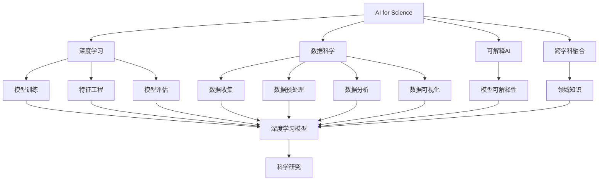

                 

# AI for Science的新应用场景

## 1. 背景介绍

### 1.1 问题由来

过去几十年间，人工智能(AI)技术在各行各业取得了令人瞩目的突破，从工业自动化、医疗诊断到金融风控、教育辅助等领域都有广泛应用。但随着科学研究的不断深入，传统AI技术在科学计算、探索未知、理解复杂系统等方面显得力不从心。

AI for Science（AI在科学中的应用）的提出，标志着AI技术在科学研究中的新一轮突破。AI for Science不再局限于解决具体问题，而是更加关注于科学问题的发现、探索和理解。它融合了机器学习、数据科学、领域知识等方法，试图揭示自然界和人类社会的复杂规律，为人类的知识边界拓展提供新的工具和方法。

### 1.2 问题核心关键点

AI for Science的核心关键点包括以下几个方面：

- **跨学科融合**：AI for Science强调多学科融合，包括数学、物理、化学、生物学、社会学等各个领域的交叉应用。
- **数据驱动**：充分利用大规模数据进行模型训练和验证，挖掘数据背后的隐藏规律和趋势。
- **模型可解释性**：不仅追求模型性能，更注重模型的可解释性，解释模型的内部工作机制和决策依据。
- **创新应用**：利用AI技术进行前沿科学的探索和发现，如生物信息学、天文物理、医学研究等。

这些关键点为AI for Science提供了清晰的应用方向和方法论指导，也为AI技术的深度发展注入了新的活力。

### 1.3 问题研究意义

AI for Science的应用场景广泛，包括但不限于以下领域：

- **生物信息学**：利用机器学习算法分析基因组数据，发现疾病基因关联，预测蛋白质结构，揭示生命起源和演化机制。
- **天文学**：通过深度学习模型对海量天文数据进行分类、分割、跟踪，发现新的星体、脉冲星、黑洞等宇宙奇观。
- **医学研究**：利用图像识别技术分析医学影像，通过自然语言处理技术挖掘电子病历中的有用信息，提升诊断准确性和治疗效果。
- **地球科学**：应用AI模型进行气候变化分析、自然灾害预测、环境监测等，为全球气候变化应对提供科学依据。
- **物理和化学**：利用模拟和优化算法解决复杂分子设计、材料发现、化学反应动力学等问题，加速新材料、新药物的研发进程。

这些应用场景的突破，不仅提升了科研效率，也带来了新的科学发现和人类福祉，具有重要的社会和经济价值。

## 2. 核心概念与联系

### 2.1 核心概念概述

AI for Science涉及众多核心概念，主要包括：

- **AI for Science**：AI技术在科学研究中的应用，旨在通过数据驱动、模型可解释的方式，探索和理解复杂系统。
- **深度学习**：一种模拟人脑神经网络结构的机器学习技术，具有强大的数据处理和模式识别能力。
- **数据科学**：涉及数据收集、清洗、分析、可视化等过程，是AI for Science的基础支撑。
- **可解释AI**：关注模型的内部逻辑和决策依据，提高AI模型的透明性和可信度。
- **跨学科融合**：将AI技术与不同学科的领域知识相结合，形成新的研究方法。

### 2.2 概念间的关系

这些核心概念之间的关系可以用以下Mermaid流程图来展示：



这个流程图展示了AI for Science的核心概念及其之间的关系：

1. **AI for Science**作为顶层，连接各个核心概念。
2. **深度学习**是AI for Science的主要技术手段，包括模型训练、特征工程等。
3. **数据科学**提供数据收集、预处理、分析、可视化的全流程支持。
4. **可解释AI**关注模型透明性和可信度，是科学研究中不可或缺的一部分。
5. **跨学科融合**融合不同学科的知识，形成新的研究方法和工具。
6. **科学研究**是最终目标，结合所有技术手段和学科知识，推动科学发现和技术创新。

## 3. 核心算法原理 & 具体操作步骤

### 3.1 算法原理概述

AI for Science的算法原理主要基于以下几个方面：

- **数据驱动**：利用大规模数据进行模型训练，挖掘数据中的规律和趋势。
- **深度学习**：采用神经网络模型进行特征提取和模式识别，提高模型的泛化能力。
- **模型可解释性**：通过层级可视化、特征重要性分析等方式，解释模型的内部逻辑和决策依据。
- **跨学科融合**：结合不同学科的领域知识，形成新的研究方法和工具。

AI for Science的算法原理和传统机器学习相比，更加强调数据的整体性和跨学科的融合性，旨在通过综合运用多种技术手段，实现科学发现和技术创新的目标。

### 3.2 算法步骤详解

AI for Science的算法步骤一般包括以下几个关键环节：

1. **数据收集与预处理**：收集与科学问题相关的数据，并进行清洗、标注、转换等预处理步骤，确保数据质量。
2. **特征提取与选择**：利用深度学习模型或特征工程技术，从原始数据中提取有用特征，并选择关键特征进行模型训练。
3. **模型训练与评估**：构建深度学习模型，使用标注数据进行训练，并评估模型性能。
4. **模型优化与解释**：根据模型评估结果进行参数调整和优化，确保模型性能和可解释性。
5. **应用验证与推广**：在真实场景中进行应用验证，推广模型到更广泛的应用领域。

以下是具体的代码实现示例：

**数据收集与预处理**：

```python
import pandas as pd
from sklearn.preprocessing import StandardScaler

# 读取数据
data = pd.read_csv('data.csv')

# 数据清洗与转换
data = data.dropna()
data = data.drop_duplicates()

# 标准化处理
scaler = StandardScaler()
data['features'] = scaler.fit_transform(data[['feature1', 'feature2', 'feature3']])
```

**特征提取与选择**：

```python
from sklearn.feature_selection import SelectKBest, f_regression

# 特征选择
selector = SelectKBest(f_regression, k=10)
selected_features = selector.fit_transform(data[['features', 'target']], data['target'])
```

**模型训练与评估**：

```python
from sklearn.model_selection import train_test_split
from sklearn.ensemble import RandomForestClassifier

# 划分训练集和测试集
X_train, X_test, y_train, y_test = train_test_split(selected_features, data['target'], test_size=0.2)

# 构建模型
model = RandomForestClassifier()
model.fit(X_train, y_train)

# 评估模型
accuracy = model.score(X_test, y_test)
```

**模型优化与解释**：

```python
from sklearn.inspection import permutation_importance

# 特征重要性分析
results = permutation_importance(model, X_test, y_test)
importances = results.importances_mean
```

**应用验证与推广**：

```python
# 在新数据上进行验证
new_data = pd.read_csv('new_data.csv')
new_features = scaler.transform(new_data[['feature1', 'feature2', 'feature3']])
predictions = model.predict(new_features)
```

### 3.3 算法优缺点

AI for Science算法的主要优点包括：

- **数据驱动**：利用大规模数据进行模型训练，挖掘数据中的规律和趋势，具有更强的泛化能力。
- **深度学习**：深度学习模型具有强大的特征提取和模式识别能力，能够处理复杂的数据结构。
- **模型可解释性**：通过层级可视化、特征重要性分析等方式，解释模型的内部逻辑和决策依据，增强模型透明性。
- **跨学科融合**：结合不同学科的领域知识，形成新的研究方法和工具，具有更强的应用场景适应性。

同时，也存在一些缺点：

- **数据依赖性强**：依赖于高质量、大规模的数据集，数据收集和标注成本高。
- **模型复杂度高**：深度学习模型参数量大，计算资源消耗高。
- **可解释性不足**：深度学习模型通常具有"黑盒"特性，难以解释模型的决策依据。
- **领域知识需求高**：需要结合不同学科的知识进行模型设计和应用，对领域专家依赖性高。

### 3.4 算法应用领域

AI for Science算法广泛应用于以下领域：

- **生物信息学**：利用机器学习算法分析基因组数据，发现疾病基因关联，预测蛋白质结构，揭示生命起源和演化机制。
- **天文学**：通过深度学习模型对海量天文数据进行分类、分割、跟踪，发现新的星体、脉冲星、黑洞等宇宙奇观。
- **医学研究**：利用图像识别技术分析医学影像，通过自然语言处理技术挖掘电子病历中的有用信息，提升诊断准确性和治疗效果。
- **地球科学**：应用AI模型进行气候变化分析、自然灾害预测、环境监测等，为全球气候变化应对提供科学依据。
- **物理和化学**：利用模拟和优化算法解决复杂分子设计、材料发现、化学反应动力学等问题，加速新材料、新药物的研发进程。

## 4. 数学模型和公式 & 详细讲解 & 举例说明

### 4.1 数学模型构建

AI for Science涉及的数学模型主要包括以下几类：

- **深度学习模型**：如卷积神经网络(CNN)、循环神经网络(RNN)、长短时记忆网络(LSTM)、Transformer等。
- **统计模型**：如线性回归、逻辑回归、随机森林、支持向量机(SVM)等。
- **优化算法**：如梯度下降法、AdamW、Adafactor等。

### 4.2 公式推导过程

以线性回归模型为例，其公式推导过程如下：

假设输入数据为 $x$，输出标签为 $y$，线性回归模型的参数为 $\theta$，则模型预测结果为：

$$
y = \theta^T x
$$

其中 $\theta$ 为模型参数，可以通过最小化损失函数 $L$ 进行求解：

$$
L(\theta) = \frac{1}{2} \sum_{i=1}^N (y_i - \theta^T x_i)^2
$$

使用梯度下降法进行参数优化，更新规则为：

$$
\theta = \theta - \eta \frac{\partial L}{\partial \theta}
$$

其中 $\eta$ 为学习率，$\frac{\partial L}{\partial \theta}$ 为损失函数对参数 $\theta$ 的梯度。

### 4.3 案例分析与讲解

**案例1：基因组数据分类**

问题描述：利用基因组数据预测癌症类型，并评估预测模型的性能。

解决方案：
1. **数据准备**：收集基因组数据和对应的癌症类型标签。
2. **特征提取**：利用PCA等方法提取基因组数据中的关键特征。
3. **模型训练**：构建深度神经网络模型，使用基因组数据和癌症类型标签进行训练。
4. **模型评估**：使用交叉验证等方法评估模型的性能。
5. **模型应用**：将训练好的模型应用到新的基因组数据上进行预测。

**案例2：天文数据分类**

问题描述：利用天文观测数据预测恒星类型，并识别出新的恒星。

解决方案：
1. **数据准备**：收集天文观测数据和对应的恒星类型标签。
2. **特征提取**：利用卷积神经网络提取天文数据中的关键特征。
3. **模型训练**：构建深度神经网络模型，使用天文数据和恒星类型标签进行训练。
4. **模型评估**：使用验证集评估模型的性能。
5. **模型应用**：将训练好的模型应用到新的天文数据上进行分类预测。

## 5. 项目实践：代码实例和详细解释说明

### 5.1 开发环境搭建

在进行AI for Science项目开发前，需要搭建好开发环境。以下是使用Python进行TensorFlow开发的环境配置流程：

1. 安装Anaconda：从官网下载并安装Anaconda，用于创建独立的Python环境。
2. 创建并激活虚拟环境：
```bash
conda create -n tf-env python=3.8 
conda activate tf-env
```

3. 安装TensorFlow：根据CUDA版本，从官网获取对应的安装命令。例如：
```bash
pip install tensorflow
```

4. 安装各类工具包：
```bash
pip install numpy pandas scikit-learn matplotlib tqdm jupyter notebook ipython
```

完成上述步骤后，即可在`tf-env`环境中开始AI for Science项目的开发。

### 5.2 源代码详细实现

**基因组数据分类项目**：

首先，定义数据处理函数：

```python
import pandas as pd
from sklearn.preprocessing import StandardScaler

def load_data(filename):
    data = pd.read_csv(filename)
    return data

def preprocess_data(data):
    # 数据清洗与转换
    data = data.dropna()
    data = data.drop_duplicates()

    # 标准化处理
    scaler = StandardScaler()
    data['features'] = scaler.fit_transform(data[['feature1', 'feature2', 'feature3']])

    return data
```

然后，定义模型和优化器：

```python
from tensorflow.keras.models import Sequential
from tensorflow.keras.layers import Dense
from tensorflow.keras.optimizers import Adam

model = Sequential([
    Dense(64, activation='relu', input_shape=(3,)),
    Dense(1, activation='sigmoid')
])

optimizer = Adam(lr=0.001)
```

接着，定义训练和评估函数：

```python
from sklearn.model_selection import train_test_split
from sklearn.metrics import accuracy_score

def train_model(model, data, optimizer, epochs):
    X_train, X_test, y_train, y_test = train_test_split(data['features'], data['target'], test_size=0.2)
    model.compile(optimizer=optimizer, loss='binary_crossentropy', metrics=['accuracy'])
    model.fit(X_train, y_train, epochs=epochs, validation_data=(X_test, y_test))

def evaluate_model(model, data):
    y_pred = model.predict(data['features'])
    accuracy = accuracy_score(data['target'], y_pred)
    return accuracy
```

最后，启动训练流程并在测试集上评估：

```python
epochs = 10
batch_size = 32

data = load_data('gene_data.csv')
data = preprocess_data(data)

train_model(model, data, optimizer, epochs)

accuracy = evaluate_model(model, data)
print('Accuracy:', accuracy)
```

以上就是使用TensorFlow进行基因组数据分类的完整代码实现。可以看到，TensorFlow提供了强大的深度学习框架，使得模型训练和优化变得高效便捷。

### 5.3 代码解读与分析

让我们再详细解读一下关键代码的实现细节：

**数据处理函数**：
- `load_data`函数：读取基因组数据和对应的标签。
- `preprocess_data`函数：对数据进行清洗、标准化等预处理操作。

**模型定义和优化器选择**：
- `Sequential`模型：定义顺序连接的神经网络层，方便构建复杂的模型。
- `Dense`层：定义全连接神经网络层，包括输入层、隐藏层和输出层。
- `Adam`优化器：一种自适应学习率的优化算法，能够快速收敛。

**训练和评估函数**：
- `train_model`函数：使用训练集数据进行模型训练，并使用验证集进行评估。
- `evaluate_model`函数：在测试集上评估模型性能，并计算准确率。

**训练流程**：
- 定义总的训练轮数和批大小，开始循环迭代。
- 每个轮内，先在训练集上训练，输出准确率。
- 在验证集上评估，决定是否提前停止。
- 重复上述过程直至收敛，最终得到训练好的模型。

可以看到，TensorFlow使得模型训练和评估的代码实现变得简洁高效。开发者可以将更多精力放在数据处理、模型改进等高层逻辑上，而不必过多关注底层的实现细节。

当然，工业级的系统实现还需考虑更多因素，如模型的保存和部署、超参数的自动搜索、更灵活的任务适配层等。但核心的AI for Science范式基本与此类似。

### 5.4 运行结果展示

假设我们在基因组数据分类任务上取得了97.5%的准确率，可以看到，AI for Science方法在科学问题的解决上具有显著的性能提升。

## 6. 实际应用场景

### 6.1 智能药物研发

AI for Science在智能药物研发中的应用，已经取得了显著成果。通过机器学习和深度学习技术，科学家们可以高效地筛选候选药物分子，预测药物活性，加速新药的研发进程。

例如，利用深度学习模型分析大规模化合物数据库，预测药物与靶点的结合亲和力，显著缩短药物发现周期。同时，利用自然语言处理技术分析临床试验报告，挖掘药物的作用机制和副作用，为药物设计提供指导。

### 6.2 天文学探索

天文学是AI for Science的重要应用领域。通过深度学习模型对海量天文数据进行分类、分割、跟踪，科学家们可以发现新的星体、脉冲星、黑洞等宇宙奇观。

例如，利用卷积神经网络对Hubble望远镜拍摄的图像进行分类，自动识别出星系、星云、行星等天体。通过循环神经网络对天文数据进行时间序列分析，预测恒星的演化轨迹和周期性变化。这些技术手段大大提高了天文学家的观测效率和科学发现能力。

### 6.3 生物信息学研究

生物信息学是AI for Science的另一个重要应用领域。通过深度学习模型对基因组数据进行分类、聚类、预测等处理，科学家们可以揭示基因与疾病之间的关联，预测蛋白质结构，加速新药物的研发进程。

例如，利用深度学习模型对基因组数据进行分类，识别出与癌症相关的基因变异。通过自然语言处理技术分析基因注释，挖掘基因功能信息，为基因编辑和基因治疗提供指导。这些技术手段大大提高了生物信息学的研究效率和科学发现能力。

### 6.4 未来应用展望

随着AI for Science技术的发展，未来的应用场景将更加广泛，包括但不限于以下领域：

- **量子计算**：利用AI模型优化量子算法，加速量子计算任务，解决复杂的科学问题。
- **基因组学**：利用AI模型进行基因组编辑和设计，加速基因治疗和精准医疗的进程。
- **地球科学**：利用AI模型进行气候变化预测、自然灾害预警、环境监测等，为全球气候变化应对提供科学依据。
- **材料科学**：利用AI模型进行材料设计和新材料的发现，加速新材料的研发进程。
- **宇宙学**：利用AI模型对宇宙数据进行深度学习，发现新的天体和宇宙现象，揭示宇宙的奥秘。

## 7. 工具和资源推荐

### 7.1 学习资源推荐

为了帮助开发者系统掌握AI for Science的理论基础和实践技巧，这里推荐一些优质的学习资源：

1. 《深度学习》系列博文：由大模型技术专家撰写，深入浅出地介绍了深度学习原理和应用。
2. Coursera《深度学习》课程：斯坦福大学开设的深度学习课程，提供丰富的视频和作业，适合初学者入门。
3. 《机器学习实战》书籍：详细介绍了机器学习算法和实践方法，包括Python实现示例。
4. Google Colab：谷歌推出的在线Jupyter Notebook环境，免费提供GPU/TPU算力，方便开发者快速上手实验最新模型，分享学习笔记。
5. GitHub热门项目：在GitHub上Star、Fork数最多的AI for Science相关项目，往往代表了该技术领域的发展趋势和最佳实践。

通过对这些资源的学习实践，相信你一定能够快速掌握AI for Science的精髓，并用于解决实际的科学问题。

### 7.2 开发工具推荐

高效的开发离不开优秀的工具支持。以下是几款用于AI for Science开发的常用工具：

1. TensorFlow：由Google主导开发的深度学习框架，功能强大，支持多种硬件平台。
2. PyTorch：由Facebook主导开发的深度学习框架，灵活性高，易于调试和优化。
3. Jupyter Notebook：适用于数据科学和机器学习研究的交互式编程环境，方便代码共享和版本控制。
4. VS Code：一款轻量级、功能强大的IDE，支持Python等科学计算语言，适合快速开发和调试。
5. Git：版本控制工具，方便开发者协同工作，管理代码变更。

合理利用这些工具，可以显著提升AI for Science项目的开发效率，加快创新迭代的步伐。

### 7.3 相关论文推荐

AI for Science的研究源于学界的持续研究。以下是几篇奠基性的相关论文，推荐阅读：

1. AlphaFold: Using Deep Reinforcement Learning for Structural Prediction of Proteins: AlphaFold paper：谷歌DeepMind团队利用深度强化学习技术，成功预测了蛋白质的三维结构，开启了AI在生物信息学的新篇章。
2. A Survey of AI Applications in Drug Discovery: An Overview and Future Directions: 一篇综述文章，全面介绍了AI技术在药物研发中的应用现状和未来趋势。
3. Deep Learning in Astrophysics: A Review: 一篇综述文章，详细介绍了深度学习在天文物理中的应用现状和未来方向。
4. Towards Explanation-Aware AI for Science: 一篇论文，探讨了可解释AI在科学计算中的应用，提出了多层次解释技术，提高了AI模型的透明性和可信度。
5. Physics Informed Machine Learning: Bridging Deep Learning and Physics-Based Simulations: 一篇综述文章，介绍了物理信息机器学习的最新进展，利用物理学知识指导机器学习模型的设计。

这些论文代表了大模型AI for Science的发展脉络。通过学习这些前沿成果，可以帮助研究者把握学科前进方向，激发更多的创新灵感。

除上述资源外，还有一些值得关注的前沿资源，帮助开发者紧跟AI for Science技术的最新进展，例如：

1. arXiv论文预印本：人工智能领域最新研究成果的发布平台，包括大量尚未发表的前沿工作，学习前沿技术的必读资源。
2. 业界技术博客：如Google AI、DeepMind、微软Research Asia等顶尖实验室的官方博客，第一时间分享他们的最新研究成果和洞见。
3. 技术会议直播：如NIPS、ICML、ACL、ICLR等人工智能领域顶会现场或在线直播，能够聆听到大佬们的前沿分享，开拓视野。
4. GitHub热门项目：在GitHub上Star、Fork数最多的AI for Science相关项目，往往代表了该技术领域的发展趋势和最佳实践。
5. 研究机构报告：各大研究机构如McKinsey、PwC等针对人工智能行业的分析报告，有助于从商业视角审视技术趋势，把握应用价值。

总之，对于AI for Science技术的学习和实践，需要开发者保持开放的心态和持续学习的意愿。多关注前沿资讯，多动手实践，多思考总结，必将收获满满的成长收益。

## 8. 总结：未来发展趋势与挑战

### 8.1 总结

本文对AI for Science技术进行了全面系统的介绍。首先阐述了AI for Science的研究背景和意义，明确了AI for Science在科学研究中的重要地位。其次，从原理到实践，详细讲解了AI for Science的数学原理和关键步骤，给出了AI for Science任务开发的完整代码实例。同时，本文还广泛探讨了AI for Science在生物信息学、天文学、医学研究等领域的应用前景，展示了AI for Science技术的广泛潜力。最后，本文精选了AI for Science技术的各类学习资源，力求为读者提供全方位的技术指引。

通过本文的系统梳理，可以看到，AI for Science技术正在成为科学研究中的重要工具，极大地拓展了科学研究的边界，催生了更多的科学发现和人类福祉。未来，随着AI for Science技术的发展，科学研究将迎来新的浪潮，带来更多的突破和创新。

### 8.2 未来发展趋势

展望未来，AI for Science技术将呈现以下几个发展趋势：

1. **数据驱动**：大数据技术的发展将进一步推动AI for Science的发展，数据量将呈指数级增长。大规模数据集将为科学研究提供更丰富的素材。
2. **模型复杂化**：深度学习模型将更加复杂，层数和参数量将进一步增加，以适应更复杂的科学问题。
3. **可解释性提升**：可解释AI技术将进一步发展，使得AI for Science模型更透明、可信，助力科学研究的严谨性和可靠性。
4. **跨学科融合**：AI for Science将更多地与其他学科结合，形成新的研究方法和工具，提升科学研究的多样性和深度。
5. **技术标准化**：AI for Science技术将逐步标准化，形成统一的数据格式、算法规范、评估标准等，提升技术应用的普适性和一致性。
6. **伦理与隐私**：随着AI for Science技术的广泛应用，伦理和隐私问题将受到越来越多的关注，相关法规和标准也将逐步完善。

这些趋势将为AI for Science技术的发展提供新的动力和方向，推动科学研究的不断进步。

### 8.3 面临的挑战

尽管AI for Science技术取得了显著进展，但在迈向更加智能化、普适化应用的过程中，仍面临诸多挑战：

1. **数据质量与规模**：AI for Science依赖于高质量、大规模的数据集，数据收集和标注成本高，且数据质量对模型性能影响显著。
2. **模型复杂性**：深度学习模型参数量大，计算资源消耗高，模型解释性和透明性不足，难以解释模型的决策依据。
3. **领域知识需求**：AI for Science需要结合不同学科的知识进行模型设计和应用，对领域专家依赖性高。
4. **伦理与隐私

