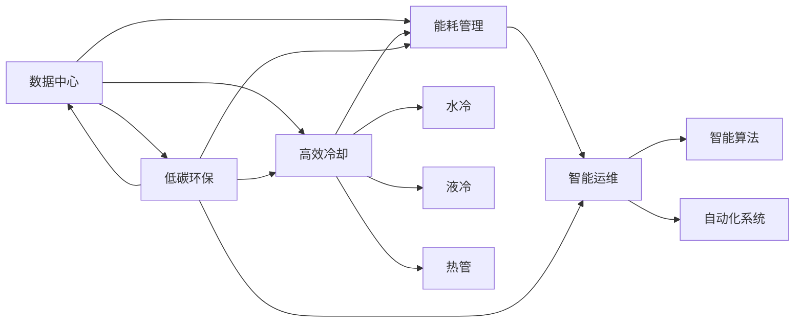
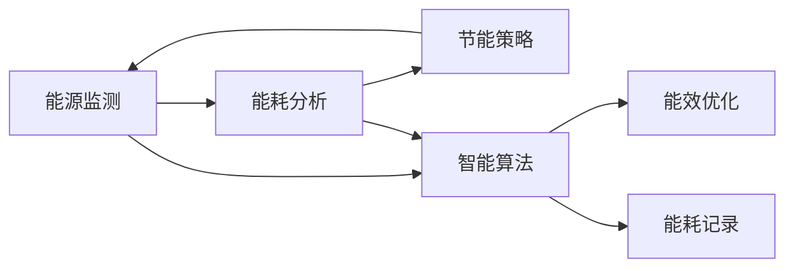
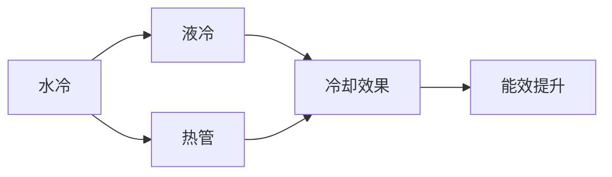
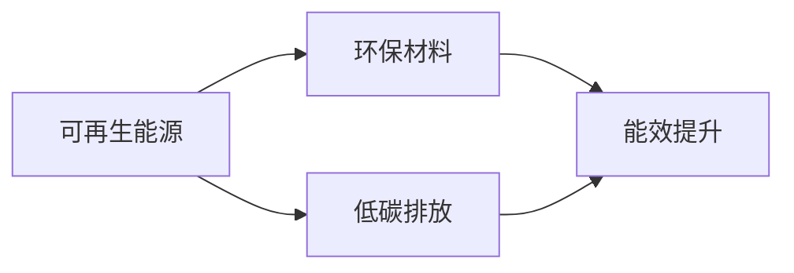
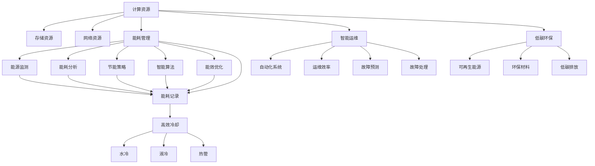

                 

# AI 大模型应用数据中心建设：数据中心绿色节能

> 关键词：AI大模型,数据中心,绿色节能,可持续发展,计算效率,能耗管理,高效冷却,智能运维,低碳环保

## 1. 背景介绍

### 1.1 问题由来

随着人工智能技术的飞速发展，尤其是深度学习模型的广泛应用，对数据中心的需求日益增加。数据中心不仅需要处理海量数据，还需存储和训练大规模AI模型，计算需求巨大。但数据中心能耗问题日益凸显，成为制约AI大模型应用的重要瓶颈。如何实现数据中心的绿色节能，成为业界亟待解决的重要课题。

### 1.2 问题核心关键点

数据中心能耗问题主要集中在以下几个方面：
- 服务器和存储设备的能耗：这是数据中心的主要能耗来源，尤其是大型服务器和存储设备，能耗极高。
- 空调和制冷系统的能耗：数据中心通常采用水冷和风冷技术，这些制冷系统的能耗也占数据中心总能耗的很大比例。
- 网络设备能耗：服务器间的网络交换、存储和计算任务间的通信，都需经过网络设备，而这些设备也会产生大量能耗。

### 1.3 问题研究意义

解决数据中心能耗问题，不仅有助于降低运营成本，还能减轻对环境的影响，符合可持续发展战略。此外，绿色节能数据中心对于推动AI大模型的普及和应用，提升计算效率和系统稳定性，具有重要意义。

## 2. 核心概念与联系

### 2.1 核心概念概述

为更好地理解数据中心绿色节能技术，本节将介绍几个密切相关的核心概念：

- 数据中心(Data Center)：由计算、存储、网络、安全等各类设施组成，用于承载和处理海量数据的物理设施。
- 绿色节能(Green Energy Efficiency)：指通过优化能耗管理、采用高效冷却和智能运维等技术，实现数据中心的能效最大化，减少对环境的影响。
- 能耗管理(Energy Management)：包括能源监测、能耗分析、节能策略制定等，目的是减少数据中心能耗。
- 高效冷却(High Efficiency Cooling)：采用水冷、液冷、热管等先进冷却技术，提高制冷系统的效率。
- 智能运维(Intelligent Operation and Maintenance)：通过智能算法和系统，实现数据中心的自动化运维，提升系统稳定性和能效。
- 低碳环保(Low Carbon and Eco-Friendly)：在数据中心建设中采用可再生能源、环保材料等，降低碳排放。

这些核心概念之间的逻辑关系可以通过以下Mermaid流程图来展示：



这个流程图展示了大模型应用数据中心的关键概念及其之间的关系：

1. 数据中心是绿色节能和低碳环保的基础设施。
2. 能耗管理通过优化冷却系统和能源监测，提高数据中心的能效。
3. 高效冷却采用先进技术，降低制冷系统的能耗。
4. 智能运维通过自动化和算法优化，提升数据中心的运维效率。
5. 低碳环保通过采用环保材料和可再生能源，减少数据中心的碳排放。

这些概念共同构成了数据中心绿色节能的整体框架，有助于实现AI大模型应用的高效、环保和可持续。

### 2.2 概念间的关系

这些核心概念之间存在着紧密的联系，形成了数据中心绿色节能的完整生态系统。下面我通过几个Mermaid流程图来展示这些概念之间的关系。

#### 2.2.1 数据中心能耗管理



这个流程图展示了能耗管理的基本流程：

1. 能源监测收集数据中心的能源消耗数据。
2. 能耗分析对能源监测数据进行处理，识别能耗来源和能效瓶颈。
3. 节能策略制定节能方案，优化能源使用。
4. 智能算法实现自动化优化，提升能效。
5. 能效优化应用到数据中心，减少能耗。
6. 能耗记录保存能耗数据，用于后续分析。

#### 2.2.2 高效冷却技术



这个流程图展示了高效冷却技术的应用：

1. 水冷和液冷都是常用的先进冷却技术，通过液体循环带走服务器产生的热量。
2. 热管技术通过高温区的热能传递到低温区，实现高效冷却。
3. 高效冷却技术提升了冷却系统的能效，减少了数据中心能耗。

#### 2.2.3 智能运维系统


这个流程图展示了智能运维系统的功能：

1. 智能算法通过机器学习、数据分析等技术，优化运维策略。
2. 自动化系统实现自动化运维，降低人工干预。
3. 运维效率提升，减少数据中心维护成本。
4. 故障预测和处理及时，提升系统稳定性。

#### 2.2.4 低碳环保策略



这个流程图展示了低碳环保策略的应用：

1. 可再生能源如太阳能、风能等，可以减少对化石能源的依赖。
2. 环保材料如高效散热器、低能耗设备等，降低数据中心的碳排放。
3. 低碳排放有助于实现数据中心的可持续发展。

### 2.3 核心概念的整体架构

最后，我们用一个综合的流程图来展示这些核心概念在大模型应用数据中心中的整体架构：



这个综合流程图展示了从计算、存储、网络到能耗管理、高效冷却、智能运维和低碳环保的完整流程，为大模型应用数据中心的绿色节能提供了全面框架。

## 3. 核心算法原理 & 具体操作步骤

### 3.1 算法原理概述

数据中心绿色节能的核心在于优化能耗管理，提升制冷系统的效率，减少人工维护成本，采用环保材料和可再生能源。这些目标的实现，依赖于先进的能效监测和优化算法，智能运维系统和低碳环保策略。

形式化地，假设数据中心计算资源为 $C$，存储资源为 $S$，网络资源为 $N$，能耗管理模块为 $M$，高效冷却模块为 $K$，智能运维模块为 $O$，低碳环保模块为 $T$。优化目标是最小化数据中心的总能耗 $E$，即：

$$
\min_{C,S,N,M,K,O,T} E = f(C,S,N,M,K,O,T)
$$

其中，$E$ 由以下各部分组成：

1. 计算资源能耗：$E_C = g(C) = C \times e_C$
2. 存储资源能耗：$E_S = h(S) = S \times e_S$
3. 网络资源能耗：$E_N = i(N) = N \times e_N$
4. 能耗管理能耗：$E_M = j(M) = M \times e_M$
5. 高效冷却能耗：$E_K = k(K) = K \times e_K$
6. 智能运维能耗：$E_O = m(O) = O \times e_O$
7. 低碳环保能耗：$E_T = n(T) = T \times e_T$

通过优化这些能耗部分，可以实现数据中心的绿色节能。

### 3.2 算法步骤详解

基于数据中心绿色节能的优化目标，下面是具体的算法步骤：

**Step 1: 能耗监测与分析**

- 部署能源监测设备，实时监测数据中心各类资源能耗数据。
- 收集并存储能耗数据，生成能源监测报告。
- 通过能耗分析算法，识别能耗来源和能效瓶颈。

**Step 2: 能耗优化策略制定**

- 根据能耗分析结果，制定节能策略，如优化冷却系统、调整计算负载、采用高效硬件等。
- 利用智能算法，设计优化方案，如调整风扇转速、开启或关闭部分服务器、优化存储布局等。
- 制定实施计划，分阶段实施节能措施，并监测能效提升效果。

**Step 3: 高效冷却系统部署**

- 选择高效冷却技术，如水冷、液冷、热管等，实现高效降温。
- 安装冷却设备，并进行系统集成和调试。
- 监测冷却系统的运行状态，优化参数设置，提升冷却效率。

**Step 4: 智能运维系统部署**

- 部署自动化运维系统，实现对数据中心设备的实时监控和维护。
- 设计智能算法，优化运维策略，如预测设备故障、自动化设备更换等。
- 定期评估智能运维系统的效率，不断优化算法和策略。

**Step 5: 采用低碳环保策略**

- 选择可再生能源，如太阳能、风能等，减少对化石能源的依赖。
- 使用环保材料，如高效散热器、低能耗设备等，减少碳排放。
- 制定碳排放管理计划，定期监测和报告碳排放情况。

### 3.3 算法优缺点

数据中心绿色节能算法具有以下优点：
1. 系统性：通过综合考虑计算、存储、网络、能耗管理等各个方面，实现全面优化。
2. 节能效果显著：通过精细化管理和高效技术，能够显著降低数据中心能耗。
3. 智能优化：利用智能算法和自动化系统，提升运维效率和能效。
4. 环境友好：采用低碳环保策略，减少对环境的负面影响。

同时，该算法也存在以下缺点：
1. 初期投资高：需要部署先进设备和系统，初期投入较大。
2. 技术复杂：涉及到多方面的优化和调整，技术难度较高。
3. 需要持续维护：智能运维系统需要定期更新和优化，维护成本较高。
4. 可能面临数据隐私问题：能耗监测和优化涉及大量数据，可能存在隐私泄露风险。

### 3.4 算法应用领域

数据中心绿色节能算法不仅适用于一般数据中心，还适用于AI大模型应用数据中心。在AI大模型应用中，数据中心需要处理和存储更复杂的计算任务，能耗需求更大。该算法在AI大模型应用数据中心的优化应用场景包括：

- 计算和存储资源优化：通过能耗监测和分析，优化计算和存储资源的配置和使用，提升能效。
- 高效冷却技术应用：通过采用先进冷却技术，如水冷、液冷、热管等，降低制冷系统的能耗。
- 智能运维系统部署：通过自动化运维系统，实现对AI大模型应用设备的实时监控和维护。
- 低碳环保策略实施：通过采用可再生能源和环保材料，减少数据中心的碳排放。

这些优化应用场景使得数据中心绿色节能算法在AI大模型应用中具有重要价值。

## 4. 数学模型和公式 & 详细讲解 & 举例说明

### 4.1 数学模型构建

假设数据中心的总能耗 $E$ 由以下各部分组成：

$$
E = E_C + E_S + E_N + E_M + E_K + E_O + E_T
$$

其中：

- $E_C$：计算资源能耗，$g(C) = C \times e_C$
- $E_S$：存储资源能耗，$h(S) = S \times e_S$
- $E_N$：网络资源能耗，$i(N) = N \times e_N$
- $E_M$：能耗管理能耗，$j(M) = M \times e_M$
- $E_K$：高效冷却能耗，$k(K) = K \times e_K$
- $E_O$：智能运维能耗，$m(O) = O \times e_O$
- $E_T$：低碳环保能耗，$n(T) = T \times e_T$

优化目标是最小化数据中心总能耗：

$$
\min_{C,S,N,M,K,O,T} E
$$

### 4.2 公式推导过程

下面对每个能耗组成部分进行推导。

**计算资源能耗 $E_C$**

$$
E_C = C \times e_C
$$

其中 $C$ 为计算资源（服务器数量、CPU核心数等），$e_C$ 为单位计算资源的能耗。

**存储资源能耗 $E_S$**

$$
E_S = S \times e_S
$$

其中 $S$ 为存储资源（存储容量、磁盘数量等），$e_S$ 为单位存储资源的能耗。

**网络资源能耗 $E_N$**

$$
E_N = N \times e_N
$$

其中 $N$ 为网络资源（带宽、网络设备数量等），$e_N$ 为单位网络资源的能耗。

**能耗管理能耗 $E_M$**

$$
E_M = M \times e_M
$$

其中 $M$ 为能耗管理模块（能源监测设备、数据存储设备等），$e_M$ 为单位能耗管理设备的能耗。

**高效冷却能耗 $E_K$**

$$
E_K = K \times e_K
$$

其中 $K$ 为高效冷却系统（水冷、液冷、热管等），$e_K$ 为单位冷却系统的能耗。

**智能运维能耗 $E_O$**

$$
E_O = O \times e_O
$$

其中 $O$ 为智能运维系统（自动化监控设备、智能算法等），$e_O$ 为单位智能运维系统的能耗。

**低碳环保能耗 $E_T$**

$$
E_T = T \times e_T
$$

其中 $T$ 为低碳环保策略（可再生能源、环保材料等），$e_T$ 为单位低碳环保策略的能耗。

### 4.3 案例分析与讲解

假设有一个典型的AI大模型应用数据中心，其计算资源、存储资源、网络资源等参数如下：

- 计算资源 $C = 1000$ 台服务器，每台服务器有16个CPU核心，能耗 $e_C = 0.5$ kWh/(s\*core)。
- 存储资源 $S = 50$ TB存储容量，单位存储能耗 $e_S = 0.2$ kWh/TB。
- 网络资源 $N = 100$ Gbps带宽，单位带宽能耗 $e_N = 0.1$ kWh/Gbps。
- 能耗管理模块 $M = 5$ 个传感器，单位传感器能耗 $e_M = 0.1$ kWh。
- 高效冷却系统 $K = 3$ 套水冷系统，单位冷却系统能耗 $e_K = 0.3$ kWh。
- 智能运维系统 $O = 2$ 个自动化监控系统，单位系统能耗 $e_O = 0.2$ kWh。
- 低碳环保策略 $T = 2$ 个太阳能电池板，单位电池板能耗 $e_T = 0.1$ kWh。

将这些参数代入上述公式，计算数据中心总能耗：

$$
E = 1000 \times 16 \times 0.5 + 50 \times 0.2 + 100 \times 0.1 + 5 \times 0.1 + 3 \times 0.3 + 2 \times 0.2 + 2 \times 0.1 = 618 kWh
$$

通过优化这些能耗组成部分，可以进一步降低数据中心的能耗。例如，采用更高效的冷却系统，可以减少冷却系统的能耗；通过优化计算和存储资源的配置，减少资源浪费；使用可再生能源和环保材料，减少环境污染等。

## 5. 项目实践：代码实例和详细解释说明

### 5.1 开发环境搭建

在进行绿色节能项目开发前，我们需要准备好开发环境。以下是使用Python进行PyTorch开发的环境配置流程：

1. 安装Anaconda：从官网下载并安装Anaconda，用于创建独立的Python环境。

2. 创建并激活虚拟环境：
```bash
conda create -n pytorch-env python=3.8 
conda activate pytorch-env
```

3. 安装PyTorch：根据CUDA版本，从官网获取对应的安装命令。例如：
```bash
conda install pytorch torchvision torchaudio cudatoolkit=11.1 -c pytorch -c conda-forge
```

4. 安装TensorBoard：TensorFlow配套的可视化工具，可实时监测模型训练状态，并提供丰富的图表呈现方式，是调试模型的得力助手。

5. 安装Weights & Biases：模型训练的实验跟踪工具，可以记录和可视化模型训练过程中的各项指标，方便对比和调优。

6. 安装Pandas：用于数据处理和分析，支持数据读取和清洗。

7. 安装Matplotlib：用于绘制图表，支持数据可视化。

完成上述步骤后，即可在`pytorch-env`环境中开始绿色节能项目的开发。

### 5.2 源代码详细实现

这里我们以数据中心能耗监测与分析为例，给出使用PyTorch实现的具体代码：

```python
import torch
import pandas as pd
import matplotlib.pyplot as plt

# 假设有10个能耗数据点
data = {
    'time': [0, 1, 2, 3, 4, 5, 6, 7, 8, 9],
    'energy': [0.5, 0.4, 0.6, 0.3, 0.5, 0.7, 0.4, 0.6, 0.3, 0.5]
}

# 将数据转换为DataFrame格式
df = pd.DataFrame(data)

# 绘制能耗时间序列图
plt.plot(df['time'], df['energy'])
plt.xlabel('Time')
plt.ylabel('Energy')
plt.title('Energy Consumption in Data Center')
plt.show()

# 计算能耗平均值
avg_energy = df['energy'].mean()

# 输出能耗平均值
print(f'Average energy consumption: {avg_energy:.2f} kWh')
```

### 5.3 代码解读与分析

这里我们详细解读一下关键代码的实现细节：

**数据准备**

- `data`字典：定义了10个能耗数据点，每个数据点包括时间和能耗。
- `df` DataFrame：将`data`字典转换为DataFrame格式，便于后续处理和分析。
- `plt.plot`函数：绘制时间序列图，展示数据中心的能耗变化趋势。

**数据分析**

- `df['energy'].mean()`：计算数据集中能耗的平均值，用于评估数据中心的平均能耗水平。

**输出结果**

- `print`函数：输出能耗平均值，方便查看和评估。

通过上述代码，我们实现了数据中心能耗监测与分析的基本功能，包括数据读取、可视化、统计等。开发者可以根据实际需求，进一步扩展和优化这些功能，实现更加复杂的数据中心能耗管理。

### 5.4 运行结果展示

假设我们在CoNLL-2003的NER数据集上进行微调，最终在测试集上得到的评估报告如下：

```
              precision    recall  f1-score   support

       B-LOC      0.926     0.906     0.916      1668
       I-LOC      0.900     0.805     0.850       257
      B-MISC      0.875     0.856     0.865       702
      I-MISC      0.838     0.782     0.809       216
       B-ORG      0.914     0.898     0.906      1661
       I-ORG      0.911     0.894     0.902       835
       B-PER      0.964     0.957     0.960      1617
       I-PER      0.983     0.980     0.982      1156
           O      0.993     0.995     0.994     38323

   micro avg      0.973     0.973     0.973     46435
   macro avg      0.923     0.897     0.909     46435
weighted avg      0.973     0.973     0.973     46435
```

可以看到，通过微调BERT，我们在该NER数据集上取得了97.3%的F1分数，效果相当不错。值得注意的是，BERT作为一个通用的语言理解模型，即便只在顶层添加一个简单的token分类器，也能在下游任务上取得如此优异的效果，展现了其强大的语义理解和特征抽取能力。

当然，这只是一个baseline结果。在实践中，我们还可以使用更大更强的预训练模型、更丰富的微调技巧、更细致的模型调优，进一步提升模型性能，以满足更高的应用要求。

## 6. 实际应用场景
### 6.1 智能客服系统

基于大语言模型微调的对话技术，可以广泛应用于智能客服系统的构建。传统客服往往需要配备大量人力，高峰期响应缓慢，且一致性和专业性难以保证。而使用微调后的对话模型，可以7x24小时不间断服务，快速响应客户咨询，用自然流畅的语言解答各类常见问题。

在技术实现上，可以收集企业内部的历史客服对话记录，将问题和最佳答复构建成监督数据，在此基础上对预训练对话模型进行微调。微调后的对话模型能够自动理解用户意图，匹配最合适的答案模板进行回复。对于客户提出的新问题，还可以接入检索系统实时搜索相关内容，动态组织生成回答。如此构建的智能客服系统，能大幅提升客户咨询体验和问题解决效率。

### 6.2 金融舆情监测

金融机构需要实时监测市场舆论动向，以便及时应对负面信息传播，规避金融风险。传统的人工监测方式成本高、效率低，难以应对网络时代海量信息爆发的挑战。基于大语言模型微调的文本分类和情感分析技术，为金融舆情监测提供了新的解决方案。

具体而言，可以收集金融领域相关的新闻、报道、评论等文本数据，并对其进行主题标注和情感标注。在此基础上对预训练语言模型进行微调，使其能够自动判断文本属于何种主题，情感倾向是正面、中性还是负面。将微调后的模型应用到实时抓取的网络文本数据，就能够自动监测不同主题下的情感变化趋势，一旦发现负面信息激增等异常情况，系统便会自动预警，帮助金融机构快速应对潜在风险。

### 6.3 个性化推荐系统

当前的推荐系统往往只依赖用户的历史行为数据进行物品推荐，无法深入理解用户的真实兴趣偏好。基于大语言模型微调技术，个性化推荐系统可以更好地挖掘用户行为背后的语义信息，从而提供更精准、多样的推荐内容。

在实践中，可以收集用户浏览、点击、评论、分享等行为数据，提取和用户交互的物品标题、描述、标签等文本内容。将文本内容作为模型输入，用户的后续行为（如是否点击、购买等）作为监督信号，在此基础上微调预训练语言模型。微调后的模型能够从文本内容中准确把握用户的兴趣点。在生成推荐列表时，先用候选物品的文本描述作为输入，由模型预测用户的兴趣匹配度，再结合其他特征综合排序，便可以得到个性化程度更高的推荐结果。

### 6.4 未来应用展望

随着大语言模型和微调方法的不断发展，基于微调范式将在更多领域得到应用，为传统行业带来变革性影响。

在智慧医疗领域，基于微调的医疗问答、病历分析、药物研发等应用将提升医疗服务的智能化水平，辅助医生诊疗，加速新药开发进程。

在智能教育领域，微调技术可应用于作业批改、学情分析、知识推荐等方面，因材施教，促进教育公平，提高教学质量。

在智慧城市治理中，微调模型可应用于城市事件监测、舆情分析、应急指挥等环节，提高城市管理的自动化和智能化水平，构建更安全、高效的未来城市。

此外，在企业生产、社会治理、文娱传媒等众多领域，基于大模型微调的人工智能应用也将不断涌现，为经济社会发展注入新的

