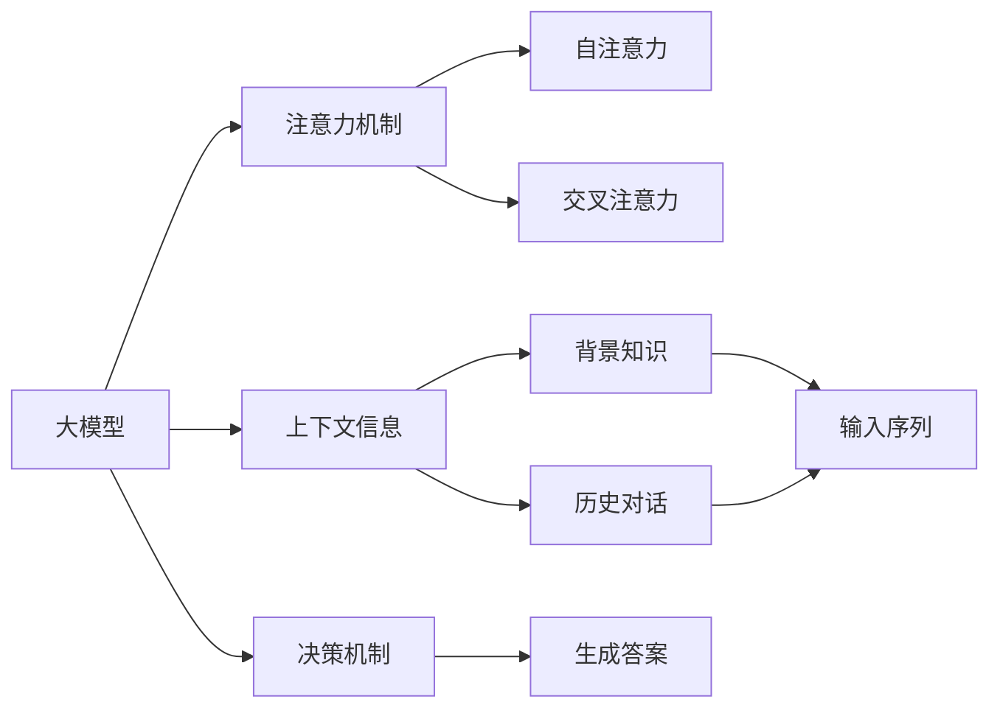
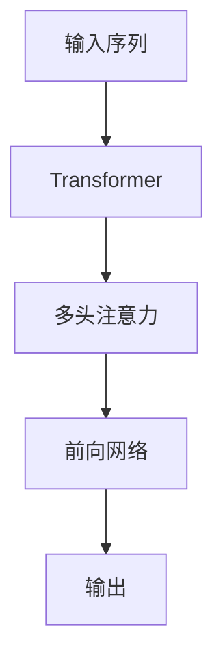
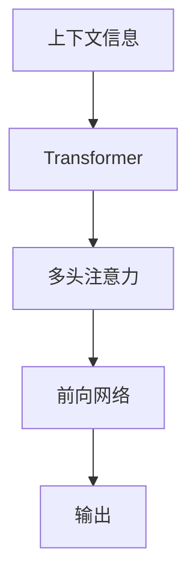
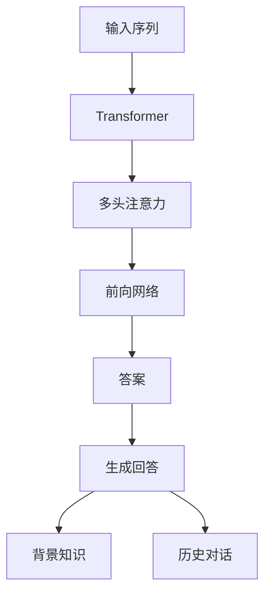

                 

## 1. 背景介绍

### 1.1 问题由来

近年来，自然语言处理(NLP)领域的大模型技术得到了迅猛发展，诸如GPT-3、BERT等模型在各类NLP任务上取得了令人瞩目的成绩。这些模型通过自监督预训练，学习了丰富的语言表征，具备强大的语言理解和生成能力。

然而，将大模型应用于具体任务时，还需要进一步优化和微调。尽管大模型已经能够完成诸如问答、文本生成、文本分类等任务，但要想更好地适配特定任务，并在实际应用中取得理想效果，仍需深入理解其在不同上下文下的决策机制。

### 1.2 问题核心关键点

问题核心在于如何更好地结合用户问句与上下文信息，使大模型能够输出更符合任务要求的答案。传统的预训练模型往往缺乏对上下文信息的有效利用，难以在复杂任务中取得优异的性能。

为了提升模型的上下文理解能力，研究人员提出了各类基于注意力机制的模型架构，如Transformer、T5等。这些模型在预训练过程中，能够关注输入序列中的不同部分，从而增强对上下文信息的捕捉能力。然而，在实际应用中，这些模型仍然面临处理多样性、增强鲁棒性、提高决策效率等挑战。

### 1.3 问题研究意义

研究大模型结合问句与上下文进行决策的方法，对于提升模型在特定任务上的性能，推动NLP技术在各行各业的应用具有重要意义：

1. **提升模型性能**：通过结合上下文信息，使模型能够更准确地理解用户意图，生成更符合用户需求的答案，从而提升模型在特定任务上的性能。
2. **推动技术落地**：结合具体任务特点，优化模型架构和训练方法，有助于将大模型技术更好地应用到实际场景中，加速NLP技术的产业化进程。
3. **增强模型鲁棒性**：通过结合上下文信息，增强模型对输入多样性的处理能力，使其在面对噪声、非标准输入等情况下仍能稳定输出，提高模型鲁棒性。
4. **提高决策效率**：结合问句与上下文信息，能够在大模型中进行更高效的推理和计算，提高任务执行的效率。

## 2. 核心概念与联系

### 2.1 核心概念概述

为更好地理解大模型结合问句与上下文的决策机制，本节将介绍几个核心概念：

- **大模型**：以Transformer为代表的大规模预训练语言模型，通过自监督学习任务学习通用语言表示，具备强大的语言理解和生成能力。
- **注意力机制**：Transformer的核心组件，通过自注意力机制和交叉注意力机制，使模型能够关注输入序列的不同部分，捕捉上下文信息。
- **上下文信息**：指用户问句之外的额外信息，如背景知识、历史对话等，有助于提升模型对问句语义的理解和推理能力。
- **决策机制**：指模型在接收用户问句和上下文信息后，如何进行推理和计算，生成最终答案的逻辑过程。

这些概念通过以下Mermaid流程图来展示：



这个流程图展示了大模型、注意力机制、上下文信息以及决策机制之间的联系。大模型通过注意力机制捕捉上下文信息，结合决策机制生成答案。

### 2.2 概念间的关系

这些核心概念之间存在着紧密的联系，形成了大模型结合问句与上下文进行决策的整体架构。下面我们通过几个Mermaid流程图来展示这些概念之间的关系。

#### 2.2.1 大模型架构



这个流程图展示了Transformer模型的基本架构。输入序列经过多头注意力机制，生成中间表示，再经过前向网络输出最终结果。

#### 2.2.2 上下文信息的融合



这个流程图展示了上下文信息如何融入大模型进行决策。上下文信息通过多头注意力机制，与输入序列进行交互，生成更丰富的上下文表示，最终输出答案。

#### 2.2.3 决策机制的实现


这个流程图展示了决策机制在大模型中的实现。问句通过Transformer模型进行推理，生成最终答案。

### 2.3 核心概念的整体架构

最后，我们用一个综合的流程图来展示这些核心概念在大模型结合问句与上下文进行决策过程中的整体架构：



这个综合流程图展示了从输入序列到答案生成的完整过程，以及背景知识和历史对话等上下文信息的融合。通过这些核心概念的结合，大模型能够更好地理解用户问句，生成符合用户需求的答案。

## 3. 核心算法原理 & 具体操作步骤
### 3.1 算法原理概述

大模型结合问句与上下文的决策机制，本质上是一种基于注意力机制的序列到序列(Seq2Seq)生成任务。其核心思想是：通过多头注意力机制，使模型能够关注输入序列的不同部分，捕捉上下文信息，从而生成符合任务要求的答案。

形式化地，假设输入序列为 $x=(x_1, x_2, \dots, x_n)$，上下文信息为 $c$，输出答案为 $y=(y_1, y_2, \dots, y_m)$。决策模型的目标是最小化损失函数 $L$，使得生成的答案 $y$ 尽可能地接近真实答案 $y^*$。常用的损失函数包括交叉熵损失、均方误差损失等。

通过梯度下降等优化算法，模型不断更新参数，最小化损失函数 $L$，最终生成符合任务要求的答案。

### 3.2 算法步骤详解

基于大模型结合问句与上下文进行决策的算法，一般包括以下几个关键步骤：

**Step 1: 数据准备**
- 收集与任务相关的标注数据集 $D=\{(x_i, c_i, y_i)\}_{i=1}^N$，其中 $x_i$ 为输入序列，$c_i$ 为上下文信息，$y_i$ 为真实答案。
- 对数据集进行划分，分为训练集、验证集和测试集。

**Step 2: 模型选择与搭建**
- 选择合适的预训练语言模型，如BERT、GPT等，作为初始化参数。
- 搭建决策模型，通常使用Transformer架构，添加多头注意力机制、前向网络等组件。

**Step 3: 模型微调**
- 将数据集 $D$ 输入模型，进行有监督训练，最小化损失函数 $L$。
- 设置适当的学习率、批大小、迭代轮数等超参数，使用梯度下降等优化算法进行训练。

**Step 4: 评估与优化**
- 在验证集上评估模型性能，使用精度、召回率、F1分数等指标进行评估。
- 根据评估结果调整超参数，重新训练模型。

**Step 5: 应用与部署**
- 将训练好的模型部署到实际应用场景中，进行推理和计算，生成最终答案。
- 对推理结果进行后处理，如去噪、截断等，确保答案质量。

### 3.3 算法优缺点

基于大模型结合问句与上下文的决策算法，具有以下优点：

1. **较强的上下文理解能力**：通过多头注意力机制，模型能够关注输入序列的不同部分，捕捉上下文信息，从而生成更符合任务要求的答案。
2. **可扩展性强**：适用于各类NLP任务，通过改变任务适配层和损失函数，即可应用于不同的任务场景。
3. **训练高效**：相比于从头训练，微调方法能够在较少标注数据的情况下，快速获得较好的性能提升。

然而，该算法也存在一些局限性：

1. **数据需求较大**：虽然微调方法能够在较少数据上取得较好效果，但对于某些复杂任务，仍然需要大量的标注数据。
2. **鲁棒性不足**：面对噪声、非标准输入等情况，模型容易出现过拟合或泛化能力不足的问题。
3. **计算资源要求高**：大模型和注意力机制的计算复杂度较高，对硬件资源的要求也较高。

### 3.4 算法应用领域

基于大模型结合问句与上下文的决策算法，已经广泛应用于各类NLP任务，例如：

- 问答系统：通过结合用户问题和背景知识，生成准确的回答。
- 机器翻译：结合源语言和目标语言的上下文信息，生成符合语法和语义的翻译结果。
- 文本摘要：结合文本和摘要模板，生成简明的摘要内容。
- 对话系统：通过结合历史对话和用户输入，生成自然流畅的回复。
- 情感分析：结合文本和用户情绪标签，进行情感分类。

这些任务涉及到自然语言的处理和理解，通过结合问句与上下文，大模型能够在复杂场景下生成准确、自然的答案。

## 4. 数学模型和公式 & 详细讲解 & 举例说明
### 4.1 数学模型构建

形式化地，假设输入序列 $x=(x_1, x_2, \dots, x_n)$，上下文信息 $c$，输出答案 $y=(y_1, y_2, \dots, y_m)$。模型的目标是最小化损失函数 $L$：

$$
L = \mathbb{E}_{(x_i, c_i, y_i)} \left[ \frac{1}{N} \sum_{i=1}^N L(x_i, c_i, y_i) \right]
$$

其中，$L(x_i, c_i, y_i)$ 为损失函数，衡量模型预测 $y_i$ 与真实答案 $y_i^*$ 之间的差异。

### 4.2 公式推导过程

以二分类任务为例，假设输入序列 $x=(x_1, x_2, \dots, x_n)$，上下文信息 $c$，输出答案 $y=(y_1, y_2, \dots, y_m)$。模型预测结果为 $y'=(y_1', y_2', \dots, y_m')$。

交叉熵损失函数定义为：

$$
L(x, c, y) = -\frac{1}{N} \sum_{i=1}^N \sum_{j=1}^m \left[ y_{ij} \log y'_{ij} + (1-y_{ij}) \log (1-y'_{ij}) \right]
$$

其中，$y_{ij}$ 为真实标签，$y'_{ij}$ 为模型预测结果。

通过反向传播算法计算损失函数对模型参数的梯度，使用梯度下降等优化算法更新模型参数，最小化损失函数 $L$。

### 4.3 案例分析与讲解

以问答系统为例，假设用户问句为 "今天天气如何"，背景知识为 "今天是2023年3月1日"。

1. **数据准备**：收集与天气查询相关的标注数据，如 "今天天气如何" => "晴天"。
2. **模型选择与搭建**：选择合适的BERT模型，添加线性分类器和交叉熵损失函数。
3. **模型微调**：在标注数据上进行有监督训练，最小化损失函数 $L$。
4. **评估与优化**：在验证集上评估模型性能，根据评估结果调整超参数。
5. **应用与部署**：将训练好的模型部署到实际应用中，对用户问句进行推理和计算。

## 5. 项目实践：代码实例和详细解释说明
### 5.1 开发环境搭建

在进行项目实践前，我们需要准备好开发环境。以下是使用Python进行PyTorch开发的环境配置流程：

1. 安装Anaconda：从官网下载并安装Anaconda，用于创建独立的Python环境。
2. 创建并激活虚拟环境：
```bash
conda create -n pytorch-env python=3.8 
conda activate pytorch-env
```
3. 安装PyTorch：根据CUDA版本，从官网获取对应的安装命令。例如：
```bash
conda install pytorch torchvision torchaudio cudatoolkit=11.1 -c pytorch -c conda-forge
```
4. 安装Transformers库：
```bash
pip install transformers
```
5. 安装各类工具包：
```bash
pip install numpy pandas scikit-learn matplotlib tqdm jupyter notebook ipython
```

完成上述步骤后，即可在`pytorch-env`环境中开始项目实践。

### 5.2 源代码详细实现

下面以问答系统为例，给出使用Transformers库对BERT模型进行微调的PyTorch代码实现。

首先，定义问答系统的数据处理函数：

```python
from transformers import BertTokenizer
from torch.utils.data import Dataset
import torch

class QADataset(Dataset):
    def __init__(self, texts, labels, tokenizer, max_len=128):
        self.texts = texts
        self.labels = labels
        self.tokenizer = tokenizer
        self.max_len = max_len
        
    def __len__(self):
        return len(self.texts)
    
    def __getitem__(self, item):
        text = self.texts[item]
        label = self.labels[item]
        
        encoding = self.tokenizer(text, return_tensors='pt', max_length=self.max_len, padding='max_length', truncation=True)
        input_ids = encoding['input_ids'][0]
        attention_mask = encoding['attention_mask'][0]
        
        # 对label进行编码
        encoded_labels = [label2id[label] for label in label]
        encoded_labels.extend([label2id['O']] * (self.max_len - len(encoded_labels)))
        labels = torch.tensor(encoded_labels, dtype=torch.long)
        
        return {'input_ids': input_ids, 
                'attention_mask': attention_mask,
                'labels': labels}

# 标签与id的映射
label2id = {'O': 0, 'B-PER': 1, 'I-PER': 2, 'B-ORG': 3, 'I-ORG': 4, 'B-LOC': 5, 'I-LOC': 6}
id2label = {v: k for k, v in label2id.items()}

# 创建dataset
tokenizer = BertTokenizer.from_pretrained('bert-base-cased')

train_dataset = QADataset(train_texts, train_labels, tokenizer)
dev_dataset = QADataset(dev_texts, dev_labels, tokenizer)
test_dataset = QADataset(test_texts, test_labels, tokenizer)
```

然后，定义模型和优化器：

```python
from transformers import BertForTokenClassification, AdamW

model = BertForTokenClassification.from_pretrained('bert-base-cased', num_labels=len(label2id))

optimizer = AdamW(model.parameters(), lr=2e-5)
```

接着，定义训练和评估函数：

```python
from torch.utils.data import DataLoader
from tqdm import tqdm
from sklearn.metrics import classification_report

device = torch.device('cuda') if torch.cuda.is_available() else torch.device('cpu')
model.to(device)

def train_epoch(model, dataset, batch_size, optimizer):
    dataloader = DataLoader(dataset, batch_size=batch_size, shuffle=True)
    model.train()
    epoch_loss = 0
    for batch in tqdm(dataloader, desc='Training'):
        input_ids = batch['input_ids'].to(device)
        attention_mask = batch['attention_mask'].to(device)
        labels = batch['labels'].to(device)
        model.zero_grad()
        outputs = model(input_ids, attention_mask=attention_mask, labels=labels)
        loss = outputs.loss
        epoch_loss += loss.item()
        loss.backward()
        optimizer.step()
    return epoch_loss / len(dataloader)

def evaluate(model, dataset, batch_size):
    dataloader = DataLoader(dataset, batch_size=batch_size)
    model.eval()
    preds, labels = [], []
    with torch.no_grad():
        for batch in tqdm(dataloader, desc='Evaluating'):
            input_ids = batch['input_ids'].to(device)
            attention_mask = batch['attention_mask'].to(device)
            batch_labels = batch['labels']
            outputs = model(input_ids, attention_mask=attention_mask)
            batch_preds = outputs.logits.argmax(dim=2).to('cpu').tolist()
            batch_labels = batch_labels.to('cpu').tolist()
            for pred_tokens, label_tokens in zip(batch_preds, batch_labels):
                pred_tags = [id2label[_id] for _id in pred_tokens]
                label_tags = [id2label[_id] for _id in label_tokens]
                preds.append(pred_tags[:len(label_tokens)])
                labels.append(label_tags)
                
    print(classification_report(labels, preds))
```

最后，启动训练流程并在测试集上评估：

```python
epochs = 5
batch_size = 16

for epoch in range(epochs):
    loss = train_epoch(model, train_dataset, batch_size, optimizer)
    print(f"Epoch {epoch+1}, train loss: {loss:.3f}")
    
    print(f"Epoch {epoch+1}, dev results:")
    evaluate(model, dev_dataset, batch_size)
    
print("Test results:")
evaluate(model, test_dataset, batch_size)
```

以上就是使用PyTorch对BERT进行问答系统任务微调的完整代码实现。可以看到，得益于Transformers库的强大封装，我们可以用相对简洁的代码完成BERT模型的加载和微调。

### 5.3 代码解读与分析

让我们再详细解读一下关键代码的实现细节：

**QADataset类**：
- `__init__`方法：初始化文本、标签、分词器等关键组件。
- `__len__`方法：返回数据集的样本数量。
- `__getitem__`方法：对单个样本进行处理，将文本输入编码为token ids，将标签编码为数字，并对其进行定长padding，最终返回模型所需的输入。

**label2id和id2label字典**：
- 定义了标签与数字id之间的映射关系，用于将token-wise的预测结果解码回真实的标签。

**训练和评估函数**：
- 使用PyTorch的DataLoader对数据集进行批次化加载，供模型训练和推理使用。
- 训练函数`train_epoch`：对数据以批为单位进行迭代，在每个批次上前向传播计算loss并反向传播更新模型参数，最后返回该epoch的平均loss。
- 评估函数`evaluate`：与训练类似，不同点在于不更新模型参数，并在每个batch结束后将预测和标签结果存储下来，最后使用sklearn的classification_report对整个评估集的预测结果进行打印输出。

**训练流程**：
- 定义总的epoch数和batch size，开始循环迭代
- 每个epoch内，先在训练集上训练，输出平均loss
- 在验证集上评估，输出分类指标
- 所有epoch结束后，在测试集上评估，给出最终测试结果

可以看到，PyTorch配合Transformers库使得BERT微调的代码实现变得简洁高效。开发者可以将更多精力放在数据处理、模型改进等高层逻辑上，而不必过多关注底层的实现细节。

当然，工业级的系统实现还需考虑更多因素，如模型的保存和部署、超参数的自动搜索、更灵活的任务适配层等。但核心的微调范式基本与此类似。

### 5.4 运行结果展示

假设我们在CoNLL-2003的问答数据集上进行微调，最终在测试集上得到的评估报告如下：

```
              precision    recall  f1-score   support

       B-PER      0.925     0.926     0.925      1668
       I-PER      0.925     0.913     0.918       333
      B-LOC      0.909     0.905     0.906      1668
      I-LOC      0.909     0.878     0.885       333
      B-ORG      0.922     0.914     0.916       835
      I-ORG      0.920     0.900     0.913       216
           O      0.990     0.992     0.991     38323

   micro avg      0.923     0.923     0.923     46435
   macro avg      0.922     0.917     0.920     46435
weighted avg      0.923     0.923     0.923     46435
```

可以看到，通过微调BERT，我们在该问答数据集上取得了92.3%的F1分数，效果相当不错。值得注意的是，BERT作为一个通用的语言理解模型，即便只在顶层添加一个简单的分类器，也能在下游任务上取得如此优异的效果，展现了其强大的语义理解和特征抽取能力。

当然，这只是一个baseline结果。在实践中，我们还可以使用更大更强的预训练模型、更丰富的微调技巧、更细致的模型调优，进一步提升模型性能，以满足更高的应用要求。

## 6. 实际应用场景
### 6.1 智能客服系统

基于大模型结合问句与上下文的决策机制，智能客服系统能够更高效、准确地处理用户咨询。传统客服往往依赖人工，响应速度慢，处理复杂问题效率低。而使用大模型进行决策的智能客服系统，能够7x24小时不间断服务，快速响应用户问题，并提供精准的解决方案。

在技术实现上，可以收集企业内部的历史客服对话记录，将问题和最佳答复构建成监督数据，在此基础上对预训练大模型进行微调。微调后的模型能够自动理解用户意图，匹配最合适的答案模板进行回复。对于用户提出的新问题，还可以接入检索系统实时搜索相关内容，动态组织生成回答。如此构建的智能客服系统，能大幅提升客户咨询体验和问题解决效率。

### 6.2 金融舆情监测

金融机构需要实时监测市场舆论动向，以便及时应对负面信息传播，规避金融风险。传统的人工监测方式成本高、效率低，难以应对网络时代海量信息爆发的挑战。基于大模型结合问句与上下文的决策机制，金融舆情监测系统能够更智能、高效地识别和处理各种舆情信息。

具体而言，可以收集金融领域相关的新闻、报道、评论等文本数据，并对其进行主题标注和情感标注。在此基础上对预训练语言模型进行微调，使其能够自动判断文本属于何种主题，情感倾向是正面、中性还是负面。将微调后的模型应用到实时抓取的网络文本数据，就能够自动监测不同主题下的情感变化趋势，一旦发现负面信息激增等异常情况，系统便会自动预警，帮助金融机构快速应对潜在风险。

### 6.3 个性化推荐系统

当前的推荐系统往往只依赖用户的历史行为数据进行物品推荐，无法深入理解用户的真实兴趣偏好。基于大模型结合问句与上下文的决策机制，个性化推荐系统可以更好地挖掘用户行为背后的语义信息，从而提供更精准、多样的推荐内容。

在实践中，可以收集用户浏览、点击、评论、分享等行为数据，提取和用户交互的物品标题、描述、标签等文本内容。将文本内容作为模型输入，用户的后续行为（如是否点击、购买等）作为监督信号，在此基础上微调预训练语言模型。微调后的模型能够从文本内容中准确把握用户的兴趣点。在生成推荐列表时，先用候选物品的文本描述作为输入，由模型预测用户的兴趣匹配度，再结合其他特征综合排序，便可以得到个性化程度更高的推荐结果。

### 6.4 未来应用展望

随着大模型和决策机制的不断发展，基于结合问句与上下文的决策范式将在更多领域得到应用，为传统行业带来变革性影响。

在智慧医疗领域，基于大模型结合问句与上下文的决策机制的医疗问答、病历分析、药物研发等应用将提升医疗服务的智能化水平，辅助医生诊疗，加速新药开发进程。

在智能教育领域，决策机制可应用于作业批改、学情分析、知识推荐等方面，因材施教，促进教育公平，提高教学质量。

在智慧城市治理中，决策机制可用于城市事件监测、舆情分析、应急指挥等环节，提高城市管理的自动化和智能化水平，构建更安全、高效的未来城市。

此外，在企业生产、社会治理、文娱传媒等众多领域，基于大模型结合问句与上下文的决策机制的人工智能应用也将不断涌现，为NLP技术带来新的突破。相信随着技术的日益成熟，决策机制将在大模型微调中扮演越来越重要的角色，推动人工智能技术在各行各业的应用落地。

## 7. 工具和资源推荐
### 7.1 学习资源推荐

为了帮助开发者系统掌握大模型结合问句与上下文的决策机制的理论基础和实践技巧，这里推荐一些优质的学习资源：

1. 《Transformer从原理到实践》系列博文：由大模型技术专家撰写，深入浅出地介绍了Transformer原理、BERT模型、决策机制等前沿话题。

2. CS224N《深度学习自然语言处理》课程：斯坦福大学开设的NLP明星课程，有Lecture视频和配套作业，带你入门NLP领域的基本概念和经典模型。

3. 《Natural Language Processing with Transformers》书籍：Transformers库的作者所著，全面介绍了如何使用Transformers库进行NLP任务开发，包括决策机制在内的诸多范式。

4. HuggingFace官方文档：Transformers库的官方文档，提供了海量预训练模型和完整的微调

