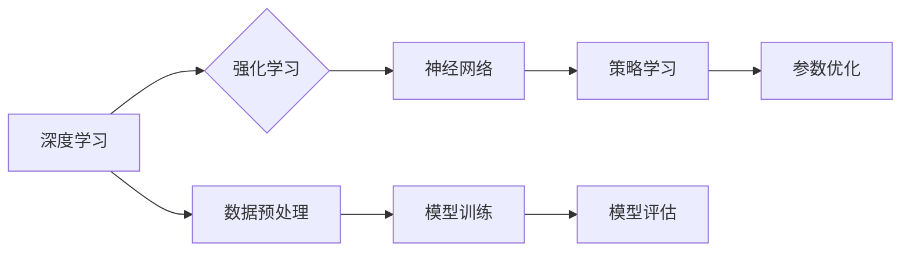

> 深度学习，强化学习，模型优化，人工智能，神经进化

# AI人工智能深度学习算法：使用强化学习优化深度学习模型

> 关键词：
深度学习，强化学习，模型优化，神经网络，进化算法

## 1. 背景介绍

在人工智能领域，深度学习已经取得了显著的进展，并在图像识别、语音识别、自然语言处理等领域取得了突破性成果。然而，深度学习模型的性能优化仍然是一个复杂的问题，需要大量的计算资源和专家知识。近年来，强化学习作为一种基于奖励的机器学习方法，被提出用于优化深度学习模型。本文将探讨如何利用强化学习来优化深度学习模型，并分析其原理、实现和应用。

### 1.1 问题的由来

随着深度学习模型规模的不断扩大，模型的复杂度也日益增加。如何有效地优化这些模型，使其在特定任务上达到最佳性能，成为了深度学习领域的一个重要挑战。传统的模型优化方法，如梯度下降，往往需要大量的迭代次数和参数调整，且容易陷入局部最优解。

### 1.2 研究现状

强化学习提供了一种新的视角来优化深度学习模型。通过将深度学习模型作为强化学习中的代理，利用强化学习算法来调整模型参数，从而优化模型在特定任务上的性能。这种方法在图像识别、自然语言处理等领域已经取得了显著的成果。

### 1.3 研究意义

使用强化学习优化深度学习模型具有重要的研究意义：
- 提高模型性能：强化学习可以帮助模型更快地收敛到全局最优解，提高模型在特定任务上的性能。
- 降低计算成本：通过智能地调整参数，强化学习可以减少模型优化所需的计算资源。
- 促进新算法研究：强化学习为深度学习模型优化提供了一种新的思路，有助于推动新算法的研究和发展。

### 1.4 本文结构

本文将首先介绍深度学习和强化学习的基本概念，然后讨论如何使用强化学习优化深度学习模型，最后分析其应用场景和未来发展趋势。

## 2. 核心概念与联系

### 2.1 深度学习

深度学习是一种模拟人脑神经网络结构和功能的机器学习方法。它通过多层神经网络对数据进行学习，以实现复杂的模式识别和特征提取。

### 2.2 强化学习

强化学习是一种通过与环境交互来学习最优策略的机器学习方法。在强化学习中，智能体通过接收环境状态、执行动作、获得奖励的过程来学习。

### 2.3 Mermaid 流程图

以下是一个使用Mermaid语法绘制的流程图，展示了深度学习和强化学习的关系：



### 2.4 核心概念联系

深度学习和强化学习是相互关联的。深度学习可以看作是强化学习中的一个组件，用于实现策略学习。通过强化学习，我们可以优化深度学习模型的参数，从而提高模型在特定任务上的性能。

## 3. 核心算法原理 & 具体操作步骤

### 3.1 算法原理概述

强化学习优化深度学习模型的基本原理如下：

1. 将深度学习模型作为强化学习中的智能体。
2. 使用强化学习算法（如深度Q网络DQN）来学习最优策略。
3. 根据策略调整深度学习模型的参数，以优化模型性能。

### 3.2 算法步骤详解

1. **初始化智能体**：选择一个合适的深度学习模型作为智能体，并初始化模型参数。
2. **环境定义**：定义一个环境，用于模拟智能体与外部世界的交互。
3. **策略学习**：使用强化学习算法（如DQN）来学习最优策略。
4. **参数优化**：根据策略调整深度学习模型的参数。
5. **模型训练**：使用优化后的参数重新训练深度学习模型。
6. **模型评估**：在测试集上评估模型性能，并迭代优化过程。

### 3.3 算法优缺点

#### 优点

- 提高模型性能：通过强化学习优化模型参数，可以显著提高模型在特定任务上的性能。
- 降低计算成本：强化学习可以智能地调整参数，减少模型优化所需的计算资源。

#### 缺点

- 训练时间较长：强化学习算法的训练过程可能需要较长的时间。
- 难以解释：强化学习算法的决策过程难以解释。

### 3.4 算法应用领域

强化学习优化深度学习模型在以下领域有广泛的应用：

- 图像识别
- 语音识别
- 自然语言处理
- 游戏AI
- 机器人控制

## 4. 数学模型和公式 & 详细讲解 & 举例说明

### 4.1 数学模型构建

在强化学习优化深度学习模型中，我们需要定义以下数学模型：

- 状态空间 $S$：描述环境状态。
- 行动空间 $A$：描述智能体的可执行动作。
- 奖励函数 $R(s,a)$：描述智能体在状态 $s$ 下执行动作 $a$ 所获得的奖励。
- 策略 $\pi(a|s)$：描述智能体在状态 $s$ 下选择动作 $a$ 的概率。

### 4.2 公式推导过程

以下是一个简单的强化学习算法的公式推导过程：

- 目标函数 $J(\theta)$：定义智能体的长期奖励，其中 $\theta$ 是智能体的参数。

$$
J(\theta) = \sum_{t=0}^{\infty} \gamma^t R(s_t,a_t)
$$

- 优势函数 $V(s)$：描述在状态 $s$ 下采取最优策略所获得的期望奖励。

$$
V(s) = \sum_{a \in A} \pi(a|s)R(s,a) + \gamma \sum_{s' \in S} \pi(s'|s) V(s')
$$

- 策略梯度：

$$
\nabla_{\theta} J(\theta) = \sum_{t=0}^{\infty} \gamma^t \nabla_{\theta} R(s_t,a_t)
$$

### 4.3 案例分析与讲解

以下是一个使用强化学习优化图像识别模型的案例：

- **状态空间 $S$**：图像的特征向量。
- **动作空间 $A$**：模型的参数。
- **奖励函数 $R(s,a)$**：模型的准确率。
- **策略 $\pi(a|s)$**：根据模型参数计算的概率分布。

在这个案例中，我们使用DQN算法来学习最优策略，并使用学习到的策略优化图像识别模型的参数。

## 5. 项目实践：代码实例和详细解释说明

### 5.1 开发环境搭建

为了实现上述案例，我们需要以下开发环境：

- Python 3.x
- TensorFlow 2.x
- OpenAI Gym

### 5.2 源代码详细实现

以下是一个使用TensorFlow和OpenAI Gym实现DQN算法的简单示例：

```python
import gym
import tensorflow as tf

class DQNAgent:
    def __init__(self, state_size, action_size):
        self.state_size = state_size
        self.action_size = action_size
        self.memory = []
        self.gamma = 0.95
        self.epsilon = 1.0
        self.epsilon_min = 0.01
        self.epsilon_decay = 0.995
        self.learning_rate = 0.001

        self.model = self._build_model()

    def _build_model(self):
        # 构建深度Q网络模型
        model = tf.keras.Sequential([
            tf.keras.layers.Dense(24, input_dim=self.state_size, activation='relu'),
            tf.keras.layers.Dense(24, activation='relu'),
            tf.keras.layers.Dense(self.action_size, activation='linear')
        ])
        model.compile(loss='mse', optimizer=tf.keras.optimizers.Adam(lr=self.learning_rate))
        return model

    def remember(self, state, action, reward, next_state, done):
        self.memory.append((state, action, reward, next_state, done))

    def act(self, state):
        if np.random.rand() <= self.epsilon:
            return random.randrange(self.action_size)
        act_values = self.model.predict(state)
        return np.argmax(act_values[0])

    def replay(self, batch_size):
        minibatch = random.sample(self.memory, batch_size)
        for state, action, reward, next_state, done in minibatch:
            target = reward
            if not done:
                target = (reward + self.gamma * np.amax(self.model.predict(next_state)[0]))
            target_f = self.model.predict(state)
            target_f[0][action] = target
            self.model.fit(state, target_f, epochs=1, verbose=0)
        if self.epsilon > self.epsilon_min:
            self.epsilon *= self.epsilon_decay

# 创建环境
env = gym.make('CartPole-v1')
state_size = env.observation_space.shape[0]
action_size = env.action_space.n

agent = DQNAgent(state_size, action_size)

# 训练模型
episodes = 1000
for e in range(episodes):
    state = env.reset()
    state = np.reshape(state, [1, state_size])
    for time in range(500):
        action = agent.act(state)
        next_state, reward, done, _ = env.step(action)
        next_state = np.reshape(next_state, [1, state_size])
        agent.remember(state, action, reward, next_state, done)
        state = next_state
        if done:
            print(f"Episode: {e}/{episodes}, Score: {time}")
            break
    agent.replay(32)
```

### 5.3 代码解读与分析

以上代码实现了一个简单的DQN智能体，用于在CartPole环境中进行训练。智能体通过与环境交互，学习如何使CartPole保持平衡。

1. `DQNAgent` 类定义了DQN智能体的基本功能，包括记忆存储、动作执行、奖励记忆和回放等功能。
2. `_build_model` 方法用于构建深度Q网络模型。
3. `act` 方法用于根据当前状态选择动作。
4. `replay` 方法用于从记忆中抽取样本，并使用这些样本更新模型参数。

### 5.4 运行结果展示

运行上述代码，DQN智能体可以在CartPole环境中学会保持平衡。

## 6. 实际应用场景

强化学习优化深度学习模型在以下场景有实际应用：

- **游戏AI**：例如，在Atari游戏、棋类游戏、体育游戏等领域，强化学习可以用于训练智能体学习游戏策略。
- **机器人控制**：例如，在机器人运动控制、自动驾驶等领域，强化学习可以用于训练机器人学习执行复杂任务。
- **推荐系统**：例如，在电子商务、内容推荐等领域，强化学习可以用于训练推荐系统学习个性化的推荐策略。

## 7. 工具和资源推荐

### 7.1 学习资源推荐

- 《深度学习》 - Ian Goodfellow, Yoshua Bengio, Aaron Courville
- 《强化学习》 - Richard S. Sutton, Andrew G. Barto
- 《深度强化学习》 - John Schulman, Pieter Abbeel, Chelsea Finn

### 7.2 开发工具推荐

- TensorFlow
- PyTorch
- OpenAI Gym

### 7.3 相关论文推荐

- "Deep Q-Networks" - Volodymyr Mnih et al.
- "Asynchronous Methods for Deep Reinforcement Learning" - John Schulman et al.
- "Proximal Policy Optimization" - John Schulman et al.

## 8. 总结：未来发展趋势与挑战

### 8.1 研究成果总结

本文介绍了如何使用强化学习来优化深度学习模型，并分析了其原理、实现和应用。通过强化学习优化深度学习模型可以显著提高模型性能，并降低计算成本。

### 8.2 未来发展趋势

- **更加高效的学习算法**：开发更加高效的强化学习算法，以减少训练时间和计算资源。
- **更加智能的探索策略**：开发更加智能的探索策略，以更好地探索状态空间。
- **更加鲁棒的模型**：开发更加鲁棒的模型，以适应不同的环境和任务。

### 8.3 面临的挑战

- **数据稀疏**：在一些应用场景中，可能难以获取足够的数据进行训练。
- **样本效率**：强化学习通常需要大量的样本进行训练，如何提高样本效率是一个挑战。
- **可解释性**：强化学习模型的决策过程难以解释，如何提高可解释性是一个挑战。

### 8.4 研究展望

强化学习优化深度学习模型是一个充满挑战和机遇的研究领域。随着技术的不断发展，我们有理由相信，强化学习将在深度学习模型优化领域发挥越来越重要的作用。

## 9. 附录：常见问题与解答

**Q1：强化学习在深度学习模型优化中有什么优势？**

A1：强化学习可以通过学习最优策略来优化深度学习模型，从而提高模型在特定任务上的性能。

**Q2：强化学习在哪些领域有应用？**

A2：强化学习在游戏AI、机器人控制、推荐系统等领域有广泛的应用。

**Q3：如何解决强化学习中的数据稀疏问题？**

A3：可以通过数据增强、迁移学习等方法来解决强化学习中的数据稀疏问题。

**Q4：如何提高强化学习模型的样本效率？**

A4：可以通过重要性采样、经验回放等方法来提高强化学习模型的样本效率。

**Q5：如何提高强化学习模型的可解释性？**

A5：可以通过可视化、解释模型决策过程等方法来提高强化学习模型的可解释性。

---

作者：禅与计算机程序设计艺术 / Zen and the Art of Computer Programming