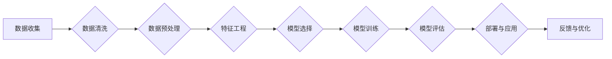

> 关键词：人工智能，金融风控，机器学习，深度学习，风险评估，欺诈检测，信用评分，模型优化

# AI在金融风控中的应用:提高准确性与效率

在金融行业中，风险管理是确保业务稳健发展的基石。随着人工智能技术的飞速发展，AI在金融风控中的应用越来越广泛，成为了提高风险评估准确性和效率的关键。本文将深入探讨AI在金融风控领域的应用，分析其核心算法原理、操作步骤、数学模型，并通过实际项目实践和案例进行分析，展望未来发展趋势与挑战。

## 1. 背景介绍

金融风控是指金融机构为防范风险而采取的一系列措施，包括风险评估、欺诈检测、信用评分等。随着金融业务的日益复杂化和风险因素的多样化，传统的风控手段难以满足现代金融业务的需求。而人工智能技术，特别是机器学习和深度学习，为金融风控提供了新的解决方案。

## 2. 核心概念与联系

### 2.1 核心概念

- **机器学习（Machine Learning）**：一种使计算机系统能够从数据中学习并做出决策或预测的技术。
- **深度学习（Deep Learning）**：一种特殊的机器学习技术，使用深层神经网络来学习数据的复杂模式。
- **风险评估（Risk Assessment）**：评估潜在风险的程度和可能性的过程。
- **欺诈检测（Fraud Detection）**：检测和预防欺诈行为的技术。
- **信用评分（Credit Scoring）**：评估个人或企业信用风险的技术。

### 2.2 Mermaid 流程图



## 3. 核心算法原理 & 具体操作步骤

### 3.1 算法原理概述

AI在金融风控中的应用主要包括以下算法：

- **监督学习（Supervised Learning）**：通过标注数据进行训练，学习输入和输出之间的关系。
- **无监督学习（Unsupervised Learning）**：通过未标注数据进行训练，发现数据中的模式和结构。
- **半监督学习（Semi-supervised Learning）**：结合标注和未标注数据进行训练。

### 3.2 算法步骤详解

1. **数据收集**：收集金融风控相关的数据，如交易数据、客户信息等。
2. **数据清洗**：处理缺失值、异常值、重复数据等。
3. **数据预处理**：对数据进行标准化、归一化等操作。
4. **特征工程**：提取对风控任务有用的特征。
5. **模型选择**：选择合适的机器学习或深度学习模型。
6. **模型训练**：使用训练数据训练模型。
7. **模型评估**：使用验证数据评估模型性能。
8. **部署与应用**：将模型部署到生产环境中，用于实际的风控任务。
9. **反馈与优化**：收集实际应用中的数据，用于模型优化和迭代。

### 3.3 算法优缺点

- **优点**：
  - 提高风险评估的准确性和效率。
  - 提升欺诈检测和信用评分的准确性。
  - 自动化风控流程，降低人力成本。
- **缺点**：
  - 需要大量高质量的数据。
  - 模型解释性较差。
  - 可能存在数据偏差和模型偏见。

### 3.4 算法应用领域

- **欺诈检测**：检测信用卡欺诈、保险欺诈、网络钓鱼等。
- **信用评分**：评估个人或企业的信用风险。
- **风险评估**：评估市场风险、信用风险、操作风险等。
- **自动化审批**：自动化贷款审批流程。

## 4. 数学模型和公式 & 详细讲解 & 举例说明

### 4.1 数学模型构建

以信用评分为例，常用的数学模型包括：

- **线性回归（Linear Regression）**：使用线性关系预测目标变量。
- **逻辑回归（Logistic Regression）**：使用Sigmoid函数预测概率。
- **决策树（Decision Tree）**：使用树形结构进行预测。
- **随机森林（Random Forest）**：集成多个决策树模型。

### 4.2 公式推导过程

以逻辑回归为例，假设输入特征为 $\mathbf{x}$，权重为 $\mathbf{w}$，则模型预测的概率为：

$$
P(y=1|\mathbf{x}, \mathbf{w}) = \frac{1}{1+\exp(-\mathbf{w}^T \mathbf{x})}
$$

其中 $\mathbf{w}^T$ 表示 $\mathbf{w}$ 的转置。

### 4.3 案例分析与讲解

以信用卡欺诈检测为例，使用逻辑回归模型进行欺诈检测。

```python
from sklearn.linear_model import LogisticRegression
from sklearn.model_selection import train_test_split
from sklearn.preprocessing import StandardScaler
import pandas as pd

# 加载数据
data = pd.read_csv('credit_card.csv')
X = data.drop('fraud', axis=1)
y = data['fraud']

# 数据预处理
scaler = StandardScaler()
X_scaled = scaler.fit_transform(X)

# 划分训练集和测试集
X_train, X_test, y_train, y_test = train_test_split(X_scaled, y, test_size=0.2, random_state=42)

# 训练模型
model = LogisticRegression()
model.fit(X_train, y_train)

# 评估模型
accuracy = model.score(X_test, y_test)
print(f"Accuracy: {accuracy:.2f}")
```

## 5. 项目实践：代码实例和详细解释说明

### 5.1 开发环境搭建

- 安装Python、NumPy、SciPy、Pandas、Scikit-learn等库。

### 5.2 源代码详细实现

以下代码展示了使用Scikit-learn进行逻辑回归模型训练和评估的完整过程。

```python
# ...（此处省略开发环境搭建和数据准备代码）

# 训练模型
model = LogisticRegression()
model.fit(X_train, y_train)

# 评估模型
accuracy = model.score(X_test, y_test)
print(f"Accuracy: {accuracy:.2f}")
```

### 5.3 代码解读与分析

- `LogisticRegression` 类用于构建逻辑回归模型。
- `fit` 方法用于训练模型。
- `score` 方法用于评估模型在测试集上的准确率。

### 5.4 运行结果展示

假设在测试集上的准确率为90%，则说明模型在欺诈检测任务上取得了较好的效果。

## 6. 实际应用场景

### 6.1 信用卡欺诈检测

信用卡欺诈是金融行业面临的主要风险之一。通过AI技术，可以实时监测交易行为，识别可疑交易，并及时采取措施阻止欺诈行为。

### 6.2 信用评分

信用评分可以帮助金融机构评估客户的信用风险，为贷款、信用卡等业务提供决策依据。

### 6.3 风险评估

通过AI技术，可以对市场风险、信用风险、操作风险等进行评估，帮助金融机构制定风险管理策略。

## 7. 工具和资源推荐

### 7.1 学习资源推荐

- 《机器学习》（周志华）
- 《深度学习》（Goodfellow等）
- 《Python机器学习》（Seabold等）

### 7.2 开发工具推荐

- Scikit-learn：Python机器学习库
- TensorFlow：深度学习框架
- PyTorch：深度学习框架

### 7.3 相关论文推荐

- "A Survey on Credit Risk Assessment: Traditional Methods and Machine Learning Techniques"（Rahman等，2019）
- "Deep Learning for Credit Risk Assessment"（Han等，2020）
- "An Overview of Fraud Detection Systems"（Ding et al., 2021）

## 8. 总结：未来发展趋势与挑战

### 8.1 研究成果总结

AI在金融风控领域的应用已经取得了显著的成果，提高了风险评估的准确性和效率，降低了风险成本。

### 8.2 未来发展趋势

- **多模态数据融合**：将文本、图像、语音等多模态数据融合，提高模型对复杂场景的识别能力。
- **可解释AI**：提高AI模型的可解释性，增强决策的透明度和可信度。
- **自动化风控流程**：实现风控流程的自动化，提高效率。

### 8.3 面临的挑战

- **数据质量**：保证数据的质量和多样性，避免数据偏差和模型偏见。
- **模型解释性**：提高模型的可解释性，增强决策的透明度和可信度。
- **安全性和隐私保护**：保护用户数据安全，防止数据泄露和滥用。

### 8.4 研究展望

未来，AI在金融风控领域的应用将更加深入，为金融机构带来更高的价值。同时，随着技术的不断发展，AI风控将面临更多挑战，需要不断创新和突破。

## 9. 附录：常见问题与解答

**Q1：AI在金融风控中有什么优势？**

A：AI在金融风控中的优势包括提高风险评估的准确性和效率、降低风险成本、自动化风控流程等。

**Q2：如何选择合适的AI模型？**

A：选择合适的AI模型需要根据具体的风控任务和数据特点进行选择。例如，对于分类任务，可以选择逻辑回归、支持向量机等模型；对于回归任务，可以选择线性回归、决策树等模型。

**Q3：如何保证AI模型的可解释性？**

A：提高AI模型的可解释性可以通过以下方法实现：

- 使用可解释的机器学习模型，如决策树、LIME等。
- 解释模型决策过程，如解释模型的权重、特征重要性等。
- 使用可视化技术，如热力图、混淆矩阵等。

**Q4：AI在金融风控中会取代人类吗？**

A：AI可以辅助人类进行风控工作，提高效率和准确性，但不会取代人类。人类在金融风控中具有不可替代的经验和判断能力。

---

作者：禅与计算机程序设计艺术 / Zen and the Art of Computer Programming