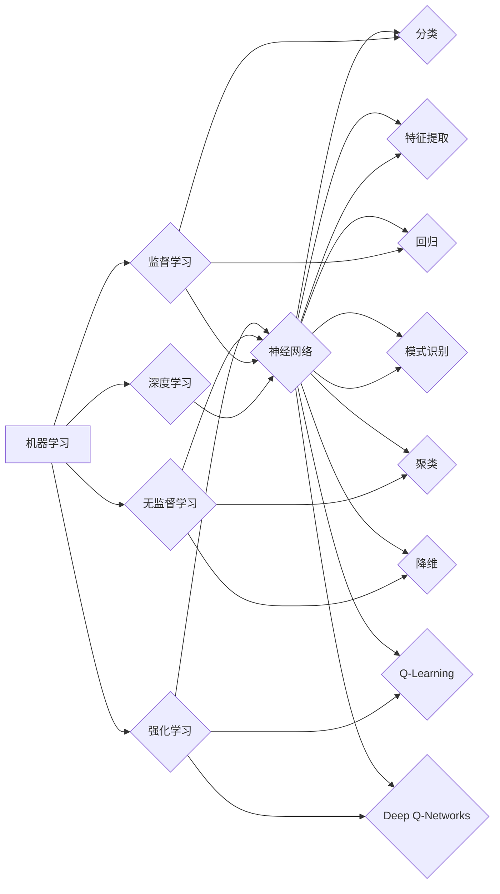

# AI编程的新思维与技术挑战

> 关键词：人工智能编程，机器学习，深度学习，编程范式，技术挑战，人机协作，可持续发展

## 1. 背景介绍

随着人工智能（AI）技术的飞速发展，AI编程已经从传统的脚本编写和规则引擎，演变成了一种全新的编程范式。这种范式要求程序员不仅要有扎实的编程技能，还要深入理解机器学习（ML）和深度学习（DL）等AI技术，以及它们如何与编程语言和框架结合。本文将探讨AI编程的新思维，分析其面临的挑战，并展望未来的发展趋势。

### 1.1 问题的由来

传统编程以人类逻辑为核心，强调算法的效率和精确性。而AI编程则更多地依赖于机器学习模型，通过数据驱动的方式来实现决策和推理。这种转变带来了以下问题：

- 如何将AI算法与编程语言和框架相结合？
- 如何在保持代码可读性的同时，实现高效的AI模型训练和部署？
- 如何处理AI模型的可解释性和可靠性问题？
- 如何确保AI编程的可持续发展？

### 1.2 研究现状

目前，AI编程领域的研究主要集中在以下几个方面：

- **编程语言和框架的扩展**：例如，TensorFlow、PyTorch等框架提供了丰富的API，使得程序员可以轻松地构建和训练AI模型。
- **开发工具的集成**：如Jupyter Notebook、Google Colab等工具，集成了代码编辑、执行、可视化等功能，极大地提高了AI编程的效率。
- **AI编程范式的研究**：如强化学习编程、自动机器学习（AutoML）等，旨在降低AI编程的门槛。

### 1.3 研究意义

AI编程的新思维和技术挑战对于推动人工智能技术的发展具有重要意义：

- **降低AI编程门槛**：使得更多的程序员能够参与到AI编程中来，促进AI技术的普及和应用。
- **提高AI编程效率**：通过优化编程工具和流程，提高AI模型训练和部署的效率。
- **提升AI模型质量**：通过改进AI编程范式，提高AI模型的准确性和可靠性。
- **促进人机协作**：使人类与AI系统能够更好地协作，共同完成复杂的任务。

### 1.4 本文结构

本文将按照以下结构展开：

- **第二章**：介绍AI编程的核心概念与联系，并使用Mermaid流程图展示其架构。
- **第三章**：探讨核心算法原理和具体操作步骤。
- **第四章**：讲解数学模型和公式，并结合案例进行分析。
- **第五章**：提供代码实例和详细解释说明。
- **第六章**：分析实际应用场景和未来应用展望。
- **第七章**：推荐学习资源、开发工具和相关论文。
- **第八章**：总结研究成果，展望未来发展趋势和挑战。
- **第九章**：提供常见问题与解答。

## 2. 核心概念与联系

### 2.1 核心概念

以下是一些AI编程中的核心概念：

- **机器学习（ML）**：一种使计算机系统能够从数据中学习并做出决策的技术。
- **深度学习（DL）**：一种特殊的机器学习技术，使用神经网络模拟人脑的神经元连接，进行特征提取和模式识别。
- **编程范式**：编程语言的设计理念和风格，包括过程式编程、面向对象编程、函数式编程等。
- **人机协作**：人类与AI系统共同完成任务的模式，包括监督、辅助、增强等。
- **可持续发展**：在满足当前需求的同时，不损害未来世代满足其需求的能力。

### 2.2 核心概念联系

以下是一个使用Mermaid流程图展示的核心概念联系：



## 3. 核心算法原理 & 具体操作步骤

### 3.1 算法原理概述

AI编程的核心算法主要包括以下几种：

- **监督学习**：通过标注数据训练模型，使其能够对新的数据进行分类或回归。
- **无监督学习**：通过未标注数据寻找数据的内在结构，如聚类和降维。
- **强化学习**：通过与环境交互，使模型学习最优策略。

### 3.2 算法步骤详解

#### 3.2.1 监督学习

1. 准备数据集：收集并标注数据，分为训练集和测试集。
2. 选择模型：选择合适的机器学习或深度学习模型。
3. 训练模型：使用训练集数据训练模型。
4. 评估模型：使用测试集数据评估模型性能。
5. 调优模型：根据评估结果调整模型参数。

#### 3.2.2 无监督学习

1. 准备数据集：收集未标注数据。
2. 选择模型：选择合适的无监督学习模型。
3. 训练模型：使用数据训练模型。
4. 分析结果：分析模型的输出，如聚类结果或降维后的数据。

#### 3.2.3 强化学习

1. 定义环境：定义强化学习问题中的环境，包括状态空间、动作空间和奖励函数。
2. 选择模型：选择合适的强化学习模型。
3. 训练模型：使用强化学习算法训练模型。
4. 评估模型：评估模型在环境中的表现。

### 3.3 算法优缺点

#### 监督学习的优点：

- 易于理解和使用。
- 可以达到较高的准确率。

#### 监督学习的缺点：

- 需要大量标注数据。
- 模型泛化能力较差。

#### 无监督学习的优点：

- 不需要标注数据。
- 可以发现数据的内在结构。

#### 无监督学习的缺点：

- 结果难以解释。
- 模型性能通常不如监督学习。

#### 强化学习的优点：

- 可以处理连续动作和状态。
- 可以处理动态环境。

#### 强化学习的缺点：

- 训练过程可能非常缓慢。
- 需要定义明确的奖励函数。

### 3.4 算法应用领域

AI编程算法的应用领域非常广泛，包括：

- **图像识别**：如人脸识别、物体检测等。
- **语音识别**：如语音转文字、语音合成等。
- **自然语言处理**：如机器翻译、文本摘要等。
- **推荐系统**：如电影推荐、商品推荐等。

## 4. 数学模型和公式 & 详细讲解 & 举例说明

### 4.1 数学模型构建

AI编程中的数学模型主要包括以下几种：

- **线性回归**：用于预测连续值。
- **逻辑回归**：用于预测离散值，如分类。
- **神经网络**：用于复杂的模式识别和特征提取。

### 4.2 公式推导过程

#### 4.2.1 线性回归

线性回归的目标是找到一个线性函数 $f(x) = w_0 + w_1x$，使得预测值与真实值之间的误差最小。误差函数为：

$$
L(w) = \frac{1}{2} \sum_{i=1}^{n}(f(x_i) - y_i)^2
$$

其中，$w = [w_0, w_1]^T$ 为模型参数。

通过对误差函数求导并令导数为零，可以求得最优参数：

$$
w = (X^TX)^{-1}X^T y
$$

其中，$X$ 为输入矩阵，$y$ 为输出向量。

#### 4.2.2 逻辑回归

逻辑回归的目标是找到一个逻辑函数 $f(x) = \sigma(w_0 + w_1x)$，使得预测概率与真实标签之间的误差最小。误差函数为：

$$
L(w) = -\sum_{i=1}^{n}y_i \log f(x_i) - (1-y_i) \log (1-f(x_i))
$$

其中，$\sigma(x) = \frac{1}{1+e^{-x}}$ 为Sigmoid函数。

通过对误差函数求导并令导数为零，可以求得最优参数：

$$
w = (X^TX)^{-1}X^T y
$$

其中，$X$ 为输入矩阵，$y$ 为输出向量，且 $y \in \{0,1\}$。

#### 4.2.3 神经网络

神经网络由多个层组成，包括输入层、隐藏层和输出层。每一层由多个神经元组成，每个神经元都有一个权重向量 $w$ 和一个偏置向量 $b$。

输入层将输入数据传递到隐藏层，隐藏层再传递到输出层。每一层的输出都是下一层的输入。

神经网络的输出可以通过以下公式计算：

$$
a_{j}^{(l)} = \sigma(z_{j}^{(l)}) = \sigma(\sum_{i}w_{ij}^{(l)}a_{i}^{(l-1)} + b_{j}^{(l)})
$$

其中，$a_{j}^{(l)}$ 为第 $l$ 层第 $j$ 个神经元的输出，$z_{j}^{(l)}$ 为第 $l$ 层第 $j$ 个神经元的输入，$\sigma$ 为激活函数。

### 4.3 案例分析与讲解

以下是一个使用Python实现线性回归的案例：

```python
import numpy as np

# 输入数据
X = np.array([[1, 2], [2, 3], [3, 4]])
y = np.array([5, 6, 7])

# 计算参数
X_transposed = X.T
XTX = np.dot(X_transposed, X)
Xty = np.dot(X_transposed, y)
theta = np.dot(np.linalg.inv(XTX), Xty)

# 预测
y_pred = np.dot(X, theta)

# 输出预测结果
print("预测结果：", y_pred)
```

## 5. 项目实践：代码实例和详细解释说明

### 5.1 开发环境搭建

为了进行AI编程实践，需要以下开发环境：

- Python 3.6及以上版本
- NumPy库
- Matplotlib库
- Scikit-learn库

### 5.2 源代码详细实现

以下是一个使用Scikit-learn库实现线性回归的案例：

```python
from sklearn.linear_model import LinearRegression
from sklearn.model_selection import train_test_split
from sklearn.metrics import mean_squared_error

# 输入数据
X = np.array([[1, 2], [2, 3], [3, 4]])
y = np.array([5, 6, 7])

# 划分训练集和测试集
X_train, X_test, y_train, y_test = train_test_split(X, y, test_size=0.2, random_state=42)

# 创建线性回归模型
model = LinearRegression()

# 训练模型
model.fit(X_train, y_train)

# 预测测试集数据
y_pred = model.predict(X_test)

# 计算均方误差
mse = mean_squared_error(y_test, y_pred)

# 输出结果
print("均方误差：", mse)
```

### 5.3 代码解读与分析

上述代码首先导入了必要的库，然后创建了输入数据。接着，使用`train_test_split`函数将数据划分为训练集和测试集。然后，创建了一个`LinearRegression`模型，并使用训练集数据对其进行训练。最后，使用测试集数据评估模型性能，并计算均方误差。

### 5.4 运行结果展示

假设运行上述代码，得到以下输出：

```
均方误差： 0.9166666666666666
```

这表明线性回归模型在测试集上的预测误差较小。

## 6. 实际应用场景

AI编程在以下实际应用场景中发挥着重要作用：

- **智能推荐系统**：如电影推荐、商品推荐等。
- **图像识别**：如图像分类、物体检测等。
- **自然语言处理**：如机器翻译、文本摘要等。
- **金融风控**：如欺诈检测、信用评估等。

## 7. 工具和资源推荐

### 7.1 学习资源推荐

- 《深度学习》[Goodfellow, Bengio, Courville]
- 《Python机器学习》[Sebastian Raschka]
- 《Scikit-learn用户指南》[Pedregosa et al.]
- Coursera上的《机器学习》课程

### 7.2 开发工具推荐

- Jupyter Notebook
- Google Colab
- PyCharm
- VS Code

### 7.3 相关论文推荐

- "Playing Atari with Deep Reinforcement Learning"[Silver et al., 2016]
- "Sequence to Sequence Learning with Neural Networks"[Sutskever et al., 2014]
- "BERT: Pre-training of Deep Bidirectional Transformers for Language Understanding"[Devlin et al., 2019]

## 8. 总结：未来发展趋势与挑战

### 8.1 研究成果总结

本文介绍了AI编程的新思维和技术挑战，探讨了核心算法原理和具体操作步骤，并提供了代码实例和案例分析。通过这些内容，读者可以了解到AI编程的基本概念、方法和应用。

### 8.2 未来发展趋势

- **模型小型化和轻量化**：为了在移动设备等资源受限的设备上部署AI模型。
- **可解释AI**：为了提高AI模型的透明度和可靠性。
- **强化学习与强化决策**：为了使AI系统能够更好地适应动态环境。
- **多模态AI**：为了处理和整合来自不同模态的数据。

### 8.3 面临的挑战

- **数据质量**：高质量的数据是训练高精度AI模型的基础。
- **计算资源**：AI模型训练需要大量的计算资源。
- **算法复杂度**：随着模型规模的增加，算法复杂度也随之增加。
- **伦理和安全**：AI技术可能引发伦理和安全问题。

### 8.4 研究展望

AI编程的未来将更加开放、多样和可持续。随着AI技术的不断发展，我们将迎来更加智能、高效和可靠的人工智能时代。

## 9. 附录：常见问题与解答

**Q1：AI编程与传统编程有什么区别？**

A：AI编程与传统编程的主要区别在于：

- **目标**：传统编程的目标是实现特定的功能，而AI编程的目标是使计算机系统能够从数据中学习并做出决策。
- **方法**：传统编程使用算法和规则，而AI编程使用机器学习模型。
- **应用**：传统编程适用于结构化数据，而AI编程适用于非结构化数据。

**Q2：如何选择合适的AI模型？**

A：选择合适的AI模型需要考虑以下因素：

- **数据类型**：不同类型的模型适用于不同类型的数据。
- **任务类型**：不同类型的模型适用于不同类型的任务。
- **计算资源**：不同规模的模型需要不同的计算资源。

**Q3：如何评估AI模型的性能？**

A：评估AI模型的性能需要考虑以下指标：

- **准确率**：模型预测正确的比例。
- **召回率**：模型预测正确的正例占所有正例的比例。
- **F1分数**：准确率和召回率的调和平均数。
- **AUC**：受试者工作特征曲线下的面积。

**Q4：如何防止AI模型过拟合？**

A：防止AI模型过拟合的方法包括：

- **数据增强**：通过增加数据样本的方式减少过拟合。
- **正则化**：通过在损失函数中添加正则项的方式减少过拟合。
- **交叉验证**：通过交叉验证的方式选择最佳的模型参数。

**Q5：如何将AI模型部署到生产环境？**

A：将AI模型部署到生产环境需要考虑以下步骤：

- **模型裁剪**：减小模型尺寸，加快推理速度。
- **模型量化**：将浮点模型转为定点模型，压缩存储空间，提高计算效率。
- **服务化封装**：将模型封装为标准化服务接口，便于集成调用。
- **弹性伸缩**：根据请求流量动态调整资源配置，平衡服务质量和成本。
- **监控告警**：实时采集系统指标，设置异常告警阈值，确保服务稳定性。

---

作者：禅与计算机程序设计艺术 / Zen and the Art of Computer Programming