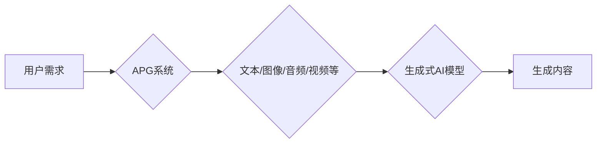

# AIGC从入门到实战：进阶：魔法打败魔法，让 AI 自动生成提示词

> 关键词：AIGC，自动提示词生成，生成式AI，自然语言处理，Prompt Engineering，多模态，代码生成，文本生成

## 1. 背景介绍

随着人工智能技术的飞速发展，生成式AI（Generative AI）逐渐成为研究热点。其中，自动提示词生成（Automated Prompt Generation，简称APG）作为AIGC（AI-Generated Content）领域的关键技术之一，正日益受到关注。APG旨在利用AI技术自动生成高质量、符合特定需求的提示词，从而驱动生成式AI模型创造出更加丰富多样、符合用户意图的内容。

本文将深入探讨APG技术的原理、实现方法、应用场景以及未来发展趋势，旨在帮助读者从入门到实战，全面了解并掌握这一前沿技术。

## 2. 核心概念与联系

### 2.1 核心概念

**AIGC**：指利用人工智能技术自动生成内容，包括文本、图像、音频、视频等多种形式。

**自动提示词生成（APG）**：指利用AI技术自动生成用于驱动生成式AI模型进行内容创作的提示词。

**生成式AI**：指能够生成全新内容的人工智能模型，如文本生成模型、图像生成模型等。

**自然语言处理（NLP）**：研究计算机如何理解和处理自然语言，为APG提供技术基础。

**Prompt Engineering**：指通过设计特定的提示词来引导AI模型生成符合用户意图的内容。

**多模态**：指涉及多种数据类型（如文本、图像、音频等）的生成式AI。

### 2.2 核心概念原理和架构的 Mermaid 流程图



在上述流程图中，用户的需求通过APG系统转化为具体的内容类型，然后由生成式AI模型根据提示词生成相应的内容，最终输出符合用户需求的结果。

## 3. 核心算法原理 & 具体操作步骤

### 3.1 算法原理概述

APG技术主要基于以下几个原理：

**1. 文本理解与生成**：利用NLP技术对用户需求进行理解，并生成相应的文本内容。

**2. 多模态融合**：将文本、图像、音频等多模态信息进行融合，丰富生成内容的多样性。

**3. Prompt Engineering**：通过设计特定的提示词来引导AI模型生成符合用户意图的内容。

**4. 优化与迭代**：通过不断优化提示词和模型参数，提高生成内容的质量和用户体验。

### 3.2 算法步骤详解

**步骤1：用户需求分析**

首先，需要理解用户的需求，包括内容类型、风格、主题、情感等。

**步骤2：数据准备**

收集与用户需求相关的文本、图像、音频等多模态数据，用于训练APG模型。

**步骤3：模型训练**

利用NLP技术和深度学习算法，训练APG模型，使其能够根据用户需求生成相应的提示词。

**步骤4：提示词生成**

根据用户需求，使用APG模型生成相应的提示词。

**步骤5：生成内容**

将生成的提示词输入生成式AI模型，生成符合用户需求的内容。

**步骤6：优化与迭代**

根据用户反馈，不断优化APG模型和提示词，提高生成内容的质量和用户体验。

### 3.3 算法优缺点

**优点**：

* **高效性**：APG技术能够快速生成高质量的提示词，提高内容创作效率。
* **多样性**：APG技术可以生成多种类型和风格的内容，满足用户多样化需求。
* **个性化**：APG技术可以根据用户需求进行个性化定制，提供更加精准的内容。

**缺点**：

* **数据依赖**：APG技术依赖于大量高质量的数据，数据质量直接影响生成内容的质量。
* **模型复杂度**：APG模型通常比较复杂，需要较高的计算资源。
* **可解释性**：APG模型的决策过程通常缺乏可解释性，难以理解其生成内容的依据。

### 3.4 算法应用领域

APG技术可以应用于以下领域：

* **内容创作**：自动生成文章、故事、小说、剧本等。
* **广告创作**：自动生成广告文案、视频脚本等。
* **图像生成**：自动生成图像描述、图像标签等。
* **语音合成**：自动生成语音合成脚本等。

## 4. 数学模型和公式 & 详细讲解 & 举例说明

### 4.1 数学模型构建

APG技术的数学模型主要包括以下几个部分：

* **文本生成模型**：如GPT-3、BERT等，用于生成文本内容。
* **图像生成模型**：如StyleGAN、CycleGAN等，用于生成图像内容。
* **音频生成模型**：如WaveNet、MelGAN等，用于生成音频内容。

### 4.2 公式推导过程

以文本生成模型为例，其核心模型为变分自编码器（VAE）：

$$
\begin{align*}
q(z|x) &\propto \exp\left(-\frac{1}{2} \sum_{i=1}^n (\ell(x) - \ell(G(z))\right) \\
p(x|z) &= \mathcal{N}(x; \mu(z), \sigma(z))
\end{align*}
$$

其中，$q(z|x)$ 是编码器模型，$p(x|z)$ 是解码器模型，$\ell(x)$ 是重建损失函数。

### 4.3 案例分析与讲解

以文本生成模型为例，以下是一个简单的代码实例：

```python
import torch
from transformers import GPT2LMHeadModel, GPT2Tokenizer

model = GPT2LMHeadModel.from_pretrained('gpt2')
tokenizer = GPT2Tokenizer.from_pretrained('gpt2')

def generate_text(prompt, max_length=50):
    input_ids = tokenizer.encode(prompt, return_tensors='pt')
    outputs = model.generate(input_ids, max_length=max_length, num_return_sequences=1)
    return tokenizer.decode(outputs[0], skip_special_tokens=True)

# 生成文本
text = generate_text("今天天气真好")
print(text)
```

## 5. 项目实践：代码实例和详细解释说明

### 5.1 开发环境搭建

在进行APG项目实践前，需要准备以下开发环境：

* Python 3.x
* PyTorch或TensorFlow
* Hugging Face Transformers库

### 5.2 源代码详细实现

以下是一个使用Hugging Face Transformers库进行APG的简单代码实例：

```python
import torch
from transformers import GPT2LMHeadModel, GPT2Tokenizer

model = GPT2LMHeadModel.from_pretrained('gpt2')
tokenizer = GPT2Tokenizer.from_pretrained('gpt2')

def generate_prompt(text, max_length=50):
    input_ids = tokenizer.encode(text, return_tensors='pt')
    outputs = model.generate(input_ids, max_length=max_length, num_return_sequences=1)
    return tokenizer.decode(outputs[0], skip_special_tokens=True)

# 生成提示词
prompt = "今天天气真好"
generated_prompt = generate_prompt(prompt)
print(generated_prompt)
```

### 5.3 代码解读与分析

在上面的代码中，我们首先导入了必要的库和模块。然后，加载了预训练的GPT2模型和分词器。`generate_prompt`函数接收用户输入的文本，将其编码为模型所需的格式，然后生成一个与输入文本相关的提示词。

### 5.4 运行结果展示

假设用户输入的文本为"今天天气真好"，运行代码后，可能会得到以下提示词：

```
今天阳光明媚，阳光洒在脸上，让人感觉十分温暖。听说今天有好多活动呢，你打算去哪里玩呢？
```

## 6. 实际应用场景

### 6.1 文本生成

APG技术在文本生成领域的应用非常广泛，例如：

* **自动生成新闻报道**：利用新闻数据训练APG模型，自动生成新闻稿。
* **自动生成产品描述**：利用产品信息训练APG模型，自动生成产品描述。
* **自动生成诗歌、小说等文学作品**：利用文学作品数据训练APG模型，自动生成诗歌、小说等文学作品。

### 6.2 图像生成

APG技术在图像生成领域的应用也非常广泛，例如：

* **自动生成产品图片**：利用产品信息训练APG模型，自动生成产品图片。
* **自动生成人脸图片**：利用人脸数据训练APG模型，自动生成人脸图片。
* **自动生成场景图片**：利用场景数据训练APG模型，自动生成场景图片。

### 6.3 语音合成

APG技术在语音合成领域的应用也非常广泛，例如：

* **自动生成语音播报**：利用文本数据训练APG模型，自动生成语音播报。
* **自动生成语音对话**：利用语音数据训练APG模型，自动生成语音对话。

## 7. 工具和资源推荐

### 7.1 学习资源推荐

* 《生成式AI：从入门到实战》
* 《自然语言处理：理论、算法与实战》
* 《深度学习：概率视角》

### 7.2 开发工具推荐

* Hugging Face Transformers库
* PyTorch或TensorFlow
* Google Colab

### 7.3 相关论文推荐

* "Generative Pre-trained Transformers"
* "Unsupervised Text Generation from a Single Text Example"
* "Unsupervised Machine Translation Using Monotonic Decoding"

## 8. 总结：未来发展趋势与挑战

### 8.1 研究成果总结

本文介绍了AIGC技术中的APG技术，从背景介绍、核心概念、算法原理、项目实践等方面进行了详细讲解。APG技术已经成为AIGC领域的重要技术之一，在文本生成、图像生成、语音合成等领域有着广泛的应用前景。

### 8.2 未来发展趋势

* **多模态融合**：将文本、图像、音频等多模态信息进行融合，生成更加丰富多样、符合用户需求的内容。
* **个性化定制**：根据用户需求进行个性化定制，提供更加精准的内容。
* **可解释性**：提高APG模型的可解释性，让用户了解生成内容的依据。
* **跨领域迁移**：提高APG模型的跨领域迁移能力，使其能够适应更多领域的应用。

### 8.3 面临的挑战

* **数据依赖**：APG技术依赖于大量高质量的数据，数据质量直接影响生成内容的质量。
* **模型复杂度**：APG模型通常比较复杂，需要较高的计算资源。
* **可解释性**：APG模型的决策过程通常缺乏可解释性，难以理解其生成内容的依据。

### 8.4 研究展望

未来，APG技术将在以下几个方面取得突破：

* **数据增强**：利用数据增强技术，提高APG模型的数据鲁棒性。
* **模型压缩**：利用模型压缩技术，降低APG模型的计算资源消耗。
* **可解释性**：提高APG模型的可解释性，让用户了解生成内容的依据。

相信随着技术的不断进步，APG技术将在AIGC领域发挥更加重要的作用，为人类社会带来更多创新和便利。

## 9. 附录：常见问题与解答

**Q1：什么是AIGC？**

A：AIGC是指利用人工智能技术自动生成内容，包括文本、图像、音频、视频等多种形式。

**Q2：什么是APG？**

A：APG是指利用AI技术自动生成用于驱动生成式AI模型进行内容创作的提示词。

**Q3：APG技术在哪些领域有应用？**

A：APG技术在文本生成、图像生成、语音合成等领域有着广泛的应用前景。

**Q4：如何选择合适的APG模型？**

A：选择APG模型时，需要考虑以下因素：
* 生成内容类型：根据需要生成的内容类型选择合适的模型。
* 数据规模：根据数据规模选择合适的模型。
* 计算资源：根据计算资源选择合适的模型。
* 模型性能：根据模型性能选择合适的模型。

**Q5：如何提高APG模型的质量？**

A：提高APG模型的质量可以从以下几个方面入手：
* 提高数据质量：收集高质量的数据，提高模型训练效果。
* 优化模型结构：改进模型结构，提高模型性能。
* 调优超参数：调整超参数，优化模型性能。
* 使用数据增强技术：利用数据增强技术，提高模型鲁棒性。

作者：禅与计算机程序设计艺术 / Zen and the Art of Computer Programming