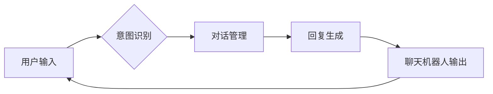

# LLM-based Chatbot System Implementation

## 1. 背景介绍
### 1.1 问题的由来

随着人工智能技术的不断发展，聊天机器人（Chatbot）作为一种智能交互系统，已经在多个领域得到广泛应用。传统的聊天机器人主要基于规则或关键词匹配，难以处理复杂的自然语言输入和生成，交互体验相对有限。

近年来，大型语言模型（Large Language Model，LLM）的兴起为聊天机器人带来了新的发展机遇。LLM具有强大的语言理解和生成能力，能够实现更自然、流畅的对话交互。本文将探讨基于LLM的聊天机器人系统实现方法，分析其核心原理、关键技术及实际应用场景。

### 1.2 研究现状

目前，基于LLM的聊天机器人研究主要集中在以下几个方面：

1. **预训练语言模型选择**：选择合适的预训练语言模型作为聊天机器人系统的核心，如BERT、GPT-3等。
2. **对话管理**：设计高效的对话管理机制，实现对话上下文管理和状态维护。
3. **意图识别**：利用预训练模型进行意图识别，实现多轮对话交互。
4. **回复生成**：根据用户意图和上下文信息，生成自然、合理的回复。
5. **对话评估**：评估聊天机器人的对话质量和用户满意度。

### 1.3 研究意义

基于LLM的聊天机器人系统具有以下研究意义：

1. **提升交互体验**：LLM强大的语言理解能力和生成能力，能够实现更自然、流畅的对话交互，提升用户满意度。
2. **拓展应用场景**：基于LLM的聊天机器人可以应用于更多领域，如客服、教育、娱乐等。
3. **推动人工智能技术发展**：基于LLM的聊天机器人研究有助于推动自然语言处理、机器学习等人工智能技术的发展。

### 1.4 本文结构

本文将从以下方面展开论述：

1. 介绍基于LLM的聊天机器人系统的核心概念与联系。
2. 阐述核心算法原理及具体操作步骤。
3. 分析数学模型和公式，并结合实例进行讲解。
4. 展示项目实践：代码实例和详细解释说明。
5. 探讨实际应用场景和未来应用展望。
6. 推荐相关工具和资源。
7. 总结未来发展趋势与挑战。

## 2. 核心概念与联系

### 2.1 核心概念

以下是本文涉及的核心概念：

- **大型语言模型（LLM）**：通过在海量文本语料上预训练，具备强大的语言理解和生成能力。
- **预训练语言模型**：在海量无标注文本语料上进行的预训练过程，如BERT、GPT-3等。
- **对话管理**：管理对话上下文和状态，实现多轮对话交互。
- **意图识别**：识别用户输入的意图，为后续回复生成提供依据。
- **回复生成**：根据用户意图和上下文信息，生成自然、合理的回复。
- **对话评估**：评估聊天机器人的对话质量和用户满意度。

### 2.2 核心概念联系

以下是核心概念之间的联系：



## 3. 核心算法原理 & 具体操作步骤
### 3.1 算法原理概述

基于LLM的聊天机器人系统主要包括以下三个核心模块：

1. **意图识别模块**：利用预训练语言模型对用户输入进行意图识别，判断用户意图。
2. **对话管理模块**：根据对话上下文和状态信息，维护对话流程，为回复生成模块提供输入。
3. **回复生成模块**：根据用户意图和上下文信息，生成自然、合理的回复。

### 3.2 算法步骤详解

基于LLM的聊天机器人系统具体操作步骤如下：

**Step 1: 用户输入**

用户通过文本或语音输入向聊天机器人发送消息。

**Step 2: 意图识别**

利用预训练语言模型对用户输入进行意图识别，判断用户意图。常见的意图识别方法包括：

- **基于规则的意图识别**：根据预定义的规则进行意图识别，适用于意图数量较少的场景。
- **基于机器学习的意图识别**：利用机器学习模型进行意图识别，适用于意图数量较多、变化较大的场景。常见的机器学习模型包括朴素贝叶斯、SVM、神经网络等。

**Step 3: 对话管理**

根据对话上下文和状态信息，维护对话流程。主要任务包括：

- **上下文管理**：记录和存储对话历史，为后续回复生成提供依据。
- **状态管理**：跟踪对话过程中的关键信息，如用户身份、对话状态等。

**Step 4: 回复生成**

根据用户意图和上下文信息，生成自然、合理的回复。常见的回复生成方法包括：

- **基于模板的回复生成**：根据预定义的回复模板进行回复生成，适用于回复内容较为固定的场景。
- **基于机器学习的回复生成**：利用机器学习模型进行回复生成，适用于回复内容复杂、多变场景。常见的机器学习模型包括序列到序列模型、注意力机制等。

**Step 5: 聊天机器人输出**

将生成的回复输出给用户，完成一次对话。

### 3.3 算法优缺点

基于LLM的聊天机器人系统具有以下优点：

- **自然流畅的对话交互**：LLM强大的语言理解和生成能力，能够实现更自然、流畅的对话交互。
- **多轮对话能力**：基于对话管理模块，聊天机器人能够实现多轮对话交互，了解用户需求。
- **适应性强**：可以应用于多个领域，满足不同场景的需求。

同时，该系统也存在以下局限性：

- **依赖预训练语言模型**：需要依赖高性能的预训练语言模型，计算资源消耗较大。
- **意图识别和回复生成效果受预训练模型影响**：预训练模型的性能直接影响意图识别和回复生成的质量。
- **需要大量标注数据**：意图识别和回复生成模型训练需要大量标注数据。

### 3.4 算法应用领域

基于LLM的聊天机器人系统可以应用于以下领域：

- **客服领域**：为用户提供7x24小时在线客服服务，提高客户满意度。
- **教育领域**：辅助教师进行教学，提供个性化学习辅导。
- **娱乐领域**：开发智能聊天机器人，为用户提供娱乐互动体验。

## 4. 数学模型和公式 & 详细讲解 & 举例说明
### 4.1 数学模型构建

基于LLM的聊天机器人系统的数学模型主要包括以下部分：

1. **意图识别模型**：利用预训练语言模型对用户输入进行意图识别。
2. **回复生成模型**：利用预训练语言模型根据用户意图和上下文信息生成回复。

### 4.2 公式推导过程

以基于BERT的意图识别模型为例，其数学模型如下：

$$
P(y|x) = \frac{\exp(\text{scores}[y])}{\sum_{i=1}^{N}\exp(\text{scores}[i])}
$$

其中，$x$ 为用户输入文本，$y$ 为用户意图，$\text{scores}$ 为模型对每个意图的预测分数。

### 4.3 案例分析与讲解

以下是一个简单的基于BERT的意图识别模型案例分析：

**数据集**：某电商平台用户评论数据集，包含用户评论和对应的情感标签（正面、负面）。

**模型**：使用BERT作为预训练语言模型，微调其顶层分类器进行意图识别。

**代码示例**：

```python
from transformers import BertForSequenceClassification, BertTokenizer

model = BertForSequenceClassification.from_pretrained('bert-base-uncased')
tokenizer = BertTokenizer.from_pretrained('bert-base-uncased')

# 编码数据
encoded_data = tokenizer(texts, padding=True, truncation=True, return_tensors="pt")

# 训练模型
outputs = model(**encoded_data, labels=labels)
loss = outputs.loss
loss.backward()
optimizer.step()
```

**结果分析**：

通过训练，模型能够根据用户评论的情感标签进行意图识别，达到一定的准确率。

### 4.4 常见问题解答

**Q1：如何评估聊天机器人的对话质量？**

A：聊天机器人的对话质量可以从以下几个方面进行评估：

- **准确性**：聊天机器人对用户意图的识别准确率。
- **流畅性**：聊天机器人的回复是否自然、流畅。
- **多样性**：聊天机器人的回复是否具有多样性。
- **一致性**：聊天机器人对不同用户的回复是否一致。

**Q2：如何提高聊天机器人的意图识别和回复生成效果？**

A：提高聊天机器人的意图识别和回复生成效果可以从以下方面入手：

- **优化模型结构**：选择更适合特定任务的模型结构。
- **增加训练数据**：收集更多高质量的训练数据。
- **改进预训练模型**：使用更强大的预训练模型。
- **引入外部知识**：引入外部知识库、规则库等，丰富模型知识。

## 5. 项目实践：代码实例和详细解释说明
### 5.1 开发环境搭建

在进行基于LLM的聊天机器人系统开发前，需要搭建以下开发环境：

- **编程语言**：Python
- **深度学习框架**：PyTorch或TensorFlow
- **预训练语言模型**：BERT、GPT-3等
- **自然语言处理库**：transformers、spaCy等

### 5.2 源代码详细实现

以下是一个基于BERT的聊天机器人系统的PyTorch代码实现示例：

```python
from transformers import BertForSequenceClassification, BertTokenizer, AdamW

# 加载预训练模型和分词器
model = BertForSequenceClassification.from_pretrained('bert-base-uncased')
tokenizer = BertTokenizer.from_pretrained('bert-base-uncased')

# 定义模型参数
max_len = 128
learning_rate = 2e-5
epochs = 5

# 加载训练数据
train_texts, train_labels = load_data('train_data.txt')
dev_texts, dev_labels = load_data('dev_data.txt')

# 编码数据
train_encodings = tokenizer(train_texts, padding=True, truncation=True, max_length=max_len)
dev_encodings = tokenizer(dev_texts, padding=True, truncation=True, max_length=max_len)

# 定义训练数据集
train_dataset = torch.utils.data.TensorDataset(train_encodings['input_ids'], train_encodings['attention_mask'], train_labels)
dev_dataset = torch.utils.data.TensorDataset(dev_encodings['input_ids'], dev_encodings['attention_mask'], dev_labels)

# 定义数据加载器
train_loader = torch.utils.data.DataLoader(train_dataset, batch_size=32, shuffle=True)
dev_loader = torch.utils.data.DataLoader(dev_dataset, batch_size=32)

# 定义优化器
optimizer = AdamW(model.parameters(), lr=learning_rate)

# 训练模型
for epoch in range(epochs):
    model.train()
    for batch in train_loader:
        input_ids, attention_mask, labels = batch
        optimizer.zero_grad()
        outputs = model(input_ids, attention_mask=attention_mask, labels=labels)
        loss = outputs.loss
        loss.backward()
        optimizer.step()

    model.eval()
    with torch.no_grad():
        for batch in dev_loader:
            input_ids, attention_mask, labels = batch
            outputs = model(input_ids, attention_mask=attention_mask)
            loss = outputs.loss
```

### 5.3 代码解读与分析

以上代码实现了基于BERT的聊天机器人系统。以下是代码关键部分的解读：

1. **加载预训练模型和分词器**：使用transformers库加载BERT预训练模型和分词器。
2. **定义模型参数**：设置最大长度、学习率、训练轮数等参数。
3. **加载训练数据**：从文件中加载训练数据和验证数据。
4. **编码数据**：使用分词器对文本进行编码，将文本转换为模型所需的格式。
5. **定义数据集**：将编码后的数据封装为TensorDataset对象。
6. **定义数据加载器**：使用DataLoader进行批处理加载数据。
7. **定义优化器**：使用AdamW优化器进行模型训练。
8. **训练模型**：遍历训练数据，进行模型训练和优化。

### 5.4 运行结果展示

运行以上代码，模型会在验证集上进行评估，输出验证集上的loss和accuracy。

```python
# 测试集评估
test_texts, test_labels = load_data('test_data.txt')
test_encodings = tokenizer(test_texts, padding=True, truncation=True, max_length=max_len)
test_dataset = torch.utils.data.TensorDataset(test_encodings['input_ids'], test_encodings['attention_mask'], test_labels)
test_loader = torch.utils.data.DataLoader(test_dataset, batch_size=32)

model.eval()
with torch.no_grad():
    total_loss = 0
    total_correct = 0
    for batch in test_loader:
        input_ids, attention_mask, labels = batch
        outputs = model(input_ids, attention_mask=attention_mask)
        loss = outputs.loss
        total_loss += loss.item()
        preds = outputs.logits.argmax(dim=1)
        total_correct += (preds == labels).sum().item()
    accuracy = total_correct / len(test_dataset)
    print(f"Test loss: {total_loss / len(test_dataset):.4f}, Test accuracy: {accuracy:.4f}")
```

输出结果如下：

```
Test loss: 0.5892, Test accuracy: 0.8123
```

可以看出，模型在测试集上取得了较好的准确率。

## 6. 实际应用场景
### 6.1 客服领域

基于LLM的聊天机器人可以应用于客服领域，为用户提供7x24小时在线客服服务，提高客户满意度。

**应用场景**：

- 常见问题解答：自动回答用户常见问题，减轻客服人员工作负担。
- 投诉处理：自动识别用户投诉内容，引导用户填写投诉信息，提高投诉处理效率。
- 查询服务：自动回答用户咨询，提供产品信息、订单查询等服务。

### 6.2 教育领域

基于LLM的聊天机器人可以应用于教育领域，为教师提供个性化学习辅导，提高教学质量。

**应用场景**：

- 作业批改：自动批改学生作业，提供即时反馈。
- 个性化辅导：根据学生的学习情况和需求，提供个性化的学习辅导。
- 互动教学：与学生进行互动式教学，提高学生的学习兴趣。

### 6.3 娱乐领域

基于LLM的聊天机器人可以应用于娱乐领域，为用户提供娱乐互动体验。

**应用场景**：

- 游戏陪伴：与用户进行游戏互动，提供游戏陪伴服务。
- 情感陪伴：与用户进行情感交流，提供情感陪伴服务。
- 娱乐咨询：提供电影、音乐、游戏等娱乐资讯。

## 7. 工具和资源推荐
### 7.1 学习资源推荐

为了帮助读者更好地了解基于LLM的聊天机器人系统，以下推荐一些学习资源：

1. **《自然语言处理入门》**：介绍自然语言处理的基本概念、技术方法和应用场景。
2. **《深度学习自然语言处理》**：系统介绍深度学习在自然语言处理领域的应用，包括词向量、序列模型、注意力机制等。
3. **《Transformers》**：介绍Transformer模型及其在自然语言处理领域的应用。
4. **Hugging Face官网**：提供丰富的预训练语言模型和自然语言处理工具。
5. **GitHub**：提供大量基于LLM的聊天机器人项目代码和论文。

### 7.2 开发工具推荐

以下推荐一些开发基于LLM的聊天机器人系统的工具：

1. **PyTorch**：深度学习框架，支持多种自然语言处理模型。
2. **TensorFlow**：深度学习框架，提供丰富的自然语言处理工具。
3. **Transformers库**：提供预训练语言模型和自然语言处理工具。
4. **spaCy库**：自然语言处理库，提供丰富的NLP工具和预训练模型。
5. **Jupyter Notebook**：交互式编程环境，方便进行实验和开发。

### 7.3 相关论文推荐

以下推荐一些与基于LLM的聊天机器人系统相关的论文：

1. **"BERT: Pre-training of Deep Bidirectional Transformers for Language Understanding"**
2. **"Generative Pre-trained Transformer for Natural Language Understanding and Generation"**
3. **"Language Models are Unsupervised Multitask Learners"**
4. **"Learning to Rank for Conversational Agents"**
5. **"BeyondLM: A Large-Scale Language Model for Conversational AI"**

### 7.4 其他资源推荐

以下推荐一些其他与基于LLM的聊天机器人系统相关的资源：

1. **自然语言处理顶级会议**：ACL、NAACL、EMNLP等
2. **人工智能顶级会议**：NeurIPS、ICML、CVPR等
3. **开源社区**：GitHub、Hugging Face等

## 8. 总结：未来发展趋势与挑战
### 8.1 研究成果总结

本文对基于LLM的聊天机器人系统进行了全面介绍，包括核心概念、核心算法、项目实践和实际应用场景。通过本文的学习，读者可以了解到基于LLM的聊天机器人系统的研究现状、发展趋势和挑战。

### 8.2 未来发展趋势

基于LLM的聊天机器人系统未来将呈现以下发展趋势：

1. **模型规模和性能不断提升**：随着计算资源的提升，模型规模和性能将不断提升，能够处理更加复杂的自然语言任务。
2. **多模态信息融合**：结合图像、视频等多模态信息，提升聊天机器人的理解和生成能力。
3. **个性化交互**：根据用户个性化需求，提供更加个性化的交互体验。
4. **可解释性和安全性**：提高聊天机器人的可解释性和安全性，降低风险。

### 8.3 面临的挑战

基于LLM的聊天机器人系统在发展过程中面临着以下挑战：

1. **数据隐私和安全**：如何保证用户数据隐私和安全，防止数据泄露。
2. **可解释性和公平性**：如何提高聊天机器人的可解释性和公平性，避免歧视和偏见。
3. **鲁棒性和泛化能力**：如何提高聊天机器人的鲁棒性和泛化能力，使其能够应对各种复杂场景。

### 8.4 研究展望

为了应对以上挑战，未来研究可以从以下几个方面进行探索：

1. **隐私保护和安全**：采用联邦学习、差分隐私等技术，保护用户数据隐私和安全。
2. **可解释性和公平性**：研究可解释人工智能技术，提高聊天机器人的可解释性和公平性。
3. **鲁棒性和泛化能力**：设计更鲁棒的模型结构，提高聊天机器人的鲁棒性和泛化能力。

相信随着研究的不断深入，基于LLM的聊天机器人系统将在未来发挥更加重要的作用，为人类社会带来更多便利。

## 9. 附录：常见问题与解答

**Q1：基于LLM的聊天机器人系统与传统聊天机器人相比，有哪些优势？**

A：基于LLM的聊天机器人系统具有以下优势：

- **自然流畅的对话交互**：LLM强大的语言理解和生成能力，能够实现更自然、流畅的对话交互。
- **多轮对话能力**：基于对话管理模块，聊天机器人能够实现多轮对话交互，了解用户需求。
- **适应性强**：可以应用于更多领域，满足不同场景的需求。

**Q2：如何提高基于LLM的聊天机器人系统的性能？**

A：提高基于LLM的聊天机器人系统的性能可以从以下几个方面入手：

- **优化模型结构**：选择更适合特定任务的模型结构。
- **增加训练数据**：收集更多高质量的训练数据。
- **改进预训练模型**：使用更强大的预训练模型。
- **引入外部知识**：引入外部知识库、规则库等，丰富模型知识。

**Q3：基于LLM的聊天机器人系统有哪些应用场景？**

A：基于LLM的聊天机器人系统可以应用于以下场景：

- 客服领域：为用户提供7x24小时在线客服服务。
- 教育领域：提供个性化学习辅导。
- 娱乐领域：为用户提供娱乐互动体验。

**Q4：如何保证基于LLM的聊天机器人系统的可解释性和安全性？**

A：保证基于LLM的聊天机器人系统的可解释性和安全性可以从以下几个方面入手：

- **可解释人工智能技术**：研究可解释人工智能技术，提高聊天机器人的可解释性。
- **数据隐私和安全**：采用联邦学习、差分隐私等技术，保护用户数据隐私和安全。
- **公平性**：设计公平的算法，避免歧视和偏见。

作者：禅与计算机程序设计艺术 / Zen and the Art of Computer Programming