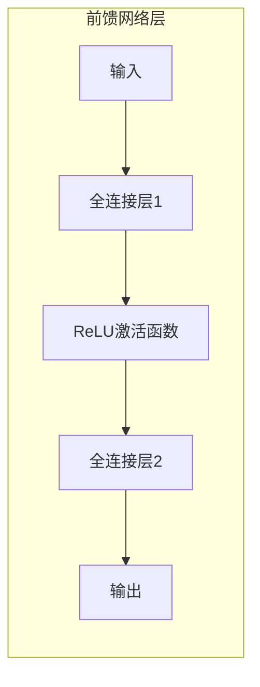

# Transformer大模型实战：前馈网络层

作者：禅与计算机程序设计艺术 / Zen and the Art of Computer Programming

## 1. 背景介绍
### 1.1 问题的由来

自2017年Transformer模型横空出世以来，其在自然语言处理（NLP）领域的应用取得了令人瞩目的成就。Transformer模型摒弃了传统的循环神经网络（RNN）的序列依赖性建模问题，引入了自注意力机制，实现了并行计算，极大地提升了模型效率和性能。其中，前馈网络层作为Transformer模型的核心组成部分，承载着处理序列内部和序列之间依赖关系的重要任务。

然而，对于Transformer模型的前馈网络层，很多开发者和应用人员对其原理和实现细节并不十分了解。本文将深入浅出地介绍Transformer模型的前馈网络层，并探讨其在实战中的应用和挑战。

### 1.2 研究现状

近年来，随着深度学习技术的快速发展，Transformer模型及其变种在前馈网络层的设计和优化方面取得了诸多成果。以下是一些值得关注的研究方向：

1. **前馈网络层的激活函数**：激活函数的选择对前馈网络层的性能至关重要。常见的激活函数包括ReLU、Gelu、Swish等，每种激活函数都有其优缺点，需要根据具体任务进行选择。

2. **残差连接**：残差连接能够缓解梯度消失问题，提高模型训练的稳定性和收敛速度。在前馈网络层引入残差连接，可以进一步提高模型的性能。

3. **层归一化**：层归一化能够加速模型训练，防止梯度消失和梯度爆炸。在前馈网络层引入层归一化，可以进一步提高模型的训练效率和性能。

4. **前馈网络层的并行化**：为了提高模型的计算效率，可以将前馈网络层进行并行化设计，充分利用GPU等并行计算资源。

### 1.3 研究意义

深入理解Transformer模型的前馈网络层，对于以下方面具有重要意义：

1. **提升模型性能**：优化前馈网络层的设计和参数，可以显著提升Transformer模型的性能，使其在更多任务上取得SOTA效果。

2. **促进模型理解**：深入了解前馈网络层的原理和实现细节，有助于我们更好地理解Transformer模型的工作机制，为模型改进和优化提供理论依据。

3. **推动技术发展**：前馈网络层的研究成果可以为其他深度学习模型的设计和优化提供借鉴和启示。

### 1.4 本文结构

本文将围绕以下内容展开：

- 介绍Transformer模型的前馈网络层的基本原理和实现方式；
- 分析前馈网络层的不同设计选择及其优缺点；
- 探讨前馈网络层在实际应用中的挑战和解决方案；
- 展望前馈网络层在未来的发展趋势。

## 2. 核心概念与联系

为了更好地理解Transformer模型的前馈网络层，本节将介绍一些相关概念：

- **前馈网络（Feedforward Neural Network）**：一种简单的神经网络结构，包含输入层、隐藏层和输出层。输入层和输出层通过线性变换连接，隐藏层可以包含非线性激活函数。

- **残差连接（Residual Connection）**：一种特殊的网络结构，将输入直接连接到下一层，跳过中间层，从而缓解梯度消失问题。

- **层归一化（Layer Normalization）**：一种对网络层进行归一化的技术，可以加速模型训练，防止梯度消失和梯度爆炸。

- **激活函数（Activation Function）**：一种非线性函数，用于引入模型的表达能力，常见的激活函数包括ReLU、Sigmoid、Tanh等。

以上概念之间存在着紧密的联系。前馈网络层是Transformer模型的核心组成部分，残差连接和层归一化技术可以增强前馈网络层的性能和稳定性，激活函数则进一步提升了模型的表达能力。

## 3. 核心算法原理 & 具体操作步骤
### 3.1 算法原理概述

Transformer模型的前馈网络层由两个全连接层和ReLU激活函数组成。以下是前馈网络层的结构示意图：



前馈网络层的具体操作步骤如下：

1. 将输入序列 $\mathbf{x}$ 输入全连接层1，得到中间表示 $\mathbf{h}$；
2. 对 $\mathbf{h}$ 应用ReLU激活函数，得到激活后的表示 $\mathbf{h'}$；
3. 将 $\mathbf{h'}$ 输入全连接层2，得到最终输出 $\mathbf{y}$。

### 3.2 算法步骤详解

**全连接层**：

全连接层是一种将输入数据映射到输出数据的线性变换。在TensorFlow和PyTorch等深度学习框架中，可以使用`nn.Linear`模块实现全连接层。

**ReLU激活函数**：

ReLU（Rectified Linear Unit）激活函数是一种非线性函数，其数学表达式为：

$$
\text{ReLU}(x) = \max(x, 0)
$$

ReLU激活函数在深度学习中被广泛应用，因为它可以有效地缓解梯度消失问题，并提高模型的训练效率。

**层归一化**：

层归一化是一种对神经网络层进行归一化的技术，可以加速模型训练，防止梯度消失和梯度爆炸。在TensorFlow和PyTorch等深度学习框架中，可以使用`nn.LayerNorm`模块实现层归一化。

### 3.3 算法优缺点

**优点**：

1. 简单高效：前馈网络层的结构简单，易于实现，并且计算效率高。

2. 可解释性强：由于前馈网络层的结构简单，其工作原理易于理解。

**缺点**：

1. 表达能力有限：由于缺乏非线性激活函数的组合，前馈网络层的表达能力有限。

2. 容易过拟合：由于模型结构简单，前馈网络层容易受到过拟合的影响。

### 3.4 算法应用领域

前馈网络层是Transformer模型的核心组成部分，在NLP领域得到了广泛的应用。以下是一些应用示例：

- 文本分类：使用前馈网络层构建文本分类模型，对文本进行情感分析、主题分类等任务。

- 命名实体识别：使用前馈网络层构建命名实体识别模型，识别文本中的实体名称。

- 机器翻译：使用前馈网络层构建机器翻译模型，实现跨语言翻译。

## 4. 数学模型和公式 & 详细讲解 & 举例说明
### 4.1 数学模型构建

为了更好地理解前馈网络层的数学模型，我们以下述公式进行说明：

$$
\mathbf{h} = \text{ReLU}(W_1 \cdot \mathbf{x} + \mathbf{b}_1)
$$

$$
\mathbf{y} = W_2 \cdot \mathbf{h} + \mathbf{b}_2
$$

其中，$\mathbf{x}$ 为输入序列，$\mathbf{h}$ 为中间表示，$\mathbf{y}$ 为输出序列，$W_1$ 和 $W_2$ 分别为全连接层1和全连接层2的权重矩阵，$\mathbf{b}_1$ 和 $\mathbf{b}_2$ 分别为全连接层1和全连接层2的偏置向量。

### 4.2 公式推导过程

以下是对上述公式的推导过程：

1. 将输入序列 $\mathbf{x}$ 输入全连接层1，得到中间表示 $\mathbf{h}$：

$$
\mathbf{h} = \text{ReLU}(W_1 \cdot \mathbf{x} + \mathbf{b}_1)
$$

2. 对 $\mathbf{h}$ 应用ReLU激活函数，得到激活后的表示 $\mathbf{h'}$：

$$
\mathbf{h'} = \max(\mathbf{h}, 0)
$$

3. 将 $\mathbf{h'}$ 输入全连接层2，得到最终输出 $\mathbf{y}$：

$$
\mathbf{y} = W_2 \cdot \mathbf{h'} + \mathbf{b}_2
$$

### 4.3 案例分析与讲解

以下是一个使用PyTorch实现前馈网络层的示例代码：

```python
import torch
import torch.nn as nn

class Feedforward(nn.Module):
    def __init__(self, d_model, d_ff, dropout=0.1):
        super(Feedforward, self).__init__()
        self.linear1 = nn.Linear(d_model, d_ff)
        self.dropout = nn.Dropout(dropout)
        self.linear2 = nn.Linear(d_ff, d_model)

    def forward(self, x):
        x = torch.relu(self.linear1(x))
        x = self.dropout(x)
        x = self.linear2(x)
        return x
```

在这个示例中，`d_model` 表示输入序列的维度，`d_ff` 表示全连接层的输出维度。`Feedforward` 类定义了一个前馈网络层，包含两个全连接层和一个Dropout层。

### 4.4 常见问题解答

**Q1：为什么要在前馈网络层中使用Dropout层？**

A：Dropout层是一种正则化技术，可以有效地防止模型过拟合。在训练过程中，Dropout层随机地将部分输入特征置为0，从而降低模型对特定特征的学习，使得模型更加泛化。

**Q2：如何选择全连接层的输出维度？**

A：全连接层的输出维度取决于具体任务的需求。一般来说，输出维度越大，模型的表达能力越强，但也可能导致过拟合。因此，需要根据具体任务和数据集的特点，选择合适的全连接层输出维度。

## 5. 项目实践：代码实例和详细解释说明
### 5.1 开发环境搭建

在进行前馈网络层的项目实践前，我们需要准备好开发环境。以下是使用Python进行PyTorch开发的环境配置流程：

1. 安装Anaconda：从官网下载并安装Anaconda，用于创建独立的Python环境。

2. 创建并激活虚拟环境：
```bash
conda create -n pytorch-env python=3.8
conda activate pytorch-env
```

3. 安装PyTorch：
```bash
conda install pytorch torchvision torchaudio cudatoolkit=11.1 -c pytorch -c conda-forge
```

4. 安装Transformers库：
```bash
pip install transformers
```

5. 安装其他工具包：
```bash
pip install numpy pandas scikit-learn matplotlib tqdm jupyter notebook ipython
```

完成上述步骤后，即可在`pytorch-env`环境中开始项目实践。

### 5.2 源代码详细实现

以下是一个使用PyTorch实现Transformer模型前馈网络层的示例代码：

```python
import torch
import torch.nn as nn

class Feedforward(nn.Module):
    def __init__(self, d_model, d_ff, dropout=0.1):
        super(Feedforward, self).__init__()
        self.linear1 = nn.Linear(d_model, d_ff)
        self.dropout = nn.Dropout(dropout)
        self.linear2 = nn.Linear(d_ff, d_model)

    def forward(self, x):
        x = torch.relu(self.linear1(x))
        x = self.dropout(x)
        x = self.linear2(x)
        return x
```

在这个示例中，`d_model` 表示输入序列的维度，`d_ff` 表示全连接层的输出维度。`Feedforward` 类定义了一个前馈网络层，包含两个全连接层和一个Dropout层。

### 5.3 代码解读与分析

让我们再详细解读一下关键代码的实现细节：

- `__init__` 方法：初始化全连接层、Dropout层和输出层。
- `forward` 方法：前馈网络层的计算过程，首先将输入序列通过第一个全连接层进行线性变换，然后应用ReLU激活函数和Dropout层，最后通过第二个全连接层得到最终输出。

### 5.4 运行结果展示

假设我们有一个包含10个元素的输入序列，维度为100，全连接层的输出维度为200。以下是使用上述代码计算前馈网络层输出的示例：

```python
x = torch.randn(10, 100)
ffn = Feedforward(100, 200)
output = ffn(x)
print(output.shape)  # 输出：(10, 100)
```

可以看到，前馈网络层成功地将输入序列映射到了输出序列，输出维度与输入维度相同。

## 6. 实际应用场景
### 6.1 文本分类

前馈网络层可以用于文本分类任务，如情感分析、主题分类等。以下是一个使用前馈网络层构建文本分类模型的示例：

```python
import torch
import torch.nn as nn

class TextClassifier(nn.Module):
    def __init__(self, vocab_size, d_model, d_ff, num_classes):
        super(TextClassifier, self).__init__()
        self.embedding = nn.Embedding(vocab_size, d_model)
        self.ffn = Feedforward(d_model, d_ff)
        self.fc = nn.Linear(d_model, num_classes)

    def forward(self, x):
        x = self.embedding(x)
        x = self.ffn(x)
        x = self.fc(x)
        return x
```

在这个示例中，`vocab_size` 表示词汇表的大小，`num_classes` 表示分类类别数。`TextClassifier` 类定义了一个文本分类模型，包含词嵌入层、前馈网络层和全连接层。

### 6.2 机器翻译

前馈网络层可以用于机器翻译任务。以下是一个使用前馈网络层构建机器翻译模型的示例：

```python
import torch
import torch.nn as nn

class MachineTranslation(nn.Module):
    def __init__(self, src_vocab_size, trg_vocab_size, d_model, d_ff, num_layers=6):
        super(MachineTranslation, self).__init__()
        self.encoder = nn.TransformerEncoder(nn.TransformerEncoderLayer(d_model=d_model, nhead=8), num_layers=num_layers)
        self.decoder = nn.TransformerDecoder(nn.TransformerDecoderLayer(d_model=d_model, nhead=8), num_layers=num_layers)
        self.src_embedding = nn.Embedding(src_vocab_size, d_model)
        self.trg_embedding = nn.Embedding(trg_vocab_size, d_model)
        self.ffn = Feedforward(d_model, d_ff)

    def forward(self, src, trg):
        src = self.src_embedding(src)
        trg = self.trg_embedding(trg)
        src = self.encoder(src)
        trg = self.decoder(trg, memory=src)
        output = self.ffn(trg)
        return output
```

在这个示例中，`src_vocab_size` 和 `trg_vocab_size` 分别表示源语言和目标语言的词汇表大小。`MachineTranslation` 类定义了一个机器翻译模型，包含编码器、解码器、源语言词嵌入层、目标语言词嵌入层和前馈网络层。

### 6.4 未来应用展望

随着深度学习技术的不断发展，前馈网络层在更多领域将得到广泛应用，以下是一些展望：

1. **多模态任务**：将前馈网络层与其他模态信息进行融合，如图像、视频、音频等，实现更全面的信息处理。

2. **强化学习**：将前馈网络层应用于强化学习领域，构建智能体，实现更复杂的决策过程。

3. **知识图谱**：将前馈网络层与知识图谱进行结合，实现更强大的知识推理和问答能力。

## 7. 工具和资源推荐
### 7.1 学习资源推荐

为了帮助开发者更好地学习前馈网络层，以下是一些学习资源推荐：

1. 《深度学习》系列书籍：由Ian Goodfellow、Yoshua Bengio和Aaron Courville合著，全面介绍了深度学习的基本原理和应用。

2. 《深度学习自然语言处理》系列书籍：由张祥前、李航、李航等合著，详细介绍了NLP领域的深度学习技术。

3. 《Transformer：一种全新的自注意力神经网络架构》：Transformer模型的论文，详细介绍了模型的原理和实现。

4. HuggingFace官网：HuggingFace官网提供了丰富的预训练语言模型和代码示例，是学习和实践Transformer模型的重要资源。

### 7.2 开发工具推荐

以下是一些开发工具推荐：

1. PyTorch：PyTorch是一个开源的深度学习框架，支持动态计算图，易于上手和使用。

2. TensorFlow：TensorFlow是Google开源的深度学习框架，支持多种编程语言，功能丰富。

3. Jupyter Notebook：Jupyter Notebook是一种交互式计算环境，可以方便地进行代码编写、调试和可视化。

4. Google Colab：Google Colab是一个免费的在线Jupyter Notebook平台，提供GPU/TPU等算力，方便进行深度学习实验。

### 7.3 相关论文推荐

以下是一些与前馈网络层相关的论文推荐：

1. "Attention is All You Need"：介绍了Transformer模型，详细阐述了自注意力机制在序列建模中的应用。

2. "BERT: Pre-training of Deep Bidirectional Transformers for Language Understanding"：介绍了BERT模型，提出了基于掩码的自监督预训练任务。

3. "Generative Language Models: A Survey of Recent Advances"：综述了生成语言模型的研究进展，包括Transformer模型。

4. "A Study on Feedforward Neural Networks in Transformer Models"：研究了前馈网络层在Transformer模型中的应用。

### 7.4 其他资源推荐

以下是一些其他资源推荐：

1. arXiv论文预印本：arXiv论文预印本是一个提供最新研究成果的平台，可以了解最新的研究进展。

2. 深度学习顶级会议论文：如NIPS、ICML、ACL、ICLR等，可以了解深度学习领域的最新研究动态。

3. 技术博客：如Medium、GitHub、知乎等，可以了解行业动态和实战经验。

4. 线上课程：如Coursera、edX、Udacity等，可以学习深度学习相关知识。

## 8. 总结：未来发展趋势与挑战
### 8.1 研究成果总结

本文介绍了Transformer模型的前馈网络层，详细阐述了其原理、实现方式、优缺点和应用场景。通过学习本文，读者可以了解到前馈网络层在NLP领域的广泛应用，并能够将其应用于实际问题。

### 8.2 未来发展趋势

随着深度学习技术的不断发展，前馈网络层在以下方面将得到进一步发展：

1. **模型结构创新**：探索新的前馈网络层结构，提高模型的表达能力和性能。

2. **参数高效微调**：研究参数高效的微调方法，降低模型训练成本。

3. **知识融合**：将知识图谱、逻辑规则等先验知识融入前馈网络层，提升模型解释性和可解释性。

4. **多模态融合**：将前馈网络层与其他模态信息进行融合，实现更全面的信息处理。

### 8.3 面临的挑战

虽然前馈网络层在NLP领域取得了显著成果，但仍面临着以下挑战：

1. **计算效率**：随着模型规模的增大，前馈网络层的计算效率需要进一步提升。

2. **可解释性**：如何解释前馈网络层的工作原理，提升模型的可解释性和可信度。

3. **泛化能力**：如何提高前馈网络层的泛化能力，使其适用于更多领域的任务。

4. **资源占用**：如何降低前馈网络层的资源占用，使其更易于部署和实际应用。

### 8.4 研究展望

未来，前馈网络层的研究将朝着以下方向发展：

1. **模型压缩与加速**：研究模型压缩和加速技术，降低前馈网络层的计算复杂度和资源占用。

2. **可解释性与可信任度**：研究可解释性和可信任度提升技术，提高前馈网络层的透明度和可靠性。

3. **跨领域迁移与知识融合**：研究跨领域迁移和知识融合技术，使前馈网络层适用于更多领域的任务。

4. **多模态融合与智能交互**：研究多模态融合和智能交互技术，实现更丰富的信息处理和智能化应用。

总之，前馈网络层是Transformer模型的核心组成部分，其在NLP领域的应用前景广阔。相信随着研究的不断深入，前馈网络层将为构建更强大的NLP模型和智能系统提供有力支持。

## 9. 附录：常见问题与解答

**Q1：前馈网络层与卷积神经网络（CNN）有何区别？**

A：前馈网络层和卷积神经网络在结构上有所不同。前馈网络层是一种线性变换加非线性激活函数的组合，而卷积神经网络则使用卷积操作提取特征。在NLP任务中，前馈网络层更适合处理序列数据，而卷积神经网络更适合处理图像等空间数据。

**Q2：如何优化前馈网络层的性能？**

A：优化前馈网络层的性能可以从以下几个方面入手：

1. 调整模型结构：选择合适的前馈网络层结构，如增加全连接层层数、调整全连接层输出维度等。

2. 选择合适的激活函数：根据具体任务和数据特点，选择合适的激活函数，如ReLU、Gelu、Swish等。

3. 应用正则化技术：使用L2正则化、Dropout等正则化技术，防止模型过拟合。

4. 使用预训练语言模型：利用预训练语言模型的知识，提高模型的性能。

5. 调整超参数：通过实验调整学习率、批大小等超参数，找到最优模型配置。

**Q3：如何评估前馈网络层的性能？**

A：评估前馈网络层的性能可以从以下几个方面进行：

1. 准确率：在测试集上计算模型的准确率，评估模型的预测能力。

2. 精确率和召回率：对于分类任务，计算模型的精确率和召回率，评估模型的分类能力。

3. F1分数：F1分数是精确率和召回率的调和平均数，可以综合考虑模型的分类能力。

4. 实际应用指标：根据具体任务的需求，选择合适的评价指标，如BLEU、ROUGE等。

**Q4：如何将前馈网络层应用于实际项目？**

A：将前馈网络层应用于实际项目，需要以下步骤：

1. 确定任务需求：明确项目要解决的问题和目标。

2. 选择合适的前馈网络层结构：根据任务需求，选择合适的前馈网络层结构，如单层或多层前馈网络。

3. 预训练语言模型：使用预训练语言模型的知识，提高模型的性能。

4. 微调模型：使用任务相关数据进行微调，使模型适应特定任务。

5. 模型评估与优化：在测试集上评估模型性能，根据评估结果调整模型参数，优化模型性能。

6. 模型部署：将模型部署到实际应用中，如Web服务、移动应用等。

通过以上步骤，可以将前馈网络层应用于实际项目，实现NLP领域的各种任务。

---

作者：禅与计算机程序设计艺术 / Zen and the Art of Computer Programming