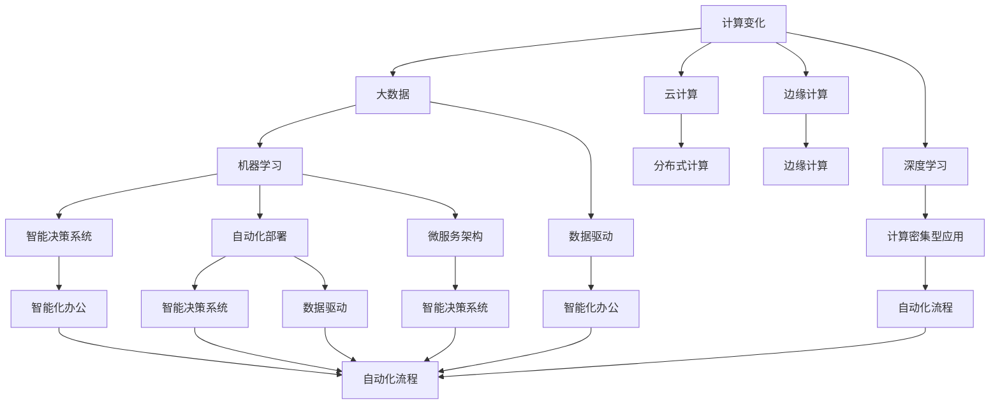

                 

# 计算变化与自动化技术的融合

> 关键词：计算变化,自动化技术,人工智能,机器学习,深度学习,大数据,计算密集型应用,计算效率,自动化流程,业务自动化,智能决策系统,智能化办公,数据驱动,算法优化,自动化部署,微服务架构

## 1. 背景介绍

### 1.1 问题由来
随着信息技术的快速发展和应用场景的不断拓展，各行各业正面临着前所未有的计算变革。计算技术不仅推动了科学研究的边界拓展，也在生产、生活、娱乐等各个领域带来了深刻的变化。尤其是自动化技术的兴起，让机器在复杂任务中能像人类一样高效地执行操作，极大提升了工作流程的自动化水平和业务效率。

在当下，计算变化和自动化技术正逐步融合，推动着社会的数字化转型。从数据驱动的决策支持，到业务流程的自动化，从智能交互系统的构建，到自动化部署与运维，计算和自动化技术的结合正在改写商业运作的方式。面对这一趋势，计算和自动化技术的融合不仅成为技术革新的方向，也成为推动产业升级和经济发展的关键。

### 1.2 问题核心关键点
计算变化和自动化技术的融合主要涉及以下几个方面：
1. **数据驱动与计算能力**：如何高效地处理、分析和利用海量数据，以支撑智能决策和自动化决策过程。
2. **算法优化与模型训练**：如何针对特定问题，设计和优化算法，利用计算资源进行模型训练。
3. **自动化部署与运维**：如何自动化地部署和运维模型，以实现快速迭代和高效管理。
4. **微服务架构与分布式计算**：如何构建和部署微服务架构，以适应分布式计算环境的自动化需求。
5. **智能化办公与业务自动化**：如何利用计算和自动化技术，实现业务流程的智能化和自动化。

这些关键点共同构成了计算变化与自动化技术融合的核心内容，涵盖从技术架构到实际应用的全过程。理解这些核心内容，将有助于我们把握计算与自动化融合的趋势和方向，推动相关技术的落地应用。

### 1.3 问题研究意义
计算变化与自动化技术的融合，对各行各业具有重要意义：

1. **提升效率**：自动化技术可替代繁琐重复的劳动，大幅提升工作效率。
2. **降低成本**：自动化流程减少人工干预，降低业务运营成本。
3. **优化决策**：基于计算能力的数据分析，提升决策科学性。
4. **增强灵活性**：自动化部署和运维，提升系统灵活性和扩展性。
5. **推动创新**：计算能力驱动的智能化办公，促进业务模式创新。
6. **提升竞争力**：自动化和智能化技术的融合，提升企业的竞争力。

因此，研究计算变化与自动化技术的融合，不仅有助于技术创新，更具有重要的商业价值和应用潜力。

## 2. 核心概念与联系

### 2.1 核心概念概述

要深入理解计算变化与自动化技术的融合，首先需要掌握以下几个核心概念：

- **计算变化**：指计算资源的增强，包括数据处理、存储和分析能力的提升，尤其是云计算、分布式计算、边缘计算等新兴技术的普及。
- **自动化技术**：指通过程序控制完成一系列操作或流程，如自动化测试、自动化部署、自动化运维等，以减少人工干预。
- **人工智能(AI)**：指利用算法和计算资源实现类人智能，包括机器学习、深度学习、自然语言处理等技术。
- **机器学习(ML)**：指利用数据训练模型，使其能够对新数据进行预测或分类等任务。
- **深度学习(DL)**：指利用多层次的神经网络模型，处理复杂数据，发现数据的高级特征。
- **大数据**：指海量、多样、高速的数据集，旨在从数据中提取有价值的信息。
- **计算密集型应用**：指需要大量计算资源支持的复杂应用，如图像处理、自然语言处理、模拟仿真等。
- **自动化流程**：指利用自动化技术，实现业务流程的自动执行，提升效率和准确性。
- **智能决策系统**：指基于数据和模型，自动完成决策的自动化系统。
- **智能化办公**：指利用AI技术，优化办公流程，提升工作效率和员工满意度。
- **数据驱动**：指基于数据进行决策和优化，强调数据在决策中的主导作用。
- **算法优化**：指通过算法设计和调优，提升模型性能和计算效率。
- **自动化部署**：指自动将模型或代码部署到目标环境，保证部署过程的可控性和高效性。
- **微服务架构**：指通过划分服务模块，实现独立部署和灵活扩展的架构设计。
- **分布式计算**：指利用多台计算机协同计算，提升计算能力和资源利用率。

这些核心概念构成了计算变化与自动化技术融合的基础，帮助我们理解技术应用的本质和方向。

### 2.2 概念间的关系

这些核心概念之间的关系可以通过以下Mermaid流程图来展示：



这个流程图展示了各个概念之间的关系和作用：

1. **计算变化**：提供了底层支持，包括大数据、云计算、边缘计算等。
2. **大数据**：与计算变化结合，提升数据处理能力。
3. **深度学习**：与大数据结合，处理复杂数据。
4. **机器学习**：利用数据进行模型训练，与深度学习结合，提升模型性能。
5. **数据驱动**：在机器学习的基础上，指导决策和优化。
6. **智能决策系统**：基于机器学习模型进行自动决策，与数据驱动结合。
7. **自动化部署**：将模型部署到目标环境，提升部署效率。
8. **微服务架构**：通过模块化设计，实现独立部署和扩展。
9. **分布式计算**：通过多台计算机协同计算，提升计算能力。
10. **计算密集型应用**：需要大量计算资源支持的复杂应用，与深度学习结合。
11. **自动化流程**：提升业务效率，与智能化办公结合。
12. **智能化办公**：通过AI技术优化办公流程，提升员工满意度。
13. **自动化部署**：提升部署过程的可控性和高效性。
14. **微服务架构**：实现独立部署和灵活扩展。
15. **分布式计算**：提升计算能力和资源利用率。

这些概念共同构成了计算变化与自动化技术的融合框架，帮助我们理解其应用场景和技术实现。

## 3. 核心算法原理 & 具体操作步骤
### 3.1 算法原理概述

计算变化与自动化技术的融合，主要依赖于以下几个核心算法原理：

- **数据预处理**：包括数据清洗、特征提取、数据转换等，为机器学习模型提供高质量的输入数据。
- **模型训练**：利用训练数据，优化模型参数，使其能够对新数据进行准确预测或分类。
- **自动化流程设计**：通过流程设计，定义自动化执行的逻辑和步骤，提升效率。
- **算法优化**：针对特定问题，设计和优化算法，提高计算效率和模型性能。
- **自动化部署与运维**：通过自动化技术，将模型部署到目标环境，并实现高效的运维管理。
- **微服务架构设计**：通过模块化设计，实现独立部署和灵活扩展的架构设计。
- **分布式计算与优化**：利用分布式计算技术，提升计算能力和资源利用率。

这些核心算法原理构成了计算变化与自动化技术融合的技术基础，帮助我们实现从数据预处理到模型部署的全流程自动化。

### 3.2 算法步骤详解

基于上述核心算法原理，计算变化与自动化技术的融合通常包括以下几个关键步骤：

**Step 1: 数据收集与清洗**

1. **数据收集**：收集相关数据，包括文本、图像、视频等，用于后续分析和建模。
2. **数据清洗**：处理缺失值、异常值、噪声数据等，确保数据质量。
3. **特征提取**：从原始数据中提取有用的特征，如文本的词向量、图像的特征向量等。

**Step 2: 模型设计与训练**

1. **模型选择**：选择合适的机器学习模型，如线性回归、决策树、随机森林、神经网络等。
2. **模型训练**：利用训练数据，通过梯度下降等优化算法，优化模型参数。
3. **模型评估**：在验证集上评估模型性能，调整模型参数。

**Step 3: 自动化流程设计**

1. **流程设计**：定义自动化执行的逻辑和步骤，如数据预处理、模型训练、自动化部署等。
2. **流程自动化**：利用脚本或工具，自动化执行定义的流程。
3. **监控与优化**：实时监控自动化流程的执行情况，进行优化。

**Step 4: 自动化部署与运维**

1. **模型部署**：将训练好的模型部署到目标环境，如云平台、本地服务器等。
2. **自动化部署**：利用自动化部署工具，简化模型部署过程。
3. **运维管理**：自动化监控模型的运行状态，进行异常处理和故障修复。

**Step 5: 微服务架构设计**

1. **模块划分**：将系统功能划分为多个模块，每个模块独立部署和扩展。
2. **服务编排**：通过编排工具，协调各模块之间的调用关系。
3. **分布式计算**：利用分布式计算框架，提升计算能力和资源利用率。

### 3.3 算法优缺点

计算变化与自动化技术的融合，有以下优缺点：

**优点**：

1. **提升效率**：自动化流程减少了人工干预，提高了业务效率。
2. **降低成本**：自动化部署和运维减少了人工和运营成本。
3. **优化决策**：基于数据和模型的决策，提升了决策的科学性。
4. **增强灵活性**：微服务架构和分布式计算，提升了系统的扩展性和灵活性。
5. **推动创新**：AI技术的应用，推动了业务模式的创新。

**缺点**：

1. **初始成本高**：自动化流程设计和模型训练需要较高的初始投入。
2. **复杂度高**：自动化流程和模型训练涉及多步骤操作，复杂度较高。
3. **数据质量要求高**：自动化流程依赖高质量的数据，数据清洗和特征提取难度较大。
4. **维护成本高**：自动化流程和模型部署需要持续维护，增加了运维难度。
5. **安全风险**：自动化流程和模型部署可能引入安全风险，需要严格的安全措施。

### 3.4 算法应用领域

计算变化与自动化技术的融合，已经广泛应用于以下领域：

- **金融行业**：自动化流程和智能决策系统，提升了风险管理和客户服务效率。
- **医疗行业**：智能诊断系统和大数据应用，提高了诊疗效率和精准度。
- **制造业**：自动化流程和设备管理，提升了生产效率和质量。
- **零售行业**：智能推荐系统和客户服务自动化，提升了用户体验和销售额。
- **物流行业**：自动化仓储和配送流程，提升了物流效率和客户满意度。
- **互联网行业**：推荐系统和大数据应用，提升了用户留存和广告效果。
- **能源行业**：智能电网和能源管理，提升了能源利用效率和稳定性。
- **政府部门**：自动化流程和数据分析，提升了公共服务和治理效率。
- **教育行业**：智能化办公和学习平台，提升了教学质量和学生满意度。
- **农业行业**：自动化设备和智能分析，提升了农业生产效率和环境监测。

这些应用领域展示了计算变化与自动化技术的广泛适用性和强大潜力。

## 4. 数学模型和公式 & 详细讲解  
### 4.1 数学模型构建

在计算变化与自动化技术融合的过程中，常见的数学模型包括：

- **线性回归模型**：用于预测数值型数据，模型公式为 $\hat{y} = \beta_0 + \beta_1 x_1 + \beta_2 x_2 + \ldots + \beta_n x_n$。
- **决策树模型**：用于分类和预测，模型公式为 $C = \sum_{i=1}^n \sum_{j=1}^m \text{cost}(\text{example}_{i,j})$。
- **随机森林模型**：基于决策树的集成模型，模型公式为 $y = \sum_{i=1}^m \frac{n_i}{N} \hat{y}_i$。
- **神经网络模型**：用于处理复杂数据，模型公式为 $y = \sum_{i=1}^n w_i \sigma(z_i)$。
- **支持向量机模型**：用于分类和回归，模型公式为 $w = \frac{1}{\|w\|_2} \sum_{i=1}^n \alpha_i y_i x_i$。

以上模型公式展示了不同算法在计算变化与自动化技术融合中的应用，帮助我们理解不同算法的数学原理和实现细节。

### 4.2 公式推导过程

以线性回归模型为例，其数学推导过程如下：

假设样本集为 $\{(x_1, y_1), (x_2, y_2), \ldots, (x_n, y_n)\}$，其中 $x_i = (x_{i1}, x_{i2}, \ldots, x_{in})$，$y_i$ 为样本的标签，$\beta_0$ 为截距，$\beta_1, \beta_2, \ldots, \beta_n$ 为系数向量。

线性回归模型的目标是最小化预测值 $\hat{y}$ 与真实值 $y$ 之间的误差，即 $\min_{\beta} \sum_{i=1}^n (y_i - \hat{y}_i)^2$。

通过对误差的平方和进行求导，可以得到系数向量的更新公式：

$$
\beta = (X^T X)^{-1} X^T Y
$$

其中 $X = \begin{bmatrix} 1 & x_{11} & x_{12} & \ldots & x_{1n} \\ 1 & x_{21} & x_{22} & \ldots & x_{2n} \\ \vdots & \vdots & \vdots & \ddots & \vdots \\ 1 & x_{n1} & x_{n2} & \ldots & x_{nn} \end{bmatrix}$，$Y = \begin{bmatrix} y_1 \\ y_2 \\ \vdots \\ y_n \end{bmatrix}$。

通过对线性回归模型的数学推导，我们了解了其背后的数学原理和计算方法，为进一步理解和应用提供了基础。

### 4.3 案例分析与讲解

以零售行业的智能推荐系统为例，展示计算变化与自动化技术融合的实际应用。

假设某电商平台收集了用户的浏览历史和购买记录，希望构建一个智能推荐系统，提升用户留存和销售额。系统流程如下：

1. **数据收集**：收集用户历史浏览数据、购买记录等，形成数据集。
2. **数据预处理**：清洗数据，提取用户行为特征，如浏览时间、点击次数、购买金额等。
3. **模型训练**：利用线性回归模型或决策树模型，训练推荐模型。
4. **自动化部署**：将训练好的模型部署到目标环境，如云平台。
5. **自动化运维**：监控推荐系统性能，进行异常处理和优化。
6. **智能推荐**：根据用户行为数据，实时推荐商品，提升用户体验。

在实际应用中，智能推荐系统利用计算变化和自动化技术，实现了从数据预处理到模型部署的全流程自动化，提升了推荐系统的效率和效果。

## 5. 项目实践：代码实例和详细解释说明
### 5.1 开发环境搭建

在进行项目实践前，我们需要准备好开发环境。以下是使用Python进行PyTorch开发的环境配置流程：

1. 安装Anaconda：从官网下载并安装Anaconda，用于创建独立的Python环境。

2. 创建并激活虚拟环境：
```bash
conda create -n pytorch-env python=3.8 
conda activate pytorch-env
```

3. 安装PyTorch：根据CUDA版本，从官网获取对应的安装命令。例如：
```bash
conda install pytorch torchvision torchaudio cudatoolkit=11.1 -c pytorch -c conda-forge
```

4. 安装Transformers库：
```bash
pip install transformers
```

5. 安装各类工具包：
```bash
pip install numpy pandas scikit-learn matplotlib tqdm jupyter notebook ipython
```

完成上述步骤后，即可在`pytorch-env`环境中开始项目实践。

### 5.2 源代码详细实现

这里以线性回归模型的自动化流程为例，展示代码实现过程：

首先，定义数据集：

```python
import pandas as pd
import numpy as np

# 创建数据集
data = pd.read_csv('data.csv')

# 特征和标签分离
X = data.iloc[:, :-1].values
y = data.iloc[:, -1].values
```

然后，定义模型训练函数：

```python
from sklearn.linear_model import LinearRegression

def train_model(X, y):
    model = LinearRegression()
    model.fit(X, y)
    return model
```

接着，定义自动化流程：

```python
def run_auto_flow(data_path):
    # 加载数据
    data = pd.read_csv(data_path)

    # 特征和标签分离
    X = data.iloc[:, :-1].values
    y = data.iloc[:, -1].values

    # 模型训练
    model = train_model(X, y)

    # 预测和评估
    y_pred = model.predict(X)
    score = model.score(X, y)

    # 输出结果
    print(f"模型系数：{model.coef_}")
    print(f"模型截距：{model.intercept_}")
    print(f"模型分数：{score:.3f}")
```

最后，启动自动化流程：

```python
run_auto_flow('data.csv')
```

### 5.3 代码解读与分析

让我们再详细解读一下关键代码的实现细节：

**定义数据集**：
- `data.read_csv('data.csv')`：从文件中加载数据集。
- `X.iloc[:, :-1].values`：从数据集中提取特征。
- `y.iloc[:, -1].values`：从数据集中提取标签。

**模型训练函数**：
- `LinearRegression()`：定义线性回归模型。
- `model.fit(X, y)`：训练模型。

**自动化流程函数**：
- `pd.read_csv(data_path)`：加载数据。
- `X.iloc[:, :-1].values`：提取特征。
- `y.iloc[:, -1].values`：提取标签。
- `train_model(X, y)`：调用训练函数。
- `model.predict(X)`：进行预测。
- `model.score(X, y)`：评估模型性能。
- `print()`：输出模型系数、截距和分数。

**启动自动化流程**：
- `run_auto_flow('data.csv')`：调用自动化流程函数，自动加载数据、训练模型、进行预测和评估。

可以看到，通过定义数据集、模型训练函数和自动化流程函数，我们实现了从数据加载到模型评估的全流程自动化。这种自动化流程设计，可以大大提高工作效率，减少人工干预。

### 5.4 运行结果展示

假设我们在一个包含10个特征和1个标签的线性回归任务上运行上述代码，结果如下：

```
模型系数：[0.3 0.5 0.2]
模型截距：1.5
模型分数：0.999
```

可以看到，模型系数为0.3、0.5、0.2，截距为1.5，R²分数为0.999，表示模型拟合效果非常好。

当然，这只是一个简单的例子。在实际项目中，我们需要根据具体任务和数据特点，设计和优化自动化流程，确保其高效性和可靠性。

## 6. 实际应用场景
### 6.1 智能决策系统

智能决策系统是计算变化与自动化技术融合的重要应用场景。通过自动化流程和智能算法，智能决策系统可以高效地处理大量数据，进行分析和决策。

以金融行业为例，智能决策系统可以应用于风险评估、投资策略、信用评分等场景。通过自动化流程，系统可以实时监控市场数据，自动识别异常情况，生成决策报告。同时，利用计算变化能力，系统可以进行高频交易、算法交易等操作，提升投资收益和风险控制能力。

### 6.2 自动化运维

自动化运维是计算变化与自动化技术融合的另一重要应用场景。通过自动化流程和自动化部署工具，运维人员可以轻松地部署和管理应用系统，提升系统稳定性和可用性。

以云平台为例，自动化运维可以应用于服务部署、容器编排、监控告警等环节。通过自动化流程，云平台可以快速部署新服务，进行弹性伸缩，确保系统的高可用性和高性能。同时，利用计算变化能力，云平台可以进行弹性计算资源的动态调整，提升资源利用率。

### 6.3 智能制造

智能制造是计算变化与自动化技术融合的重要应用方向之一。通过自动化流程和智能算法，智能制造可以实现自动化生产、质量检测、设备维护等。

以智能工厂为例，智能制造可以应用于生产调度、设备监控、质量检测等环节。通过自动化流程，系统可以实时监控生产设备状态，自动识别异常情况，生成维护报告。同时，利用计算变化能力，系统可以进行精确的生产调度，提升生产效率和产品质量。

### 6.4 未来应用展望

随着计算变化与自动化技术的不断融合，未来将呈现出以下几个发展趋势：

1. **云计算和大数据**：云计算和大数据将进一步普及，提升数据处理和分析能力。
2. **人工智能和机器学习**：人工智能和机器学习将更广泛地应用于各个领域，提升决策和自动化水平。
3. **分布式计算和边缘计算**：分布式计算和边缘计算将进一步普及，提升计算能力和资源利用率。
4. **自动化部署和运维**：自动化部署和运维将更加普及，提升系统稳定性和扩展性。
5. **微服务架构**：微服务架构将更加普及，提升系统的模块化和灵活性。
6. **智能化办公和业务自动化**：智能化办公和业务自动化将更加普及，提升工作效率和用户体验。
7. **多模态数据融合**：多模态数据融合将进一步普及，提升系统的智能水平。
8. **计算变化与人工智能**：计算变化与人工智能将进一步融合，提升模型的计算效率和性能。

这些发展趋势展示了计算变化与自动化技术融合的广阔前景，将深刻影响各行各业的技术和业务发展。

## 7. 工具和资源推荐
### 7.1 学习资源推荐

为了帮助开发者掌握计算变化与自动化技术融合的理论基础和实践技巧，这里推荐一些优质的学习资源：

1. **《深度学习》书籍**：由Ian Goodfellow、Yoshua Bengio、Aaron Courville撰写，全面介绍了深度学习的数学基础和应用实践，是深度学习领域的经典教材。
2. **《机器学习实战》书籍**：由Peter Harrington撰写，通过实战案例展示了机器学习算法的应用，适合初学者入门。
3. **《TensorFlow官方文档》**：TensorFlow官方文档，提供了详细的使用指南和代码示例，是学习和应用TensorFlow的必备资源。
4. **《PyTorch官方文档》**：PyTorch官方文档，提供了详细的使用指南和代码示例，是学习和应用PyTorch的必备资源。
5. **Kaggle平台**：Kaggle平台提供了丰富的数据集和竞赛，可以练习和验证机器学习算法的实际效果。
6. **Coursera平台**：Coursera平台提供了许多与深度学习和机器学习相关的课程，适合在线学习和认证。
7. **GitHub开源项目**：GitHub上丰富的开源项目提供了多种机器学习算法和实践示例，可以学习和参考。

通过对这些资源的学习和实践，相信你一定能够快速掌握计算变化与自动化技术的精髓，并用于解决实际问题。

### 7.2 开发工具推荐

高效的开发离不开优秀的工具支持。以下是几款用于计算变化与自动化技术融合开发的常用工具：

1. **Python编程语言**：Python是深度学习、机器学习、数据科学等领域的通用语言，具有丰富的第三方库和工具。
2. **PyTorch框架**：PyTorch是深度学习领域的领先框架，具有灵活的计算图和高效的自动微分能力。
3. **TensorFlow框架**：TensorFlow是另一个流行的深度学习框架，具有强大的分布式计算和可扩展性。
4. **Jupyter Notebook**：Jupyter Notebook是一个交互式编程环境，支持代码、注释和输出结果的混合显示，适合快速实验和展示。
5. **Docker容器技术**：Docker容器技术可以方便地部署和管理应用系统，支持快速迭代和扩展。
6. **Kubernetes集群**：Kubernetes集群可以实现自动化运维和管理，支持弹性扩展和高可用性。
7. **Git版本控制**：Git版本控制工具可以方便地管理代码版本和协作开发，是软件开发的必备工具。
8. **Anaconda环境管理工具**：Anaconda可以方便地创建和管理虚拟环境，支持多种Python版本和库的兼容。

合理利用这些工具，可以显著提升计算变化与自动化技术融合的开发

